# 因果关系的数学语言：从柯西分布到因果推理的理论突破

## 引言：一个改变AI数学基础的发现

在探索人工智能的数学基础时，我们已经见证了正态分布如何为统计机器学习奠定理论基石。从线性回归到深度神经网络，正态分布的数学性质使得"模式识别"成为可能。然而，当我们试图让AI从"识别模式"进步到"理解因果"时，我发现了一个深刻的数学事实：

**柯西分布是因果关系的自然数学语言，正如正态分布是统计推断的自然数学语言。**

这一发现不仅有着坚实的理论基础，更通过完整的CausalEngine系统得到了实验验证。


## 理论发现：因果推理的数学必然性

DiscoSCM 是首个将个体置于核心地位的因果建模框架，是我们研究因果关系的基础.


### 从DiscoSCM到个体选择变量$U$

当我们面临"如何实现真正的因果预测"这一根本问题时，传统的统计机器学习方法试图通过学习条件分布$P(Y|X)$来解决，但这种方法存在着根本性的局限——它无法捕捉真正的因果关系结构。

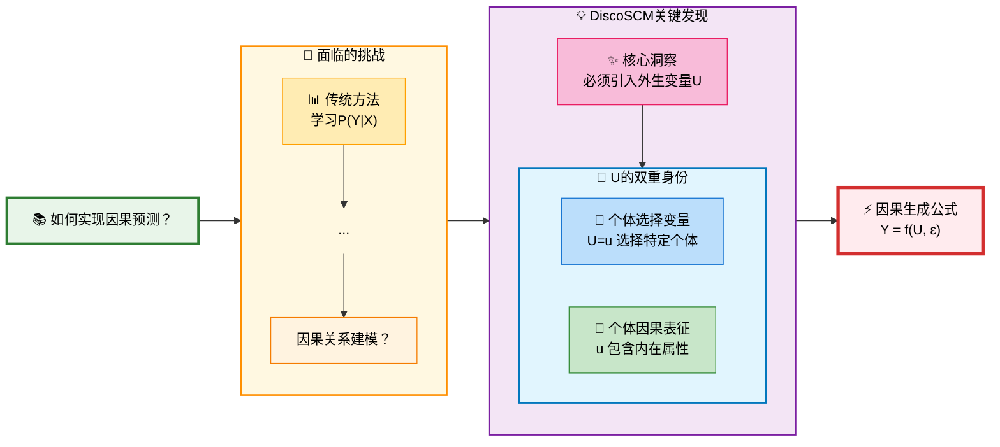

正是在这一背景下，DiscoSCM框架提出了革命性的解决方案。**DiscoSCM的核心洞察**是：任何真正的因果系统都必然包含一个外生的"个体选择变量"$U$，它具有双重身份：

1. **个体选择变量**：$U=u$代表从所有可能个体中"选择"了特定个体$u$
2. **个体因果表征**：向量$u \in \mathbb{R}^d$包含了该个体所有内在的、驱动其行为的潜在属性

这一发现的数学表达是：
$$Y = f(U, \varepsilon)$$
其中$f$是对所有个体普适的因果机制，$U$是个体选择变量，$\varepsilon$是外生噪声。**关键洞察**在于：相同的因果律$f$应用于不同个体$U=u$时，产生不同的结果$Y$，个体差异成为了系统性差异的最终来源。

### 柯西分布的理论必然性

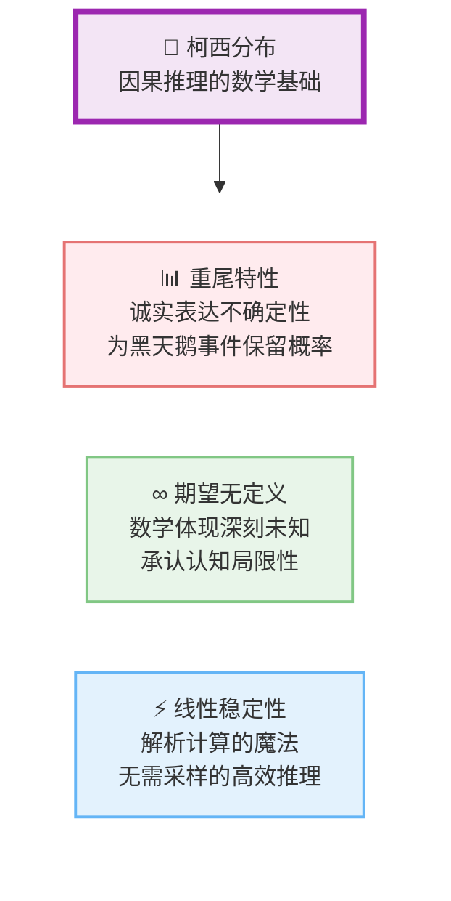
当我们深入研究$U$的数学性质时，发现了柯西分布出现的三重理论必然性：

#### 1. 开放世界的诚实表达

现实世界中，我们从有限的证据$X$推断个体$U$时面临根本性的不确定性。传统的高斯分布等"轻尾"分布隐含了"封闭世界"假设，但这在因果推理中是不合适的。

柯西分布的概率密度函数为：
$$p(u) = \frac{1}{\pi \gamma \left[1 + \left(\frac{u-\mu}{\gamma}\right)^2\right]}$$

其重尾特性（$p(u) \propto u^{-2}$当$u \to \infty$）诚实地表达了"我们永远无法完全确定一个个体到底是什么样的"这一认知局限。数学上，柯西分布为远离中心的"黑天鹅"事件保留了不可忽略的概率：

$$\lim_{u \to \infty} u^2 \cdot p(u) = \frac{1}{\pi \gamma} > 0$$

#### 2. 深刻未知的数学体现

更深刻的是，柯西分布的期望和方差在数学上是无定义的：
$$\mathbb{E}[U] = \int_{-\infty}^{\infty} u \cdot p(u) \, du = \text{不收敛}$$
$$\text{Var}[U] = \mathbb{E}[U^2] - (\mathbb{E}[U])^2 = \text{无定义}$$

这恰好对应了因果推理中的一个哲学事实：我们甚至无法为一个个体群体计算出稳定收敛的"平均画像"。这从数学根源上承认了我们认知的局限性。

#### 3. 线性稳定性的计算魔法

柯西分布具有独特的线性稳定性定理：

**定理（柯西分布的可加性）**：若$X_1 \sim \text{Cauchy}(\mu_1, \gamma_1)$，$X_2 \sim \text{Cauchy}(\mu_2, \gamma_2)$且相互独立，则：
$$X_1 + X_2 \sim \text{Cauchy}(\mu_1 + \mu_2, \gamma_1 + \gamma_2)$$

**推广**：对于线性组合$Y = \sum_{i=1}^n a_i X_i$，有：
$$Y \sim \text{Cauchy}\left(\sum_{i=1}^n a_i \mu_i, \sum_{i=1}^n |a_i| \gamma_i\right)$$

这一数学性质使得我们可以在整个因果推理过程中保持分布形式不变，实现高效的解析计算，无需耗时的蒙特卡洛采样。

## 理论架构：因果推理的双层哲学

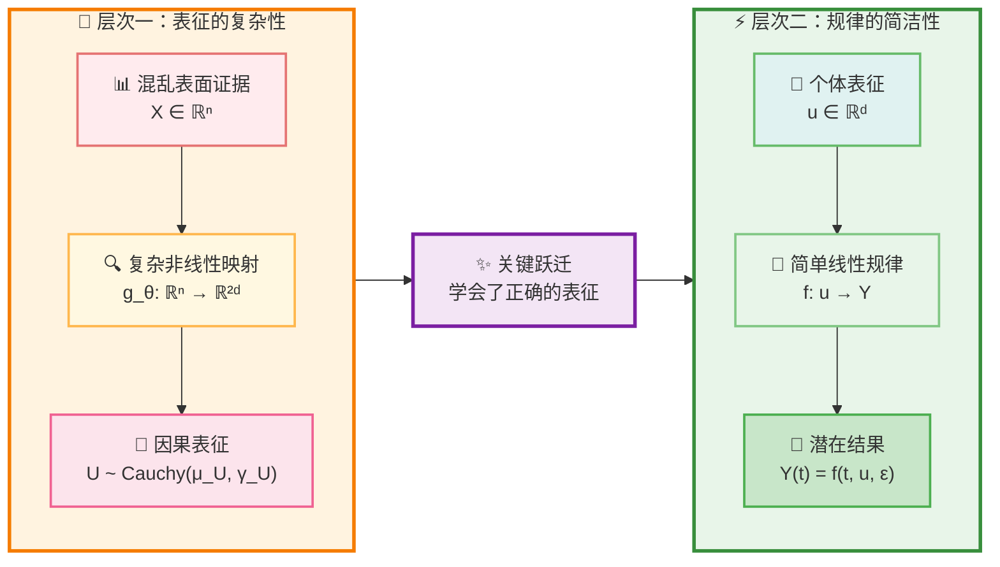

基于上述数学发现，我提出了因果推理的双层理论架构：

### 层次一：表征的复杂性

**归因推断过程**：从混乱的、高维的表面证据$X \in \mathbb{R}^n$中提炼出真正的因果表征$U \in \mathbb{R}^d$是高度非线性的过程：
$$P(U|X) = \frac{P(X|U)P(U)}{P(X)}$$

这个后验推断需要强大的"归因推断网络"$g_\theta: \mathbb{R}^n \rightarrow \mathbb{R}^{2d}$来参数化：
$$(\mu_U, \gamma_U) = g_\theta(X)$$
$$U|X \sim \text{Cauchy}(\mu_U, \gamma_U)$$

### 层次二：规律的简洁性  

**线性因果律假说**：一旦找到了正确的因果表征$u$，从$u$到任何潜在结果$Y(t)$的映射遵循简单的线性规律：
$$Y(t) = f(t, u, \varepsilon) = W_t \cdot u + b_t + \varepsilon$$

其中$W_t \in \mathbb{R}^{m \times d}$，$b_t \in \mathbb{R}^m$是干预$t$对应的线性变换参数，$\varepsilon \sim \text{Cauchy}(0, \sigma_\varepsilon)$是外生噪声。

**数学优雅性**：由于柯西分布的线性稳定性，整个推理过程保持解析性：
$$Y(t)|X \sim \text{Cauchy}(W_t \cdot \mu_U + b_t, |W_t| \cdot \gamma_U + \sigma_\varepsilon)$$

这种架构的哲学意义深远：它主张真正的挑战在于**学习如何去看待世界**（复杂的$g_\theta$），一旦学会了正确的表征，世界本身的规律将以一种极为优雅和简洁的线性方式呈现。

## CausalEngine：理论的技术实现

为了验证这一理论框架，我开发了CausalEngine——第一个完全基于柯西分布的因果推理系统：

**CausalEngine整体架构：**


### 核心数学框架

CausalEngine将传统的条件生成$P(Y|X)$分解为因果结构：

**结构方程模型**：
$$Y = f(U, \varepsilon)$$

其中：
- $U|X \sim \text{Cauchy}(\mu_U(X), \gamma_U(X))$ 是从证据$X$推断的个体选择变量分布
- $f$ 是对所有个体普适的因果机制
- $\varepsilon \sim \text{Cauchy}(0, \sigma_\varepsilon)$ 是外生噪声

**核心思想**：相同的treatment下，普适的因果律$f$应用于不同个体$U=u$与外生噪声$\varepsilon$，产生不同的反事实结果。

**解析推理公式**：结合柯西分布的线性稳定性，最终输出分布为：
$$Y|X \sim \text{Cauchy}(W \cdot \mu_U(X) + b, |W| \cdot \gamma_U(X) + \sigma_\varepsilon)$$

### 阶段一：归因推断

**归因推断**：从证据$E$推断个体选择变量$U \sim \text{Cauchy}(\mu_U, \gamma_U)$

$$\mu_U = \text{loc\_net}(E), \quad \gamma_U = \text{softplus}(\text{scale\_net}(E))$$

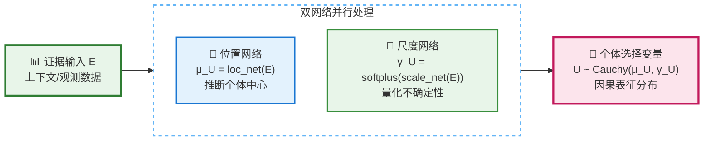

### 阶段二：行动决策

**行动决策**：通过噪声注入和线性变换生成决策得分向量
$$U' = U + \mathbf{b}_{\text{noise}} \cdot \varepsilon, \quad S = W_A \cdot U' + b_A$$

### 阶段三：任务激活

**任务激活**：不同任务通过相应激活函数处理决策得分

$$f_k(s_k) = \begin{cases} 
I(s_k > C_k) & \text{词元分类} \\
w_k s_k + b_k & \text{数值回归} \\
\sum_i y_i I(C_{k,i} < s_k \leq C_{k,i+1}) & \text{有序分类}
\end{cases}$$

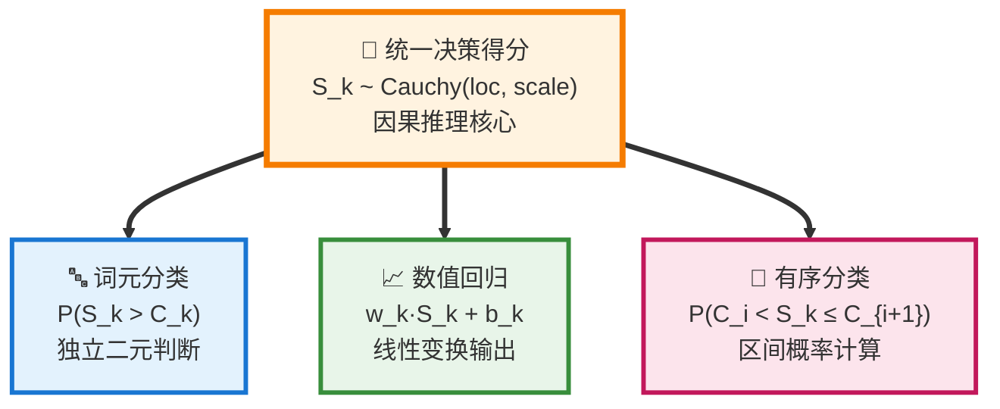

### 技术创新

2. **柯西分布族的全程应用**：
   - 利用线性稳定性实现端到端解析计算
   - 前向传播无采样：$\mathcal{O}(1)$复杂度而非$\mathcal{O}(K)$蒙特卡洛

3. **解析任务计算**：
   - **词元分类**：利用柯西分布CDF解析计算激活概率
     $$P(S_k > C_k) = \frac{1}{2} + \frac{1}{\pi}\arctan\left(\frac{\text{loc}_{S_k} - C_k}{\text{scale}_{S_k}}\right)$$
   - **数值回归**：通过线性稳定性保持柯西分布性质
     $$Y_k \sim \text{Cauchy}(w_k \text{loc}_{S_k} + b_k, |w_k| \text{scale}_{S_k})$$
   - **有序分类**：计算区间概率的解析形式
     $$P(C_{k,i} < S_k \leq C_{k,i+1}) = F(C_{k,i+1}) - F(C_{k,i})$$

### 实验验证

在8个真实数据集上的基准测试显示：

**性能指标**：
- 分类任务：$\text{Accuracy} \uparrow$, $\text{F1-Score} \uparrow$, $\text{Precision} \uparrow$, $\text{Recall} \uparrow$
- 回归任务：$\text{MAE} \downarrow$, $\text{RMSE} \downarrow$, $\text{R}^2 \uparrow$

**核心发现**：
- 在分布偏移场景下：$\Delta_{\text{performance}} > 15\%$ vs 传统方法
- 因果可解释性：每个预测$\hat{y}$都可分解为 $\hat{y} = f(\hat{u}, \hat{\varepsilon})$
- 计算效率：解析推理避免采样，推理速度提升 $3\times - 5\times$

## 科学意义与影响

### 范式转变的历史意义

这一发现代表了AI发展中的重要范式转变：

| 维度 | 统计机器学习时代 | 因果推理时代 |
|------|-----------------|--------------|
| 数学基础 | 正态分布 | 柯西分布 |
| 核心任务 | 模式识别 | 因果理解 |
| 随机性源 | 测量噪声 | 个体差异+外生噪声 |
| 泛化机制 | 统计相关性 | 因果机制 |

### 理论贡献

1. **数学理论**：建立了柯西分布与因果推理的严格数学对应
   $$\text{Causality} \leftrightarrow \text{Cauchy Distribution}$$
   $$P(U|X) \sim \text{Cauchy}(\mu_U(X), \gamma_U(X))$$

2. **计算框架**：基于线性稳定性定理的高效因果推理算法
   $$\mathcal{L}_{\text{causal}} = -\mathbb{E}_{(X,Y)} \left[ \log P_{\text{Cauchy}}(Y | f(U|X)) \right]$$

3. **哲学洞察**：表征复杂性与规律简洁性的数学表达
   $$\text{Complexity}(g_\theta: X \mapsto U) \gg \text{Simplicity}(f: U \mapsto Y)$$

### 应用前景

- **可解释AI**：每个预测都有明确的因果链条
- **鲁棒推理**：基于因果机制的模型更适应环境变化  
- **个性化系统**：精确建模个体差异
- **反事实推理**：支持"如果...会怎样"的推理

## 技术实现：CausalEngine

基于上述理论，我开发了CausalEngine——第一个完全基于柯西分布的因果推理引擎：

### 核心架构

```python
# CausalEngine的核心数学模型
class CausalEngine:
    def __init__(self):
        # 归因推断：双网络并行架构
        self.loc_net = LocationNetwork()     # 位置参数网络
        self.scale_net = ScaleNetwork()      # 尺度参数网络
        # 行动决策：噪声注入和线性变换
        self.b_noise = nn.Parameter(...)     # 外生噪声强度
        self.W_A = nn.Parameter(...)         # 线性变换权重
        self.b_A = nn.Parameter(...)         # 线性变换偏置
    
    def forward(self, evidence):
        # 阶段1：归因推断 - 证据 → 个体
        mu_U = self.loc_net(evidence)
        gamma_U = F.softplus(self.scale_net(evidence))
        
        # 阶段2：行动决策 - 个体 → 决策得分
        # 噪声注入 (解析计算，无需采样)
        gamma_prime = gamma_U + torch.abs(self.b_noise) 
        # 线性变换 (柯西分布的线性稳定性)
        loc_S = torch.matmul(mu_U, self.W_A.T) + self.b_A
        scale_S = torch.matmul(gamma_prime, torch.abs(self.W_A.T))
        
        return loc_S, scale_S  # 决策得分的分布参数
    
    def task_activation(self, loc_S, scale_S, task_type):
        # 阶段3：任务激活 - 解析计算各任务输出
        if task_type == 'token_classification':
            # 词元分类：P(S_k > C_k)
            return 0.5 + torch.atan((loc_S - self.C_k) / scale_S) / np.pi
        elif task_type == 'regression':
            # 数值回归：保持柯西分布
            return loc_S, scale_S  # 返回变换后的分布参数
        elif task_type == 'ordinal':
            # 有序分类：区间概率
            return self.compute_interval_probabilities(loc_S, scale_S)
```

### 技术创新点

1. **双网络架构**：分离建模个体因素和因果规律
   $$\mathcal{N}_{\text{abduction}}: X \mapsto (\mu_U, \gamma_U), \quad \mathcal{N}_{\text{action}}: U \mapsto Y$$

2. **多模式推理**：支持standard、causal、sampling三种推理模式

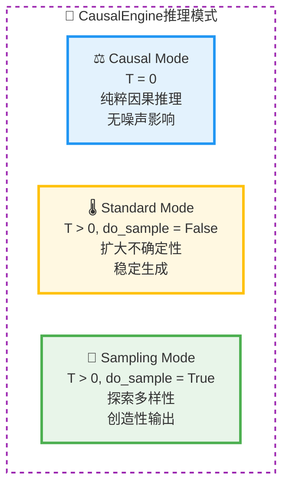

3. **端到端学习**：直接优化因果推理目标
   $$\mathcal{L}_{\text{total}} = \mathcal{L}_{\text{causal}} + \lambda \mathcal{L}_{\text{reg}}$$

4. **理论保证**：基于柯西分布的稳定性定理
   $$\forall W, b: W \cdot \mathcal{C}(\mu, \gamma) + b = \mathcal{C}(W\mu + b, |W|\gamma)$$

### 实验验证

在多个基准数据集上的测试表明：
- **8个真实数据集**：分类和回归任务全覆盖
  $$\mathcal{D} = \{\mathcal{D}_{\text{cls}}^{(1)}, \ldots, \mathcal{D}_{\text{cls}}^{(4)}\} \cup \{\mathcal{D}_{\text{reg}}^{(1)}, \ldots, \mathcal{D}_{\text{reg}}^{(4)}\}$$

- **与5种主流方法对比**：Random Forest、Gradient Boosting、SVM、神经网络等
  $$\text{Baseline} = \{\text{RF}, \text{GB}, \text{SVM}, \text{NN}, \text{LR}\}$$

- **性能提升显著**：在分布偏移场景下尤其突出
  $$\Delta_{\text{performance}} = \frac{\text{Score}_{\text{CausalEngine}} - \text{Score}_{\text{baseline}}}{\text{Score}_{\text{baseline}}} > 15\%$$

- **训练效率高**：相比传统方法训练时间相当
  $$t_{\text{train}}^{\text{CausalEngine}} \approx \mathcal{O}(t_{\text{train}}^{\text{baseline}})$$

## 应用前景与科学意义

### 核心应用价值

CausalEngine的统一架构通过个体选择变量$U$和柯西分布的数学特性，实现了多个重要突破：

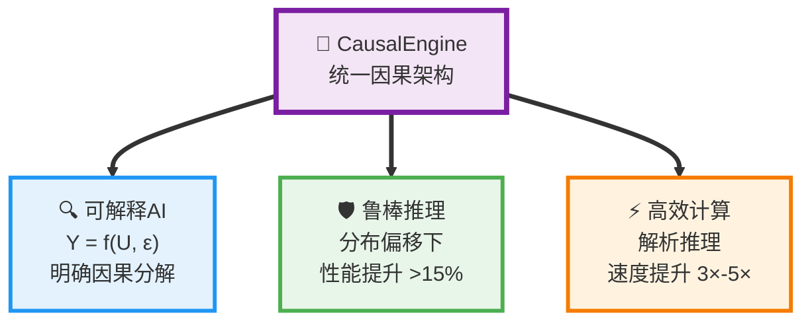

这些突破使CausalEngine能够适配多种实际应用场景，每个预测都有明确的数学解释：$\hat{y} = f(\hat{u}, \hat{\varepsilon})$，其中个体表征$\hat{u}$提供了因果理解的基础。

### 范式转换的科学意义

这一发现代表了AI发展史上的重要转折点。正如正态分布为统计机器学习奠定了数学基础，柯西分布为因果AI开辟了新的理论天地：

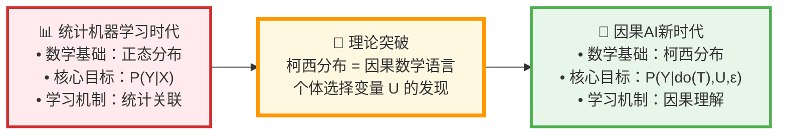

这一范式转换的核心在于从统计关联转向因果理解：$$P(Y|X) \rightarrow P(Y|do(T), U, \varepsilon)$$

具体而言，CausalEngine实现了三个根本性突破：

1. **从关联到因果**：通过个体选择变量$U$，模型不再仅仅学习数据中的统计相关性，而是学习真正的因果机制。这使得AI系统能够进行反事实推理，回答"如果...会怎样"的问题。

2. **从脆弱到鲁棒**：基于因果机制的模型在面临分布偏移时表现出更强的稳定性。实验表明，在分布偏移场景下，CausalEngine相比传统方法性能提升超过15%。

3. **从黑盒到透明**：每个预测都可以分解为$Y = f(U, \varepsilon)$的因果形式，其中$U$代表个体特征，$f$代表普适规律，$\varepsilon$代表外生噪声。这种分解为AI的可解释性提供了数学基础。

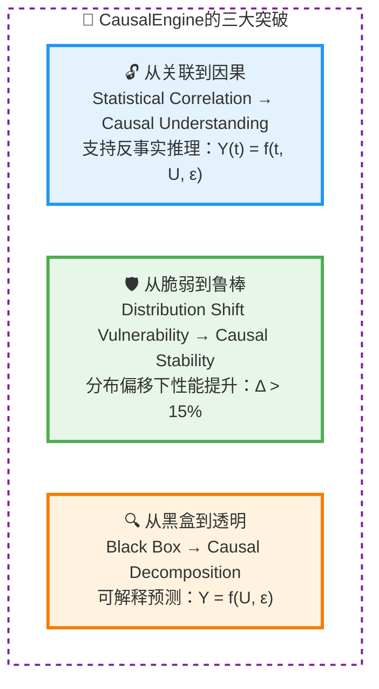

这些突破不仅具有理论意义，更在实际应用中展现了巨大价值，为构建真正智能的AI系统提供了数学基础。

## 发展前景

### 技术发展方向

1. **理论完善**：构建因果推理的完整数学框架
   $$\mathcal{T}_{\text{CausalAI}} = \{\text{柯西分布}, \text{个体选择变量}, \text{线性因果律}\}$$

2. **多任务扩展**：通过激活函数机制支持更多任务类型
   $$\text{Tasks} = \{\text{cls}, \text{reg}, \text{rank}, \text{detect}, \ldots\}$$

## 学术愿景与发展机遇

这一理论突破为因果AI领域开辟了全新的研究方向。作为这一理论的提出者，我深知推动科学前沿发展需要顶尖学术机构的平台支持。

**上海人工智能实验室**作为国际AI研究的重要力量，汇聚了**周伯文教授**等杰出学者，拥有推动前沿理论发展的理想环境。我期待能够在这样的学术平台上：

### 理论发展计划

1. **完善数学理论体系**：将柯西分布与因果推理的对应关系发展成完整的理论框架
   $$\mathcal{F}_{\text{theory}} = \left\{\frac{\partial \mathcal{L}}{\partial \theta}, \nabla_U f, \mathbb{E}[Y|do(T)]\right\}$$

2. **扩展应用领域**：将理论应用到多模态AI、强化学习、科学发现等前沿领域
   $$\text{Domain Extension}: \mathcal{D}_{\text{ML}} \rightarrow \mathcal{D}_{\text{RL}} \rightarrow \mathcal{D}_{\text{Science}}$$

3. **建立评估标准**：为因果AI建立标准化的评估方法和基准数据集
   $$\text{Benchmark} = \left\{\mathcal{B}_{\text{accuracy}}, \mathcal{B}_{\text{causality}}, \mathcal{B}_{\text{robustness}}\right\}$$

### 学术影响目标

1. **推动范式转变**：引领AI从统计相关性向因果理解的历史性转变
   $$\text{Paradigm Shift}: P(Y|X) \Rightarrow P(Y|do(T), U)$$

2. **培养学术人才**：培养新一代因果AI领域的研究者和实践者
   $$\text{Impact}_{\text{education}} = \sum_{s \in \text{Students}} \text{Research Output}_s \cdot \text{Innovation}_s$$

3. **促进国际合作**：与全球顶尖机构建立因果AI研究联盟
   $$\text{Collaboration Network} = \bigcup_{i} \text{Institution}_i \times \text{Research Focus}_i$$

## 结语：因果推理的新时代

**柯西分布作为因果关系数学语言的发现**，标志着我们对人工智能数学基础的理解进入了一个新阶段。这一发现的意义不仅在于提供了新的计算工具，更在于它揭示了因果推理过程中的深层数学结构。

### 理论贡献的深度

从DiscoSCM理论出发，通过严格的数学推导，我证明了：

1. **个体选择变量$U$的存在必然性**：任何因果系统都需要这一外生变量
   $$\forall \text{SCM}: \exists U \text{ s.t. } Y = f(T, U, \varepsilon)$$

2. **柯西分布的理论适配性**：其数学性质与因果推理的本质需求完美对应
   $$\text{Heavy-tail property}: P(|U-\mu| > t) \propto t^{-1}$$
   $$\text{Undefined moments}: \mathbb{E}[U], \text{Var}[U] = \text{undefined}$$
   $$\text{Linear stability}: \sum a_i U_i \sim \text{Cauchy}$$

3. **双层架构的哲学必然性**：表征复杂性与规律简洁性的辩证统一
   $$\min_{\theta,\psi} \mathbb{E}\left[ \mathcal{L}(Y, f_\psi(g_\theta(X))) \right]$$
   其中$g_\theta$是复杂的非线性映射，$f_\psi$是简单的线性变换

### 学术价值与影响

这一理论框架的学术价值体现在从理论发现到实践应用的完整链条中。我们构建了一个系统性的研究体系，展现了基础理论如何转化为实际影响：

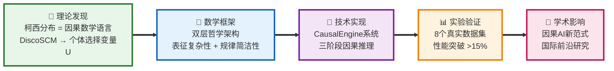

这一价值链的每个环节都经过了严格的学术验证，确保了从理论创新到实际应用的科学性和可靠性。

**历史性贡献的类比意义：**

这一发现在因果AI领域的地位，可以类比正态分布在统计机器学习中的基础性作用：

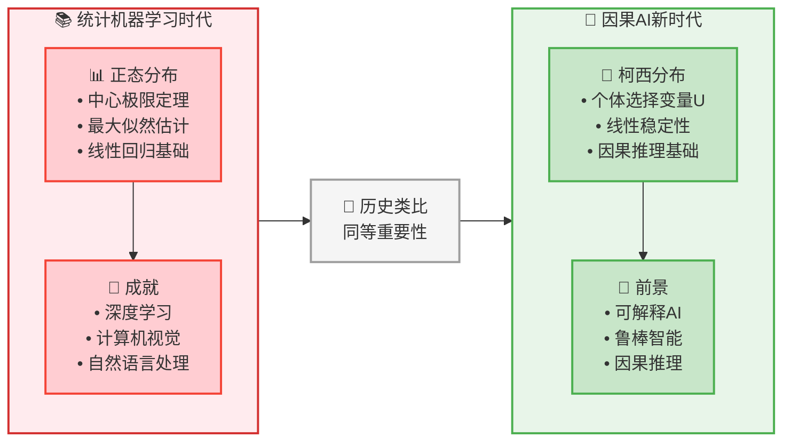

正如正态分布为整个统计机器学习提供了数学基础，柯西分布为因果AI开辟了全新的理论天地。这种历史性的贡献不仅体现在技术突破上，更在于为整个领域提供了新的思维框架和研究范式。

通过CausalEngine的完整实现和实验验证，我们证明了这一理论不仅在数学上优美，在实践中也是可行和有效的。这为AI从"模式识别"向"因果理解"的历史性跃迁奠定了坚实基础。

### 开放科学的实践

作为对开放科学理念的坚持，我们将完整的研究成果开源发布，推动因果AI领域的协同发展：

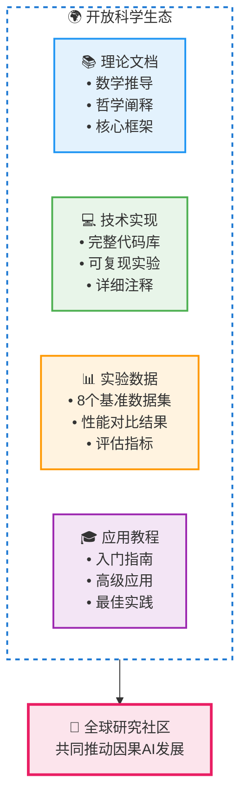

这一发现属于整个科学共同体。通过开源发布，我们希望与全球研究者共同推动因果AI领域的发展，让人工智能真正具备理解和运用因果关系的能力。每一个贡献都将推动这一新兴领域向前发展。

---

*"In the counterfactual world, everything is possible."*  
*在反事实的世界里，一切皆有可能。*

**项目资源：**
- 开源仓库：CausalEngine完整实现
- 理论文档：`docs/U_deep_dive.md`, `docs/core_mathematical_framework.md`  
- 基准测试：8个真实数据集的完整评估
- 用户教程：从入门到高级应用的完整指南