# CausalEngine: The Mathematical Foundations

> - 📋 **Document Purpose**: To define the formal mathematical framework of the CausalEngine, a universal algorithm for causal reasoning.
> - 🎯 **Audience**: AI Researchers, System Architects, Patent Examiners. This document serves as the canonical reference for the engine's theoretical underpinnings.
> - 📖 **Scope**: This document describes `CausalEngine` as an abstract, decoupled algorithmic framework, independent of any specific application like language modeling.

## Abstract

This paper defines `CausalEngine`, a novel and universal algorithmic framework for causal reasoning. The engine's architecture is rigorously decomposed into two distinct, modular stages: **Abduction** and **Action**. By introducing a latent individual causal representation `U` and leveraging the unique mathematical properties of the Cauchy distribution, `CausalEngine` achieves fully analytical, sampling-free uncertainty propagation. The core invention lies in its **Action** stage, which first generates a task-agnostic Decision Potential distribution and then uses a pluggable and extensible **Task Activation** mechanism to translate this potential into a rich variety of specific, structured outputs—including classification, regression, and ordered category prediction. `CausalEngine` provides a new, mathematically self-consistent, and interpretable foundation for building the next generation of multi-task artificial intelligence systems.

---

## 1. The Philosophical Premise: Beyond Correlation

### 1.1 The Limitation of Probabilistic Models

Traditional machine learning excels at learning the conditional probability $P(Y|X)$. This approach, while powerful, is fundamentally correlational and fails to capture the underlying data generating process. It answers "what" but not "why".

### 1.2 The Causal Leap: From $P(Y|X)$ to $Y = f(U, \epsilon)$

CausalEngine is built upon a different premise, rooted in structural causal models. We posit that any outcome `Y` is a result of a universal causal law `f` acting upon two distinct entities:

\[ Y = f(U, \epsilon) \]

The theoretical foundation of this project ([arXiv:2401.15911](https://arxiv.org/abs/2401.15911)) mathematically proves that to construct a causal model capable of flexibly expressing counterfactuals, introducing an exogenous **"Individual Selection Variable $U$"** is necessary. $U$ is the key to understanding all the magic of this model. It has two core identities:

1. **Individual Selection Variable**: A specific assignment $U=u$ represents "selecting" a particular individual `u` from all possible individuals.
2. **Individual Causal Representation**: The selected vector $u$ itself contains all the intrinsic, latent attributes that drive the individual's behavior.

**Core Idea**: Under the same treatment $t$, the universal causal law ($Y=f(t;u, \varepsilon)$) applied to different individuals ($u$) and exogenous noise ($\varepsilon$) produces different counterfactual outcomes ($Y(t)$). $U$ is the ultimate source of all individual systematic differences, while $\varepsilon$ represents uncontrollable, non-systematic random perturbations.

-   **U (Individual Causal Representation)**: A latent variable representing the intrinsic, systematic properties of the individual entity being reasoned about. Its distribution is inferred from the observed context `X`.
-   **ε (Exogenous Noise)**: An external, non-systematic random perturbation, independent of `U`.
-   **f (Universal Causal Mechanism)**: A deterministic function that applies universally to all individuals.

### 1.3 The Axiom of Simplicity

This framework operates on a core axiom: the complexity lies in the **representation**, while the law is **simple**.
-   **The Abduction Challenge**: Inferring the true causal representation `U` from messy, high-dimensional evidence `X` is a complex, non-linear problem.
-   **The Action Simplicity**: Once the correct representation `U` is identified, the causal law `f` that governs its behavior is assumed to be simple and linear.

---

## 2. The Mathematical Cornerstone: The Cauchy Distribution

The choice of the Cauchy distribution is a foundational design decision, selected for its profound philosophical and computational properties.

### 2.1 Axiomatic Justification
1.  **Heavy Tails**: The Cauchy distribution honestly represents the uncertainty of an open world, assigning non-trivial probability to extreme "black swan" events.
2.  **Undefined Moments**: Its expectation and variance are mathematically undefined. This elegantly mirrors the philosophical stance that we can never fully know or summarize an individual's true nature with simple statistics like a mean or standard deviation.

### 2.2 The Engine of Computation: Linear Stability

The magic of `CausalEngine`'s computational efficiency stems from the linear stability property of the Cauchy distribution. If $X_i \sim \text{Cauchy}(\mu_i, \gamma_i)$ are independent, then for any scalar weights $w_i$:

\[ \sum_{i=1}^n w_i X_i \sim \text{Cauchy}\left(\sum_{i=1}^n w_i \mu_i, \sum_{i=1}^n |w_i| \gamma_i\right) \]

This theorem allows the engine to perform all transformations on distributions **analytically**, without resorting to costly Monte Carlo sampling. We are always propagating the exact distribution parameters.

---

## 3. The Two-Stage Architecture of CausalEngine

`CausalEngine` modularizes the reasoning process into a clear, two-stage pipeline: **Abduction** (from evidence to the individual's nature) and **Action** (from the individual's nature to a final decision).

```mermaid
graph TB
    %% Simplified Version: CausalEngine Two-Stage Architecture
    
    Evidence["📊 Evidence E<br/>Input Data/Observations"]
    
    Evidence --> Stage1["🔍 Stage 1: Abduction<br/>Evidence → Individual<br/>U ~ Cauchy(μ_U, γ_U)"]
    
    Stage1 --> Stage2["⚡ Stage 2: Action<br/>Individual → Decision → Output"]
    
    subgraph Stage2_Detail ["Action Stage Details"]
        direction TB
        Modes["🔧 Inference Modes<br/>🌡️ Standard: Increase Uncertainty<br/>🎲 Sampling: Explore Diversity<br/>⚖️ Causal: Pure Inference"]
        Step2_1["💫 Decision Score Generation<br/>S = W·(U + b_noise·ε) + b"]
        Step2_1 --> Modes
    end
    
    Stage2 -.-> Stage2_Detail
    
    Stage2 --> MultiTask["🎯 Task Activation"]
    
    subgraph Tasks ["Supported Task Types"]
        direction LR
        Token["🔤 Token Classification<br/>(OvR) P(S_k > C_k)"] ~~~ Numeric["📈 Numeric Regression<br/>w_k·S_k + b_k"] ~~~ Discrete["🔢 Ordered Classification<br/>P(C_i < S_k ≤ C_{i+1})"]
    end
    
    MultiTask --> Tasks
    
    %% Styling
    style Evidence fill:#e8f5e9,stroke:#2e7d32,stroke-width:3px,color:#000
    style Stage1 fill:#f3e5f5,stroke:#7b1fa2,stroke-width:3px,color:#000
    style Stage2 fill:#fff3e0,stroke:#f57c00,stroke-width:3px,color:#000
    style Stage2_Detail fill:#fff8e1,stroke:#ffa000,stroke-width:1px,color:#000
    style MultiTask fill:#e1f5fe,stroke:#0277bd,stroke-width:3px,color:#000
    style Tasks fill:#f5f5f5,stroke:#616161,stroke-width:1px,color:#000
    style Modes fill:#e0f2f1,stroke:#00796b,stroke-width:2px,color:#000
    
    style Token fill:#e3f2fd,stroke:#1976d2,color:#000
    style Numeric fill:#e8f5e9,stroke:#388e3c,color:#000
    style Discrete fill:#fce4ec,stroke:#c2185b,color:#000
```

CausalEngine operates through three independent and composable stages:

### 3.1 Stage 1: Abduction (Evidence to Individual)

**Evidence → Individual**

Given evidence $E$, infer the individual selection variable $U \sim \text{Cauchy}(\mu_U, \gamma_U)$, where parameters are computed by independent networks:

```mermaid
graph TB
    %% Abduction: Dual Network Parallel Architecture
    
    Evidence["📊 Evidence E<br/>Input Data/Observations"]
    
    Evidence --> LocNet & ScaleNet
    
    subgraph DualNet ["Abduction Network"]
        direction LR
        LocNet["📍 Location Network<br/>μ_U = loc_net(E)"]
        ScaleNet["📏 Scale Network<br/>γ_U = softplus(scale_net(E))"]
    end
    
    LocNet & ScaleNet -->  Distribution["🎲 Individual Representation Distribution<br/>U ~ Cauchy(μ_U, γ_U)"]
    
    %% Styling
    style Evidence fill:#e8f5e9,stroke:#2e7d32,stroke-width:3px,color:#000
    style DualNet fill:#e8eaf6,stroke:#3f51b5,stroke-width:2px,color:#000
    style LocNet fill:#e3f2fd,stroke:#1976d2,stroke-width:2px,color:#000
    style ScaleNet fill:#e3f2fd,stroke:#1976d2,stroke-width:2px,color:#000
    style Distribution fill:#fce4ec,stroke:#c2185b,stroke-width:3px,color:#000
```

-   **Goal**: From evidence to individual.
-   **Input**: An arbitrary context feature vector $E$.
-   **Function**: Two parallel networks infer the parameters of the individual's causal representation distribution $U$.
    -   Location parameter: $\mu_U = \text{loc\_net}(E)$
    -   Scale parameter: $\gamma_U = \text{softplus}(\text{scale\_net}(E)) = \log(1 + \exp(\text{scale\_net}(E)))$
-   **Output**: The distribution parameters $(\mu_U, \gamma_U)$ for the individual causal representation, where $U \sim \text{Cauchy}(\mu_U, \gamma_U)$.

Mathematical representation:
$$p(U|E) = \frac{1}{\pi\gamma_U} \cdot \frac{1}{1 + \left(\frac{U - \mu_U}{\gamma_U}\right)^2}$$

### 3.2 Stage 2: Action (Individual to Output)

The structural equation $Y=f(U, \varepsilon)$ is decomposed into two processes: 1) generating decision scores; 2) applying task activation functions.

```mermaid
graph TB
    %% Action Network: Two-step transformation to generate decision scores
    
    U_in["🎲 Input: Individual Causal Representation<br/>U ~ Cauchy(μ, γ)<br/>From Abduction Stage"]
    
    U_in --> ActionNet
    
    subgraph ActionNet ["Action Network"]
        direction TB
        
        subgraph Step1_Noise ["🌊 Step 1: Exogenous Noise Injection"]
            direction LR
            Noise["ε ~ Cauchy(0,1)"] 
            NoiseOp["U' = U + b_noise·ε"]
            Result1["U' ~ Cauchy(μ,γ+|b_noise|)"]
            Noise --> NoiseOp --> Result1
        end
        
        subgraph Step2_Linear ["🔄 Step 2: Linear Causal Transformation"]
            direction LR
            Transform["S = W_A · U' + b_A"]
            Params["loc_S = μ · W_A^T + b_A<br/>scale_S=(γ + |b_noise|)|W_A^T|"]
            Result2["S ~ Cauchy(loc_S, scale_S)"]
            Transform --> Params --> Result2
        end
        
        Step1_Noise --> Step2_Linear
    end
    
    ActionNet --> Output_S["💫 Decision Score Vector<br/>S = [S₁, S₂, ..., S_V]<br/>Each S_k is a random variable"]
    
    %% Styling
    style U_in fill:#e8f5e9,stroke:#2e7d32,stroke-width:3px,color:#000
    style ActionNet fill:#fff3e0,stroke:#f57c00,stroke-width:2px,color:#000
    style Step1_Noise fill:#fff8e1,stroke:#ff9800,stroke-width:2px,color:#000
    style Step2_Linear fill:#e8f5ff,stroke:#2196f3,stroke-width:2px,color:#000
    style Output_S fill:#e1f5fe,stroke:#0277bd,stroke-width:3px,color:#000
    style Result1 fill:#ffecb3,stroke:#ffa000,stroke-width:1px,color:#000
    style Result2 fill:#bbdefb,stroke:#1976d2,stroke-width:1px,color:#000
```

#### 3.2.1 Decision Score Generation

During training, the model generates decision scores through the following steps:

1. **Inject Exogenous Noise**:
   - **Principle**: The core idea is to inject a standard Cauchy noise $\varepsilon \sim \text{Cauchy}(0, 1)$ into the individual representation $U$, with intensity controlled by a learnable parameter vector $\mathbf{b}_{\text{noise}}$. The transformed random variable $U'$ is:
     $$U' = U + \mathbf{b}_{\text{noise}} \cdot \varepsilon$$
   - **Analytical Derivation**: According to the linear stability of Cauchy distribution, we can derive the distribution of $U'$:
     - First, we have $U \sim \text{Cauchy}(\mu_U, \gamma_U)$.
     - Second, the scaled noise term $\mathbf{b}_{\text{noise}} \cdot \varepsilon \sim \text{Cauchy}(0, |\mathbf{b}_{\text{noise}}|)$.
     - Therefore, the sum of two independent Cauchy variables has distribution:
       $$U' \sim \text{Cauchy}(\mu_U + 0, \gamma_U + |\mathbf{b}_{\text{noise}}|) = \text{Cauchy}(\mu_U, \gamma_U + |\mathbf{b}_{\text{noise}}|)$$
   - **Computational Implementation**: This derivation allows us to completely avoid sampling in computation, efficiently implementing noise injection by directly adding to the scale parameter.

2. **Apply Linear Causal Law**: Apply a linear transformation (defined by weights $W_A$ and bias $b_A$) to this noise-containing distribution $U'$ to obtain the decision score distribution $S$. According to Cauchy distribution's linear stability:
  If $U' \sim \text{Cauchy}(\mu_U, \gamma_U + |\mathbf{b}_{\text{noise}}|)$, then:
  -   $\text{loc}_S = (\mu_U) W_A^T + b_A$
  -   $\text{scale}_S = (\gamma_U + |\mathbf{b}_{\text{noise}}|) |W_A^T|$

Through backpropagation, the model automatically learns the magnitude of the noise intensity parameter $\mathbf{b}_{\text{noise}}$, thus adapting optimal uncertainty for different tasks.

-   **Output**: The parameters $(\mu_S, \gamma_S)$ of the raw, task-agnostic **Decision Score Distribution**, where each component $S_k \sim \text{Cauchy}(\mu_{S_k}, \gamma_{S_k})$.

#### 3.2.2 Deterministic Task Output Computation

The causal chain is: receive the distribution representing the individual $U \sim \text{Cauchy}(\mu_U, \gamma_U)$, generate decision scores $S$ through the causal mechanism, and finally convert to task-specific outputs.

```mermaid
graph TB
    %% Internal Structure of the Action Stage
    
    U2["🎲 Individual Distribution U<br/>(From Abduction Stage)"]
    
    U2 --> Step1["💫 Step 1: Decision Score Generation"]
    
    subgraph ScoreGen ["Decision Score Generation Details"]
        direction TB
        SG1["🌊 Noise Injection<br/>U' = U + b_noise·ε"]
        SG2["🔄 Linear Transformation<br/>S = W_A·U' + b_A"]
        SG3["💫 Output: S ~ Cauchy(loc_S, scale_S)"]
        SG1 --> SG2 --> SG3
    end
    
    Step1 -.-> ScoreGen
    
    Step1 --> S2["💫 Decision Score S<br/>S = [S₁, S₂, ..., S_V]"]
    
    S2 --> Step2["✨ Step 2: Task Activation"]
    
    subgraph TaskAct ["Task Activation Details"]
        direction TB
        TA1["🎯 Apply Task Activation Function f_k(s_k)"]
        TA2["📊 Analytically Compute Output Probability/Distribution"]
        TA1 --> TA2
    end
    
    Step2 -.-> TaskAct
    
    Step2 --> Token2["🔤 Token Output<br/>(OvR) P(S_k > C_k)"]
    Step2 --> Numeric2["📈 Numeric Output<br/>w_k·S_k + b_k"]
    Step2 --> Discrete2["🔢 Discrete Output<br/>P(C_{k,i} < S_k ≤ C_{k,i+1})"]
    
    Token2 --> Final["🎉 Final Decision"]
    Numeric2 --> Final
    Discrete2 --> Final
    
    %% Styling
    style U2 fill:#e8f5e9,stroke:#2e7d32,stroke-width:2px,color:#000
    style Step1 fill:#fff3e0,stroke:#f57c00,stroke-width:2px,color:#000
    style Step2 fill:#e3f2fd,stroke:#2196f3,stroke-width:2px,color:#000
    style S2 fill:#f3e5f5,stroke:#7b1fa2,stroke-width:2px,color:#000
    style Final fill:#e1f5fe,stroke:#0277bd,stroke-width:2px,color:#000
    style ScoreGen fill:#fff8e1,stroke:#ffa000,stroke-width:1px,color:#000
    style TaskAct fill:#e8eaf6,stroke:#3f51b5,stroke-width:1px,color:#000
    style Token2 fill:#e3f2fd,stroke:#1976d2,color:#000
    style Numeric2 fill:#e8f5e9,stroke:#388e3c,color:#000
    style Discrete2 fill:#fce4ec,stroke:#c2185b,color:#000
```

### 3.3 Stage 3: Task Activation and Loss Computation

#### Two Perspectives Unified

Task activation is a core component of CausalEngine. It defines a series of **elementary task activation functions** that independently act on **each component $S_k$** of the high-dimensional decision score vector $S = [S_1, ..., S_V]$. These functions constitute the lowest-level, deterministic causal mechanisms. The ingenuity of CausalEngine lies in its use of Cauchy distribution's mathematical properties to analytically compute the probabilities or new distributions after these functions act on the entire distribution, without needing to sample each component $S_k$ during training.

**Key Distinction**:
- **Training Time (Distribution Perspective)**: We operate on random variables $S_k \sim \text{Cauchy}(\text{loc}_k, \text{scale}_k)$, analytically computing activation probabilities or transformed distributions without sampling.
- **Inference Time (Numerical Perspective)**: We can sample specific values $s_k$ from the distribution, then directly apply the activation function $f_k(s_k)$ to obtain deterministic outputs. This embodies the underlying logic of the structural equation $Y=f(U, \varepsilon)$.

#### Deterministic Task Activation Functions

For the $k$-th component of the decision score vector $S$ (which itself is a random variable $S_k \sim \text{Cauchy}(\text{loc}_k, \text{scale}_k)$), we define an elementary activation function $f_k(s_k)$ acting on any realization $s_k$:

1. **Token Index Activation**:
   $$f_k(s_k) = I(s_k > C_k)$$
   where $I(\cdot)$ is the indicator function, $C_k$ is the learnable class threshold specific to the $k$-th component.

2. **Numeric Activation**:
   $$f_k(s_k) = w_k s_k + b_k$$
   where $w_k$ and $b_k$ are learnable linear transformation parameters specific to the $k$-th component.

3. **Discrete Ordered Value Activation**:
   $$f_k(s_k) = \sum_{i} y_i \cdot I(C_{k,i} < s_k \le C_{k,i+1})$$
   where $y_i$ are ordered discrete output values (e.g., months), $C_{k,i}$ are learnable interval boundaries (thresholds).

#### Random Variable Computation

$f_k(s_k)$ is a deterministic function, but the randomness of input $S_k$ leads to randomness in the output. We predict using the random variable itself, not its statistics (like expectation)—this is the fundamental difference between CausalEngine and traditional methods.

```mermaid
graph TB
    %% Core Innovation Title
    Title["💡 <b>CausalEngine's Core Innovation</b><br/><i>Predicting Directly from Random Variables</i>"]
    
    Title --> Compare
    
    %% Comparison Area
    subgraph Compare [" "]
        direction LR
        
        Traditional["🏛️ <b>Traditional Methods</b><br/>E[Y|X]"]
        
        VS["<b>VS</b>"]
        
        CausalEngine["🚀 <b>CausalEngine</b><br/>S_k ~ Cauchy → f_k(·) → Prediction<br/>✅ The Distribution IS the Prediction"]
        
        Traditional ~~~ VS ~~~ CausalEngine
    end
    
    Compare --> Functions
    
    %% Activation Functions Display
    subgraph Functions ["<b>Three Activation Functions f_k(·)</b>"]
        direction LR
        Token["🔤 Token<br/>P(S_k > C_k)"]
        Numeric["📊 Numeric<br/>w_k·S_k + b_k"]  
        Ordinal["🔢 Ordered<br/>P(C_k,i < S_k ≤ C_k,i+1)"]
        
        Token ~~~ Numeric ~~~ Ordinal
    end
    
    Functions --> Insight
    
    %% Core Insight
    Insight["⚡ <b>Key Insight</b><br/>The Distribution Itself is the Prediction!<br/>Random S_k + Deterministic Function f_k<br/>= Random Output Y_k"]
    
    %% Style Enhancement
    style Title fill:#fff8e1,stroke:#ff9800,stroke-width:3px
    style Compare fill:#f8f9fa,stroke:#dee2e6,stroke-width:1px
    style Traditional fill:#ffebee,stroke:#d32f2f,stroke-width:2px
    style CausalEngine fill:#e8f5e9,stroke:#388e3c,stroke-width:2px
    style VS fill:transparent,stroke:none
    
    style Functions fill:#e3f2fd,stroke:#1976d2,stroke-width:2px
    style Token fill:#f3e5f5,stroke:#7b1fa2,stroke-width:1px
    style Numeric fill:#e8f5e9,stroke:#388e3c,stroke-width:1px
    style Ordinal fill:#fce4ec,stroke:#c2185b,stroke-width:1px
    
    style Insight fill:#fff3e0,stroke:#ff9800,stroke-width:3px
```

#### Loss Function Computation

A key advantage of CausalEngine is its task-agnosticism. By defining different task activation functions, the same decision score $S$ can be used for various prediction tasks. The analytical computations and loss functions for each task are as follows:

```mermaid
graph LR
    %% Input
    Input["🎯 <b>Input</b><br/>Decision Score Vector S<br/>S_k ~ Cauchy(μ_k, γ_k)"]
    
    %% Connect to three parallel task branches
    Input --> Token
    Input --> Numeric
    Input --> Discrete
    
    subgraph Token ["🔤 Token Classification"]
        direction LR
        T1["<b>Activation & Probability</b><br/>f(s_k) = I(s_k > C_k)<br/>P_k = 1/2 + arctan((μ_k - C_k)/γ_k)/π"]
        T2["<b>Output & Loss</b><br/>argmax_k P_k <br/>OvR BCE Loss"]
        T1 --> T2
    end
    
    subgraph Numeric ["📊 Numeric Regression"]
        direction LR
        N1["<b>Activation & Distribution</b><br/>f(s_k) = w_k·s_k + b_k<br/>Y_k ~ Cauchy(w_k·μ_k+b_k, |w_k|·γ_k)"]
        N2["<b>Output & Loss</b><br/>ŷ_k = w_k·μ_k + b_k <br/> Cauchy NLL Loss"]
        N1 --> N2
    end
    
    subgraph Discrete ["🔢 Ordered Classification"]
        direction LR
        D1["<b>Activation & Probability</b><br/>f(s_k) = ∑y_i·I(C_{k,i} < s_k ≤ C_{k,i+1})<br/>P(y_i) = F(C_{k,i+1}) - F(C_{k,i})"]
        D2["<b>Output & Loss</b><br/>argmax_i P(y_i) <br/>Cross-Entropy Loss"]
        D1 --> D2
    end
    
    %% Output Integration
    Token --> Output
    Numeric --> Output
    Discrete --> Output
    
    Output["🎯 <b>Unified Output</b><br/>Multi-Task Results<br/>L = ∑w_t·L_t"]
    
    %% Note
    Input -.-> Note["📌 <b>Key Point</b><br/>S_k itself is random"]
    
    %% Style Definitions
    style Input fill:#e3f2fd,stroke:#1565c0,stroke-width:3px,color:#000
    style Output fill:#e0f2f1,stroke:#00796b,stroke-width:3px,color:#000
    style Note fill:#fffde7,stroke:#fbc02d,stroke-width:2px,color:#000
    
    style Token fill:#f3e5f5,stroke:#8e24aa,stroke-width:2px,color:#000
    style Numeric fill:#e8f5e9,stroke:#388e3c,stroke-width:2px,color:#000
    style Discrete fill:#fce4ec,stroke:#d32f2f,stroke-width:2px,color:#000
```

**1. Token Index Task Activation (Classification Task)**

- **Goal**: For each component $k$, compute the probability that its elementary task activation function outputs 1, i.e., $P(f_k(S_k) = 1)$.
- **Analytical Derivation**:
  $$P(f_k(S_k)=1) = P(I(S_k > C_k)=1) = P(S_k > C_k)$$
  Using the Cauchy distribution's CDF, we can directly compute this probability:
  $$P(S_k > C_k) = \frac{1}{2} + \frac{1}{\pi}\arctan\left(\frac{\text{loc}_{S_k} - C_k}{\text{scale}_{S_k}}\right)$$
- **Multi-class Decision Mechanism**: For all tokens $k \in \{1, 2, ..., V\}$ in the vocabulary, each token has an independent activation probability $P_k$. The final token selection uses **OvR (One-vs-Rest)** strategy:
  $$\text{selected\_token} = \arg\max_k P_k = \arg\max_k P(S_k > C_k)$$
  This independent judgment differs from traditional Softmax, as each token's selection probability doesn't need normalization, allowing the model to express more flexible uncertainty.
- **Loss Function**: Based on each component's probability, use **Binary Cross-Entropy loss** for each component:
  $$\mathcal{L}_{\text{token}} = -\sum_{k=1}^V \left[ y_k \log P_k + (1-y_k) \log(1-P_k) \right]$$
  where $y_k$ is the one-hot encoding of the true label.

**2. Numeric Task Activation (Regression Task)**

- **Goal**: For each component $k$, obtain the distribution of the output variable after applying the elementary task activation function.
- **Parameters**: This task activation head contains learnable weights $w_k$ and bias $b_k$.
- **Analytical Derivation**: The elementary function is a linear transformation $f_k(s_k) = w_k s_k + b_k$. According to Cauchy distribution's linear stability:
  If $S_k \sim \text{Cauchy}(\text{loc}_{S_k}, \text{scale}_{S_k})$, then the output $Y_k = f_k(S_k)$ has distribution:
  $$Y_k \sim \text{Cauchy}(\mu_{Y_k}, \gamma_{Y_k}) = \text{Cauchy}(w_k \text{loc}_{S_k} + b_k, |w_k| \text{scale}_{S_k})$$
- **Loss Function**: For each component, based on this derived output distribution, use **Cauchy distribution's Negative Log-Likelihood (NLL) Loss**. For true value $y_k$, the loss is:
  $$\mathcal{L}_{\text{reg}, k} = \log(\pi\gamma_{Y_k}) + \log\left(1 + \left(\frac{y_k - \mu_{Y_k}}{\gamma_{Y_k}}\right)^2\right)$$

**3. Discrete Ordered Value Task Activation (Ordinal Classification Task)**

- **Goal**: For each component $k$, compute the probability that its task activation function outputs a specific value $y_i$, i.e., $P(f_k(S_k) = y_i)$.
- **Analytical Derivation**:
  $$P(f_k(S_k)=y_i) = P(\sum_{j} y_j \cdot I(C_{k,j} < S_k \le C_{k, j+1}) = y_i) = P(C_{k,i} < S_k \le C_{k,i+1})$$
  Using Cauchy CDF, we can directly compute this interval probability:
  $$P(C_{k,i} < S_k \le C_{k,i+1}) = F(C_{k,i+1}) - F(C_{k,i}) \\
  = \frac{1}{\pi}\left[\arctan\left(\frac{C_{k,i+1} - \text{loc}_{S_k}}{\text{scale}_{S_k}}\right) - \arctan\left(\frac{C_{k,i} - \text{loc}_{S_k}}{\text{scale}_{S_k}}\right)\right]$$
- **Loss Function**: Treating all possible values $y_i$ as different classes, use standard **classification cross-entropy loss** for each component:
  $$\mathcal{L}_{\text{ordinal}, k} = -\sum_{i} y_i \log P(y_i)$$

#### Extensibility to More Tasks

CausalEngine's mathematical framework has natural extensibility. Adding new tasks only requires:

1. Define an elementary task activation function $f_k(s_k)$
2. Derive its analytical form under Cauchy distribution
3. Implement the corresponding distribution-based loss function

For example, a time prediction task can be defined as:
$$f_k(s_k) = \exp(w_k \cdot s_k + b_k)$$
where the output represents the time of event occurrence.

For multi-task learning, the total loss is the weighted sum of individual task losses:
$$\mathcal{L}_{\text{total}} = \sum_{t \in \text{tasks}} w_t \cdot \mathcal{L}_t$$

This design enables CausalEngine to simultaneously handle classification, regression, ranking, and other tasks, truly realizing the vision of "one engine, multiple applications".

---

## 4. Inference Modes: Flexible Modulation of Noise

CausalEngine achieves precise control over uncertainty through a unified mathematical framework. During inference, we modulate the learned exogenous noise $\mathbf{b}_{\text{noise}}$ through `temperature` and `do_sample` parameters, enabling a continuous spectrum from deterministic reasoning to creative generation.

```mermaid
graph TB
    %% Main Flow from Top to Bottom
    
    Input["🎯 Inference Input<br/>Individual Distribution U ~ Cauchy(μ_U, γ_U) (Random Variable)<br/>Learned Noise Intensity b_noise"]
    
    Input --> Control["⚙️ Inference Control<br/>temperature (T) & do_sample"]
    
    %% Container for parallel modes
    subgraph " "
        direction LR %% Key: Make internal modes horizontal
        
        subgraph CausalMode ["⚖️ Causal Mode"]
            direction TB
            C_Cond["Condition: T = 0"]
            C_Desc["💎 Pure Causal Reasoning<br/>No noise influence"]
            C_Math["U' = U<br/>U' ~ Cauchy(μ_U, γ_U)"]
            C_Use["Use Cases:<br/>• Deterministic inference<br/>• Hard decisions<br/>• Point estimates"]
            C_Cond --> C_Desc --> C_Math --> C_Use
        end
        
        subgraph StandardMode ["🌡️ Standard Mode"]
            direction TB
            S_Cond["Condition: T > 0, do_sample = False"]
            S_Desc["❄️ Increase Uncertainty<br/>Widens scale parameter"]
            S_Math["γ' = γ_U + T·|b_noise|<br/>U' ~ Cauchy(μ_U, γ')"]
            S_Use["Use Cases:<br/>• Stable generation<br/>• Soft decisions<br/>• Confidence intervals"]
            S_Cond --> S_Desc --> S_Math --> S_Use
        end
        
        subgraph SamplingMode ["🎲 Sampling Mode"]
            direction TB
            M_Cond["Condition: T > 0, do_sample = True"]
            M_Desc["🎨 Explore Diversity<br/>Perturbs location parameter"]
            M_Math["ε ~ Cauchy(0,1)<br/>μ' = μ_U + T·|b_noise|·ε<br/>U' ~ Cauchy(μ', γ_U)"]
            M_Use["Use Cases:<br/>• Creative generation<br/>• Explore boundaries<br/>• Monte Carlo"]
            M_Cond --> M_Desc --> M_Math --> M_Use
        end
    end
    
    %% Connect control to modes
    Control --> CausalMode
    Control --> StandardMode
    Control --> SamplingMode
    
    %% Connect modes to output
    CausalMode --> Output
    StandardMode --> Output
    SamplingMode --> Output
    
    subgraph Output ["🎉 Output"]
        OutDesc["Modulated Individual Distribution U' (Random Variable)<br/>Passed to Action Stage to Generate Decision Score S"]
    end
    
    %% Styling
    style Input fill:#e8f5e9,stroke:#2e7d32,stroke-width:3px,color:#000
    style Control fill:#fff3e0,stroke:#f57c00,stroke-width:2px,color:#000
    style Output fill:#e1f5fe,stroke:#0277bd,stroke-width:2px,color:#000
    
    style CausalMode fill:#e3f2fd,stroke:#2196f3,stroke-width:2px,color:#000
    style StandardMode fill:#fff8e1,stroke:#ffc107,stroke-width:2px,color:#000
    style SamplingMode fill:#e8f5e9,stroke:#4caf50,stroke-width:2px,color:#000
```

### 1. Standard Mode
- **Setting**: `do_sample=False`, `temperature > 0`
- **Mechanism**: Noise is scaled by `temperature`, increasing the **scale parameter** to widen decision uncertainty while keeping individual identity unchanged.
- **Mathematical Principle**:
  $$U' \sim \text{Cauchy}(\mu_U, \gamma_U + \text{temperature} \cdot |\mathbf{b}_{\text{noise}}|)$$
- **Philosophical Meaning**: Simulates environmental noise making the individual's judgment more uncertain without changing their core identity.

### 2. Sampling Mode
- **Setting**: `do_sample=True`, `temperature > 0`
- **Mechanism**: Noise is scaled by `temperature`, perturbing the **location parameter** to change the individual's identity representation and explore diversity.
- **Mathematical Principle**: First sample standard Cauchy noise $\varepsilon \sim \text{Cauchy}(0, 1)$, then:
  $$U' \sim \text{Cauchy}(\mu_U + \text{temperature} \cdot |\mathbf{b}_{\text{noise}}| \cdot \varepsilon, \gamma_U)$$
- **Philosophical Meaning**: Explores what different decisions an individual would make when randomly perturbed from their typical state.

### 3. Causal Mode
- **Setting**: `temperature = 0`
- **Mechanism**: Completely disables exogenous noise influence.
- **Mathematical Principle**:
  $$U' \sim \text{Cauchy}(\mu_U, \gamma_U)$$
- **Philosophical Meaning**: The individual's necessary expression without exogenous noise—the purest causal reasoning.

---

## 5. Properties and Inventive Step

### 5.1 Key Properties
-   **Universality**: The framework is not tied to any specific input modality or output task.
-   **Modularity**: The two stages are functionally independent and can be developed and replaced separately.
-   **Extensibility**: The Task Activation mechanism provides a principled way to add new tasks without altering the core engine.
-   **Interpretability**: Decisions can be traced back to the interplay between the inferred individual `U`, the controlled noise `ε`, and the universal law `f`.

### 5.2 The Inventive Step
The novelty of `CausalEngine` lies in the synthesis of these ideas into a single, coherent framework:
1.  **It re-conceptualizes AI decision-making** as a two-stage process of causal reasoning (Abduction and Action), not statistical pattern matching.
2.  **It provides a computationally tractable method** for this reasoning by leveraging the analytical properties of the Cauchy distribution, completely avoiding the need for sampling during training.
3.  **It formally separates the generation of task-agnostic "decision potential" from its task-specific "activation"**, creating a uniquely flexible and extensible architecture for true multi-task learning.
4.  **It offers explicit, flexible control over uncertainty** at inference time through the mathematical modulation of a learned noise parameter, allowing a single model to span deterministic, standard, and creative modes.

---

## 6. Conclusion

```mermaid
graph TB
    %% CausalEngine Complete Architecture - Optimized Layout
    
    %% === Main Flow (Central Vertical) ===
    Evidence["📊 <b>Evidence E</b><br/><i>Input Data/Observations</i>"]
    Stage1["🔍 <b>Abduction</b><br/><i>Evidence → Individual</i>"]
    U["🎲 <b>Individual Selection Variable U</b><br/><i>U ~ Cauchy(μ_U, γ_U)</i>"]
    Stage2["⚡ <b>Action</b><br/><i>Individual → Decision → Output</i>"]
    Output["🎯 <b>Intelligent Output</b><br/><i>Multi-Task Results</i>"]
    
    Evidence ==>|"<b>Stage 1</b>"| Stage1
    Stage1 ==>|"<b>Infer</b>"| U
    U ==>|"<b>Stage 2</b>"| Stage2
    Stage2 ==>|"<b>Result</b>"| Output
    
    %% === Abduction Network (Left) ===
    Stage1 -.- AbdNet
    subgraph AbdNet ["&nbsp;&nbsp;<b>Abduction Network</b>&nbsp;&nbsp;"]
        direction TB
        Abd1["📍 Location Network<br/>μ_U = loc_net(E)"]
        Abd2["📏 Scale Network<br/>γ_U = softplus(scale_net(E))"]
    end
    
    %% === Inference Modes (Middle Left) ===
    U -.- Modes
    subgraph Modes ["&nbsp;&nbsp;<b>Inference Modes</b>&nbsp;&nbsp;"]
        direction TB
        M1["⚖️ <b>Causal Mode</b><br/>T = 0<br/>Pure causal reasoning"]
        M2["🌡️ <b>Standard Mode</b><br/>T > 0, do_sample = False<br/>Increase scale parameter"]
        M3["🎲 <b>Sampling Mode</b><br/>T > 0, do_sample = True<br/>Perturb location parameter"]
    end
    
    %% === Action Network (Right) ===
    Stage2 -.- ActNet
    subgraph ActNet ["&nbsp;&nbsp;<b>Action Network</b>&nbsp;&nbsp;"]
        direction TB
        Act1["🌊 Noise Injection<br/>U' = U + b_noise·ε<br/>ε ~ Cauchy(0,1)"]
        Act2["🔄 Linear Transform<br/>S = W_A·U' + b_A<br/>S = [S₁, ..., S_V]"]
        Act1 --> Act2
    end
    
    %% === Task Activation (Far Right) ===
    Stage2 -.- Tasks
    subgraph Tasks ["&nbsp;&nbsp;<b>Task Activation</b>&nbsp;&nbsp;"]
        direction TB
        Task1["🔤 <b>Token Classification</b><br/>OvR Strategy<br/>P(S_k > C_k)"]
        Task2["📈 <b>Numeric Regression</b><br/>Linear Transform<br/>w_k·S_k + b_k"]
        Task3["🔢 <b>Ordered Classification</b><br/>Interval Probability<br/>P(C_i < S_k ≤ C_{i+1})"]
    end
    
    %% === Core Formula (Bottom) ===
    Output -.-> Formula["<b>Y = f(U, ε)</b><br/><i>where f is the universal causal mechanism</i>"]
    
    %% === Style Design ===
    %% Main flow nodes - gradient colors
    style Evidence fill:#2e7d32,stroke:#1b5e20,stroke-width:4px,color:#fff
    style Stage1 fill:#6a1b9a,stroke:#4a148c,stroke-width:4px,color:#fff  
    style U fill:#1565c0,stroke:#0d47a1,stroke-width:4px,color:#fff
    style Stage2 fill:#ef6c00,stroke:#e65100,stroke-width:4px,color:#fff
    style Output fill:#00695c,stroke:#004d40,stroke-width:4px,color:#fff
    
    %% Detail modules - semi-transparent background
    style AbdNet fill:#f3e5f5ee,stroke:#7b1fa2,stroke-width:2px,color:#000
    style Modes fill:#e0f2f1ee,stroke:#00796b,stroke-width:2px,color:#000
    style ActNet fill:#fff3e0ee,stroke:#f57c00,stroke-width:2px,color:#000
    style Tasks fill:#e3f2fdee,stroke:#1976d2,stroke-width:2px,color:#000
    
    %% Internal nodes - light fill
    style Abd1 fill:#ede7f6,color:#000
    style Abd2 fill:#ede7f6,color:#000
    style M1 fill:#e0f2f1,color:#000
    style M2 fill:#e0f2f1,color:#000
    style M3 fill:#e0f2f1,color:#000
    style Act1 fill:#fff3e0,color:#000
    style Act2 fill:#fff3e0,color:#000
    style Task1 fill:#e1f5fe,color:#000
    style Task2 fill:#e1f5fe,color:#000
    style Task3 fill:#e1f5fe,color:#000
    
    %% Formula style
    style Formula fill:#f5f5f5,stroke:#bdbdbd,stroke-width:1px,color:#666,stroke-dasharray: 3 3
```

CausalEngine provides a mathematically complete and computationally efficient algorithm for causal reasoning. Its core contributions include:

### Theoretical Innovations

1. **Unified Causal Architecture**: Through the two-stage Abduction-Action process, it implements a complete causal chain from observation to decision.
2. **Analytical Uncertainty Operations**: Leveraging the linear stability of Cauchy distribution, it avoids sampling overhead and enables direct computation of "possibilities".
3. **Independent Decision Mechanism**: Through the OvR (One-vs-Rest) strategy, each choice has independent activation probability, breaking free from softmax's normalization constraints.
4. **Flexible Noise Control**: Through mathematical modulation of the temperature parameter, it achieves continuous transition between determinism and randomness within the same framework.

### Practical Significance

CausalEngine not only supports traditional token prediction but also natively supports:
- **Continuous Value Prediction**: Maintains Cauchy distribution properties through linear transformation
- **Discrete Ordered Prediction**: Through analytical computation of interval probabilities
- **Multi-Task Learning**: Through combination of independent task activation functions

This design makes CausalEngine a truly universal intelligent algorithm that can serve as the foundational engine for various applications. The combination of its mathematical elegance and engineering practicality provides a solid theoretical foundation for building next-generation intelligent systems.

This framework represents a significant advancement towards building more robust, interpretable, and general-purpose artificial intelligence.