# CausalEngine: The Mathematical Foundations

> - 📋 **Document Purpose**: To define the formal mathematical framework of the CausalEngine, a universal algorithm for causal reasoning.
> - 🎯 **Audience**: AI Researchers, System Architects, Patent Examiners. This document serves as the canonical reference for the engine's theoretical underpinnings.
> - 📖 **Scope**: This document describes `CausalEngine` as an abstract, decoupled algorithmic framework, independent of any specific application like language modeling.

## Abstract

This paper defines `CausalEngine`, a novel and universal algorithmic framework for causal reasoning. The engine's architecture is rigorously decomposed into two distinct, modular stages: **Abduction** and **Action**. By introducing a latent individual causal representation `U` and leveraging the unique mathematical properties of the Cauchy distribution, `CausalEngine` achieves fully analytical, sampling-free uncertainty propagation. The core invention lies in its **Action** stage, which first generates a task-agnostic Decision Potential distribution and then uses a pluggable and extensible **Task Activation** mechanism to translate this potential into a rich variety of specific, structured outputs—including classification, regression, and ordered category prediction. `CausalEngine` provides a new, mathematically self-consistent, and interpretable foundation for building the next generation of multi-task artificial intelligence systems.

---

## 1. The Philosophical Premise: Beyond Correlation

### 1.1 The Limitation of Probabilistic Models

Traditional machine learning excels at learning the conditional probability $P(Y|X)$. This approach, while powerful, is fundamentally correlational and fails to capture the underlying data generating process. It answers "what" but not "why".

### 1.2 The Causal Leap: From $P(Y|X)$ to $Y = f(U, \epsilon)$

CausalEngine is built upon a different premise, rooted in structural causal models. We posit that any outcome `Y` is a result of a universal causal law `f` acting upon two distinct entities:

\[ Y = f(U, \epsilon) \]

-   **U (Individual Causal Representation)**: A latent variable representing the intrinsic, systematic properties of the individual entity being reasoned about. Its distribution is inferred from the observed context `X`.
-   **ε (Exogenous Noise)**: An external, non-systematic random perturbation, independent of `U`.
-   **f (Universal Causal Mechanism)**: A deterministic function that applies universally to all individuals.

### 1.3 The Axiom of Simplicity

This framework operates on a core axiom: the complexity lies in the **representation**, while the law is **simple**.
-   **The Abduction Challenge**: Inferring the true causal representation `U` from messy, high-dimensional evidence `X` is a complex, non-linear problem.
-   **The Action Simplicity**: Once the correct representation `U` is identified, the causal law `f` that governs its behavior is assumed to be simple and linear.

---

## 2. The Mathematical Cornerstone: The Cauchy Distribution

The choice of the Cauchy distribution is a foundational design decision, selected for its profound philosophical and computational properties.

### 2.1 Axiomatic Justification
1.  **Heavy Tails**: The Cauchy distribution honestly represents the uncertainty of an open world, assigning non-trivial probability to extreme "black swan" events.
2.  **Undefined Moments**: Its expectation and variance are mathematically undefined. This elegantly mirrors the philosophical stance that we can never fully know or summarize an individual's true nature with simple statistics like a mean or standard deviation.

### 2.2 The Engine of Computation: Linear Stability

The magic of `CausalEngine`'s computational efficiency stems from the linear stability property of the Cauchy distribution. If $X_i \sim \text{Cauchy}(\mu_i, \gamma_i)$ are independent, then for any scalar weights $w_i$:

\[ \sum_{i=1}^n w_i X_i \sim \text{Cauchy}\left(\sum_{i=1}^n w_i \mu_i, \sum_{i=1}^n |w_i| \gamma_i\right) \]

This theorem allows the engine to perform all transformations on distributions **analytically**, without resorting to costly Monte Carlo sampling. We are always propagating the exact distribution parameters.

---

## 3. The Two-Stage Architecture of CausalEngine

`CausalEngine` modularizes the reasoning process into a clear, two-stage pipeline: **Abduction** (from evidence to the individual's nature) and **Action** (from the individual's nature to a final decision).

```mermaid
graph TB
    %% Simplified Version: CausalEngine Two-Stage Architecture
    
    Evidence["📊 Evidence E<br/>Input Data/Observations"]
    
    Evidence --> Stage1["🔍 Stage 1: Abduction<br/>Evidence → Individual<br/>U ~ Cauchy(μ_U, γ_U)"]
    
    Stage1 --> Stage2["⚡ Stage 2: Action<br/>Individual → Decision → Output"]
    
    subgraph Stage2_Detail ["Action Stage Details"]
        direction TB
        Step2_1["💫 Decision Score Generation<br/>S = W·(U + b_noise·ε) + b"]
        Step2_2["✨ Task Activation<br/>f_k(s_k) → Output"]
        Step2_1 --> Step2_2
    end
    
    Stage2 -.-> Stage2_Detail
    
    Stage2 --> MultiTask["🎯 Multi-Task Outputs"]
    
    subgraph Tasks ["Supported Task Types"]
        direction LR
        Token["🔤 Token Classification<br/>(OvR) P(S_k > C_k)"] ~~~ Numeric["📈 Numeric Regression<br/>w_k·S_k + b_k"] ~~~ Discrete["🔢 Ordered Classification<br/>P(C_i < S_k ≤ C_{i+1})"]
    end
    
    MultiTask --> Tasks
    
    %% Inference Modes
    Stage2 -.->|Inference Time Modulation| Modes["🔧 Inference Modes<br/>🌡️ Standard: Increase Uncertainty<br/>🎲 Sampling: Explore Diversity<br/>⚖️ Causal: Pure Inference"]
    
    %% Styling
    classDef stage1 fill:#f3e5f5,stroke:#7b1fa2,stroke-width:2px
    classDef stage2 fill:#fff3e0,stroke:#f57c00,stroke-width:2px
    classDef multi fill:#e1f5fe,stroke:#0277bd,stroke-width:2px
    
    class Stage1 stage1
    class Stage2,Stage2_Detail stage2
    class MultiTask,Tasks,Modes multi
```

### 3.1 Stage 1: Abduction (Evidence to Individual)

-   **Goal**: From evidence to individual.
-   **Input**: An arbitrary context feature vector $E$.
-   **Function**: Two parallel networks infer the parameters of the individual's causal representation distribution $U$.
    -   Location parameter: $\mu_U = \text{loc\_net}(E)$
    -   Scale parameter: $\gamma_U = \text{softplus}(\text{scale\_net}(E))$
-   **Output**: The distribution parameters $(\mu_U, \gamma_U)$ for the individual causal representation, where $U \sim \text{Cauchy}(\mu_U, \gamma_U)$.

```mermaid
graph TB
    %% Abduction: Dual Network Parallel Architecture
    
    Evidence["📊 Evidence E<br/>Input Data/Observations"]
    
    Evidence --> LocNet & ScaleNet
    
    subgraph DualNet ["Abduction Network"]
        direction LR
        LocNet["📍 Location Network<br/>μ_U = loc_net(E)"]
        ScaleNet["📏 Scale Network<br/>γ_U = softplus(scale_net(E))"]
    end
    
    LocNet & ScaleNet -->  Distribution["🎲 Individual Representation Distribution<br/>U ~ Cauchy(μ_U, γ_U)"]
    
    %% Styling
    style Evidence fill:#e8f5e9,stroke:#2e7d32,stroke-width:3px,color:#000
    style DualNet fill:#e8eaf6,stroke:#3f51b5,stroke-width:2px,color:#000
    style LocNet fill:#e3f2fd,stroke:#1976d2,stroke-width:2px,color:#000
    style ScaleNet fill:#e3f2fd,stroke:#1976d2,stroke-width:2px,color:#000
    style Distribution fill:#fce4ec,stroke:#c2185b,stroke-width:3px,color:#000
```

### 3.2 Stage 2: Action (Individual to Output)

-   **Goal**: From individual representation to a structured, multi-task output.
-   **Process**: This stage is a two-step sequence: generating a task-agnostic decision score, then activating it for specific tasks.

```mermaid
graph TB
    %% Internal Structure of the Action Stage
    
    U2["🎲 Individual Distribution U<br/>(From Abduction Stage)"]
    
    U2 --> Step1["💫 Step 1: Decision Score Generation"]
    
    subgraph ScoreGen ["Decision Score Generation Details"]
        direction TB
        SG1["🌊 Noise Injection<br/>U' = U + b_noise·ε"]
        SG2["🔄 Linear Transformation<br/>S = W_A·U' + b_A"]
        SG3["💫 Output: S ~ Cauchy(loc_S, scale_S)"]
        SG1 --> SG2 --> SG3
    end
    
    Step1 -.-> ScoreGen
    
    Step1 --> S2["💫 Decision Score S<br/>S = [S₁, S₂, ..., S_V]"]
    
    S2 --> Step2["✨ Step 2: Task Activation"]
    
    subgraph TaskAct ["Task Activation Details"]
        direction TB
        TA1["🎯 Apply Task Activation Function f_k(s_k)"]
        TA2["📊 Analytically Compute Output Probability/Distribution"]
        TA1 --> TA2
    end
    
    Step2 -.-> TaskAct
    
    Step2 --> Token2["🔤 Token Output<br/>(OvR) P(S_k > C_k)"]
    Step2 --> Numeric2["📈 Numeric Output<br/>w_k·S_k + b_k"]
    Step2 --> Discrete2["🔢 Discrete Output<br/>P(C_{k,i} < S_k ≤ C_{k,i+1})"]
    
    Token2 --> Final["🎉 Final Decision"]
    Numeric2 --> Final
    Discrete2 --> Final
    
    %% Styling
    style U2 fill:#e8f5e9,stroke:#2e7d32,stroke-width:2px,color:#000
    style Step1 fill:#fff3e0,stroke:#f57c00,stroke-width:2px,color:#000
    style Step2 fill:#e3f2fd,stroke:#2196f3,stroke-width:2px,color:#000
    style S2 fill:#f3e5f5,stroke:#7b1fa2,stroke-width:2px,color:#000
    style Final fill:#e1f5fe,stroke:#0277bd,stroke-width:2px,color:#000
    style ScoreGen fill:#fff8e1,stroke:#ffa000,stroke-width:1px,color:#000
    style TaskAct fill:#e8eaf6,stroke:#3f51b5,stroke-width:1px,color:#000
    style Token2 fill:#e3f2fd,stroke:#1976d2,color:#000
    style Numeric2 fill:#e8f5e9,stroke:#388e3c,color:#000
    style Discrete2 fill:#fce4ec,stroke:#c2185b,color:#000
```

#### 3.2.1 Decision Score Generation
First, the engine generates a vector of Decision Scores, $S$. This process involves two analytical steps:
1.  **Exogenous Noise Injection**: A learnable amount of noise is added to the individual representation `U` to model external uncertainties. The new variable $U'$ is derived analytically:
    -   $U' = U + \mathbf{b}_{\text{noise}} \cdot \varepsilon$, where $\varepsilon \sim \text{Cauchy}(0, 1)$
    -   $U' \sim \text{Cauchy}(\mu_U, \gamma_U + |\mathbf{b}_{\text{noise}}|)$
2.  **Linear Causal Law**: A universal linear transformation is applied to $U'$ to produce the final Decision Score distribution, $S$.
    -   $S = W_A U' + b_A$
    -   $\text{loc}_S = (\mu_U) W_A^T + b_A$
    -   $\text{scale}_S = (\gamma_U + |\mathbf{b}_{\text{noise}}|) |W_A^T|$

```mermaid
graph TB
    %% Action Network: Two-step transformation to generate decision scores
    
    U_in["🎲 Input: Individual Causal Representation<br/>U ~ Cauchy(μ, γ)<br/>From Abduction Stage"]
    
    U_in --> ActionNet
    
    subgraph ActionNet ["Action Network"]
        direction TB
        
        subgraph Step1_Noise ["🌊 Step 1: Exogenous Noise Injection"]
            direction LR
            Noise["ε ~ Cauchy(0,1)"] 
            NoiseOp["U' = U + b_noise·ε"]
            Result1["U' ~ Cauchy(μ,γ+|b_noise|)"]
            Noise --> NoiseOp --> Result1
        end
        
        subgraph Step2_Linear ["🔄 Step 2: Linear Causal Transformation"]
            direction LR
            Transform["S = W_A · U' + b_A"]
            Params["loc_S = μ · W_A^T + b_A<br/>scale_S=(γ + |b_noise|)|W_A^T|"]
            Result2["S ~ Cauchy(loc_S, scale_S)"]
            Transform --> Params --> Result2
        end
        
        Step1_Noise --> Step2_Linear
    end
    
    ActionNet --> Output_S["💫 Decision Score Vector<br/>S = [S₁, S₂, ..., S_V]<br/>Each S_k is a random variable"]
    
    %% Styling
    style U_in fill:#e8f5e9,stroke:#2e7d32,stroke-width:3px,color:#000
    style ActionNet fill:#fff3e0,stroke:#f57c00,stroke-width:2px,color:#000
    style Step1_Noise fill:#fff8e1,stroke:#ff9800,stroke-width:2px,color:#000
    style Step2_Linear fill:#e8f5ff,stroke:#2196f3,stroke-width:2px,color:#000
    style Output_S fill:#e1f5fe,stroke:#0277bd,stroke-width:3px,color:#000
    style Result1 fill:#ffecb3,stroke:#ffa000,stroke-width:1px,color:#000
    style Result2 fill:#bbdefb,stroke:#1976d2,stroke-width:1px,color:#000
```

-   **Output**: The parameters $(\mu_S, \gamma_S)$ of the raw, task-agnostic **Decision Score Distribution**, where each component $S_k \sim \text{Cauchy}(\mu_{S_k}, \gamma_{S_k})$.

#### 3.2.2 Task Activation
The `TaskActivation` mechanism is a collection of parallel, independent **Task Activators**. Each activator applies a simple **Elementary Activation Function** to a random variable $S_k$ to produce a new output random variable `Y`, whose distribution can be analytically derived. A final deterministic rule is then used to extract a point prediction from `Y`'s distribution.

The core innovation here is a departure from traditional models that predict based on an expected value (e.g., $E[Y|X]$). CausalEngine predicts using the **entire distribution** of the decision score $S_k$. Since the expectation of a Cauchy distribution is undefined, this is not just a choice but a necessity, leading to a more robust way of handling uncertainty. A deterministic function $f_k$ applied to a random variable $S_k$ yields a new random variable $Y_k$, whose properties we can compute analytically.

For each component $S_k$ of the decision score vector, we can apply a different elementary activation function to achieve a specific task. The analytical computation for the main tasks is detailed below.

---

## 4. The Library of Task Activators

This section details how various high-level tasks are derived from the same underlying Decision Score Distribution `S`. Each task is defined by its own elementary activation function, which determines how the raw score $S_k$ is interpreted. The following diagram provides an overview of the main activators.

```mermaid
graph LR
    %% Input
    Input["🎯 <b>Input</b><br/>Decision Score Vector S<br/>S_k ~ Cauchy(μ_k, γ_k)"]
    
    %% Connect to three parallel task branches
    Input --> Token
    Input --> Numeric
    Input --> Discrete
    
    subgraph Token ["🔤 Token Classification"]
        direction LR
        T1["<b>Activation & Probability</b><br/>f(s_k) = I(s_k > C_k)<br/>P_k = 1/2 + arctan((μ_k - C_k)/γ_k)/π"]
        T2["<b>Output & Loss</b><br/>argmax_k P_k <br/>OvR BCE Loss"]
        T1 --> T2
    end
    
    subgraph Numeric ["📊 Numeric Regression"]
        direction LR
        N1["<b>Activation & Distribution</b><br/>f(s_k) = w_k·s_k + b_k<br/>Y_k ~ Cauchy(w_k·μ_k+b_k, |w_k|·γ_k)"]
        N2["<b>Output & Loss</b><br/>ŷ_k = w_k·μ_k + b_k <br/> Cauchy NLL Loss"]
        N1 --> N2
    end
    
    subgraph Discrete ["🔢 Ordered Classification"]
        direction LR
        D1["<b>Activation & Probability</b><br/>f(s_k) = ∑y_i·I(C_{k,i} < s_k ≤ C_{k,i+1})<br/>P(y_i) = F(C_{k,i+1}) - F(C_{k,i})"]
        D2["<b>Output & Loss</b><br/>argmax_i P(y_i) <br/>Cross-Entropy Loss"]
        D1 --> D2
    end
    
    %% Output Integration
    Token --> Output
    Numeric --> Output
    Discrete --> Output
    
    Output["🎯 <b>Unified Output</b><br/>Multi-Task Results<br/>L = ∑w_t·L_t"]
    
    %% Note
    Input -.-> Note["📌 <b>Key Point</b><br/>S_k itself is random"]
    
    %% Style Definitions
    style Input fill:#e3f2fd,stroke:#1565c0,stroke-width:3px,color:#000
    style Output fill:#e0f2f1,stroke:#00796b,stroke-width:3px,color:#000
    style Note fill:#fffde7,stroke:#fbc02d,stroke-width:2px,color:#000
    
    style Token fill:#f3e5f5,stroke:#8e24aa,stroke-width:2px,color:#000
    style Numeric fill:#e8f5e9,stroke:#388e3c,stroke-width:2px,color:#000
    style Discrete fill:#fce4ec,stroke:#d32f2f,stroke-width:2px,color:#000
```

### 4.1 Foundational Concept: From Elementary Functions to Output Distributions

For each task, we define:
1.  An **Elementary Activation Function**, $A_{\text{elem}}(s)$, which operates on a single realization `s` from the distribution `S`.
2.  An **Output Random Variable**, $Y = A_{\text{elem}}(S)$, created by applying the function to the entire distribution.
3.  An **Analytical Distribution Derivation**, which finds the exact probability distribution of `Y`.
4.  A **Decision Rule**, which provides a single, deterministic `outcome` from the distribution of `Y`.

### 4.2 Token Classification (One-vs-Rest)

-   **Elementary Function**: Thresholding. $A_{\text{cls}}(s_k; C_k) = I(s_k > C_k)$, where $C_k$ is a learnable threshold.
-   **Output Variable**: $Y_k = I(S_k > C_k)$ follows a **Bernoulli distribution**, $Y_k \sim \text{Bernoulli}(p_k)$.
-   **Analytical Derivation**: The success probability $p_k$ is the CDF of `S_k`:
    \[ p_k = P(S_k > C_k) = \frac{1}{2} + \frac{1}{\pi} \arctan\left(\frac{\mu_{S_k} - C_k}{\gamma_{S_k}}\right) \]
-   **Decision Rule**: The outcome is the class with the highest activation probability (One-vs-Rest). This avoids the constraints of a softmax function.
    \[ \text{outcome}_{\text{cls}} = \arg\max_k p_k \]
-   **Loss**: Binary Cross-Entropy loss applied independently to each class.

### 4.3 Numeric Regression

-   **Elementary Function**: Linear transform. $A_{\text{reg}}(s_k; w_k, b_k) = w_k s_k + b_k$.
-   **Output Variable**: By linear stability, $Y_k = w_k S_k + b_k$ is also a **Cauchy distribution**.
-   **Analytical Derivation**: The parameters of `Y_k`'s distribution are:
    \[ Y_k \sim \text{Cauchy}(w_k \mu_{S_k} + b_k, |w_k| \gamma_{S_k}) \]
-   **Decision Rule**: The outcome is the location (median/mode) of the output distribution.
    \[ \text{outcome}_{\text{reg}} = \mu_{Y_k} = w_k \mu_{S_k} + b_k \]
-   **Loss**: Cauchy Negative Log-Likelihood loss.

### 4.4 Ordered Classification

-   **Elementary Function**: Binning. $A_{\text{ord}}(s_k) = \sum_{i} y_i \cdot I(C_{k,i} < s_k \le C_{k,i+1})$, where $C_{k,i}$ are learnable thresholds.
-   **Output Variable**: The probability of falling into bin $i$ for output value $y_i$.
-   **Analytical Derivation**: The probability $p_{k,i}$ for bin $i$ is the difference of the CDF values:
    \[ p_{k,i} = F_{S_k}(C_{k,i+1}) - F_{S_k}(C_{k,i}) = \frac{1}{\pi} \left[ \arctan\left(\frac{C_{k,i+1} - \mu_{S_k}}{\gamma_{S_k}}\right) - \arctan\left(\frac{C_{k,i} - \mu_{S_k}}{\gamma_{S_k}}\right) \right] \]
-   **Decision Rule**: The outcome is the class `y_i` with the highest probability.
    \[ \text{outcome}_{\text{ord}} = \arg\max_i p_{k,i} \]
-   **Loss**: Standard cross-entropy loss over the ordered classes.

### 4.5 Extensibility (Example: Time-to-Event)

-   **Elementary Function**: Exponential function to ensure positivity. $A_{\text{time}}(s) = e^s$.
-   **Output Variable**: The time-to-event variable $Y_{\text{time}} = e^S$ follows a **Log-Cauchy distribution**.
-   **Decision Rule**: A robust point estimate is the median: $\text{outcome}_{\text{time}} = e^{\mu_S}$.

---

## 5. Inference Modes: Flexible Modulation of Noise

A key innovation of CausalEngine is the ability to precisely control uncertainty at inference time by modulating the learned exogenous noise term `b_noise` via a `temperature` parameter.

```mermaid
graph TD
    %% Main Flow from Top to Bottom
    Input["🎯 <b>Input</b><br/>Individual U ~ Cauchy(μ_U, γ_U)<br/>Learned Noise |b_noise|"]
    Input --> Control["⚙️ <b>Inference Control</b><br/>temperature (T) & do_sample"]

    %% Branching out to three parallel modes
    Control --> CausalMode
    Control --> StandardMode
    Control --> SamplingMode
    
    subgraph CausalMode ["⚖️ Causal Mode"]
        direction TB
        C_Cond["<b>Condition:</b><br/>T = 0"]
        C_Desc["<b>Mechanism:</b><br/>💎 Pure Causal Inference<br/>No noise influence"]
        C_Math["<b>Result:</b><br/>U' = U<br/>U' ~ Cauchy(μ_U, γ_U)"]
        C_Use["<b>Use Cases:</b><br/>• Deterministic inference<br/>• Hard decisions"]
        C_Cond --> C_Desc --> C_Math --> C_Use
    end
    
    subgraph StandardMode ["🌡️ Standard Mode"]
        direction TB
        S_Cond["<b>Condition:</b><br/>T > 0, do_sample = False"]
        S_Desc["<b>Mechanism:</b><br/>❄️ Increase Uncertainty<br/>(Widens scale parameter)"]
        S_Math["<b>Result:</b><br/>γ' = γ_U + T·|b_noise|<br/>U' ~ Cauchy(μ_U, γ')"]
        S_Use["<b>Use Cases:</b><br/>• Stable generation<br/>• Confidence intervals"]
        S_Cond --> S_Desc --> S_Math --> S_Use
    end

    subgraph SamplingMode ["🎲 Sampling Mode"]
        direction TB
        M_Cond["<b>Condition:</b><br/>T > 0, do_sample = True"]
        M_Desc["<b>Mechanism:</b><br/>🎨 Explore Diversity<br/>(Perturbs location)"]
        M_Math["<b>Result:</b><br/>ε ~ Cauchy(0,1)<br/>μ' = μ_U + T·|b_noise|·ε<br/>U' ~ Cauchy(μ', γ_U)"]
        M_Use["<b>Use Cases:</b><br/>• Creative generation<br/>• Counterfactuals"]
        M_Cond --> M_Desc --> M_Math --> M_Use
    end

    %% Merging into a single output
    CausalMode --> MergePoint
    StandardMode --> MergePoint
    SamplingMode --> MergePoint
    style MergePoint fill:none, stroke:none, color:none

    MergePoint --> Output

    subgraph Output ["🎉 Output"]
        OutDesc["Modulated Individual U'<br/>Passed to Action Stage"]
    end
    
    %% Styling
    classDef title fill:#fff3e0,stroke:#f57c00,stroke-width:2px
    classDef box fill:#ffffff,stroke:#ccc,stroke-width:1px
    
    style Input fill:#e8f5e9,stroke:#2e7d32,stroke-width:2px
    style Control fill:#fff3e0,stroke:#f57c00,stroke-width:2px
    style Output fill:#e1f5fe,stroke:#0277bd,stroke-width:2px
    
    style CausalMode fill:#e3f2fd,stroke:#2196f3,stroke-width:2px
    style StandardMode fill:#fff8e1,stroke:#ffc107,stroke-width:2px
    style SamplingMode fill:#e8f5e9,stroke:#4caf50,stroke-width:2px
```

-   **Causal Mode (`temperature=0`)**: Disables exogenous noise for pure, deterministic inference based solely on the individual's nature `U`.
-   **Standard Mode (`do_sample=False`)**: The `temperature` scales the noise effect, increasing the **scale** parameter $\gamma_U$. This makes the model's predictions less confident without changing its core belief $\mu_U$. It represents a more cautious or uncertain judgment.
-   **Sampling Mode (`do_sample=True`)**: The scaled noise perturbs the **location** parameter $\mu_U$. This actively shifts the model's core belief, causing it to sample a different "virtual" individual from the vicinity of the original. This is used for creative generation and exploring counterfactuals.

---

## 6. Properties and Inventive Step

### 6.1 Key Properties
-   **Universality**: The framework is not tied to any specific input modality or output task.
-   **Modularity**: The two stages are functionally independent and can be developed and replaced separately.
-   **Extensibility**: The Task Activation mechanism provides a principled way to add new tasks without altering the core engine.
-   **Interpretability**: Decisions can be traced back to the interplay between the inferred individual `U`, the controlled noise `ε`, and the universal law `f`.

### 6.2 The Inventive Step
The novelty of `CausalEngine` lies in the synthesis of these ideas into a single, coherent framework:
1.  **It re-conceptualizes AI decision-making** as a two-stage process of causal reasoning (Abduction and Action), not statistical pattern matching.
2.  **It provides a computationally tractable method** for this reasoning by leveraging the analytical properties of the Cauchy distribution, completely avoiding the need for sampling during training.
3.  **It formally separates the generation of task-agnostic "decision potential" from its task-specific "activation"**, creating a uniquely flexible and extensible architecture for true multi-task learning.
4.  **It offers explicit, flexible control over uncertainty** at inference time through the mathematical modulation of a learned noise parameter, allowing a single model to span deterministic, standard, and creative modes.

This framework represents a significant advancement towards building more robust, interpretable, and general-purpose artificial intelligence. 