# CausalEngine: The Mathematical Foundations

> - 📋 **Document Purpose**: To define the formal mathematical framework of the CausalEngine, a universal algorithm for causal reasoning.
> - 🎯 **Audience**: AI Researchers, System Architects, Patent Examiners. This document serves as the canonical reference for the engine's theoretical underpinnings.
> - 📖 **Scope**: This document describes `CausalEngine` as a abstract, decoupled algorithmic framework, independent of any specific application like language modeling.

## Abstract

This paper defines `CausalEngine`, a novel and universal algorithmic framework for causal reasoning. The engine's architecture is rigorously decomposed into three distinct, modular stages: **Abduction**, **Action**, and **Task Activation**. By introducing a latent individual causal representation `U` and leveraging the unique mathematical properties of the Cauchy distribution, `CausalEngine` achieves fully analytical, sampling-free uncertainty propagation. The core invention lies in its final stage, a pluggable and extensible **Task Activation Head**, which translates a unified, task-agnostic decision potential distribution into a rich variety of specific, structured outputs—including classification, regression, integer prediction, and time-to-event modeling. `CausalEngine` provides a new, mathematically self-consistent, and interpretable foundation for building the next generation of multi-task artificial intelligence systems.

---

## 1. The Philosophical Premise: Beyond Correlation

### 1.1 The Limitation of Probabilistic Models

Traditional machine learning excels at learning the conditional probability $P(Y|X)$. This approach, while powerful, is fundamentally correlational and fails to capture the underlying data generating process. It answers "what" but not "why".

### 1.2 The Causal Leap: From $P(Y|X)$ to $Y = f(U, \epsilon)$

CausalEngine is built upon a different premise, rooted in structural causal models. We posit that any outcome `Y` is a result of a universal causal law `f` acting upon two distinct entities:

\[ Y = f(U, \epsilon) \]

-   **U (Individual Causal Representation)**: A latent variable representing the intrinsic, systematic properties of the individual entity being reasoned about. Its distribution is inferred from the observed context `X`.
-   **ε (Exogenous Noise)**: An external, non-systematic random perturbation, independent of `U`.
-   **f (Universal Causal Mechanism)**: A deterministic function that applies universally to all individuals.

### 1.3 The Axiom of Simplicity

This framework operates on a core axiom: the complexity lies in the **representation**, while the law is **simple**.
-   **The Abduction Challenge**: Inferring the true causal representation `U` from messy, high-dimensional evidence `X` is a complex, non-linear problem.
-   **The Action Simplicity**: Once the correct representation `U` is identified, the causal law `f` that governs its behavior is assumed to be simple and linear.

---

## 2. The Mathematical Cornerstone: The Cauchy Distribution

The choice of the Cauchy distribution is a foundational design decision, selected for its profound philosophical and computational properties.

### 2.1 Axiomatic Justification
1.  **Heavy Tails**: The Cauchy distribution honestly represents the uncertainty of an open world, assigning non-trivial probability to extreme "black swan" events.
2.  **Undefined Moments**: Its expectation and variance are mathematically undefined. This elegantly mirrors the philosophical stance that we can never fully know or summarize an individual's true nature with simple statistics like a mean or standard deviation.

### 2.2 The Engine of Computation: Linear Stability

The magic of `CausalEngine`'s computational efficiency stems from the linear stability property of the Cauchy distribution. If $X_i \sim \text{Cauchy}(\mu_i, \gamma_i)$ are independent, then for any scalar weights $w_i$:

\[ \sum_{i=1}^n w_i X_i \sim \text{Cauchy}\left(\sum_{i=1}^n w_i \mu_i, \sum_{i=1}^n |w_i| \gamma_i\right) \]

This theorem allows the engine to perform all transformations on distributions **analytically**, without resorting to costly Monte Carlo sampling. We are always propagating the exact distribution parameters.

---

## 3. The Three-Stage Architecture of CausalEngine

`CausalEngine` modularizes the reasoning process into a clear, three-stage pipeline.

```mermaid
flowchart TD
    subgraph Stage1["🔍 Stage 1: Abduction<br/>(Evidence to Individual)"]
        A["Input Feature z"] --> B["Abduction Network"]
        B --> U["Latent Individual U<br/>~ Cauchy(μ_U, γ_U)"]
    end
    
    subgraph Stage2["⚖️ Stage 2: Action<br/>(Individual to Decision Potential)"]
        U --> D["Action Network<br/>Universal Law f(U,ε)"]
        D --> S["Decision Potential S<br/>~ Cauchy(μ_S, γ_S)<br/><b>Task-Agnostic</b>"]
    end
    
    subgraph Stage3["🎯 Stage 3: Task Activation<br/>(Potential to Performance)"]
        S --> TAH["Task Activation Head<br/>(Pluggable Interpreters)"]
        TAH --> FinalOutput["Structured Output<br/>{cls:..., reg:..., int:..., time:...}"]
    end

    classDef stage1 fill:#fef7ff,stroke:#a855f7
    classDef stage2 fill:#ecfdf5,stroke:#10b981
    classDef stage3 fill:#f0f9ff,stroke:#0284c7
    classDef highlight fill:#fef3c7,stroke:#f59e0b,stroke-width:4px
    
    class B,U stage1
    class D,S stage2
    class TAH,FinalOutput stage3
    class U,S highlight
```

### 3.1 Stage 1: The Abduction Network

-   **Goal**: From evidence to individual.
-   **Input**: An arbitrary context feature vector $z \in \mathbb{R}^H$.
-   **Function**: $A_{\text{abduct}}: \mathbb{R}^H \rightarrow (\mathbb{R}^C, \mathbb{R}^C_+)$.
-   **Output**: The distribution parameters $(\mu_U, \gamma_U)$ for the individual causal representation, where $U \sim \text{Cauchy}(\mu_U, \gamma_U)$.

### 3.2 Stage 2: The Action Network

-   **Goal**: From individual to decision potential.
-   **Input**: The individual distribution parameters $(\mu_U, \gamma_U)$.
-   **Function**: $A_{\text{action}}: (\mathbb{R}^C, \mathbb{R}^C_+) \rightarrow (\mathbb{R}^V, \mathbb{R}^V_+)$.
-   **Process**: Applies a universal linear causal law and injects controlled exogenous noise `ε`, analytically transforming the input distribution.
-   **Output**: The parameters $(\mu_S, \gamma_S)$ of the raw, task-agnostic **Decision Potential Distribution**, where $S \sim \text{Cauchy}(\mu_S, \gamma_S)$.

### 3.3 Stage 3: The Task Activation Head

-   **Goal**: From potential to performance.
-   **Core Idea**: The `TaskActivationHead` is a collection of parallel, independent **Task Activators**. Each activator applies a simple **Elementary Activation Function** to the random variable `S` to produce a new output random variable `Y`, whose distribution can be analytically derived. A final deterministic rule is then used to extract a point prediction from `Y`'s distribution.

---

## 4. The Library of Task Activators

This section details how various high-level tasks are derived from the same underlying Decision Potential Distribution `S`.

### 4.1 Foundational Concept: From Elementary Functions to Output Distributions

For each task, we define:
1.  An **Elementary Activation Function**, $A_{\text{elem}}(s)$, which operates on a single realization `s` from the distribution `S`.
2.  An **Output Random Variable**, $Y = A_{\text{elem}}(S)$, created by applying the function to the entire distribution.
3.  An **Analytical Distribution Derivation**, which finds the exact probability distribution of `Y`.
4.  A **Decision Rule**, which provides a single, deterministic `outcome` from the distribution of `Y`.

### 4.2 Classification Task

-   **Elementary Function**: Thresholding. $A_{\text{cls}}(s_k; C_k) = I(s_k > C_k)$, where $I(\cdot)$ is the indicator function.
-   **Output Variable**: $Y_k = I(S_k > C_k)$.
-   **Distribution of Y**: $Y_k$ follows a **Bernoulli distribution**, $Y_k \sim \text{Bernoulli}(p_k)$.
-   **Analytical Derivation**: The success probability $p_k$ is derived from the CDF of `S_k`:
    \[ p_k = P(S_k > C_k) = \frac{1}{2} + \frac{1}{\pi} \arctan\left(\frac{\mu_{S_k} - C_k}{\gamma_{S_k}}\right) \]
-   **Decision Rule**: The outcome is the class with the highest probability.
    \[ \text{outcome}_{\text{cls}} = \arg\max_k p_k \]

### 4.3 Regression Task

-   **Elementary Function**: Linear transform. $A_{\text{reg}}(s_k; w_k, b_k) = w_k s_k + b_k$.
-   **Output Variable**: $Y_k = w_k S_k + b_k$.
-   **Distribution of Y**: By linear stability, $Y_k$ is also a **Cauchy distribution**.
-   **Analytical Derivation**: The parameters of `Y_k`'s distribution are:
    \[ Y_k \sim \text{Cauchy}(w_k \mu_{S_k} + b_k, |w_k| \gamma_{S_k}) \]
-   **Decision Rule**: The outcome is the location (median/mode) of the output distribution.
    \[ \text{outcome}_{\text{reg}} = \mu_{Y_k} = w_k \mu_{S_k} + b_k \]
    *Crucially, this task also yields the uncertainty of the prediction, $\gamma_{Y_k}$.*

### 4.4 Integer Prediction Task

-   **Elementary Function**: Binning. $A_{\text{int}}(s_k; n) = I(n-0.5 < s_k \le n+0.5)$.
-   **Output Variable**: $Y_{k,n} = I(n-0.5 < S_k \le n+0.5)$.
-   **Distribution of Y**: $Y_{k,n}$ follows a **Bernoulli distribution**.
-   **Analytical Derivation**: The probability $p_{k,n}$ is the difference of the CDF values:
    \[ p_{k,n} = F_{S_k}(n+0.5) - F_{S_k}(n-0.5) = \frac{1}{\pi} \left[ \arctan\left(\frac{n+0.5 - \mu_{S_k}}{\gamma_{S_k}}\right) - \arctan\left(\frac{n-0.5 - \mu_{S_k}}{\gamma_{S_k}}\right) \right] \]
-   **Decision Rule**: The outcome is the integer `n` with the highest probability.
    \[ \text{outcome}_{\text{int}} = \arg\max_n p_{k,n} \]

### 4.5 Time-to-Event Task (Example of Extensibility)

-   **Elementary Function**: Exponential function to ensure positivity. $A_{\text{time}}(s) = e^s$.
-   **Output Variable**: The time-to-event variable $Y_{\text{time}} = e^S$.
-   **Distribution of Y**: $Y_{\text{time}}$ follows a **Log-Cauchy distribution**.
-   **Analytical Derivation**: The properties of this distribution can be derived from the underlying Cauchy distribution `S`.
-   **Decision Rule**: A robust point estimate for a Log-Cauchy variable is its median.
    \[ \text{outcome}_{\text{time}} = \text{Median}[Y_{\text{time}}] = e^{\text{Median}[S]} = e^{\mu_S} \]

---

## 5. Properties and Inventive Step

### 5.1 Key Properties
-   **Universality**: The framework is not tied to any specific input modality or output task.
-   **Modularity**: The three stages are functionally independent and can be developed and replaced separately.
-   **Extensibility**: The `TaskActivationHead` provides a principled way to add new tasks without altering the core engine.
-   **Interpretability**: Decisions can be traced back to the interplay between the inferred individual `U` and the universal law `f`.

### 5.2 The Inventive Step
The novelty of `CausalEngine` lies in the synthesis of these ideas into a single, coherent framework:
1.  **It re-conceptualizes AI decision-making** as a process of causal reasoning, not statistical pattern matching.
2.  **It provides a computationally tractable method** for this reasoning by leveraging the analytical properties of the Cauchy distribution, avoiding the need for sampling.
3.  **It formally separates the generation of task-agnostic "decision potential" from its task-specific "activation"**, creating a uniquely flexible and extensible architecture for true multi-task learning.

This framework represents a significant advancement towards building more robust, interpretable, and general-purpose artificial intelligence. 