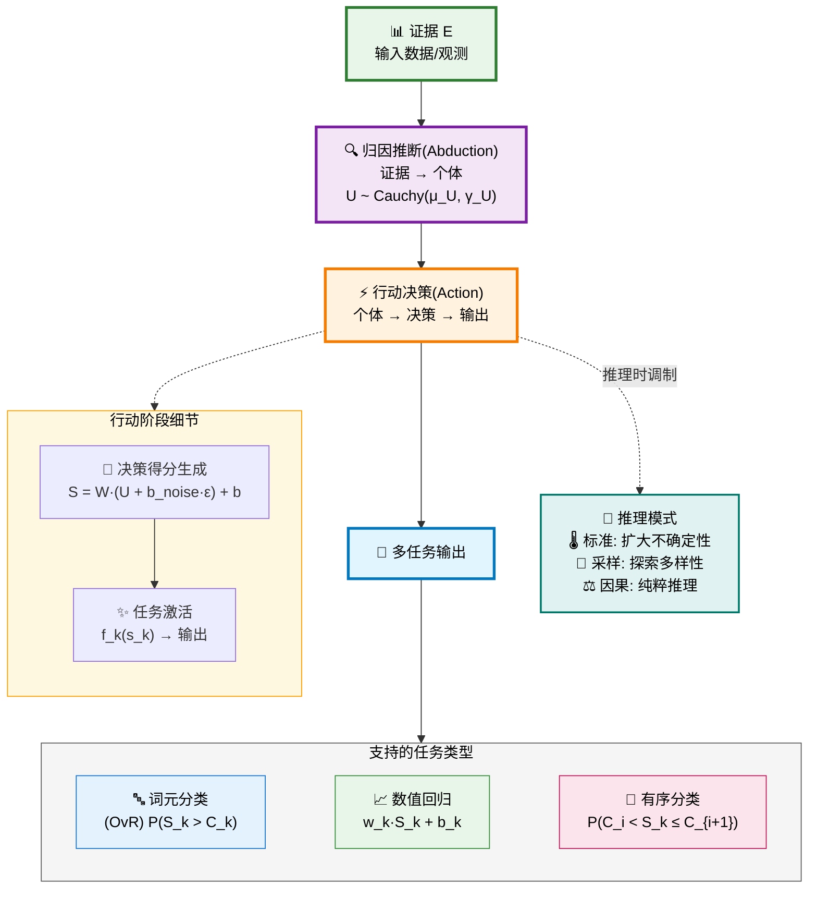
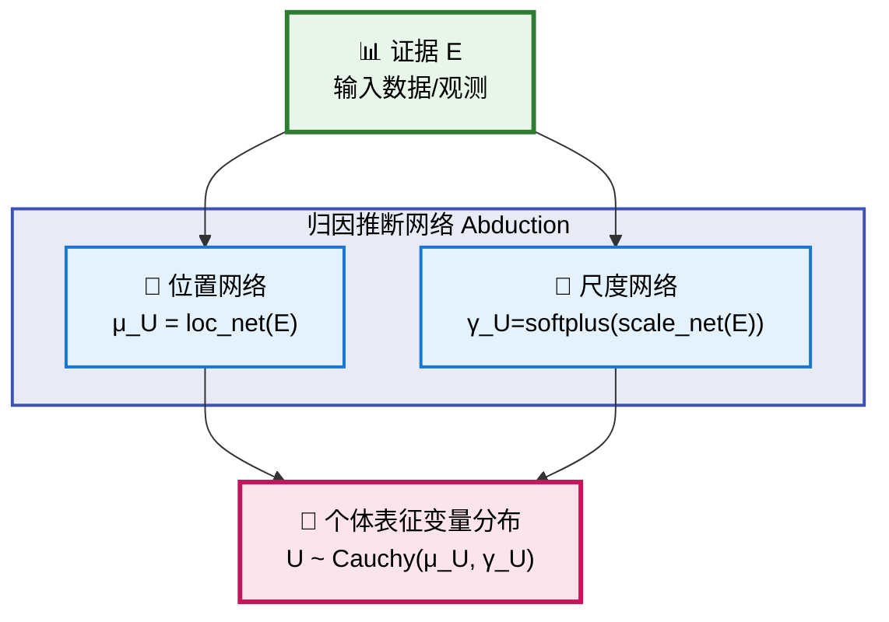
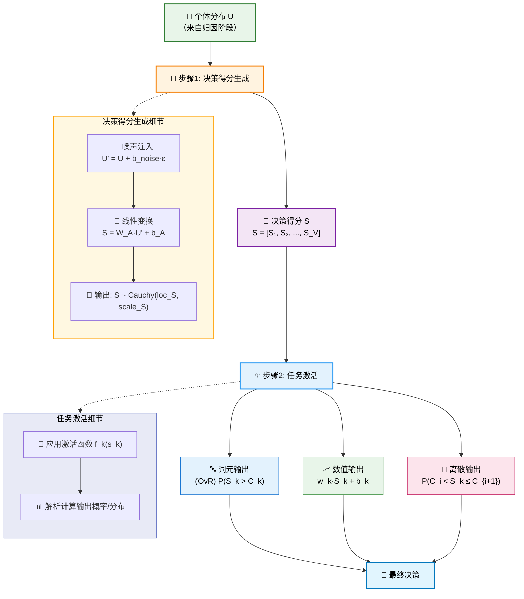
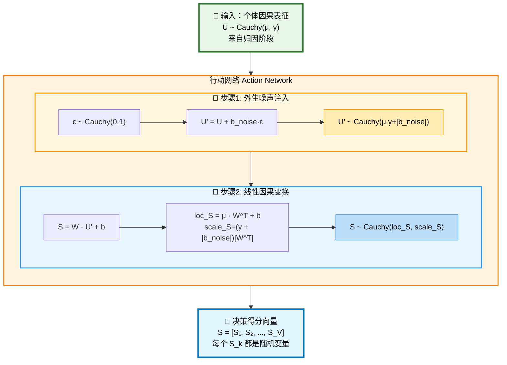
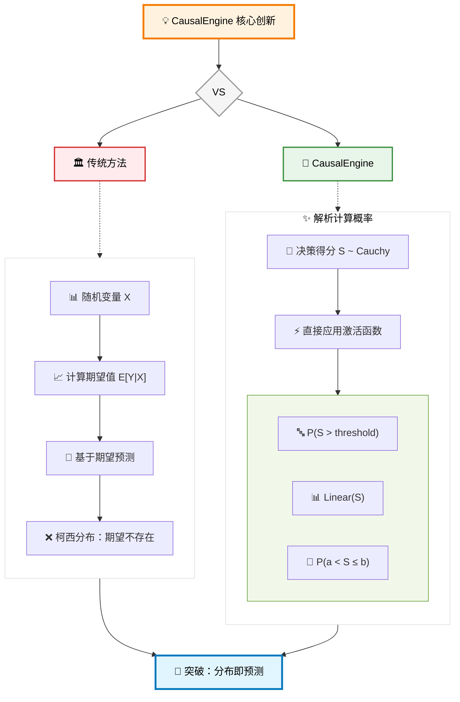
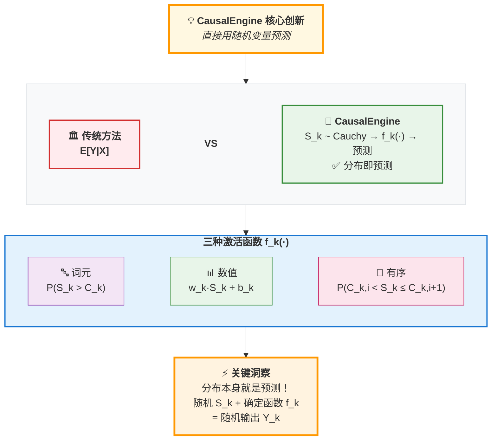
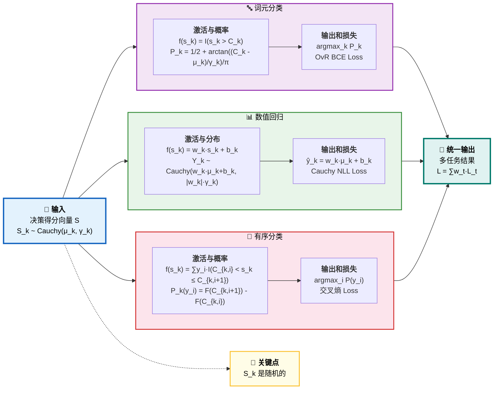
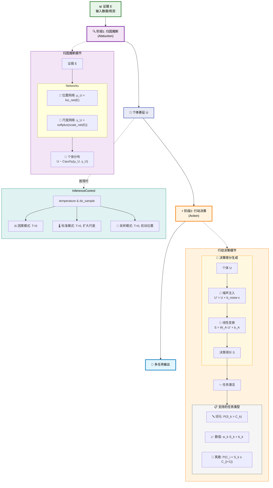

# CausalEngine 数学基础

## 摘要

CausalEngine 是一种基于因果推理的通用智能算法。它通过数学上严格的两阶段架构——归因（Abduction）和行动（Action）——实现了从证据到决策的完整因果链条。该算法的核心创新在于利用柯西分布的线性稳定性，首次实现了对不确定性的解析运算，从而避免了传统方法依赖的大规模采样。

## 核心数学框架

### 基本原理

为了真正实现因果推理，我们需要一个能够对个体的内在基因进行建模的框架。本项目的理论基石 ([arXiv:2401.15911](https://arxiv.org/abs/2401.15911)) 从数学上证明，为了构建一个能够灵活表达反事实的因果模型，引入一个外生的 **"个体选择变量" $U$** 是必要的。 $U$ 是理解本模型所有魔法的关键。它有两个核心身份：

1.  **个体选择变量 (Individual Selection Variable)**：一次具体的赋值 $U=u$ 代表着从所有可能的个体中"选中"了某一个特定个体 `u`。
2.  **个体因果表征 (Individual Causal Representation)**：被选中的向量 $u$ 本身，就包含了该个体所有内在的、驱动其行为的潜在属性。

**核心思想**：相同 treatment $t$ 下，普适的因果律 ($Y=f(t;u, \varepsilon)$) 应用于不同的个体 ($u$) 与外生噪声 ($\varepsilon$)，从而产生了不同的反事实结果 ($Y(t)$)。$U$ 是所有个体性系统性差异的最终来源，而 $\varepsilon$ 则代表了不可控的、非系统性的随机扰动。

因此 CausalEngine 基于以下核心数学框架：

$$Y = f(U, \varepsilon)$$

其中：
- $Y$: 观测结果
- $U$: 个体选择变量（Individual Choice Variable）
- $\varepsilon$: 外生噪声（Exogenous Noise）
- $f$: 普适因果机制（Universal Causal Mechanism）

### 两阶段架构

CausalEngine 的设计基于一个深刻的洞察：真正的智能不是模仿，而是理解。这种理解通过两个核心阶段实现：

1. **归因（Abduction）**：从观测推断个体的内在表征
2. **行动（Action）**：基于个体表征生成决策并输出结果

CausalEngine 通过三个独立且可组合的阶段运作：

#### 阶段1：归因推断（Abduction）
**证据 → 个体**

给定证据 $E$，推断个体选择变量 $U \sim \text{Cauchy}(\mu_U, \gamma_U)$，其中参数由独立的网络计算：

$$\mu_U = \text{loc\_net}(E)$$
$$\gamma_U = \text{softplus}(\text{scale\_net}(E)) = \log(1 + \exp(\text{scale\_net}(E)))$$

数学表示：
$$p(U|E) = \frac{1}{\pi\gamma_U} \cdot \frac{1}{1 + \left(\frac{U - \mu_U}{\gamma_U}\right)^2}$$

#### 阶段2：行动决策（Action）

这是因果链条中的核心驱动环节。它接收代表个体的分布 $U \sim \text{Cauchy}(\mu_U, \gamma_U)$，通过因果机制生成决策得分 $S$，并最终转化为任务特定的输出。

行动阶段包含两个主要组件：

##### 2.1 决策得分生成

在训练阶段，模型通过以下步骤生成决策得分：

1.  **注入外生噪声**:
    -   **基本原理**: 核心思想是对个体表征 $U$ 注入一个标准柯西分布的噪声 $\varepsilon \sim \text{Cauchy}(0, 1)$，其强度由一个可学习的参数向量 $\mathbf{b}_{\text{noise}}$ 控制。变换后的随机变量 $U'$ 为：
        $$U' = U + \mathbf{b}_{\text{noise}} \cdot \varepsilon$$
    -   **解析推导**: 根据柯西分布的线性稳定性，我们可以推导出 $U'$ 的分布。
        -   首先，我们有 $U \sim \text{Cauchy}(\mu_U, \gamma_U)$。
        -   其次，缩放后的噪声项 $\mathbf{b}_{\text{noise}} \cdot \varepsilon \sim \text{Cauchy}(0, |\mathbf{b}_{\text{noise}}|)$。
        -   因此，两个独立的柯西变量之和的分布为：
            $$U' \sim \text{Cauchy}(\mu_U + 0, \gamma_U + |\mathbf{b}_{\text{noise}}|) = \text{Cauchy}(\mu_U, \gamma_U + |\mathbf{b}_{\text{noise}}|)$$
    -   **计算实现**: 这个推导允许我们在计算中完全避免采样，直接通过对尺度参数进行加法操作来高效地实现噪声注入。

2.  **应用线性因果律**: 对这个包含了噪声的分布 $U'$ 应用一个线性变换（由权重 $W_A$ 和偏置 $b_A$ 定义），得到决策得分分布 $S$。根据柯西分布的线性稳定性：
    $$\text{loc}_S = (\mu_U) W_A^T + b_A$$
    $$\text{scale}_S = (\gamma_U + |\mathbf{b}_{\text{noise}}|) |W_A^T|$$

通过反向传播，模型会自动学习噪声强度参数 $\mathbf{b}_{\text{noise}}$ 的大小，从而为不同任务适配最优的不确定性。

##### 2.2 任务激活函数

##### 两个视角的统一

在理解任务激活函数时，有两个互补的视角：

任务激活是行动阶段的核心组成部分。它定义了一系列**基础激活函数**，这些函数独立地作用于高维决策得分向量 $S = [S_1, ..., S_V]$ 的**每一个分量 $S_k$**。这些函数构成了最底层的、确定性的因果机制。

模型的巧妙之处在于，它利用柯西分布的数学特性，在训练时无需对每个分量 $S_k$ 进行真正采样，而是解析地计算这些函数作用于整个分布后的概率或新分布。

**关键区分**：
- **训练时（分布视角）**：我们操作的是随机变量 $S_k \sim \text{Cauchy}(\text{loc}_k, \text{scale}_k)$，通过解析计算得到激活概率或变换后的分布，无需采样。
- **推理时（数值视角）**：我们可以从分布中采样得到具体数值 $s_k$，然后直接应用激活函数 $f_k(s_k)$ 得到确定性输出。这个体现了 DiscoSCM 的底层逻辑。 

**核心创新**：$f_k(s_k)$ 是确定性函数，但输入 $S_k$ 的随机性导致输出的随机性。我们用随机变量本身来预测结果，而不是用其统计量（如期望）——这正是CausalEngine与传统方法的根本区别。

对于决策得分向量 $S$ 的第 $k$ 个分量（其本身是一个随机变量 $S_k \sim \text{Cauchy}(\text{loc}_k, \text{scale}_k)$），我们定义一个作用于其任意一个实现值 $s_k$ 的基础激活函数 $f_k(s_k)$：

1.  **词元索引激活**:
    $$f_k(s_k) = I(s_k > C_k)$$
    其中 $I(\cdot)$ 是指示函数，$C_k$ 是第 $k$ 个分量专属的可学习类别阈值。

2.  **数值激活**:
    $$f_k(s_k) = w_k s_k + b_k$$
    其中 $w_k$ 和 $b_k$ 是第 $k$ 个分量专属的可学习线性变换参数。

3.  **离散有序数值激活**:
    $$f_k(s_k) = \sum_{i} y_i \cdot I(C_{k,i} < s_k \le C_{k,i+1})$$
    其中 $y_i$ 是有序离散输出值, 例如月份，$C_{k,i}$ 是可学习的区间边界（阈值）。

##### 核心创新：用随机变量预测

各任务的解析计算与损失函数如下：

##### 任务特定的激活函数

CausalEngine 的一个关键优势是其任务无关性。通过定义不同的激活函数，同一个决策得分 $S$ 可以用于多种预测任务：

**1. 词元索引激活（分类任务）**

-   **目标**: 对每个分量 $k$，计算其基础激活函数输出为1的概率，即 $P(f_k(S_k) = 1)$。
-   **解析推导**:
    $$P(f_k(S_k)=1) = P(I(S_k > C_k)=1) = P(S_k > C_k)$$
    利用柯西分布的累积分布函数(CDF)，我们可以直接计算这个概率：
    $$P(S_k > C_k) = \frac{1}{2} + \frac{1}{\pi}\arctan\left(\frac{C_k - \text{loc}_{S_k}}{\text{scale}_{S_k}}\right)$$
-   **多分类决策机制**: 对于词汇表中的所有词元 $k \in \{1, 2, ..., V\}$，每个词元都有独立的激活概率 $P_k$。最终的词元选择采用 **OvR (One-vs-Rest)** 策略：
    $$\text{selected\_token} = \arg\max_k P_k = \arg\max_k P(S_k > C_k)$$
    这种独立判断的方式与传统的 Softmax 不同，每个词元的选择概率不需要归一化，允许模型表达更灵活的不确定性。
-   **损失函数**: 基于每个分量的概率，对每个分量使用**二元交叉熵损失**：
    $$\mathcal{L}_{\text{token}} = -\sum_{k=1}^V \left[ y_k \log P_k + (1-y_k) \log(1-P_k) \right]$$
    其中 $y_k$ 是真实标签的 one-hot 编码。

**2. 数值激活（回归任务）**

-   **目标**: 对每个分量 $k$，得到基础激活函数作用后，输出变量的分布。
-   **解析推导**: 基础函数是线性变换 $f_k(s_k) = w_k s_k + b_k$。根据柯西分布的线性稳定性：
    如果 $S_k \sim \text{Cauchy}(\text{loc}_{S_k}, \text{scale}_{S_k})$，
    那么 $f_k(S_k) \sim \text{Cauchy}(w_k \text{loc}_{S_k} + b_k, |w_k| \text{scale}_{S_k})$。
-   **损失函数**: 对每个分量，基于这个推导出的输出分布，使用**柯西分布的负对数似然损失**。

**3. 离散有序数值激活（有序分类任务）**

-   **目标**: 对每个分量 $k$，计算其激活函数输出为特定数值 $y_i$ 的概率，即 $P(f_k(S_k) = y_i)$。
-   **解析推导**:
    $$P(f_k(S_k)=y_i) = P(\sum_{j} y_j \cdot I(C_{k,j} < S_k \le C_{k, j+1}) = y_i) = P(C_{k,i} < S_k \le C_{k,i+1})$$
    利用柯西CDF，我们可以直接计算这个区间概率：
    $$P(C_{k,i} < S_k \le C_{k,i+1}) = F(C_{k,i+1}) - F(C_{k,i}) \\
    = \frac{1}{\pi}\left[\arctan\left(\frac{C_{k,i+1} - \text{loc}_{S_k}}{\text{scale}_{S_k}}\right) - \arctan\left(\frac{C_{k,i} - \text{loc}_{S_k}}{\text{scale}_{S_k}}\right)\right]$$
-   **损失函数**: 将所有可能的数值 $y_i$ 视为不同类别，对每个分量使用标准的**分类交叉熵损失**。

##### 任务扩展性

CausalEngine 的数学框架具有天然的扩展性。添加新任务只需：

1. 定义基础激活函数 $f_k(s_k)$
2. 推导其在柯西分布下的解析形式
3. 实现相应的损失函数

例如，时间预测任务可以定义为：
$$f_k(s_k) = \exp(w_k \cdot s_k + b_k)$$
其中输出表示事件发生的时间。

多任务学习时，总损失函数为各任务损失的加权和：
$$\mathcal{L}_{\text{total}} = \sum_{t \in \text{tasks}} w_t \cdot \mathcal{L}_t$$

这种设计使得CausalEngine可以同时处理分类、回归、排序等多种任务，真正实现了"一个引擎，多种应用"的愿景。

## 推理模式：对噪声的灵活调制

CausalEngine 通过一个统一的数学框架实现了对不确定性的精确控制。在推理阶段，我们通过 `temperature` 和 `do_sample` 两个参数调制已学习的外生噪声 $\mathbf{b}_{\text{noise}}$，从而在同一模型中实现从确定性推理到创造性生成的连续谱。

### 1. 标准模式 (Standard Mode)
- **设置**: `do_sample=False`, `temperature > 0`
- **机制**: 噪声被 `temperature` 缩放后，增加**尺度参数**，扩大决策的不确定性，但保持个体身份不变。
- **数学原理**:
  $$U' \sim \text{Cauchy}(\mu_U, \gamma_U + \text{temperature} \cdot |\mathbf{b}_{\text{noise}}|)$$
- **哲学含义**: 模拟环境噪声使个体的判断变得更加模糊，但不改变其核心身份。

### 2. 采样模式 (Sampling Mode)
- **设置**: `do_sample=True`, `temperature > 0`
- **机制**: 噪声被 `temperature` 缩放后，扰动**位置参数**，改变个体的身份表征，探索多样性。
- **数学原理**: 首先采样标准柯西噪声 $\varepsilon \sim \text{Cauchy}(0, 1)$，然后：
  $$U' \sim \text{Cauchy}(\mu_U + \text{temperature} \cdot |\mathbf{b}_{\text{noise}}| \cdot \varepsilon, \gamma_U)$$
- **哲学含义**: 探索当个体因随机扰动而偏离其典型状态时，会做出何种不同的决策。

### 3. 因果模式 (Causal Mode)
- **设置**: `temperature = 0`
- **机制**: 完全关闭外生噪声的影响。
- **数学原理**:
  $$U' \sim \text{Cauchy}(\mu_U, \gamma_U)$$
- **哲学含义**: 个体在无外生噪声下的必然表达，是最纯粹的因果推理。

```mermaid
graph TB
    %% 推理模式：三种调制方式
    
    Input["🎯 推理输入<br/>个体分布 U ~ Cauchy(μ_U, γ_U)（随机变量）<br/>已学习噪声强度 b_noise"]
    
    Input --> Control["⚙️ 推理控制<br/>temperature (T) & do_sample"]
    
    Control --> Modes
    
    subgraph Modes ["🔀 三种推理模式（并列）"]
        direction LR
        
        subgraph CausalMode ["⚖️ 因果模式"]
            direction TB
            C_Cond["条件: T = 0"]
            C_Desc["💎 纯粹因果推理<br/>无噪声影响"]
            C_Math["U' = U<br/>U' ~ Cauchy(μ_U, γ_U)"]
            C_Use["应用场景:<br/>• 确定性推理<br/>• 硬决策<br/>• 点估计"]
            C_Cond --> C_Desc --> C_Math --> C_Use
        end
        
        subgraph StandardMode ["🌡️ 标准模式"]
            direction TB
            S_Cond["条件: T > 0, do_sample = False"]
            S_Desc["❄️ 增加不确定性<br/>扩大尺度参数"]
            S_Math["γ' = γ_U + T·|b_noise|<br/>U' ~ Cauchy(μ_U, γ')"]
            S_Use["应用场景:<br/>• 稳定生成<br/>• 软决策<br/>• 置信区间"]
            S_Cond --> S_Desc --> S_Math --> S_Use
        end
        
        subgraph SamplingMode ["🎲 采样模式"]
            direction TB
            M_Cond["条件: T > 0, do_sample = True"]
            M_Desc["🎨 探索多样性<br/>扰动位置参数"]
            M_Math["ε ~ Cauchy(0,1)<br/>μ' = μ_U + T·|b_noise|·ε<br/>U' ~ Cauchy(μ', γ_U)"]
            M_Use["应用场景:<br/>• 创造性生成<br/>• 探索边界<br/>• 蒙特卡洛"]
            M_Cond --> M_Desc --> M_Math --> M_Use
        end
    end
    
    Modes --> Output
    
    subgraph Output ["🎉 输出"]
        OutDesc["调制后的个体分布 U'（随机变量）<br/>传递给行动阶段生成决策得分 S"]
    end
    
    %% 样式
    style Input fill:#e8f5e9,stroke:#2e7d32,stroke-width:3px,color:#000
    style Control fill:#fff3e0,stroke:#f57c00,stroke-width:2px,color:#000
    style Modes fill:#f5f5f5,stroke:#9e9e9e,stroke-width:1px,color:#000
    style Output fill:#e1f5fe,stroke:#0277bd,stroke-width:2px,color:#000
    
    style CausalMode fill:#e3f2fd,stroke:#2196f3,stroke-width:2px,color:#000
    style StandardMode fill:#fff8e1,stroke:#ffc107,stroke-width:2px,color:#000
    style SamplingMode fill:#e8f5e9,stroke:#4caf50,stroke-width:2px,color:#000
```

## 结论

CausalEngine 提供了一个数学上完备、计算上高效的因果推理算法。其核心贡献包括：

### 理论创新

1. **统一的因果架构**：通过归因-行动两阶段，实现了从观测到决策的完整因果链条
2. **解析不确定性运算**：利用柯西分布的线性稳定性，避免了采样开销，实现了对"可能性"的直接计算
3. **独立决策机制**：通过OvR（One-vs-Rest）策略，每个选择具有独立的激活概率，摆脱了softmax的归一化约束
4. **灵活的噪声控制**：通过temperature参数的数学调制，在同一框架内实现确定性和随机性的连续过渡

### 实践意义

CausalEngine 不仅支持传统的词元预测，还原生支持：
- **连续数值预测**：通过线性变换保持柯西分布性质
- **离散有序预测**：通过区间概率的解析计算
- **多任务学习**：通过独立的激活函数组合

这种设计使得CausalEngine成为一个真正通用的智能算法，能够作为各类应用的基础引擎。其数学优雅性和工程实用性的结合，为构建下一代智能系统提供了坚实的理论基础。 