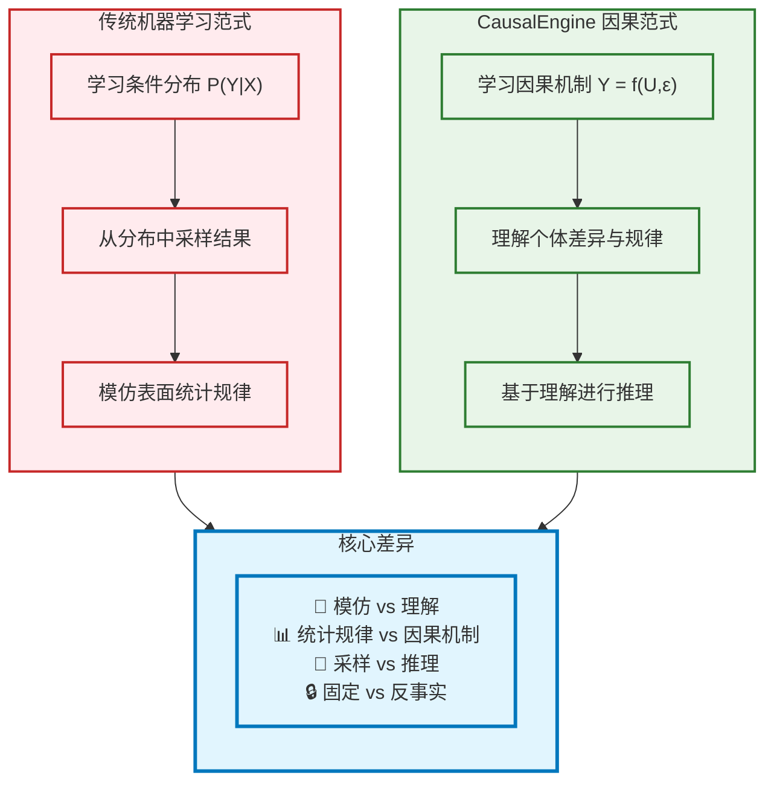
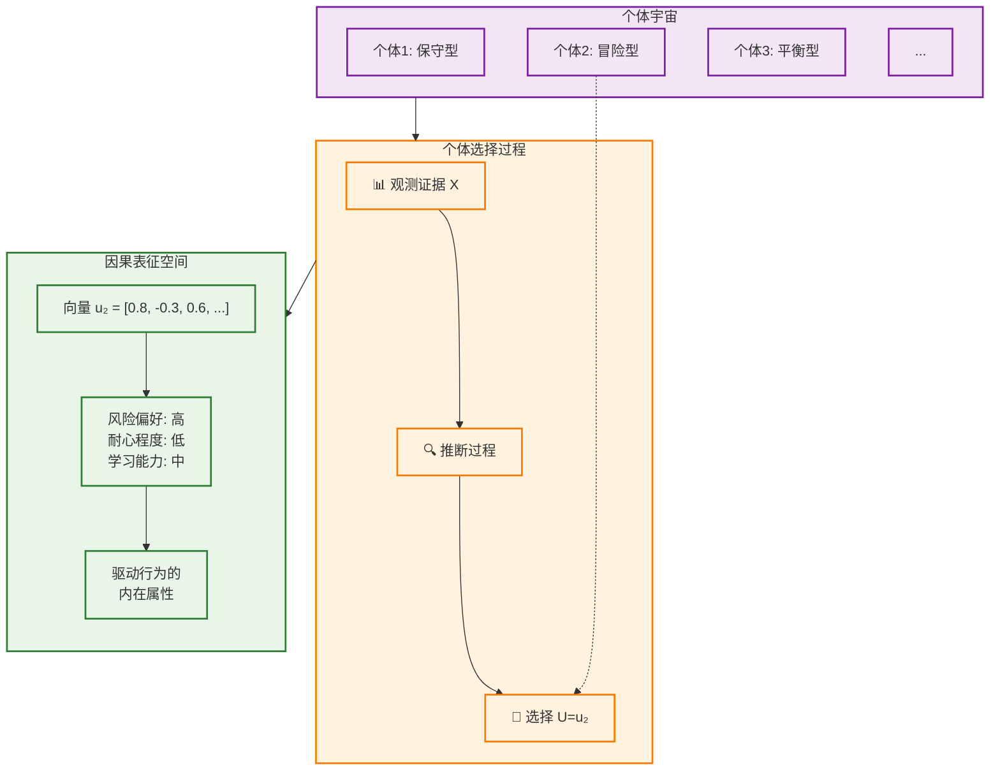
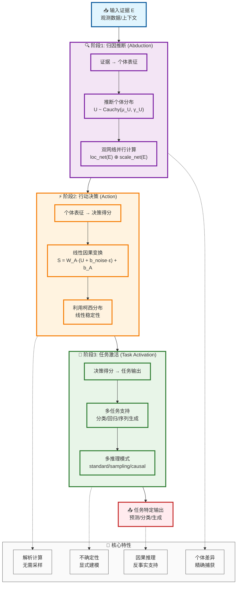
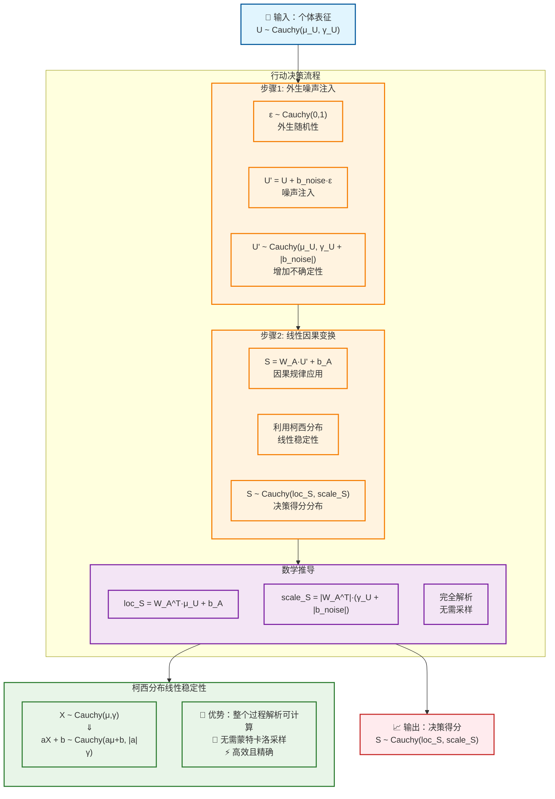
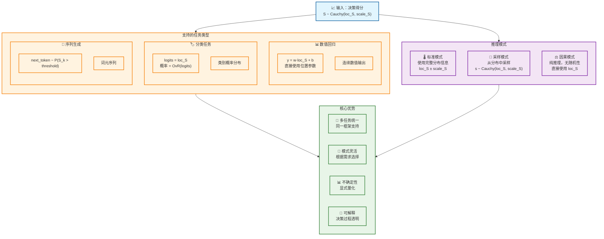
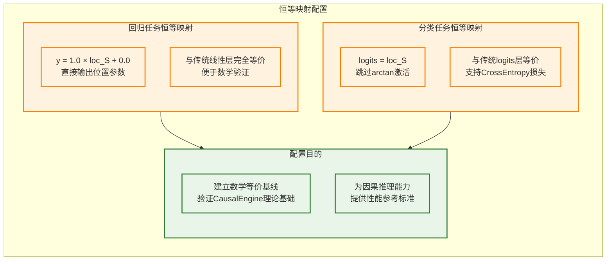
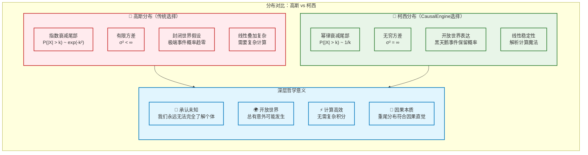
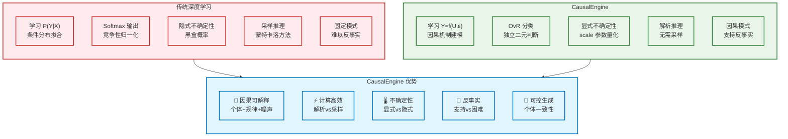
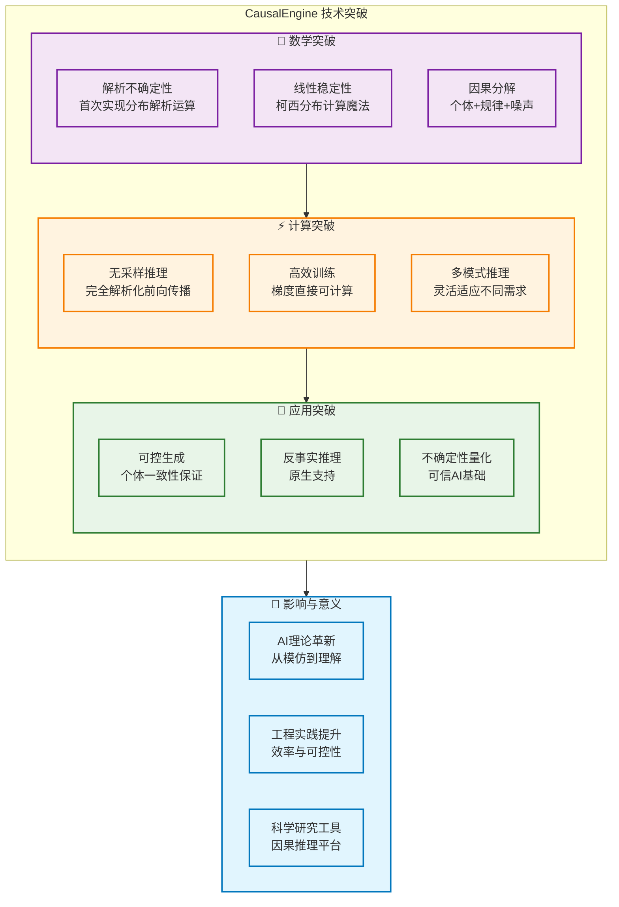

# CausalEngine 数学基础

> **核心创新**: 基于因果推理的通用智能算法，首次实现不确定性的解析运算  
> **理论基石**: [Distribution-consistency Structural Causal Models](https://arxiv.org/abs/2401.15911)  
> **技术突破**: 利用柯西分布的线性稳定性，避免大规模采样

## 1. 核心哲学与数学框架

### 1.1 因果推理的本质

CausalEngine 基于一个深刻洞察：**真正的智能是理解，而非模仿**。传统机器学习通过学习 $P(Y|X)$ 来模拟数据分布，而 CausalEngine 通过学习因果机制来理解世界运行的本质规律。



### 1.2 个体选择变量 U 的双重身份

为了真正实现因果推理，我们引入**个体选择变量 $U$**——这是理解 CausalEngine 所有"魔法"的关键：

**身份一：个体选择变量**
- $U=u$ 代表从所有可能个体中"选择"了特定个体 $u$

**身份二：个体因果表征**  
- 向量 $u$ 包含该个体所有内在的、驱动其行为的潜在属性



### 1.3 核心数学框架

CausalEngine 基于结构因果模型的数学框架：

$$Y = f(U, \varepsilon)$$

其中：
- **$Y$**: 观测结果
- **$U$**: 个体选择变量（Individual Choice Variable）
- **$\varepsilon$**: 外生噪声（Exogenous Noise）  
- **$f$**: 普适因果机制（Universal Causal Mechanism）

**关键洞察**：
- **复杂性在表征**：从混乱证据 $X$ 推断真正表征 $U$ 是高度非线性的
- **简洁性在规律**：一旦找到正确表征 $u$，因果规律 $f$ 本身是简单线性的
- **一致性在机制**：函数 $f$ 对所有个体普适，个体差异完全体现在 $u$ 中

## 2. CausalEngine 三阶段架构

### 2.1 整体架构图



### 2.2 阶段1：归因推断（Abduction）

**核心任务**：从观测证据推断个体的内在因果表征

```mermaid
graph TB
    Evidence["📊 输入证据 E<br/>特征/上下文/历史"]
    
    subgraph AbductionDetail["归因推断详细流程"]
        direction TB
        
        subgraph DualNetwork["双网络并行架构"]
            direction LR
            LocNet["📍 位置网络<br/>μ_U = loc_net(E)<br/>预测个体"中心""]
            ScaleNet["📏 尺度网络<br/>γ_U = softplus(scale_net(E))<br/>预测个体"不确定性""]
        end
        
        subgraph Distribution["个体表征分布"]
            direction TB
            Formula["U ~ Cauchy(μ_U, γ_U)"]
            PDF["概率密度函数:<br/>p(U|E) = 1/(πγ_U) · 1/(1 + ((U-μ_U)/γ_U)²)"]
            Meaning["包含个体所有<br/>内在因果属性"]
        end
    end
    
    Evidence --> DualNetwork
    DualNetwork --> Distribution
    
    subgraph CauchyProperties["柯西分布的深刻含义"]
        direction TB
        P1["📊 重尾分布<br/>为"黑天鹅"事件保留概率"]
        P2["🤔 无穷方差<br/>承认个体的"深刻未知""]
        P3["🔄 线性稳定性<br/>支持解析计算"]
        P4["🌍 开放世界<br/>诚实表达不确定性"]
    end
    
    Distribution --> CauchyProperties
    
    classDef evidenceStyle fill:#e1f5fe,stroke:#01579b,stroke-width:2px
    classDef networkStyle fill:#e3f2fd,stroke:#1976d2,stroke-width:2px
    classDef distributionStyle fill:#f3e5f5,stroke:#7b1fa2,stroke-width:2px
    classDef propertyStyle fill:#e8f5e8,stroke:#2e7d32,stroke-width:2px
    
    class Evidence evidenceStyle
    class DualNetwork,LocNet,ScaleNet networkStyle
    class Distribution,Formula,PDF,Meaning distributionStyle
    class CauchyProperties,P1,P2,P3,P4 propertyStyle
```

**数学表达**：

位置网络计算个体表征的"中心"：
$$\mu_U = \text{loc\_net}(E)$$

尺度网络计算个体表征的"不确定性"：
$$\gamma_U = \text{softplus}(\text{scale\_net}(E)) = \log(1 + \exp(\text{scale\_net}(E)))$$

个体表征分布：
$$U \sim \text{Cauchy}(\mu_U, \gamma_U)$$

### 2.3 阶段2：行动决策（Action）

**核心任务**：基于个体表征生成决策得分，体现普适因果规律



**线性稳定性的数学魔法**：

柯西分布具有独特的线性稳定性质：
$$\text{如果 } X \sim \text{Cauchy}(\mu, \gamma), \text{ 则 } aX + b \sim \text{Cauchy}(a\mu + b, |a|\gamma)$$

**加法稳定性**：
$$X_1 \sim \text{Cauchy}(\mu_1, \gamma_1), X_2 \sim \text{Cauchy}(\mu_2, \gamma_2) \Rightarrow X_1 + X_2 \sim \text{Cauchy}(\mu_1 + \mu_2, \gamma_1 + \gamma_2)$$

**线性组合稳定性**：
$$\sum_{i=1}^n w_i X_i \sim \text{Cauchy}\left(\sum_{i=1}^n w_i \mu_i, \sum_{i=1}^n |w_i| \gamma_i\right)$$

这使得整个前向传播过程完全解析化，无需任何采样！

### 2.4 阶段3：任务激活（Task Activation）

**核心任务**：将决策得分转化为任务特定的输出

任务激活头是 CausalEngine 的最后一层，负责将通用的决策得分 $S$ 转换为具体任务需要的输出格式。不同的激活模式支持不同类型的机器学习任务。



#### 数学等价性配置

对于数学等价性验证，可以将任务激活头配置为恒等映射模式：



这种恒等映射配置使得 CausalEngine 在冻结条件下与传统 MLP 完全等价，为后续的因果推理能力评估提供了可信的基线。

## 3. 柯西分布：开放世界的数学语言

### 3.1 为什么选择柯西分布？



### 3.2 柯西分布的三重价值

**1. 诚实的不确定性表达**
> "任何观测到的伟大成就，任何人都有非零的概率做出来"

重尾分布为"黑天鹅"事件保留不可忽略的概率，诚实表达开放世界的深层不确定性。

**2. 数学上的"深刻未知"**

柯西分布的期望和方差数学上无定义：
$$E[X] = \text{undefined}, \quad \text{Var}[X] = \text{undefined}$$

这恰好对应了"我们永远无法完全知道一个个体到底是什么样的"这一哲学事实。

**3. 线性稳定性（计算魔法）**

柯西分布的线性稳定性使得整个前向传播过程可以完全解析化：

$$X_1 + X_2 \sim \text{Cauchy}(\mu_1 + \mu_2, \gamma_1 + \gamma_2)$$
$$w \cdot X \sim \text{Cauchy}(w \cdot \mu, |w| \cdot \gamma)$$

## 4. 实际应用与优势

### 4.1 与传统方法的对比



### 4.2 核心技术突破



## 5. 总结与展望

CausalEngine 代表了人工智能从"模仿"向"理解"的范式转变。通过引入个体选择变量 $U$ 和利用柯西分布的线性稳定性，我们首次实现了：

1. **真正的因果推理**：基于 $Y = f(U, \varepsilon)$ 的因果机制建模
2. **解析不确定性**：无需采样的完全解析化计算  
3. **可控可解释**：个体差异与普适规律的清晰分离
4. **反事实支持**：原生支持反事实推理和可控生成

这不仅是技术上的突破，更是AI哲学的革新——从学习表面统计规律转向理解深层因果机制，为构建真正智能、可信、可控的AI系统奠定了坚实基础。

---

**文档版本**: v6.0 (图文并茂完整版)  
**最后更新**: 2024年6月24日  
**理论基础**: [Distribution-consistency SCM](https://arxiv.org/abs/2401.15911)  
**技术状态**: ✅ 理论完备，实现验证