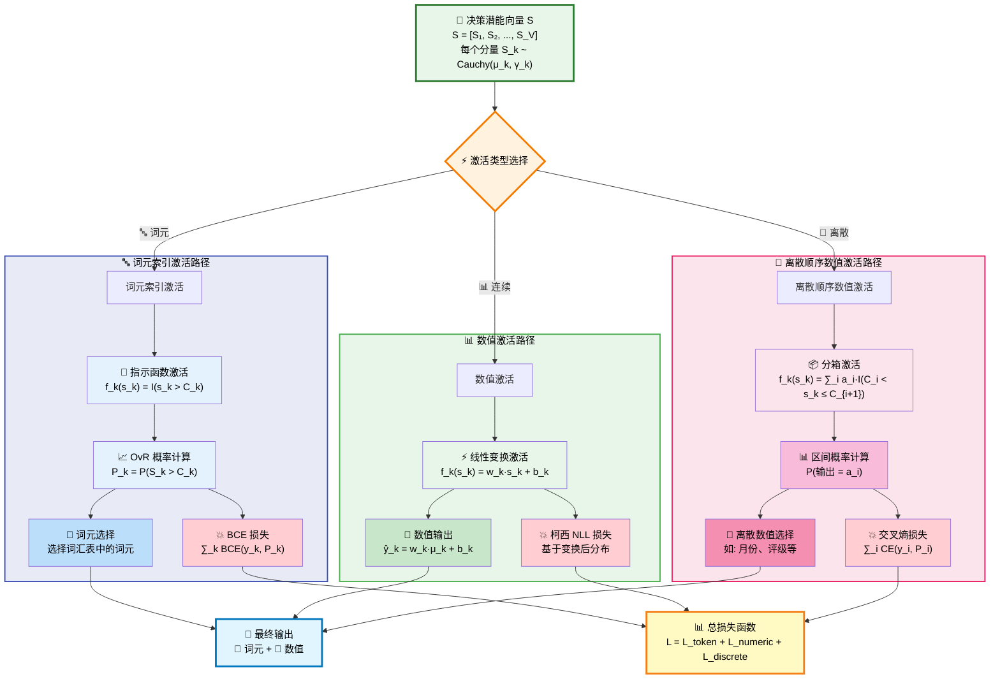

# CausalEngine 数学基础

## 摘要

CausalEngine 是一种用于因果推理的通用算法框架，通过三阶段架构将证据转换为任务特定的输出。该框架利用柯西分布的线性稳定性实现解析计算，避免采样开销，提供了一个可扩展的因果建模平台。

## 核心数学框架

### 基本原理

CausalEngine 基于以下核心数学框架：

$$Y = f(U, \varepsilon)$$

其中：
- $Y$: 观测结果
- $U$: 个体选择变量（Individual Choice Variable）
- $\varepsilon$: 外生噪声（Exogenous Noise）
- $f$: 普适因果机制（Universal Causal Mechanism）

### 三阶段架构

CausalEngine 通过三个独立且可组合的阶段运作：

#### 阶段1：归因推断（Abduction）
**证据 → 个体**

给定证据 $E$，推断个体选择变量 $U \sim \text{Cauchy}(\mu_U, \gamma_U)$，其中参数由独立的网络计算：

$$\mu_U = \text{loc\_net}(E)$$
$$\gamma_U = \text{softplus}(\text{scale\_net}(E)) = \log(1 + \exp(\text{scale\_net}(E)))$$

数学表示：
$$p(U|E) = \frac{1}{\pi\gamma_U} \cdot \frac{1}{1 + \left(\frac{U - \mu_U}{\gamma_U}\right)^2}$$

#### 阶段2：行动决策（Action）

这是因果链条中的核心驱动环节。它接收代表个体的分布 $U \sim \text{Cauchy}(\mu_U, \gamma_U)$，并通过两个关键步骤将其转化为最终的决策潜能 $S$：

1.  **注入外生噪声**:
    -   **基本原理**: 核心思想是对个体表征 $U$ 注入一个标准柯西分布的噪声 $\varepsilon \sim \text{Cauchy}(0, 1)$，其强度由一个可学习的参数向量 $\mathbf{b}_{\text{noise}}$ 控制。变换后的随机变量 $U'$ 为：
        $$U' = U + \mathbf{b}_{\text{noise}} \cdot \varepsilon$$
    -   **解析推导**: 根据柯西分布的线性稳定性，我们可以推导出 $U'$ 的分布。
        -   首先，我们有 $U \sim \text{Cauchy}(\mu_U, \gamma_U)$。
        -   其次，缩放后的噪声项 $\mathbf{b}_{\text{noise}} \cdot \varepsilon \sim \text{Cauchy}(0, |\mathbf{b}_{\text{noise}}|)$。
        -   因此，两个独立的柯西变量之和的分布为：
            $$U' \sim \text{Cauchy}(\mu_U + 0, \gamma_U + |\mathbf{b}_{\text{noise}}|) = \text{Cauchy}(\mu_U, \gamma_U + |\mathbf{b}_{\text{noise}}|)$$
    -   **计算实现**: 这个推导允许我们在计算中完全避免采样，直接通过对尺度参数进行加法操作来高效地实现噪声注入。

2.  **应用普适因果律**: 对受噪声影响的个体应用统一的线性变换。

##### 训练阶段的前向传播

在训练阶段，模型的前向传播包含两个关键步骤：注入外生噪声，并应用普适因果律。

1.  **注入外生噪声**:
    -   **基本原理**: 核心思想是对个体表征 $U$ 注入一个标准柯西分布的噪声 $\varepsilon \sim \text{Cauchy}(0, 1)$，其强度由一个可学习的参数向量 $\mathbf{b}_{\text{noise}}$ 控制。变换后的随机变量 $U'$ 为：
        $$U' = U + \mathbf{b}_{\text{noise}} \cdot \varepsilon$$
    -   **解析推导**: 根据柯西分布的线性稳定性，我们可以推导出 $U'$ 的分布。
        -   首先，我们有 $U \sim \text{Cauchy}(\mu_U, \gamma_U)$。
        -   其次，缩放后的噪声项 $\mathbf{b}_{\text{noise}} \cdot \varepsilon \sim \text{Cauchy}(0, |\mathbf{b}_{\text{noise}}|)$。
        -   因此，两个独立的柯西变量之和的分布为：
            $$U' \sim \text{Cauchy}(\mu_U + 0, \gamma_U + |\mathbf{b}_{\text{noise}}|) = \text{Cauchy}(\mu_U, \gamma_U + |\mathbf{b}_{\text{noise}}|)$$
    -   **计算实现**: 这个推导允许我们在计算中完全避免采样，直接通过对尺度参数进行加法操作来高效地实现噪声注入。

2.  **应用线性因果律**: 对这个包含了噪声的分布 $U'$ 应用一个线性变换（由权重 $W_A$ 和偏置 $b_A$ 定义），得到决策潜能分布 $S$。根据柯西分布的线性稳定性：
    $$\text{loc}_S = (\mu_U) W_A^T + b_A$$
    $$\text{scale}_S = (\gamma_U + |\mathbf{b}_{\text{noise}}|) |W_A^T|$$

通过反向传播，模型会自动学习噪声强度参数 $\mathbf{b}_{\text{noise}}$ 的大小，从而为不同任务适配最优的不确定性。

---
**重要连接**: 上述训练过程产生的、包含了外生噪声影响的最终决策潜能分布 $S$，将被传递给任务激活头（ActivationHead）进行最终的、任务特定的处理。

## 推理模式：对噪声的灵活调制

在推理阶段，我们可以通过 `temperature` 和 `do_sample` 两个参数，灵活地**调制**已经学习到的外生噪声 $\mathbf{b}_{\text{noise}}$，以实现不同的生成策略。

### 1. 标准模式 (Standard Mode)
- **设置**: `do_sample=False`, `temperature > 0`
- **机制**: 噪声被 `temperature` 缩放后，增加**尺度参数**，扩大决策的不确定性，但保持个体身份不变。
- **数学原理**:
  $$U' \sim \text{Cauchy}(\mu_U, \gamma_U + \text{temperature} \cdot |\mathbf{b}_{\text{noise}}|)$$
- **哲学含义**: 模拟环境噪声使个体的判断变得更加模糊，但不改变其核心身份。

### 2. 采样模式 (Sampling Mode)
- **设置**: `do_sample=True`, `temperature > 0`
- **机制**: 噪声被 `temperature` 缩放后，扰动**位置参数**，改变个体的身份表征，探索多样性。
- **数学原理**: 首先采样标准柯西噪声 $\varepsilon \sim \text{Cauchy}(0, 1)$，然后：
  $$U' \sim \text{Cauchy}(\mu_U + \text{temperature} \cdot |\mathbf{b}_{\text{noise}}| \cdot \varepsilon, \gamma_U)$$
- **哲学含义**: 探索当个体因随机扰动而偏离其典型状态时，会做出何种不同的决策。

### 3. 纯因果模式 (Causal Mode)
- **设置**: `temperature = 0`
- **机制**: 完全关闭外生噪声的影响。
- **数学原理**:
  $$U' \sim \text{Cauchy}(\mu_U, \gamma_U)$$
- **哲学含义**: 个体在无干扰环境下的必然表达，是对因果理论最纯粹的实现。

## 任务激活函数

ActivationHead 的核心是定义了一系列**基础激活函数**，这些函数独立地作用于高维决策潜能向量 $S = [S_1, ..., S_V]$ 的**每一个分量 $S_k$**。这些函数构成了最底层的、确定性的因果机制。

模型的巧妙之处在于，它利用柯西分布的数学特性，在训练时无需对每个分量 $S_k$ 进行真正采样，而是解析地计算这些函数作用于整个分布后的概率或新分布。

### 基础激活函数定义

对于决策潜能向量 $S$ 的第 $k$ 个分量（其本身是一个随机变量 $S_k \sim \text{Cauchy}(\text{loc}_k, \text{scale}_k)$），我们定义一个作用于其任意一个实现值 $s_k$ 的基础激活函数 $f_k(s_k)$：

1.  **词元索引激活**:
    $$f_k(s_k) = I(s_k > C_k)$$
    其中 $I(\cdot)$ 是指示函数，$C_k$ 是第 $k$ 个分量专属的可学习类别阈值。

2.  **数值激活**:
    $$f_k(s_k) = w_k s_k + b_k$$
    其中 $w_k$ 和 $b_k$ 是第 $k$ 个分量专属的可学习线性变换参数。

3.  **离散顺序数值激活**:
    $$f_k(s_k) = \sum_{i} a_i \cdot I(C_i < s_k \le C_{i+1})$$
    其中 $a_i$ 是离散的整数输出值, 例如月份，$C_i$ 是可学习的区间边界（阈值）。

### 各任务的解析计算与损失函数

#### 词元索引激活

-   **目标**: 对每个分量 $k$，计算其基础激活函数输出为1的概率，即 $P(f_k(S_k) = 1)$。
-   **解析推导**:
    $$P(f_k(S_k)=1) = P(I(S_k > C_k)=1) = P(S_k > C_k)$$
    利用柯西分布的累积分布函数(CDF)，我们可以直接计算这个概率：
    $$P(S_k > C_k) = \frac{1}{2} - \frac{1}{\pi}\arctan\left(\frac{C_k - \text{loc}_k}{\text{scale}_k}\right)$$
-   **多分类决策机制**: 对于词汇表中的所有词元 $k \in \{1, 2, ..., V\}$，每个词元都有独立的激活概率 $P_k$。最终的词元选择采用 **OvR (One-vs-Rest)** 策略：
    $$\text{selected\_token} = \arg\max_k P_k = \arg\max_k P(S_k > C_k)$$
    这种独立判断的方式与传统的 Softmax 不同，每个词元的选择概率不需要归一化，允许模型表达更灵活的不确定性。
-   **损失函数**: 基于每个分量的概率，对每个分量使用**二元交叉熵损失**：
    $$\mathcal{L}_{\text{token}} = -\sum_{k=1}^V \left[ y_k \log P_k + (1-y_k) \log(1-P_k) \right]$$
    其中 $y_k$ 是真实标签的 one-hot 编码。

#### 数值激活

-   **目标**: 对每个分量 $k$，得到基础激活函数作用后，输出变量的分布。
-   **解析推导**: 基础函数是线性变换 $f_k(s_k) = w_k s_k + b_k$。根据柯西分布的线性稳定性：
    如果 $S_k \sim \text{Cauchy}(\text{loc}_k, \text{scale}_k)$，
    那么 $f_k(S_k) \sim \text{Cauchy}(w_k \text{loc}_k + b_k, |w_k| \text{scale}_k)$。
-   **损失函数**: 对每个分量，基于这个推导出的输出分布，使用**柯西分布的负对数似然损失**。

#### 离散顺序数值激活

-   **目标**: 对每个分量 $k$，计算其基础激活函数输出为特定数值 $a_i$ 的概率，即 $P(f_k(S_k) = a_i)$。
-   **解析推导**:
    $$P(f_k(S_k)=a_i) = P(\sum_{j} a_j \cdot I(C_j < S_k \le C_{j+1}) = a_i) = P(C_i < S_k \le C_{i+1})$$
    利用柯西CDF，我们可以直接计算这个区间概率：
    $$P(C_i < S_k \le C_{i+1}) = F(C_{i+1}) - F(C_i)$$
    $$= \frac{1}{\pi}\left[\arctan\left(\frac{C_{i+1} - \text{loc}_k}{\text{scale}_k}\right) - \arctan\left(\frac{C_i - \text{loc}_k}{\text{scale}_k}\right)\right]$$
    **注意**: 之前文档中的整数预测是该激活函数的一个特例，其中 $a_i = i$ 且 $C_i = i - 0.5$。
-   **损失函数**: 将所有可能的数值 $a_i$ 视为不同类别，对每个分量使用标准的**分类交叉熵损失**。

### 任务扩展性

添加新任务类型只需定义一个新的**基础激活函数** $f_k(s_k)$，并推导出其对应的解析计算方法即可。

## 网络架构

### 归因网络（AbductionNetwork）

`AbductionNetwork` 包含两个完全独立的子网络，分别用于计算位置和尺度参数：

1.  **位置网络 ($\text{loc\_net}$)**: 
    $$\mu_U = \text{loc\_net}(E)$$
    该网络可以是一个简单的线性层，也可以是一个多层感知器（MLP）。

2.  **尺度网络 ($\text{scale\_net}$)**: 
    $$\text{raw\_scale} = \text{scale\_net}(E)$$
    $$\gamma_U = \text{softplus}(\text{raw\_scale})$$
    该网络通常是一个多层感知器（MLP），其输出通过 `softplus` 函数确保尺度参数 $\gamma_U$ 为正。`softplus(x) = \log(1 + \exp(x))`。

### 行动网络（ActionNetwork）

`ActionNetwork` 实现了一个线性的因果定律，将个体表征 $U$ 映射到决策潜能 $S$。

该网络的核心是一个线性层：
$$\text{linear\_law}(U) = U W_A^T + b_A$$

给定输入分布 $U \sim \text{Cauchy}(\mu_U, \gamma_U)$，输出分布 $S \sim \text{Cauchy}(\text{loc}_S, \text{scale}_S)$ 的参数通过以下方式解析计算：
- **位置参数**：
  $$\text{loc}_S = \text{linear\_law}(\mu_U) = \mu_U W_A^T + b_A$$
- **尺度参数**：
  $$\text{scale}_S = \gamma_U |W_A^T|$$
这种设计利用柯西分布的线性稳定性，直接通过矩阵运算传播不确定性，而无需采样。

### 激活头（ActivationHead）

任务特定的输出层：

$$\text{output} = \text{TaskActivation}(S, \text{task\_params})$$

其中 $\text{task\_params}$ 包含任务特定参数（如分类阈值、回归权重等）。

## 柯西分布的线性稳定性

### 基本性质

柯西分布具有线性稳定性：

$$\text{如果 } X_1 \sim \text{Cauchy}(\mu_1, \gamma_1) \text{ 且 } X_2 \sim \text{Cauchy}(\mu_2, \gamma_2)$$
$$\text{那么 } aX_1 + bX_2 \sim \text{Cauchy}(a\mu_1 + b\mu_2, |a|\gamma_1 + |b|\gamma_2)$$

### 解析计算优势

这一性质使得CausalEngine能够：

1. **避免采样开销**：直接计算分布参数而非采样
2. **解析不确定性传播**：精确计算输出分布
3. **高效梯度计算**：通过解析公式计算梯度

### 数学证明

对于线性变换 $Y = aX + b$，其中 $X \sim \text{Cauchy}(\mu, \gamma)$：

特征函数：
$$\varphi_X(t) = \exp(i\mu t - \gamma|t|)$$
$$\varphi_Y(t) = \varphi_X(at) \cdot \exp(ibt) = \exp(i(a\mu + b)t - |a|\gamma|t|)$$

因此：$Y \sim \text{Cauchy}(a\mu + b, |a|\gamma)$

## 扩展性和模块化

### 新任务类型

添加新任务只需定义相应的激活函数：

$$\text{new\_task\_output} = \text{NewTaskActivation}(S, \text{new\_params})$$

### 多任务学习

同时优化多个任务：

$$\text{Loss}_{\text{total}} = \sum_k w_k \cdot \text{Loss}_{\text{task}_k}$$

### 层次化建模

支持层次化因果结构：

$$U_{\text{level}_1} \rightarrow S_{\text{level}_1} \rightarrow U_{\text{level}_2} \rightarrow S_{\text{level}_2} \rightarrow \text{Output}$$

## 结论

CausalEngine提供了一个数学严谨、计算高效的因果推理框架。通过三阶段架构和柯西分布的线性稳定性，该框架实现了：

1. **解析计算**：避免采样开销
2. **模块化设计**：独立的网络组件
3. **任务扩展性**：支持多种任务类型
4. **因果推理**：真正的因果建模能力

这些特性使得CausalEngine成为一个强大而灵活的因果推理工具，适用于广泛的应用领域。 