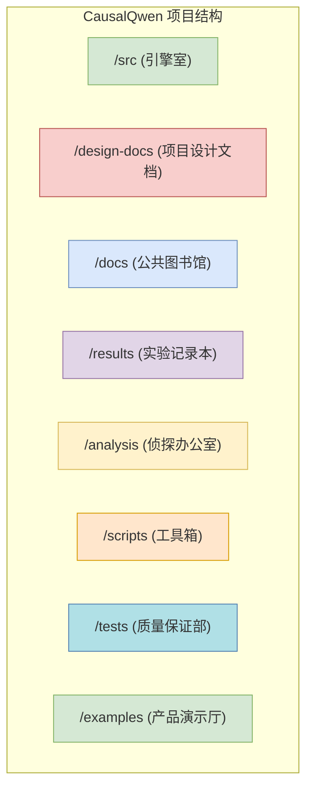

# 项目蓝图：CausalQwen 代码库指南

## 1. 指导思想

本文档是 CausalQwen 项目的总地图。其目的是定义每个核心组件的**角色（Role）**、**职责（Responsibility）**和**必要性（Necessity）**。

贯穿始终的指导性问题是：**"如果这个文件/目录被删除会发生什么？"** 如果我们能给出一个清晰且有说服力的答案，那么这个组件就是必要的。

---

## 2. 顶层目录结构：五大支柱

本项目由五个主要的支柱构成，每个支柱都有其独特的战略目的。

| 目录 | 角色：部门隐喻 | 职责 | 缺失后果 |
|:---|:---|:---|:---|
| `/src` | **引擎室 / 研发实验室** | 包含所有用于定义、训练和评估我们模型的功能性、可执行源代码。 | **项目将无法运行。** 它将变成一堆没有实现和测试方法的想法与文档集合，"数据科学"中的"科学"将不复存在。 |
| `/design-docs` | **项目设计文档** | 存放初始的、高层次的理论蓝图、数学推导和战略计划。这里是我们回答"为什么？"的地方。 | **项目将失去其理论根基。** 我们将不知道代码为何如此编写。未来的开发将变成凭空猜测，修复深层次的概念问题几乎是不可能的。 |
| `/docs` | **公共图书馆 / 博物馆** | 包含经过润色、策划且面向用户的最终文档。它综合了来自`/design-docs`的理论、`/src`的代码和`/analysis`的发现，是项目知识的最终沉淀。 | **项目将变得难以理解且无法使用。** 所有宝贵的知识和发现都将被尘封，严重限制项目的影响力和长期可维护性。 |
| `/results` | **实验记录本** | 存储所有实验的原始数据和可视化结果。它是对实际发生的事情的不可变记录，也是 `/analysis` 目录中进行探索性分析的起点。 | **所有论点都将没有依据。** 我们将没有数据来支持我们的发现，使得实验报告沦为故事。我们将无法追踪进展或调试性能回归问题。 |
| `/analysis` | **侦探办公室 / 研究部门** | 包含用于对 `/results` 中的原始数据进行深度探索、可视化和假设检验的脚本与 Notebook。这里是我们回答"数据告诉了我们什么？"的地方。 | **我们将无法从实验中获得深层洞见。** 我们会得到一堆指标，但无法理解模型行为的*为什么*和*怎么样*，例如误差分布、校准情况或因果状态的内部结构。 |
| `/scripts` | **工具箱 / 车间** | 包含一次性的、用于快速实验、数据处理或可视化的辅助脚本。 | **开发效率会降低。** 许多重复性的、探索性的任务将需要手动完成，或者将临时代码混入核心的 `/src` 目录，造成混乱。 |
| `/tests` | **质量保证部** | 包含所有单元测试、集成测试和回归测试。确保代码的每一部分都按预期工作，并且新的更改不会破坏现有功能。 | **项目将变得脆弱且不可靠。** 我们将无法自信地进行重构或添加新功能，因为任何微小的改动都可能在不经意间引入Bug，导致难以追踪的错误。 |
| `/examples` | **产品演示厅** | 提供清晰、可直接运行的代码范例，展示如何使用本项目的核心功能。 | **项目将难以被采纳和使用。** 新用户将不知道如何开始，学习曲线会非常陡峭，这会严重阻碍项目的推广和社区贡献。 |

---

## 3. 关键组件深度解析

### 3.1. `/src`：引擎室

-   **`run_experiments.py`**
    -   **角色**：所有实验的总控制台操作员。
    -   **职责**：解析用户命令，配置不同的模型变体（如消融研究），并统筹训练、评估和结果保存的整个流程。
    -   **必要性**：没有它，我们将不得不通过修改代码来手动运行每个实验。这将使得系统性的、可复现的研究（尤其是对比和消融实验）无法进行。

-   **`/src/models/`**：模型架构的心脏。
    -   `causal_lm.py`：将各个部分组装成最终的完整模型。**它是人工智能本身的总蓝图。**
    -   `abduction_network.py`：实现"推断-行动"范式中的"推断"部分。其唯一工作是推断因果状态分布 \(U\)。
    -   `action_network.py`：实现"行动"部分。它接收因果状态 \(U\) 并产生预测。它包含了关键的 `CauchyLinear` 层。
    -   **必要性**：这个目录 *就是* 模型本身。如果它消失了，项目的核心创新也就随之消失了。

-   **`/src/training/trainer.py`**
    -   **角色**："教练"或"老师"。
    -   **职责**：管理整个训练循环：将数据送入模型，计算损失（特别是门控损失 `GatedLoss`），执行反向传播，并更新模型权重。
    -   **必要性**：没有它，我们可以定义模型，但无法通过训练让它从数据中学习。

-   **`/src/evaluation/evaluator.py`**
    -   **角色**："考官"。
    -   **职责**：接收一个训练好的模型，在测试集上运行它，并计算所有关键指标（准确率、F1、MSE、MAE、ECE、PICP）。
    -   **必要性**：没有它，我们可以训练模型，但没有客观的方法来判断它是否优秀、如何改进，或如何与其他模型进行比较。

-   **`/src/data/synthetic.py`**
    -   **角色**："教科书作者"。
    -   **职责**：通过编程方式生成受控的、合成的数据集（基础、问答、极端值），用于对模型能力进行严格的、科学的测试。
    -   **必要性**：没有它，我们将不得不依赖混乱的真实世界数据，这将使分离变量和测试特定假设（例如，"模型如何处理极端值？"）变得极其困难。它使得受控实验成为可能。

### 3.2. 知识中心 (`/design-docs` vs. `/docs`)

这两者之间的区别至关重要。

-   **`design-docs/math/mathematical_foundations.md`**
    -   **角色**：项目的**宪法**。
    -   **职责**：作为所有数学和理论概念（柯西分布、OvR、门控损失）的唯一真实来源。它是评判代码正确性的基准。
    -   **必要性**：这是最关键的文档。没有它，项目的理论基础就丧失了。代码将变成一堆没有合理解释的"魔法"公式。

-   **`docs/experiments/qwen_finetuning_report.md`**
    -   **角色**：**已发表的科学论文**。
    -   **职责**：以清晰易懂的方式展示我们实验的最终成果，解读数据并就模型性能得出结论。
    -   **必要性**：该文档传达了项目的*价值*和*发现*。没有它，`/results` 中的实验就只是一堆没有故事或结论的数字。

-   **`docs/implementation/`**
    -   **角色**：**理论与实践的桥梁**。
    -   **职责**：弥合高层理论（`mathematical_foundations.md`）与代码（`/src`）之间的鸿沟。此处的每个文档都将一个特定的数学概念映射到其确切的代码实现，是`todo.md`中"代码与理论映射"任务的核心产出。
    -   **必要性**：没有它，任何人（包括未来的我们自己）都将很难验证代码是否忠实地实现了理论。它是保证项目可审计性、透明度和长期可维护性的关键。 