# CausalQwen 设计文档

> **📋 文档用途**: 完整设计参考，理论验证用  
> **🎯 目标读者**: 项目负责人，用于验证AI实现是否符合理论预期  
> **📖 内容定位**: 详细的理论框架、数学原理、架构设计的权威参考

> 本文档详细描述了 CausalQwen 因果语言模型的核心设计理念、数学框架和实现细节。CausalQwen 是首个将个体选择变量 U 引入语言生成的因果推理模型，实现了从"概率采样"到"个体决策"的范式转变。

## 技术概述

CausalQwen 代表了语言模型设计的重大突破，其核心创新包括：

1. **因果理论基础**：基于 [Distribution-consistency Structural Causal Models](https://arxiv.org/abs/2401.15911) 理论框架
2. **个体选择变量 U**：首次在语言生成中引入个体选择的概念，实现可控一致生成
3. **柯西分布族**：利用重尾分布诚实表达"开放世界"的不确定性
4. **OvR 分类机制**：摆脱 Softmax 归一化约束，支持独立的二元判断
5. **解析化计算**：基于柯西分布的线性稳定性，整个前向传播无需采样

**核心范式转变**：从"概率分布采样"转向"个体在因果律下的必然表达"。

## 1. 核心数学框架

### 1.1 因果生成模型的数学基础

CausalQwen 的核心创新是将传统的条件生成 $P(Y|X)$ 分解为因果结构：

$$Y = f(U, \epsilon)$$

其中：
- $U$ 是个体选择变量，其分布是**从上下文 $X$ 推断出的个体因果表征分布**
- $\epsilon$ 是**外生噪声**（不可控的随机扰动）
- $f$ 是**普适因果机制**（对所有个体一致的决策规律）

#### 1.1.1 个体选择变量 $U$ 的双重身份

根据 [Distribution-consistency Structural Causal Models](https://arxiv.org/abs/2401.15911) 的理论基础，$U$ 具有双重含义：

1. **个体选择变量**：$U=u$ 代表从所有可能个体中"选择"了特定个体 $u$
2. **个体因果表征**：向量 $u$ 包含了该个体所有内在的、驱动其行为的潜在属性

**关键洞察**：
- **表征的复杂性**：从混乱的表面证据 $X$ 推断真正的因果表征 $U$ 是高度非线性的
- **规律的简洁性**：一旦找到正确的表征 $u$，因果规律 $f$ 本身是简单线性的
- **因果一致性**：函数 $f$ 对所有个体普适，个体差异完全体现在 $u$ 中
- **不确定性分解**：随机性分为个体选择的不确定性和外生噪声的随机性

#### 1.1.2 CausalQwen vs 传统 Qwen：本质对比

| **维度** | **传统 Qwen** | **CausalQwen** |
|----------|---------------|----------------|
| **数学假设** | 学习条件分布 $P(Y\|X)$ | 学习因果机制 $Y = f(U, \epsilon)$ |
| **生成哲学** | 从分布采样结果 | 个体在规律下的必然表达 |
| **随机性来源** | 仅输出层 Softmax 采样 | 个体选择 $U$ + 外生噪声 $\epsilon$ |
| **一致性保证** | 无显式机制 | 通过固定个体 $u$ 实现 |
| **分类方式** | Softmax（竞争性归一化） | OvR（独立二元判断） |
| **不确定性表达** | 隐式（通过概率分布） | 显式（柯西分布的 scale 参数） |
| **可解释性** | 黑盒概率模型 | 个体+规律的清晰分解 |
| **反事实能力** | 不支持 | 支持"如果是另一个体"的推理 |


### 1.2 柯西分布：开放世界的数学基础

我们选择**柯西分布**作为核心分布族的三重考量：

#### 1.2.1 诚实的不确定性表达

柯西分布作为**重尾分布**，为"黑天鹅"事件保留不可忽略的概率，诚实表达"开放世界"的深层不确定性：

> "任何观测到的伟大成就，任何人都有非零的概率做出来"

#### 1.2.2 数学上的"深刻未知"

柯西分布的期望和方差数学上无定义，恰好对应了"我们永远无法完全知道一个个体到底是什么样的"这一哲学事实。

#### 1.2.3 线性稳定性（计算魔法）

**加法稳定性**：
$$X_1 \sim \text{Cauchy}(\mu_1, \gamma_1), X_2 \sim \text{Cauchy}(\mu_2, \gamma_2) \Rightarrow X_1 + X_2 \sim \text{Cauchy}(\mu_1 + \mu_2, \gamma_1 + \gamma_2)$$

**缩放稳定性**：
$$w \cdot X \sim \text{Cauchy}(w \cdot \mu, |w| \cdot \gamma)$$

**线性组合稳定性**：
$$\sum_{i=1}^n w_i X_i \sim \text{Cauchy}\left(\sum_{i=1}^n w_i \mu_i, \sum_{i=1}^n |w_i| \gamma_i\right)$$

这使得我们可以在整个前向传播中**保持分布形式不变，无需采样**，实现高效的解析计算。

## 2. 模型架构

### 2.1 总体架构：从证据到个体到决策

#### 2.1.1 核心数据流与维度变化


**关键维度变化**：`[B,S]` → `[B,S,H]` → `[B,S,C]` → `[B,S,V]` → `词元输出`

#### 2.1.2 因果哲学的体现

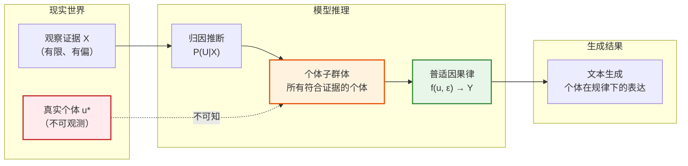

### 2.2 维度约定

| 符号 | 含义 | 说明 |
|------|------|------|
| `B` | 批次大小 | Batch size |
| `S` | 序列长度 | Sequence length |
| `H` | 隐藏维度 | 继承自 Qwen |
| `C` | 因果表征维度 | 设计决策：`C = H` |
| `V` | 词汇表大小 | Vocabulary size |

## 3. 详细模块设计

### 3.1 模块1：标准词元嵌入

我们直接使用预训练模型的词元嵌入：

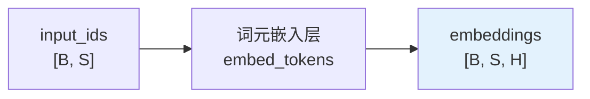

**数学表示**：
$$e_i = \text{EmbedTokens}(x_i), \quad x_i \in \{0, 1, ..., V-1\}$$

**实现要点**：
- 直接复用预训练模型的嵌入层，保持与原始 Qwen 的完全兼容
- 标准的词元到向量映射，为后续模块提供稳定的特征基础

### 3.2 模块2：特征提取网络

使用标准 Transformer 架构提取上下文特征：

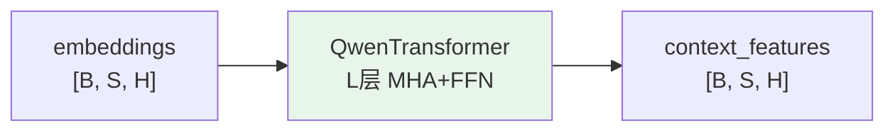

**数学表示**：$z = \text{QwenTransformer}(e)$，完全继承预训练权重。

### 3.3 模块3：归因推断网络（核心创新）

#### 3.3.1 从证据圈定个体子群体

归因推断网络的本质工作：**根据观察证据 $X$，在茫茫人海中圈定出一个所有成员都符合该证据的子群体**

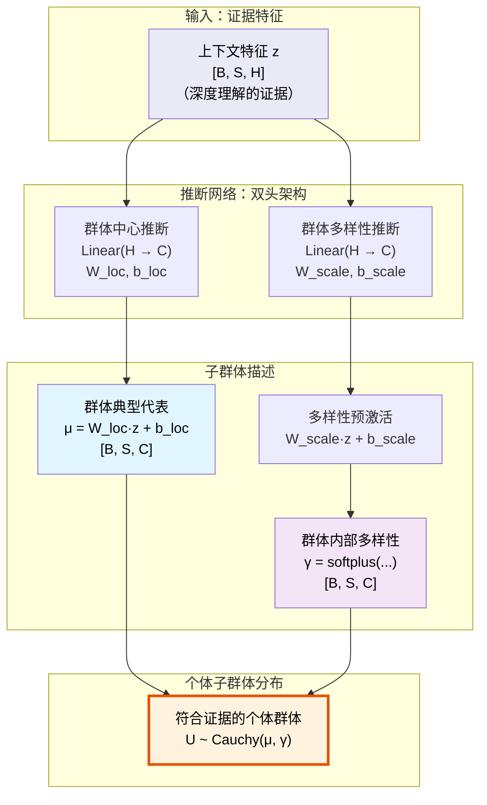

#### 3.3.2 数学公式：分布参数推断

对于序列中的每个位置 $i$（对应不同的证据上下文）：

**群体中心**（典型代表）：
$$\text{loc}_{U_i} = W_{\text{loc}} \cdot z_i + b_{\text{loc}} \in \mathbb{R}^C$$

**群体多样性**（不确定性范围）：
$$\text{scale}_{U_i} = \text{softplus}(W_{\text{scale}} \cdot z_i + b_{\text{scale}}) \in \mathbb{R}^C_+$$

**个体子群体分布**：
$$U_i \sim \text{Cauchy}(\text{loc}_{U_i}, \text{scale}_{U_i})$$

#### 3.3.3 代码实现：归因推断

```python
class AbductionNetwork(nn.Module):
    """从证据推断个体子群体"""
    
    def __init__(self, hidden_size: int, causal_size: int = None):
        super().__init__()
        causal_size = causal_size or hidden_size  # C = H
        
        # 推断群体中心（典型代表）
        self.loc_net = nn.Linear(hidden_size, causal_size)
        # 推断群体多样性（内部不确定性）
        self.scale_net = nn.Linear(hidden_size, causal_size)
        
        # 知识继承初始化
        self._init_weights()
    
    def _init_weights(self):
        # 恒等映射：直接使用 Qwen 特征作为个体中心
        nn.init.eye_(self.loc_net.weight)
        nn.init.zeros_(self.loc_net.bias)
        
        # 常数多样性：初始对所有位置给予相同的先验不确定性
        nn.init.zeros_(self.scale_net.weight)
        nn.init.constant_(self.scale_net.bias, 0.0)  # softplus(0) = ln(2) ≈ 0.69 (初始 γ)
    
    def forward(self, context_features: Tensor) -> Tuple[Tensor, Tensor]:
        """
        Args:
            context_features: [B, S, H] 上下文特征
        Returns:
            loc_U: [B, S, C] 个体群体的中心
            scale_U: [B, S, C] 个体群体的多样性
        """
        # 推断符合证据的个体群体
        loc_U = self.loc_net(context_features)
        scale_U = F.softplus(self.scale_net(context_features))
        
        return loc_U, scale_U
```

#### 3.3.4 关键洞察：推断的本质

1. **不是寻找唯一个体**：真实的 $u^*$ 永远不可观测
2. **而是圈定子群体**：所有可能产生观察证据 $X$ 的个体集合
3. **位置参数** $\text{loc}_{U_i}$：该群体的"平均画像"或"典型代表"
4. **尺度参数** $\text{scale}_{U_i}$：群体内部的多样性，证据强则小，证据弱则大
5. **上下文依赖**：不同位置基于不同证据推断出不同的个体群体

### 3.4 模块4：行动决策网络（普适因果律）

#### 3.4.1 线性因果律的哲学：规律的简洁性

行动网络体现了我们的**线性因果律假说**：一旦找到正确的个体表征 $U$，因果规律本身是简单线性的。

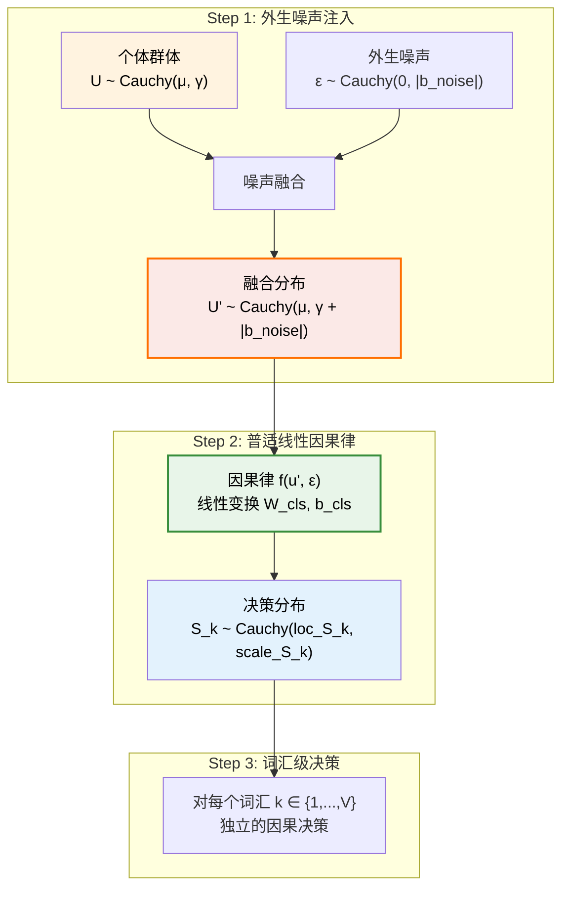

#### 3.4.2 数学推导：柯西分布的线性传播

**Step 1: 外生噪声融合**
利用柯西分布的加法稳定性：
$$U'_i = U_i + \epsilon \sim \text{Cauchy}(\text{loc}_{U_i}, \text{scale}_{U_i} + |b_{\text{noise}}|)$$

**Step 2: 线性因果律应用**
对每个词汇 $k$，应用相同的线性规律：
$$S_{k,i} = W_{\text{cls},k} \cdot U'_i + b_{\text{cls},k}$$

**Step 3: 决策分布推导**
由柯西分布的线性稳定性：
$$S_{k,i} \sim \text{Cauchy}(\text{loc}_{S_{k,i}}, \text{scale}_{S_{k,i}})$$

其中：
- **位置参数**：$\text{loc}_{S_{k,i}} = W_{\text{cls},k} \cdot \text{loc}_{U_i} + b_{\text{cls},k}$
- **尺度参数**：$\text{scale}_{S_{k,i}} = |W_{\text{cls},k}| \cdot (\text{scale}_{U_i} + |b_{\text{noise}}|)$

#### 3.4.3 代码实现：普适决策机制

```python
class ActionNetwork(nn.Module):
    """普适因果律：基于个体表征的线性决策机制"""
    
    def __init__(self, causal_size: int, vocab_size: int):
        super().__init__()
        
        # 普适线性因果律（对所有个体一致）
        self.lm_head = nn.Linear(causal_size, vocab_size, bias=True)
        # 外生噪声参数（系统性随机扰动）
        self.b_noise = nn.Parameter(torch.zeros(causal_size))
        
        # 知识继承初始化
        self._init_weights()
    
    def _init_weights(self):
        # 继承 Qwen 的语言建模头
        # self.lm_head.weight.data = qwen.lm_head.weight.data.clone()
        # self.lm_head.bias.data = qwen.lm_head.bias.data.clone()
        
        # 外生噪声初始为零（纯净的因果律）
        nn.init.zeros_(self.b_noise)
    
    def forward(self, loc_U: Tensor, scale_U: Tensor) -> Tuple[Tensor, Tensor]:
        """
        Args:
            loc_U: [B, S, C] 个体群体的中心
            scale_U: [B, S, C] 个体群体的多样性
        Returns:
            loc_S: [B, S, V] 每个词汇的决策位置
            scale_S: [B, S, V] 每个词汇的决策不确定性
        """
        # Step 1: 外生噪声注入
        scale_U_noisy = scale_U + torch.abs(self.b_noise)  # 非负约束
        
        # Step 2: 线性因果律应用
        loc_S = self.lm_head(loc_U)  # 位置参数的线性变换
        
        # Step 3: 不确定性传播（绝对值确保非负）
        W_abs = torch.abs(self.lm_head.weight)  # [V, C]
        scale_S = torch.matmul(scale_U_noisy, W_abs.T)  # [B, S, V]
        
        return loc_S, scale_S
```

#### 3.4.4 设计洞察：两层哲学

1. **表征层的复杂性**：从证据到个体表征是高度非线性的（归因推断网络）
2. **规律层的简洁性**：从个体表征到决策是简单线性的（行动决策网络）

这种设计体现了深刻的世界观：
> 真正的挑战在于**学会如何看待世界**（学习正确的表征），一旦学会了，世界的规律将以极为优雅和简单的方式呈现。

## 4. 损失函数与训练

### 4.1 OvR (One-vs-Rest) 分类

与传统的 Softmax 不同，OvR 对每个词汇进行独立的二元判断：

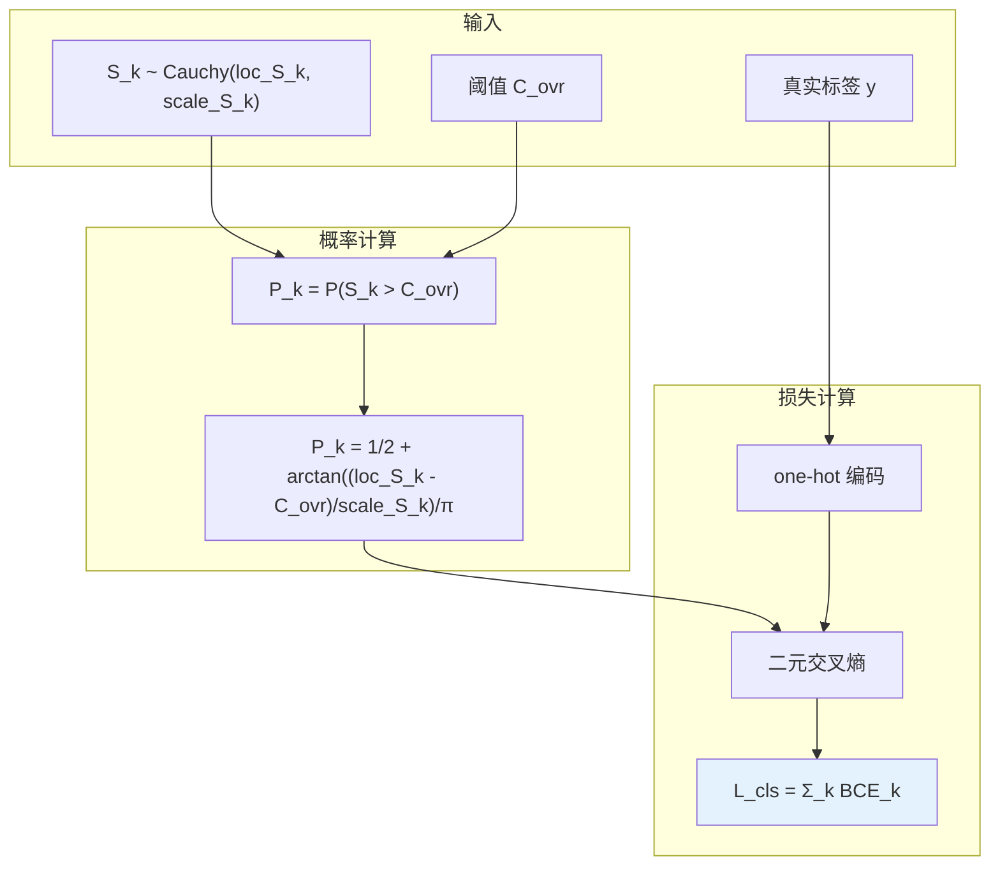

### 4.2 完整损失计算

**Step 1: OvR 概率计算**
$$P_{k,i} = \frac{1}{2} + \frac{1}{\pi} \arctan\left(\frac{\text{loc}_{S_{k,i}} - C_{\text{ovr}}}{\text{scale}_{S_{k,i}}}\right)$$

**Step 2: 掩码损失计算**  
$$L_{\text{cls},i} = -\sum_{k=1}^V [y_{k,i} \log P_{k,i} + (1-y_{k,i}) \log(1-P_{k,i})] \cdot \text{mask}_i$$

**Step 3: 总损失**
$$\mathcal{L} = \frac{\sum_{i=1}^S L_{\text{cls},i}}{\sum_{i=1}^S \text{mask}_i}$$

其中 $\text{mask}_i \in \{0,1\}$ 表示位置 $i$ 是否为有效位置（非 padding）。

**实现要点**：
- **掩码处理**：确保 padding 位置不参与损失计算
- **数值稳定性**：使用 `torch.clamp` 避免 log(0) 
- **OvR 优势**：独立判断，支持不确定性表达

## 5. 推理模式

### 5.1 标准推理（期望决策）

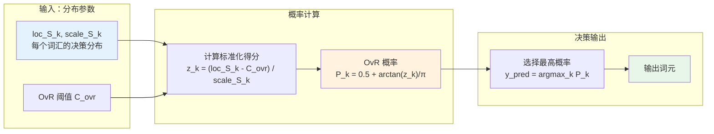

**核心特点**：基于分布期望的确定性决策，无需采样，计算高效。

### 5.2 因果采样（个体具现）

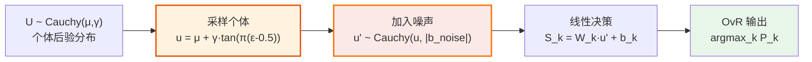

**三步过程**：个体具现 → 环境噪声 → 线性决策。核心优势是相同个体在相似环境下产生一致的行为模式。


### 5.3 兼容传统采样

CausalQwen 完全兼容传统语言模型的采样方法：

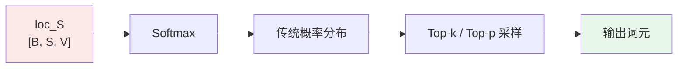

**兼容性公式**：
$$P_{\text{softmax}}(y_i=k|x) = \frac{\exp(\text{loc}_{S_{k,i}})}{\sum_{j=1}^{V} \exp(\text{loc}_{S_{j,i}})}$$

## 6. 自回归序列生成

### 6.1 生成流程图

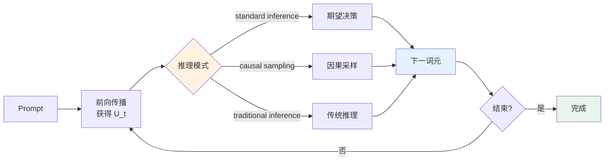

### 6.2 高级(序列)因果采样模式

高级因果采样模式在生成的过程中，共享随机性实例或者共享个体选择因子，从而实现一致性生成。


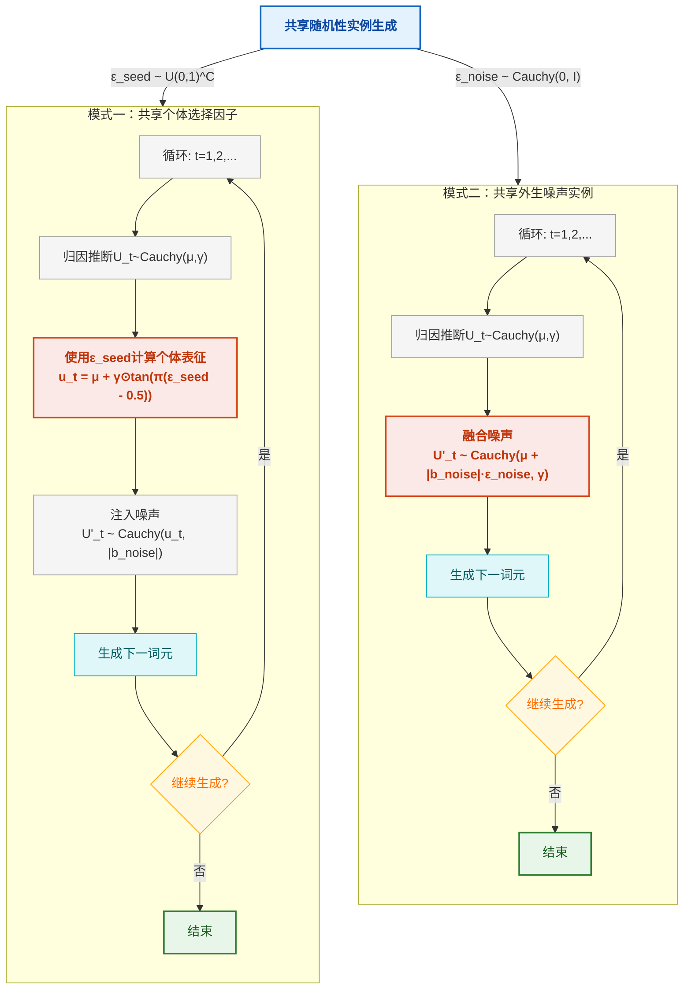

**深层含义**：
- **模式一**：探索同一个体在不同环境扰动下的行为变化
- **模式二**：探索不同个体在相同系统性偏差下的反应差异

这两种模式为反事实分析和因果推理提供了强大的工具。


### 6.3 与传统语言模型的对比

#### 6.3.1 生成哲学对比

| 方面 | 传统 LM (如 GPT/Qwen) | CausalQwen |
|------|----------------------|---------------------|
| **核心假设** | 学习条件分布 $P(Y\|X)$ | 学习因果机制 $Y = f(U, \epsilon)$ |
| **随机性来源** | 仅输出层采样 | 个体选择 + 外生噪声 |
| **一致性** | 无显式机制 | 通过固定 $U$ 保证 |
| **可解释性** | 黑盒概率 | 个体 + 噪声的清晰分解 |

#### 6.2.2 数学框架对比

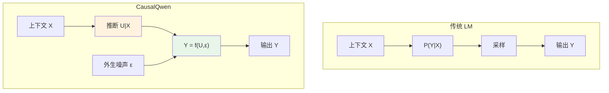

#### 6.3.3 一致性生成对比

| 生成模式 | 随机性来源 | 一致性保证 | 示例特点 |
|---------|-----------|-----------|---------|
| **传统采样** | Softmax 随机性 | 无 | 每次独立，风格可能跳跃 |
| **因果采样** | 个体选择 + 环境噪声 | 固定个体 | 风格一致，个性化表达 |

**核心优势**：CausalQwen 通过个体选择变量 $U$ 实现了长文本的风格一致性和可控生成。

## 7. 实现要点

### 7.1 模块化设计

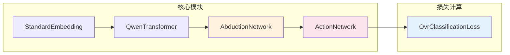

### 7.2 关键设计决策

1. **因果表征维度**：$C = H$（简化设计，充分利用预训练知识）
2. **分布族选择**：柯西分布（数学性质优美，计算高效）
3. **分类方式**：OvR 而非 Softmax（独立判断，灵活性高）
4. **初始化策略**：最大程度继承预训练权重

### 7.3 初始化策略详解

为了使 CausalQwen 能够无缝继承基座模型的强大语言能力，我们采用精心设计的初始化策略。**核心思想**：在训练开始时，CausalQwen 的行为应与原始 Qwen 完全一致。

#### 7.3.1 初始化总览

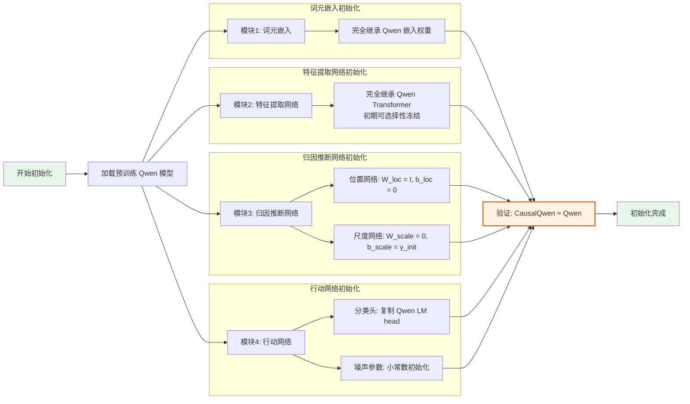

#### 7.3.2 各模块初始化详解

**模块1：词元嵌入**
- 完全继承 Qwen 的词元嵌入权重
- 保持与原始模型的完全兼容性

**模块2：特征提取网络**  
- 直接复制 Qwen Transformer 的所有权重
- 初期可选择性冻结参数，逐步解冻

**模块3：归因推断网络**（关键）
- **位置网络**：$W_{\text{loc}} = I_H$, $b_{\text{loc}} = \mathbf{0}$ → 恒等映射
- **尺度网络**：$W_{\text{scale}} = \mathbf{0}$, $b_{\text{scale}} = \gamma_{\text{init}}$ → 常数输出

初始化后的效果：
$$\text{loc}_{U_i} = z_i \quad \text{（直接使用 Qwen 特征）}$$
$$\text{scale}_{U_i} = \text{softplus}(\gamma_{\text{init}}) = \gamma_0 \cdot \mathbf{1}_C$$

**模块4：行动网络**
- **分类头**：$W_{\text{cls}} \leftarrow W_{\text{Qwen\_lm\_head}}$，完整继承
- **噪声参数**：$b_{\text{noise}} = c \cdot \mathbf{1}_C$，小常数初始化（如 $c = 0.1$）

#### 7.3.3 数学保证

初始化后，对于每个位置 $i$ 和词汇 $k$：

1. **个体表征分布**：
   $$U_i \sim \text{Cauchy}(z_i, \gamma_0 \cdot \mathbf{1}_C)$$

2. **融合后分布**（加入外生噪声）：
   $$U'_i \sim \text{Cauchy}(z_i, (\gamma_0 + c) \cdot \mathbf{1}_C)$$

3. **分类决策分布**：
   $$S_{k,i} \sim \text{Cauchy}(W_{\text{Qwen},k} \cdot z_i, \text{scale}_{S_{k,i}})$$

**关键洞察**：分类决策的位置参数 $W_{\text{Qwen},k} \cdot z_i$ 与原始 Qwen 的 logits 完全一致，确保了初始行为的等价性。

#### 7.3.4 初始化验证

```python
def verify_initialization(model, qwen_model, test_input):
    """验证初始化效果"""
    with torch.no_grad():
        # CausalQwen 前向传播
        causal_outputs = model(test_input)
        
        # Qwen 前向传播  
        qwen_outputs = qwen_model(test_input)
        
        # 比较分类头的位置参数
        causal_logits = causal_outputs['loc_S']  # [B, S, V]
        qwen_logits = qwen_outputs.logits       # [B, S, V]
        
        diff = torch.norm(causal_logits - qwen_logits)
        print(f"初始化验证: |CausalQwen_logits - Qwen_logits| = {diff:.6f}")
        
        return diff < 1e-3  # 应该几乎相等
```

### 7.4 核心实现示例

```python
class CausalQwen(nn.Module):
    def __init__(self, qwen_model_path):
        super().__init__()
        # 加载预训练 Qwen
        self.qwen = AutoModel.from_pretrained(qwen_model_path)
        hidden_size = self.qwen.config.hidden_size
        vocab_size = self.qwen.config.vocab_size
        
        # CausalQwen 特有组件
        self.abduction = AbductionNetwork(hidden_size)
        self.action = ActionNetwork(hidden_size, vocab_size)
        
        # 初始化：复制 Qwen 的 lm_head
        self.action.lm_head.weight.data = self.qwen.lm_head.weight.data.clone()
    
    def forward(self, input_ids):
        # 1. 标准嵌入
        embeddings = self.qwen.embed_tokens(input_ids)
        
        # 2. 特征提取（使用 Qwen）
        features = self.qwen.model(embeddings=embeddings).last_hidden_state
        
        # 3. 推断个体分布
        loc_U, scale_U = self.abduction(features)
        
        # 4. 基于个体进行决策
        loc_S, scale_S = self.action(loc_U, scale_U)
        
        return loc_S, scale_S, loc_U, scale_U

class AbductionNetwork(nn.Module):
    def __init__(self, hidden_size):
        super().__init__()
        self.loc_net = nn.Linear(hidden_size, hidden_size)
        self.scale_net = nn.Linear(hidden_size, hidden_size)
    
    def forward(self, features):
        loc_U = self.loc_net(features)
        scale_U = F.softplus(self.scale_net(features))
        return loc_U, scale_U

class ActionNetwork(nn.Module):
    def __init__(self, hidden_size, vocab_size):
        super().__init__()
        self.lm_head = nn.Linear(hidden_size, vocab_size)
        self.b_noise = nn.Parameter(torch.zeros(hidden_size))
    
    def forward(self, loc_U, scale_U):
        # 噪声注入
        scale_U_noisy = scale_U + torch.abs(self.b_noise)
        
        # 线性决策
        loc_S = self.lm_head(loc_U)
        
        # 不确定性传播
        W_abs = torch.abs(self.lm_head.weight)
        scale_S = torch.matmul(scale_U_noisy, W_abs.T)
        
        return loc_S, scale_S
```

## 8. 训练策略

### 8.1 预训练对齐阶段：高效离线特征蒸馏

虽然第 7.3 节的静态初始化提供了一个良好的起点，但我们通过一个专门的预训练对齐阶段，可以更高效、更鲁棒地将教师模型（Qwen）的知识迁移到CausalQwen的学生模块中。我们采纳一种**两阶段离线特征蒸馏**的范式，它将预训练转化为一个高度优化的监督学习问题，专门训练 `AbductionNetwork` 和 `ActionNetwork`。

#### 8.1.1 阶段一：离线数据生成

此阶段一次性地创建一个高质量的蒸馏数据集。我们选取一个大型通用语料库，将其输入固定的Qwen教师模型。对于语料库中的每个词元位置，我们抽取出两样东西：
1.  **输入特征 `z`**: Qwen最后一层Transformer的输出 `last_hidden_state`。
2.  **输出目标**: 教师的`lm_head`所预测的**Top-K**词元索引及其对应的Softmax概率。

最终，我们获得一个大规模的 `(z, Top-K_Probs)` 映射数据集，该数据集将用于下一阶段的训练。

#### 8.1.2 阶段二：高效对齐训练

在这个阶段，我们不再需要运行庞大的教师模型。训练循环直接从离线数据集中采样批次的 `(z, Top-K_Probs)` 对。
- 特征 `z` 被直接送入 `AbductionNetwork`。
- CausalQwen的模块进行前向传播，计算出OvR概率。
- 使用Top-K对齐损失函数进行反向传播。

#### 8.1.3 Top-K 对齐损失函数

对齐是通过优化以下损失函数来实现的，该函数旨在最小化学生和教师在教师最自信的K个词元上的概率差异：

$$ \mathcal{L}_{\text{Top-K}} = \sum_{i \in \text{batch}} \sum_{k \in \mathcal{K}_{\text{teacher}, i}} \left( P_{\text{student}, i,k}^{\text{OvR}} - P_{\text{teacher}, i,k}^{\text{Softmax}} \right)^2 $$

其中 $\mathcal{K}_{\text{teacher}, i}$ 是教师模型在位置 $i$ 预测的Top-K词元索引集。

#### 8.1.4 预期成果与优化目标

通过在此目标上训练，CausalQwen的学生模块（`AbductionNetwork` 和 `ActionNetwork`）将学会模仿教师的决策逻辑。这种方法不仅保证了Top-K预测行为上的一致性，还传递了更丰富的"暗知识"。

此阶段的优化目标包括**`AbductionNetwork`和`ActionNetwork`的所有权重，以及可训练的外生噪声参数 `b_noise` 和全局OvR决策阈值 `C_ovr`**。这为下游的主要因果目标微调提供了一个经过充分对齐和校准的、高质量的初始化模型。


### 8.2 训练目标

CausalQwen 基于 OvR 分类损失进行端到端训练，优化期望损失：

$$ \mathcal{L} = \mathbb{E}_{(x,y) \sim \mathcal{D}} \left[ \frac{1}{|S|} \sum_{i=1}^{|S|} L_{\text{cls}}(y_i | x_{<i}) \right] $$

### 8.3 优化目标

训练过程同时优化：
1. **归因推断能力**：学习从上下文推断合理的个体分布
2. **决策一致性**：学习个体到输出的稳定映射
3. **不确定性校准**：学习何时应该有高/低确定性

### 8.4 训练监控指标

参考 [`mathematical_foundations.md`](./mathematical_foundations.md) 第5节的监控体系：

- **核心损失指标** (`train/*`)
  - `train/accuracy`: 分类准确率
  - `train/loss`: 总优化目标

- **内部状态分布** (`dist/*`)
  - `dist/U_loc_*`: 个体表征位置参数统计
  - `dist/U_scale_*`: 个体表征尺度参数统计
  - `dist/ovr_prob_sum_*`: OvR 概率校准指标

## 9. 总结与展望

### 9.1 核心贡献

CausalQwen 的核心创新在于：

1. **因果分解**：将生成过程分解为"个体推断"和"基于个体的决策"
2. **数学优雅**：利用柯西分布的性质实现高效计算
3. **可控生成**：通过操控个体变量 $U$ 实现风格控制
4. **理论基础**：基于严格的因果推理理论


### 9.2 技术创新意义

这一设计代表了语言模型的重要进展：

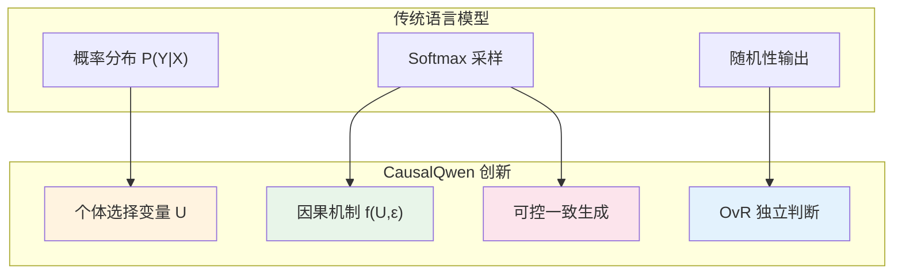

### 9.3 理论意义

这种设计不仅是技术创新，更是对"语言生成本质"的全新理解：

> **文本不是从概率分布中随机抽取的结果，而是特定"个体"在特定"环境"下的必然表达。**

**实用价值**：可控生成、可解释性、一致性保证、反事实推理。

CausalQwen 开辟了因果语言生成的新范式，为下一代可控、可解释的人工智能系统奠定了坚实的理论与实践基础。
