# CausalQwen 纯文本版设计文档

> 本文档描述了一个专注于纯文本生成的 CausalQwen 版本，移除了数值处理的复杂性，但保留了完整的因果推理框架。这有助于深入理解模型的核心因果机制，而不被数值处理的细节所干扰。

## 1. 核心数学框架

### 1.1 因果生成模型

CausalQwen 的核心创新是将传统的条件生成 $P(Y|X)$ 分解为因果结构：

$$Y = f(X, U, \epsilon)$$

其中：
- $X$ 是观察到的上下文
- $U$ 是**个体选择变量**（未观察的个体特征）
- $\epsilon$ 是**外生噪声**（环境随机性）
- $f$ 是**普适因果机制**

这种分解的关键洞察：
1. **个体差异性**：不同的 $U$ 代表不同的"生成个体"（如不同风格的作者）
2. **环境随机性**：相同个体在不同环境噪声 $\epsilon$ 下可能产生不同输出
3. **因果一致性**：函数 $f$ 是普适的，不随个体改变


与传统 Qwen 的本质区别

| 方面 | 传统 Qwen | CausalQwen（纯文本版）|
|------|-----------|----------------------|
| 生成哲学 | 学习 P(Y\|X) | 学习 Y = f(X, U, ε) |
| 随机性来源 | 仅在输出层采样 | 个体 U + 环境噪声 ε |
| 分类方式 | Softmax（竞争性）| OvR（独立判断）|
| 不确定性 | 隐式（通过概率）| 显式（scale 参数）|


### 1.2 概率分布设计

我们选择**柯西分布**作为核心分布族，因为其独特的数学性质：

**线性稳定性**：如果 $X_1 \sim \text{Cauchy}(\mu_1, \gamma_1)$ 和 $X_2 \sim \text{Cauchy}(\mu_2, \gamma_2)$ 独立，则：
$$X_1 + X_2 \sim \text{Cauchy}(\mu_1 + \mu_2, \gamma_1 + \gamma_2)$$

对于权重 $w$：
$$w \cdot X \sim \text{Cauchy}(w \cdot \mu, |w| \cdot \gamma)$$

这使得我们可以在整个前向传播中保持分布形式不变，无需采样。

## 2. 模型架构（纯文本版）

### 2.1 总体架构图

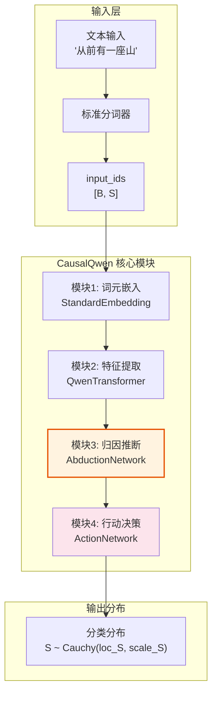

### 2.2 维度约定

- `B`: 批次大小
- `S`: 序列长度
- `H`: 隐藏层维度（继承自基础模型）
- `C`: 因果表征维度（设计决策：`C = H`）
- `V`: 词汇表大小

## 3. 详细模块设计

### 3.1 模块1：标准词元嵌入

在纯文本版本中，我们直接使用预训练模型的词元嵌入：

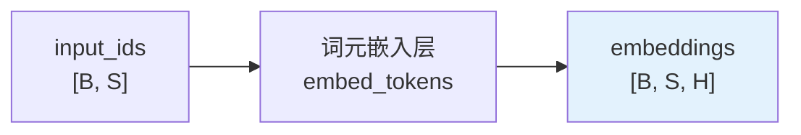

**数学表示**：
$$e_i = \text{EmbedTokens}(x_i), \quad x_i \in \{0, 1, ..., V-1\}$$

**实现要点**：
- 直接复用预训练模型的嵌入层
- 无需额外的数值编码

### 3.2 模块2：特征提取网络

使用标准 Transformer 架构提取上下文特征：

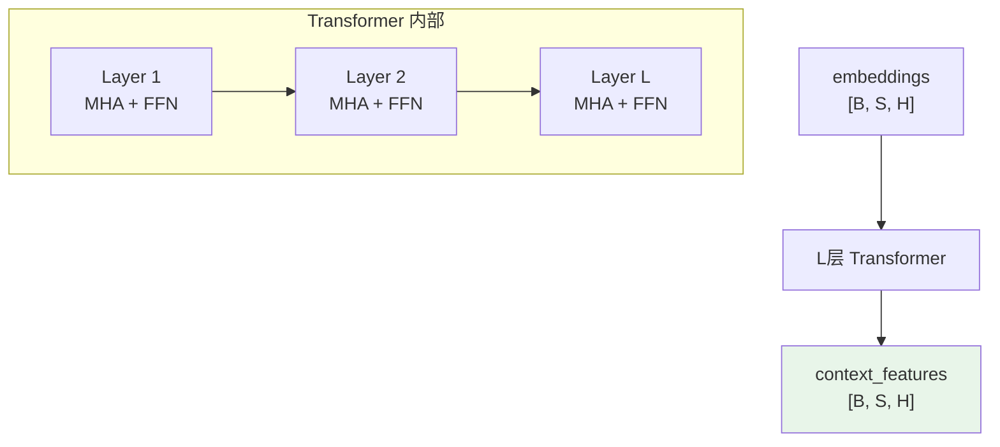

**数学表示**：
$$z = \text{TransformerLayers}(e) = h^{(L)}$$

其中每一层的计算：
$$h^{(l)} = \text{FFN}(\text{MultiHeadAttention}(h^{(l-1)})) + h^{(l-1)}$$

### 3.3 模块3：归因推断网络（核心创新）

这是 CausalQwen 的核心模块，负责从上下文推断个体因果表征的分布：

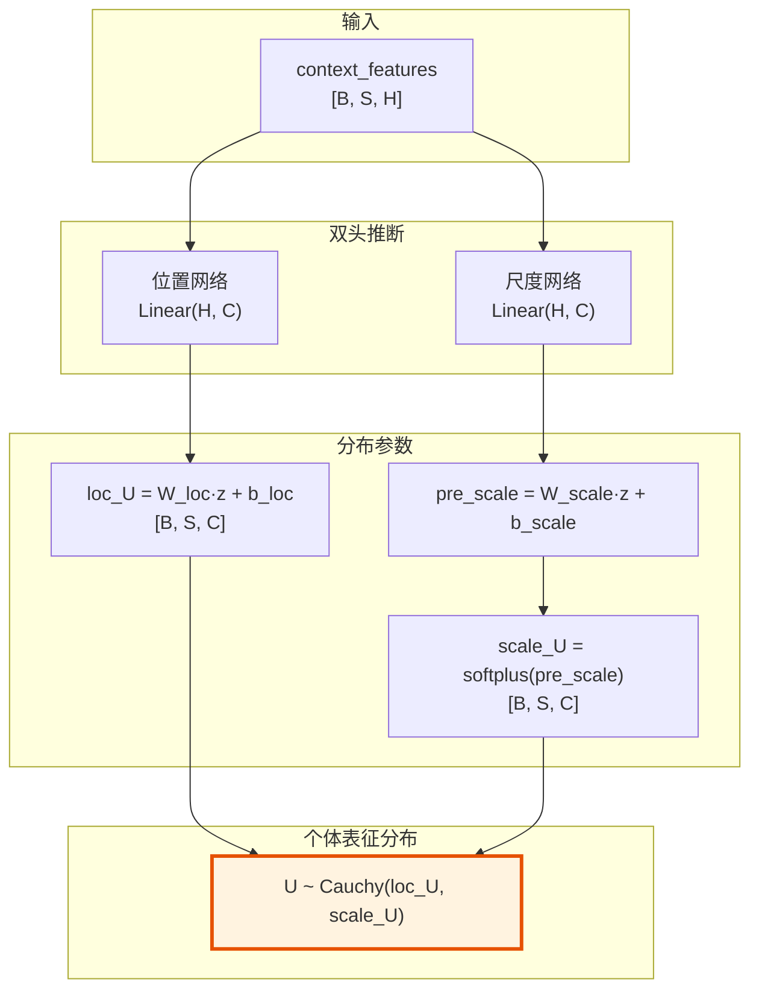

**数学表示**：

对于序列中的每个位置 $i$：
$$\text{loc}_{U_i} = W_{\text{loc}} \cdot z_i + b_{\text{loc}} \in \mathbb{R}^C$$
$$\text{scale}_{U_i} = \text{softplus}(W_{\text{scale}} \cdot z_i + b_{\text{scale}}) \in \mathbb{R}^C_+$$

因此：
$$U_i \sim \text{Cauchy}(\text{loc}_{U_i}, \text{scale}_{U_i})$$

**关键洞察**：
1. **位置参数** $\text{loc}_{U_i}$ 编码了个体的"中心特征"
2. **尺度参数** $\text{scale}_{U_i}$ 编码了个体的"不确定性"或"多样性"
3. 每个位置都有独立的个体分布，反映了上下文依赖的个体推断

**初始化策略**（继承知识）：
- $W_{\text{loc}} = I_C$, $b_{\text{loc}} = 0$：恒等映射，直接使用特征
- $W_{\text{scale}} = 0$, $b_{\text{scale}} = \log(\gamma_0)$：常数初始尺度

### 3.4 模块4：行动决策网络

基于个体表征进行文本生成决策：

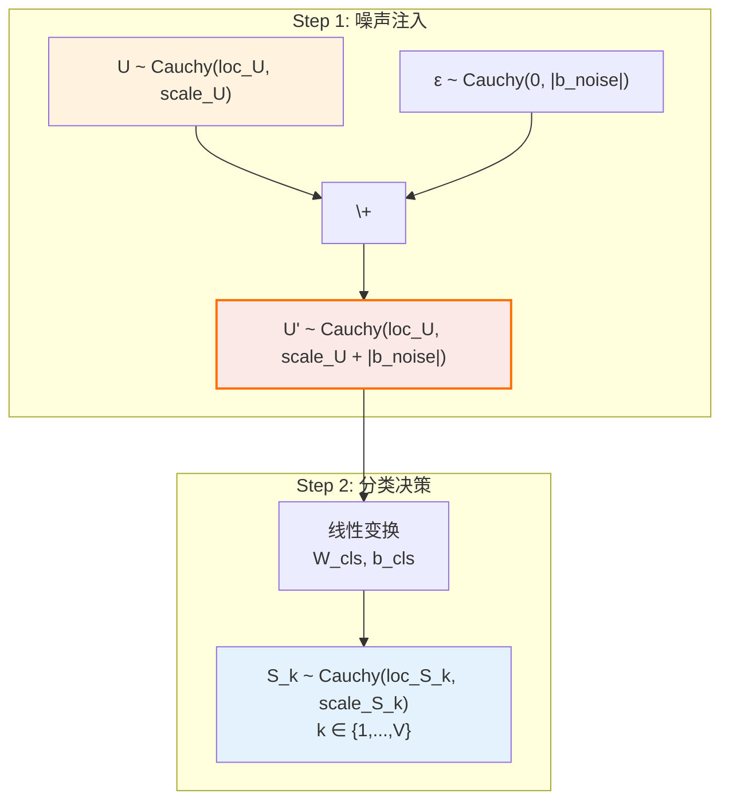

**数学推导**：

1. **噪声融合**（利用柯西分布的加法性质）：
   $$U'_i \sim \text{Cauchy}(\text{loc}_{U_i}, \text{scale}_{U_i} + |b_{\text{noise}}|)$$

2. **线性决策**（对每个词汇 $k$）：
   $$S_{k,i} = W_{\text{cls},k} \cdot U'_i + b_{\text{cls},k}$$
   
   由于线性变换保持柯西分布：
   $$S_{k,i} \sim \text{Cauchy}(\text{loc}_{S_{k,i}}, \text{scale}_{S_{k,i}})$$
   
   其中：
   $$\text{loc}_{S_{k,i}} = W_{\text{cls},k} \cdot \text{loc}_{U_i} + b_{\text{cls},k}$$
   $$\text{scale}_{S_{k,i}} = |W_{\text{cls},k}| \cdot (\text{scale}_{U_i} + |b_{\text{noise}}|)$$

**初始化策略**：
- 分类权重：$W_{\text{cls}} \leftarrow W_{\text{Qwen\_lm\_head}}$
- 噪声参数：$b_{\text{noise}} \leftarrow 0$（初始无额外噪声）

## 4. 损失函数设计

### 4.1 OvR (One-vs-Rest) 分类

与传统的 Softmax 不同，OvR 对每个词汇进行独立的二元判断：

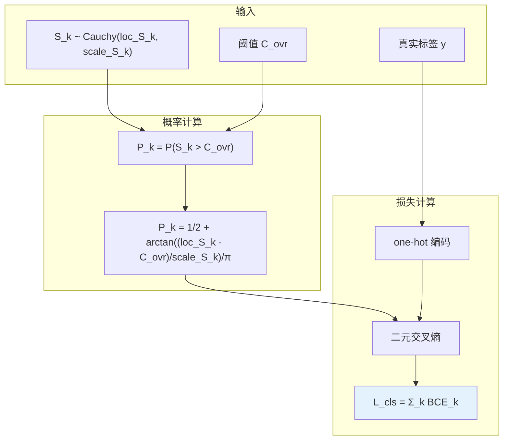

**数学表示**：

1. **OvR 概率**（利用柯西分布的 CDF）：
   $$P_{k,i} = P(S_{k,i} > C_k) = \frac{1}{2} + \frac{1}{\pi} \arctan\left(\frac{\text{loc}_{S_{k,i}} - C_k}{\text{scale}_{S_{k,i}}}\right)$$

2. **损失计算**：
   $$L_{\text{cls},i} = -\sum_{k=1}^V [y_{k,i} \log P_{k,i} + (1-y_{k,i}) \log(1-P_{k,i})]$$

**为什么选择 OvR？**
1. **独立性**：每个词汇的判断独立，避免 Softmax 的竞争效应
2. **灵活性**：允许多个词汇同时具有高概率
3. **不确定性**：自然处理"没有明确答案"的情况

### 4.2 总损失（纯文本版）

在纯文本版本中，总损失就是 OvR 分类损失的平均：

$$\mathcal{L}_{\text{total}} = \frac{1}{|M|} \sum_{i \in M} L_{\text{cls},i}$$

其中 $M$ 是有效位置的集合（非 padding）。

## 5. 推理模式

### 5.1 标准推理（期望决策）

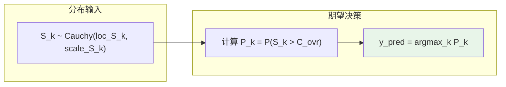

这是最直接的推理方式，选择 OvR 概率最高的词汇。

### 5.2 因果采样（个体具现）

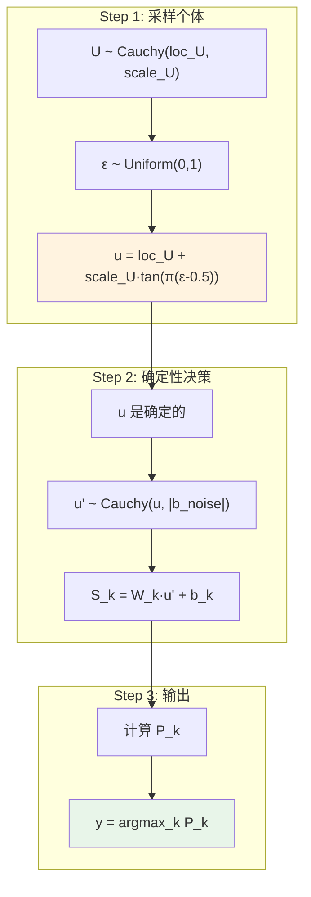

**核心思想**：
1. 先从后验分布中采样一个具体的"个体" $u$
2. 该个体在噪声环境下做出决策
3. 不同的个体会产生不同但内在一致的文本

### 5.3 高级因果采样模式

#### 模式A：固定个体，变化噪声

```python
def fixed_individual_sampling(prompt, epsilon_individual, num_tokens):
    """固定个体因子，观察其在不同噪声下的行为"""
    outputs = []
    for t in range(num_tokens):
        # 使用固定的 epsilon_individual 计算个体
        u_t = loc_U_t + scale_U_t * tan(π * (epsilon_individual - 0.5))
        
        # 个体面对随机噪声做决策
        # U'_t ~ Cauchy(u_t, |b_noise|)
        decision = action_network(u_t, noise_distribution)
        outputs.append(decision)
    return outputs
```

#### 模式B：固定噪声，不确定个体

```python
def fixed_noise_sampling(prompt, epsilon_noise, num_tokens):
    """固定噪声实例，观察不确定个体的行为"""
    outputs = []
    for t in range(num_tokens):
        # 个体保持分布形式
        # U_t ~ Cauchy(loc_U_t, scale_U_t)
        
        # 应用固定的噪声偏移
        # U'_t ~ Cauchy(loc_U_t + |b_noise| * epsilon_noise, scale_U_t)
        decision = action_network(shifted_distribution)
        outputs.append(decision)
    return outputs
```

### 5.4 兼容传统采样

CausalQwen 完全兼容传统语言模型的采样方法：

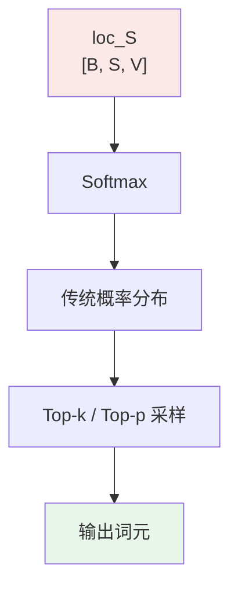

**兼容性公式**：
$$P_{\text{softmax}}(y_i=k|x) = \frac{\exp(\text{loc}_{S_{k,i}})}{\sum_{j=1}^{V} \exp(\text{loc}_{S_{j,i}})}$$

## 6. 与传统语言模型的对比

### 6.1 生成哲学对比

| 方面 | 传统 LM (如 GPT/Qwen) | CausalQwen（纯文本版）|
|------|----------------------|---------------------|
| **核心假设** | 学习条件分布 $P(Y\|X)$ | 学习因果机制 $Y = f(X, U, \epsilon)$ |
| **随机性来源** | 仅输出层采样 | 个体选择 + 环境噪声 |
| **一致性** | 无显式机制 | 通过固定 $U$ 保证 |
| **可解释性** | 黑盒概率 | 个体 + 噪声的清晰分解 |

### 6.2 数学框架对比

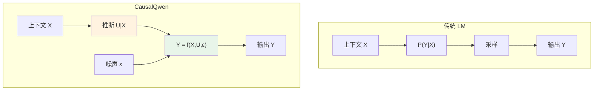

### 6.3 实际效果示例

**输入**："今天天气"

**传统 LM 的多次采样**：
- "今天天气真好" (p=0.3)
- "今天天气不错" (p=0.25)
- "今天天气很冷" (p=0.2)
- ...（每次独立采样，无内在联系）

**CausalQwen 的因果采样**：

*个体 A（乐观型，u_A）*：
- "今天天气真好"
- "今天天气真棒"
- "今天天气真不错"
- ...（保持乐观风格）

*个体 B（悲观型，u_B）*：
- "今天天气糟透了"
- "今天天气真差"
- "今天天气太冷了"
- ...（保持悲观风格）

## 7. 自回归序列生成

### 7.1 生成流程图

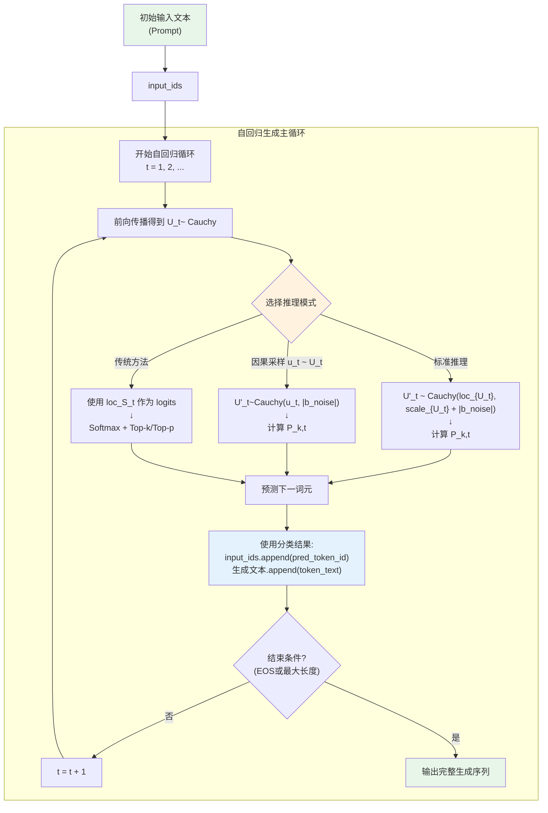

## 8. 实现要点

### 8.1 模块化设计

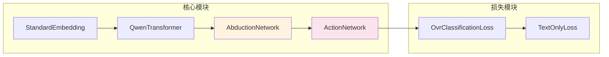

### 8.2 关键设计决策

1. **因果表征维度**：$C = H$（简化设计，充分利用预训练知识）
2. **分布族选择**：柯西分布（数学性质优美，计算高效）
3. **分类方式**：OvR 而非 Softmax（独立判断，灵活性高）
4. **初始化策略**：最大程度继承预训练权重

### 8.3 简化版实现示例

```python
class TextOnlyCausalQwen(nn.Module):
    def __init__(self, qwen_model_path):
        super().__init__()
        # 加载预训练 Qwen
        self.qwen = AutoModel.from_pretrained(qwen_model_path)
        hidden_size = self.qwen.config.hidden_size
        vocab_size = self.qwen.config.vocab_size
        
        # CausalQwen 特有组件
        self.abduction = AbductionNetwork(hidden_size)
        self.action = ActionNetwork(hidden_size, vocab_size)
        
        # 初始化：复制 Qwen 的 lm_head
        self.action.lm_head.weight.data = self.qwen.lm_head.weight.data.clone()
    
    def forward(self, input_ids):
        # 1. 标准嵌入
        embeddings = self.qwen.embed_tokens(input_ids)
        
        # 2. 特征提取（使用 Qwen）
        features = self.qwen.model(embeddings=embeddings).last_hidden_state
        
        # 3. 推断个体分布
        loc_U, scale_U = self.abduction(features)
        
        # 4. 基于个体进行决策
        loc_S, scale_S = self.action(loc_U, scale_U)
        
        return loc_S, scale_S, loc_U, scale_U

class AbductionNetwork(nn.Module):
    def __init__(self, hidden_size):
        super().__init__()
        self.loc_net = nn.Linear(hidden_size, hidden_size)
        self.scale_net = nn.Linear(hidden_size, hidden_size)
    
    def forward(self, features):
        loc_U = self.loc_net(features)
        scale_U = F.softplus(self.scale_net(features))
        return loc_U, scale_U

class ActionNetwork(nn.Module):
    def __init__(self, hidden_size, vocab_size):
        super().__init__()
        self.lm_head = nn.Linear(hidden_size, vocab_size)
        self.b_noise = nn.Parameter(torch.zeros(hidden_size))
    
    def forward(self, loc_U, scale_U):
        # 噪声注入
        scale_U_noisy = scale_U + torch.abs(self.b_noise)
        
        # 线性决策
        loc_S = self.lm_head(loc_U)
        
        # 不确定性传播
        W_abs = torch.abs(self.lm_head.weight)
        scale_S = torch.matmul(scale_U_noisy, W_abs.T)
        
        return loc_S, scale_S
```

## 9. 训练策略

### 9.1 损失函数

纯文本版的损失函数相对简单：

$$\mathcal{L} = \mathbb{E}_{(x,y) \sim \mathcal{D}} \left[ \frac{1}{|S|} \sum_{i=1}^{|S|} L_{\text{cls}}(y_i | x_{<i}) \right]$$

### 9.2 优化目标

训练过程同时优化：
1. **归因推断能力**：学习从上下文推断合理的个体分布
2. **决策一致性**：学习个体到输出的稳定映射
3. **不确定性校准**：学习何时应该有高/低确定性

### 9.3 训练监控指标

参考 [`mathematical_foundations.md`](./mathematical_foundations.md) 第5节的监控体系：

- **核心损失指标** (`train/*`)
  - `train/accuracy`: 分类准确率
  - `train/total_loss`: 总优化目标
  - `train/cls_loss_mean`: 平均分类损失

- **内部状态分布** (`dist/*`)
  - `dist/U_loc_*`: 个体表征位置参数统计
  - `dist/U_scale_*`: 个体表征尺度参数统计
  - `dist/ovr_prob_sum_*`: OvR 概率校准指标

## 10. 总结与展望

### 10.1 核心贡献

纯文本版 CausalQwen 展示了模型的核心创新：

1. **因果分解**：将生成过程分解为"个体推断"和"基于个体的决策"
2. **数学优雅**：利用柯西分布的性质实现高效计算
3. **可控生成**：通过操控个体变量 $U$ 实现风格控制
4. **理论基础**：基于严格的因果推理理论


### 10.2 与完整版 CausalQwen 的关系

纯文本版是完整版的一个重要子集：

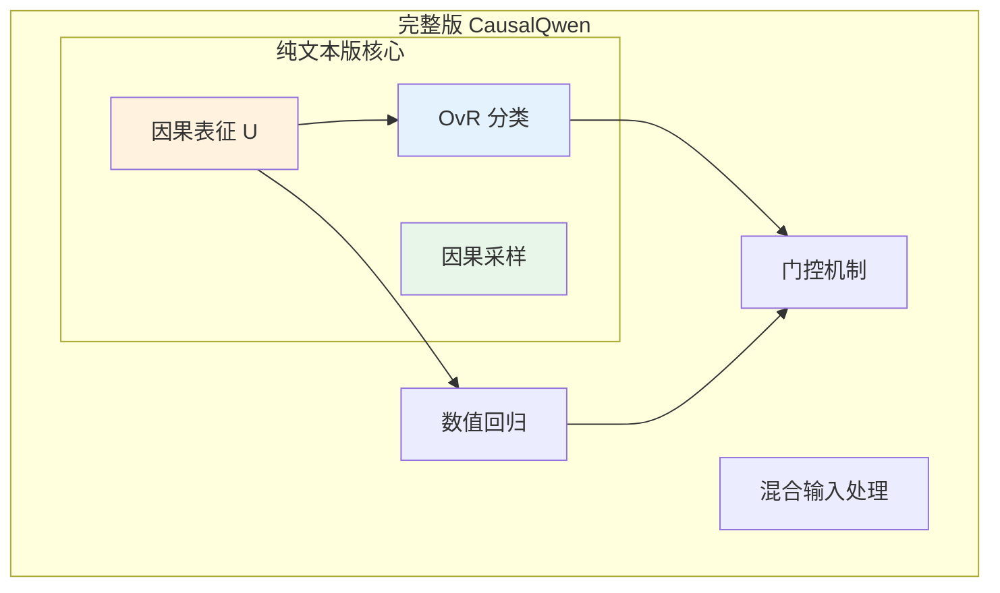

### 10.3 理论意义

这种设计不仅是技术创新，更是对"语言生成本质"的全新理解：

> **文本不是从概率分布中随机抽取的结果，而是特定"个体"在特定"环境"下的必然表达。**

这一洞察为可控、可解释、可追溯的文本生成开辟了新的可能性：

1. **可控生成**：通过控制个体变量实现风格、情感等属性的精确控制
2. **可解释性**：生成过程可分解为"谁"（个体）+"怎么"（决策机制）
3. **一致性保证**：固定个体确保长文本的风格一致性
4. **反事实推理**：支持"如果是另一个个体会怎么生成"的假设分析

纯文本版 CausalQwen 为理解和验证这些概念提供了一个清晰、简洁的实验平台。
