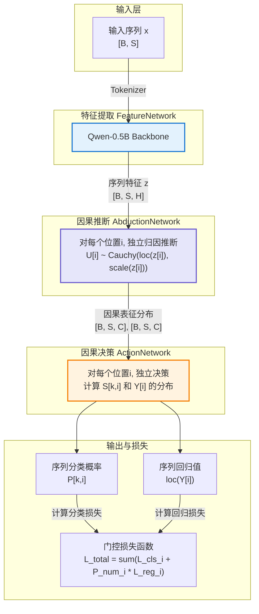
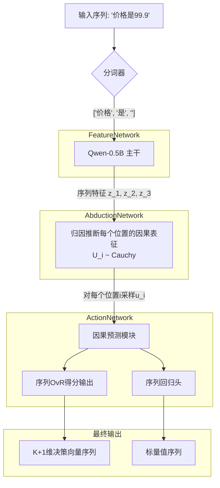

# CausalQwen-0.5B: 一个简化的因果语言模型架构

## 1. 概述

本文档旨在阐述一个理论完备且路径清晰的简化架构，用于将一个标准的大语言模型（如Qwen-0.5B）改造为一个**因果语言模型**。其核心目标是在LLM强大的符号推理能力之上，嫁接一个结构化的数值因果推断框架。

本架构是**V3"推断-行动"范式**的直接体现，它优先考虑工程实现的简洁性和因果原生设计。每一个组件都经过精心简化，以便能够快速验证其核心理论。

最终，该模型能够无缝处理混合数据任务，在统一的输出机制下，自主理解何时生成文本、何时进行数值回归。

---

## 2. 核心哲学：架构背后的"道"

我们的架构根植于几个区别于标准LLM的根本性原则。

### 2.1 "推断-行动"范式 (Abduction-Action Paradigm)

这是我们模型认知过程的核心两步：
1.  **推断 (Abduction):** 给定某个输入序列`x`，模型不直接预测结果。相反，它首先推断一个潜在高维**因果表征`U`**的概率分布`P(U|x)`。这个`U`代表了导致最终结果的、不可观测的"样本因果表征"或"个体因果表征" 的分布推断。
2.  **行动 (Action):** 模型接着从分布`P(U|x)`中采样一个具体的因果表征向量`u`。这个样本`u`成为所有因果生成的**唯一依据**，通过简单、直接的行动网络，同时驱动分类（文本生成）和回归（数值预测）。

### 2.2 柯西分布：认知不确定性的数学表达

我们特意选择**柯西分布(Cauchy Distribution)** 来为`P(U|x)`建模。这不仅是技术选择，更是哲学考量。柯西分布的极重尾特性，是我们坚信"万事皆有可能/任何结果可以被任何个体实现"这一信念的数学化身。它确保了即使是极小概率的个体因果表征`U`也拥有非零的概率密度。

### 2.3 `<NUM>`词元：统一任务的桥梁

为了优雅地处理混合数据任务，我们引入了一个特殊的`<NUM>`词元。它在模型的词汇表中扮演了一个至关重要的桥梁角色，使得模型能够将"是否应该输出一个数值?"这个决策问题，视为一个标准的"下一词元预测"问题。这个设计是统一文本与数值输出的关键。

---

## 3. 简化架构：从理论到实现

我们通过对基座LLM（如Qwen-0.5B）进行最小化但功能强大的修改来实现目标。

### 3.1 整体结构

数据在模型中的流动遵循一个清晰的序列，如下图所示，它精确地区分了用于训练的解析路径和用于推理的采样路径：



### 3.2 输入处理与`<NUM>`词元

对于包含数值的输入，我们采用一个优雅的统一表示方法。

- **分词:** 输入"价格是99.9"被分词为 `['价格', '是', '<NUM>']`。数字 `99.9` 被替换为特殊词元 `<NUM>`，其真实值被分离保存。

- **统一的特征表示:** 对于序列中的**每个位置** $i$，特征向量都通过相同的公式计算：
    \[
    z_i = h(x_i) + \text{sign}(v_i) \cdot \ln(1 + |v_i|) \cdot \vec{e}
    \]
    
    其中：
    - $h(x_i)$ 是词元 $x_i$ 的基础嵌入（来自 Qwen）
    - $v_i$ 是该位置的数值：当 $x_i = \text{<NUM>}$ 时为实际数值，否则为 0
    - $\vec{e}$ 是一个归一化的方向向量

    **关键洞察**：由于 $\text{sign}(0) \cdot \ln(1 + 0) = 0$，非数值位置的特征自然退化为纯语义表示 $z_i = h(x_i)$。

这种设计的优雅之处在于：
- **完全统一**：无需条件判断，所有位置使用相同的计算
- **自然扩展**：为未来给每个位置赋予连续值（如置信度、时间戳等）提供了框架
- **计算高效**：可以完全向量化，无需分支处理

### 3.2.1 数值感知的并行化实现

在实际工程中，我们通过向量化操作实现高效的数值感知：

```python
# 构建数值向量（batch_size, seq_len）
numerical_values = torch.zeros_like(input_ids, dtype=torch.float)
numerical_values[num_mask] = actual_values  # num_mask标记<NUM>位置

# 向量化的数值编码
sign_v = torch.sign(numerical_values)
log_v = torch.log1p(torch.abs(numerical_values))
numerical_features = sign_v * log_v * self.direction_vector  # [B, S, H]

# 统一特征计算
z = token_embeddings + numerical_features  # 自动广播
```

### 3.3 词汇表设计与预留Token机制

在实现CausalQwen时，我们发现了Qwen模型词汇表设计中的一个重要特性，这对我们的架构设计有着深远影响。

**核心发现：Qwen的271个预留Token**

通过深度分析，我们发现：
- **配置容量**：`config.vocab_size = 151,936`（模型支持的完整词汇表大小）
- **实际使用**：`len(tokenizer) = 151,665`（实际加载的词汇数量）  
- **预留空间**：`151,936 - 151,665 = 271`个预留token位置

**预留Token的"活跃"特性**

令人惊讶的是，这271个预留token并非简单的占位符，而是具有完整功能：
- **权重初始化**：所有预留位置都有正常的非零权重（标准差0.010054，比实际使用权重的0.015621更保守）
- **前向传播**：预留token可以正常参与推理过程
- **梯度更新**：训练时预留位置会接收并更新梯度
- **架构支持**：lm_head权重矩阵为`[151,936, 896]`，完全支持预留token

**对CausalQwen设计的影响**

这个发现为我们的架构设计带来了重要启示：

1. **理论设计层面**：
   - 数学文档应基于完整配置容量：`K = 151,936`
   - 保持理论框架的完整性和扩展性

2. **实际实现层面**：
   - 代码实现基于有效词汇表大小：`K = 151,665`  
   - CausalQwen词汇表大小：`151,665 + 1 = 151,666`（添加`<NUM>`token）

3. **扩展性考虑**：
   - 可以安全利用预留空间添加更多特殊token
   - 权重继承策略需要考虑预留token的处理
   - 为未来模型扩展保留了架构灵活性

**最佳实践**：
- 在文档中明确区分"设计容量"与"实际使用"
- 代码注释中说明这种差异的合理性
- 为未来可能的词汇表扩展做好架构准备

*详细分析请参考：`docs/background/qwen_reserved_tokens_analysis.md`*

### 3.4 归因推断模块: 生成个体因果表征分布`P(U|x)`

这个模块连接了观测世界（文本）与潜在的因果世界。

- **输入:** LLM主干在每个位置的隐藏状态序列 `z = (z_1, ..., z_S)` (张量形状为 `[batch_size, seq_len, hidden_size]`)。
- **功能:** 一个简单的全连接层（`nn.Linear`）被独立地应用到序列的每一个时间步上，将每个`z_i`映射到对应位置的高维柯西分布`U_i`的参数。
    ```python
    # z 的形状为 [batch, seq_len, hidden_size]
    # causal_dim 是一个超参数, e.g., 64
    causal_inference_layer = nn.Linear(hidden_size, causal_dim * 2)
    
    # 输出形状为 [batch, seq_len, causal_dim * 2]
    params = causal_inference_layer(z)
    
    # 分割为位置参数μ和尺度参数γ
    mu, log_gamma = torch.split(params, causal_dim, dim=-1)
    gamma = torch.exp(log_gamma) # 确保尺度参数为正
    ```

### 3.5 行动模块 (ActionNetwork)

在每个位置 `i`，因果表征的**随机变量`U_i`**是所有行动的统一驱动源。

- **主输出头 (分类):** 一个线性层将随机变量`U_i`映射为一个`K+1`维的**决策向量`S_i`**，其中`K`是原始词汇表大小。
    \[
    S_{k,i} = \vec{A}_k \cdot U_i + B_k, \quad \text{for } k \in \{0, 1, \dots, K\}
    \]
    其中`A`和`B`是可学习的权重和偏置。重要的是，这里的`U_i`是随机变量，因此`S_{k,i}`也是一个独立的柯西随机变量，代表了对类别`k`在位置`i`的决策得分。

- **辅助回归头:** 另一个线性层将 **同一个随机变量`U_i`** 映射到一个标量随机变量`Y_i`。
    \[
    Y_i = \vec{W} \cdot U_i + b
    \]
    `Y_i`同样是一个柯西随机变量。

**重要说明：训练与推理的区别**
-   **训练 (计算损失时)**：我们**不需要**对因果表征`U_i`进行采样。由于柯西分布的线性封闭性，我们可以直接从`U_i`的分布参数`(loc(z_i), scale(z_i))`解析地计算出决策分数`S_{k,i}`和回归值`Y_i`的分布参数，进而计算出精确的损失，整个过程是确定且可微的。
-   **推理 (生成预测时)**：当我们想得到一个具体的预测结果（例如，最可能的词元或一个具体的数值）时，更好的做法是直接使用我们解析计算出的概率和参数。对于分类，选择概率`P_{k,i}`最大的词元；对于回归，直接使用预测分布的中位数`loc_{Y_i}`作为输出，这样更稳定且高效。仅在需要模拟真实世界随机性或进行探索性生成时，才考虑从`P(U_i|z_i)`中采样一个具体的实例`u_i`。

---

## 4. 训练策略: 因果原生损失函数

### 4.1 One-vs-Rest (OvR) 决策与概率

我们不使用Softmax，而是将多分类问题解构为`K+1`个独立的"一对剩余"二元决策问题。这一决策过程在序列的**每个位置 i** 上独立发生。

- **决策原理:** 对每个类别`k`和每个位置`i`，我们计算其决策得分随机变量`S_{k,i}`大于一个可学习阈值`C_k`的概率（为简化，可设`C_k=0`）。
- **概率公式:** 利用柯西分布的累积分布函数(CDF)，我们可以得到一个解析的概率表达式。这一步无需采样，仅依赖分布参数：
    \[
    P_{k,i} = E[I(S_{k,i} > C_k)] = 1 - P(S_{k,i} \leq C_k) = \frac{1}{2} + \frac{1}{\pi} \arctan\left(\frac{\text{loc}_{S_{k,i}} - C_k}{\text{scale}_{S_{k,i}}}\right)
    \]
    其中`loc_S_k,i`和`scale_S_k,i`是决策分数`S_{k,i}`这个柯西变量的参数，可以由`U_i`的参数`(loc(z_i), scale(z_i))`和行动网络的权重解析地计算得出：
    \[
    \text{loc}_{S_{k,i}} = \vec{A}_k \cdot \text{loc}(z_i) + B_k
    \]
    \[
    \text{scale}_{S_{k,i}} = |\vec{A}_k| \cdot \text{scale}(z_i)
    \]

### 4.2 统一损失函数

总损失是所有位置上，分类损失和门控回归损失的加权和：
\[
\mathcal{L}_{\text{total}} = \sum_i \left( \mathcal{L}_{\text{cls},i} + \lambda \cdot \mathcal{L}_{\text{reg\_gated},i} \right)
\]

1.  **分类损失 `L_cls,i`:**
    它是位置`i`上`K+1`个独立的二元交叉熵损失之和。对于该位置的真实标签为`j`的样本，`y_{k,i}`在`k=j`时为1，否则为0。
    \[
    \mathcal{L}_{\text{cls},i} = - \sum_{k=0}^{K} \left[ y_{k,i} \log(P_{k,i}) + (1-y_{k,i}) \log(1-P_{k,i}) \right]
    \]

2.  **门控回归损失 `L_reg_gated,i`:**
    此损失仅对真实标签为`<NUM>`的位置`i`激活，并由模型在该位置自身的预测置信度加权。
    - **回归基础损失 `L_cauchy_nll,i`:** 我们使用柯西分布的负对数似然(NLL)作为回归任务的基础损失，这与我们对`Y_i`的柯西性质假设保持一致。
        \[
        \mathcal{L}_{\text{cauchy\_nll},i} = \log(\pi \cdot \text{scale}_{Y_i}) + \log\left(1 + \left(\frac{y_{\text{true},i} - \text{loc}_{Y_i}}{\text{scale}_{Y_i}}\right)^2\right)
        \]
    - **混合门控机制:** 为了在训练初期提供更稳定的梯度，我们采用混合门控策略：
        \[
        \mathcal{L}_{\text{reg\_gated},i} = m_i \cdot \left(\alpha + (1-\alpha) \cdot P_{\text{<NUM>},i}\right) \cdot \mathcal{L}_{\text{cauchy\_nll},i}
        \]
        其中：
        - $m_i = \mathbb{I}(y_{\text{true\_id},i} = \text{<NUM>\_ID})$ 是位置掩码
        - $\alpha \in [0, 1]$ 是门控系数（1.0表示无门控，0.0表示完全门控）
        - $P_{\text{<NUM>},i}$ 是模型预测为`<NUM>`的概率
        
    这个设计允许在训练初期（$\alpha$ 较大）提供基础梯度，随着训练进行逐渐减小 $\alpha$，最终实现完全的自适应门控。

---

## 5. 验证路径

为了初步验证，整个系统可以在"模拟模式"下进行测试，以隔离核心逻辑：
-   **模拟`h(x)`:** Qwen主干可以用正确形状的随机张量（如`torch.randn([batch_size, 1024])`）替代。
-   **合成数据:** 一个数据生成器可以创建`(fake_h_x, target_token_id, target_value)`的数据批次，允许我们在不受文本处理复杂性干扰的情况下，对因果引擎本身进行快速、可控的实验。

这个方法为从架构蓝图到可工作的概念验证提供了一条清晰、高效的路径。

---

## 附录

### 附录A：因果语言模型核心数学理论

#### A.1 柯西分布的关键性质

**定义与参数化**：
一维柯西分布的概率密度函数为：
\[
f(x; \mu, \gamma) = \frac{1}{\pi\gamma} \cdot \frac{1}{1 + \left(\frac{x-\mu}{\gamma}\right)^2}
\]
其中`μ`是位置参数（对应分布的中位数），`γ > 0`是尺度参数。

**重尾特性**：
柯西分布没有定义的均值和方差，这正是我们选择它的哲学原因：
- 极重的尾部确保了"任何结果都有非零概率"
- 数学上表达了对极端事件的开放态度
- 提供了天然的鲁棒性，对异常值不敏感

**线性组合的封闭性**：
这是柯西分布在我们架构中的核心数学优势。如果`U₁, U₂, ..., Uₙ`是独立的柯西随机变量：
\[
U_i \sim \text{Cauchy}(\mu_i, \gamma_i)
\]
那么它们的线性组合（代表了我们的`ActionNetwork`）：
\[
Y = \sum_{i=1}^n a_i U_i + b
\]
仍然是柯西分布：
\[
Y \sim \text{Cauchy}\left(\sum_{i=1}^n a_i \mu_i + b, \sum_{i=1}^n |a_i| \gamma_i\right)
\]
这个性质使得我们可以在不知道`U`具体采样值的情况下，仅通过其分布参数就能精确推导出输出的分布参数，这是无采样训练的理论基石。

#### A.2 重参数化技巧的数学原理

我们有时候可能需要从`P(U|x)`这个概率分布中进行采样，但采样操作本身是不可导的，这会阻断梯度的反向传播。**重参数化技巧(Reparameterization Trick)** 通过将随机性从网络参数中分离出去来解决此问题。我们不直接从`Cauchy(μ, γ)`中采样，而是从一个固定的、简单的分布（如`Uniform(0, 1)`）中采样一个噪声变量`ε`，然后通过一个确定性函数将其转换为我们想要的分布的样本。
    \[
    u = \mu + \gamma \cdot \tan\left(\pi \cdot (\epsilon - 0.5)\right), \quad \text{其中 } \epsilon \sim \text{Uniform}(0, 1)
    \]
    在这个公式中，`μ`和`γ`是网络的输出，梯度可以顺利地流经它们。随机性完全由外部的`ε`引入，而`ε`不参与梯度计算。这样，我们就构建了一条从损失函数到网络参数`μ`和`γ`的可微路径。在推理时，我们可以确定性地使用分布的中位数，即`μ`。


#### A.3 OvR分类的理论基础

**传统Softmax的局限**：
Softmax假设类别间互斥且概率和为1：
\[
P_k = \frac{\exp(z_k)}{\sum_{j=1}^K \exp(z_j)}
\]
这在处理"开放世界"问题时过于严格。

**OvR的优势**：
每个类别独立决策，允许：
- 多个类别同时为真
- 所有类别都为假的情况
- 更灵活的决策边界

**数学表述**：
对于在位置 `i` 的决策分数`S_{k,i} ~ Cauchy(loc_{k,i}, scale_{k,i})`，类别`k`在该位置的概率为：
\[
P_{k,i} = P(S_{k,i} > 0) = \frac{1}{2} + \frac{1}{\pi} \arctan\left(\frac{\text{loc}_{k,i}}{\text{scale}_{k,i}}\right)
\]

#### A.4 门控损失的数学合理性

**设计目标**：确保模型"先学分类，再优化回归"。

**数学机制**：
在位置 `i`，总损失中的回归项：
\[
\mathcal{L}_{\text{reg\_term},i} = P_{\text{<NUM>},i} \cdot \mathcal{L}_{\text{cauchy\_nll},i}
\]

**优化动态**：
- 当`P_<NUM>,i`很小时，该位置的回归损失贡献微弱。
- 模型必须先提升`P_<NUM>,i`（学会分类）。
- 只有`P_<NUM>,i`足够大，该位置的回归优化才有效果。
- 这种耦合确保了学习的层次性。

### 附录B：后续开发计划


当前架构因果生成视角简化版本：




**阶段1：验证核心机制**
- 使用本附录B的简化实现
- 在合成数据上验证收敛性
- 确认OvR分类和门控损失的有效性

**阶段2：集成真实特征网络**
- 替换`mock_feature_network`为真实的Qwen主干
- 添加`<NUM>`词元处理逻辑
- 实现真实的数值编码机制

**阶段3：端到端优化**
- 在真实混合数据集上训练
- 性能调优和超参数搜索

### 附录C：并行化架构的理论分析

#### C.1 位置独立性的数学保证

**定理C.1（位置独立性）**：在CausalQwen架构中，位置$i$的输出仅依赖于该位置的输入，与其他位置无关。

**证明**：对于任意位置$i$：
- 特征：$z_i = h(x_i) + \phi(v_i)$
- 因果表征：$U_i | z_i \sim \text{Cauchy}(\text{loc}(z_i), \text{scale}(z_i))$
- 决策：$S_{k,i} = \vec{A}_k \cdot U_i + B_k$，$Y_i = \vec{W} \cdot U_i + b$

每一步计算都仅使用位置$i$的信息，因此位置间完全独立。□

#### C.2 向量化等价性

**定理C.2（向量化等价性）**：批量向量化计算与逐位置计算在数学上完全等价。
l
**证明**：设批量操作为$\mathbf{F}$，逐位置操作为$f$，则：
\[
\mathbf{F}([x_1, ..., x_S]) = [f(x_1), ..., f(x_S)]
\]
由于没有位置间依赖，向量化不改变计算结果。□

#### C.3 数值稳定性分析

**柯西分布的数值优势**：
1. **对数尺度的稳定性**：使用$\log \text{scale}$避免数值下溢
2. **有界梯度**：$\arctan$函数确保梯度有界
3. **混合精度友好**：重尾特性对精度损失不敏感

### 附录D：工程实现检查清单

- [ ] 实现向量化的数值编码模块
- [ ] 验证批量因果推断的正确性
- [ ] 测试并行化损失计算的数值稳定性
- [ ] 基准测试：比较向量化与循环实现的性能
- [ ] 内存分析：长序列下的内存使用优化
- [ ] 混合精度训练的兼容性测试

**阶段1：验证核心机制**
- 使用简化实现验证数值感知和并行化的有效性
- 确保核心因果推断和行动模块的正确性

**阶段2：集成优化**
- 集成数值感知机制和并行化工程技巧
- 在合成数据上验证性能提升

**阶段3：全面测试**
- 在真实数据集上进行端到端测试
- 验证模型的鲁棒性和泛化能力
