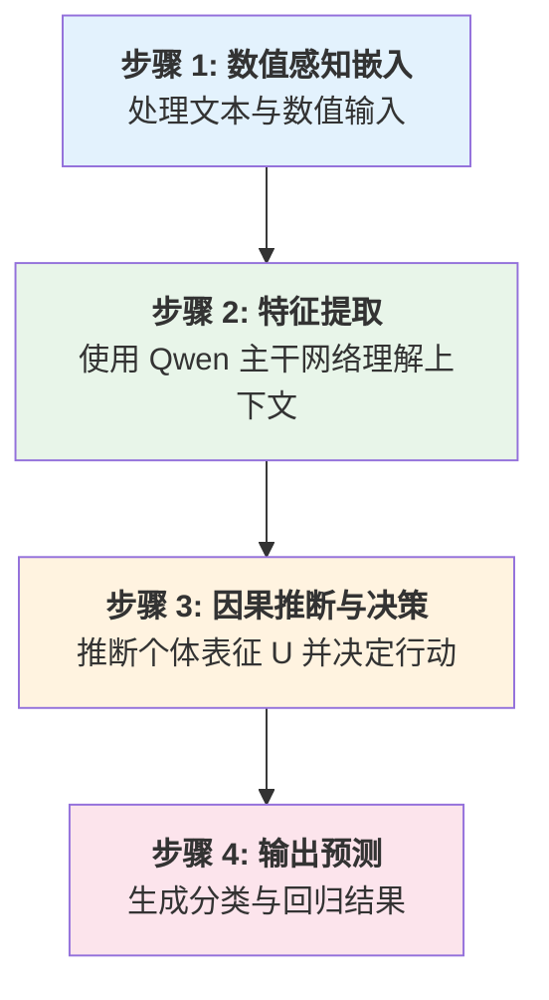
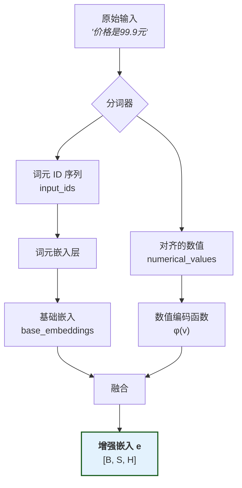
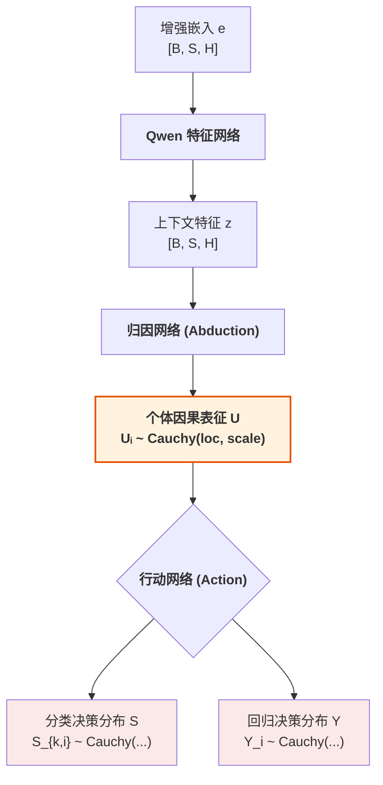
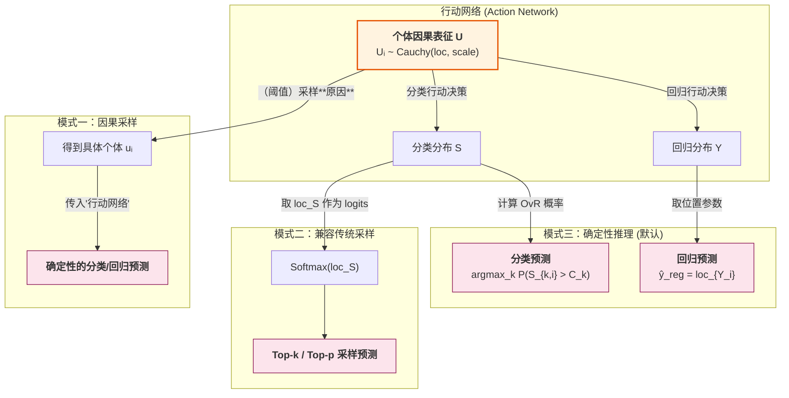
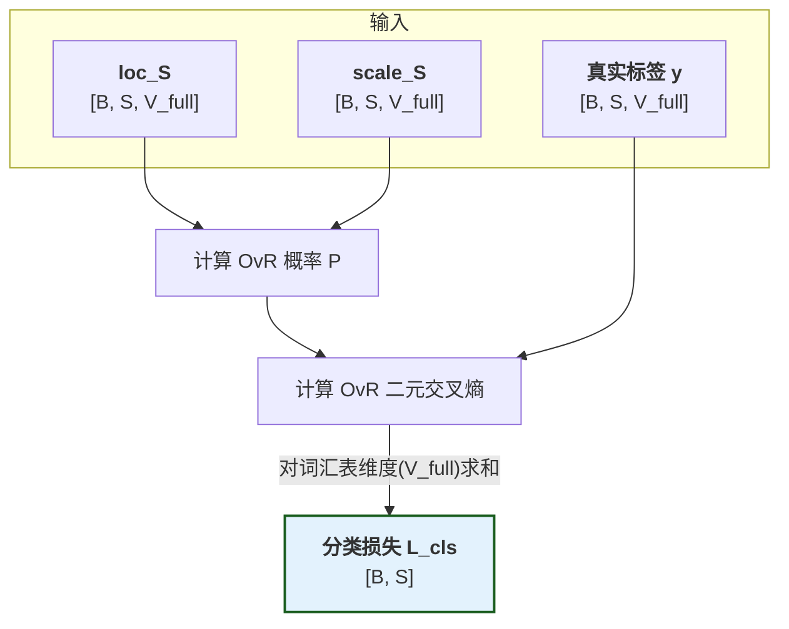
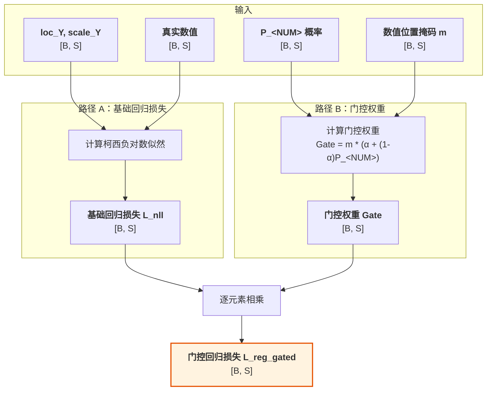
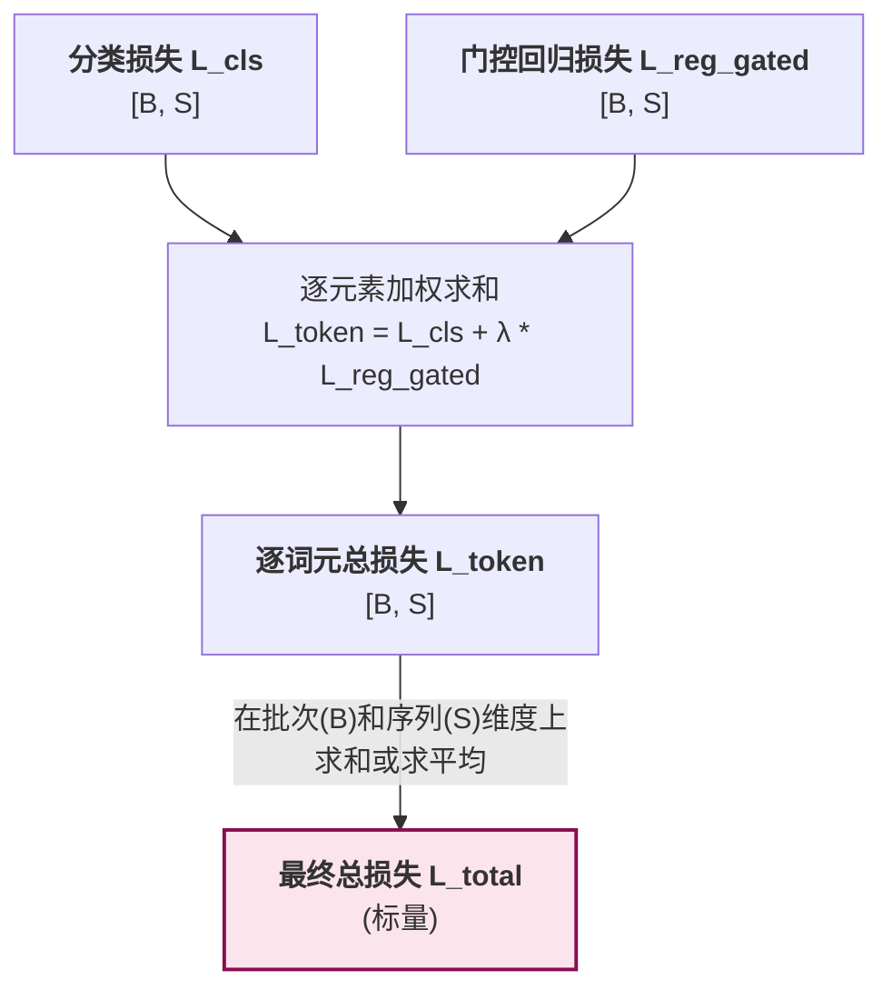

# 因果语言模型的数学理论基础

本文档详细阐述了因果语言模型的数学理论基础，包括其核心创新、所依赖的数学工具、完整的前向与反向传播路径、多种推理模式及初始化策略。

*本文档是 `docs/mathematical_foundations.md` 的深入技术版本，整合了其清晰的结构与更完整的数学推导和理论分析。*

## 1. 核心创新：引入个体选择变量 U

为了真正实现因果推理，我们需要一个能够对个体的内在属性进行建模的框架。本项目的理论基石 ([arXiv:2401.15911](https://arxiv.org/abs/2401.15911)) 从数学上证明，为了构建一个能够灵活表达反事实的因果模型，引入一个外生的 **"个体选择变量" $U$** 是必要的。 $U$ 是理解本模型所有魔法的关键。它有两个核心身份：

1.  **个体选择变量 (Individual Selection Variable)**：一次具体的赋值 $U=u$ 代表着从所有可能的个体中"选中"了某一个特定个体 `u`。
2.  **个体因果表征 (Individual Causal Representation)**：被选中的向量 $u$ 本身，就包含了该个体所有内在的、驱动其行为的潜在属性。

**核心思想**：普适的因果律 ($Y=f(t;u)$) 应用于不同的个体 ($u$)，从而产生了不同的反事实结果 ($Y(t)$)。$U$ 是所有个体性差异的最终来源。

> 深度解读请参见: [`design-docs/U_deep_dive.md`](../U_deep_dive.md)

## 2. 数学工具：柯西分布

柯西分布是一种连续概率分布，以其重尾特性和线性稳定性而著称，使其成为在我们的模型中表示不确定性的理想选择。

### 2.1 定义与基本性质

#### 2.1.1 概率密度函数 (PDF)

一维柯西分布的概率密度函数（PDF）定义为：

$$f(x; \mu, \gamma) = \frac{1}{\pi\gamma} \cdot \frac{1}{1 + \left(\frac{x-\mu}{\gamma}\right)^2}$$

其中 $\mu$ 是位置参数（中位数），$\gamma > 0$ 是尺度参数（控制宽度）。它在 $x = \mu$ 处达到最大值，且对称。

#### 2.1.2 累积分布函数 (CDF)

柯西分布的累积分布函数（CDF）为：

$$F(x; \mu, \gamma) = \frac{1}{2} + \frac{1}{\pi} \arctan\left(\frac{x-\mu}{\gamma}\right)$$

这个函数在OvR分类中计算决策分数超过阈值的概率时至关重要。

#### 2.1.3 重尾特性与矩的不存在性

柯西分布最显著的特征是其极重的尾部。**柯西分布的均值、方差以及任何高阶矩都不存在（积分不收敛）**。这一特性从数学上表达了"极端事件总是可能发生"的哲学观点，与传统的正态分布假设形成鲜明对比。

### 2.2 线性组合的封闭性

**核心定理**：如果 $X_1, \ldots, X_n$ 是独立的柯西随机变量，其中 $X_i \sim \text{Cauchy}(\mu_i, \gamma_i)$，那么它们的线性组合 $Y = \sum_{i=1}^n a_i X_i + b$ 仍然是柯西分布：

$$Y \sim \text{Cauchy}\left(\sum_{i=1}^n a_i \mu_i + b, \sum_{i=1}^n |a_i| \gamma_i\right)$$

该性质可以通过特征函数证明，它是我们模型中从"归因"到"行动"可以进行解析计算的数学基石，避免了耗时的蒙特卡洛采样。

### 2.3 重参数化技巧

在需要从柯西分布中采样的场景，我们使用重参数化技巧，将随机性与模型参数分离：

$$u = \mu + \gamma \cdot \tan\left(\pi \cdot (\epsilon - 0.5)\right), \quad \text{其中 } \epsilon \sim \text{Uniform}(0, 1)$$

这利用了柯西分布的分位数函数（CDF的反函数），是"因果采样"模式的技术核心。

## 3. 前向传播：推断-行动范式

我们将决策过程分解为两个阶段。重要的是，这个分解在序列的**每个位置 $i$** 上独立进行：

$$P(y_i|x) = \int P(y_i|u_i) \cdot P(u_i|x) \, du_i$$

-   $P(u_i|x)$：**归因推断 (Abduction)** 阶段，从观测序列推断位置 $i$ 的个体因果表征。
-   $P(y_i|u_i)$：**行动决策 (Action)** 阶段，基于位置 $i$ 的因果表征生成该位置的输出。

整个前向传播过程可以分解为四个核心模块。

> 我们用 B 代表批次大小, S 代表序列长度, H 代表模型核心维度, C 代表因果表征维度, K 代表基座模型 Qwen 的已用词汇表大小, V_full代表总词汇表大小 (K+1)。

### 3.1 模块一：数值感知嵌入

该模块将混合了文本和数值的原始输入，转化为统一的、数值感知的特征向量序列。

-   **输入处理**: 对于输入序列 $x = (x_1, ..., x_S)$, 数值被替换为特殊词元 `<NUM>`，实际数值 $v_i$ 单独保存。
-   **增强嵌入**: 对于每个位置 $i$，计算增强的词元嵌入：
    $$e_i = \text{embed}(x_i) + \phi(v_i)$$
    其中，$\text{embed}(x_i)$ 是词元的基础嵌入，$\phi(v) = \text{sign}(v) \cdot \ln(1 + |v|) \cdot \vec{e}$ 是数值编码函数，$\vec{e}$ 是归一化的方向向量。
-   **输出**: 增强嵌入张量 `e` (形状: `[B, S, H]`)

**设计动机**: 选择对数编码 $\phi(v)$ 是因为它具有三大优势：1) **数值稳定性**，将大范围数值压缩到合理区间；2) **相对误差保持**，对数空间中的等距对应原空间的等比；3) **自然退化**，由于$\phi(0)=0$，非数值位置自然退化为标准词元嵌入，无需特殊处理。

### 3.2 模块二：特征提取网络

该模块使用一个标准的 Transformer 网络（如Qwen）作为主干，来深度理解序列的上下文信息。

-   **输入**: 增强嵌入张量 `e` (形状: `[B, S, H]`)
-   **处理**: 增强嵌入序列 `e` 被送入Qwen的Transformer主干网络中，为每个位置计算出融合了全局上下文信息的深层特征。
    $$z = \text{FeatureNetwork}(e) = [z_1, z_2, ..., z_S]$$
-   **输出**: 上下文特征张量 `z` (形状: `[B, S, H]`)

### 3.3 模块三：归因推断网络 (Abduction Network)

该模块从上下文特征中推断出每个位置的个体因果表征 $U_i$ 所服从的柯西分布参数。

-   **输入**: 上下文特征张量 `z` (形状: `[B, S, H]`)
-   **处理**: 一个线性层（或一个小型MLP）作为归因网络，为每个位置独立地计算出因果表征 $U_i$ 所服从的柯西分布的参数：
    $$[\text{loc}_{U_i}, \log \text{scale}_{U_i}] = W_g \cdot z_i + b_g$$
    $$\text{scale}_{U_i} = \exp(\log \text{scale}_{U_i})$$
    因此，每个位置的后验分布为 $U_i|z_i \sim \text{Cauchy}(\text{loc}_{U_i}, \text{scale}_{U_i})$。
-   **输出**: 
    - `loc_U`: 因果表征分布的位置参数 (形状: `[B, S, C]`)
    - `scale_U`: 因果表征分布的尺度参数 (形状: `[B, S, C]`)

### 3.4 模块四：行动决策网络 (Action Network)

该模块基于推断出的因果表征分布，进行并行的分类和回归决策。

-   **输入**: `loc_U` 和 `scale_U`
-   **处理**: 借助柯西分布的线性封闭性，通过两个独立的线性变换，将因果表征分布直接映射到决策空间。
    - **分类**: $S_{k,i} = \vec{A}_k \cdot U_i + B_k \implies S_{k,i} \sim \text{Cauchy}(\vec{A}_k \cdot \text{loc}_{U_i} + B_k, |\vec{A}_k| \cdot \text{scale}_{U_i})$
    - **回归**: $Y_i = \vec{W} \cdot U_i + b \implies Y_i \sim \text{Cauchy}(\vec{W} \cdot \text{loc}_{U_i} + b, |\vec{W}| \cdot \text{scale}_{U_i})$
-   **输出**:
    - 分类决策分布参数: `loc_S`, `scale_S`
    - 回归决策分布参数: `loc_Y`, `scale_Y`

## 4. 损失函数与理论分析

此模块计算模型预测与真实标签之间的差异。

### 4.1 OvR 分类损失

我们不使用标准的 Softmax，而是对每个类别进行独立的"一对多"（One-vs-Rest, OvR）判断。

-   **计算**:
    1.  利用柯西CDF计算每个类别的概率：
        $$P_{k,i} = P(S_{k,i} > C_k) = \frac{1}{2} + \frac{1}{\pi} \arctan\left(\frac{\text{loc}_{S_{k,i}} - C_k}{\text{scale}_{S_{k,i}}}\right)$$
    2.  基于此概率使用二元交叉熵损失, 计算序列的位置 `i` 处分类总损失。
        $$L_{\text{cls}, i} = \sum_{k=1}^{V_{\text{full}}} \left( -y_{k,i} \log P_{k,i} - (1-y_{k, i}) \log (1 - P_{k, i}) \right)$$

-   **理论优势**:
    1.  **独立性**: 每个类别的概率独立计算，避免了Softmax的"归一化"强约束。
    2.  **灵活性**: 不同类别可以有不同的不确定性（通过 $\text{scale}_{S_k}$）。
    3.  **抗饱和性**: 柯西CDF的缓坡使其对极端的logit值不敏感，保持梯度流动。
    4.  **凸性**: OvR损失关于 $\text{loc}_{S_k}$ 是凸函数，保证了优化的稳定性。

### 4.2 门控回归损失

我们只希望在模型确定当前位置是数值（`<NUM>`）时，才对其回归预测的准确性进行惩罚。

-   **计算**:
    -   **柯西负对数似然**: $\mathcal{L}_{\text{cauchy\_nll},i} = \log(\pi \cdot \text{scale}_{Y_i}) + \log\left(1 + \left(\frac{y_{\text{true},i} - \text{loc}_{Y_i}}{\text{scale}_{Y_i}}\right)^2\right)$
    -   **门控机制**: $\mathcal{L}_{\text{reg\_gated},i} = m_i \cdot \left(\alpha + (1-\alpha) \cdot P_{\text{<NUM>},i}\right) \cdot \mathcal{L}_{\text{cauchy\_nll},i}$
    其中 $m_i$ 是指示真实标签是否为`<NUM>`的掩码, $\alpha$ 是门控系数(常设为0), $P_{\text{<NUM>},i}$ 是模型预测`<NUM>`的概率。

-   **理论优势**:
    1.  当模型不确定当前位置是否为数值时 ($P_{\text{<NUM>},i} \to 0$)，回归损失被抑制。
    2.  只有当模型确信当前位置是数值时，才会强烈惩罚回归误差。
    3.  这种设计促使模型首先学会准确的分类，然后再专注于回归精度。

### 4.3 总损失

最终的总损失是分类与回归损失的加权和: 
$$\mathcal{L}_{\text{total}} = \sum_{i=1}^{S} \left(\mathcal{L}_{\text{cls},i} + \lambda \cdot \mathcal{L}_{\text{reg\_gated},i}\right)$$

### 4.4 数值稳定性分析

为防止梯度爆炸，我们采用：
1.  **参数剪切**：限制 $\text{scale}$ 参数的范围 $\text{scale}_{clipped} = \text{clamp}(\text{scale}, \epsilon, \text{max\_scale})$。
2.  **梯度剪切**：在反向传播时应用梯度范数剪切。

## 5. 推理阶段：生成预测

CausalQwen 提供多种推理模式，核心区别在于如何处理不确定性。

### 5.1 确定性推理 (Deterministic Inference)

这是默认的、最高效的模式，完全基于解析计算，不涉及随机采样。

-   **分类预测**: $\hat{y}_{\text{cls},i} = \arg\max_k P_{k,i}$
-   **回归预测**: $\hat{y}_{\text{reg},i} = \text{loc}_{Y_i}$ (柯西分布的中位数，最稳健的点估计)

### 5.2 因果采样 (Causal Sampling)

这是一种新颖的"原因采样"范式，不直接对"结果"采样，而是对"原因"（个体因果表征 U）采样。

1.  **采样"原因"**: 根据推断出的分布 $\text{Cauchy}(\text{loc}_{U_i}, \text{scale}_{U_i})$，采样一个**具体的**表征向量 $u_i$。
2.  **观察"结果"**: 将这个确定的 $u_i$ 传入**行动网络**，得到**确定性的**分类分数 $s_{k,i}$ 和回归值 $y_i$，并据此做出最终预测（如 $\arg\max_k s_{k,i}$）。

### 5.3 兼容传统采样 (Compatibility with Traditional Sampling)

CausalQwen 完全兼容传统 `top-k`/`top-p` 采样。行动网络输出的 `loc_S` (形状: `[B, S, V_full]`) 可以被直接视作标准语言模型输出的 logits。

$$
P_{\text{softmax}}(y_i=k|x) = \frac{\exp(\text{loc}_{S_{k,i}})}{\sum_{j=1}^{V_{\text{full}}} \exp(\text{loc}_{S_{j,i}})}
$$

随后可在这组概率上执行标准的 `top-k`/`top-p` 采样。

### 5.4 共享随机性：因果采样的高级模式

因果采样的核心优势在于通过**重参数化技巧**，实现了对随机性的精细控制。

$$u_i = \text{loc}_{U_i} + \text{scale}_{U_i} \odot \tan\left(\pi \left(\vec{\epsilon} - 0.5\right)\right)$$

在一次完整的生成任务中，我们**只采样一次随机向量 $\vec{\epsilon} \sim U(0, 1)^C$ 并持续使用它**。这意味着：
-   **随机性来源是统一的**：整个序列的所有词元共享同一个"随机种子"或"灵感来源" $\vec{\epsilon}$。
-   **上下文驱动多样性**：词元间的差异完全由模型根据上下文动态计算出的 $\text{loc}_{U_i}$ 和 $\text{scale}_{U_i}$ 决定。

这与传统 `top-k`/`top-p` 在每步独立抽样的方式形成鲜明对比，为生成更具一致性和个性化风格的文本提供了坚实的数学基础。

---
**因果采样 vs. 传统采样 (`top-k`/`top-p`)**

| 特性 | CausalQwen (因果采样) | 传统 LLM (`top-k`/`top-p`) |
| :--- | :--- | :--- |
| **采样对象** | 潜在的**因果表征向量 `u`** | 最终输出的**词元 ID** |
| **随机性注入点** | **因果表征层** (模型中部) | **输出概率层** (模型末端) |
| **输出一致性** | **高**。所有决策都由**同一个 `u`** 确定，具内在因果一致性。| **低**。采样过程仅考虑一部分高概率词元。|
| **核心隐喻** | "采样一个**个体**，看他会做什么" | "从一堆**备选答案**中抽一个" |
---

## 6. 初始化策略：精确知识迁移

为无缝继承基座模型的语言能力，我们采用一种**简单而精确**的初始化策略，确保在训练开始时，CausalQwen 的行为与 Qwen 完全一致。

#### 步骤1：数值感知嵌入 → 保守初始化
- **`<NUM>` 词元嵌入**: 直接继承 Qwen 的保留词元嵌入。
- **方向向量 $\vec{e}$**: 从一个小的正态分布采样后归一化。
这确保了在训练初期，数值编码 $\phi(v_i)$ 不会对原有词元嵌入造成过大干扰。

#### 步骤2：归因推断网络 → 近似恒等映射
- **位置参数**: $W_{\text{loc}} = I$（恒等矩阵），$b_{\text{loc}} = 0$
- **尺度参数**: $W_{\text{scale}} = 0$，$b_{\text{scale}} = \log(\gamma)$，其中 $\gamma$ 是大常数（如 $\gamma = 10$）。
**效果**: 使得 $\text{loc}_{U_i} \approx z_i$，而 $\text{scale}_{U_i} = \gamma$。因果表征的分布为一个以 $z_i$ 为中心、尺度巨大的柯西分布 $U_i \sim \text{Cauchy}(z_i, \gamma)$。这相当于一个"无知先验"，模型开始时对个体差异保持最大的不确定性。

#### 步骤3：行动网络(分类) → 复制 Qwen 权重
直接将 Qwen 的词汇表预测头权重复制到分类行动网络：
$$\mathbf{W}_{\text{cls}} \leftarrow \mathbf{W}_{\text{Qwen\_lm\_head}}, \quad \mathbf{b}_{\text{cls}} = 0$$
**数学保证**: 由于 $\text{loc}_{U_i} \approx z_i$，我们的分类 logits 与 Qwen 的原始 logits **几乎完全相等**：
$$\text{loc}_{S_{k,i}} = \mathbf{W}_{\text{cls}}[k, :] \cdot \text{loc}_{U_i} \approx \mathbf{W}_{\text{Qwen}}[k, :] \cdot z_i = s_{k,i}^{\text{Qwen}}$$
这确保了 CausalQwen 在初始化时精确地复制了 Qwen 的语言建模能力。

#### 步骤4：行动网络(回归) → 常规初始化
使用标准的小权重初始化（如 Xavier）。由于 action 网络的权重 $\|W_{\text{reg}}\|$ 很小，而输入的 $\text{scale}_{U_i}$ 很大，回归输出的尺度 $|W_{\text{reg}}| \cdot \text{scale}_{U_i}$ 仍然很大，提供了**无偏的回归先验**。

#### 步骤5：OvR 阈值 → 统一高阈值
所有类别使用相同的常数阈值 $C_k = C_{\text{OvR}}$（如 100.0）。由于初始 logits 幅度有限，而阈值很高，这将导致初始的 OvR 概率 $P_{k,i}$ 非常接近于0，创造了稀疏的激活，有助于稳定训练。

## 7. 附录：模型流程图

### 图 1：CausalQwen 总体架构概览

### 图 2：详解步骤 1 - 数值感知嵌入

### 图 3：详解步骤 2 & 3 - 因果核心流程

### 图 4：详解步骤 4 - 三种推理模式

### 图 5：损失流程图

#### 图 5.1：分类损失 (`L_cls`)

#### 图 5.2：门控回归损失 (`L_reg_gated`)

#### 图 5.3：总损失 (`L_total`)

