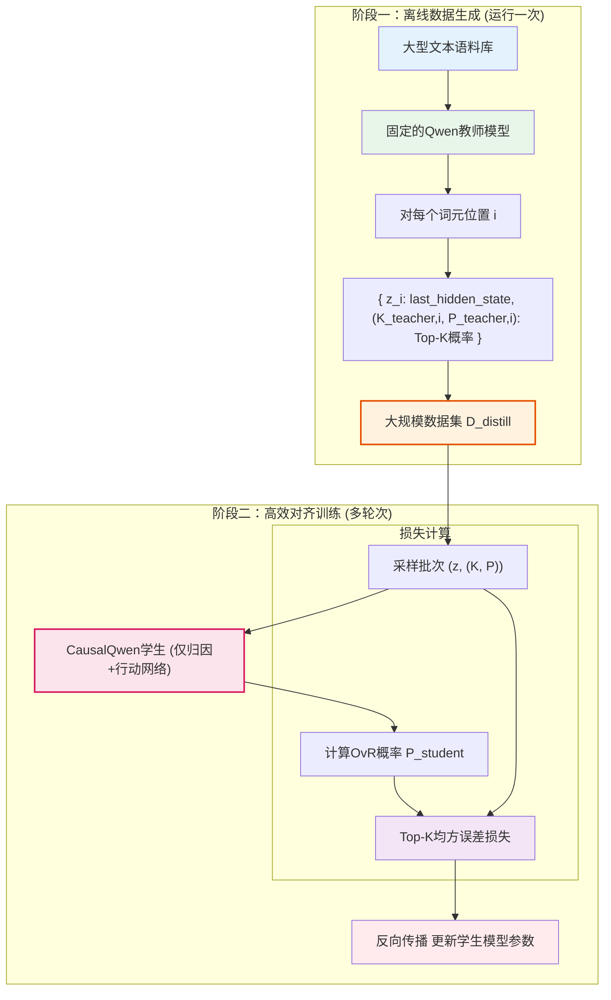
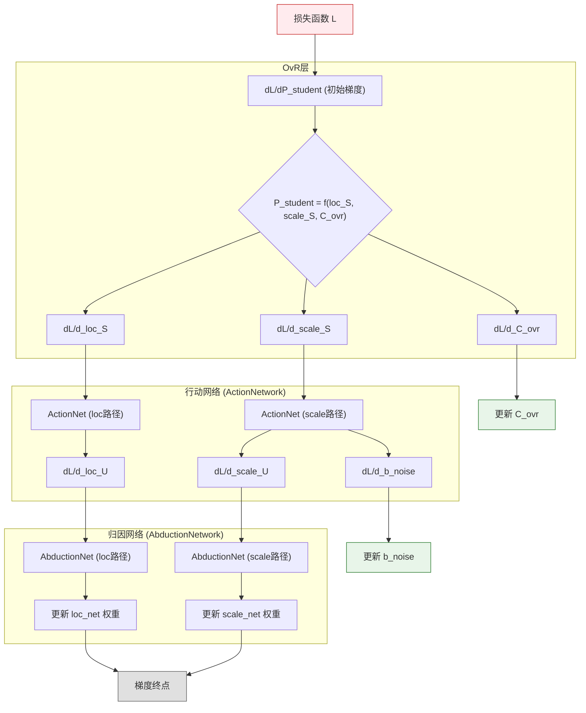

# 预训练对齐策略的数学基础：高效离线特征蒸馏

本文档旨在深入探讨在正式训练CausalQwen之前，如何通过一种高效的预训练（或称为"对齐"）阶段，将一个强大的教师模型（如Qwen）的知识迁移过来。我们将采纳一种**两阶段离线蒸馏范式**，该范式将预训练过程转化为一个高度优化的监督学习问题。

为确保本文档的自洽性，我们首先回顾CausalQwen的核心组件，然后详细阐述对齐策略的数学原理，并最终提供完整的梯度传播分析，覆盖所有可训练参数。

## 1. 背景知识：CausalQwen 核心组件回顾

在预训练对齐阶段，我们的目标是训练CausalQwen的两个核心新模块：`AbductionNetwork` 和 `ActionNetwork`。

### 1.1 核心架构：从证据到决策

CausalQwen的因果推断流程可以分为两个关键步骤：

1.  **归因推断网络 (AbductionNetwork)**: 此模块接收来自上游特征提取网络（如Qwen Transformer）的特征向量 `z`，并将其作为证据，推断出描述一个个体子群体的柯西分布参数。
    $$ (\text{loc}_U, \text{scale}_U) = \text{AbductionNetwork}(z) $$
    其中 `loc_U` 代表该群体的典型中心，`scale_U` 代表该群体的内部多样性或不确定性。

2.  **行动决策网络 (ActionNetwork)**: 此模块接收个体子群体的分布参数，并应用一个普适的线性因果律，为词汇表中的每个词元 `k` 计算出其最终的决策分布参数。
    $$ (\text{loc}_S, \text{scale}_S) = \text{ActionNetwork}(\text{loc}_U, \text{scale}_U) $$
    这个过程还包含一个可训练的**外生噪声参数 `b_noise`**，用于调整系统性的不确定性。

### 1.2 柯西分布与 OvR (One-vs-Rest) 机制

`loc_S` 和 `scale_S` 描述了对每个词元做出选择的决策变量 $S_k$ 的柯西分布 $S_k \sim \text{Cauchy}(\text{loc}_{S_k}, \text{scale}_{S_k})$。CausalQwen不使用Softmax，而是采用OvR机制，将每个词元的选择视为一个独立的二元判断。其概率通过将决策变量 $S_k$ 与一个全局阈值 $C_{\text{ovr}}$ 比较得出：
$$ P_k = P(S_k > C_{\text{ovr}}) = \frac{1}{2} + \frac{1}{\pi} \arctan\left(\frac{\text{loc}_{S_k} - C_{\text{ovr}}}{\text{scale}_{S_k}}\right) $$
在我们的预训练对齐任务中，正是这个OvR概率 $P_k$ 将被用来模仿教师模型的Softmax概率。

## 2. 核心思想：从在线蒸馏到离线特征到概率的映射

传统的知识蒸馏（在线蒸馏）需要在每个训练步骤中同时运行教师和学生模型，计算量巨大。我们采纳一种更优越的策略，将问题解耦为两个独立的阶段，如下图所示：

### 第一阶段：离线数据生成

我们一次性地、离线地创建一个高质量的蒸馏数据集 $\mathcal{D}_{\text{distill}}$。

1.  选取一个大型、通用的文本语料库。
2.  将该语料库完整输入**固定的、预训练好的Qwen教师模型**。
3.  对于语料库中每个token位置 $i$，我们存储一个数据对 `(input, output)`：
    *   **输入 `z_i`**：Qwen最后一层Transformer的输出 `last_hidden_state`。这是一个 `[H]` 维的特征向量。
    *   **输出目标 $(\mathcal{K}_{\text{teacher}, i}, P_{\text{teacher}, i})$**：教师的`lm_head`预测的Top-K词元索引集合 $\mathcal{K}_{\text{teacher}, i}$，以及这些词元对应的Softmax概率 $P_{\text{teacher}, i}$。
4.  最终获得一个大规模的监督学习数据集 $\mathcal{D}_{\text{distill}} = \{(z_i, (\mathcal{K}_{\text{teacher}, i}, P_{\text{teacher}, i}))\}_i$。

### 第二阶段：高效对齐训练

在这个阶段，我们**不再需要教师模型，也不再需要庞大的 `QwenTransformer`**。

1.  我们的学习主体仅为 CausalQwen 的 `AbductionNetwork` 和 `ActionNetwork`。
2.  训练循环变为：
    a. 从 $\mathcal{D}_{\text{distill}}$ 中采样一批特征向量 $\{z_i\}$ 及其对应的目标 $\{(\mathcal{K}_{\text{teacher}, i}, P_{\text{teacher}, i})\}$。
    b. 将 $\{z_i\}$ **直接作为 `AbductionNetwork` 的输入**。
    c. 模型进行前向传播：$z_i \rightarrow (\text{loc}_U, \text{scale}_U) \rightarrow (\text{loc}_S, \text{scale}_S) \rightarrow P_{\text{student}, i}$。
    d. 使用Top-K对齐损失函数计算损失，并进行反向传播。

## 3. Top-K 对齐损失与梯度分析

### 3.1 Top-K对齐损失

损失函数被定义为学生和教师在教师指定的Top-K词元集 $\mathcal{K}_{\text{teacher}, i}$ 上的均方误差：
$$ \mathcal{L}_{\text{Top-K}} = \sum_{i \in \text{batch}} \sum_{k \in \mathcal{K}_{\text{teacher}, i}} \left( P_{\text{student}, i,k} - P_{\text{teacher}, i,k} \right)^2 $$

### 3.2 梯度分析：解决稀疏性

通过对学生模型的OvR概率求导，我们可以看到，损失 $\mathcal{L}$ 对学生的决策分布参数 `loc_S` 和 `scale_S` 均会产生非零梯度。由于我们优化的目标是Top-K集合，这意味着在一次反向传播中，**至少有K个词元的决策参数会收到梯度信号**，这从根本上解决了Top-1策略的梯度稀疏性问题。

## 4. 架构兼容性：完整的端到端梯度传播分析

我们现在严格追踪梯度如何从损失函数出发，反向传播至`ActionNetwork`和`AbductionNetwork`的所有可训练参数，以及其他可学习参数，如OvR决策阈值。下图描绘了完整的梯度反向传播路径：

### 4.1 梯度起点：决策分布参数 `loc_S`、`scale_S` 及阈值 `C_ovr`

根据OvR概率公式和链式法则，损失函数对决策的三个关键输入——`loc_S`、`scale_S` 和 `C_ovr`——的梯度是密集且有效的。

- **对 `loc_S` 和 `scale_S` 的梯度**: $\frac{\partial \mathcal{L}}{\partial \text{loc}_S}$ 和 $\frac{\partial \mathcal{L}}{\partial \text{scale}_S}$ 是后续模块参数更新的起点。
- **对 `C_ovr` 的梯度**:
  $$ \frac{\partial \mathcal{L}}{\partial C_{\text{ovr}}} = \sum_{i, k \in \mathcal{K}} \frac{\partial \mathcal{L}}{\partial P_{i,k}} \frac{\partial P_{i,k}}{\partial C_{\text{ovr}}} $$
  由于 $\frac{\partial P_{i,k}}{\partial C_{\text{ovr}}}$ 是非零的，这个全局共享的决策阈值参数会从所有Top-K词元的损失中汇集梯度，从而得到有效的优化。

这些梯度是后续所有参数更新的起点。

### 4.2 `ActionNetwork` 内的梯度传播

#### 4.2.1 位置参数路径 (`loc_S` → `loc_U`)
`ActionNetwork` 的位置参数计算为线性变换：
$$ \text{loc}_S = \text{loc}_U \cdot W_{\text{action}}^T + b_{\text{action}} $$
根据矩阵求导法则，梯度被线性地传播：
$$ \frac{\partial \mathcal{L}}{\partial \text{loc}_U} = \frac{\partial \mathcal{L}}{\partial \text{loc}_S} \cdot W_{\text{action}} $$
$$ \frac{\partial \mathcal{L}}{\partial W_{\text{action}}} = (\text{loc}_U)^T \cdot \frac{\partial \mathcal{L}}{\partial \text{loc}_S} $$
梯度流是密集的，可以有效更新 `loc_U` 和 `ActionNetwork` 的权重。

#### 4.2.2 尺度参数路径 (`scale_S` → `scale_U` 和 `b_noise`)
`ActionNetwork` 的尺度参数计算涉及不确定性的传播和外生噪声的注入：
$$ \text{scale}_S = \text{matmul}(\text{scale}_U + |\text{b}_{\text{noise}}|, |W_{\text{action}}^T|) $$
梯度同样会反向传播至其所有输入：
$$ \frac{\partial \mathcal{L}}{\partial (\text{scale}_U + |\text{b}_{\text{noise}}|)} = \frac{\partial \mathcal{L}}{\partial \text{scale}_S} \cdot |W_{\text{action}}| $$
这个梯度将进一步分离，分别更新 `scale_U` 和 `b_noise`：
- **对 `b_noise` 的梯度**: $\frac{\partial \mathcal{L}}{\partial \text{b}_{\text{noise}}} = \frac{\partial \mathcal{L}}{\partial (\dots)} \cdot \text{sign}(\text{b}_{\text{noise}})$。这表明外生噪声参数 `b_noise` 能够被端到端地优化。
- **对 `scale_U` 的梯度**: $\frac{\partial \mathcal{L}}{\partial \text{scale}_U} = \frac{\partial \mathcal{L}}{\partial (\dots)}$。这个梯度将继续向后传播至 `AbductionNetwork`。

### 4.3 `AbductionNetwork` 内的梯度传播

`AbductionNetwork` 接收到来自 `ActionNetwork` 的有效梯度 $\frac{\partial \mathcal{L}}{\partial \text{loc}_U}$ 和 $\frac{\partial \mathcal{L}}{\partial \text{scale}_U}$。

#### 4.3.1 位置参数路径 (`loc_U` → `z`)
`loc_U` 由 `loc_net` 计算：
$$ \text{loc}_U = z \cdot W_{\text{loc}}^T + b_{\text{loc}} $$
因此，`loc_net` 的权重 $W_{\text{loc}}$ 会被有效更新：
$$ \frac{\partial \mathcal{L}}{\partial W_{\text{loc}}} = (z)^T \cdot \frac{\partial \mathcal{L}}{\partial \text{loc}_U} $$

#### 4.3.2 尺度参数路径 (`scale_U` → `z`)
`scale_U` 由 `scale_net` 计算，并应用 softplus 激活函数：
$$ \text{scale}_U = \text{softplus}(z \cdot W_{\text{scale}}^T + b_{\text{scale}}) $$
梯度 $\frac{\partial \mathcal{L}}{\partial \text{scale}_U}$ 会通过 softplus 的导数，继续反向传播以更新 `scale_net` 的权重 $W_{\text{scale}}$。

### 4.4 最终结论

**Top-K对齐损失产生的密集梯度信号，能够顺畅地、端到端地优化 CausalQwen 的所有相关可训练参数。这包括：`ActionNetwork` 和 `AbductionNetwork` 的所有权重，外生噪声参数 `b_noise`，以及全局OvR决策阈值 `C_ovr`。** 我们的整体架构在数学上完全支持这种高效的离线预训练范式。

## 5. 新范式的优势与展望

这种"离线特征蒸馏"范式是实现模型对齐的最佳路径。

1.  **极致的训练效率**：避免了在训练循环中重复计算 `QwenTransformer`，预计可将预训练速度提升一到两个数量级。
2.  **清晰的模块化解耦**：将问题分解为"世界表征"（由固定的`QwenTransformer`提供）和"因果决策"（由待训练的`CausalQwen`模块提供），概念更清晰，更易于调试和分析。
3.  **便利的数据增强**：可以直接在连续的特征向量空间`z`上进行数据增强（如添加高斯噪声），以提升模型的鲁棒性。

这种方法为CausalQwen的初始化和知识迁移提供了一个坚实、高效且理论清晰的数学基础。