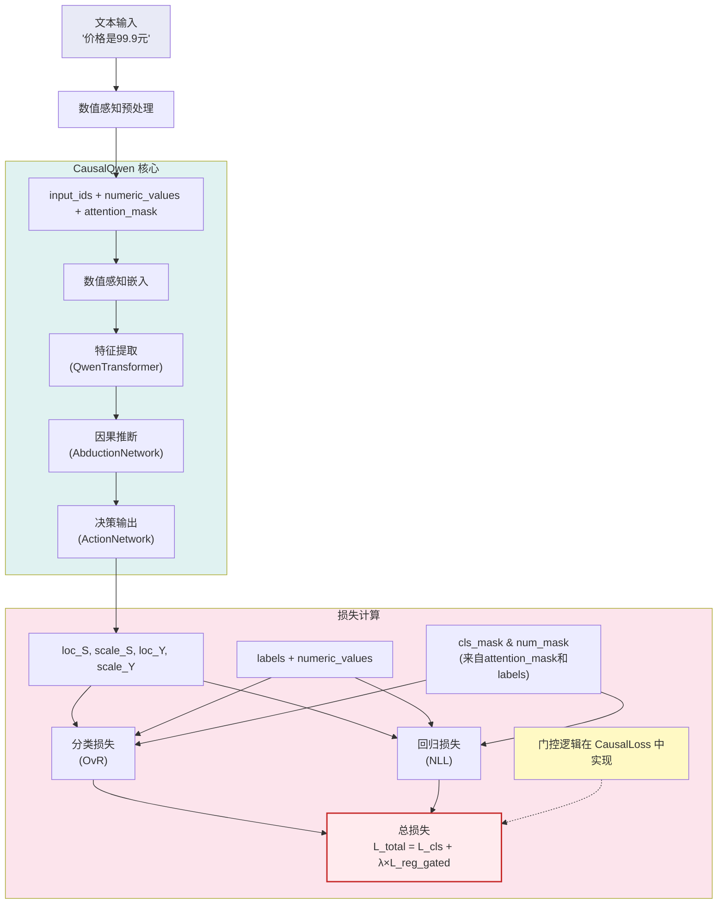
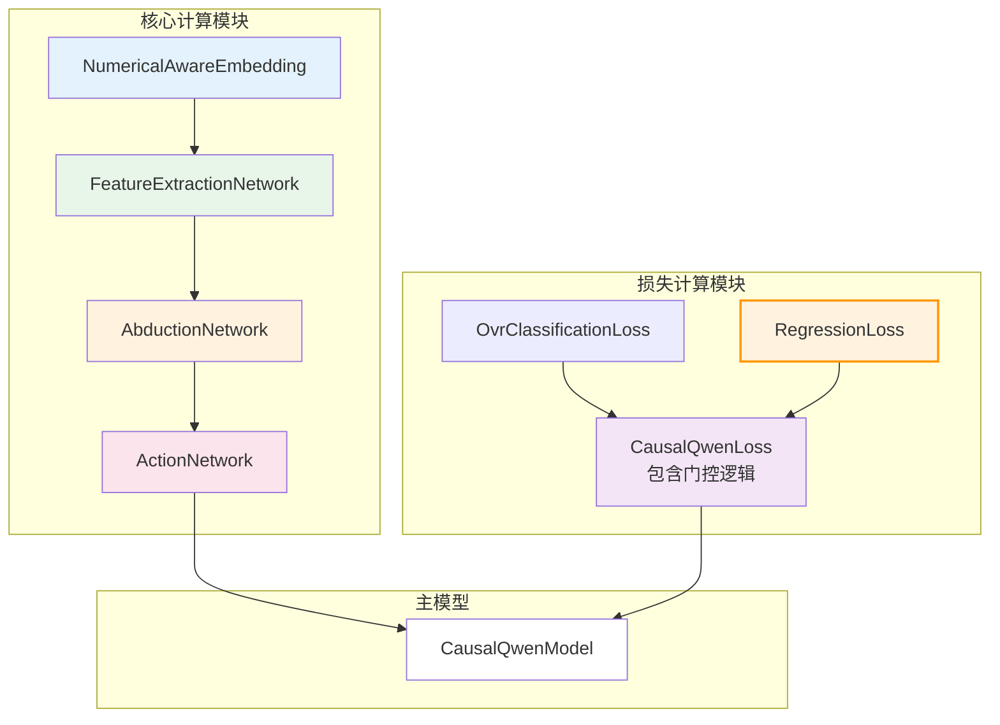
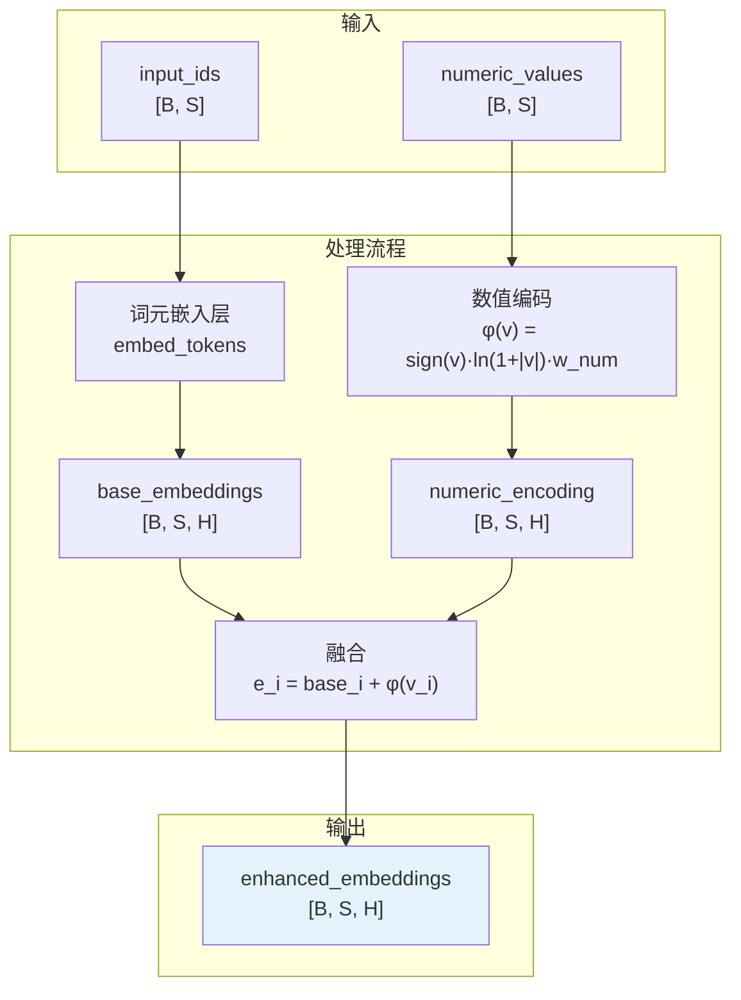
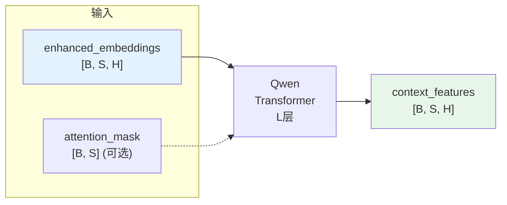
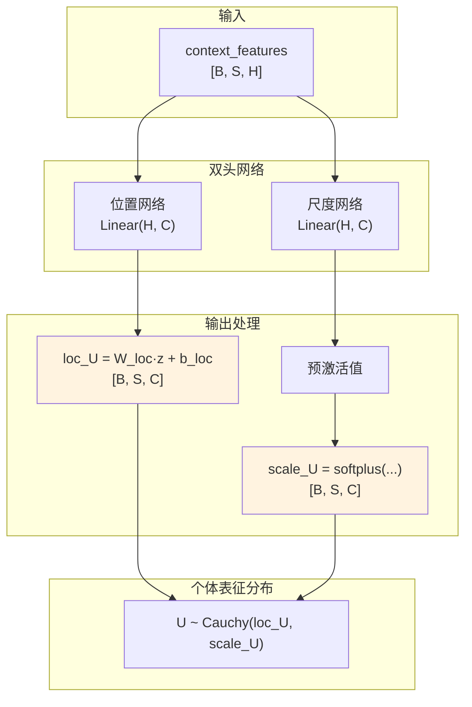
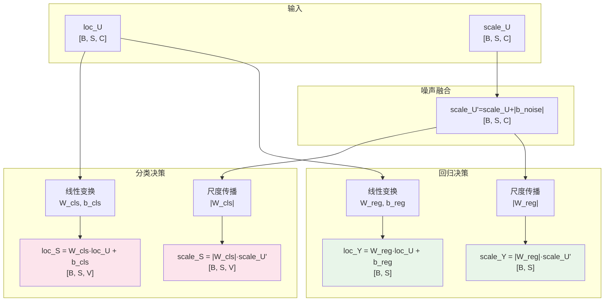
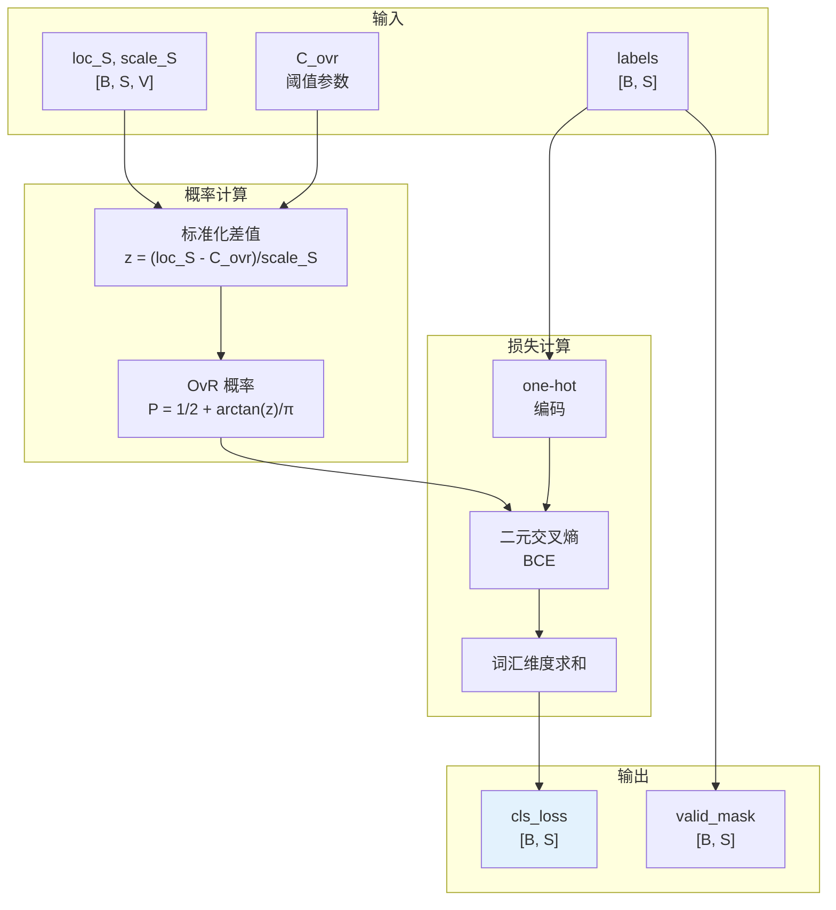
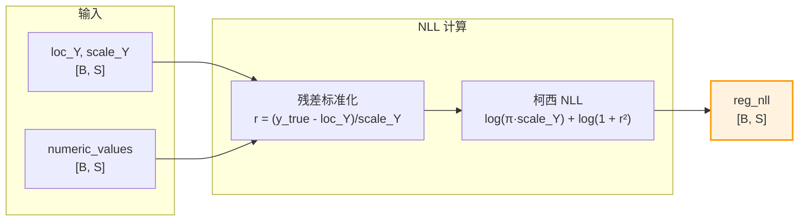
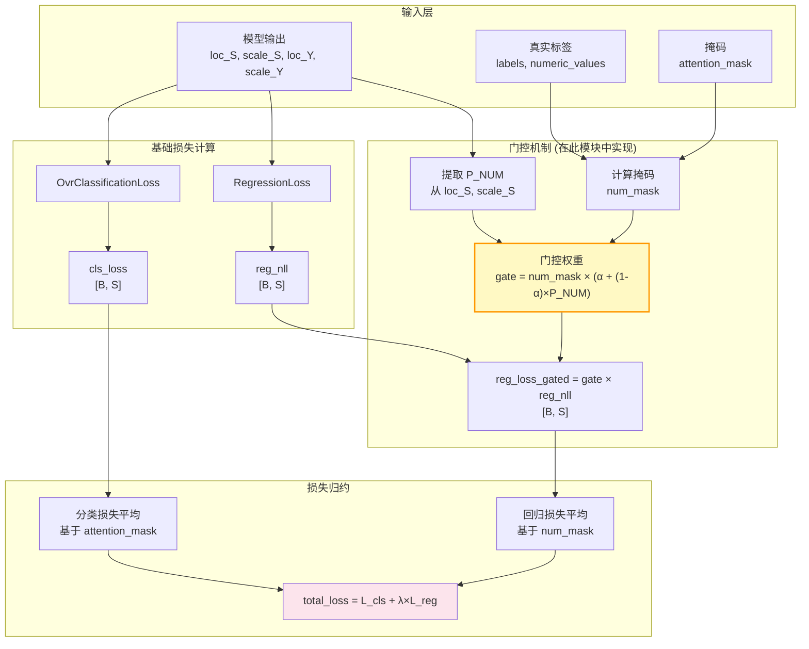
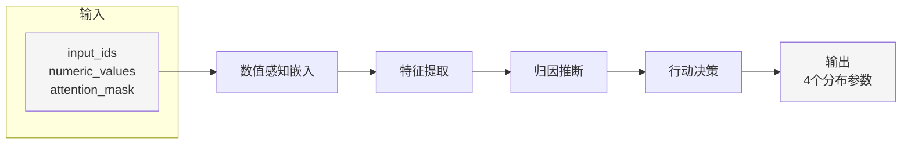

# CausalQwen 模块化重构蓝图 (V4)

本文档为 `causal_qwen.py` 的重构提供**第四版**完整的模块化设计方案。V4 版本基于用户反馈进行了重要改进，特别是在门控机制设计、模块职责划分和流程图清晰度方面。

## 1. 总体架构 (V4)

### 1.1 核心数据流

### 1.2 模块依赖关系

---

## 2. 预处理工具 (Preprocessing Utility)

### **`NumericalAwareTokenizer` (非 `nn.Module` 的工具类)**

*   **职责**: 负责在模型外部进行数据预处理，识别数值并生成对齐的张量序列
*   **接口**: `preprocess(texts: List[str]) -> Dict[str, Tensor]`
    *   **输入**: 原始文本字符串列表
    *   **输出**: 包含 `input_ids`, `numeric_values`, `attention_mask` 的字典

---

## 3. 核心模型模块 (Core Model Modules)

*(张量形状符号: `B`: 批次大小, `S`: 序列长度, `H`: 模型隐藏层维度, `C`: 因果表征维度, `V`: 词汇表大小)*

### 3.1 数值感知嵌入模块

#### **模块 1: `NumericalAwareEmbedding(nn.Module)`**

*   **职责**: 将混合文本/数值输入转换为统一的增强嵌入表示
*   **`__init__(self, token_embedding: nn.Embedding, hidden_size: int)`**
*   **`forward(self, input_ids: Tensor, numeric_values: Tensor) -> Tensor`**:
    *   **输入**:
        *   `input_ids` (`[B, S]`) - 词元ID序列
        *   `numeric_values` (`[B, S]`) - 对齐的数值序列
    *   **输出**:
        *   `enhanced_embeddings`: `[B, S, H]` - 增强后的嵌入

### 3.2 特征提取模块

#### **模块 2: `FeatureExtractionNetwork(nn.Module)`**

*   **职责**: 使用预训练的 Qwen Transformer 提取上下文特征
*   **`__init__(self, qwen_model)`**
*   **`forward(self, embeddings: Tensor, attention_mask: Optional[Tensor]) -> Tensor`**:
    *   **输入**:
        *   `embeddings` (`[B, S, H]`) - 输入嵌入
        *   `attention_mask` (`[B, S]`, 可选) - 注意力掩码
    *   **输出**:
        *   `context_features`: `[B, S, H]` - 上下文特征

### 3.3 归因推断模块

#### **模块 3: `AbductionNetwork(nn.Module)`**

*   **职责**: 从上下文特征推断个体因果表征分布
*   **`__init__(self, hidden_size: int, causal_hidden_size: int, gamma_init: float)`**
*   **`forward(self, features: Tensor) -> Tuple[Tensor, Tensor]`**:
    *   **输入**:
        *   `features` (`[B, S, H]`) - 上下文特征
    *   **输出**:
        *   `loc_U`: `[B, S, C]` - 位置参数
        *   `scale_U`: `[B, S, C]` - 尺度参数

### 3.4 行动决策模块

#### **模块 4: `ActionNetwork(nn.Module)`**

*   **职责**: 基于个体表征进行分类和回归决策
*   **`__init__(self, causal_hidden_size: int, vocab_size: int)`**
*   **`forward(self, loc_U: Tensor, scale_U: Tensor) -> Tuple[Tensor, ...]`**:
    *   **输入**:
        *   `loc_U` (`[B, S, C]`), `scale_U` (`[B, S, C]`)
    *   **输出**:
        *   `loc_S` (`[B, S, V]`), `scale_S` (`[B, S, V]`)
        *   `loc_Y` (`[B, S]`), `scale_Y` (`[B, S]`)

**重要说明**：
- **分类头和回归头都包含偏置项**：`b_cls` 和 `b_reg`
- 完整公式：
  - `loc_S = W_cls · loc_U + b_cls`
  - `loc_Y = W_reg · loc_U + b_reg`
- 尺度传播只涉及权重的绝对值，不涉及偏置
- 偏置项在初始化时设为0，但在训练中会更新

---

## 4. 损失计算模块 (Loss Modules)

### 4.1 分类损失子模块

#### **模块 5.1: `OvrClassificationLoss(nn.Module)`**

*   **职责**: 计算 OvR 分类损失
*   **`__init__(self, vocab_size: int, C_ovr: float|Tensor, learnable_threshold: bool)`**
*   **`forward(self, loc_S: Tensor, scale_S: Tensor, labels: Tensor, ignore_index: int = -100) -> Tuple[Tensor, Tensor]`**:
    *   **输入**:
        *   `loc_S` (`[B, S, V]`), `scale_S` (`[B, S, V]`)
        *   `labels` (`[B, S]`)
        *   `ignore_index` - 忽略的标签值
    *   **输出**:
        *   `cls_loss`: `[B, S]` - 每个位置的分类损失
        *   `valid_mask`: `[B, S]` - 有效位置掩码

### 4.2 回归损失子模块

#### **模块 5.2: `RegressionLoss(nn.Module)`**

*   **职责**: 计算柯西分布的负对数似然
*   **`__init__(self)`**
*   **`forward(self, loc_Y: Tensor, scale_Y: Tensor, true_numeric_values: Tensor) -> Tensor`**:
    *   **输入**:
        *   `loc_Y` (`[B, S]`), `scale_Y` (`[B, S]`)
        *   `true_numeric_values` (`[B, S]`)
    *   **输出**:
        *   `reg_nll`: `[B, S]` - 每个位置的柯西 NLL 损失

**设计理念**：保持 `RegressionLoss` 的独立性，使其可以在其他场景中复用，门控逻辑在 `CausalQwenLoss` 中实现。

### 4.3 组合损失主模块

#### **模块 5 (主模块): `CausalQwenLoss(nn.Module)`**

*   **职责**: 组合分类和回归损失，**在此模块中实现门控机制**，并进行正确的归约
*   **`__init__(self, vocab_size: int, num_token_id: int, C_ovr: float, alpha: float, reg_weight: float, learnable_threshold: bool)`**:
    *   实例化 `OvrClassificationLoss` 和 `RegressionLoss` 两个子模块
*   **`forward(self, loc_S, scale_S, loc_Y, scale_Y, labels, numeric_values, attention_mask) -> Tuple[Tensor, Dict[str, float]]`**:
    *   **逻辑**:
        1. 调用 `self.ovr_loss(...)` 计算基础分类损失
        2. 调用 `self.reg_loss(...)` 计算基础回归NLL
        3. 从 `loc_S`, `scale_S` 中提取 `<NUM>` 词元的预测概率 $P_{\text{<NUM>}}$
        4. 构建数值掩码 `num_mask`
        5. **在此模块中应用门控**: `gated_reg_loss = gate * reg_nll`
        6. 使用 `attention_mask` 和 `num_mask` 对两种损失进行**分别归约**
        7. 加权求和得到 `total_loss`
    *   **输出**: `total_loss` (标量) 和 `loss_dict` (字典)

**门控机制设计理念**：
- 门控是一种"策略"而非"基础计算"
- 将门控逻辑放在顶层模块使得 `RegressionLoss` 可以在其他场景中复用
- 便于实验不同的门控策略（如改变 α 值或门控公式）

---

## 5. 主模型组装

### **`CausalQwenModel(nn.Module)`**

*   **职责**: 串联所有核心模块，执行完整的前向传播
*   **`__init__(self, qwen_model_path: str, causal_hidden_size: int = None)`**
*   **`forward(self, input_ids, numeric_values, attention_mask=None) -> Tuple[Tensor, ...]`**:
    *   **数据流**: `input_ids, numeric_values` → `enhanced_embeddings` → `context_features` → `loc_U, scale_U` → `loc_S, scale_S, loc_Y, scale_Y`

---

## 6. 设计原则与优势

### 6.1 关于门控机制的重要设计决策

**V4 版本的关键改进**：
1. **`RegressionLoss`** 专注于 NLL 计算，不包含门控逻辑
2. **`CausalQwenLoss`** 负责：
   - 所有的掩码逻辑和参数提取
   - **门控机制的完整实现**（将分类置信度与回归损失关联）
   - 协调子模块调用

**设计理由**：
- 门控是一种"策略"而非"基础计算"
- 将门控逻辑放在顶层模块使得 `RegressionLoss` 可以在其他场景中复用
- 便于实验不同的门控策略（如改变 α 值或门控公式）
- 符合单一职责原则

### 6.2 关于偏置项的处理

**ActionNetwork 中的线性变换**：
- **分类头**: `loc_S = W_cls · loc_U + b_cls`
- **回归头**: `loc_Y = W_reg · loc_U + b_reg`
- **尺度传播**: 只涉及权重的绝对值，不涉及偏置
- **初始化**: 偏置项初始化为0，但在训练中会更新

### 6.3 模块化优势

- **单一职责**: 每个模块专注于特定功能
- **可测试性**: 每个组件可独立测试
- **可扩展性**: 易于替换或优化单个模块
- **清晰性**: 数据流和依赖关系明确
- **复用性**: 子模块可在不同场景下复用

### 6.4 初始化策略

- **数值感知嵌入**: 继承 Qwen 词元嵌入，数值编码向量标准初始化
- **归因推断网络**: 恒等映射初始化 (loc) + 常数尺度初始化 (scale)
- **行动网络**: 
  - 分类头：复制 Qwen lm_head 权重和偏置
  - 回归头：标准初始化（权重和偏置）
  - 噪声参数：初始化为零

---

## 7. 实现路线图

1. **Phase 1**: 实现基础模块接口 (Mocker 版本)
2. **Phase 2**: 逐个模块实现具体逻辑
3. **Phase 3**: 端到端测试和优化
4. **Phase 4**: 高级功能 (因果采样、推理模式等)

---

## 8. V4 版本的关键改进总结

### 8.1 架构改进
- **门控逻辑集中化**: 所有门控逻辑都在 `CausalQwenLoss` 中实现
- **模块职责更清晰**: `RegressionLoss` 专注于 NLL 计算
- **更好的复用性**: 基础损失模块可在其他场景中使用

### 8.2 技术细节完善
- **明确偏置项处理**: ActionNetwork 中的线性变换包含偏置项
- **流程图优化**: 简化 Transformer 表示，突出关键计算步骤
- **初始化策略细化**: 详细说明各模块的初始化方法

### 8.3 设计理念强化
- **单一职责原则**: 每个模块专注于核心功能
- **策略与计算分离**: 门控策略在顶层，基础计算在底层
- **可扩展性优先**: 便于实验不同的门控和损失策略

这个 V4 设计为 CausalQwen 的完整实现提供了更加坚实和清晰的架构基础。 