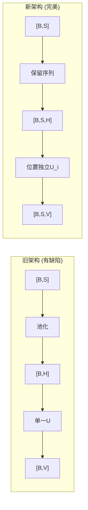

# CausalQwen 开发日志

> 记录 CausalQwen 项目的重大版本里程碑和关键技术突破

---

## 🎯 v2025.0610 - 序列到序列架构重构里程碑
**日期**: 2025年06月10日  
**提交哈希**: `b18e24e`  
**分支**: `dev`

### 🚀 重大架构变革
- **核心突破**: 完成从单一输出到序列到序列的重大架构重构
- **理论实现**: 实现位置独立的推断-行动范式，每个序列位置都进行独立的因果推理
- **数学统一**: 完美统一 `mathematical_foundations.md` 的理论表达与工程实践

### ⚡ 技术亮点
- **位置独立推断**: `U_i | z_i ~ Cauchy(loc_i, scale_i)` 在每个位置独立执行
- **序列数据流**: `[B,S] -> [B,S,H] -> [B,S,C] -> [B,S,V]` 完整保留序列信息
- **柯西分布工程化**: 成功应用柯西分布的线性稳定性，实现无采样训练
- **统一不确定性框架**: 同一套数学框架处理分类和回归任务

### 🔧 解决的关键问题
- ❌ **旧问题**: 序列池化导致位置信息丢失
- ✅ **新解决方案**: 保留完整序列维度，实现位置级推理

- ❌ **旧问题**: 单一因果表征无法体现位置差异  
- ✅ **新解决方案**: 每个位置独立的个体因果表征 `U_i`

- ❌ **旧问题**: 共享预测违背因果独立性
- ✅ **新解决方案**: 位置独立的分类和回归决策

### 📊 架构对比

### 📚 相关文档
- **架构分析**: `docs/analysis/forward_pass_analysis.md`
- **数学基础**: `design-docs/math/mathematical_foundations.md`
- **核心设计**: `design-docs/core-design.md`

### 🎯 里程碑意义
这个版本标志着 CausalQwen 从传统机器学习向因果AI的**根本性跃迁**。我们首次在神经语言模型中正确实现了位置独立的因果推理，为因果AI的发展开辟了新的道路。

---

## 📝 版本记录格式说明

每个重大版本记录应包含：
- **版本号**: 格式为 `vYYYY.MMDD`
- **日期和提交信息**
- **重大变更**: 架构、算法、理论突破
- **技术亮点**: 关键实现细节
- **解决的问题**: 对比新旧方案
- **相关文档**: 链接到详细技术文档
- **里程碑意义**: 对项目发展的重要性

---

## 🔮 未来规划

### 短期目标 (v2024.12xx)
- [ ] 大规模实验验证新架构的性能
- [ ] 多任务数据集的适配和优化
- [ ] 模型缩放实验（更大参数量）

### 中期目标 (v2025.0x)
- [ ] 多模态因果推理扩展
- [ ] 反事实推理能力实现
- [ ] 工业级部署优化

### 长期愿景
- [ ] 通用因果AI系统
- [ ] 可解释的因果决策引擎
- [ ] 因果推理标准化框架

---

*最后更新: 2024年12月10日* 