# CausalEngine 数学基础

> **核心创新**: 基于因果推理的通用智能算法，首次实现不确定性的解析运算  
> **理论基石**: [Distribution-consistency Structural Causal Models](https://arxiv.org/abs/2401.15911)  
> **技术突破**: 利用柯西分布的线性稳定性，避免大规模采样

## 1. 核心哲学与数学框架

### 1.1 因果推理的本质

CausalEngine 基于一个深刻洞察：**真正的智能是理解，而非模仿**。传统机器学习通过学习 $P(Y|X)$ 来模拟数据分布，而 CausalEngine 通过学习因果机制来理解世界运行的本质规律。

```mermaid
graph TB
    subgraph Traditional["传统机器学习范式"]
        direction TB
        T1["学习条件分布 P(Y|X)"]
        T2["从分布中采样结果"]
        T3["模仿表面统计规律"]
        T1 --> T2 --> T3
    end
    
    subgraph Causal["CausalEngine 因果范式"]
        direction TB
        C1["学习因果机制 Y = f(U,ε)"]
        C2["理解个体差异与规律"]
        C3["基于理解进行推理"]
        C1 --> C2 --> C3
    end
    
    subgraph Comparison["核心差异"]
        direction TB
        Diff["🔄 模仿 vs 理解<br/>📊 统计规律 vs 因果机制<br/>🎲 采样 vs 推理<br/>🔒 固定 vs 反事实"]
    end
    
    Traditional --> Comparison
    Causal --> Comparison
    
    classDef traditionalStyle fill:#ffebee,stroke:#c62828,stroke-width:2px
    classDef causalStyle fill:#e8f5e8,stroke:#2e7d32,stroke-width:2px
    classDef comparisonStyle fill:#e1f5fe,stroke:#0277bd,stroke-width:3px
    
    class Traditional,T1,T2,T3 traditionalStyle
    class Causal,C1,C2,C3 causalStyle
    class Comparison,Diff comparisonStyle
```



### 1.2 个体选择变量 U 的双重身份

为了真正实现因果推理，我们引入**个体选择变量 $U$**——这是理解 CausalEngine 所有"魔法"的关键：

**身份一：个体选择变量**
- $U=u$ 代表从所有可能个体中"选择"了特定个体 $u$

**身份二：个体因果表征**  
- 向量 $u$ 包含该个体所有内在的、驱动其行为的潜在属性

### 1.3 核心数学框架

CausalEngine 基于结构因果模型的数学框架：

$$Y = f(U, E)$$

其中：
- **$Y$**: 观测结果
- **$U$**: 个体选择变量（Individual Choice Variable）
- **$E$**: 外生噪声（Exogenous Noise）  
- **$f$**: 普适因果机制（Universal Causal Mechanism）

**关键洞察**：
- **复杂性在表征**：从混乱证据 $X$ 推断真正表征 $U$ 是高度非线性的
- **简洁性在规律**：一旦找到正确表征 $u$，因果规律 $f$ 本身是简单线性的
- **一致性在机制**：函数 $f$ 对所有个体普适，个体差异完全体现在 $u$ 中

## 2. CausalEngine 三阶段架构

### 2.1 整体架构图

```mermaid
graph TB
    Input["📥 输入证据 X<br/>观测数据/上下文"]
    
    subgraph Stage1["🔍 阶段1: 归因推断 (Abduction)"]
        direction LR
        S1_Process["推断个体分布<br/>U ~ Cauchy(μ_U, γ_U)"]
        S1_Networks["双网络并行计算<br/>loc_net(X) ⊕ scale_net(X)"]
        S1_Process ~~~ S1_Networks
    end
    
    subgraph Stage2["⚡ 阶段2: 行动决策 (Action)"]
        direction LR
        S2_Process["线性因果变换计算S<br/>W_A·(U + b_noise·E) + b_A"]
        S2_Properties["利用柯西分布<br/>线性稳定性"]
        S2_Process ~~~ S2_Properties
    end
    
    subgraph Stage3["🎯 阶段3: 任务激活 (Task Activation)"]
        direction LR
        S3_Tasks["多任务支持<br/>分类/回归/序列生成"]
        S3_Modes["多推理模式<br/>Deterministic/Exogenous/Endogenous/Standard/Sampling"]
        S3_Tasks ~~~ S3_Modes
    end
    
    Input --"证据 → 个体表征"--> Stage1 --"个体表征 → 决策得分"--> Stage2 --"决策得分 → 任务输出"   --> Stage3
    
    Output["📤 任务特定输出<br/>预测/分类/生成"]
    Stage3 --> Output
    
    %% 核心特性标注
    subgraph Features["🌟 核心特性"]
        direction LR
        F1["解析计算<br/>无需采样"]
        F2["不确定性<br/>显式建模"]
        F3["因果推理<br/>反事实支持"]
        F4["个体差异<br/>精确捕获"]
    end
    
    Stage1 -.-> F4
    Stage2 -.-> F1
    Stage3 -.-> F2
    Output -.-> F3
    
    %% 样式定义
    classDef inputStyle fill:#e1f5fe,stroke:#01579b,stroke-width:3px
    classDef stage1Style fill:#f3e5f5,stroke:#7b1fa2,stroke-width:3px
    classDef stage2Style fill:#fff3e0,stroke:#f57c00,stroke-width:3px
    classDef stage3Style fill:#e8f5e8,stroke:#2e7d32,stroke-width:3px
    classDef outputStyle fill:#ffebee,stroke:#c62828,stroke-width:3px
    classDef featureStyle fill:#fafafa,stroke:#616161,stroke-width:1px
    
    class Input inputStyle
    class Stage1,S1_Title,S1_Process,S1_Networks stage1Style
    class Stage2,S2_Title,S2_Process,S2_Properties stage2Style
    class Stage3,S3_Title,S3_Tasks,S3_Modes stage3Style
    class Output outputStyle
    class Features,F1,F2,F3,F4 featureStyle
```



### 2.2 阶段1：归因推断（Abduction）

**核心任务**：从观测证据推断个体的内在因果表征

```mermaid
graph TB
    Evidence["📊 输入证据 X<br/>特征/上下文/历史"]
    
    subgraph AbductionDetail["归因推断详细流程"]
        direction TB
        
        subgraph DualNetwork["双网络并行架构"]
            direction TB
            LocNet["📍 位置网络预测中心<br/>μ_U = loc_net(X)"]
            ScaleNet["📏 尺度网络预测不确定性<br/>γ_U=softplus(scale_net(X))"]
        end
        
        subgraph Distribution["个体表征分布"]
            direction TB
            Formula["U ~ Cauchy(μ_U, γ_U)"]
            PDF["概率密度函数:<br/>p(U|X) = 1/(πγ_U) · 1/(1 + ((U-μ_U)/γ_U)²)"]
            Meaning["包含个体所有<br/>内在因果属性"]
        end
    end
    
    Evidence --> DualNetwork
    DualNetwork --> Distribution
    
    subgraph CauchyProperties["柯西分布的深刻含义"]
        direction TB
        P1["📊 重尾分布<br/>为黑天鹅事件保留概率"]
        P2["🤔 无穷方差<br/>承认个体的"深刻未知""]
        P3["🔄 线性稳定性<br/>支持解析计算"]
        P4["🌍 开放世界<br/>诚实表达不确定性"]
    end
    
    Distribution --> CauchyProperties
    
    classDef evidenceStyle fill:#e1f5fe,stroke:#01579b,stroke-width:2px
    classDef networkStyle fill:#e3f2fd,stroke:#1976d2,stroke-width:2px
    classDef distributionStyle fill:#f3e5f5,stroke:#7b1fa2,stroke-width:2px
    classDef propertyStyle fill:#e8f5e8,stroke:#2e7d32,stroke-width:2px
    
    class Evidence evidenceStyle
    class DualNetwork,LocNet,ScaleNet networkStyle
    class Distribution,Formula,PDF,Meaning distributionStyle
    class CauchyProperties,P1,P2,P3,P4 propertyStyle
```



**数学表达**：

位置网络计算个体表征的"中心"：
$$\mu_U = \text{loc\_net}(X)$$

尺度网络计算个体表征的"不确定性"：
$$\gamma_U = \text{softplus}(\text{scale\_net}(X)) = \log(1 + \exp(\text{scale\_net}(X)))$$

个体表征分布：
$$U \sim \text{Cauchy}(\mu_U, \gamma_U)$$

### 2.3 阶段2：行动决策（Action）

**核心任务**：基于个体表征生成决策得分，体现普适因果规律

```mermaid
graph TB
    InputU["🎲 输入：个体表征<br/>U ~ Cauchy(μ_U, γ_U)"]
    
    subgraph ActionProcess["行动决策流程"]
        direction TB
        
        subgraph Step1["步骤1: 五模式噪声调制"]
            direction TB
            Formula["统一公式<br/>U' = U + b_noise·ε"]
            Modes["五种模式<br/>deterministic/exogenous/<br/>endogenous/standard/sampling"]
        end
        
        subgraph Step2["步骤2: 线性因果变换"]
            direction LR
            Transform["S = W_A·U' + b_A<br/>线性因果关系应用"]
            Linear["利用柯西分布<br/>线性稳定性"]
        end
        
        subgraph Mathematics["五模式数学表述"]
            direction LR
            Det["Deterministic:<br/>U' = μ_U"]
            Exo["Exogenous:<br/>U' ~ Cauchy(μ_U, |b_noise|)"]
            Endo["Endogenous:<br/>U' ~ Cauchy(μ_U, γ_U)"]
            Std["Standard:<br/>U' ~ Cauchy(μ_U, γ_U + |b_noise|)"]
            Samp["Sampling:<br/>U' ~ Cauchy(μ_U + b_noise·E, γ_U)"]
        end
    end
    
    
    subgraph LinearStability["柯西分布线性稳定性"]
        direction TB
        Property["X ~ Cauchy(μ,γ)<br/>⇓<br/>aX + b~Cauchy(aμ+b, |a|γ)"]
        Advantage["🎯 整个过程解析可计算<br/>🚀 无需蒙特卡洛采样<br/>⚡ 高效且精确"]
    end
    
    InputU --> Step1 --> Step2 --> OutputS


    Mathematics ~~~ LinearStability
    Modes .-> Mathematics
    
    OutputS["📈 输出：决策得分<br/>S ~ Cauchy(loc_S, scale_S)"]
    
    classDef inputStyle fill:#e1f5fe,stroke:#01579b,stroke-width:2px
    classDef stepStyle fill:#fff3e0,stroke:#f57c00,stroke-width:2px
    classDef mathStyle fill:#f3e5f5,stroke:#7b1fa2,stroke-width:2px
    classDef stabilityStyle fill:#e8f5e8,stroke:#2e7d32,stroke-width:2px
    classDef outputStyle fill:#ffebee,stroke:#c62828,stroke-width:2px
    
    class InputU inputStyle
    class Step1,Step2,Noise,Injection,Result1,Transform,Linear,Result2 stepStyle
    class Mathematics,Loc,Scale,Final mathStyle
    class LinearStability,Property,Advantage stabilityStyle
    class OutputS outputStyle
```



**线性稳定性的数学魔法**：

柯西分布具有独特的线性稳定性质：
$$\text{如果 } X \sim \text{Cauchy}(\mu, \gamma), \text{ 则 } aX + b \sim \text{Cauchy}(a\mu + b, |a|\gamma)$$

**加法稳定性**：
$$X_1 \sim \text{Cauchy}(\mu_1, \gamma_1), X_2 \sim \text{Cauchy}(\mu_2, \gamma_2) \Rightarrow X_1 + X_2 \sim \text{Cauchy}(\mu_1 + \mu_2, \gamma_1 + \gamma_2)$$

**线性组合稳定性**：
$$\sum_{i=1}^n w_i X_i \sim \text{Cauchy}\left(\sum_{i=1}^n w_i \mu_i, \sum_{i=1}^n |w_i| \gamma_i\right)$$

这使得整个前向传播过程完全解析化，无需任何采样！

### 2.4 阶段3：任务激活（Task Activation）

**核心任务**：将决策得分转化为任务特定的输出

任务激活头是 CausalEngine 的最后一层，负责将通用的决策得分 $S$ 转换为具体任务需要的输出格式。

**默认配置设计**：
- **不可学习参数**：激活头采用固定的数学变换，无需训练
- **简单高效**：避免额外的复杂性，专注于核心因果推理能力
- **数学纯粹**：直接基于柯西分布的解析性质进行输出变换

**数学公式**：

回归任务激活函数（恒等映射）：
$$y_{j,i} = \mu_{S_{j,i}}$$

分类任务激活函数（柯西CDF变换）：
$$P_{k,i} = \frac{1}{2} + \frac{1}{\pi}\arctan\left(\frac{\mu_{S_{k,i}}}{\gamma_{S_{k,i}}}\right)$$

其中所有变换参数都是固定的（无可学习权重），确保激活头的数学纯粹性。

> **未来扩展**：后续版本可引入可学习的激活参数，如分类任务的可调阈值 $C_k$ 或回归任务的线性变换权重，以提升模型表达能力。

不同的激活模式支持不同类型的机器学习任务。

```mermaid
graph TB
    InputS["📈 输入：决策得分<br/>S ~ Cauchy(loc_S, scale_S)"]
    
    subgraph TaskTypes["支持的任务类型"]
        direction TB
        
        subgraph Regression["📊 数值回归"]
            direction LR
            RegFormula["predict: y = μ_{S_j,i}"]
            RegOutput["predict_dist: <br/>[μ_{S_j,i}, γ_{S_j,i}]<br/>[n_samples, output_dim, 2]"]
        end
        
        subgraph Classification["🏷️ 分类任务"]
            direction LR
            ClassFormula["predict: argmax_k P_{k,i}"]
            ClassOutput["predict_dist: <br/>[n_samples, n_classes]<br/>OvR激活概率"]
        end
        
        Regression ~~~ Classification
    end
    
    subgraph InferenceModes["五种推理模式"]
        direction LR
        Det["🎯 Deterministic<br/>确定性推理<br/>γ_U=0, b_noise=0"]
        Exo["🌍 Exogenous<br/>外生噪声推理<br/>γ_U=0, b_noise≠0"]
        Endo["🧠 Endogenous<br/>内生不确定性推理<br/>γ_U≠0, b_noise=0"]
        Std["⚡ Standard<br/>混合推理<br/>γ_U≠0, b_noise→scale"]
        Samp["🎲 Sampling<br/>随机探索推理<br/>γ_U≠0, b_noise→location"]
    end
    
    InputS --> TaskTypes
    InputS --> InferenceModes
    
    subgraph LossUnified["📊 统一损失函数接口"]
        direction TB
        Traditional["Deterministic模式<br/>MSE/CrossEntropy损失"]
        Causal["因果模式(其他4种)<br/>Cauchy NLL/OvR BCE"]
    end
    
    subgraph Advantages["核心优势"]
        direction TB
        A1["🎯 多任务统一<br/>同一框架支持所有任务"]
        A2["🔧 模式灵活<br/>五种推理模式可选"]
        A3["📊 不确定性<br/>显式分布建模"]
        A4["🧠 可解释<br/>因果机制透明"]
    end
    
    TaskTypes --> Advantages
    InferenceModes --> Advantages
    Advantages .-> LossUnified
    
    classDef inputStyle fill:#e1f5fe,stroke:#01579b,stroke-width:2px
    classDef taskStyle fill:#fff3e0,stroke:#f57c00,stroke-width:2px
    classDef modeStyle fill:#f3e5f5,stroke:#7b1fa2,stroke-width:2px
    classDef lossStyle fill:#e8f5e8,stroke:#2e7d32,stroke-width:2px
    classDef advantageStyle fill:#fce4ec,stroke:#ad1457,stroke-width:2px
    
    class InputS inputStyle
    class TaskTypes,Regression,Classification,RegFormula,RegOutput,ClassFormula,ClassOutput taskStyle
    class InferenceModes,Det,Exo,Endo,Std,Samp modeStyle
    class LossUnified,Traditional,Causal lossStyle
    class Advantages,A1,A2,A3,A4 advantageStyle
```



#### 数学等价性配置

**核心理念**：通过 Deterministic 模式实现与传统深度学习的完全数学等价，为CausalEngine提供可信的理论基线。

**等价性配置**：
```python
# Deterministic模式配置
mode = "deterministic"  # γ_U=0, b_noise=0
# 此时 U' = μ_U（确定性），整个模型退化为标准MLP
```

**数学验证**：

Deterministic模式下的前向传播：
$$U' = \mu_U = \text{loc\_net}(X)$$
$$S = W_A \cdot U' + b_A = W_A \cdot \text{loc\_net}(X) + b_A$$

任务输出：
- **回归**：$y = \mu_S = S$（与MLP线性层等价）
- **分类**：$\text{logits} = \mu_S = S$（与MLP+CrossEntropy等价）

> **数学注记**：虽然可以将 `loc_net` 设为恒等映射来更直观地显示等价性，但由于线性变换的复合仍为线性变换，即 $W_A \cdot \text{loc\_net}(X) + b_A$ 在数学上等价于任意线性层 $W \cdot X + b$，因此当前设计已完全保证数学等价性。

**等价性意义**：
- ✅ **数学基线**：确保CausalEngine理论基础的正确性
- ✅ **性能对比**：为因果推理能力提供可信的参考标准  
- ✅ **渐进验证**：从确定性逐步过渡到因果推理模式

### 2.5 统一损失函数

CausalEngine 的设计哲学之一是与传统机器学习的数学等价性。这不仅体现在模型架构上，也体现在损失函数的设计上。我们为不同的推理模式设计了不同的损失函数，确保在`deterministic`模式下与标准方法完全对等，同时在因果模式下使用更符合理论基础的损失。

```mermaid
graph TD
    subgraph LossFunctions["CausalEngine 统一损失函数框架"]
        direction TB
        
        subgraph CausalModes["🧠 因果模式 (Exogenous/Endogenous/Standard/Sampling)"]
            direction TB
            CausalOutput["输出: S ~ Cauchy(μ_S, γ_S)"] --> CausalLoss
            
            subgraph CausalLoss["基于负对数似然 (NLL)"]
                direction TB
                RegressionLoss["回归: 柯西NLL<br>L = log(γ_S) + log(1 + ((y-μ_S)/γ_S)²)<br>同时优化准度与不确定性"]
                ClassificationLoss["分类: OvR BCE<br>L = -Σ [y_k log(P_k) + (1-y_k)log(1-P_k)]<br>独立判断，非竞争"]
            end
        end
        
        subgraph DeterministicMode["🎯 确定性模式 (Deterministic)"]
            direction TB
            DetOutput["输出: y_pred = μ_S (确定性值)"] --> DetLoss
            
            subgraph DetLoss["与传统ML对齐"]
                direction TB
                DetRegLoss["回归: 均方误差 (MSE)<br>L = (y - y_pred)²<br>标准回归损失"]
                DetClassLoss["分类: 交叉熵 (Cross-Entropy)<br>L = -Σ y_k log(Softmax(μ_S))<br>标准分类损失"]
            end
        end
        
    end

    subgraph Bridge["🌉 等价性桥梁"]
        direction TB
        B1["因果模式 → 确定性模式<br>当 γ_S → 0"]
        B2["NLL/BCE → MSE/CrossEntropy<br>损失函数退化"]
    end
    
    CausalModes --> Bridge
    DeterministicMode --> Bridge
    
    classDef causalStyle fill:#e8f5e8,stroke:#2e7d32,stroke-width:2px
    classDef detStyle fill:#e1f5fe,stroke:#0277bd,stroke-width:2px
    classDef bridgeStyle fill:#fff3e0,stroke:#f57c00,stroke-width:2px
    
    class CausalModes,CausalOutput,CausalLoss,RegressionLoss,ClassificationLoss causalStyle
    class DeterministicMode,DetOutput,DetLoss,DetRegLoss,DetClassLoss detStyle
    class Bridge,B1,B2 bridgeStyle
```



#### 2.5.1 因果模式损失：基于分布的负对数似然

在`exogenous`, `endogenous`, `standard`, `sampling`四种因果模式下，模型输出的是一个完整的柯西分布 $S \sim \text{Cauchy}(\mu_S, \gamma_S)$。因此，我们采用负对数似然（Negative Log-Likelihood, NLL）作为损失函数，以最大化观测数据出现的概率。

**1. 回归任务：柯西NLL损失**

对于回归任务，给定真实值 $y$，其损失是柯西分布的负对数似然：
$$L_{\text{CauchyNLL}}(y, \mu_S, \gamma_S) = -\log p(y | \mu_S, \gamma_S) = \log(\pi) + \log(\gamma_S) + \log\left(1 + \left(\frac{y - \mu_S}{\gamma_S}\right)^2\right)$$
该损失函数会同时优化预测的中心 $\mu_S$ 和不确定性 $\gamma_S$，使模型学会不仅预测得"准"，还要对自己的预测"有数"。

**2. 分类任务：独立二元交叉熵损失（OvR BCE）**

对于分类任务，我们采用 One-vs-Rest (OvR) 策略。每个类别 $k$ 都被视为一个独立的二元分类问题。
首先，通过柯西CDF计算出将决策得分 $S_k$ 判定为正类的概率 $P_k$：
$$P_{k} = P(S_k > C_{k}) = \frac{1}{2} + \frac{1}{\pi}\arctan\left(\frac{\mu_{S_{k}} - C_{k}}{\gamma_{S_{k}}}\right)$$
其中 $C_k$ 是一个可学习或固定的决策阈值（通常默认为0）。

然后，对所有类别使用二元交叉熵（Binary Cross-Entropy, BCE）计算总损失：
$$L_{\text{OvR-BCE}} = -\sum_{k=1}^{K} [y_k \log P_k + (1-y_k) \log(1-P_k)]$$
其中 $y_k$ 是类别 $k$ 的真实标签（0或1）。这种方法摆脱了Softmax的竞争性归一化，允许模型对每个类别做出独立、不相互排斥的判断。

#### 2.5.2 确定性模式损失：与传统ML对齐

在`deterministic`模式下，$\gamma_U=0$ 且 $b_{noise}=0$，因此输出的尺度 $\gamma_S=0$，分布退化为确定性值。此时，模型与标准深度学习模型在数学上等价，损失函数也相应退化。

**1. 回归任务：均方误差损失（MSE）**

当 $\gamma_S \to 0$ 时，柯西NLL损失在数学上并不适用。此时模型输出 $y_{pred} = \mu_S$，我们采用标准的均方误差损失：
$$L_{\text{MSE}}(y, y_{pred}) = (y - y_{pred})^2$$

**2. 分类任务：标准交叉熵损失（Cross-Entropy）**

在确定性模式下，模型的输出 $\mu_S$ 等价于传统模型的logits。因此，我们使用标准的多分类交叉熵损失：
$$L_{\text{CrossEntropy}}(y, \mu_S) = -\sum_{k=1}^{K} y_k \log(\text{Softmax}(\mu_S)_k)$$

通过这种双轨设计，CausalEngine不仅推进了因果推理的边界，也坚实地植根于现有深度学习的最佳实践中，为性能对比和理论验证提供了坚固的桥梁。

## 3. 柯西分布：开放世界的数学语言

### 3.1 为什么选择柯西分布？

```mermaid
graph TB
    subgraph Comparison["分布对比：高斯 vs 柯西"]
        direction TB
        
        subgraph Gaussian["🔔 高斯分布（传统选择）"]
            direction LR
            G1["指数衰减尾部<br/>P(|X| > k) ~ exp(-k²)"]
            G2["有限方差<br/>σ² < ∞"]
            G3["封闭世界假设<br/>极端事件概率趋零"]
            G4["线性叠加复杂<br/>需要复杂计算"]
        end
        
        subgraph Cauchy["📐 柯西分布（CausalEngine选择）"]
            direction LR
            C1["幂律衰减尾部<br/>P(|X| > k) ~ 1/k"]
            C2["无穷方差<br/>σ² = ∞"]
            C3["开放世界表达<br/>黑天鹅事件保留概率"]
            C4["线性稳定性<br/>解析计算魔法"]
        end
        
        subgraph Philosophy["深层哲学意义"]
            direction TB
            P1["🤔 承认未知<br/>我们永远无法完全了解个体"]
            P2["🌍 开放世界<br/>总有意外可能发生"]
            P3["🎯 因果本质<br/>重尾分布符合因果直觉"]
        end
    end
    
    Gaussian --> Philosophy
    Cauchy --> Philosophy
    
    classDef gaussianStyle fill:#ffebee,stroke:#c62828,stroke-width:2px
    classDef cauchyStyle fill:#e8f5e8,stroke:#2e7d32,stroke-width:2px
    classDef philosophyStyle fill:#e1f5fe,stroke:#0277bd,stroke-width:2px
    
    class Gaussian,G1,G2,G3,G4 gaussianStyle
    class Cauchy,C1,C2,C3,C4 cauchyStyle
    class Philosophy,P1,P2,P3 philosophyStyle
```



### 3.2 柯西分布的三重价值

> *"在反事实世界里，一切皆有可能。"*  
> *"In the counterfactual world, everything is possible."*

**1. 诚实的不确定性表达**
> "任何观测到的伟大成就，任何人都有非零的概率做出来"

重尾分布为"黑天鹅"事件保留不可忽略的概率，诚实表达开放世界的深层不确定性。

**2. 数学上的"深刻未知"**

柯西分布的期望和方差数学上无定义：
$$E[X] = \text{undefined}, \quad \text{Var}[X] = \text{undefined}$$

这恰好对应了"我们永远无法完全知道一个个体到底是什么样的"这一哲学事实。

**3. 线性稳定性（计算魔法）**

柯西分布的线性稳定性使得整个前向传播过程可以完全解析化：

$$X_1 + X_2 \sim \text{Cauchy}(\mu_1 + \mu_2, \gamma_1 + \gamma_2)$$
$$w \cdot X \sim \text{Cauchy}(w \cdot \mu, |w| \cdot \gamma)$$

## 4. 实际应用与优势

### 4.1 与传统方法的对比

```mermaid
graph TB
    subgraph Traditional["传统深度学习"]
        direction TB
        T1["学习 P(Y|X)<br/>条件分布拟合"]
        T2["Softmax 输出<br/>竞争性归一化"]
        T3["隐式不确定性<br/>黑盒概率"]
        T4["采样推理<br/>蒙特卡洛方法"]
        T5["固定模式<br/>难以反事实"]
    end
    
    subgraph CausalEngine["CausalEngine"]
        direction TB
        C1["学习 Y=f(U,ε)<br/>因果机制建模"]
        C2["OvR 分类<br/>独立二元判断"]
        C3["显式不确定性<br/>scale 参数量化"]
        C4["解析推理<br/>无需采样"]
        C5["因果模式<br/>支持反事实"]
    end
    
    subgraph Advantages["CausalEngine 优势"]
        direction TB
        A1["🎯 因果可解释<br/>个体+规律+噪声"]
        A2["⚡ 计算高效<br/>解析vs采样"]
        A3["🌡️ 不确定性<br/>显式vs隐式"]
        A4["🔄 反事实<br/>支持vs困难"]
        A5["🧠 可控生成<br/>个体一致性"]
    end
    
    Traditional --> Advantages
    CausalEngine --> Advantages
    
    classDef traditionalStyle fill:#ffebee,stroke:#c62828,stroke-width:2px
    classDef causalStyle fill:#e8f5e8,stroke:#2e7d32,stroke-width:2px
    classDef advantageStyle fill:#e1f5fe,stroke:#0277bd,stroke-width:2px
    
    class Traditional,T1,T2,T3,T4,T5 traditionalStyle
    class CausalEngine,C1,C2,C3,C4,C5 causalStyle
    class Advantages,A1,A2,A3,A4,A5 advantageStyle
```



### 4.2 核心技术突破

```mermaid
graph TB
    subgraph Breakthroughs["CausalEngine 技术突破"]
        direction TB
        
        subgraph Math["🔬 数学突破"]
            direction TB
            M1["解析不确定性<br/>首次实现分布解析运算"]
            M2["线性稳定性<br/>柯西分布计算魔法"]
            M3["因果分解<br/>个体+规律+噪声"]
        end
        
        subgraph Computation["⚡ 计算突破"]
            direction TB
            Comp1["无采样推理<br/>完全解析化前向传播"]
            Comp2["高效训练<br/>梯度直接可计算"]
            Comp3["多模式推理<br/>灵活适应不同需求"]
        end
        
        subgraph Application["🎯 应用突破"]
            direction TB
            App1["可控生成<br/>个体一致性保证"]
            App2["反事实推理<br/>原生支持"]
            App3["不确定性量化<br/>可信AI基础"]
        end
    end
    
    Math --> Computation --> Application
    
    subgraph Impact["🌟 影响与意义"]
        direction LR
        I1["AI理论革新<br/>从模仿到理解"]
        I2["工程实践提升<br/>效率与可控性"]
        I3["科学研究工具<br/>因果推理平台"]
    end
    
    Breakthroughs --> Impact
    
    classDef mathStyle fill:#f3e5f5,stroke:#7b1fa2,stroke-width:2px
    classDef compStyle fill:#fff3e0,stroke:#f57c00,stroke-width:2px
    classDef appStyle fill:#e8f5e8,stroke:#2e7d32,stroke-width:2px
    classDef impactStyle fill:#e1f5fe,stroke:#0277bd,stroke-width:2px
    
    class Math,M1,M2,M3 mathStyle
    class Computation,Comp1,Comp2,Comp3 compStyle
    class Application,App1,App2,App3 appStyle
    class Impact,I1,I2,I3 impactStyle
```



## 5. 总结与展望

CausalEngine 代表了人工智能从"模仿"向"理解"的范式转变。通过引入个体选择变量 $U$ 和利用柯西分布的线性稳定性，我们首次实现了：

1. **真正的因果推理**：基于 $Y = f(U, E)$ 的因果机制建模
2. **解析不确定性**：无需采样的完全解析化计算  
3. **可控可解释**：个体差异与普适规律的清晰分离
4. **反事实支持**：原生支持反事实推理和可控生成

这不仅是技术上的突破，更是AI哲学的革新——从学习表面统计规律转向理解深层因果机制，为构建真正智能、可信、可控的AI系统奠定了坚实基础。

---

**文档版本**: v6.0 (图文并茂完整版)  
**最后更新**: 2024年6月24日  
**理论基础**: [Distribution-consistency SCM](https://arxiv.org/abs/2401.15911)  
**技术状态**: ✅ 理论完备，实现验证