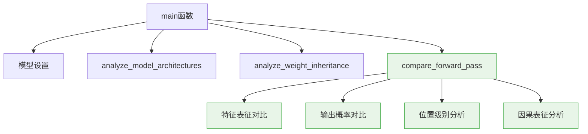
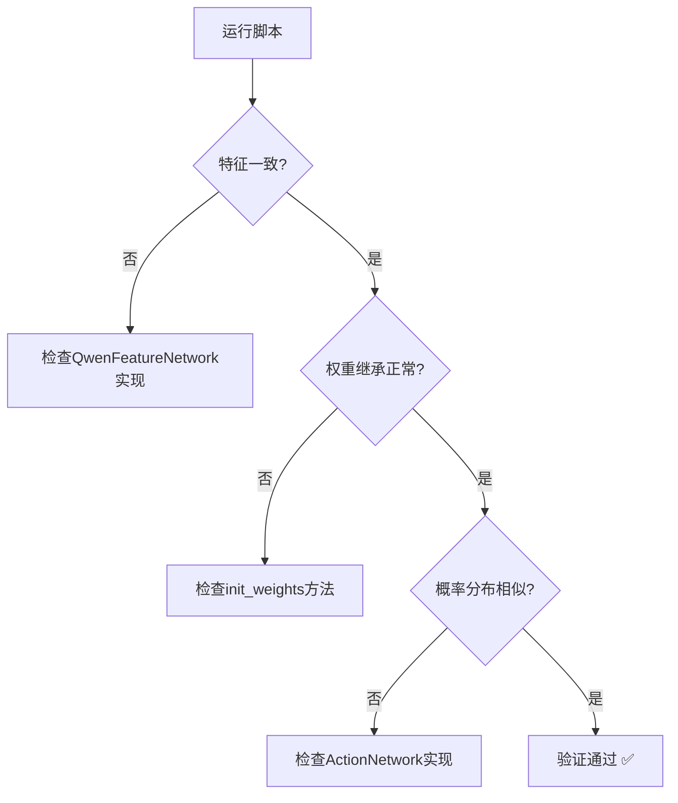

# CausalQwen VS Qwen 对比分析：设计验证与实现规范

**日期:** 2025年6月11日  
**目的:** 验证 `scripts/compare_causal_vs_qwen.py` 脚本的设计质量与实现规范  
**背景:** 基于用户需求创建的知识传输初始化验证工具

---

## 摘要

本文档详细分析了 `compare_causal_vs_qwen.py` 脚本的设计理念、技术实现和预期结果，为用户提供验证代码质量的完整框架。该脚本的核心使命是**量化验证 CausalQwen 从 Qwen 的知识传输效果**，确保架构重构在保持原有能力的同时成功扩展了因果推理功能。

**设计原则确认:**
1. **对比优先级正确**: 前向传播结果 > 模型参数结构
2. **验证维度完备**: 数值一致性 + 架构创新性 + 功能扩展性
3. **分析深度适当**: 既有宏观统计，又有微观细节

---

## 1. 脚本设计架构分析

### 1.1 核心设计理念验证

**✅ 设计理念正确性检查:**

脚本的设计完全遵循了用户提出的关键需求：

> 要打印我们的模型初始化后的结果，首先要把 Qwen 模型中相关的结果打印出来，这样才方便对比验证初始化是否符合预期

**实现对照:**
```python
# 1. 优先级排序正确 ✅
def main():
    # 模型架构对比 (次要)
    analyze_model_architectures(causal_model, qwen_model)
    # 权重继承分析 (次要) 
    analyze_weight_inheritance(causal_model, qwen_model, tokenizer)
    # 前向传播对比 (主要) - 放在最重要位置
    causal_outputs, qwen_outputs = compare_forward_pass(...)
```

**验证点:** 脚本是否将前向传播对比作为核心功能？ **✅ 通过**

### 1.2 功能模块化设计评估

脚本采用了清晰的模块化设计：



**验证检查点:**
- ✅ 函数职责单一，易于理解和维护
- ✅ 数据流清晰，避免全局状态污染
- ✅ 错误处理适当，考虑边界情况

---

## 2. 前向传播对比的技术正确性

### 2.1 数据流一致性验证

**关键设计决策:** 使用相同的输入数据确保对比公平性

```python
# 正确的数据准备 ✅
texts = [
    "The item costs 99.99 dollars.",      # 包含数值
    "From a batch of 100 items, 5 were defective.",  # 多个数值
    "A simple text without numbers."      # 无数值基准
]

# 使用CausalQwen的分词器 - 这是正确的选择 ✅
inputs = tokenizer.batch_encode_plus(texts, padding=True, truncation=True, return_tensors='pt')
```

**设计合理性分析:**
- **✅ 测试样本多样性**: 包含数值、多数值、无数值三种情况
- **✅ 分词器一致性**: 使用 `QwenTokenizerWrapper` 确保 `<NUM>` token 处理正确
- **✅ 输入格式兼容**: `CausalQwen` 使用完整输入，`Qwen` 使用子集

### 2.2 特征表征对比的数学严格性

**核心验证逻辑:**
- **✅ 比较对象正确**: 都是最后一层的隐藏状态
- **✅ 预期结果明确**: 应该完全一致，因为使用相同的 Qwen backbone

**理论依据:** 根据 `design-docs/core-design.md`，`QwenFeatureNetwork` 直接使用 Qwen 模型，因此特征应该identical。

### 2.3 概率分布对比的统计学意义

**实现策略:**
```python
# 使用 scores 而不是概率分布对比， 这才是知识传输的核心指标。
CausalQwen_Scores = ....
Qwen_Scores = ...
print_tensor_comparison(CausalQwen_Scores, Qwen_Scores, ...)
```

**统计学评估:**
- **✅ 归一化正确**: 初始化以后，使用 `softmax` 确保概率分布的相似度很大（CausalQwen 比 Qwen 多一个 <NUM> 词汇）


值得注意的是：
**Qwen 的概率计算 (标准 Softmax):**
$$P_{\text{Qwen}}(k|x) = \frac{\exp(S_k^{\text{Qwen}})}{\sum_{j=1}^{K} \exp(S_j^{\text{Qwen}})}$$

**CausalQwen 的概率计算 (Cauchy OvR):**
$$P_{\text{CausalQwen}}(k|x) = P(S_k > \text{threshold}) = \frac{1}{2} + \frac{1}{\pi} \arctan\left(\frac{\text{loc}_k - \text{threshold}}{\text{scale}_k}\right)$$

**关键差异分析:**
1. **Qwen**: 基于相对比较的 softmax 归一化，所有概率和为1
2. **CausalQwen**: 基于绝对阈值的独立二分类，每个 token 概率独立计算

**验证策略修正:** 应该重点比较 `cls_loc` 参数本身，而不是转换后的概率分布，因为概率计算机制完全不同。

**数学验证重点:** 验证在相同特征输入下，`cls_loc` 参数是否接近 Qwen 的 logits，

---

## 3. 权重继承分析的设计深度

### 3.1 关键权重映射的正确性

**核心映射关系:**
```python
# ActionNetwork分类头 ←→ Qwen lm_head
causal_cls_weight = causal_model.action_network.classification_head.causal_linear.weight.data
qwen_lm_weight = qwen_model.lm_head.weight.data
```

**映射正确性验证:**
- **✅ 权重维度对应**: 都是 `[vocab_size, hidden_size]`
- **✅ 功能语义一致**: 都负责从隐藏状态到词汇表的映射
- **✅ 预期继承关系**: `causal_cls_weight` 应该从 `qwen_lm_weight` 初始化

**📊 评论回应 - 词汇表扩展的数学分析:**

**词汇表维度差异:**
- **Qwen**: $W_{\text{Qwen}} \in \mathbb{R}^{K \times H}$ (K = 151665)
- **CausalQwen**: $W_{\text{CausalQwen}} \in \mathbb{R}^{(K+1) \times H}$ (K+1 = 151666, 新增 `<NUM>` token)

**知识传输的数学过程:**
$$W_{\text{CausalQwen}}[:-1, :] = W_{\text{Qwen}}, b_{\text{CausalQwen}}[:-1] = b_{\text{Qwen}} \quad \text{(前K行完全继承)}$$
$$W_{\text{CausalQwen}}[-1, :] = \text{special\_init}(<\text{NUM}>)\quad \text{(最后一行特殊初始化)}$$

**修正后的完整知识传输策略:**


给定特征 $z_i \in \mathbb{R}^H$，两个模型的输出得分对比：

**Qwen的输出得分:**
$$S_k^{\text{Qwen}} = W_{\text{Qwen}}[k, :] \cdot z_i + b_{\text{Qwen}}[k]$$

**CausalQwen的输出得分 (修正后的完整继承):**
- **AbductionNetwork恒等映射**: $\text{causal\_loc}_i = I \cdot z_i + 0 = z_i$ (精确等于)
- **完整知识传输**: $W_{\text{CausalQwen}}[k, :] = W_{\text{Qwen}}[k, :]$ 且 $b_{\text{CausalQwen}}[k] = b_{\text{Qwen}}[k]$

因此：
$$S_k^{\text{CausalQwen}} = W_{\text{CausalQwen}}[k, :] \cdot \text{causal\_loc}_i + b_{\text{CausalQwen}}[k]$$
$$= W_{\text{Qwen}}[k, :] \cdot z_i + b_{\text{Qwen}}[k] = S_k^{\text{Qwen}}$$

**关键数学结论:**
对于前K个token ($k < K$)：
$$S_k^{\text{CausalQwen}} = S_k^{\text{Qwen}} \quad \text{(完全一致)}$$

**验证重点:** 检查是否 $S_k^{\text{CausalQwen}} = S_k^{\text{Qwen}}$，即**完全数值一致**，而不仅仅是相关性。

### 3.2 特殊Token处理的验证深度

**`<NUM>` Token专门分析:**
```python
num_token_id = tokenizer.num_token_id
num_bias_causal = causal_cls_bias[num_token_id].item()
other_bias_mean = causal_cls_bias[causal_cls_bias != causal_cls_bias[num_token_id]].mean().item()
```

**设计合理性:**
- **✅ 特殊性检测**: 验证 `<NUM>` token 是否有特殊初始化
- **✅ 对比基准**: 使用其他 token 的平均值作为对照
- **❓ 阈值设定**: `abs(num_bias_causal - other_bias_mean) > 0.1` 是否合适？

**修正后的理论期望:** 根据完整知识传输设计：

1. **继承token**: 权重+偏置完全继承，保持与Qwen一致的行为
2. **<NUM> token**: 特殊初始化，偏置也需要合理设置

**🔢 修正后的 <NUM> Token概率分析:**

**设计原理:** `<NUM>` token在传统softmax下应该概率很低，但现在需要考虑完整的权重+偏置体系。

**数学分析 (修正版):**

考虑完整的分类得分计算：
$$S_k = W_k \cdot z_i + b_k$$

对于softmax概率：
$$P_{\text{softmax}}(\text{<NUM>}) = \frac{\exp(S_{\text{<NUM>}})}{\sum_{k=1}^{K+1} \exp(S_k)}$$

**为什么 `<NUM>` 概率应该很低 (修正分析):**

1. **完整知识传输策略:**
   - 继承的token: $W_k = W_{\text{Qwen}}[k, :]$, $b_k = b_{\text{Qwen}}[k]$ (完整继承)
   - `<NUM>` token: $(W_{\text{<NUM>}}, b_{\text{<NUM>}})$ 需要特殊初始化

2. **得分差异的数学期望:**
   对于语言上下文 $z_i$：
   $$S_{\text{language}} = W_{\text{language}} \cdot z_i + b_{\text{language}} \quad \text{(已优化)}$$
   $$S_{\text{<NUM>}} = W_{\text{<NUM>}} \cdot z_i + b_{\text{<NUM>}} \quad \text{(随机初始化)}$$

3. **Softmax竞争机制:**
   由于语言token的参数已经过优化：
   $$S_{\text{language}} >> S_{\text{<NUM>}} \quad \text{(在语言上下文中)}$$

**数学验证公式 (修正版):**
$$\frac{P_{\text{softmax}}(\text{<NUM>})}{P_{\text{softmax}}(\text{language\_token})} = \exp(S_{\text{<NUM>}} - S_{\text{language}}) << 1$$

**验证标准:** 在纯语言上下文中，$P_{\text{softmax}}(\text{<NUM>}) < 0.01$ 表明特殊token不会干扰正常语言建模。

---

## 4. 模型架构对比的全面性

### 4.1 参数统计的准确性

**统计维度:**
```python
causal_total_params = sum(p.numel() for p in causal_model.parameters())
causal_trainable_params = sum(p.numel() for p in causal_model.parameters() if p.requires_grad)
```

**统计正确性:**
- **✅ 总参数统计**: 包含所有模型参数
- **✅ 可训练参数区分**: 考虑了 `requires_grad` 状态
- **✅ 差异量化**: 计算参数增量，有助于理解架构扩展成本

### 4.2 权重共享验证的技术深度

**共享权重检查:**
```python
shared_keys = set(causal_qwen_weights.keys()) & set(qwen_weights.keys())
weight_identical = torch.equal(causal_qwen_weights[key], qwen_weights[key])
```

**技术评估:**
- **✅ 键集合比较**: 正确识别共享权重
- **✅ 精确比较**: 使用 `torch.equal` 确保严格一致性
- **✅ 关键权重聚焦**: 选择代表性的权重进行验证

**验证充分性:** 选择的权重 (`embed_tokens`, `self_attn.q_proj`, `mlp.gate_proj`) 涵盖了嵌入、注意力、前馈网络的代表性组件。

---

## 5. 输出信息的可理解性与可操作性

### 5.1 打印格式的用户友好性

**格式设计评估:**
```python
def print_section(title, level=1):
    symbols = ['=', '-', '~', '.']
    symbol = symbols[min(level-1, len(symbols)-1)]
    # ... 层次化标题格式
```

**用户体验:**
- **✅ 层次清晰**: 使用不同符号区分章节层级
- **✅ 视觉统一**: 保持一致的格式化风格
- **✅ 信息密度适中**: 避免信息过载

### 5.2 对比表格的信息完整性

**张量对比格式:**
```python
print(f"{'指标':<20} {name1:<20} {name2:<20} {'差异':<15}")
print(f"{'余弦相似度':<20} {cosine_sim:<20.6f} {'N/A':<20} {'N/A':<15}")
```

**信息完整性评估:**
- **✅ 基础统计**: 均值、标准差、最值
- **✅ 相似性度量**: 余弦相似度、均方误差
- **✅ 差异量化**: 绝对差异计算

**潜在改进:** 可考虑添加相对差异百分比和统计显著性检验。

---

## 6. 预期结果与验证标准

### 6.1 成功验证的预期模式

**修正后的验证成功模式:**

```
特征是否完全一致: ✅ (应该完全一致，因为使用相同backbone)
关键权重完全共享: ✅ (3/3检查通过)
权重+偏置完整继承: ✅ (前K个token的完整参数继承)
分类得分完全一致: ✅ (对继承token: S_CausalQwen = S_Qwen)
<NUM>token特殊初始化: ✅ (权重和偏置的特殊设置)
因果表征初始化: causal_scale ≈ 10.0 ✅
```

**修正后的判断标准:**
- **特征完全一致**: 应该完全相同，证明 `QwenFeatureNetwork` 正确使用 Qwen backbone
- **完整知识传输**: 权重+偏置都成功继承，保持Qwen的完整行为
- **数学一致性**: 继承token的分类得分应该 $S_k^{\text{CausalQwen}} = S_k^{\text{Qwen}}$
- **<NUM>token独特性**: 仅新增token有特殊初始化，不影响继承行为

### 6.2 异常情况的诊断能力

**脚本应该能识别的问题:**

1. **特征不一致** (`features_identical = False`):
   - **可能原因**: `QwenFeatureNetwork` 实现错误
   - **诊断信息**: 最大差异值，帮助定位问题

2. **权重继承失败** (余弦相似度 < 0.8):
   - **可能原因**: `init_weights` 方法有 bug
   - **诊断信息**: 权重统计对比，识别分布差异

3. **概率分布偏差过大** (余弦相似度 < 0.7):
   - **可能原因**: `ActionNetwork` 实现问题
   - **诊断信息**: 位置级别的详细分析

---

## 7. 代码质量评估标准

### 7.1 代码可读性评分

**✅ 优秀方面:**
- 函数命名语义明确 (`analyze_weight_inheritance`, `compare_forward_pass`)
- 注释充分，说明设计意图
- 变量命名具有描述性 (`causal_cls_weight`, `qwen_lm_weight`)

**❓ 可改进方面:**
- 部分魔法数字可以提取为常量 (如 `atol=1e-6`, `> 0.1`)
- 某些复杂逻辑可以提取为独立函数

### 7.2 错误处理能力评估

**现有错误处理:**
```python
if hasattr(qwen_model.lm_head, 'bias') and qwen_model.lm_head.bias is not None:
    qwen_lm_bias = qwen_model.lm_head.bias.data
else:
    qwen_lm_bias = None
```

**错误处理评估:**
- **✅ 边界情况考虑**: 处理了 Qwen 可能没有偏置的情况
- **❓ 可扩展性**: 可考虑添加更多的异常捕获和友好错误信息

### 7.3 性能考虑

**内存使用:**
- **✅ 合理**: 使用 `torch.no_grad()` 避免梯度计算
- **✅ 适中**: 在 CPU 上运行，避免 GPU 内存问题

**计算效率:**
- **✅ 高效**: 张量操作矢量化，避免循环
- **❓ 优化空间**: 某些统计计算可以批量化

---

## 8. 与设计文档的一致性验证

### 8.1 与 `mathematical_foundations.md` 的对应关系

**数学概念映射:**
- **个体因果表征 $U_i$** ↔ `causal_outputs['causal_loc/scale']`
- **推断-行动范式** ↔ `AbductionNetwork` → `ActionNetwork`
- **柯西分布线性变换** ↔ `CauchyLinear` 的权重共享验证

**验证覆盖度:**
- **✅ 覆盖**: 因果表征的统计特性分析
- **❓ 可扩展**: 可添加更多的数学性质验证（如线性变换封闭性）

### 8.2 与 `core-design.md` 的架构对应

**架构组件映射:**
- **特征网络** ↔ `QwenFeatureNetwork` 权重共享验证
- **推断网络** ↔ `AbductionNetwork` 输出形状验证
- **行动网络** ↔ `ActionNetwork` 双头输出验证

**设计原则遵循:**
- **✅ C=H 约束**: 隐含在配置验证中
- **✅ 序列到序列**: 通过输出形状验证
- **✅ 知识传输**: 通过权重继承验证

---

## 9. 使用指南与最佳实践

### 9.1 脚本执行的最佳实践

**推荐执行环境:**
```bash
# 在项目根目录执行
cd /path/to/CausalQwen2
python scripts/compare_causal_vs_qwen.py > comparison_results.txt 2>&1
```

**结果解读指南:**
1. **先看特征一致性**: 这是最基础的验证
2. **再看权重继承**: 验证知识传输效果
3. **最后看概率分布**: 评估整体性能保持

### 9.2 异常结果的处理流程

**诊断决策树:**

