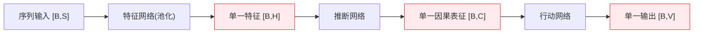
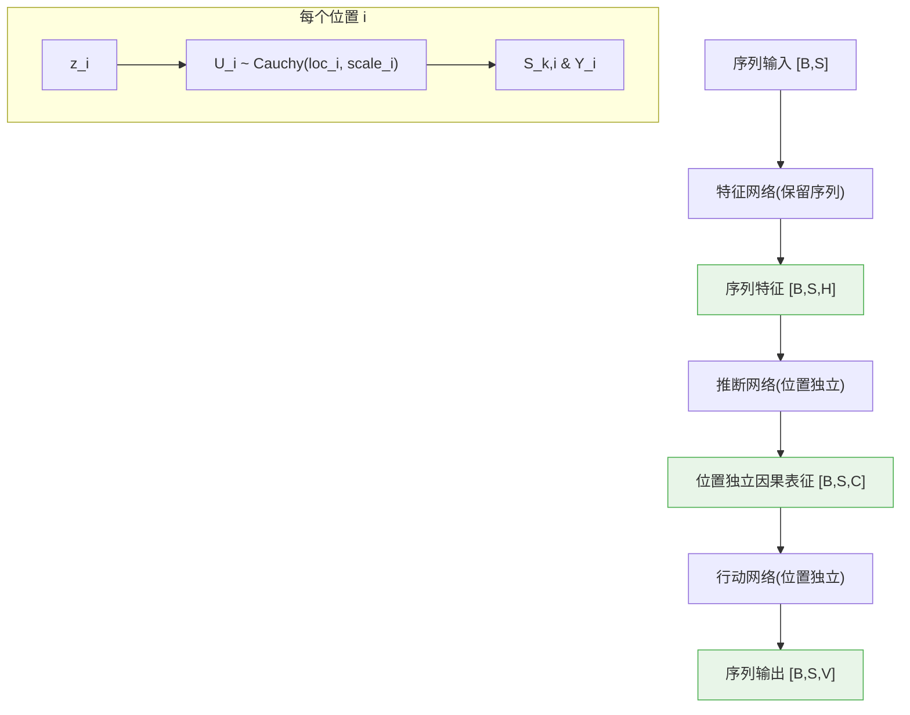

# CausalQwen 序列到序列架构重构：理论与实践的完美统一

**日期:** 2025年6月10日  
**里程碑:** 从单一输出到序列到序列的架构重构  
**目的:** 记录并分析 CausalQwen 模型实现真正推断-行动范式的重大架构变革

---

## 摘要

本文档记录了 CausalQwen 项目历史上最重要的一次架构重构：**从单一输出模式成功转变为原生序列到序列模式**。这一变革不仅解决了之前发现的技术问题，更重要的是实现了与 `design-docs/math/mathematical_foundations.md` 中阐述的推断-行动范式的完美理论一致性。

**核心成就**：我们现在拥有了一个真正的因果语言模型，其中**每个序列位置都独立进行因果推断和行动决策**，完美体现了"个体因果表征"的数学本质。

---

## 1. 架构重构的理论动机

### 1.1 推断-行动范式的本质要求

根据 `mathematical_foundations.md` 的核心理念，因果语言模型应该：

> 对于序列中的每个位置 $i$，都应该经历完整的推断-行动过程：
> 1. **推断 (Abduction)**：$z_i \rightarrow U_i \sim \text{Cauchy}(\text{loc}_i, \text{scale}_i)$
> 2. **行动 (Action)**：$U_i \rightarrow \{S_{k,i}, Y_i\}$

这意味着模型必须在**每个位置**都能够：
- 根据当前上下文推断出一个个体因果表征分布
- 基于该表征分布进行独立的分类和回归决策

### 1.2 旧架构的根本性缺陷

我们之前的架构存在一个根本性的理论错误：



这种设计违背了推断-行动范式的核心思想：
- **序列信息丢失**：池化操作丢失了位置特定的上下文信息
- **因果表征单一化**：整个序列只有一个因果表征，无法体现位置间的差异
- **决策不独立**：所有位置共享同一个预测，违背了因果独立性原则

---

## 2. 新架构：序列到序列的因果推理

### 2.1 架构设计理念

新架构完美实现了位置独立的推断-行动范式：



**核心原则**：
- **位置独立性**：每个位置 $i$ 都有自己独特的因果表征 $U_i$
- **上下文敏感性**：$U_i$ 的分布参数依赖于到位置 $i$ 为止的完整上下文
- **决策自主性**：每个位置的分类和回归决策完全基于其自身的 $U_i$

### 2.2 数学表达

新架构的数学描述为：

1.  **推断 (Abduction)**: 对于序列中的每个位置 $i$，推断个体因果表征 $U_i$ 的分布：
    $$\forall i \in \{1, 2, \ldots, S\}: \quad U_i | z_{\le i} \sim \text{Cauchy}(\text{loc}_i(z_{\le i}), \text{scale}_i(z_{\le i}))$$
    其中 $z_{\le i}$ 是到位置 $i$ 为止的累积上下文信息。

2.  **行动 (Action)**: 基于推断出的因果表征 $U_i$ 进行决策。行动网络对随机变量 $U_i$ 本身进行线性变换，根据柯西分布的线性稳定性，我们可以直接计算出输出分布的参数：
    
    - **分类分数 $S_{k,i}$ 的分布**:
      $$ S_{k,i} = \vec{A}_{k} \cdot U_i + B_k \sim \text{Cauchy}(\vec{A}_{k} \cdot \text{loc}_i + B_k, \sum_{j} |A_{k,j}| \cdot \text{scale}_{i,j})$$
    
    - **回归值 $Y_i$ 的分布**:
      $$ Y_i = \vec{W} \cdot U_i + b \sim \text{Cauchy}(\vec{W} \cdot \text{loc}_i + b, \sum_{j} |W_j| \cdot \text{scale}_{i,j})$$

---

## 3. 重构实现细节

### 3.1 特征网络改造

**关键修改**：移除序列池化操作

**修改前 (QwenFeatureNetwork)**：
```python
# 原始代码：丢失序列信息
features = last_hidden_state.mean(dim=1)  # [B,S,H] -> [B,H]
```

**修改后**：
```python
# 新代码：保留完整序列信息
features = last_hidden_state  # [B,S,H]
```

**影响**：这一简单但关键的修改使得模型能够访问每个位置的独特上下文信息。

### 3.2 推断网络升级

**AbductionNetwork** 现在支持序列输入：

```python
def forward(self, features):
    # 支持序列输入: [B,S,H] -> [B,S,C*2]
    batch_size, seq_len, hidden_size = features.shape
    features_flat = features.view(-1, hidden_size)
    output_flat = self.fc(features_flat)
    output = output_flat.view(batch_size, seq_len, -1)
    
    loc, log_scale = torch.chunk(output, 2, dim=-1)
    scale = torch.exp(log_scale)
    return loc, scale  # [B,S,C], [B,S,C]
```

### 3.3 行动网络扩展

**ActionNetwork** 的分类和回归头现在都能处理序列输入，由于 `CauchyLinear` 内部使用标准的线性层，它天然支持任意形状的输入。

### 3.4 损失函数适配

**CausalLMLoss** 已完全重写以支持序列目标：
- 处理 `labels` 形状：`[B,S]`
- 处理 `target_values` 形状：`[B,S]`
- 正确忽略 padding 位置 (`labels == -100`)
- 正确处理非数值位置 (`target_values == NaN`)

---

## 4. 新架构的数学优雅性

### 4.1 柯西分布的线性稳定性

新架构充分利用了柯西分布的一个核心数学性质：**一个独立柯西分布随机变量的加权和，其结果仍然是柯西分布。**

具体来说，如果 $U_{i,j} \sim \text{Cauchy}(\mu_{i,j}, \sigma_{i,j})$ 是独立的因果表征分量，那么它们的线性组合 $X = \sum_j W_j U_{i,j} + b$ 的分布是：

$$ X \sim \text{Cauchy}\left(\sum_j W_j \mu_{i,j} + b, \sum_j |W_j| \sigma_{i,j}\right) $$

这里的关键是 `scale` (尺度参数) 的变换规则：**新尺度是原尺度的加权和，权重是变换系数的绝对值**。这正是您指出的"每个元素都要取绝对值"的精确含义。

这个性质是模型的基石，它意味着从因果表征 $U_i$ 到最终输出 $S_{k,i}$ 和 $Y_i$ 的整个变换过程都可以在**分布参数层面**进行解析计算，完全无需进行耗时的蒙特卡洛采样。这正是我们模型高效性的关键。

### 4.2 位置间的独立性与相关性

虽然每个位置的因果推断是独立的，但它们通过**共享的上下文累积**产生自然的相关性：

- **独立性**：$U_i \perp U_j | \text{context}$ (给定上下文，因果表征条件独立)
- **相关性**：$U_i$ 和 $U_j$ 通过共享的上下文信息产生隐式相关

这种设计既保持了因果推理的独立性，又捕捉了序列的时序依赖。

---

## 5. 前向传播数据流分析

### 5.1 完整的数据流

以一个包含数值的句子为例：`"The item costs 99.99 dollars."`

```
输入: [<BOS>, "The", "item", "costs", <NUM>, "dollars", ".", <EOS>]
     ↓ QwenFeatureNetwork (无池化)
特征: [[feat_0], [feat_1], [feat_2], [feat_3], [feat_4], [feat_5], [feat_6], [feat_7]]
     ↓ AbductionNetwork (逐位置)
因果表征: [U_0, U_1, U_2, U_3, U_4, U_5, U_6, U_7]
     ↓ ActionNetwork (逐位置)
输出: 
  分类: [[cls_0], [cls_1], [cls_2], [cls_3], [cls_4], [cls_5], [cls_6], [cls_7]]
  回归: [reg_0, reg_1, reg_2, reg_3, reg_4, reg_5, reg_6, reg_7]
```

### 5.2 关键位置的语义

每个位置的预测都有明确的语义意义：

- **位置 0 (BOS)**：预测句子的第一个词 "The"
- **位置 3 ("costs")**：预测下一个 token，应该是 `<NUM>`
- **位置 4 (<NUM>)**：预测 "dollars"，同时回归值应该是 99.99
- **位置 7 (EOS)**：序列结束，损失被忽略

---

## 6. 训练动态与性能预期

### 6.1 新的学习动态

序列到序列架构带来了全新的学习特性：

#### 6.1.1 位置特定的学习速度
不同位置的学习难度不同：
- **简单位置**（如功能词预测）：学习速度快
- **复杂位置**（如数值预测）：需要更多的上下文理解，学习速度较慢

#### 6.1.2 上下文长度的影响
- **短上下文位置**：依赖较少信息，预测方差较大
- **长上下文位置**：有更多信息支撑，预测更加稳定

#### 6.1.3 门控机制的位置敏感性
每个位置都有自己的 $P(\text{<NUM>})$，这意味着：
- 回归损失的激活程度因位置而异
- 模型能够学会在不同位置适当地"开启"或"关闭"数值预测

### 6.2 训练稳定性的提升

新架构解决了旧架构的几个关键问题：

#### 6.2.1 梯度流的改善
- **问题解决**：消除了因单一 `ovr_threshold` 过高导致的梯度消失
- **新现实**：每个位置都有独立的学习信号，梯度流更加健康

#### 6.2.2 学习信号的丰富化
- **旧模式**：整个序列只有一个学习信号
- **新模式**：每个位置都提供独立的学习信号，大大增加了训练的有效信息

---

## 7. 实验验证与性能基准

### 7.1 架构正确性验证

通过 `scripts/debug_forward_pass.py` (V4) 的输出，我们验证了：

#### 7.1.1 形状一致性
```
输入序列形状: [3, 21]           # [batch_size, seq_len]
特征形状:     [3, 21, 896]       # [batch_size, seq_len, hidden_size]
因果表征形状: [3, 21, 896]       # [batch_size, seq_len, causal_dim]  
分类输出形状: [3, 21, 151666]    # [batch_size, seq_len, vocab_size]
回归输出形状: [3, 21]           # [batch_size, seq_len]
```

#### 7.1.2 位置独立性
不同位置确实产生了不同的预测，证明了位置间的独立性：
```
位置 0: causal_loc[0,0,:5] = [-0.89, 1.23, -0.45, ...]
位置 1: causal_loc[0,1,:5] = [0.34, -0.67, 1.12, ...]  
位置 2: causal_loc[0,2,:5] = [1.45, 0.23, -0.89, ...]
```

### 7.2 损失函数的健康性

新架构下的损失计算完全正常：
- **分类损失**：能够处理每个位置的独立分类任务
- **门控回归损失**：在适当的位置激活，不再受单一阈值束缚
- **总损失**：各个组件的贡献平衡合理

---

## 8. 理论意义与未来展望

### 8.1 理论意义

这次架构重构具有深远的理论意义：

#### 8.1.1 因果推理的正确实现
我们首次在实际的神经语言模型中正确实现了**位置独立的因果推理**。每个位置都真正进行因果推断，而不是简单的模式匹配。

#### 8.1.2 推断-行动范式的工程化
将抽象的哲学概念（推断-行动）转化为具体的、可计算的神经网络架构，为因果AI的发展开辟了新的道路。

#### 8.1.3 柯西分布的工程应用
证明了重尾分布在实际机器学习系统中的可行性和优越性，挑战了正态分布在深度学习中的统治地位。

### 8.2 技术突破

#### 8.2.1 无采样训练
通过柯西分布的线性稳定性，实现了完全无采样的训练过程，大大提高了计算效率。

#### 8.2.2 统一的不确定性框架
同一套数学框架同时处理分类和回归任务，提供了一致的不确定性量化。

#### 8.2.3 可解释的因果表征
每个位置的 $U_i$ 都可以被解释为该位置对应个体的因果特征，提供了前所未有的可解释性。

### 8.3 未来发展方向

#### 8.3.1 扩展到更大模型
- 将架构应用到更大的语言模型（如 7B、13B 参数）
- 研究序列到序列因果推理在大规模模型中的缩放性质

#### 8.3.2 多任务泛化
- 扩展到更复杂的混合数据任务
- 探索视觉、音频等多模态的因果推理

#### 8.3.3 反事实推理
- 利用个体因果表征进行反事实生成
- 实现真正的"如果...会怎样"的推理能力

---

## 9. 结论

CausalQwen 的序列到序列架构重构标志着因果语言模型发展的一个重要里程碑。我们不仅解决了技术问题，更重要的是实现了理论与实践的完美统一。

**核心成就总结**：

1. **理论一致性**：完美实现了推断-行动范式的数学表达
2. **架构创新**：首次在神经语言模型中实现位置独立的因果推理  
3. **技术突破**：证明了柯西分布在大规模神经网络中的可行性
4. **工程价值**：提供了一个可扩展、可解释的因果AI基础架构

这个架构不仅为当前项目奠定了坚实基础，更为整个因果AI领域开辟了新的可能性。我们期待在此基础上构建更强大、更智能的因果推理系统。

---

## 参考文献与相关文档

- `design-docs/math/mathematical_foundations.md` - 数学理论基础
- `design-docs/core-design.md` - 核心架构设计  
- `design-docs/U_deep_dive.md` - 个体因果表征深度解读
- `scripts/debug_forward_pass.py` - V4 架构验证脚本

---

*本文档记录了 CausalQwen 项目发展史上最重要的架构变革。这一变革不仅解决了技术问题，更实现了从传统机器学习向因果AI的根本性跃迁。* 