# CausalEngine 五模式系统设计

> **文档目标**: 定义纯回归和分类任务的五种建模模式，作为建模层面的统一参数  
> **适用范围**: MLPCausalRegressor, MLPCausalClassifier（不涉及LLM+CausalEngine）  
> **核心设计**: mode 参数同时控制训练、推理、损失计算的统一框架

---

## 1. 五模式系统概述

### 1.1 设计哲学

CausalEngine 的五模式系统基于对随机性来源的不同建模假设：

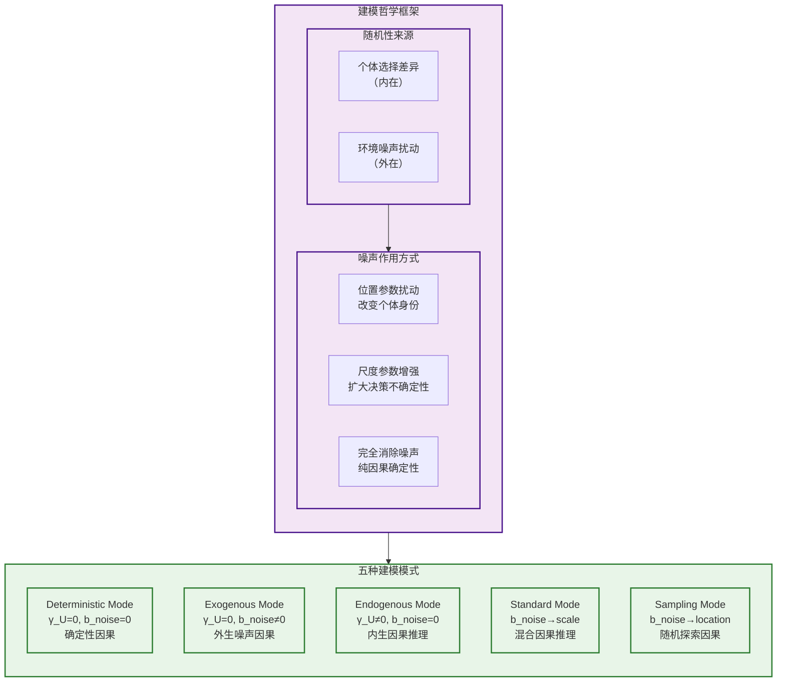

### 1.2 五模式数学定义

| 模式 | 参数设置 | 数学表述 | 损失计算 | 哲学含义 |
|------|----------|----------|----------|----------|
| **Deterministic** | $\gamma_U=0, b_{noise}=0$ | $U' = \mu_U$ (确定性) | MSE/CrossEntropy (等价性验证) | 数学计算上等价于传统MLP |
| **Exogenous** | $\gamma_U=0, b_{noise} \neq 0$ | $U' \sim \text{Cauchy}(\mu_U, \|b_{noise}\|)$ | Cauchy NLL / OvR概率 | 外生噪声驱动的因果推理 |
| **Endogenous** | $\gamma_U \neq 0, b_{noise}=0$ | $U' \sim \text{Cauchy}(\mu_U, \gamma_U)$ | Cauchy NLL / OvR概率 | 内生个体不确定性驱动的因果推理 |
| **Standard** | $\gamma_U \neq 0, b_{noise} \neq 0$ (作用于尺度) | $U' \sim \text{Cauchy}(\mu_U, \gamma_U + \|b_{noise}\|)$ | Cauchy NLL / OvR概率 | 内生+外生混合，噪声增强决策不确定性 |
| **Sampling** | $\gamma_U \neq 0, b_{noise} \neq 0$ (作用于位置) | $U' \sim \text{Cauchy}(\mu_U + b_{noise}\varepsilon, \gamma_U)$ | Cauchy NLL / OvR概率 | 随机性扰动个体身份，探索性因果推理 |


五种模式的核心区别在于如何计算 $U'$ 的分布。基于柯西分布的线性稳定性，我们可以解析地推导出每种模式下 $U'$ 的分布：

**基础设定**：
- 个体表征：$U \sim \text{Cauchy}(\mu_U, \gamma_U)$
- 外生噪声：$\varepsilon \sim \text{Cauchy}(0, 1)$
- 统一公式：$U' = U + b_{noise} \varepsilon$

**各模式的分布推导**：

1. **Deterministic Mode** ($\gamma_U=0, b_{noise}=0$)：
   $$U' = U + 0 \cdot \varepsilon = \mu_U \quad \text{(确定性)}$$

2. **Exogenous Mode** ($\gamma_U=0, b_{noise} \neq 0$)：
   $$U' = \mu_U + b_{noise} \varepsilon \sim \text{Cauchy}(\mu_U, |b_{noise}|)$$
   
3. **Endogenous Mode** ($\gamma_U \neq 0, b_{noise}=0$)：
   $$U' = U + 0 \cdot \varepsilon = U \sim \text{Cauchy}(\mu_U, \gamma_U)$$

4. **Standard Mode** ($\gamma_U \neq 0, b_{noise} \neq 0$，噪声作用于尺度)：
   
   虽然统一公式是 $U' = U + b_{noise} \varepsilon$，但在实现中噪声被融合到尺度参数：
   $$U' \sim \text{Cauchy}(\mu_U, \gamma_U + |b_{noise}|)$$
   
   这利用了柯西分布的加法稳定性：如果 $X \sim \text{Cauchy}(\mu, \gamma)$ 且 $Y \sim \text{Cauchy}(0, |b|)$，则 $X + Y \sim \text{Cauchy}(\mu, \gamma + |b|)$。

5. **Sampling Mode** ($\gamma_U \neq 0, b_{noise} \neq 0$，噪声作用于位置)：
   
   首先采样噪声 $\varepsilon$，然后计算：
   $$U' \sim \text{Cauchy}(\mu_U + b_{noise}\varepsilon, \gamma_U)$$
   
   其中 $\varepsilon$ 是从标准柯西分布采样的具体值。

**关键洞察**：Standard 和 Sampling 模式使用相同的统一公式 $U' = U + b_{noise} \varepsilon$，但通过不同的实现方式达到不同的数学效果：
- **Standard**：解析地将噪声融合到尺度参数，避免采样
- **Sampling**：显式采样噪声，扰动位置参数

### 1.3 核心设计原则：为什么不对U采样？

**设计原则**: 对噪声采样是深度学习中广泛存在的实践，符合领域惯例。更多的采样方式，我们会后续进行探索。

**当前设计**: CausalEngine保持个体表征分布 $U \sim \text{Cauchy}(\mu_U, \gamma_U)$ 的完整信息，仅对外生噪声 $\epsilon$ 进行采样（在Sampling模式中），以平衡信息保存与计算效率。

---

## 2. 建模层面的mode参数设计

### 2.1 mode作为统一控制参数

**核心设计原则**：mode参数不仅仅是推理时的配置，而是贯穿整个建模过程的统一参数：

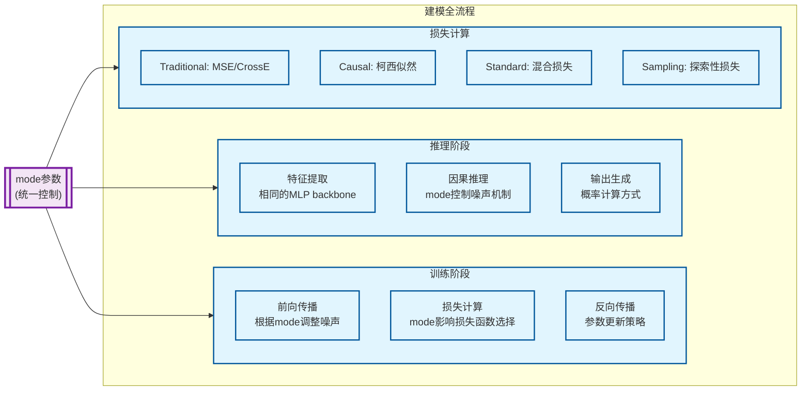

### 2.2 mode参数的API设计

```python
class MLPCausalRegressor:
    def __init__(self, mode='standard', **kwargs):
        """
        初始化时设定建模模式，影响整个建模流程
        
        Parameters:
        -----------
        mode : str, default='standard'
            建模模式选择：
            - 'deterministic': 确定性因果（等价于sklearn MLP）
            - 'exogenous': 外生噪声因果建模
            - 'endogenous': 内生因果建模
            - 'standard': 标准因果建模（默认）
            - 'sampling': 探索性因果建模
        """
        self.mode = mode
        self._setup_mode_configuration()
    
    def fit(self, X, y, mode=None):
        """
        训练模型，可覆盖初始化时的mode设置
        
        Parameters:
        -----------
        mode : str, optional
            临时覆盖建模模式（仅对当前训练有效）
        """
        effective_mode = mode or self.mode
        return self._fit_with_mode(X, y, effective_mode)
    
    def predict(self, X, mode=None, enable_flexibility=True):
        """
        预测，支持推理时的模式灵活切换
        
        Parameters:
        -----------
        mode : str, optional
            推理模式（可与训练模式不同）
        enable_flexibility : bool, default=True
            是否允许推理时切换模式
        """
        if enable_flexibility:
            inference_mode = mode or self.mode
        else:
            inference_mode = self.mode  # 强制使用训练时的模式
            
        return self._predict_with_mode(X, inference_mode)
```

---

## 3. 五模式详细设计

### 3.1 Deterministic Mode (确定性模式)

**设计目标**: 完全等价于sklearn MLP，提供基线比较

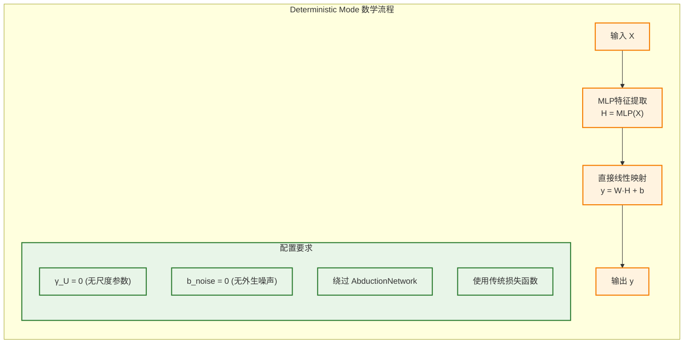

**数学表述**:
$$y = W \cdot \text{MLP}(X) + b$$

**实现关键点**:
- AbductionNetwork: 设置为恒等映射或完全绕过
- ActionNetwork: 简化为线性层
- ActivationHead: 恒等映射
- 损失函数: MSE (回归) / CrossEntropy (分类)

### 3.2 Exogenous Mode (外生模式)

**设计目标**: 确定性个体推断，外生噪声驱动随机性

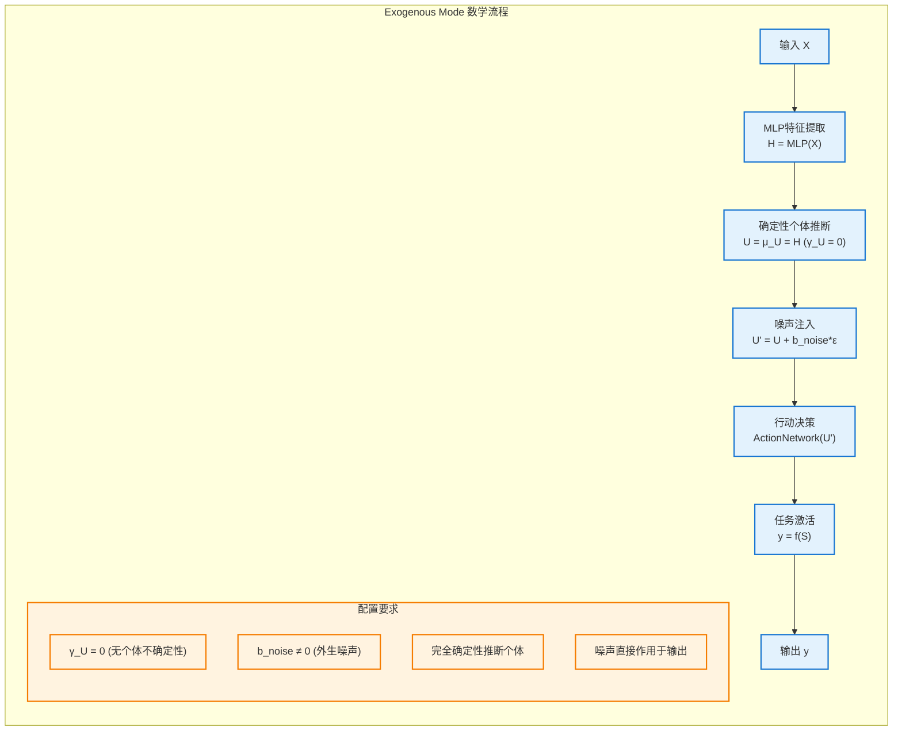

**数学表述**:
- **确定性推断**: $U = \mu_U = \text{MLP}(X), \gamma_U = 0$
- **噪声注入**: $U' = \mu_U + b_{noise} \varepsilon$，其中 $\varepsilon \sim \text{Cauchy}(0,1)$
- **行动网络**: ActionNetwork 接收 $U'$ 作为输入

**哲学含义**: 通过观察证据可以完全确定个体是谁（$\gamma_U = 0$），但环境中存在无法预测的外生随机因素

**关键特性**:
- 个体表征完全确定性
- 外生噪声独立于个体特征
- 适用于"能力确定但结果随机"的场景

### 3.3 Endogenous Mode (内生模式)

**设计目标**: 纯内生因果推理，无外生随机扰动

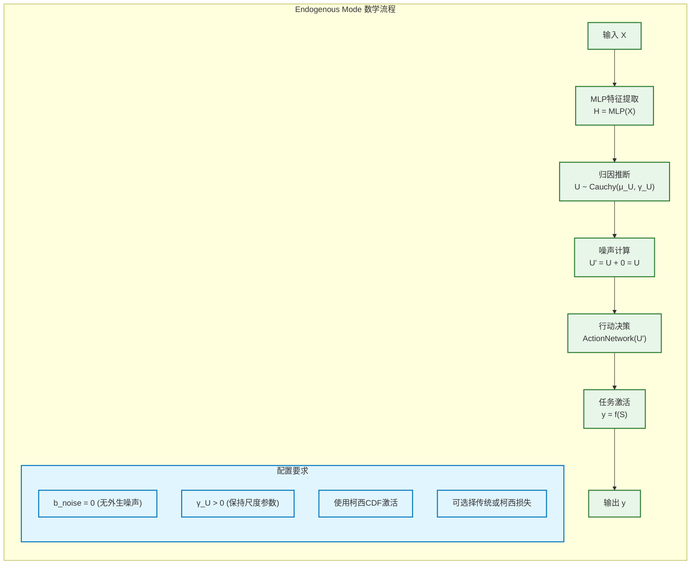

**数学表述**:
- **归因**: $U \sim \text{Cauchy}(\mu_U(H), \gamma_U(H))$
- **噪声计算**: $U' = U + 0 = U$（无外生噪声）
- **行动网络**: ActionNetwork 接收 $U'$ 作为输入
- **激活**: $P_k = \frac{1}{2} + \frac{1}{\pi}\arctan\left(\frac{\text{loc}_{S_k}}{\text{scale}_{S_k}}\right)$ (分类)

**关键特性**:
- 完全确定性的因果推理
- 保留柯西分布的解析性质
- 适用于高一致性需求场景

### 3.4 Standard Mode (标准模式)

**设计目标**: 噪声作用于尺度参数，扩大决策不确定性

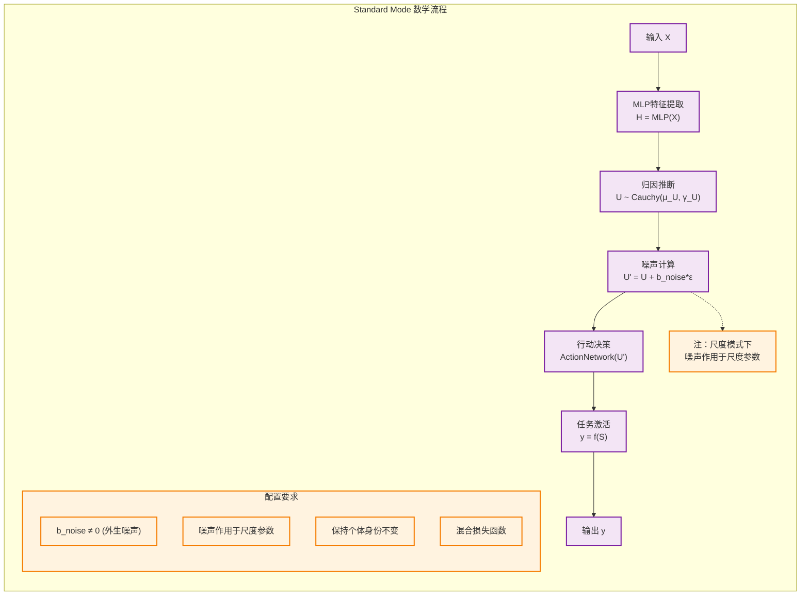

**数学表述**:
- **统一公式**: $U' = U + b_{noise} \varepsilon$，其中 $\varepsilon \sim \text{Cauchy}(0,1)$
- **尺度模式**: 噪声作用于尺度参数，扩大决策不确定性
- **行动网络**: ActionNetwork 接收 $U'$ 作为输入

**哲学含义**: 环境噪声使个体决策更加模糊，但核心身份（位置参数）保持不变

### 3.5 Sampling Mode (采样模式)

**设计目标**: 噪声作用于位置参数，扰动个体身份

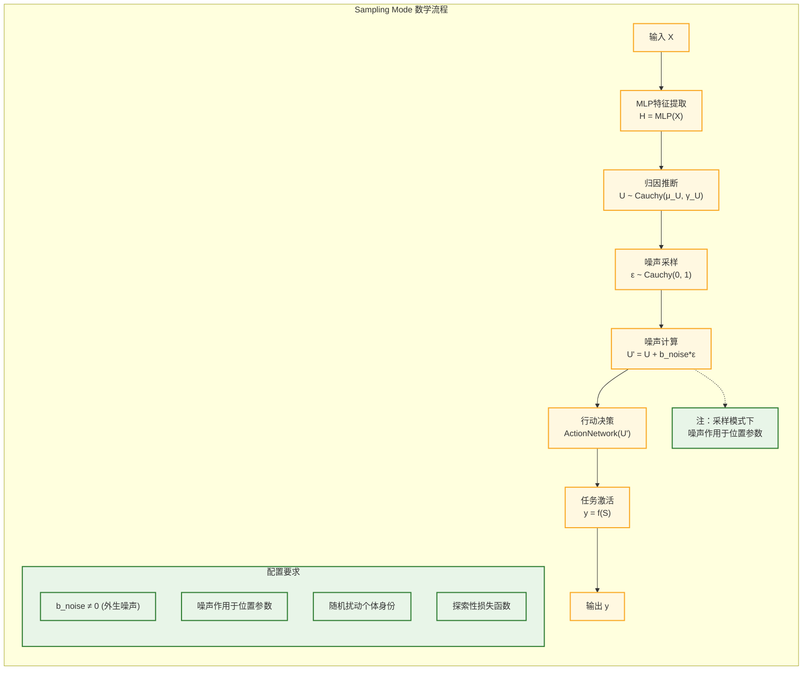

**数学表述**:
- **统一公式**: $U' = U + b_{noise} \varepsilon$，其中 $\varepsilon \sim \text{Cauchy}(0,1)$
- **采样模式**: 噪声作用于位置参数，扰动个体身份
- **行动网络**: ActionNetwork 接收 $U'$ 作为输入

**哲学含义**: 探索个体在随机扰动下的非典型行为，用于多样性生成

---

## 4. 损失函数设计

### 4.1 mode相关的损失函数策略

每种模式采用最适合其哲学含义的损失函数：

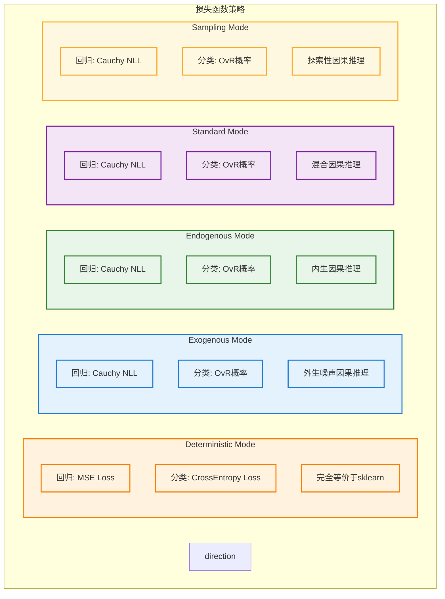

### 4.2 损失函数数学定义

#### Deterministic Mode损失 (等价性验证用)
```python
def deterministic_loss(predictions, targets, task_type):
    """与 sklearn 完全等价的损失函数"""
    if task_type == 'regression':
        return F.mse_loss(predictions, targets)
    elif task_type == 'classification':
        return F.cross_entropy(predictions, targets)
```

#### Exogenous/Endogenous/Standard/Sampling Mode统一损失
```python
def causal_loss(loc_S, scale_S, targets, task_type):
    """模式2-5的统一损失函数（完全相同）"""
    if task_type == 'regression':
        # Cauchy负对数似然
        return -cauchy_log_pdf(targets, loc_S, scale_S).mean()
    elif task_type == 'classification':
        # OvR Cauchy概率
        probs = cauchy_cdf(0, loc_S, scale_S)  # P(S > 0)
        return F.binary_cross_entropy(probs, targets_one_hot)
```

#### 重要说明：损失函数统一性

用户需要明确的是，**第2种模式到第5种模式，它的损失函数都是一模一样的**。它们的区别仅在于 $U'$ 的计算方式：

- **Exogenous Mode**: $U' = \mu_U + b_{noise} \varepsilon$
- **Endogenous Mode**: $U' = U + 0 = U \sim \text{Cauchy}(\mu_U, \gamma_U)$
- **Standard Mode**: $U' = U + b_{noise} \varepsilon$ (噪声作用于尺度)
- **Sampling Mode**: $U' = U + b_{noise} \varepsilon$ (噪声作用于位置)

但它们都使用相同的 Cauchy NLL / OvR 概率损失函数，然后行动网络的输入是 $U'$。

---

## 5. 推理与应用策略

### 5.1 五模式的应用场景

**核心设计原则**: 每种模式都有其特定的应用场景和理论意义

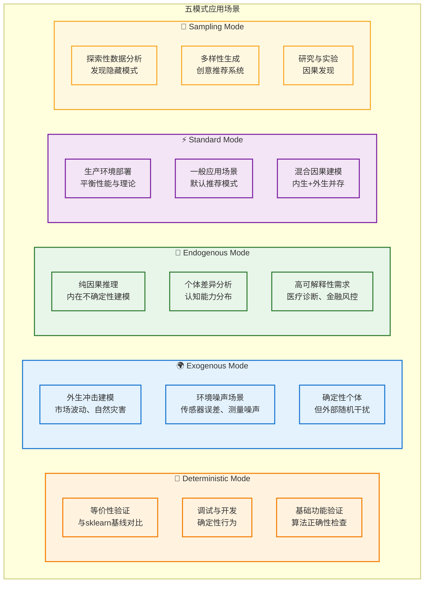

### 5.2 模式选择决策树

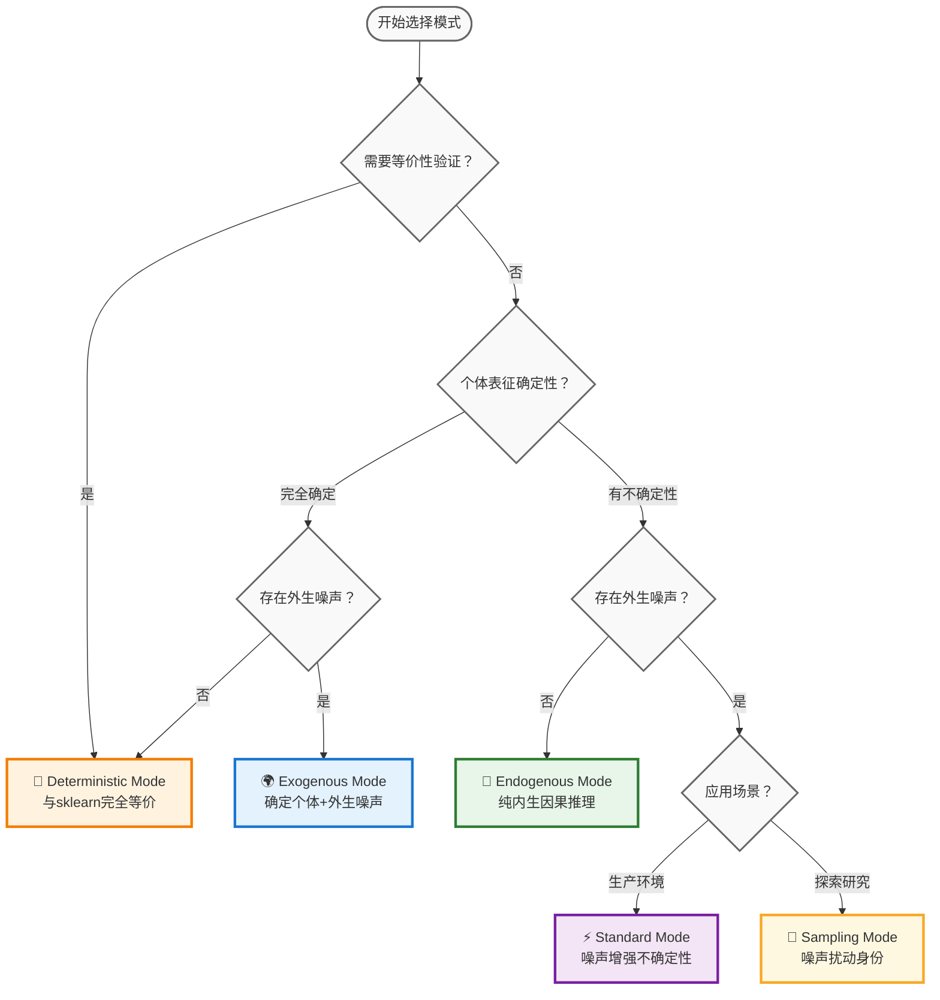

### 5.3 统一API设计

```python
class MLPCausalRegressor:
    def __init__(self, mode='standard', **kwargs):
        """
        五模式统一接口
        
        Parameters:
        -----------
        mode : str, default='standard'
            建模模式选择：
            - 'deterministic': γ_U=0, b_noise=0 (等价sklearn)
            - 'exogenous': γ_U=0, b_noise≠0 (外生噪声)
            - 'endogenous': γ_U≠0, b_noise=0 (内生因果)
            - 'standard': γ_U≠0, b_noise≠0 (噪声→尺度)
            - 'sampling': γ_U≠0, b_noise≠0 (噪声→位置)
        """
        self.mode = mode
        self._configure_mode_parameters()
    
    def _configure_mode_parameters(self):
        """根据模式配置参数"""
        if self.mode == 'deterministic':
            self.gamma_U_enabled = False
            self.b_noise_enabled = False
            self.loss_type = 'traditional'  # MSE/CrossEntropy
        elif self.mode == 'exogenous':
            self.gamma_U_enabled = False
            self.b_noise_enabled = True
            self.loss_type = 'causal'  # Cauchy NLL
        elif self.mode == 'endogenous':
            self.gamma_U_enabled = True
            self.b_noise_enabled = False
            self.loss_type = 'causal'  # Cauchy NLL
        elif self.mode in ['standard', 'sampling']:
            self.gamma_U_enabled = True
            self.b_noise_enabled = True
            self.loss_type = 'causal'  # Cauchy NLL
    
    def predict(self, X, return_uncertainty=False):
        """
        统一预测接口
        
        根据训练时的模式自动选择正确的U'计算方式
        """
        # 1. 特征提取（所有模式统一）
        H = self.mlp_backbone(X)
        
        # 2. 个体推断（根据模式调整）
        if self.gamma_U_enabled:
            U = self.abduction(H)  # U ~ Cauchy(μ_U, γ_U)
        else:
            U = H  # U = μ_U (确定性)
        
        # 3. 计算U'（核心差异）
        if self.mode == 'deterministic':
            U_prime = U  # U' = μ_U
        elif self.mode == 'exogenous':
            epsilon = self._sample_cauchy_noise()
            U_prime = U + self.b_noise * epsilon  # U' ~ Cauchy(μ_U, |b_noise|)
        elif self.mode == 'endogenous':
            U_prime = U  # U' = U ~ Cauchy(μ_U, γ_U)
        elif self.mode == 'standard':
            # 解析地融合噪声到尺度参数
            U_prime = U  # 但尺度参数会在ActionNetwork中调整
        elif self.mode == 'sampling':
            epsilon = self._sample_cauchy_noise()
            U_prime = U + self.b_noise * epsilon  # 位置扰动
        
        # 4. 行动决策（ActionNetwork接收U'）
        predictions = self.action_network(U_prime)
        
        if return_uncertainty:
            return predictions, self._estimate_uncertainty(U_prime)
        return predictions
```

---

## 6. 实验验证与基准测试

### 6.1 系统性基准测试设计

**验证目标**: 证明五模式系统的数学正确性、应用有效性和计算效率

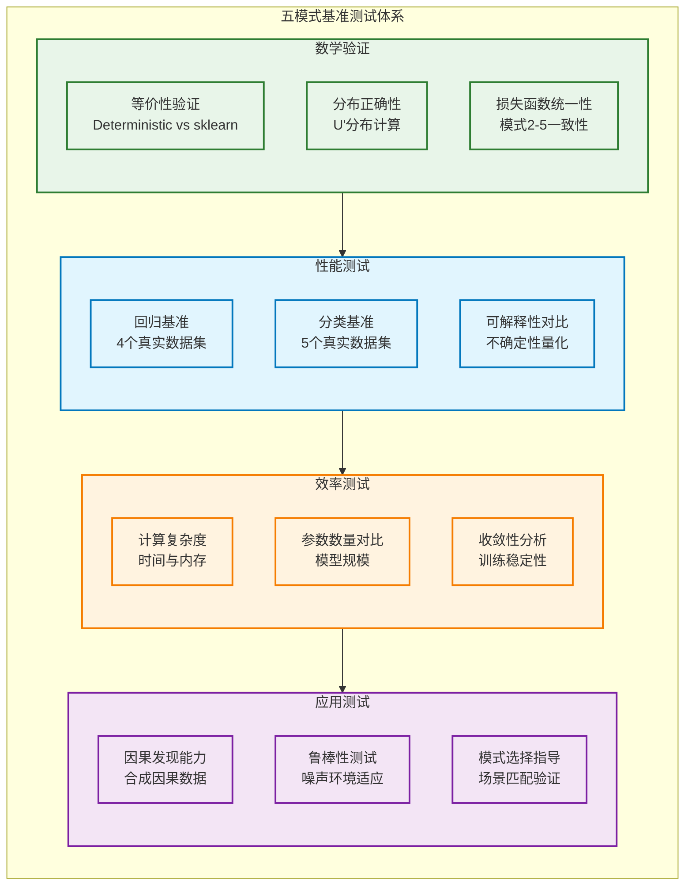

### 6.2 核心验证实验

#### 6.2.1 数学等价性验证

```python
def test_mathematical_equivalence():
    """验证Deterministic模式与sklearn的数学等价性"""
    
    # 数据准备
    X, y = make_regression(n_samples=500, n_features=10, random_state=42)
    X_train, X_test, y_train, y_test = train_test_split(X, y, test_size=0.2, random_state=42)
    
    # sklearn基线
    sklearn_model = MLPRegressor(
        hidden_layer_sizes=(64, 32),
        random_state=42,
        max_iter=500,
        alpha=0.0
    )
    sklearn_model.fit(X_train, y_train)
    sklearn_pred = sklearn_model.predict(X_test)
    sklearn_r2 = r2_score(y_test, sklearn_pred)
    
    # CausalEngine Deterministic模式
    causal_model = MLPCausalRegressor(
        mode='deterministic',
        hidden_layer_sizes=(64, 32),
        random_state=42
    )
    # 关键：配置等价性参数
    causal_model._setup_mathematical_equivalence()
    causal_model.fit(X_train, y_train)
    causal_pred = causal_model.predict(X_test)
    causal_r2 = r2_score(y_test, causal_pred)
    
    # 等价性检验
    r2_diff = abs(sklearn_r2 - causal_r2)
    pred_mse = mean_squared_error(sklearn_pred, causal_pred)
    
    print(f"sklearn R²: {sklearn_r2:.6f}")
    print(f"CausalEngine R²: {causal_r2:.6f}")
    print(f"R²差异: {r2_diff:.6f} (<0.001: ✓)")
    print(f"预测差异MSE: {pred_mse:.6f} (<0.001: ✓)")
    
    assert r2_diff < 0.001, f"等价性验证失败: R²差异 {r2_diff}"
    assert pred_mse < 0.001, f"等价性验证失败: 预测差异 {pred_mse}"
    
    return True

def test_distribution_correctness():
    """验证U'分布计算的数学正确性"""
    
    # 模拟参数
    mu_U = torch.tensor([1.0, -0.5, 2.0])
    gamma_U = torch.tensor([0.5, 1.0, 0.3])
    b_noise = torch.tensor(0.2)
    
    # 测试各模式的U'分布
    test_cases = {
        'deterministic': {
            'gamma_U': 0, 'b_noise': 0,
            'expected_loc': mu_U, 'expected_scale': torch.zeros_like(mu_U)
        },
        'exogenous': {
            'gamma_U': 0, 'b_noise': b_noise,
            'expected_loc': mu_U, 'expected_scale': torch.full_like(mu_U, abs(b_noise))
        },
        'endogenous': {
            'gamma_U': gamma_U, 'b_noise': 0,
            'expected_loc': mu_U, 'expected_scale': gamma_U
        },
        'standard': {
            'gamma_U': gamma_U, 'b_noise': b_noise,
            'expected_loc': mu_U, 'expected_scale': gamma_U + abs(b_noise)
        }
    }
    
    for mode, params in test_cases.items():
        loc_U_prime, scale_U_prime = compute_U_prime_distribution(
            mu_U, params['gamma_U'], params['b_noise'], mode
        )
        
        loc_close = torch.allclose(loc_U_prime, params['expected_loc'], atol=1e-6)
        scale_close = torch.allclose(scale_U_prime, params['expected_scale'], atol=1e-6)
        
        print(f"{mode} 模式 U' 分布: 位置参数✓={loc_close}, 尺度参数✓={scale_close}")
        
        assert loc_close and scale_close, f"{mode}模式 U'分布计算错误"
    
    return True

def test_loss_function_unity():
    """验证模式2-5使用相同的损失函数"""
    
    # 模拟数据
    loc_S = torch.randn(10, 5)
    scale_S = torch.abs(torch.randn(10, 5)) + 0.1
    targets = torch.randint(0, 5, (10,))
    
    # 计算模式2-5的损失
    losses = {}
    for mode in ['exogenous', 'endogenous', 'standard', 'sampling']:
        loss = compute_causal_loss(loc_S, scale_S, targets, mode)
        losses[mode] = loss
    
    # 验证损失函数完全相同
    base_loss = losses['exogenous']
    for mode, loss in losses.items():
        if mode != 'exogenous':
            assert torch.allclose(loss, base_loss, atol=1e-8), f"{mode}模式损失与基准不一致"
    
    print("✓ 模式2-5损失函数统一性验证通过")
    return True
```

#### 6.2.2 性能基准测试

```python
def benchmark_five_modes():
    """五模式系统性能基准测试"""
    
    # 真实数据集
    regression_datasets = [
        load_boston(), load_diabetes(), 
        load_california_housing(), make_regression(n_samples=1000, n_features=20)
    ]
    
    classification_datasets = [
        load_iris(), load_wine(), load_breast_cancer(),
        make_classification(n_samples=1000, n_features=20, n_classes=3)
    ]
    
    results = {'regression': {}, 'classification': {}}
    
    # 回归基准测试
    for i, (X, y) in enumerate(regression_datasets):
        print(f"\n=== 回归数据集 {i+1} ===")
        
        X_train, X_test, y_train, y_test = train_test_split(X, y, test_size=0.2, random_state=42)
        
        dataset_results = {}
        for mode in ['deterministic', 'exogenous', 'endogenous', 'standard', 'sampling']:
            model = MLPCausalRegressor(mode=mode, random_state=42)
            model.fit(X_train, y_train)
            pred = model.predict(X_test)
            
            r2 = r2_score(y_test, pred)
            rmse = np.sqrt(mean_squared_error(y_test, pred))
            
            dataset_results[mode] = {'r2': r2, 'rmse': rmse}
            print(f"{mode:12s}: R²={r2:.4f}, RMSE={rmse:.4f}")
        
        results['regression'][f'dataset_{i+1}'] = dataset_results
    
    # 分类基准测试 (类似结构)
    # ...
    
    return results
```

---

## 7. 总结与实践指南

### 7.1 应用场景与模式选择

#### 7.1.1 按应用需求选择

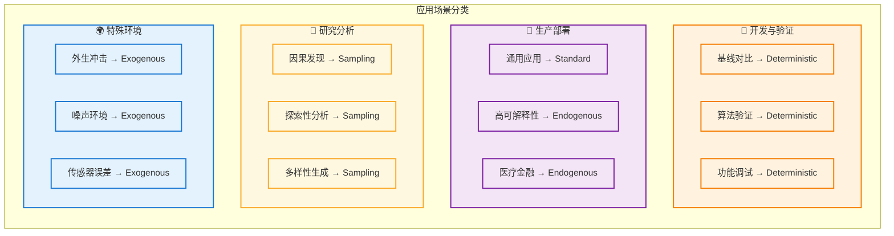

#### 7.1.2 按数据特性选择

| 数据特性 | 推荐模式 | 数学原理 | 适用情况 |
|------------|----------|----------|----------|
| **完全确定性** | Deterministic | $U' = \mu_U$ | 无噪声、高质量数据 |
| **个体确定+外部噪声** | Exogenous | $U' \sim \text{Cauchy}(\mu_U, \|b_{noise}\|)$ | 传感器数据、市场波动 |
| **个体不确定性** | Endogenous | $U' \sim \text{Cauchy}(\mu_U, \gamma_U)$ | 认知差异、个性化 |
| **混合不确定性** | Standard | $U' \sim \text{Cauchy}(\mu_U, \gamma_U + \|b_{noise}\|)$ | 常见应用场景 |
| **探索性需求** | Sampling | $U' \sim \text{Cauchy}(\mu_U + b_{noise}\varepsilon, \gamma_U)$ | 创意任务、研究分析 |

### 7.2 实践开发流程

#### 7.2.1 渐进式开发路径

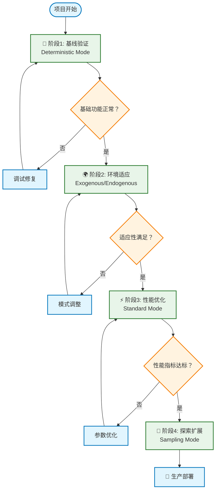

#### 7.2.2 关键实践原则

1. **始终从 Deterministic 开始**: 确保算法正确性后再添加复杂性
2. **数学等价性验证**: 使用 sklearn 基线对比验证实现正确性
3. **损失函数统一**: 模式 2-5 必须使用相同的 Cauchy NLL 损失
4. **渐进式复杂化**: 逐步引入不确定性和噪声机制
5. **充分测试验证**: 每个模式都需要独立验证数学正确性

### 7.3 技术参考对照表

#### 7.3.1 完整数学定义

| 模式 | 参数设置 | $U'$ 分布 | 损失函数 | 实现特点 |
|------|----------|-----------|----------|----------|
| **Deterministic** | $\gamma_U=0, b_{noise}=0$ | $U' = \mu_U$ (确定性) | MSE/CrossEntropy | 等价sklearn，禁用AbductionNetwork |
| **Exogenous** | $\gamma_U=0, b_{noise} \neq 0$ | $U' \sim \text{Cauchy}(\mu_U, \|b_{noise}\|)$ | Cauchy NLL | 确定性个体，外生噪声采样 |
| **Endogenous** | $\gamma_U \neq 0, b_{noise}=0$ | $U' \sim \text{Cauchy}(\mu_U, \gamma_U)$ | Cauchy NLL | 纯内生因果，无外部噪声 |
| **Standard** | $\gamma_U \neq 0, b_{noise} \neq 0$ | $U' \sim \text{Cauchy}(\mu_U, \gamma_U + \|b_{noise}\|)$ | Cauchy NLL | 噪声融合到尺度，解析计算 |
| **Sampling** | $\gamma_U \neq 0, b_{noise} \neq 0$ | $U' \sim \text{Cauchy}(\mu_U + b_{noise}\varepsilon, \gamma_U)$ | Cauchy NLL | 噪声扰动位置，采样计算 |

#### 7.3.2 API 参数对照

```python
# 核心洞察：五模式本质上都是 ActionNetwork 的不同计算方式！
class ActionNetwork(nn.Module):
    def forward(self, loc_U, scale_U, mode='standard', temperature=1.0):
        """
        五模式的差异就在这里：ActionNetwork 如何处理输入的 (loc_U, scale_U)
        """
        # 步骤1: 根据模式计算 U' 的分布参数
        if mode == 'deterministic':
            # U' = μ_U (确定性)
            loc_U_final = loc_U
            scale_U_final = torch.zeros_like(scale_U)
        
        elif mode == 'exogenous':
            # U' ~ Cauchy(μ_U, |b_noise|)
            loc_U_final = loc_U
            scale_U_final = torch.full_like(scale_U, abs(self.b_noise))
        
        elif mode == 'endogenous':
            # U' ~ Cauchy(μ_U, γ_U)
            loc_U_final = loc_U
            scale_U_final = scale_U
        
        elif mode == 'standard':
            # U' ~ Cauchy(μ_U, γ_U + |b_noise|) - 解析融合
            loc_U_final = loc_U
            scale_U_final = scale_U + temperature * abs(self.b_noise)
        
        elif mode == 'sampling':
            # U' ~ Cauchy(μ_U + b_noise*ε, γ_U) - 位置扰动
            epsilon = torch.tan(torch.pi * (torch.rand_like(loc_U) - 0.5))
            loc_U_final = loc_U + temperature * self.b_noise * epsilon
            scale_U_final = scale_U
        
        # 步骤2: 线性变换 (ActionNetwork 的核心功能)
        # 利用柯西分布的线性稳定性：Y = WX + b
        loc_S = self.lm_head(loc_U_final)  # W * μ + b
        scale_S = scale_U_final @ torch.abs(self.lm_head.weight).T  # |W| * γ
        
        return loc_S, scale_S

# 总结：五模式的统一流程
def unified_causal_pipeline(X, mode='standard'):
    """
    核心认知：五模式本质上都是 ActionNetwork 的不同计算方式！
    
    统一流程：
    1. AbductionNetwork: X → (loc_U, scale_U)
    2. ActionNetwork(模式差异): (loc_U, scale_U) → (loc_S, scale_S)
    3. 损失计算: 统一的 Cauchy NLL (除了 Deterministic)
    """
    # 步骤1: 个体推断 (所有模式相同)
    loc_U, scale_U = abduction_network(X)
    
    # 步骤2: 行动决策 (模式差异的核心)
    loc_S, scale_S = action_network(loc_U, scale_U, mode=mode)
    
    # 步骤3: 损失计算 (简单二选一)
    if mode == 'deterministic':
        loss = mse_loss(loc_S, targets)  # 传统损失
    else:
        loss = cauchy_nll_loss(loc_S, scale_S, targets)  # 统一因果损失
    
    return predictions, loss
```

#### 重要认知

五种模式的本质差异就是 **ActionNetwork 的计算方式不同**！

- **AbductionNetwork**: 所有模式完全相同
- **ActionNetwork**: 模式差异的核心所在，如何从 (loc_U, scale_U) 计算 (loc_S, scale_S)
- **损失计算**: 只有 Deterministic vs 其他模式的区别

### 7.4 系统设计哲学

#### 7.4.1 参数空间完备性

五模式系统覆盖了 $(\gamma_U, b_{noise})$ 参数空间的所有有意义组合：

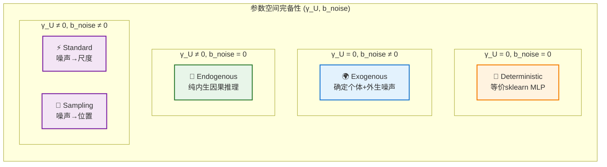

#### 7.4.2 核心设计原则

1. **数学严谨性**: 每种模式都有明确的数学定义和理论基础
2. **实现统一性**: 所有模式共享相同的核心架构和统一公式
3. **损失函数一致性**: 模式2-5使用相同的Cauchy NLL损失
4. **参数空间完备性**: 覆盖所有有意义的$(\gamma_U, b_{noise})$组合
5. **应用场景互补性**: 每种模式都有明确的应用领域

#### 7.4.3 理论意义

- **轴1 ($\gamma_U$)**: 个体内在不确定性，体现认知差异和决策模糊性
- **轴2 ($b_{noise}$)**: 外部环境噪声，体现不可控的外生因素
- **交互效应**: Standard和Sampling模式在Q4象限中提供不同的混合策略
- **因果可解释性**: 每种模式都有明确的因果解释和现实意义

### 7.5 未来扩展与研究方向

...