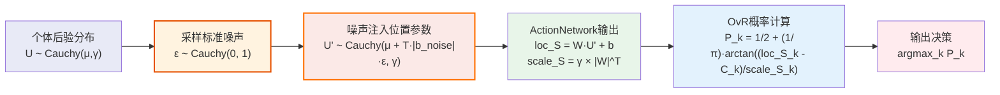
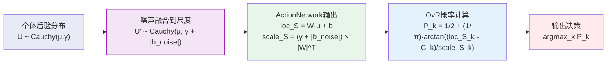

# CausalQwen 因果推理理论演进

> **📋 文档用途**: 深入阐述CausalQwen推理理论的重大演进和数学原理的根本性变化  
> **🎯 目标读者**: 理论研究者，需要深入理解因果推理数学原理的开发者  
> **📖 内容定位**: 系统性对比V1与V2的推理方法，重点关注数学公式的严谨性

---

## 第1步：CausalQwen推理的数学基础

### 1.1 核心数学框架

CausalQwen基于因果结构方程建模文本生成：$Y = f(U, \epsilon)$，其中 $U$：个体因果表征变量，$\epsilon$：外生随机噪声，$f$：普适因果机制（线性变换）。

### 1.2 柯西分布的线性稳定性

**加法稳定性**：$X_1 \sim \text{Cauchy}(\mu_1, \gamma_1), X_2 \sim \text{Cauchy}(\mu_2, \gamma_2) \Rightarrow X_1 + X_2 \sim \text{Cauchy}(\mu_1 + \mu_2, \gamma_1 + \gamma_2)$

**线性变换稳定性**：$X \sim \text{Cauchy}(\mu, \gamma) \Rightarrow aX + b \sim \text{Cauchy}(a\mu + b, |a|\gamma)$

---

## 第2步：V1传统推理设计的数学表述

### V1数学推导流程

**输入**：个体后验分布 $U \sim \text{Cauchy}(\text{loc}_U, \text{scale}_U)$

**步骤1：个体采样** - $u_i \sim \text{Cauchy}(\text{loc}_{U_i}, T \times \text{scale}_{U_i})$

**步骤2：环境噪声注入** - $U'_i \sim \text{Cauchy}(u_i, |b_{\text{noise}}|)$

**步骤3：ActionNetwork输出** - $\text{loc}_{S_{k,i}} = W_{\text{cls},k} \cdot u_i + b_{\text{cls},k}$, $\text{scale}_{S_{k,i}} = |W_{\text{cls},k}| \cdot |b_{\text{noise}}|$

**步骤4：OvR概率计算** - $P_{k,i} = \frac{1}{2} + \frac{1}{\pi} \arctan\left(\frac{\text{loc}_{S_{k,i}} - C_k}{\text{scale}_{S_{k,i}}}\right)$

**特点**：双重随机性（个体采样 + 环境噪声），需要显式采样高维个体向量$u_i$。


## 第3步：V2革命性设计的数学表述

### V2核心创新：位置vs尺度的精妙差异

V2的关键创新在于噪声对采样/非采样模式的**不同影响方式**：

#### V2采样模式：噪声影响位置参数

**输入**：个体后验分布 $U \sim \text{Cauchy}(\mu, \gamma)$

**步骤1：标准噪声采样** - $\epsilon \sim \text{Cauchy}(0, 1)$ 
```python
epsilon = torch.tan(torch.pi * (torch.rand_like(loc_U) - 0.5))
```

**步骤2：噪声注入位置参数** - $U' \sim \text{Cauchy}(\mu + T \cdot |b_{\text{noise}}| \cdot \epsilon, \gamma)$
```python  
loc_U_noisy = loc_U + temperature * torch.abs(self.b_noise) * epsilon
```

**步骤3：ActionNetwork输出** - $\text{loc}_S = W \cdot (\mu + T \cdot |b_{\text{noise}}| \cdot \epsilon) + b$, $\text{scale}_S = \gamma \times |W|^T$
```python
loc_S = self.lm_head(loc_U_noisy)
scale_S = scale_U @ torch.abs(self.lm_head.weight).T
```

**步骤4：OvR概率计算** - $P_{k,i} = \frac{1}{2} + \frac{1}{\pi} \arctan\left(\frac{\text{loc}_{S_{k,i}} - C_k}{\text{scale}_{S_{k,i}}}\right)$

**步骤5：输出决策** - $\text{argmax}_k P_{k,i}$


采样模式流程图



#### V2非采样模式：噪声影响尺度参数

**输入**：个体后验分布 $U \sim \text{Cauchy}(\mu, \gamma)$

**步骤1：噪声融合到尺度** - $U' \sim \text{Cauchy}(\mu, \gamma + |b_{\text{noise}}|)$
```python
scale_U_noisy = scale_U + torch.abs(self.b_noise)
```

**步骤2：ActionNetwork输出** - $\text{loc}_S = W \cdot \mu + b$, $\text{scale}_S = (\gamma + |b_{\text{noise}}|) \times |W|^T$
```python
loc_S = self.lm_head(loc_U)
scale_S = scale_U_noisy @ torch.abs(self.lm_head.weight).T
```

**步骤3：OvR概率计算** - $P_{k,i} = \frac{1}{2} + \frac{1}{\pi} \arctan\left(\frac{\text{loc}_{S_{k,i}} - C_k}{\text{scale}_{S_{k,i}}}\right)$

**步骤4：输出决策** - $\text{argmax}_k P_{k,i}$

非采样模式流程图



### V2设计的数学精妙之处

1. **温度参数的选择性作用**：$T$仅在采样模式下起作用，控制噪声对上下文信息的扰动强度. $T=0$ 时，采样模式退化为非采样模式. 意味着输出的时候假设是无噪声的. 
2. **噪声作用的分化**：采样时扰动"身份特征"(位置)，非采样时增加"不确定性"(尺度)
3. **单一随机性来源**：只有环境噪声$\epsilon \sim \text{Cauchy}(0,1)$，无需采样个体
4. **统一的ActionNetwork输出**：始终输出$(\text{loc}_S, \text{scale}_S)$，由OvR分类器计算概率

### V2核心代码实现：ActionNetwork.forward

```python
def forward(self, loc_U, scale_U=None, do_sample=False, temperature=1.0):
    """前向传播，严格实现柯西分布线性稳定性
    
    Args:
        loc_U: 个体表征分布的位置参数 [B, S, C]
        scale_U: 个体表征分布的尺度参数 [B, S, C]
        do_sample: 是否进行采样
        temperature: 采样温度参数
    Returns:
        loc_S: 决策分布的位置参数 [B, S, V]
        scale_S: 决策分布的尺度参数 [B, S, V]
    """
    if do_sample:
        # 🎯 采样模式：噪声影响位置参数
        
        # Step 1: 采样标准柯西噪声 ε ~ Cauchy(0, I)
        uniform_sample = torch.rand_like(loc_U)
        epsilon = torch.tan(torch.pi * (uniform_sample - 0.5))
        
        # Step 2: 温度调节的噪声注入到位置参数
        # 数学：loc_U_noisy = μ + T·|b_noise|·ε
        u_sampled = epsilon * temperature * torch.abs(self.b_noise)
        loc_U_noisy = loc_U + u_sampled
        
        # Step 3: 基于扰动后的位置参数进行线性决策
        # 数学：loc_S = W·(μ + T·|b_noise|·ε) + b
        loc_S = self.lm_head(loc_U_noisy)
        
        # Step 4: 尺度参数的线性稳定性变换
        # 数学：scale_S = γ × |W|^T
        scale_S = scale_U @ torch.abs(self.lm_head.weight).T

    else:
        # 🔧 非采样模式：噪声影响尺度参数
        
        # Step 1: 处理默认尺度参数
        if scale_U is None:
            scale_U = torch.zeros_like(loc_U)  # 默认为确定性分布
            
        # Step 2: 外生噪声融合到尺度参数
        # 数学：scale_U_noisy = γ + |b_noise|
        scale_U_noisy = scale_U + torch.abs(self.b_noise)
        
        # Step 3: 位置参数保持确定性的线性变换
        # 数学：loc_S = W·μ + b
        loc_S = self.lm_head(loc_U)
        
        # Step 4: 尺度参数的线性稳定性变换
        # 数学：scale_S = (γ + |b_noise|) × |W|^T
        scale_S = scale_U_noisy @ torch.abs(self.lm_head.weight).T
    
    return loc_S, scale_S
```

**代码设计的精妙之处**：

1. **统一接口**：`do_sample`参数控制两种完全不同的数学流程
2. **温度选择性**：`temperature`只在采样模式下生效，非采样时无影响
3. **柯西分布直接生成**：`torch.tan(π×(uniform - 0.5))`直接生成标准柯西分布
4. **线性稳定性保持**：通过矩阵运算`@ torch.abs(weight).T`实现尺度参数变换
5. **数学严谨性**：每一行代码都对应明确的数学公式

---

## 核心对比

| **方面** | **V1因果采样** | **V2采样模式** | **V2非采样模式** |
|----------|----------------|----------------|------------------|
| **随机性来源** | 个体采样+环境噪声 | 环境噪声→位置参数 | 环境噪声→尺度参数 |
| **温度参数作用** | 控制个体采样方差 | 控制噪声扰动强度 | 无作用 |
| **ActionNetwork输出** | $(\text{loc}_S, \text{scale}_S)$ | $(\text{loc}_S, \text{scale}_S)$ | $(\text{loc}_S, \text{scale}_S)$ |
| **计算复杂度** | 高维个体采样 | 标准噪声采样 | 纯解析计算 |
| **哲学含义** | 个体本身不确定 | 扰动个体身份 | 增加决策不确定性 |

### 数学流程对比

**V1**：个体采样 → 噪声注入 → ActionNetwork → OvR概率

**V2采样**：标准噪声采样 → 位置参数扰动 → ActionNetwork → OvR概率

**V2非采样**：尺度参数增强 → ActionNetwork → OvR概率

---

## 总结

V2的数学创新在于：**确定性个体 + 选择性噪声影响**的设计。ActionNetwork始终输出位置和尺度参数，OvR分类器基于这些参数计算概率。关键创新是噪声在采样时影响位置参数（扰动身份），在非采样时影响尺度参数（增加不确定性），温度参数仅在采样时控制扰动强度。 