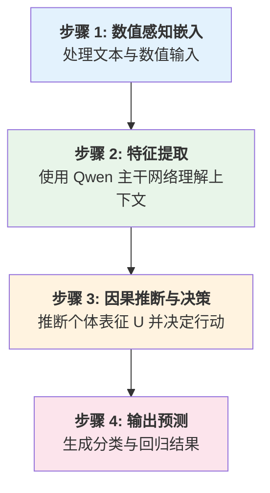
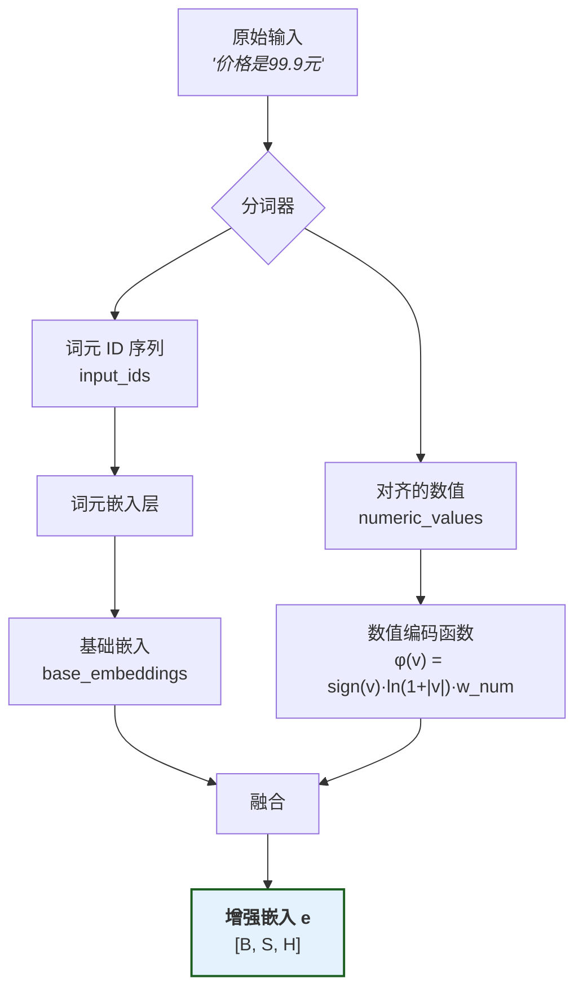
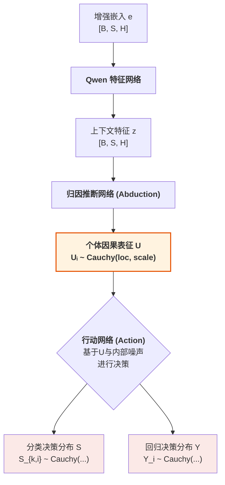
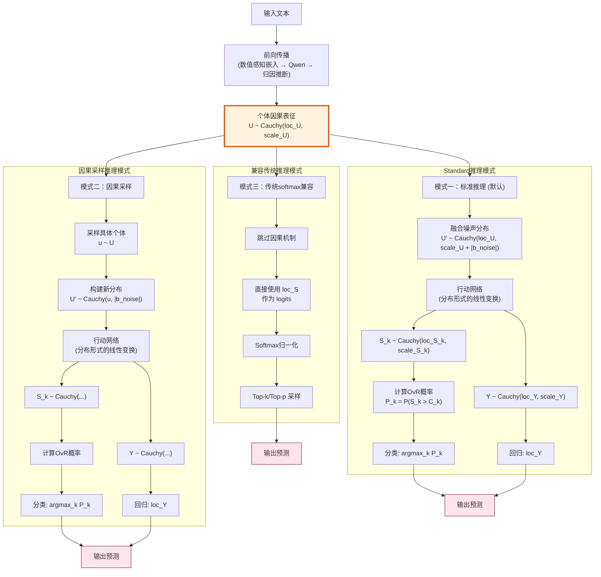
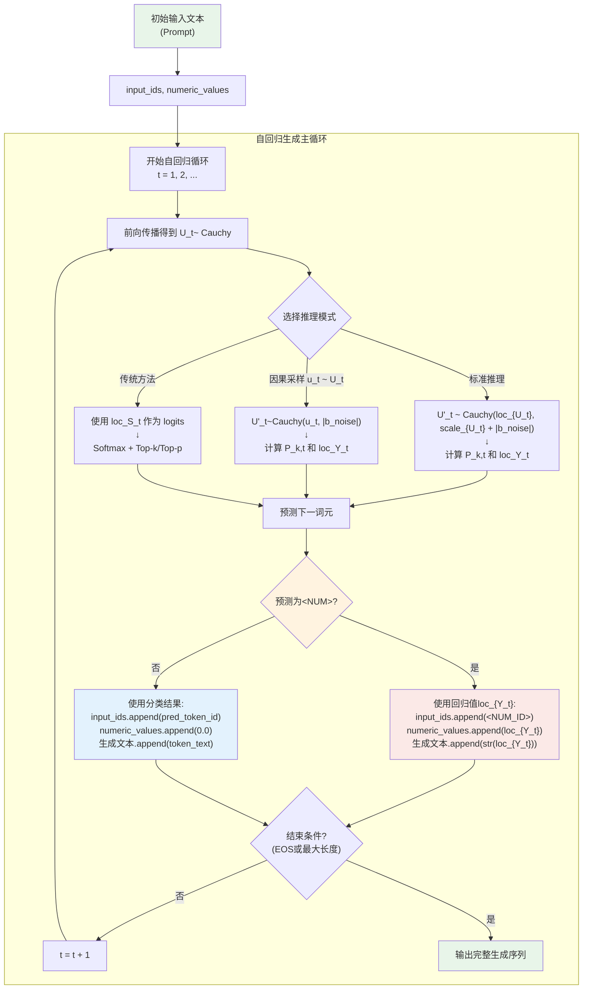
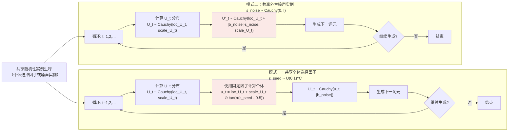
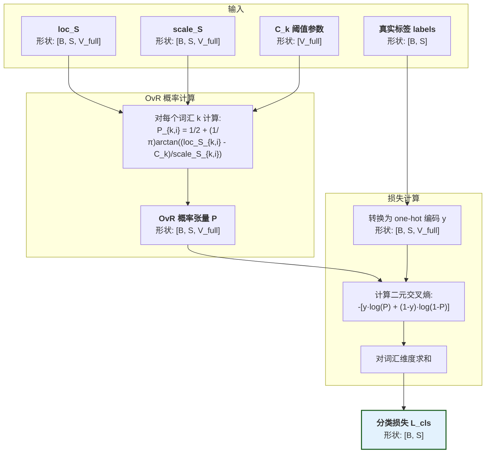
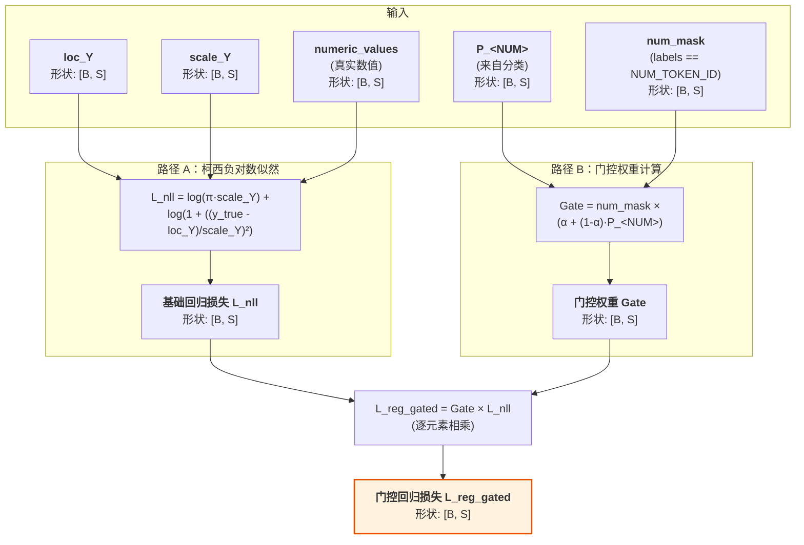
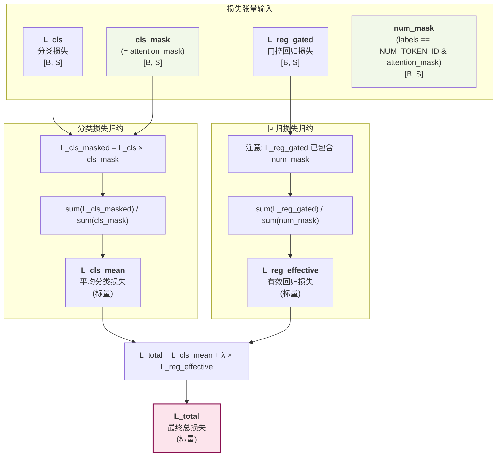

# 因果语言模型数学概览

> **📋 文档用途**: 数学原理文档，公式验证用  
> **🎯 目标读者**: 项目负责人，用于验证数学实现的正确性  
> **📖 内容定位**: 纯数学推导、公式定义、计算流程的权威参考

本文档旨在为读者提供 CausalQwen 模型核心数学思想的直观概览。

## 1.核心创新：引入个体选择变量 U

为了真正实现因果推理，我们需要一个能够对个体的内在基因进行建模的框架。本项目的理论基石 ([arXiv:2401.15911](https://arxiv.org/abs/2401.15911)) 从数学上证明，为了构建一个能够灵活表达反事实的因果模型，引入一个外生的 **"个体选择变量" $U$** 是必要的。 $U$ 是理解本模型所有魔法的关键。它有两个核心身份：

1.  **个体选择变量 (Individual Selection Variable)**：一次具体的赋值 $U=u$ 代表着从所有可能的个体中"选中"了某一个特定个体 `u`。
2.  **个体因果表征 (Individual Causal Representation)**：被选中的向量 $u$ 本身，就包含了该个体所有内在的、驱动其行为的潜在属性。

**核心思想**：普适的因果律 ($Y=f(t;u, \text{noise})$) 应用于不同的个体 ($u$) 与外生噪声 ($\text{noise}$)，从而产生了不同的反事实结果 ($Y(t)$)。$U$ 是所有个体性系统性差异的最终来源，而 $\text{noise}$ 则代表了不可控的、非系统性的随机扰动。

> 深度解读请参见: [`design-docs/U_deep_dive.md`](design-docs/U_deep_dive.md)

## 2.训练阶段：前向传播 (Forward Pass)

模型训练的核心是执行一个完整的前向传播，计算预测值与真实标签之间的损失，然后通过反向传播更新模型参数。整个前向传播过程可以分解为五个核心模块。

> 我们用 B 代表批次大小, S 代表序列长度, H 代表模型隐藏维度, C 代表因果表征维度, V_full 代表 Qwen 的词汇表总大小。Qwen 的词汇表包含 K 个已使用词汇和 271 个预留位置，即 V_full = K + 271。CausalQwen 使用第一个预留位置（ID = K）作为 `<NUM>` 词元。

> **设计决策**: 在当前实现中，我们设定因果表征维度 `C` 与模型隐藏层维度 `H` 相等，即 **`C = H`**。这简化了归因推断网络的初始化。

### 2.1 模块一：数值感知嵌入 (Numerical-aware Embedding)
这一模块的目标是将混合了文本和数值的原始输入，转化为一个统一的、数值感知的特征向量序列。这个过程包含三个关键步骤, *输入示例**: 原始字符串文本 `"价格是99.9元"`:

#### 1.分词与数值识别
分词器处理原始文本，识别并替换数值：

1.  **数值识别**: 分词器扫描文本，识别数值模式（如 `99.9`）
2.  **词元替换**: 将识别出的数值替换为特殊词元 `<NUM>`
3.  **数值保存**: 将原始数值单独保存，与词元序列保持位置对齐

-   **输出**: 
    - `input_ids` $[x_1, ..., x_S]$: `['价格', '是', '<NUM>', '元']` → `[12345, 67890, <NUM_ID>, 11111]` (形状: `[B, S]`)
    - `numeric_values` $[v_1, ..., v_S]$: `[0.0, 0.0, 99.9, 0.0]` (形状: `[B, S]`)

#### 2.词元嵌入
将词元ID序列转换为基础嵌入向量：

-   **输入**: `input_ids` (形状: `[B, S]`)
-   **处理**: 通过嵌入层查找每个词元的向量表示
    $$\text{base\_embed}_i = \text{EmbeddingLayer}(\text{input\_ids}_i)$$
-   **输出**: `base_embeddings` (形状: `[B, S, H]`)

#### 3.数值编码与融合
结合词元的基础嵌入和数值的对数编码，计算出最终的增强嵌入：

-   **输入**: 
    - `base_embeddings` (形状: `[B, S, H]`)
    - `numeric_values` (形状: `[B, S]`)
-   **处理**: 对每个位置 $i$，计算增强嵌入：
    $$e_i = \text{base\_embed}_i + \phi(v_i)$$
    数值编码函数：
    $$\phi(v) = \text{sign}(v) \cdot \ln(1 + |v|) \cdot \vec{w}_{\text{num}}$$
    其中 $v_i$ 是位置 $i$ 的数值（非数值位置为 0），$\vec{w}_{\text{num}} \in \mathbb{R}^H$ 是数值感知嵌入模块的可学习参数向量。
-   **输出**: 
    - `e`: 增强嵌入张量 (形状: `[B, S, H]`)

**关键洞察**：
1. **自然退化**: 对于非数值位置，$v_i = 0$ 导致 $\phi(0) = 0$，因此 $e_i = \text{base\_embed}_i$，自然退化为标准词元嵌入
2. **统一处理**: 所有位置使用相同的计算公式，无需条件分支
3. **位置对齐**: 数值信息与词元序列严格对齐，确保语义的连贯性

**完整示例**:
```
原始文本: "价格是99.9元"
     ↓ (分词器)
input_ids: [12345, 67890, <NUM_ID>, 11111]
numeric_values: [0.0, 0.0, 99.9, 0.0]
     ↓ (嵌入层)
     
base_embeddings: [[e1], [e2], [e3], [e4]]  # 每个ei是H维向量
     ↓ (数值编码)
φ(numeric_values): [[φ(0)], [φ(0)], [φ(99.9)], [φ(0)]]  # φ(99.9) = ln(100.9) * ê
     ↓ (融合)
enhanced_embeddings: [[e1], [e2], [e3 + φ(99.9)], [e4]]
```

> **设计动机**: 选择对数编码 $\phi(v)$ 是因为它具有三大优势：1) **数值稳定性**，将大范围数值压缩到合理区间；2) **相对误差保持**，对数空间中的等距对应原空间的等比；3) **自然退化**，由于$\phi(0)=0$，非数值位置自然退化为标准词元嵌入，无需特殊处理。

### 2.2 模块二：特征提取网络 (Feature Extraction Network)
该模块使用一个标准的 Transformer 网络（如Qwen）作为主干，来深度理解序列的上下文信息。

-   **输入**: `e`: 增强嵌入张量 (形状: `[B, S, H]`)
-   **处理**: 通过 $L$ 层 Transformer 进行特征提取：
    $$z = \text{QwenTransformer}(e)$$
    
    由于完全继承 Qwen 权重，当 $e \approx e_{\text{Qwen}}$ 时，$z \approx z_{\text{Qwen}}$。
-   **输出**: `z`: 上下文特征张量 (形状: `[B, S, H]`)

> **训练策略**: 在训练的初期阶段，QwenTransformer 的参数保持冻结，仅在后续阶段考虑使用 LoRA 等技术进行微调。这既保证了快速收敛，又维持了与基座模型的可比性。

### 2.3 模块三：归因推断网络 (Abduction Network)
该模块从上下文特征中推断出每个位置的个体因果表征分布。

-   **输入**: 上下文特征 `z` (形状: `[B, S, H]`)
-   **处理**: 通过线性层计算因果表征的分布参数：
    $$\text{loc}_{U_i} = W_{\text{loc}} \cdot z_i + b_{\text{loc}}$$
    $$\text{scale}_{U_i} = \text{softplus}(W_{\text{scale}} \cdot z_i + b_{\text{scale}})$$
    
    其中 $\text{softplus}(x) = \log(1 + \exp(x))$，保证尺度参数严格为正。
    
-   **输出**: 
    - `loc_U`: 因果表征分布的位置参数 (形状: `[B, S, C]`)
    - `scale_U`: 因果表征分布的尺度参数 (形状: `[B, S, C]`)

> **灵活性设计**: 归因推断网络是最灵活的组件，可以针对不同领域采用不同的网络结构。但需要满足约束：$D_{KL}(P(U|X) || P_{\text{base}}(U|X)) \leq \epsilon$，以防止灾难性遗忘。

### 2.4 模块四：行动网络 (Action Network)

该模块是模型的核心决策单元，它体现了**普适的线性因果律**：一旦有了正确的个体因果表征 `U`，后续的决策过程是简单、统一且线性的。该网络在 V2 架构下，其核心是`do_sample`参数和`temperature`参数的组合，它将决定外生噪声是以何种方式影响最终决策的。

-   **输入**: `loc_U` (形状: `[B, S, C]`), `scale_U` (形状: `[B, S, C]`)
-   **内部参数**: 可学习的外生噪声基准 `b_noise` (形状: `[C]`)
-   **处理**: 
    1.  **V2 噪声注入**: 根据 `do_sample` 的值，选择不同的噪声注入方式：
        -   **非采样模式 (`do_sample=False`)**: 噪声影响**尺度**参数。
            `loc_U_noisy = loc_U`
            `scale_U_noisy = scale_U + torch.abs(self.b_noise)`
        -   **采样模式 (`do_sample=True`)**: 噪声影响**位置**参数。
            `epsilon = sample_cauchy_noise()`
            `loc_U_noisy = loc_U + temperature * torch.abs(self.b_noise) * epsilon`
            `scale_U_noisy = scale_U`

    2.  **并行决策 (Parallel Decision Making)**：基于经过噪声注入的分布参数 `(loc_U_noisy, scale_U_noisy)`，通过两个并行的线性"头"来计算分类和回归的决策分布。

        -   **分类头 (Classification Head)**：
            `loc_S = lm_head(loc_U_noisy)`
            `scale_S = scale_U_noisy @ torch.abs(lm_head.weight).T`
        
        -   **回归头 (Regression Head)**：
            `loc_Y = reg_head(loc_U_noisy)`
            `scale_Y = scale_U_noisy @ torch.abs(reg_head.weight).T`

-   **输出**:
    - 分类决策分布参数: `loc_S` (形状: `[B, S, V_full]`), `scale_S` (形状: `[B, S, V_full]`)
    - 回归决策分布参数: `loc_Y` (形状: `[B, S]`), `scale_Y` (形状: `[B, S]`)

> **核心引擎：柯西分布的线性稳定性**
> 如果 $X_1, X_2, ..., X_n$ 是独立的柯西随机变量，$X_j \sim \text{Cauchy}(\mu_j, \gamma_j)$，那么对于权重 $w_j$：
> $$\sum_{j=1}^n w_j X_j \sim \text{Cauchy}\left(\sum_{j=1}^n w_j \mu_j, \sum_{j=1}^n |w_j| \gamma_j\right)$$
> 这一定理是整个行动网络能够以解析方式（无采样）对分布参数进行精确变换的数学基石。

### 2.5 模块五：损失计算 (Loss Calculation)

#### 1. OvR 分类损失
对每个类别计算独立的二元分类概率：
$$P_{k,i} = P(S_{k,i} > C_k) = \frac{1}{2} + \frac{1}{\pi} \arctan\left(\frac{\text{loc}_{S_{k,i}} - C_k}{\text{scale}_{S_{k,i}}}\right)$$

其中 $C_k$ 是类别 $k$ 的可学习阈值参数。

然后计算所有类别的二元交叉熵之和：
$$L_{\text{cls}, i} = -\sum_{k=0}^{V_{\text{full}}-1} [y_{k,i} \log P_{k,i} + (1-y_{k,i}) \log (1 - P_{k,i})]$$

其中 $y_{k,i}$ 是 one-hot 编码的真实标签。

#### 2. 门控回归损失
柯西分布的负对数似然及其门控损失：
$$\mathcal{L}_{\text{nll},i} = \log(\pi \cdot \text{scale}_{Y_i}) + \log\left(1 + \left(\frac{y_{\text{true},i} - \text{loc}_{Y_i}}{\text{scale}_{Y_i}}\right)^2\right) \\
\mathcal{L}_{\text{reg\_gated},i} = \text{num\_mask}_i \cdot \left(\alpha + (1-\alpha) P_{\text{<NUM>},i} \right) \cdot \mathcal{L}_{\text{nll},i}$$

门控权重（$\alpha=0$ 和 $\alpha=1$ 时）：
$$
\mathcal{L}_{\text{reg\_gated},i} = \text{num\_mask}_i \cdot P_{\text{<NUM>},i} \cdot \mathcal{L}_{\text{nll},i} \\
\mathcal{L}_{\text{reg\_gated},i} = \text{num\_mask}_i \cdot \mathcal{L}_{\text{nll},i}
$$

其中 `num_mask` 指示位置 $i$ 的真实标签是否为 `<NUM>`。

#### 3. 总损失
引入两种掩码：
- `cls_mask = attention_mask`：用于分类损失计算
- `num_mask = (labels == NUM_TOKEN_ID) & attention_mask`：用于回归损失计算

总损失为：
$$\mathcal{L}_{\text{total}} = \underbrace{\frac{\sum_i L_{\text{cls}, i} \cdot \text{cls\_mask}_i}{\sum_i \text{cls\_mask}_i}}_{\text{平均分类损失}} + \lambda \cdot \underbrace{\frac{\sum_i \mathcal{L}_{\text{reg\_gated},i}}{\sum_i \text{num\_mask}_i}}_{\text{有效回归损失}}$$

## 3.推理阶段：生成预测 (Inference)

CausalQwen V2 架构提供了一个统一且强大的推理框架，通过 `do_sample` 和 `temperature` 两个参数的组合，可以实现从完全确定性的预测到高度探索性的生成。所有模式下，分类和回归预测都是同时生成的。

### 3.1 标准模式 (Standard Mode)

这是模型的默认模式，用于高效、确定性的预测。

- **设置**: `do_sample=False`, `temperature` (任意值，不起作用)
- **数学原理**: 噪声被吸收到尺度参数中，`U' ~ Cauchy(μ, γ + |b_noise|)`。整个计算过程无随机性。
- **流程**:
    1.  `ActionNetwork` 在非采样模式下运行，计算出决策分布 `(loc_S, scale_S)` 和 `(loc_Y, scale_Y)`。
    2.  **分类预测**: 计算所有词汇的 OvR 概率，并选择概率最高的词元。
        `P_k = 0.5 + arctan((loc_S_k - C_k) / scale_S_k) / π`
        `pred_token_id = argmax_k(P_k)`
    3.  **回归预测**: 直接使用回归头输出的位置参数作为预测值（柯西分布的中位数和众数）。
        `pred_value = loc_Y`
- **用途**: 用于评估、快速生成和所有需要可复现结果的场景。

### 3.2 因果/采样模式 (Causal/Sampling Mode)

当 `do_sample=True` 时，模型进入随机性生成模式，其具体行为由 `temperature` 参数精细控制。

- **设置**: `do_sample=True`
- **数学原理**: 噪声 `ε` 影响位置参数，`U' ~ Cauchy(μ + T·|b_noise|·ε, γ)`。随机性来源于 `ε` 的采样。

#### 3.2.1 纯因果模式 (Pure Causal Mode)

- **设置**: `temperature = 0`
- **流程**:
    1.  当 `T=0` 时，噪声注入项为零，`loc_U_noisy = loc_U`。
    2.  `ActionNetwork` 的计算与标准模式下的位置参数部分等价，但尺度参数没有噪声。
    3.  后续预测流程同标准模式。
- **哲学含义**: 这是对因果理论最纯粹的表达，生成过程完全基于从上下文推断出的个体因果表征 `U ~ Cauchy(μ, γ)`，不受任何外生随机性干扰，即 `Y = f(U)`。

#### 3.2.2 采样模式 (Sampling Mode)
- **设置**: `temperature > 0`
- **流程**:
    1.  在 `ActionNetwork` 中，对标准柯西分布 `Cauchy(0,1)` 进行采样得到 `ε`。
    2.  `ε` 经温度 `T` 缩放后，扰动位置参数 `loc_U`。
    3.  使用被扰动后的 `loc_U_noisy` 计算 `loc_S` 和 `loc_Y`。
    4.  后续预测流程同标准模式，但由于 `loc_S` 和 `loc_Y` 具有了随机性，每次运行的结果都会不同。
- **哲学含义**: 探索"如果个体的内在状态受到一点随机影响，他会做出什么不同决策？"。温度越高，扰动越大，生成的多样性越强。


#### 3.2.3 序列因果采样：共享外部噪声实例

想要实现同一个句子生成过程中，共享外部噪声实例，需要将外部噪声实例固定下来，然后每次生成时，都使用这个固定的外部噪声实例。

TODO: 后续补充


### 3.3 兼容模式 (Compatible Mode)

为了与传统的语言模型（如 GPT、Qwen）进行公平的基准比较和功能对齐，CausalQwen 提供了一种兼容模式。

- **设置**: 无需特殊设置，只需在生成解码阶段改变算法。
- **流程**:
    1.  运行模型（通常在标准模式下）得到 `loc_S`。
    2.  将 `loc_S` 视作传统的 `logits`。
    3.  对 `loc_S` 应用 `softmax` 函数得到归一化的概率分布。
    4.  在该概率分布上执行标准的 `top-k` / `top-p` 采样。
- **用途**: 模型评估、与现有生态系统集成。

### 3.4 自回归生成中的统一处理

在自回归（逐词元生成）的场景中，模型在每一步都会同时产出分类和回归的预测。

1.  **预测**: 模型在第 `t` 步输出 `pred_token_id` 和 `pred_value`。
2.  **决策**:
    - 如果 `pred_token_id` 是 `<NUM>`，则将 `pred_value` 的字符串形式追加到生成文本中，并将 `<NUM_ID>` 和 `pred_value` 分别送入下一轮的 `input_ids` 和 `numeric_values`。
    - 如果 `pred_token_id` 是普通词元，则将该词元文本追加到生成文本中，并将 `pred_token_id` 和 `0.0` 分别送入下一轮的 `input_ids` 和 `numeric_values`。

这种设计实现了文本和数值生成的无缝、统一处理。

## 4. 初始化策略：知识迁移

为了使 CausalQwen 能够无缝继承基座模型的强大语言能力，我们采用了一种**精简而有效**的初始化策略。核心思想是：**在训练开始时，CausalQwen 的行为应与原始的 Qwen 尽可能一致**。

#### 步骤1：数值感知嵌入 → 标准初始化

- **`<NUM>` 词元嵌入**：直接继承 Qwen 的第一个保留词元嵌入：
  $$\text{embed}(\text{<NUM>}) \leftarrow \text{embed}_{\text{Qwen}}(\text{<NUM>})$$

- **数值编码向量**：使用标准的向量初始化：
  $$\vec{w}_{\text{num}} \sim \mathcal{N}(0, 1/\sqrt{H})$$
  
  这是标准的 Xavier 初始化，确保前向传播时方差稳定。

#### 步骤2：归因推断网络 → 恒等映射初始化

为了确保知识迁移，归因推断网络应该初始化为近似恒等映射，使得初始的因果表征分布直接反映 Qwen 的特征：

- **位置网络**：设置为恒等映射
  $$W_{\text{loc}} \leftarrow I_H, \quad b_{\text{loc}} \leftarrow 0$$
  这样 $\text{loc}_{U_i} = z_i$，即因果表征的位置参数直接等于 Qwen 的输出特征。

- **尺度网络**：设置为产生常数尺度
  $$W_{\text{scale}} \leftarrow 0, \quad b_{\text{scale}} \leftarrow \gamma_{\text{init}}$$
  其中 $\gamma_{\text{init}} = 1.0$ 或类似的正数。这样 $\gamma_i = \text{softplus}(\gamma_{\text{init}})$ 是一个与输入无关的常数，提供了宽泛的先验分布。

> **关键洞察**: 这种初始化策略确保了：
> 1. 因果表征的位置参数完全继承了 Qwen 的知识表示
> 2. 尺度参数初始为常数，表示对所有位置的不确定性有相同的先验认识
> 3. 模型将在训练过程中学习到哪些位置需要更高或更低的不确定性

**数学推导**：在初始化状态下，对于位置 $i$：
- 归因推断网络输出：
  $$\text{loc}_{U_i} = W_{\text{loc}} \cdot z_i + b_{\text{loc}} = I_H \cdot z_i + 0 = z_i$$
  $$\text{scale}_{U_i} = \text{softplus}(W_{\text{scale}} \cdot z_i + b_{\text{scale}}) = \text{softplus}(0 \cdot z_i + \gamma_{\text{init}}) = \text{softplus}(\gamma_{\text{init}}) \cdot \mathbf{1}_C = \gamma_0 \cdot \mathbf{1}_C$$
  
- 因此，初始的因果表征分布为：
  $$U_i \sim \text{Cauchy}(z_i, \gamma_0 \cdot \mathbf{1}_C)$$

#### 步骤3：行动网络(分类) → 复制 Qwen 权重

$$W_{\text{cls}} \leftarrow W_{\text{Qwen\_lm\_head}}, \quad b_{\text{cls}} = 0$$

这确保了初始分类输出与 Qwen 一致。由于我们完整复制了 Qwen 的 `lm_head` 权重矩阵（维度为 `[V_full, H]`），所有词汇（包括已使用的和预留的）都有对应的权重。

**分类决策分布推导**：
- 融合输入分布（加入噪声）：
  $$U'_i \sim \text{Cauchy}(z_i, \gamma_0 \cdot \mathbf{1}_C + |b_{\text{noise}}|)$$

  其中 $\gamma_0 \cdot \mathbf{1}_C + |b_{\text{noise}}|$ 表示对逐元素相加, $b_\text{noise}$ 初始化成某个常数值即可。

- 对于词汇 $k$，经过权重向量 $W_{\text{cls},k} \in \mathbb{R}^C$ 的线性变换（内积）后：
  $$S_{k,i} = W_{\text{cls},k} \cdot U'_i + b_{\text{cls},k} \sim \text{Cauchy}\left(W_{\text{cls},k} \cdot z_i, |W_{\text{cls},k}| \cdot (\gamma_0 \cdot \mathbf{1}_C + |b_{\text{noise}}|)\right)$$
  
- 因此：
  $$\text{loc}_{S_{k,i}} = W_{\text{cls},k} \cdot z_i = W_{\text{Qwen},k} \cdot z_i$$
  $$\text{scale}_{S_{k,i}} = |W_{\text{cls},k}| \cdot (\gamma_0 \cdot \mathbf{1}_C + |b_{\text{noise}}|)$$

这表明位置参数与原始 Qwen 的 logits 完全相同。

#### 步骤4：行动网络(回归) → 标准初始化

使用标准的 Xavier 或 He 初始化。模型将在训练中学习合适的回归映射。

**回归决策分布推导**：
- 基于融合输入分布 $U'_i \sim \text{Cauchy}(z_i, \gamma_0 \cdot \mathbf{1}_C + |b_{\text{noise}}|)$
- 经过回归权重向量 $W_{\text{reg}} \in \mathbb{R}^C$ 的线性变换：
  $$Y_i = W_{\text{reg}} \cdot U'_i + b_{\text{reg}} \sim \text{Cauchy}(\mu_{\text{reg},i}, \gamma_{\text{reg},i})$$
  
其中：
$$\mu_{\text{reg},i} = W_{\text{reg}} \cdot z_i + b_{\text{reg}}$$
$$\gamma_{\text{reg},i} = |W_{\text{reg}}| \cdot (\gamma_0 \cdot \mathbf{1}_C + |b_{\text{noise}}|)$$

这里 $|W_{\text{reg}}| \cdot (\gamma_0 \cdot \mathbf{1}_C + |b_{\text{noise}}|)$ 表示先对权重向量逐元素取绝对值，再与尺度向量进行内积。

通过上述初始化步骤，CausalQwen 在训练开始时具有以下性质：

-   **因果表征**: 对于每个位置 $i$，因果表征 $U_i$ 服从分布 $U_i \sim \text{Cauchy}(z_i, \gamma_0 \cdot \mathbf{1}_C)$，其中 $z_i \in \mathbb{R}^C$ 是 Qwen 的输出特征，$\gamma_0 = \text{softplus}(\gamma_{\text{init}})$ 是初始的常数尺度。
-   **分类决策**: 由于完整复制了 Qwen 的 lm_head 权重，分类输出的位置参数与 Qwen 完全一致：$\text{loc}_{S_{k,i}} = W_{\text{Qwen},k} \cdot z_i$，对所有 $k \in [0, V_{\text{full}})$。
-   **回归决策**: 位置参数 $\mu_{\text{reg},i} = W_{\text{reg}} \cdot z_i + b_{\text{reg}}$ 接近零均值，尺度参数由权重向量与尺度向量的内积决定。
-   **知识保持**: 当使用兼容性采样（基于 `loc_S` 的 softmax）时，模型的输出分布与原始 Qwen 完全相同，确保了知识的完美迁移。


## 5. 训练监控指标 (Training Monitoring Metrics)

为了有效评估和调试 CausalQwen 模型的训练过程，我们利用 Weights & Biases (wandb) 平台进行实时监控。本章提炼了 [`wandb_monitoring_metrics.md`](./experiments/wandb_monitoring_metrics.md) 中的核心指标，所有指标的计算都严格遵循本文档定义的数学原理。

### 5.1. 前提：基于确定性推理的评估

所有性能评估指标 (以 `eval/` 为前缀) **均基于确定性推理 (Deterministic Inference) 模式计算**。这保证了评估结果的**可复现性**和**稳定性**，为不同实验提供了可靠的基准。

### 5.2. 核心损失指标 (`train/*`)
-   **`train/accuracy`**: 在所有真实词元（应用 `attention_mask`）上计算分类准确率，衡量基础语言能力。
-   **`train/total_loss`**: 由平均分类损失 (`cls_loss_mean`) 和有效回归损失 (`reg_loss_effective`) 加权构成，是最终的优化目标。
-   **`train/cls_loss_mean`**: 在所有真实词元（应用 `attention_mask`）上计算的 OvR 分类损失的平均值，衡量基础语言能力。
-   **`train/reg_loss_effective`**: 仅在真实数值词元（应用数值掩码 `m`）上计算的门控回归损失的平均值，确保回归信号不被稀释。

### 5.3. 模型性能指标 (`eval/*`)

-   **词元预测准确率(`eval/accuracy`)** 
    - Perplexity 也可以考虑计算，但是 OvR 非归一化多分类概率，所以需要特殊处理才能使用。
-   **数值词元预测 (`eval/num_*`):
    -   **`num_precision`, `num_recall`, `num_f1`**: 全面评估模型在有效位置上辨别 `<NUM>` 词元的能力，是**门控机制性能的关键**。

-   **回归性能 (`eval/reg_*`)**:
    -   **`reg_mae` (平均绝对误差)**: 传统的误差度量，对异常值敏感。
    -   **`reg_mdae` (中位绝对误差)**: 对异常值稳健的误差度量。当 `mae` 远大于 `mdae` 时，表明存在少数极端错误的预测。

### 5.4. 内部状态分布指标 (`dist/*`)

这些指标的统计数据（`mean`, `median`, `std`, `iqr`）均在**有效词元位置（应用 `attention_mask`）** 上计算。

-   **因果表征 `U` (`dist/U_*`)**:
    -   通过对比 `U_loc` 和 `U_scale` 的 `mean`/`std` 与 `median`/`iqr`，我们可以深入分析其分布的**偏斜度**和**尾部重量**，从而诊断模型是否对特定词元学习到了特化表征，或是否明智地在困难样本上表达了更高的不确定性。

-   **OvR 校准 (`dist/ovr_prob_sum_*`)**:
    -   **标准推理模式**：`dist/ovr_prob_sum_median_standard` - 监控标准推理下的概率和
    -   **因果采样模式**：`dist/ovr_prob_sum_median_causal` - 监控固定个体下的概率和
    
    对于同一个确定的个体，其下一个词元只能有一个真值，因此因果采样模式下的概率和应该**更接近 1**，这是模型校准性的重要指标。

## 6. 使用流程图理解


### 图 1：CausalQwen 总体架构概览

这张图展示了模型最高层级的四大核心步骤，从输入到输出的完整流程。



---

### 图 2：详解步骤 1 - 数值感知嵌入

这张图详细描绘了第一个模块如何将混合了文本和数值的原始输入，转化为统一的向量表示 `e`。



---

### 图 3：详解步骤 2 & 3 - 因果核心流程

这张图展示了模型的核心机制：如何从上下文特征 `z` 推断出代表个体的因果分布 `U`，并基于 `U` 和内部噪声 `noise` 产生决策分布 `S` 和 `Y`。



---

### 图 4：详解步骤 4 


#### 4.1 CausalQwen 三种推理模式

这张图展示了CausalQwen的三种推理模式，从输入文本到最终预测的完整流程。



---

#### 4.2 CausalQwen 自回归序列生成流程

这张图展示了CausalQwen如何进行自回归序列生成，包括文本和数值的统一处理。



**关键特点**：
1. **统一处理**：每个位置都同时具有分类和回归能力
2. **数值感知**：当预测为`<NUM>`时，使用回归通道的输出值
3. **灵活推理**：支持三种推理模式的无缝切换
4. **序列一致性**：`input_ids`和`numeric_values`始终保持对齐

---

#### 4.3 高级序列因果采样详解

为了更好地理解3.4节中描述的高级因果采样模式，这里用流程图展示两种模式的具体实现：



**深层含义**：
- **模式一**：探索同一个体在不同环境扰动下的行为变化
- **模式二**：探索不同个体在相同系统性偏差下的反应差异

这两种模式为反事实分析和因果推理提供了强大的工具。


### 图 5：损失流程图


#### 图 5.1：分类损失 (`L_cls`) 的计算

这张图展示了如何从模型对全部词汇的预测分布，计算出每个位置的分类总损失。



**关键点**：
- 使用 OvR（One-versus-Rest）方法，每个词汇独立计算二元分类概率
- 引入可学习的阈值参数 `C_k`，允许模型为不同词汇学习不同的决策边界
- 最终损失是所有词汇的二元交叉熵之和

---

#### 图 5.2：门控回归损失 (`L_reg_gated`) 的计算

这张图详细展示了门控机制如何结合分类概率和回归损失。



**门控机制解释**（当 α=0 时）：
- `Gate = num_mask × P_<NUM>` 
- 只有当真实标签是数值（`num_mask=1`）且模型预测为数值的概率高时，回归损失才被充分计算
- 这种软门控避免了硬性的 0/1 切换，使梯度流更加平滑

---

#### 图 5.3：总损失 (`L_total`) 的合并

这张图展示了如何正确地将分类损失和回归损失合并为最终的训练目标。



**关键设计决策**：
1. **分类损失**：在所有有效词元上平均（使用 `cls_mask`）
2. **回归损失**：仅在数值词元上平均（使用 `num_mask`），避免稀疏性导致的信号稀释
3. **加权系数 λ**：平衡两个任务的重要性，是一个重要的超参数

这种设计确保了：
- 分类任务覆盖所有词元，保持语言建模能力
- 回归任务专注于数值预测，不被非数值位置稀释
- 两个任务通过门控机制协同学习

## 7. 核心洞察与总结

CausalQwen 的数学框架三个特色：

1.  **因果表征**：通过 $U$ 建模个体因果性差异
2.  **分布计算**：利用柯西分布的线性性质，实现无采样训练
3.  **统一架构**：设计为 Qwen 的子类，通过扩展而非重构增加数值处理能力

### 7.1 ⚖️ CausalQwen vs. 标准 Qwen 对比清单

为了清晰地展示 CausalQwen 的创新之处，我们将其与标准的 Qwen 模型在几个核心维度上进行直接比较。

| 对比维度 (Dimension) | 标准 Qwen (Standard Qwen) | CausalQwen |
| :--- | :--- | :--- |
| **核心假设** | **关联性**：学习输入 $X$ 和输出 $Y$ 之间的条件概率分布 $P(Y\|X)$。 | **因果性**：学习一个普适的因果函数 $Y = f(t; u, \text{noise})$，其中 $u$ 是个体属性，$\text{noise}$ 是外生噪声。 |
| **数值处理** 🔢<br>Numerical Handling | **视为纯文本 (As Plain Text)**<br>将数字（如 "99.9"）当作普通词元处理，缺乏内在的数值概念。 | **双通道处理 (Dual-Channel)**<br>文本部分走词元嵌入，数值部分走独立的**回归通道**，真正理解数值大小。 |
| **输出架构** 🏛️<br>Output Architecture | **单一 Logits 输出 (Single Logits Output)**<br>输出一个维度为词汇表大小的 logits 向量，用于 Softmax。 | **双重分布输出 (Dual Distribution Output)**<br>输出独立的**分类 OvR 分布**和**回归柯西分布**，分别处理文本与数值。 |
| **损失函数** 🧮<br>Loss Function | **Softmax 交叉熵 (Softmax Cross-Entropy)**<br>在整个词汇表上进行归一化，计算单一正确答案的损失。 | **OvR + 门控回归损失 (Gated Reg Loss)**<br>分类上进行独立二元判断，回归上由分类结果**智能门控**，实现多任务学习。 |
| **采样范式** 🎲<br>Sampling Paradigm | **对"结果"采样 (Sampling the "Effect")**<br>在最终的 logits 分布上使用 `top-k`/`top-p` 进行随机采样。 | **对"原因"采样 (Sampling the "Cause")**<br>引入**因果采样**，直接对"个体" $U$ 进行采样，得到更多样且风格一致的生成结果。 |
| **核心创新** ✨<br>Key Innovation | 强大的语言建模与上下文理解能力。 | 引入外生**个体选择变量 $U$**，显式建模**外生噪声 $\text{noise}$**，并利用柯西分布的数学特性，构建了一个可高效训练的因果生成框架。 |


