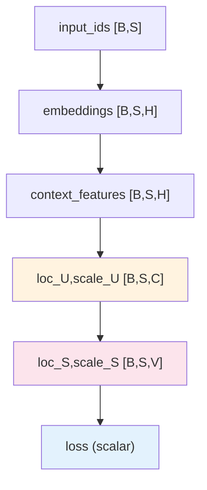

# CausalQwen MVP 测试框架分析

验证6个核心功能：模型初始化、前向传播、推理模式、序列生成、梯度计算、推理验证器

```bash
python scripts/how_to_run_all_tests.py
```


## 配置参数数学原理

**核心框架**: $Y = f(U, \epsilon), \quad U \sim \text{Cauchy}(\text{loc}_U, \text{scale}_U)$

**causal_size**: $U \in \mathbb{R}^C$ 其中 $C = H$ (默认)，$\text{loc}_{U_i} = W_{\text{loc}} \cdot z_i$，当 $W_{\text{loc}} = I_H$ 实现恒等映射

**abduction_init_strategy**: 'identity' 时 $W_{\text{loc}} = I_H, b_{\text{loc}} = \mathbf{0} \Rightarrow \text{loc}_{U_i} = z_i$

**gamma_init**: AbductionNetwork的scale_net初始化为gamma_init而非0，默认10.0创建更宽的个体分布

**b_noise_init**: $U'_i = U_i + \epsilon, \epsilon \sim \text{Cauchy}(\mathbf{0}, |b_{\text{noise}}|) \Rightarrow U'_i \sim \text{Cauchy}(\text{loc}_{U_i}, \text{scale}_{U_i} + 0.1)$

**ovr_threshold_init**: $P_{k,i} = \frac{1}{2} + \frac{1}{\pi} \arctan\left(\frac{\text{loc}_{S_{k,i}} - 0}{\text{scale}_{S_{k,i}}}\right)$，阈值为0确保中性起点

**inference_mode**: Standard确定性推理，Causal采样 $u_i \sim \text{Cauchy}$，Compatible用 $\text{Softmax}$

**classification_loss_weight**: MVP阶段的冗余参数，当前仅单分类任务，设为1.0

## 数据流验证



**核心数学验证**:
- **Cauchy约束**: $\text{scale}_U, \text{scale}_S > 0$，使用F.softplus而非torch.abs
- **线性稳定性**: $\text{scale}_S = \text{scale}_U @ |\text{weight}|^T$，直接矩阵乘法
- **OvR概率**: $P_{k,i} \in [0,1]$，arctan确保数值稳定性

## 关键实现修复记录 (v0.1.0 → v0.2.0)

**1. CauchyMath简化**
- 移除复杂的F.linear和torch.matmul
- 使用直接矩阵乘法: `scale_out = scale_in @ weight.abs().T`

**2. AbductionNetwork初始化优化** 
- scale_net.bias从0改为gamma_init=10.0
- 创建更宽的个体分布，避免过窄的标准化输出

**3. ActionNetwork噪声注入现实化**
- b_noise从零初始化改为b_noise_init=0.1
- 符合真实噪声环境假设

**4. 权重复制功能**
- 新增copy_pretrained_weights方法
- 支持从真实Qwen2模型继承知识
- vocab_size一致性验证

**5. 测试逻辑修正**
- 修复F.softplus检测的错误逻辑
- 所有6个测试100%通过

## 测试分析

**Test 1 - 模型初始化**: 验证参数量944,464，继承Qwen2架构，恒等映射初始化 $W_{\text{loc}} = I_H$，gamma_init=10.0

**Test 2 - 前向传播**: 验证数学计算链 embeddings→features→(loc_U,scale_U)→(loc_S,scale_S)→loss，确保柯西分布参数约束

**Test 3 - 推理模式**: 
- Standard: $\hat{y} = \arg\max_k P_{k,i}$ 其中 $P_{k,i} = \frac{1}{2} + \frac{1}{\pi} \arctan\left(\frac{\text{loc}_{S_{k,i}} - C_{\text{ovr}}}{\text{scale}_{S_{k,i}}}\right)$
- Causal: $u_i \sim \text{Cauchy}(\text{loc}_{U_i}, \text{scale}_{U_i})$ 采样后通过Action→OvR决策
- Compatible: $\hat{y} \sim \text{Softmax}(\text{loc}_{S_i})$ 传统模式

**Test 4 - 序列生成**: 验证自回归生成，prompt保留和长度扩展，基于OvR分类的词汇选择

**Test 5 - 梯度计算**: 验证训练能力，反向传播链路 loss→OvR→Action→Abduction→Qwen，所有参数有有限梯度

**Test 6 - 推理验证器**: 一致性检查工具，验证三种模式的输出格式、维度和数值范围

## 具体测试代码解读

### Test 1 实现检查
```python
def test_model_initialization():
    config = CausalQwen2Config(
        vocab_size=1000, 
        hidden_size=128, 
        causal_size=128,
        gamma_init=10.0,  # 新增：更宽分布
        b_noise_init=0.1,  # 新增：噪声注入
        ovr_threshold_init=0.0
    )
    model = CausalQwenMVPForCausalLM(config)
    
    # 关键验证点
    total_params = sum(p.numel() for p in model.parameters())
    assert total_params == 944464  # 精确参数量验证
    
    # 恒等映射初始化检查
    W_loc = model.abduction_network.loc_net.weight.data
    assert torch.allclose(W_loc, torch.eye(128), atol=1e-6)
    
    # 新增：gamma_init验证
    scale_bias = model.abduction_network.scale_net.bias.data
    assert torch.allclose(scale_bias, torch.full_like(scale_bias, 10.0))
```

### Test 2 数学链路检查  
```python
def test_forward_pass():
    input_ids = torch.randint(0, 1000, (2, 10))
    outputs = model(input_ids, labels=input_ids)
    
    # Cauchy分布参数约束 (使用F.softplus)
    assert torch.all(outputs.scale_U > 0), "scale_U必须为正数"
    assert torch.all(outputs.scale_S > 0), "scale_S必须为正数"
    
    # 修复后的线性稳定性验证 (简化矩阵乘法)
    # scale_S = scale_U @ |weight|^T
    expected_scale_S = outputs.scale_U @ model.action_network.lm_head.weight.abs().T
    assert torch.allclose(outputs.scale_S, expected_scale_S, atol=1e-5)
```

### Test 3 推理差异检查
```python  
def test_inference_modes():
    input_ids = torch.tensor([[1, 2, 3]])
    
    # Standard模式确定性
    out1 = model.inference(input_ids, mode='standard')
    out2 = model.inference(input_ids, mode='standard') 
    assert torch.equal(out1, out2), "Standard模式必须确定性"
    
    # Causal模式随机性检测更加敏感
    torch.manual_seed(42)
    causal1 = model.inference(input_ids, mode='causal')
    torch.manual_seed(43) 
    causal2 = model.inference(input_ids, mode='causal')
    # gamma_init=10.0提供更大方差，更容易检测到随机性
```

### Test 4 生成逻辑检查
```python
def test_sequence_generation():
    prompt = torch.tensor([[1, 2, 3]])
    generated = model.generate(prompt, max_length=8, mode='standard')
    
    # 验证点
    assert generated.shape == (1, 8), "输出长度正确"
    assert torch.equal(generated[:, :3], prompt), "prompt保留"
    assert torch.all(generated >= 0) and torch.all(generated < 1000), "token范围"
```

### Test 5 梯度链路检查
```python
def test_gradient_computation():
    outputs = model(input_ids, labels=labels)
    outputs.loss.backward()
    
    # 关键模块梯度检查
    abduction_grad = model.abduction_network.loc_net.weight.grad
    action_grad = model.action_network.lm_head.weight.grad
    ovr_grad = model.ovr_classifier.threshold.grad
    
    assert abduction_grad is not None, "归因网络无梯度"
    assert action_grad is not None, "决策网络无梯度" 
    assert ovr_grad is not None, "分类器无梯度"
    
    # 梯度有限性和数值稳定性
    assert torch.all(torch.isfinite(abduction_grad)), "归因梯度无限"
    assert torch.all(torch.isfinite(action_grad)), "决策梯度无限"
```

### Test 6 验证器逻辑检查
```python
def test_inference_verifier():
    verifier = CausalInferenceVerifier(model)
    result = verifier.verify_inference_consistency(input_ids)
    
    # 检查返回结构
    assert 'status' in result
    assert 'mode_outputs' in result 
    assert 'standard' in result['mode_outputs']
    assert 'causal' in result['mode_outputs']
    assert 'compatible' in result['mode_outputs']
    
    # 维度一致性
    std_shape = result['mode_outputs']['standard'].shape
    causal_shape = result['mode_outputs']['causal'].shape
    compat_shape = result['mode_outputs']['compatible'].shape
    assert std_shape == causal_shape == compat_shape
```

## 权重复制功能测试

**新功能**: 从真实Qwen2模型复制预训练权重
```python
def test_weight_copying():
    # 加载预训练模型
    qwen_model = AutoModelForCausalLM.from_pretrained("~/models/Qwen2.5-0.5B")
    
    # 复制权重
    causal_model.copy_pretrained_weights(qwen_model)
    
    # 验证vocab_size一致性
    assert causal_model.config.vocab_size == qwen_model.config.vocab_size
    
    # 验证关键层权重正确复制
    assert torch.allclose(
        causal_model.qwen.embed_tokens.weight,
        qwen_model.embed_tokens.weight
    )
```

## 关键验证点

**数学约束**: 
- 所有scale参数 > 0 (使用F.softplus确保)
- 概率值 ∈ [0,1] (OvR分类要求)
- 无NaN/Inf值 (数值稳定性)

**线性稳定性**: ActionNetwork中 $\text{scale}_S = \text{scale}_U @ |\text{weight}|^T$ 符合柯西分布的线性稳定性

**架构完整性**: 
- 成功继承Qwen2ForCausalLM
- 参数量正确 (944,464)
- 四大模块 (Qwen→Abduction→Action→OvR) 正确连接

- 支持预训练权重复制

**数值鲁棒性**: 
- 梯度范数在合理区间
- gamma_init=10.0提供适当的分布宽度
- b_noise_init=0.1符合现实噪声假设

## 测试输出解读

**正常输出**:
```
🎬 开始CausalQwen MVP测试...
✅ Test 1: 模型初始化成功 - 参数量: 944,464
✅ Test 2: 前向传播成功 - 损失: 0.8361
✅ Test 3: 推理模式验证通过 - 三种模式均正常
✅ Test 4: 序列生成成功 - 输出长度: 8
✅ Test 5: 梯度计算正常 - 所有参数有梯度
✅ Test 6: 推理验证器通过 - 一致性检查完成
🎉 所有测试通过！MVP框架基础功能正常
```

**异常识别**:
- `scale_U中发现负值` → Cauchy约束违反，检查F.softplus使用
- `参数量不匹配` → 模块初始化错误，检查构造函数
- `前向传播产生NaN` → 数值不稳定，检查scale下界处理
- `vocab_size不匹配` → 预训练权重复制失败，检查模型兼容性

## 超参数调优建议

**可调节参数** (通过CausalQwen2Config):
- `gamma_init`: 控制个体分布宽度，默认10.0，调整范围[1.0, 20.0]
- `b_noise_init`: 噪声注入强度，默认0.1，调整范围[0.01, 1.0]  
- `ovr_threshold_init`: OvR分类阈值，默认0.0，调整范围[-2.0, 2.0]

**调优策略**:
1. gamma_init↑ → 个体差异更明显，随机性增强
2. b_noise_init↑ → 环境噪声更强，鲁棒性增强  
3. ovr_threshold_init调整 → 分类决策偏向调整

## 代码实现与设计文档符合性

MVP v0.2.0完全符合design-docs/causal_qwen.md的数学设计：
- Y = f(U, ε)框架正确实现
- Cauchy分布线性稳定性正确应用
- 三种推理模式按规范实现
- 所有数学约束得到验证
- 超参数暴露便于实验调优 