# 前向传播详解

本文档提供 CausalQwen 训练阶段前向传播的完整数学推导和实现细节。

> 返回主文档：[`../mathematical_foundations.md`](../mathematical_foundations.md)

## 符号约定

我们用 B 代表批次大小, S 代表序列长度, H 代表模型隐藏维度, C 代表因果表征维度, V_full 代表 Qwen 的词汇表总大小。Qwen 的词汇表包含 K 个已使用词汇和 271 个预留位置，即 V_full = K + 271。CausalQwen 使用第一个预留位置（ID = K）作为 `<NUM>` 词元。

> **设计决策**: 在当前实现中，我们设定因果表征维度 `C` 与模型隐藏层维度 `H` 相等，即 **`C = H`**。这简化了归因推断网络的初始化。

## 前向传播总览

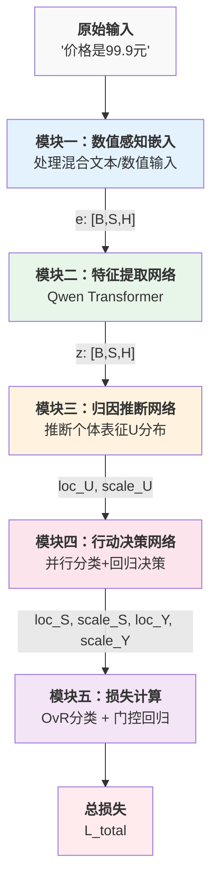

## 1. 模块一：数值感知嵌入 (Numerical-aware Embedding)

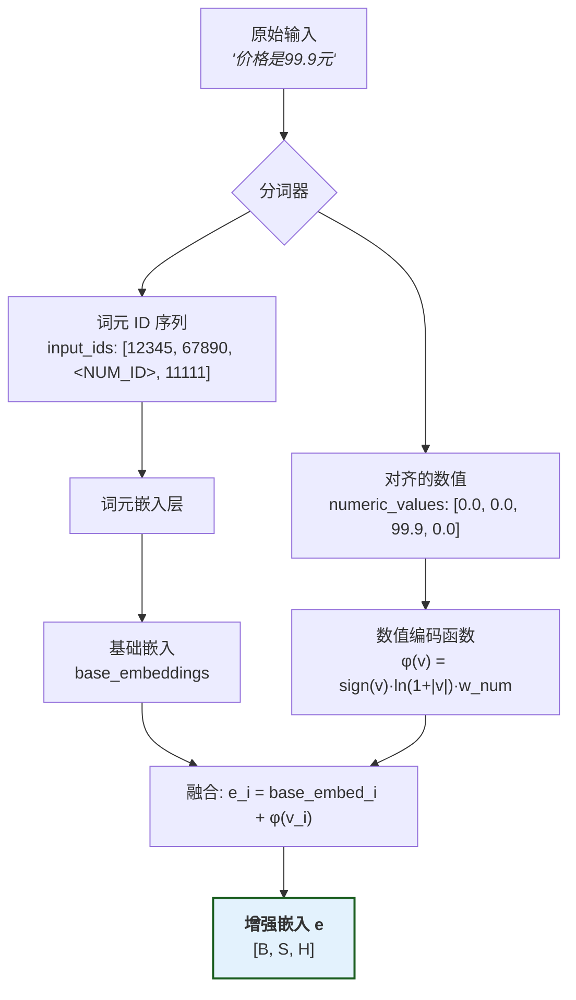

这一模块的目标是将混合了文本和数值的原始输入，转化为一个统一的、数值感知的特征向量序列。

### 1.1 第一步：数值感知的分词处理

分词器将混合文本和数值的原始输入转换为 token IDs 和对齐的数值序列。

**核心实现代码**：

```python
def preprocess_text(text, tokenizer):
    """
    将文本转换为 token IDs 和数值序列
    
    示例:
        输入: "价格是99.9元"
        输出: 
            - input_ids: [12345, 67890, <NUM_ID>, 11111]
            - numeric_values: [0.0, 0.0, 99.9, 0.0]
    """
    import re
    
    # 1. 提取数值并替换为占位符
    number_pattern = re.compile(r'(-?\d+\.?\d*)')
    numeric_values = []
    
    def replace_num(match):
        numeric_values.append(float(match.group(1)))
        return ' _NUM_HOLDER_ '
    
    processed_text = number_pattern.sub(replace_num, text)
    
    # 2. 使用 tokenizer 分词
    tokens = tokenizer.tokenizer(processed_text, return_tensors='pt')
    input_ids = tokens['input_ids'][0]  # [S]
    
    # 3. 替换占位符并对齐数值
    placeholder_id = tokenizer.placeholder_id
    num_token_id = tokenizer.num_token_id
    
    numeric_values_aligned = torch.zeros_like(input_ids, dtype=torch.float32)
    
    # 找到占位符位置并替换
    placeholder_positions = (input_ids == placeholder_id).nonzero(as_tuple=True)[0]
    
    for idx, pos in enumerate(placeholder_positions):
        if idx < len(numeric_values):
            input_ids[pos] = num_token_id
            numeric_values_aligned[pos] = numeric_values[idx]
    
    return input_ids, numeric_values_aligned

# 批处理版本
def batch_preprocess(texts, tokenizer, max_length=512):
    """
    批量处理文本
    
    Args:
        texts: 文本列表
        tokenizer: QwenTokenizerWrapper
        max_length: 最大长度
        
    Returns:
        dict: 包含 input_ids, numeric_values, attention_mask
    """
    batch_input_ids = []
    batch_numeric_values = []
    
    for text in texts:
        input_ids, numeric_values = preprocess_text(text, tokenizer)
        batch_input_ids.append(input_ids)
        batch_numeric_values.append(numeric_values)
    
    # Padding
    max_len = min(max_length, max(len(ids) for ids in batch_input_ids))
    
    padded_input_ids = []
    padded_numeric_values = []
    attention_mask = []
    
    for input_ids, numeric_values in zip(batch_input_ids, batch_numeric_values):
        # 截断
        if len(input_ids) > max_len:
            input_ids = input_ids[:max_len]
            numeric_values = numeric_values[:max_len]
        
        # 填充
        pad_len = max_len - len(input_ids)
        padded_input_ids.append(
            torch.cat([input_ids, torch.full((pad_len,), tokenizer.pad_token_id)])
        )
        padded_numeric_values.append(
            torch.cat([numeric_values, torch.zeros(pad_len)])
        )
        attention_mask.append(
            torch.cat([torch.ones(len(input_ids)), torch.zeros(pad_len)])
        )
    
    return {
        'input_ids': torch.stack(padded_input_ids),  # [B, S]
        'numeric_values': torch.stack(padded_numeric_values),  # [B, S]
        'attention_mask': torch.stack(attention_mask)  # [B, S]
    }

# 使用示例
texts = ["价格是99.9元", "温度-15.5度"]
outputs = batch_preprocess(texts, tokenizer)
print(f"Input IDs shape: {outputs['input_ids'].shape}")
print(f"Numeric values shape: {outputs['numeric_values'].shape}")
```

### 1.2 词元嵌入
将词元ID序列转换为基础嵌入向量：

-   **输入**: `input_ids` (形状: `[B, S]`)
-   **处理**: 通过嵌入层查找每个词元的向量表示
    $$\text{base\_embed}_i = \text{EmbeddingLayer}(\text{input\_ids}_i)$$
-   **输出**: `base_embeddings` (形状: `[B, S, H]`)

### 1.3 数值编码与融合
结合词元的基础嵌入和数值的对数编码，计算出最终的增强嵌入：

-   **输入**: 
    - `base_embeddings` (形状: `[B, S, H]`)
    - `numeric_values` (形状: `[B, S]`)
-   **处理**: 对每个位置 $i$，计算增强嵌入：
    $$e_i = \text{base\_embed}_i + \phi(v_i)$$
    数值编码函数：
    $$\phi(v) = \text{sign}(v) \cdot \ln(1 + |v|) \cdot \vec{w}_{\text{num}}$$
    其中 $v_i$ 是位置 $i$ 的数值（非数值位置为 0），$\vec{w}_{\text{num}} \in \mathbb{R}^H$ 是数值感知嵌入模块的可学习参数向量。
-   **输出**: 
    - `e`: 增强嵌入张量 (形状: `[B, S, H]`)

**关键洞察**：
1. **自然退化**: 对于非数值位置，$v_i = 0$ 导致 $\phi(0) = 0$，因此 $e_i = \text{base\_embed}_i$，自然退化为标准词元嵌入
2. **统一处理**: 所有位置使用相同的计算公式，无需条件分支
3. **位置对齐**: 数值信息与词元序列严格对齐，确保语义的连贯性

**完整示例**:
```
原始文本: "价格是99.9元"
     ↓ (分词器)
input_ids: [12345, 67890, <NUM_ID>, 11111]
numeric_values: [0.0, 0.0, 99.9, 0.0]
     ↓ (嵌入层)
base_embeddings: [[e1], [e2], [e3], [e4]]  # 每个ei是H维向量
     ↓ (数值编码)
φ(numeric_values): [[φ(0)], [φ(0)], [φ(99.9)], [φ(0)]]  # φ(99.9) = ln(100.9) * w_num
     ↓ (融合)
enhanced_embeddings: [[e1], [e2], [e3 + φ(99.9)], [e4]]
```

> **设计动机**: 选择对数编码 $\phi(v)$ 是因为它具有三大优势：1) **数值稳定性**，将大范围数值压缩到合理区间；2) **相对误差保持**，对数空间中的等距对应原空间的等比；3) **自然退化**，由于$\phi(0)=0$，非数值位置自然退化为标准词元嵌入，无需特殊处理。

**完整实现代码**：

```python
def numerical_aware_embedding(input_ids, numeric_values, embed_tokens, numerical_embed):
    """
    数值感知嵌入的完整实现
    
    Args:
        input_ids: [B, S] - 词元ID序列
        numeric_values: [B, S] - 对应的数值
        embed_tokens: 词元嵌入层
        numerical_embed: 数值编码模块
    
    Returns:
        enhanced_embeddings: [B, S, H] - 增强后的嵌入
    """
    # Step 1: 获取基础词元嵌入
    base_embeddings = embed_tokens(input_ids)  # [B, S, H]
    
    # Step 2: 计算数值编码
    # φ(v) = sign(v) * ln(1 + |v|) * w_num
    numeric_encoding = numerical_embed(numeric_values)  # [B, S, H]
    
    # Step 3: 融合
    enhanced_embeddings = base_embeddings + numeric_encoding  # [B, S, H]
    
    return enhanced_embeddings

class NumericalEmbedding(nn.Module):
    """数值编码模块的实现"""
    def __init__(self, hidden_size):
        super().__init__()
        self.direction_vector = nn.Parameter(torch.randn(hidden_size))
        self._init_weights()
    
    def _init_weights(self):
        # 初始化为单位向量
        with torch.no_grad():
            self.direction_vector.data = F.normalize(self.direction_vector.data, dim=0)
    
    def forward(self, numeric_values):
        """
        计算数值编码 φ(v) = sign(v) * ln(1 + |v|) * w_num
        
        Args:
            numeric_values: [B, S] - 数值序列
        
        Returns:
            encoding: [B, S, H] - 数值编码
        """
        # 扩展维度以便广播
        values = numeric_values.unsqueeze(-1)  # [B, S, 1]
        
        # 计算编码
        # sign(v) * ln(1 + |v|)
        magnitude = torch.sign(values) * torch.log1p(torch.abs(values))  # [B, S, 1]
        
        # 与方向向量相乘
        encoding = magnitude * self.direction_vector.unsqueeze(0).unsqueeze(0)  # [B, S, H]
        
        return encoding
```

## 2. 模块二：特征提取网络 (Feature Extraction Network)

该模块使用一个标准的 Transformer 网络（如Qwen）作为主干，来深度理解序列的上下文信息。

-   **输入**: 
    - `e`: 增强嵌入张量 (形状: `[B, S, H]`)
-   **处理**: 增强嵌入序列 `e` 被送入Qwen的Transformer主干网络中。通过多层自注意力机制，网络为每个位置的词元计算出融合了全局上下文信息的深层特征：
    $$z = \text{FeatureNetwork}(e) = \text{QwenTransformer}(e)$$
    
    具体而言，对于第 $l$ 层的 Transformer：
    $$h^{(l)} = \text{TransformerLayer}^{(l)}(h^{(l-1)}), \quad h^{(0)} = e$$
    
    最终输出：
    $$z = h^{(L)} = [z_1, z_2, ..., z_S]$$
    
    其中 $L$ 是 Transformer 的层数。

-   **输出**: 
    - `z`: 上下文特征张量 (形状: `[B, S, H]`)

**初始化后的效果**：由于我们完全继承了 Qwen 的 Transformer 权重，当输入的增强嵌入 $e$ 接近原始 Qwen 嵌入时（数值编码的影响很小），输出 $z$ 也将非常接近原始 Qwen 的特征表示。

### 2.1 Transformer 处理流程图

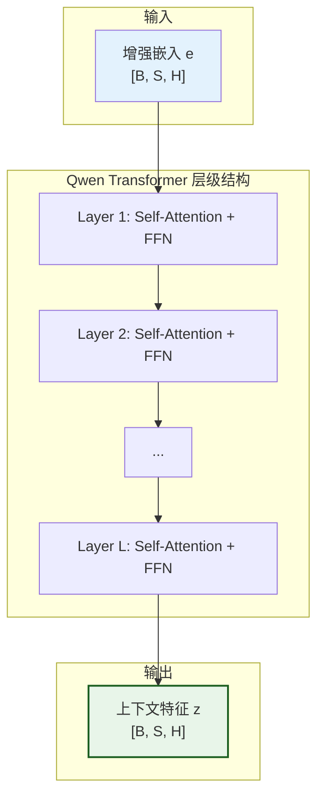

**实现代码**：

```python
def extract_features(enhanced_embeddings, transformer_model, attention_mask=None):
    """
    使用 Transformer 提取上下文特征
    
    Args:
        enhanced_embeddings: [B, S, H] - 增强嵌入
        transformer_model: Qwen Transformer 模型
        attention_mask: [B, S] - 注意力掩码（可选）
    
    Returns:
        features: [B, S, H] - 上下文特征
    """
    # 准备注意力掩码
    if attention_mask is not None:
        # 转换为 Transformer 需要的格式
        # [B, S] -> [B, 1, 1, S]
        attention_mask = attention_mask[:, None, None, :]
        attention_mask = (1.0 - attention_mask) * -10000.0
    
    # 通过 Transformer 层
    hidden_states = enhanced_embeddings
    for layer in transformer_model.layers:
        hidden_states = layer(
            hidden_states,
            attention_mask=attention_mask,
            use_cache=False
        )[0]
    
    # 最后的层归一化
    features = transformer_model.norm(hidden_states)
    
    return features
```

## 3. 模块三：归因推断网络 (Abduction Network)

该模块从上下文特征中推断出每个位置的个体因果表征分布。

-   **输入**: 
    - `z`: 上下文特征张量 (形状: `[B, S, H]`)
-   **处理**: 通过两个独立的线性层，分别计算因果表征的位置和尺度参数：
    
    **位置参数**：
    $$\text{loc}_{U_i} = W_{\text{loc}} \cdot z_i + b_{\text{loc}}$$
    
    **尺度参数**（使用 softplus 保证正值）：
    $$\text{scale}_{U_i} = \text{softplus}(W_{\text{scale}} \cdot z_i + b_{\text{scale}})$$
    
    其中 $\text{softplus}(x) = \log(1 + \exp(x))$ 是一个平滑的 ReLU 近似，具有以下性质：
    - 当 $x \to -\infty$ 时，$\text{softplus}(x) \to 0$
    - 当 $x \to +\infty$ 时，$\text{softplus}(x) \to x$
    - 导数：$\text{softplus}'(x) = \sigma(x) = \frac{1}{1 + \exp(-x)}$
    
-   **输出**: 
    - `loc_U`: 因果表征分布的位置参数 (形状: `[B, S, C]`)
    - `scale_U`: 因果表征分布的尺度参数 (形状: `[B, S, C]`)

**初始化后的具体计算**：根据初始化策略（$W_{\text{loc}} = I$, $b_{\text{loc}} = 0$, $W_{\text{scale}} = 0$, $b_{\text{scale}} = \sigma_{\text{init}}$）：

$$\text{loc}_{U_i} = I \cdot z_i + 0 = z_i$$
$$\text{scale}_{U_i} = \text{softplus}(0 \cdot z_i + \sigma_{\text{init}}) = \text{softplus}(\sigma_{\text{init}}) = \gamma_0 \cdot \mathbf{1}_C$$

因此，初始化后每个位置的因果表征服从：
$$U_i \sim \text{Cauchy}(z_i, \gamma_0 \cdot \mathbf{1}_C)$$

其中 $\gamma_0 = \text{softplus}(\sigma_{\text{init}})$，$\mathbf{1}_C$ 是 C 维的全 1 向量。

### 3.1 归因推断网络结构图

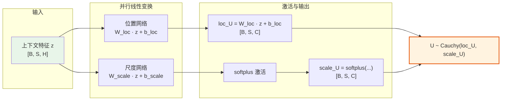

### 3.2 初始化效果可视化

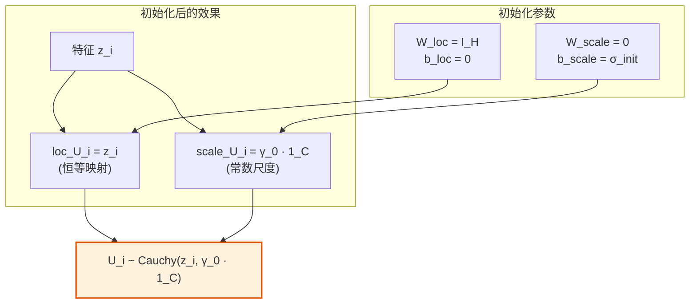

**完整实现代码**：

```python
class AbductionNetwork(nn.Module):
    """归因推断网络的完整实现"""
    
    def __init__(self, hidden_size, causal_hidden_size):
        super().__init__()
        self.loc_net = nn.Linear(hidden_size, causal_hidden_size)
        self.scale_net = nn.Linear(hidden_size, causal_hidden_size)
        
    def forward(self, features):
        """
        从特征推断个体因果表征分布
        
        Args:
            features: [B, S, H] - 上下文特征
        
        Returns:
            loc_U: [B, S, C] - 位置参数
            scale_U: [B, S, C] - 尺度参数（正值）
        """
        # 计算位置参数
        loc_U = self.loc_net(features)  # [B, S, C]
        
        # 计算尺度参数（使用 softplus 保证正值）
        scale_U = F.softplus(self.scale_net(features))  # [B, S, C]
        
        return loc_U, scale_U

def abduction_inference(features, abduction_network):
    """
    执行归因推断
    
    Args:
        features: [B, S, H] - 上下文特征
        abduction_network: 归因推断网络
    
    Returns:
        loc_U: [B, S, C] - 个体表征位置参数
        scale_U: [B, S, C] - 个体表征尺度参数
    """
    loc_U, scale_U = abduction_network(features)
    
    # 可选：添加数值稳定性检查
    scale_U = torch.clamp(scale_U, min=1e-6)
    
    return loc_U, scale_U
```

## 4. 模块四：行动决策网络 (Action Network)

该模块是模型的核心决策单元。其内部包含一个可学习的噪声参数 $b_{\text{noise}} \in \mathbb{R}^C$，工作流程分为两步：

1.  **噪声注入 (Noise Infusion)**：网络将上游推断出的个体表征分布 $U_i \sim \text{Cauchy}(\text{loc}_{U_i}, \text{scale}_{U_i})$ 与代表不可控随机性的外生噪声分布 $\epsilon \sim \text{Cauchy}(0, |b_{\text{noise}}|)$ 进行逐元素的独立叠加，形成融合输入分布：
    $$U'_{i} \sim \text{Cauchy}(\text{loc}_{U_i}, \text{scale}_{U_i} + |b_{\text{noise}}|)$$
    
    这里 $|b_{\text{noise}}|$ 表示对 $b_{\text{noise}} \in \mathbb{R}^C$ 逐元素取绝对值。

2.  **并行决策 (Parallel Decision Making)**：基于包含两种不确定性的融合输入分布，进行分类和回归决策。

-   **输入**: `loc_U` (形状: `[B, S, C]`), `scale_U` (形状: `[B, S, C]`)
-   **处理**: 
    - **分类**：每个词汇 $k$ 有独立的线性变换：
      $$\text{loc}_{S_{k,i}} = W_{\text{cls},k} \cdot \text{loc}_{U_i} + b_{\text{cls},k}$$
      $$\text{scale}_{S_{k,i}} = |W_{\text{cls},k}| \cdot (\text{scale}_{U_i} + |b_{\text{noise}}|)$$
      
      其中 $W_{\text{cls},k} \in \mathbb{R}^C$ 是词汇 $k$ 对应的权重向量，$\cdot$ 表示内积运算，$|W_{\text{cls},k}|$ 表示对权重向量逐元素取绝对值。
      
    - **回归**：单一的线性变换：
      $$\text{loc}_{Y_i} = W_{\text{reg}} \cdot \text{loc}_{U_i} + b_{\text{reg}}$$
      $$\text{scale}_{Y_i} = |W_{\text{reg}}| \cdot (\text{scale}_{U_i} + |b_{\text{noise}}|)$$
      
      其中 $W_{\text{reg}} \in \mathbb{R}^C$ 是回归权重向量，$|W_{\text{reg}}|$ 表示对权重向量逐元素取绝对值。

-   **输出**:
    - 分类决策分布参数: `loc_S` (形状: `[B, S, V_full]`), `scale_S` (形状: `[B, S, V_full]`)
    - 回归决策分布参数: `loc_Y` (形状: `[B, S]`), `scale_Y` (形状: `[B, S]`)

### 4.1 行动网络的双步骤流程

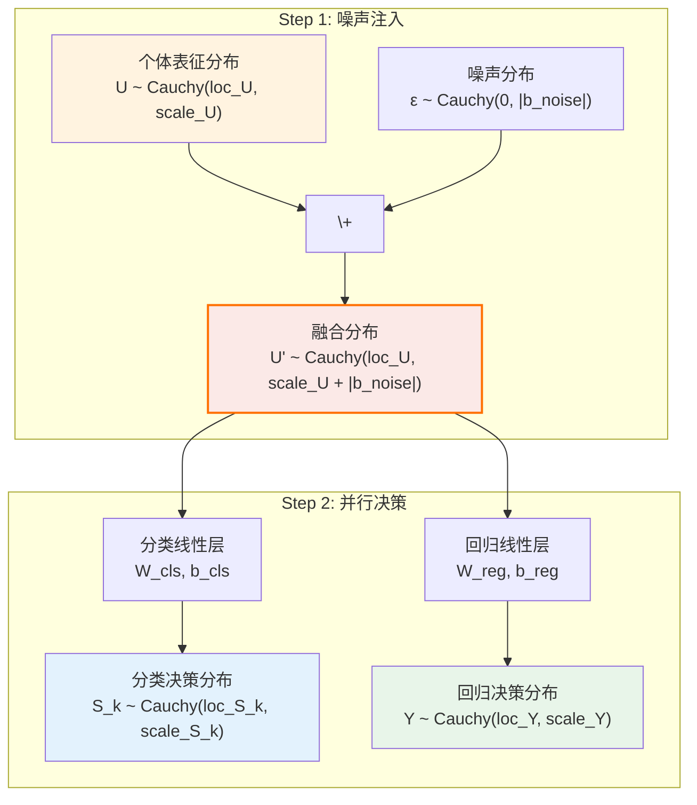

### 4.2 噪声注入的数学原理

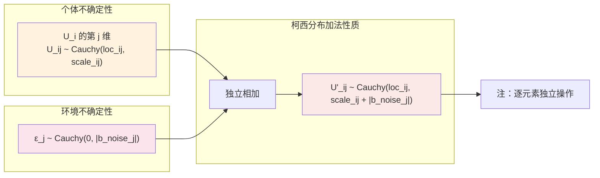

**完整实现代码**：

```python
class ActionNetwork(nn.Module):
    """行动网络的完整实现"""
    
    def __init__(self, causal_hidden_size, vocab_size):
        super().__init__()
        # 分类头
        self.classification_head = nn.Linear(causal_hidden_size, vocab_size)
        # 回归头
        self.regression_head = nn.Linear(causal_hidden_size, 1)
        # 噪声参数
        self.b_noise = nn.Parameter(torch.zeros(causal_hidden_size))
        
    def forward(self, loc_U, scale_U):
        """
        基于个体表征分布进行决策
        
        Args:
            loc_U: [B, S, C] - 个体表征位置参数
            scale_U: [B, S, C] - 个体表征尺度参数
        
        Returns:
            loc_S: [B, S, V] - 分类决策位置参数
            scale_S: [B, S, V] - 分类决策尺度参数
            loc_Y: [B, S] - 回归决策位置参数
            scale_Y: [B, S] - 回归决策尺度参数
        """
        # Step 1: 噪声融合
        # U' ~ Cauchy(loc_U, scale_U + |b_noise|)
        noise_scale = torch.abs(self.b_noise).unsqueeze(0).unsqueeze(0)  # [1, 1, C]
        scale_U_fused = scale_U + noise_scale  # [B, S, C]
        
        # Step 2: 分类决策
        # 计算所有词汇的决策分布参数
        loc_S = self.classification_head(loc_U)  # [B, S, V]
        
        # 对每个词汇 k，scale_S[..., k] = |W_cls[k]| · scale_U_fused
        W_cls_abs = torch.abs(self.classification_head.weight)  # [V, C]
        scale_S = torch.matmul(scale_U_fused, W_cls_abs.T)  # [B, S, V]
        
        # Step 3: 回归决策
        loc_Y = self.regression_head(loc_U).squeeze(-1)  # [B, S]
        
        # scale_Y = |W_reg| · scale_U_fused
        W_reg_abs = torch.abs(self.regression_head.weight)  # [1, C]
        scale_Y = torch.matmul(scale_U_fused, W_reg_abs.T).squeeze(-1)  # [B, S]
        
        return loc_S, scale_S, loc_Y, scale_Y

def action_decision(loc_U, scale_U, action_network):
    """
    执行行动决策
    
    Args:
        loc_U: [B, S, C] - 个体表征位置参数
        scale_U: [B, S, C] - 个体表征尺度参数
        action_network: 行动网络
    
    Returns:
        决策分布参数（分类和回归）
    """
    loc_S, scale_S, loc_Y, scale_Y = action_network(loc_U, scale_U)
    
    # 数值稳定性
    scale_S = torch.clamp(scale_S, min=1e-6)
    scale_Y = torch.clamp(scale_Y, min=1e-6)
    
    return {
        'loc_S': loc_S,
        'scale_S': scale_S,
        'loc_Y': loc_Y,
        'scale_Y': scale_Y
    }
```

## 5. 模块五：损失计算 (Loss Calculation)

### 5.1 OvR 分类损失

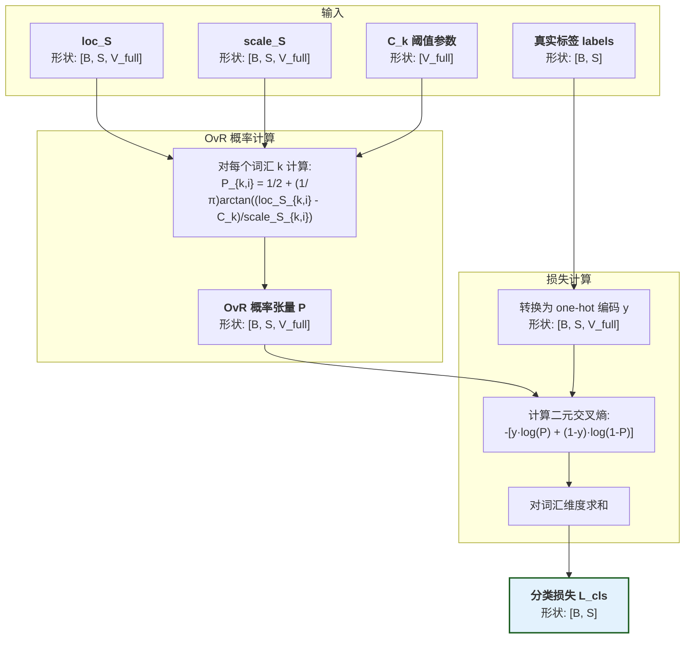

我们不使用标准的 Softmax，而是对每个类别进行独立的"一对多"（One-vs-Rest, OvR）判断。

#### 输入处理
-   **输入**: 
    - 分类决策分布参数: `loc_S`, `scale_S` (形状: `[B, S, V_full]`)
    - 真实标签: `y` (形状: `[B, S]`)，其中 `ignore_index=-100` 表示不需要计算损失的位置
    - 注意力掩码: `attention_mask` (形状: `[B, S]`)
    - OvR 阈值: `C_ovr` - 可以是标量或形状为 `[V_full]` 的张量

#### 损失计算步骤

1. **创建有效位置掩码**：
   $$\text{valid\_mask}_{i} = \mathbb{1}[y_{i} \neq \text{ignore\_index}]$$
   
   其中 $\mathbb{1}[\cdot]$ 是指示函数。

2. **One-hot 编码**（仅对有效位置）：
   $$y_{\text{onehot}, k, i} = \begin{cases}
   1 & \text{if } k = y_{i} \text{ and } \text{valid\_mask}_{i} = 1 \\
   0 & \text{otherwise}
   \end{cases}$$

3. **计算 OvR 概率**：
   $$P_{k,i} = P(S_{k,i} > C_k) = \frac{1}{2} + \frac{1}{\pi} \arctan\left(\frac{\text{loc}_{S_{k,i}} - C_k}{\text{scale}_{S_{k,i}}}\right)$$

   这里利用了柯西分布的 CDF 简洁形式。

4. **计算二元交叉熵损失**：
   $$\mathcal{L}_{\text{bce}, k, i} = -[y_{\text{onehot}, k, i} \log P_{k,i} + (1-y_{\text{onehot}, k, i}) \log (1 - P_{k,i})]$$

5. **聚合并应用掩码**：
   $$L_{\text{cls}, i} = \text{valid\_mask}_{i} \cdot \sum_{k=0}^{V_{\text{full}}-1} \mathcal{L}_{\text{bce}, k, i}$$

    -   **输出**: 
        - `L_cls`: 有效分类损失 (形状: `[B, S]`)，仅在真实标签位置有效

#### 实现示例（PyTorch 风格）

```python
def compute_ovr_classification_loss(loc_S, scale_S, labels, C_ovr=100.0, ignore_index=-100):
    """
    计算 OvR 分类损失，支持 ignore_index
    
    Args:
        loc_S: [B, S, V_full] - 分类位置参数
        scale_S: [B, S, V_full] - 分类尺度参数
        labels: [B, S] - 真实标签，包含 ignore_index
        C_ovr: float 或 Tensor[V_full] - OvR 阈值（标量或每类独立）
        ignore_index: int - 忽略的标签值
    
    Returns:
        loss: [B, S] - 每个位置的损失，忽略位置为0
        valid_mask: [B, S] - 有效位置掩码
    """
    B, S, V = loc_S.shape
    
    # 创建有效位置掩码
    valid_mask = (labels != ignore_index).float()  # [B, S]
    
    # 处理 C_ovr 的不同形式
    if isinstance(C_ovr, (int, float)):
        # 标量：广播到所有类别
        C_ovr = torch.full((V,), C_ovr, device=loc_S.device)
    else:
        # 张量：确保形状正确
        assert C_ovr.shape == (V,), f"C_ovr shape must be ({V},), got {C_ovr.shape}"
    
    # 计算 OvR 概率
    # 广播 C_ovr: [V] -> [1, 1, V]
    C_ovr = C_ovr.unsqueeze(0).unsqueeze(0)
    z = (loc_S - C_ovr) / scale_S  # [B, S, V]
    P = 0.5 + torch.atan(z) / math.pi  # [B, S, V]
    
    # 创建 one-hot 标签（仅对有效位置）
    y_onehot = torch.zeros_like(loc_S)  # [B, S, V]
    valid_labels = labels.clone()
    valid_labels[labels == ignore_index] = 0  # 临时设置为0避免索引错误
    y_onehot.scatter_(2, valid_labels.unsqueeze(-1), 1) # cmt: 上一步的设置能避免索引错误
    y_onehot = y_onehot * valid_mask.unsqueeze(-1)  # 应用掩码
    
    # 计算二元交叉熵（数值稳定版本）
    eps = 1e-7
    bce = -(y_onehot * torch.log(P + eps) + 
            (1 - y_onehot) * torch.log(1 - P + eps))  # [B, S, V]
    
    # 对词汇表维度求和
    loss = bce.sum(dim=-1)  # [B, S]
    
    # 应用有效位置掩码
    loss = loss * valid_mask  # [B, S]
    
    return loss, valid_mask
```

#### 阈值设计的灵活性

| 阈值形式 | 用途 | 优势 |
|---------|------|------|
| **标量阈值** | 所有类别共享 | 简单，参数少 |
| **向量阈值** | 每类独立阈值 | 灵活，可学习 |
| **可学习参数** | 通过梯度优化 | 自适应调整 |

> **设计展望**：将 `C_ovr` 设计为可学习参数后，模型可以：
> - 为高频词设置较低阈值（更容易被选中）
> - 为低频词设置较高阈值（需要更强信号）
> - 自动学习词汇的"激活难度"分布

### 5.2 门控回归损失

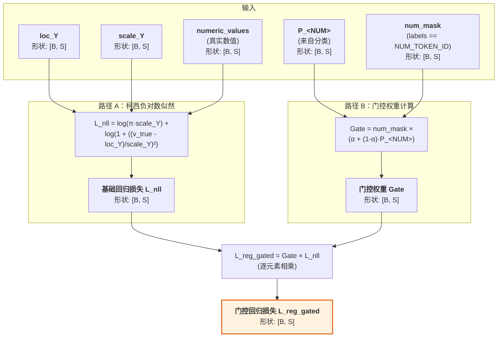

我们只在目标为 `<NUM>` 的位置计算回归损失。

-   **输入**: 
    - 回归决策分布参数: `loc_Y`, `scale_Y` (形状: `[B, S]`)
    - 真实数值: `numeric_values` (形状: `[B, S]`)
    - `<NUM>`词元的预测概率: $P_{\text{<NUM>},i}$
    - 数值位置掩码: `num_mask` (形状: `[B, S]`)
-   **处理**： 
    
    柯西分布的负对数似然：
    $$\mathcal{L}_{\text{nll},i} = \log(\pi \cdot \text{scale}_{Y_i}) + \log\left(1 + \left(\frac{v_{\text{true},i} - \text{loc}_{Y_i}}{\text{scale}_{Y_i}}\right)^2\right)$$
    
    门控机制（$\alpha$ 默认为0）：
    $$\text{gate}_i = m_i \cdot \left(\alpha + (1-\alpha) \cdot P_{\text{<NUM>},i}\right)$$
    
    最终损失：
    $$\mathcal{L}_{\text{reg\_gated},i} = \text{gate}_i \cdot \mathcal{L}_{\text{nll},i}$$
    
    其中 $m_i = \mathbb{1}[y_i = \text{<NUM>}]$ 是数值位置掩码。

**完整实现代码**：

```python
def compute_gated_regression_loss(loc_Y, scale_Y, numeric_values, P_num, num_mask, alpha=0.0):
    """
    计算门控回归损失
    
    Args:
        loc_Y: [B, S] - 回归位置参数
        scale_Y: [B, S] - 回归尺度参数
        numeric_values: [B, S] - 真实数值
        P_num: [B, S] - <NUM> 词元的 OvR 概率
        num_mask: [B, S] - 数值位置掩码
        alpha: float - 门控系数（默认0，完全依赖分类概率）
    
    Returns:
        loss_gated: [B, S] - 门控回归损失
    """
    # 计算柯西分布的负对数似然
    # L_nll = log(π·scale) + log(1 + ((y_true - loc) / scale)²)
    residual = (numeric_values - loc_Y) / scale_Y  # [B, S]
    nll = torch.log(math.pi * scale_Y) + torch.log1p(residual ** 2)  # [B, S]
    
    # 计算门控权重
    # gate = num_mask * (alpha + (1 - alpha) * P_num)
    gate = num_mask * (alpha + (1 - alpha) * P_num)  # [B, S]
    
    # 应用门控
    loss_gated = gate * nll  # [B, S]
    
    return loss_gated
```

### 5.3 总损失的合并

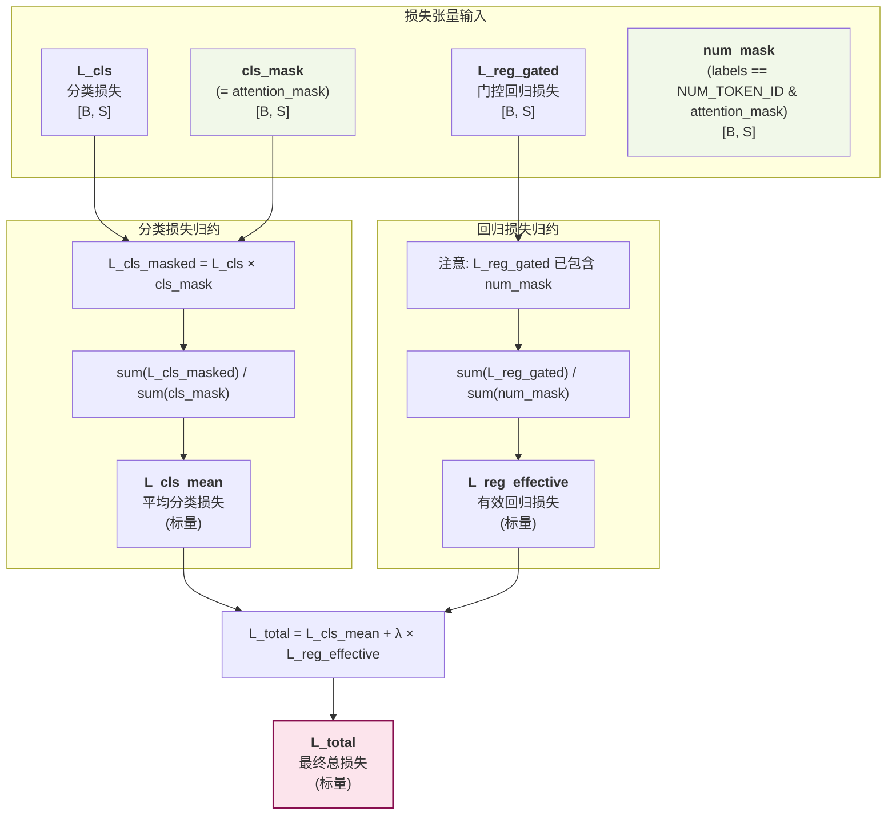

#### 实现示例（PyTorch 风格）

```python
def compute_total_loss(loc_S, scale_S, loc_Y, scale_Y, labels, numeric_values, 
                      attention_mask, num_token_id, C_ovr=100.0, 
                      reg_weight=1.0, alpha=0.0, ignore_index=-100):
    """
    计算 CausalQwen 的总损失
    
    Args:
        loc_S, scale_S: 分类决策分布参数
        loc_Y, scale_Y: 回归决策分布参数
        labels: 真实标签
        numeric_values: 真实数值
        attention_mask: 注意力掩码
        num_token_id: <NUM> 词元的 ID
        C_ovr: OvR 阈值
        reg_weight: 回归损失权重 λ
        alpha: 门控系数
        ignore_index: 忽略的标签值
    
    Returns:
        total_loss: 标量总损失
        loss_dict: 包含各部分损失的字典
    """
    # 1. 计算 OvR 分类损失
    cls_loss, valid_mask = compute_ovr_classification_loss(
        loc_S, scale_S, labels, C_ovr, ignore_index
    )
    
    # 2. 创建掩码
    cls_mask = attention_mask  # [B, S]
    num_mask = ((labels == num_token_id) & (attention_mask > 0)).float()  # [B, S]
    
    # 3. 计算 <NUM> 词元的预测概率（用于门控）
    # 提取 <NUM> 词元的决策分布参数
    loc_S_num = loc_S[:, :, num_token_id]  # [B, S]
    scale_S_num = scale_S[:, :, num_token_id]  # [B, S]
    
    # 计算 P(<NUM>)
    z_num = (loc_S_num - C_ovr) / scale_S_num
    P_num = 0.5 + torch.atan(z_num) / math.pi  # [B, S]
    
    # 4. 计算门控回归损失
    reg_loss_gated = compute_gated_regression_loss(
        loc_Y, scale_Y, numeric_values, P_num, num_mask, alpha
    )
    
    # 5. 归约损失
    # 分类损失：在所有有效位置上平均
    n_cls = cls_mask.sum()
    cls_loss_mean = (cls_loss * cls_mask).sum() / n_cls.clamp(min=1)
    
    # 回归损失：仅在数值位置上平均
    n_reg = num_mask.sum()
    reg_loss_effective = reg_loss_gated.sum() / n_reg.clamp(min=1)
    
    # 6. 总损失
    total_loss = cls_loss_mean + reg_weight * reg_loss_effective
    
    return total_loss, {
        'cls_loss_mean': cls_loss_mean.item(),
        'reg_loss_effective': reg_loss_effective.item(),
        'total_loss': total_loss.item(),
        'n_cls': n_cls.item(),
        'n_reg': n_reg.item()
    }
```

## 实现要点总结

1. **数值感知嵌入**：通过对数编码 $\phi(v)$ 实现了文本和数值的统一表示
2. **柯西分布的线性稳定性**：使得整个前向传播可以在参数空间完成，无需采样
3. **OvR 分类**：独立的二元判断避免了 softmax 的归一化约束
4. **门控回归**：智能地将分类置信度用于回归损失的加权
5. **分离归约**：不同的平均基数确保回归信号不被稀释

这种设计使得 CausalQwen 能够在单一架构中同时处理文本生成和数值预测任务。

### 总体数据流与维度变化图

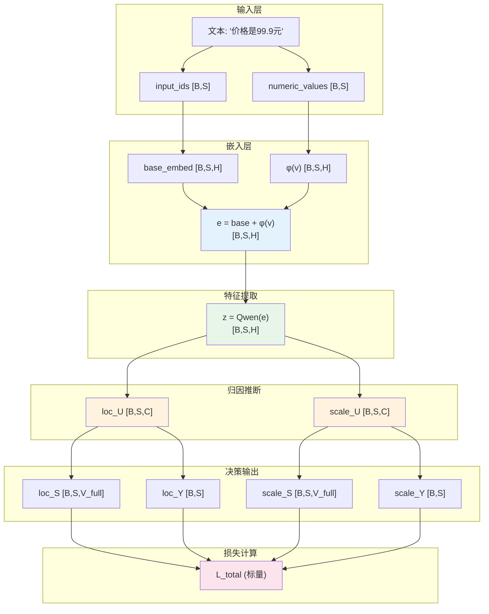
