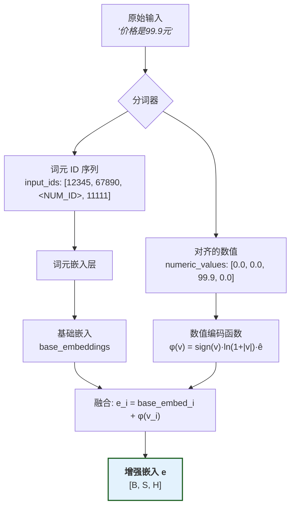
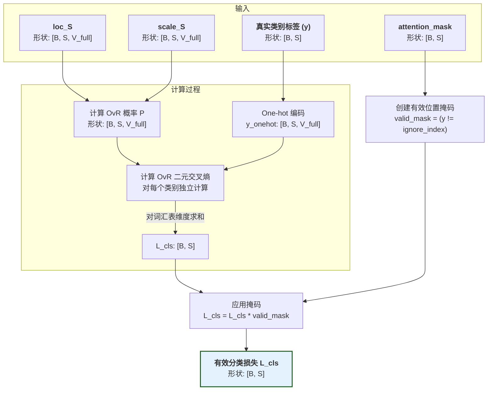
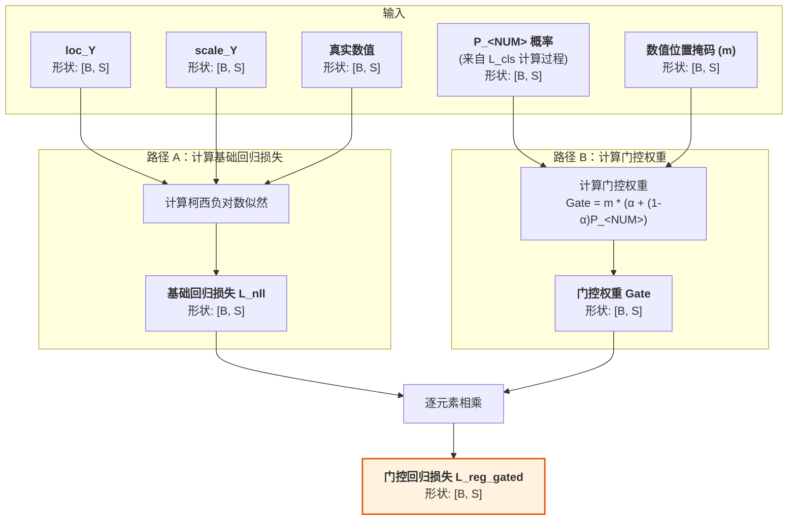
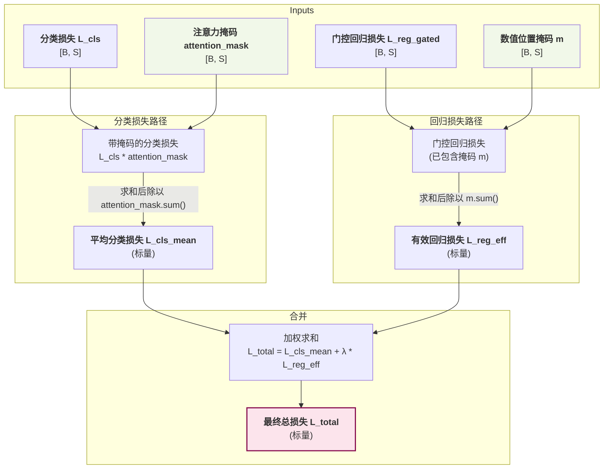

# 前向传播详解

本文档提供 CausalQwen 训练阶段前向传播的完整数学推导和实现细节。

> 返回主文档：[`../mathematical_foundations.md`](../mathematical_foundations.md)

## 符号约定

我们用 B 代表批次大小, S 代表序列长度, H 代表模型核心维度 (即词嵌入和隐藏层维度), C 代表因果表征维度, K 代表基座模型 Qwen 的已用词汇表大小, V_full代表总词汇表大小, CausalQwen 的已用词汇表大小为 K+1 (K+1 包含基座模型 Qwen 的已用词汇表大小 K 和 CausalQwen 的额外词汇 `<NUM>`)

> **设计决策**: 在当前实现中，我们设定因果表征维度 `C` 与模型隐藏层维度 `H` 相等，即 **`C = H`**。这方便了我们进行归因推断网络的初始化。

## 前向传播总览


## 1. 模块一：数值感知嵌入 (Numerical-aware Embedding)



这一模块的目标是将混合了文本和数值的原始输入，转化为一个统一的、数值感知的特征向量序列。

### 1.1 分词与数值识别
分词器处理原始文本，识别并替换数值：

1.  **数值识别**: 分词器扫描文本，识别数值模式（如 `99.9`）
2.  **词元替换**: 将识别出的数值替换为特殊词元 `<NUM>`
3.  **数值保存**: 将原始数值单独保存，与词元序列保持位置对齐

-   **输出**: 
    - `input_ids` $[x_1, ..., x_S]$: `['价格', '是', '<NUM>', '元']` → `[12345, 67890, <NUM_ID>, 11111]` (形状: `[B, S]`)
    - `numeric_values` $[v_1, ..., v_S]$: `[0.0, 0.0, 99.9, 0.0]` (形状: `[B, S]`)

### 1.2 词元嵌入
将词元ID序列转换为基础嵌入向量：

-   **输入**: `input_ids` (形状: `[B, S]`)
-   **处理**: 通过嵌入层查找每个词元的向量表示
    $$\text{base\_embed}_i = \text{EmbeddingLayer}(\text{input\_ids}_i)$$
-   **输出**: `base_embeddings` (形状: `[B, S, H]`)

### 1.3 数值编码与融合
结合词元的基础嵌入和数值的对数编码，计算出最终的增强嵌入：

-   **输入**: 
    - `base_embeddings` (形状: `[B, S, H]`)
    - `numeric_values` (形状: `[B, S]`)
-   **处理**: 对每个位置 $i$，计算增强嵌入：
    $$e_i = \text{base\_embed}_i + \phi(v_i)$$
    数值编码函数：
    $$\phi(v) = \text{sign}(v) \cdot \ln(1 + |v|) \cdot \vec{e}$$
    其中 $v_i$ 是位置 $i$ 的数值（非数值位置为 0），$\vec{e}$ 是归一化的方向向量，$\|\vec{e}\| = 1$。
-   **输出**: 
    - `e`: 增强嵌入张量 (形状: `[B, S, H]`)

**关键洞察**：
1. **自然退化**: 对于非数值位置，$v_i = 0$ 导致 $\phi(0) = 0$，因此 $e_i = \text{base\_embed}_i$，自然退化为标准词元嵌入
2. **统一处理**: 所有位置使用相同的计算公式，无需条件分支
3. **位置对齐**: 数值信息与词元序列严格对齐，确保语义的连贯性

**完整示例**:
```
原始文本: "价格是99.9元"
     ↓ (分词器)
input_ids: [12345, 67890, <NUM_ID>, 11111]
numeric_values: [0.0, 0.0, 99.9, 0.0]
     ↓ (嵌入层)
base_embeddings: [[e1], [e2], [e3], [e4]]  # 每个ei是H维向量
     ↓ (数值编码)
φ(numeric_values): [[φ(0)], [φ(0)], [φ(99.9)], [φ(0)]]  # φ(99.9) = ln(100.9) * ê
     ↓ (融合)
enhanced_embeddings: [[e1], [e2], [e3 + φ(99.9)], [e4]]
```

> **设计动机**: 选择对数编码 $\phi(v)$ 是因为它具有三大优势：1) **数值稳定性**，将大范围数值压缩到合理区间；2) **相对误差保持**，对数空间中的等距对应原空间的等比；3) **自然退化**，由于$\phi(0)=0$，非数值位置自然退化为标准词元嵌入，无需特殊处理。

## 2. 模块二：特征提取网络 (Feature Extraction Network)

该模块使用一个标准的 Transformer 网络（如Qwen）作为主干，来深度理解序列的上下文信息。

-   **输入**: 
    - `e`: 增强嵌入张量 (形状: `[B, S, H]`)
-   **处理**: 增强嵌入序列 `e` 被送入Qwen的Transformer主干网络中。通过多层自注意力机制，网络为每个位置的词元计算出融合了全局上下文信息的深层特征：
    $$z = \text{FeatureNetwork}(e) = \text{QwenTransformer}(e)$$
    
    具体而言，对于第 $l$ 层的 Transformer：
    $$h^{(l)} = \text{TransformerLayer}^{(l)}(h^{(l-1)}), \quad h^{(0)} = e$$
    
    最终输出：
    $$z = h^{(L)} = [z_1, z_2, ..., z_S]$$
    
    其中 $L$ 是 Transformer 的层数。

-   **输出**: 
    - `z`: 上下文特征张量 (形状: `[B, S, H]`)

**初始化后的效果**：由于我们完全继承了 Qwen 的 Transformer 权重，当输入的增强嵌入 $e$ 接近原始 Qwen 嵌入时（数值编码的影响很小），输出 $z$ 也将非常接近原始 Qwen 的特征表示。

## 3. 模块三：归因推断网络 (Abduction Network)

该模块从上下文特征中推断出每个位置的、更深层次的个体因果表征。这对应着"你是谁？"的归因过程。

-   **输入**: 
    - `z`: 上下文特征张量 (形状: `[B, S, H]`)
-   **处理**: 通过两个独立的线性层，分别计算因果表征的位置和尺度参数：
    
    **位置参数**：
    $$\text{loc}_{U_i} = W_{\text{loc}} \cdot z_i + b_{\text{loc}}$$
    
    **尺度参数**（使用 softplus 保证正值）：
    $$\text{scale}_{U_i} = \text{softplus}(W_{\text{scale}} \cdot z_i + b_{\text{scale}})$$
    
    其中 $\text{softplus}(x) = \log(1 + \exp(x))$ 是一个平滑的 ReLU 近似，具有以下性质：
    - 当 $x \to -\infty$ 时，$\text{softplus}(x) \to 0$
    - 当 $x \to +\infty$ 时，$\text{softplus}(x) \to x$
    - 导数：$\text{softplus}'(x) = \sigma(x) = \frac{1}{1 + \exp(-x)}$
    
-   **输出**: 
    - `loc_U`: 因果表征分布的位置参数 (形状: `[B, S, C]`)
    - `scale_U`: 因果表征分布的尺度参数 (形状: `[B, S, C]`)

**初始化后的具体计算**：根据初始化策略（$W_{\text{loc}} = I$, $b_{\text{loc}} = 0$, $W_{\text{scale}} = 0$, $b_{\text{scale}} = \text{softplus}^{-1}(\gamma)$）：

$$\text{loc}_{U_i} = I \cdot z_i + 0 = z_i$$
$$\text{scale}_{U_i} = \text{softplus}(0 \cdot z_i + \text{softplus}^{-1}(\gamma)) = \text{softplus}(\text{softplus}^{-1}(\gamma)) = \gamma$$

因此，初始化后每个位置的因果表征服从：
$$U_i \sim \text{Cauchy}(z_i, \gamma)$$

> **数值稳定性优势**：相比 exp 函数，softplus 在输入为负数时不会产生极小的正数（可能导致数值下溢），在输入为正数时增长速度更缓慢（避免数值上溢）。

## 4. 模块四：行动决策网络 (Action Network)

该模块基于推断出的因果表征分布，进行并行的分类和回归决策。

### 4.1 分类决策

对于词汇表中的每个词汇 $k$：

**一般形式**：
$$\text{loc}_{S_{k,i}} = W_{\text{cls},k} \cdot \text{loc}_{U_i} + b_{\text{cls},k}$$
$$\text{scale}_{S_{k,i}} = |W_{\text{cls},k}| \cdot \text{scale}_{U_i}$$

其中 $W_{\text{cls},k}$ 是第 $k$ 个词汇对应的权重向量（形状：`[C]`），$|W_{\text{cls},k}|$ 表示对每个元素取绝对值。

**初始化后的计算**：由于 $W_{\text{cls}} = W_{\text{Qwen\_lm\_head}}$，$b_{\text{cls}} = 0$，且 $\text{loc}_{U_i} = z_i$：

$$\text{loc}_{S_{k,i}} = W_{\text{Qwen},k} \cdot z_i + 0 = W_{\text{Qwen},k} \cdot z_i$$

这正是原始 Qwen 的 logits！同时：
$$\text{scale}_{S_{k,i}} = |W_{\text{Qwen},k}| \cdot \gamma$$

因此，每个词汇的决策分数服从：
$$S_{k,i} \sim \text{Cauchy}(W_{\text{Qwen},k} \cdot z_i, |W_{\text{Qwen},k}| \cdot \gamma)$$

### 4.2 回归决策

**一般形式**：
$$\text{loc}_{Y_i} = W_{\text{reg}} \cdot \text{loc}_{U_i} + b_{\text{reg}}$$
$$\text{scale}_{Y_i} = \|W_{\text{reg}}\|_1 \cdot \text{scale}_{U_i}$$

其中 $\|W_{\text{reg}}\|_1 = \sum_j |W_{\text{reg},j}|$ 是权重向量的 L1 范数。

**初始化后的计算**：使用标准初始化（如 Xavier），$W_{\text{reg}}$ 的元素较小，因此：

$$\text{loc}_{Y_i} = W_{\text{reg}} \cdot z_i + b_{\text{reg}} \approx b_{\text{reg}} \approx 0$$
$$\text{scale}_{Y_i} = \|W_{\text{reg}}\|_1 \cdot \gamma \approx \epsilon \cdot \gamma$$

其中 $\epsilon$ 是一个小值。回归输出服从近似以 0 为中心的宽泛分布：
$$Y_i \sim \text{Cauchy}(0, \epsilon \cdot \gamma)$$

### 4.3 柯西分布的线性稳定性验证

这里我们验证为什么线性变换保持柯西分布的性质。如果 $U \sim \text{Cauchy}(\mu, \gamma)$，对于线性变换 $Y = aU + b$：

1. **位置参数变换**：
   $$E[\tan(\pi(F_Y(y) - 0.5))] = E[\tan(\pi(F_U(\frac{y-b}{a}) - 0.5))] = \frac{\mu a + b - y}{a} \cdot \frac{a}{\gamma} = \frac{a\mu + b - y}{|a|\gamma}$$

2. **尺度参数变换**：
   由累积分布函数的变换关系：
   $$F_Y(y) = F_U\left(\frac{y-b}{a}\right)$$
   
   可得 $Y \sim \text{Cauchy}(a\mu + b, |a|\gamma)$。

这就是为什么我们可以直接在参数空间进行计算，而无需采样。

-   **输出**:
    - 分类决策分布参数: `loc_S` (形状: `[B, S, V_full]`), `scale_S` (形状: `[B, S, V_full]`)
    - 回归决策分布参数: `loc_Y` (形状: `[B, S]`), `scale_Y` (形状: `[B, S]`)

> **核心引擎：柯西分布的线性稳定性**
> 如果 $U \sim \text{Cauchy}(\mu, \gamma)$，那么线性变换后 $Y = aU + b \sim \text{Cauchy}(a\mu + b, |a|\gamma)$。这让我们可以直接在参数空间计算，无需采样。

## 5. 模块五：损失计算 (Loss Calculation)

此模块计算模型预测与真实标签之间的差异，为反向传播提供依据。

### 5.1 OvR 分类损失



我们不使用标准的 Softmax，而是对每个类别进行独立的"一对多"（One-vs-Rest, OvR）判断。

#### 输入处理
-   **输入**: 
    - 分类决策分布参数: `loc_S`, `scale_S` (形状: `[B, S, V_full]`)
    - 真实标签: `y` (形状: `[B, S]`)，其中 `ignore_index=-100` 表示不需要计算损失的位置
    - 注意力掩码: `attention_mask` (形状: `[B, S]`)
    - OvR 阈值: `C_ovr` - 可以是标量或形状为 `[V_full]` 的张量

#### 损失计算步骤

1. **创建有效位置掩码**：
   $$\text{valid\_mask}_{i} = \mathbb{1}[y_{i} \neq \text{ignore\_index}]$$
   
   其中 $\mathbb{1}[\cdot]$ 是指示函数。

2. **One-hot 编码**（仅对有效位置）：
   $$y_{\text{onehot}, k, i} = \begin{cases}
   1 & \text{if } k = y_{i} \text{ and } \text{valid\_mask}_{i} = 1 \\
   0 & \text{otherwise}
   \end{cases}$$

3. **计算 OvR 概率**：
   $$P_{k,i} = P(S_{k,i} > C_k) = \frac{1}{2} + \frac{1}{\pi} \arctan\left(\frac{\text{loc}_{S_{k,i}} - C_k}{\text{scale}_{S_{k,i}}}\right)$$

4. **计算二元交叉熵损失**：
   $$\mathcal{L}_{\text{bce}, k, i} = -[y_{\text{onehot}, k, i} \log P_{k,i} + (1-y_{\text{onehot}, k, i}) \log (1 - P_{k,i})]$$

5. **聚合并应用掩码**：
   $$L_{\text{cls}, i} = \text{valid\_mask}_{i} \cdot \sum_{k=0}^{V_{\text{full}}-1} \mathcal{L}_{\text{bce}, k, i}$$

    -   **输出**: 
        - `L_cls`: 有效分类损失 (形状: `[B, S]`)，仅在真实标签位置有效

#### 实现示例（PyTorch 风格）

```python
def compute_ovr_classification_loss(loc_S, scale_S, labels, C_ovr=100.0, ignore_index=-100):
    """
    计算 OvR 分类损失，支持 ignore_index
    
    Args:
        loc_S: [B, S, V_full] - 分类位置参数
        scale_S: [B, S, V_full] - 分类尺度参数
        labels: [B, S] - 真实标签，包含 ignore_index
        C_ovr: float 或 Tensor[V_full] - OvR 阈值（标量或每类独立）
        ignore_index: int - 忽略的标签值
    
    Returns:
        loss: [B, S] - 每个位置的损失，忽略位置为0
        valid_mask: [B, S] - 有效位置掩码
    """
    B, S, V = loc_S.shape
    
    # 创建有效位置掩码
    valid_mask = (labels != ignore_index).float()  # [B, S]
    
    # 处理 C_ovr 的不同形式
    if isinstance(C_ovr, (int, float)):
        # 标量：广播到所有类别
        C_ovr = torch.full((V,), C_ovr, device=loc_S.device)
    else:
        # 张量：确保形状正确
        assert C_ovr.shape == (V,), f"C_ovr shape must be ({V},), got {C_ovr.shape}"
    
    # 计算 OvR 概率
    # 广播 C_ovr: [V] -> [1, 1, V]
    C_ovr = C_ovr.unsqueeze(0).unsqueeze(0)
    z = (loc_S - C_ovr) / scale_S  # [B, S, V]
    P = 0.5 + torch.atan(z) / math.pi  # [B, S, V]
    
    # 创建 one-hot 标签（仅对有效位置）
    y_onehot = torch.zeros_like(loc_S)  # [B, S, V]
    valid_labels = labels.clone()
    valid_labels[labels == ignore_index] = 0  # 临时设置为0避免索引错误
    y_onehot.scatter_(2, valid_labels.unsqueeze(-1), 1) # cmt: 上一步的设置能避免索引错误
    y_onehot = y_onehot * valid_mask.unsqueeze(-1)  # 应用掩码
    
    # 计算二元交叉熵（数值稳定版本）
    eps = 1e-7
    bce = -(y_onehot * torch.log(P + eps) + 
            (1 - y_onehot) * torch.log(1 - P + eps))  # [B, S, V]
    
    # 对词汇表维度求和
    loss = bce.sum(dim=-1)  # [B, S]
    
    # 应用有效位置掩码
    loss = loss * valid_mask  # [B, S]
    
    return loss, valid_mask
```

#### 阈值设计的灵活性

| 阈值形式 | 用途 | 优势 |
|---------|------|------|
| **标量阈值** | 所有类别共享 | 简单，参数少 |
| **向量阈值** | 每类独立阈值 | 灵活，可学习 |
| **可学习参数** | 通过梯度优化 | 自适应调整 |

> **设计展望**：将 `C_ovr` 设计为可学习参数后，模型可以：
> - 为高频词设置较低阈值（更容易被选中）
> - 为低频词设置较高阈值（需要更强信号）
> - 自动学习词汇的"激活难度"分布

### 5.2 门控回归损失



我们只在目标为 `<NUM>` 的位置计算回归损失。

-   **输入**: 
    - 回归决策分布参数: `loc_Y`, `scale_Y` (形状: `[B, S]`)
    - 真实数值: `true_numeric_values` (形状: `[B, S]`)
    - `<NUM>`词元的预测概率: $P_{\text{<NUM>},i}$
-   **处理**： 
    
    柯西分布的负对数似然：
    $$\mathcal{L}_{\text{nll},i} = \log(\pi \cdot \text{scale}_{Y_i}) + \log\left(1 + \left(\frac{y_{\text{true},i} - \text{loc}_{Y_i}}{\text{scale}_{Y_i}}\right)^2\right)$$
    
    门控机制（$\alpha$ 默认为0）：
    $$\text{gate}_i = m_i \cdot \left(\alpha + (1-\alpha) \cdot P_{\text{<NUM>},i}\right)$$
    
    最终损失：
    $$\mathcal{L}_{\text{reg\_gated},i} = \text{gate}_i \cdot \mathcal{L}_{\text{nll},i}$$
    
    其中 $m_i = \mathbb{1}[y_i = \text{<NUM>}]$ 是数值位置掩码。

### 5.3 总损失的合并



最终的总损失由平均分类损失和有效的平均回归损失加权构成。

1.  **平均分类损失**：对所有有效词元的分类损失求平均
    $$\mathcal{L}_{\text{cls\_mean}} = \frac{\sum_{i \in \text{valid}} L_{\text{cls}, i}}{\sum_{i} \text{valid\_mask}_i}$$

2.  **有效回归损失**：只对数值词元的回归损失求平均
    $$\mathcal{L}_{\text{reg\_eff}} = \frac{\sum_{i} \mathcal{L}_{\text{reg\_gated},i}}{\sum_{i} m_{i}}$$

3.  **最终总损失**：
    $$\mathcal{L}_{\text{total}} = \mathcal{L}_{\text{cls\_mean}} + \lambda \cdot \mathcal{L}_{\text{reg\_eff}}$$

这种分离求平均的方式是模型能够同时有效学习分类和回归任务的关键。

## 实现要点总结

1. **数值感知嵌入**：通过对数编码 $\phi(v)$ 实现了文本和数值的统一表示
2. **柯西分布的线性稳定性**：使得整个前向传播可以在参数空间完成，无需采样
3. **OvR 分类**：独立的二元判断避免了 softmax 的归一化约束
4. **门控回归**：智能地将分类置信度用于回归损失的加权
5. **分离归约**：不同的平均基数确保回归信号不被稀释

这种设计使得 CausalQwen 能够在单一架构中同时处理文本生成和数值预测任务。
