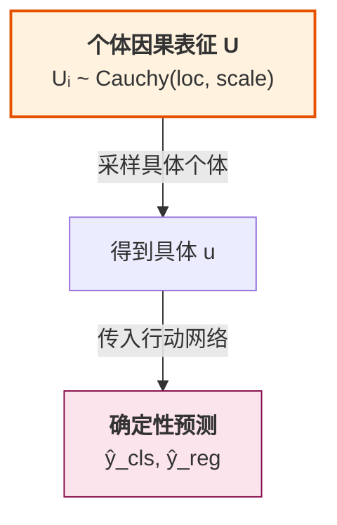
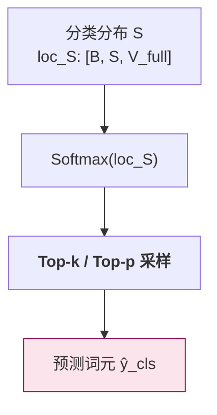
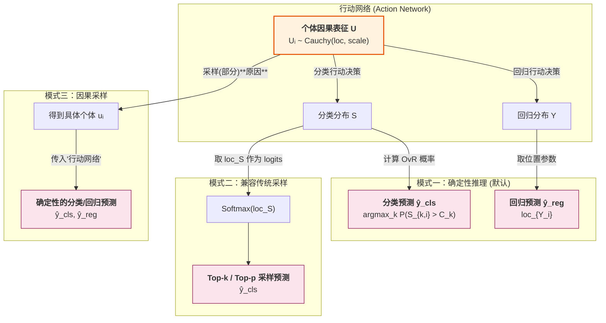
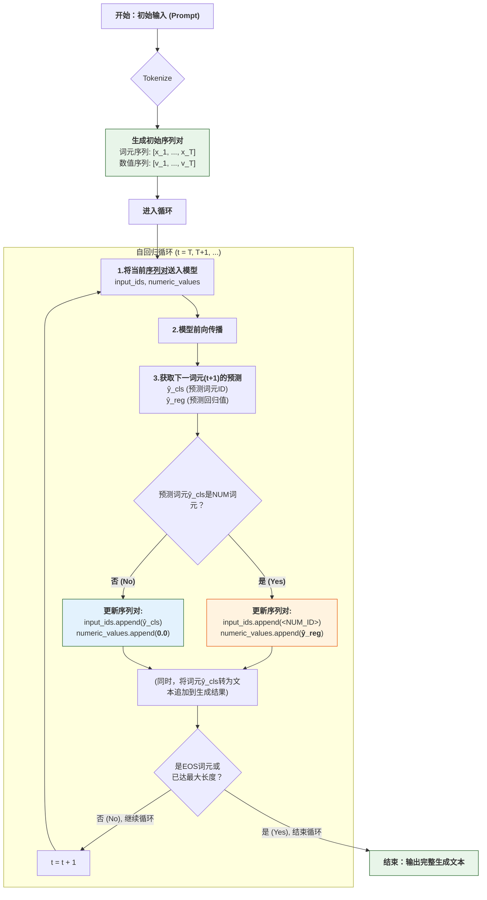

# 推理模式详解

本文档详细介绍 CausalQwen 的三种推理模式及其高级技巧。

> 返回主文档：[`../mathematical_foundations.md`](../mathematical_foundations.md)

## 1. 确定性推理 (Deterministic Inference)

这是默认的、最高效的推理模式。它完全基于解析计算，不涉及任何随机采样。

- **分类预测**: 直接使用前向传播计算出的各类 OvR 概率，并选择概率最高的类别。
    $$
    \hat{y}_{\text{cls},i} = \arg\max_k P_{k,i}
    $$
- **回归预测**: 直接使用回归值分布的位置参数（中位数），这是对柯西分布最稳健的点估计。
    $$
    \hat{y}_{\text{reg},i} = \text{loc}_{Y_i}
    $$

## 2. 因果采样 (Causal Sampling)

这是一种新颖的随机推理范式，它不直接对不确定的"结果"进行采样，而是对不确定的"原因"（即个体因果表征 U）进行采样 .... 

### 基本流程

1.  **采样"原因"**: 根据上下文推断出的因果表征分布 `Cauchy(loc_U, scale_U)`，从中采样一个**具体的**表征向量 $u$。
2.  **观察"结果"**: 将这个确定的 $u$ 传入**行动网络**，得到**确定性的**分类分数和回归值，并据此做出最终预测。



## 2.2 采样部分原因

我们如果对于 $U~Cauchy$ 的每个分量都进行采样， 得到的分类得分 $s$ 将会退化成一个数值，将会对具体预测哪个类别造成困难， 


### 2.2 共享随机性：因果采样的高级模式

因果采样的一个核心优势，在于通过**重参数化技巧 (Reparameterization Trick)**，实现了对生成过程随机性的精细控制。

#### 重参数化的数学形式

为了从推断出的因果表征分布 $\text{Cauchy}(\text{loc}_{U_i}, \text{scale}_{U_i})$ 中采样，我们执行一个确定性变换：

1. **在生成开始时**：从标准均匀分布中采样一个随机向量 $\vec{\epsilon} \sim U(0, 1)^C$
2. **在生成过程中**：对每个位置 $i$，使用**相同的** $\vec{\epsilon}$ 计算：
   $$u_i = \text{loc}_{U_i} + \text{scale}_{U_i} \odot \tan\left(\pi \left(\vec{\epsilon} - 0.5\right)\right)$$

#### 共享的含义与范围

**关键理解**：$\vec{\epsilon}$ 在**单个回复/句子的整个生成过程中保持不变**

- **共享范围**：生成一个完整回复时，从第一个词到最后一个词，都使用同一个 $\vec{\epsilon}$
- **不共享范围**：生成下一个回复时，会重新采样一个新的 $\vec{\epsilon}$

**数学直觉**：
- $\vec{\epsilon}$ 代表了"说话者的固有特质"（如性格、情绪、风格）
- $\text{loc}_{U_i}$ 和 $\text{scale}_{U_i}$ 代表了"根据上下文的动态调整"
- 最终的 $u_i$ 是"固有特质"与"上下文适应"的结合

#### 与人类行为的类比

想象一个人在说一句话：
- **固定的部分**（$\vec{\epsilon}$）：这个人的性格、当前情绪、说话习惯
- **变化的部分**（$\text{loc}_{U_i}$, $\text{scale}_{U_i}$）：根据句子进展选择合适的词汇

就像一个开朗的人（固定特质）在整句话中都会保持开朗的语气，但具体用词会根据语境变化。

#### 实际例子

```python
# 生成一个句子
def generate_sentence(prompt):
    # 步骤1：为这个句子采样一个"个性"
    epsilon = torch.rand(hidden_size)  # 只采样一次！
    
    tokens = []
    for position in range(max_length):
        # 步骤2：每个位置使用相同的 epsilon
        loc_U, scale_U = abduction_network(context)
        u = loc_U + scale_U * torch.tan(math.pi * (epsilon - 0.5))
        
        # 步骤3：基于固定的 u 生成词元
        next_token = action_network(u)
        tokens.append(next_token)
        
        if next_token == EOS:
            break
    
    return tokens

# 不同的句子会有不同的 epsilon
sentence1 = generate_sentence("你好")  # epsilon_1
sentence2 = generate_sentence("再见")  # epsilon_2 (重新采样)
```

### 2.2 似然截断 (Likelihood Truncation)

类似于传统的 top-k/top-p 采样，我们可以通过似然截断来控制多样性：

只保留概率密度满足以下条件的 $u_i$：
$$p_{U_i}(u_i) \geq \tau \cdot \frac{1}{\pi \text{scale}_{U_i}}$$

其中 $\tau \in (0, 1]$ 是截断阈值，$\frac{1}{\pi \text{scale}_{U_i}}$ 是柯西分布的最大密度。

## 3. 兼容传统采样 (Compatibility with Traditional Sampling)

CausalQwen 完全兼容传统语言模型的 `top-k`/`top-p` 采样方法。



行动网络输出的决策位置参数 `loc_S` 可以直接作为 logits 使用：
$$P_{\text{softmax}}(y_i=k|x) = \frac{\exp(\text{loc}_{S_{k,i}})}{\sum_{j=1}^{V_{\text{full}}} \exp(\text{loc}_{S_{j,i}})}$$

## 4. 三种推理模式对比



## 5. 自回归生成详解

自回归生成是语言模型最核心的能力——逐词生成连贯的文本。CausalQwen 在这方面不仅继承了 Qwen 的所有能力，还通过独特的双通道设计实现了对数值的精确生成。


### 4.1 核心概念：序列对 (Sequence Pair)

与标准语言模型只处理词元序列不同，CausalQwen 在整个生成过程中维护一个**序列对**：

```python
# 标准语言模型
input_ids = [token1, token2, ..., tokenN]

# CausalQwen 序列对
input_ids = [token1, token2, <NUM_ID>, token4, ...]
numeric_values = [0.0, 0.0, 123.45, 0.0, ...]
```

这种设计的精妙之处在于：
- **位置严格对齐**：每个词元都有对应的数值槽位
- **自然退化**：非数值位置的值为 0，不影响词元嵌入
- **统一处理**：模型内部使用相同的计算路径

### 4.2 生成流程的数学细节

#### 步骤 1：初始化
给定用户输入（prompt）`"计算 19 + 23 的结果"`：

```python
# 分词器处理
tokens = tokenizer("计算 19 + 23")
# 结果: ['计算', '<NUM>', '+', '<NUM>', '的', '结果']

# 构建初始序列对
input_ids = [1234, NUM_ID, 567, NUM_ID, 890, 456]
numeric_values = [0.0, 19.0, 0.0, 23.0, 0.0, 0.0]
```

#### 步骤 2：迭代生成
在时间步 $t$，模型已生成前 $t-1$ 个词元，现在要预测第 $t$ 个词元：

1. **前向传播**：
   ```python
   # 将当前序列对送入模型
   outputs = model(input_ids[:t], numeric_values[:t])
   
   # 获取最后一个位置的预测
   loc_S_t = outputs.loc_S[-1]      # 分类 logits [V_full]
   scale_S_t = outputs.scale_S[-1]   # 分类尺度 [V_full]
   loc_Y_t = outputs.loc_Y[-1]       # 回归位置 (标量)
   scale_Y_t = outputs.scale_Y[-1]   # 回归尺度 (标量)
   ```

2. **分类决策**（选择下一个词元）：
   
   **确定性模式**：
   $$\hat{y}_{\text{cls},t} = \arg\max_k P(S_{k,t} > C_k)$$
   
   **传统采样模式**：
   $$P_{\text{softmax}} = \text{Softmax}(\text{loc}_{S_t})$$
   $$\hat{y}_{\text{cls},t} \sim \text{Categorical}(P_{\text{softmax}})$$
   
   **因果采样模式**：
   $$u_t = \text{loc}_{U_t} + \text{scale}_{U_t} \odot \tan(\pi(\epsilon - 0.5))$$
   $$\hat{y}_{\text{cls},t} = \arg\max_k (W_{\text{cls},k} \cdot u_t + b_{\text{cls},k})$$

3. **条件分支**：
   ```python
   if predicted_token == NUM_ID:
       # 情况1：预测为数值词元
       # 使用回归通道获取具体数值
       if inference_mode == "deterministic":
           predicted_value = loc_Y_t  # 使用中位数
       else:
           # 从柯西分布采样
           predicted_value = sample_cauchy(loc_Y_t, scale_Y_t)
       
       # 更新序列对
       input_ids.append(NUM_ID)
       numeric_values.append(predicted_value)
       
       # 生成文本（将数值转为字符串）
       generated_text += str(predicted_value)
   else:
       # 情况2：预测为普通词元
       input_ids.append(predicted_token)
       numeric_values.append(0.0)
       
       # 生成文本
       generated_text += tokenizer.decode(predicted_token)
   ```

#### 步骤 3：终止条件
生成过程在以下情况之一时终止：
- 生成了结束词元（EOS）
- 达到最大长度限制
- 用户设置的其他停止条件

### 4.3 自回归生成流程图和实际生成示例




让我们通过一个具体例子展示整个过程：

**输入**: "小明有 5 个苹果，小红给了他 3 个，他现在有"

**生成过程**：
```
时刻 t=0: 
  输入: "小明有 5 个苹果，小红给了他 3 个，他现在有"
  序列对: 
    input_ids: [小明, 有, <NUM>, 个, 苹果, ..., 有]
    numeric_values: [0, 0, 5, 0, 0, ..., 0]

时刻 t=1:
  模型预测: P(<NUM>) = 0.85 (最高)
  选择: <NUM> 词元
  回归预测: loc_Y = 8.02, scale_Y = 0.15
  生成数值: 8
  更新序列对:
    input_ids: [..., 有, <NUM>]
    numeric_values: [..., 0, 8]
  累积输出: "8"

时刻 t=2:
  模型预测: P(个) = 0.92 (最高)
  选择: "个" 词元
  更新序列对:
    input_ids: [..., <NUM>, 个]
    numeric_values: [..., 8, 0]
  累积输出: "8个"

时刻 t=3:
  模型预测: P(苹果) = 0.88 (最高)
  选择: "苹果" 词元
  累积输出: "8个苹果"

时刻 t=4:
  模型预测: P(。) = 0.76 (最高)
  选择: "。" 词元
  累积输出: "8个苹果。"
  
时刻 t=5:
  模型预测: P(<EOS>) = 0.95 (最高)
  终止生成
```

**最终输出**: "8个苹果。"

### 4.4 关键设计优势

1. **数值精度**：回归通道直接预测数值，避免了分词导致的精度损失
   - 传统模型: "3.14159" → ["3", ".", "14", "15", "9"] (可能生成错误)
   - CausalQwen: "3.14159" → [<NUM>] → 3.14159 (精确值)

2. **语义连贯**：数值作为单一词元参与注意力计算
   - 传统模型: 每个数字字符独立计算注意力
   - CausalQwen: 整个数值作为语义单元

3. **计算效率**：长数值不会占用过多序列长度
   - 传统模型: "123456789.987654321" 占用 19 个位置
   - CausalQwen: 仅占用 1 个位置

### 4.5 高级特性：共享随机性的实际效果

在因果采样模式下，通过在**单个句子生成过程中**固定 $\epsilon$ 或者其部分分量，我们实现了风格的内在一致性：

```python
# 例子：生成一个数学解答
prompt = "计算 15 + 27 的结果："

# 采样一个 epsilon（代表这次回答的"风格"）
epsilon = torch.rand(hidden_size)

# 生成过程（所有词元共享这个 epsilon）
# 可能的输出："首先，我们将15和27相加。15加27等于42。因此，答案是42。"

# 如果重新生成（新的 epsilon）
epsilon_new = torch.rand(hidden_size)
# 可能的输出："15 + 27 = 42"

# 不同的 epsilon 导致不同的表达风格，但同一句子内部保持一致
```

**效果分析**：
- 第一个 epsilon 可能对应"详细解释型"的风格
- 第二个 epsilon 可能对应"简洁直接型"的风格
- 但无论哪种风格，在整个句子中都保持一致

这种设计更符合人类的语言生成模式：
- 传统采样：每个词都可能"变换性格"
- 因果采样：整句话保持统一的"性格特征"

### 4.6 实现建议

为了获得最佳的生成效果，建议：

1. **温度调节**：
   ```python
   # 对于需要创造性的任务
   temperature = 0.8
   loc_S_scaled = loc_S / temperature
   
   # 对于需要准确性的任务（如数学计算）
   temperature = 0.1  # 接近确定性
   ```

2. **数值后处理**：
   ```python
   # 根据上下文调整数值精度
   if context_requires_integer:
       value = round(predicted_value)
   elif context_requires_percentage:
       value = min(100, max(0, predicted_value))
   ```

3. **混合策略**：
   ```python
   # 对文本使用传统采样，对数值使用确定性
   if next_token == NUM_ID:
       use_deterministic = True
   else:
       use_sampling = True
   ```
