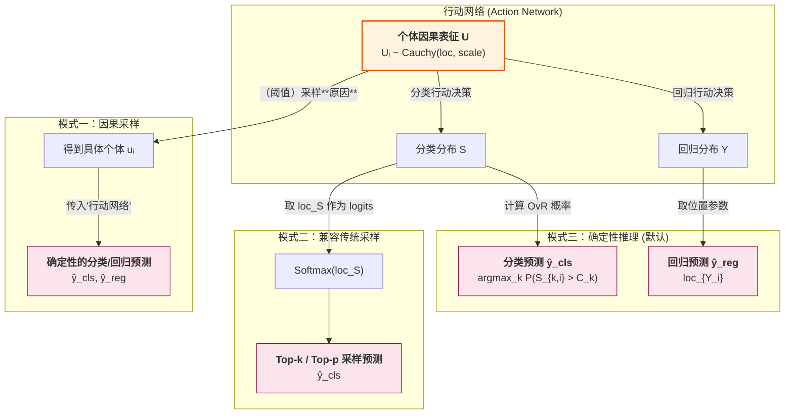

# 推理模式详解

本文档详细介绍 CausalQwen 的三种推理模式及其高级技巧。

> 返回主文档：[`../mathematical_foundations.md`](../mathematical_foundations.md)

## 1. 确定性推理 (Deterministic Inference)

这是默认的、最高效的推理模式。它完全基于解析计算，不涉及任何随机采样。

- **分类预测**: 直接使用前向传播计算出的各类 OvR 概率，并选择概率最高的类别。
    $$
    \hat{y}_{\text{cls},i} = \arg\max_k P_{k,i}
    $$
- **回归预测**: 直接使用回归值分布的位置参数（中位数），这是对柯西分布最稳健的点估计。
    $$
    \hat{y}_{\text{reg},i} = \text{loc}_{Y_i}
    $$

## 2. 因果采样 (Causal Sampling)

这是一种新颖的随机推理范式，它不直接对不确定的"结果"进行采样，而是对不确定的"原因"（即个体因果表征 U）进行采样。这是一种比`top-k`/`top-p`更符合因果直觉的采样方法。

1.  **采样"原因"**: 根据上下文推断出的因果表征分布 `Cauchy(loc_U, scale_U)`，从中采样一个**具体的**表征向量 $u_i$。
2.  **观察"结果"**: 将这个确定的 $u_i$ 传入**行动网络**，得到**确定性的**分类分数和回归值，并据此做出最终预测。

传统大模型需要 Top-P 和 Top-K 采样，是因为它们提供了一种在保真度（fidelity）和多样性（diversity）之间进行权衡的有效手段。我们类似可以使用似然截断来来实现对应的功能， 也就是说概率密度 $p_{U_i}(u_i)$ 需要大于某个数值或者等于$\frac{1}{\pi \text{scale}_{U_i}}$(Cauchy密度最大值)的 $u_i$ 才被保留。

### 2.1 共享随机性：因果采样的高级模式

因果采样的一个核心优势，在于通过**重参数化技巧 (Reparameterization Trick)**，实现了对生成过程随机性的精细控制。

为了从推断出的因果表征分布 $\text{Cauchy}(\text{loc}_{U_i}, \text{scale}_{U_i})$ 中采样，我们不直接进行随机抽取，而是执行一个确定性变换：
1.  首先，从标准均匀分布中采样一个**固定的**随机向量 $\vec{\epsilon} \sim U(0, 1)^C$。
2.  然后，使用此 $\vec{\epsilon}$ 为序列中的**每一个**位置 $i$ 计算其因果表征 $u_i$：
    $$
    u_i = \text{loc}_{U_i} + \text{scale}_{U_i} \odot \tan\left(\pi \left(\vec{\epsilon} - 0.5\right)\right)
    $$
    其中 $\odot$ 表示逐元素相乘。

**深刻的含义：分离与共享**

这个技巧的巧妙之处在于它将模型的内在逻辑（由上下文决定的 $\text{loc}_{U_i}$ 和 $\text{scale}_{U_i}$）与外在的随机性（由 $\vec{\epsilon}$ 代表）完全分离。更重要的是，它允许我们在一次完整的生成任务（如生成一段回复）中，**只采样一次 $\vec{\epsilon}$ 并持续使用它**。这意味着：
- **随机性来源是统一的**：整个序列的所有词元共享同一个"随机种子"或"灵感来源" $\vec{\epsilon}$。
- **上下文驱动多样性**：词元间的差异完全由模型根据上下文动态计算出的 $\text{loc}_{U_i}$ 和 $\text{scale}_{U_i}$ 决定。

这与传统 `top-k`/`top-p` 采样在每一步都独立进行随机抽样的方式形成了鲜明对比。CausalQwen 的方法更贴近人类的表达方式：一旦确定了某种"谈话风格"或"核心意图"（由 $\vec{\epsilon}$ 固化），整个句子都会围绕它连贯地展开，而不是每个词都随机地偏离主题。这为生成更具一致性和个性化风格的文本提供了坚实的数学基础。

## 3. 兼容传统采样 (Compatibility with Traditional Sampling)

除了独有的因果采样，CausalQwen 在设计上完全兼容传统语言模型（如Qwen）的 `top-k`/`top-p` 采样方法。

行动网络输出的决策位置参数 `loc_S` (形状: `[B, S, V_full]`) 可以被直接视作标准语言模型输出的 logits。通过对 `loc_S` 应用 `Softmax` 函数，我们可以得到一个归一化的词汇表概率分布：
$$
P_{\text{softmax}}(y_i=k|x) = \frac{\exp(\text{loc}_{S_{k,i}})}{\sum_{j=1}^{V_{\text{full}}} \exp(\text{loc}_{S_{j,i}})}
$$
随后，便可在这组概率上执行标准的 `top-k`/`top-p` 采样。另一种可选的归一化方法是直接对所有类别的 OvR 概率进行求和，并以此为分母进行归一化，这为评估模型提供了不同的视角。这保证了 CausalQwen 可以作为 Qwen 的一个直接替代和功能超集来使用。

## 流程图

### CausalQwen 三种推理模式

### CausalQwen 自回归生成流程图

