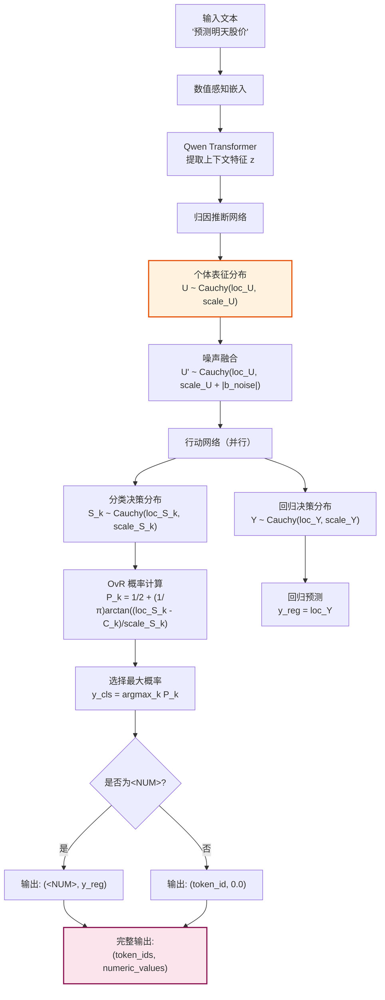
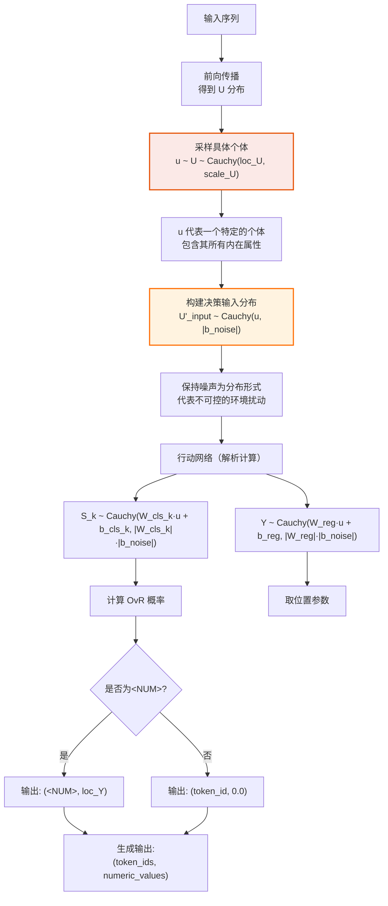
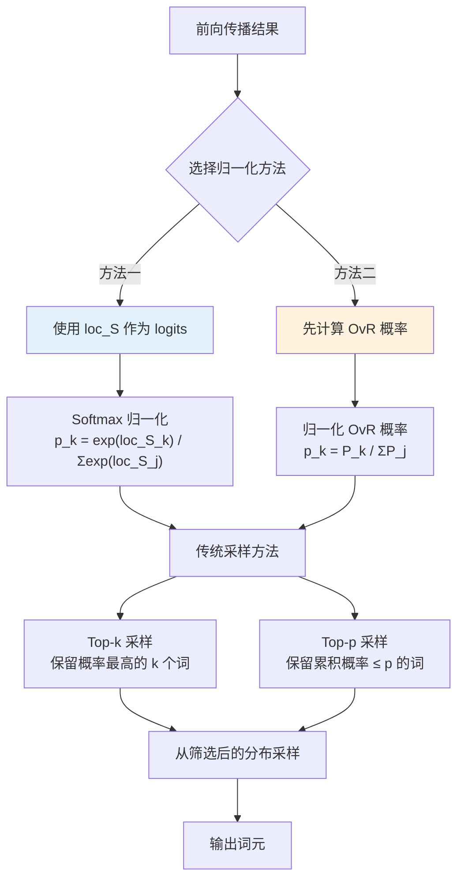
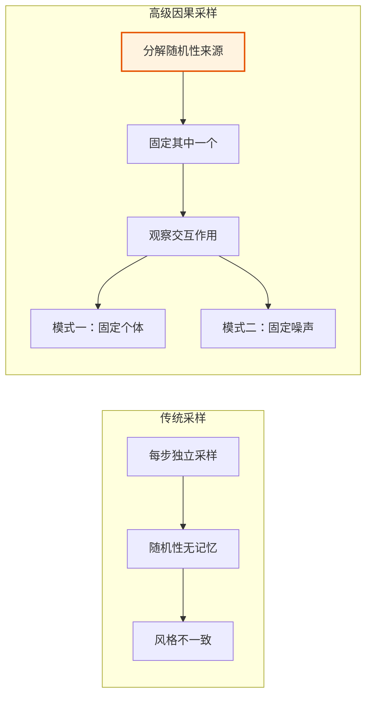
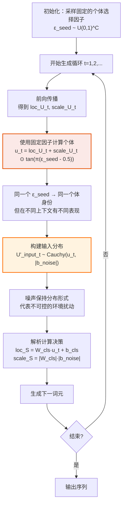
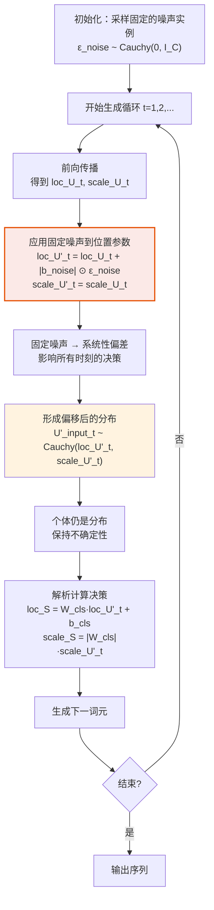
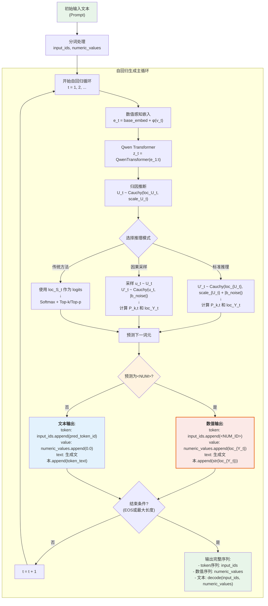

# 推理阶段详解

本文档深入探讨 CausalQwen 的推理机制，涵盖从基础的确定性预测到高级的因果采样方法。

> 返回主文档：[`../mathematical_foundations.md`](../mathematical_foundations.md)

## 符号约定

与主文档保持一致：
- B: 批次大小
- S: 序列长度  
- H: 模型隐藏维度
- C: 因果表征维度（当前实现中 C = H）
- V_full: 扩展后的总词汇表大小

## 概述

CausalQwen 提供了一个层次化的推理方法体系：

1. **标准推理**：最高效的确定性预测
2. **因果采样**：体现因果性的生成式采样
3. **传统兼容**：与 Qwen 兼容的 top-k/top-p 采样
4. **高级序列因果采样**：用于深度反事实分析

## 1. 标准推理 (Standard Inference)

这是默认的、最高效的推理模式。它完全基于解析计算，不涉及任何随机采样。

### 1.1 推理流程图



### 1.2 分类预测

对于每个位置 $i$，我们有：

1. **个体表征分布**（来自归因推断网络）：
   $$U_i \sim \text{Cauchy}(\text{loc}_{U_i}, \text{scale}_{U_i})$$

2. **融合噪声后的输入分布**：
   $$U'_i \sim \text{Cauchy}(\text{loc}_{U_i}, \text{scale}_{U_i} + |b_{\text{noise}}|)$$
   
   这里使用逐元素相加，利用了柯西分布的加法稳定性。

3. **分类决策分布**（对每个词汇 $k$）：
   $$S_{k,i} = W_{\text{cls},k} \cdot U'_i + b_{\text{cls},k} \sim \text{Cauchy}(\text{loc}_{S_{k,i}}, \text{scale}_{S_{k,i}})$$
   
   其中：
   $$\text{loc}_{S_{k,i}} = W_{\text{cls},k} \cdot \text{loc}_{U_i} + b_{\text{cls},k}$$
   $$\text{scale}_{S_{k,i}} = |W_{\text{cls},k}| \cdot (\text{scale}_{U_i} + |b_{\text{noise}}|)$$
   
   这里 $W_{\text{cls},k} \in \mathbb{R}^C$ 是词汇 $k$ 对应的权重向量，$\cdot$ 表示内积运算。

4. **OvR 概率计算**：
   $$P_{k,i} = P(S_{k,i} > C_k) = \frac{1}{2} + \frac{1}{\pi} \arctan\left(\frac{\text{loc}_{S_{k,i}} - C_k}{\text{scale}_{S_{k,i}}}\right)$$

5. **最终预测**：
   $$\hat{y}_{\text{cls},i} = \arg\max_k P_{k,i}$$

**实现代码**：
```python
def standard_inference_classification(loc_U, scale_U, W_cls, b_cls, b_noise, C_ovr):
    """
    标准推理模式下的分类预测
    
    Args:
        loc_U: [B, S, C] - 个体表征位置参数
        scale_U: [B, S, C] - 个体表征尺度参数
        W_cls: [V_full, C] - 分类权重
        b_cls: [V_full] - 分类偏置
        b_noise: [C] - 噪声参数
        C_ovr: float or [V_full] - OvR 阈值
    
    Returns:
        predictions: [B, S] - 预测的词汇索引
        P_ovr: [B, S, V_full] - OvR 概率
    """
    B, S, C = loc_U.shape
    V_full = W_cls.shape[0]
    
    # 融合噪声：使用逐元素相加
    scale_U_fused = scale_U + torch.abs(b_noise).unsqueeze(0).unsqueeze(0)  # [B, S, C]
    
    # 计算分类决策分布参数
    # loc_S: [B, S, V_full] = [B, S, C] @ [C, V_full]
    loc_S = torch.matmul(loc_U, W_cls.T) + b_cls.unsqueeze(0).unsqueeze(0)
    
    # scale_S: [B, S, V_full]
    # 对每个词汇 k，scale_S[..., k] = |W_cls[k]| · scale_U_fused
    scale_S = torch.matmul(scale_U_fused, torch.abs(W_cls).T)
    
    # 计算 OvR 概率
    if isinstance(C_ovr, (int, float)):
        C_ovr = torch.full((V_full,), C_ovr, device=loc_S.device)
    
    z = (loc_S - C_ovr.unsqueeze(0).unsqueeze(0)) / scale_S
    P_ovr = 0.5 + torch.atan(z) / math.pi  # [B, S, V_full]
    
    # 选择概率最高的词汇
    predictions = torch.argmax(P_ovr, dim=-1)  # [B, S]
    
    return predictions, P_ovr
```

### 1.3 回归预测

1. **回归决策分布**：
   $$Y_i = W_{\text{reg}} \cdot U'_i + b_{\text{reg}} \sim \text{Cauchy}(\text{loc}_{Y_i}, \text{scale}_{Y_i})$$
   
   其中：
   $$\text{loc}_{Y_i} = W_{\text{reg}} \cdot \text{loc}_{U_i} + b_{\text{reg}}$$
   $$\text{scale}_{Y_i} = |W_{\text{reg}}| \cdot (\text{scale}_{U_i} + |b_{\text{noise}}|)$$

2. **最终预测**（使用位置参数作为点估计）：
   $$\hat{y}_{\text{reg},i} = \text{loc}_{Y_i}$$

**数学原理**：对于柯西分布 $X \sim \text{Cauchy}(\mu, \gamma)$：
- 中位数 = 众数 = $\mu$（位置参数）
- 均值不存在（积分不收敛）

**实现代码**：
```python
def standard_inference_regression(loc_U, scale_U, W_reg, b_reg, b_noise):
    """
    标准推理模式下的回归预测
    
    Args:
        loc_U: [B, S, C] - 个体表征位置参数
        scale_U: [B, S, C] - 个体表征尺度参数
        W_reg: [C] - 回归权重
        b_reg: float - 回归偏置
        b_noise: [C] - 噪声参数
    
    Returns:
        predictions: [B, S] - 预测的数值
        scale_Y: [B, S] - 预测的不确定性
    """
    # 融合噪声
    scale_U_fused = scale_U + torch.abs(b_noise).unsqueeze(0).unsqueeze(0)
    
    # 计算回归决策分布参数
    loc_Y = torch.matmul(loc_U, W_reg) + b_reg  # [B, S]
    scale_Y = torch.matmul(scale_U_fused, torch.abs(W_reg))  # [B, S]
    
    # 使用位置参数作为点估计
    predictions = loc_Y
    
    return predictions, scale_Y
```

## 2. 因果采样 (Causal Sampling)

这是一种混合了随机性与确定性的高级推理模式，深刻体现了模型的因果哲学。

### 2.1 因果采样流程图



### 2.2 核心思想

- **随机性**：只在"个体选择"步骤引入
- **确定性**：环境噪声保持为分布形式

### 2.3 数学推导与实现

1. **采样个体**：
   从个体表征分布中采样具体的个体：
   $$u_i \sim U_i \sim \text{Cauchy}(\text{loc}_{U_i}, \text{scale}_{U_i})$$
   
   具体实现：生成 $\epsilon \sim U(0,1)$，然后：
   $$u_i = \text{loc}_{U_i} + \text{scale}_{U_i} \cdot \tan(\pi(\epsilon - 0.5))$$

2. **构建决策输入分布**：
   将确定的个体与噪声分布结合：
   $$U'_{\text{input},i} \sim \text{Cauchy}(u_i, |b_{\text{noise}}|)$$

3. **解析计算决策分布**：
   
   **分类**：
   $$S_{k,i} \sim \text{Cauchy}(\text{loc}_{S_{k,i}}, \text{scale}_{S_{k,i}})$$
   其中：
   $$\text{loc}_{S_{k,i}} = W_{\text{cls},k} \cdot u_i + b_{\text{cls},k}$$
   $$\text{scale}_{S_{k,i}} = |W_{\text{cls},k}| \cdot |b_{\text{noise}}|$$
   
   **回归**：
   $$Y_i \sim \text{Cauchy}(\text{loc}_{Y_i}, \text{scale}_{Y_i})$$
   其中：
   $$\text{loc}_{Y_i} = W_{\text{reg}} \cdot u_i + b_{\text{reg}}$$
   $$\text{scale}_{Y_i} = |W_{\text{reg}}| \cdot |b_{\text{noise}}|$$

**完整实现代码**：
```python
def causal_sampling_inference(loc_U, scale_U, W_cls, b_cls, W_reg, b_reg, b_noise, C_ovr):
    """
    因果采样推理：先采样个体，再计算决策
    
    核心思想：
    - 随机性只在个体选择时引入（采样 u）
    - 噪声保持分布形式，不进行采样
    
    Args:
        loc_U: [B, S, C] - 个体表征位置参数
        scale_U: [B, S, C] - 个体表征尺度参数
        W_cls: [V_full, C] - 分类权重
        b_cls: [V_full] - 分类偏置
        W_reg: [C] - 回归权重
        b_reg: float - 回归偏置
        b_noise: [C] - 噪声参数
        C_ovr: float or [V_full] - OvR 阈值
    
    Returns:
        cls_predictions: [B, S] - 分类预测
        reg_predictions: [B, S] - 回归预测
        u_sampled: [B, S, C] - 采样的个体
    """
    B, S, C = loc_U.shape
    
    # Step 1: 采样个体
    epsilon = torch.rand_like(scale_U)  # [B, S, C]
    # 避免数值问题
    epsilon = torch.clamp(epsilon, 1e-7, 1 - 1e-7)
    u_sampled = loc_U + scale_U * torch.tan(math.pi * (epsilon - 0.5))
    
    # Step 2: 构建决策输入分布（这里我们有确定的 u，噪声保持分布形式）
    # 注意：我们不采样噪声，而是保持其分布形式 |b_noise|
    
    # Step 3: 计算分类决策
    # 对于确定的 u 和分布形式的噪声，决策分布的参数为：
    loc_S = torch.matmul(u_sampled, W_cls.T) + b_cls.unsqueeze(0)
    # 噪声只影响尺度参数
    scale_S = torch.matmul(
        torch.abs(b_noise).unsqueeze(0).unsqueeze(0).expand(B, S, -1),
        torch.abs(W_cls).T
    )
    
    # 计算 OvR 概率
    if isinstance(C_ovr, (int, float)):
        C_ovr = torch.full((W_cls.shape[0],), C_ovr, device=loc_S.device)
    
    z = (loc_S - C_ovr.unsqueeze(0).unsqueeze(0)) / scale_S
    P_ovr = 0.5 + torch.atan(z) / math.pi
    cls_predictions = torch.argmax(P_ovr, dim=-1)
    
    # Step 4: 计算回归决策
    loc_Y = torch.matmul(u_sampled, W_reg) + b_reg
    scale_Y = torch.matmul(
        torch.abs(b_noise).unsqueeze(0).unsqueeze(0).expand(B, S, -1),
        torch.abs(W_reg)
    )
    reg_predictions = loc_Y  # 使用位置参数作为预测
    
    return cls_predictions, reg_predictions, u_sampled
```

### 2.4 优势分析

1. **风格一致性**：同一个体 $u_i$ 的生成保持内在一致
2. **多样性探索**：不同采样得到不同个体
3. **决策稳健性**：噪声以分布形式参与，避免极端值

## 3. 传统兼容模式

CausalQwen 完全兼容传统语言模型的采样方法。

### 3.1 兼容模式流程图



### 3.2 Softmax 归一化

**方法一：基于 loc_S**
$$p_k = \frac{\exp(\text{loc}_{S_{k,i}})}{\sum_{j=1}^{V_{\text{full}}} \exp(\text{loc}_{S_{j,i}})}$$

**方法二：基于 OvR 概率（可选）**
首先计算 OvR 概率：
$$P_{k,i} = \frac{1}{2} + \frac{1}{\pi} \arctan\left(\frac{\text{loc}_{S_{k,i}} - C_k}{\text{scale}_{S_{k,i}}}\right)$$

然后归一化：
$$p_k = \frac{P_{k,i}}{\sum_{j=1}^{V_{\text{full}}} P_{j,i}}$$

### 3.3 Top-k/Top-p 采样实现

```python
def traditional_sampling(loc_S, scale_S=None, C_ovr=None, temperature=1.0, top_k=50, top_p=0.9):
    """
    传统的 top-k/top-p 采样，兼容标准语言模型
    
    Args:
        loc_S: [B, S, V_full] - 分类位置参数（可视为 logits）
        scale_S: [B, S, V_full] - 分类尺度参数（可选）
        C_ovr: OvR 阈值（可选）
        temperature: 温度参数
        top_k: top-k 采样的 k
        top_p: nucleus 采样的 p
    
    Returns:
        sampled_tokens: [B, S] - 采样的词元
    """
    B, S, V = loc_S.shape
    
    # 方法一：直接使用 loc_S 作为 logits
    if scale_S is None or C_ovr is None:
        logits = loc_S / temperature
        probs = F.softmax(logits, dim=-1)
    else:
        # 方法二：基于 OvR 概率
        z = (loc_S - C_ovr.unsqueeze(0).unsqueeze(0)) / scale_S
        P_ovr = 0.5 + torch.atan(z) / math.pi
        # 归一化
        probs = P_ovr / P_ovr.sum(dim=-1, keepdim=True)
    
    # 应用 top-k
    if top_k > 0:
        top_k_probs, top_k_indices = torch.topk(probs, min(top_k, V), dim=-1)
        # 创建掩码
        mask = torch.zeros_like(probs).scatter_(-1, top_k_indices, 1)
        probs = probs * mask
        probs = probs / probs.sum(dim=-1, keepdim=True)
    
    # 应用 top-p (nucleus sampling)
    if top_p < 1.0:
        sorted_probs, sorted_indices = torch.sort(probs, descending=True, dim=-1)
        cumsum_probs = torch.cumsum(sorted_probs, dim=-1)
        
        # 找到累积概率超过 p 的位置
        nucleus_mask = cumsum_probs <= top_p
        # 确保至少包含一个词元
        nucleus_mask[..., 0] = True
        
        # 应用掩码
        sorted_probs = sorted_probs * nucleus_mask.float()
        sorted_probs = sorted_probs / sorted_probs.sum(dim=-1, keepdim=True)
        
        # 恢复原始顺序
        _, reverse_indices = torch.sort(sorted_indices, dim=-1)
        probs = torch.gather(sorted_probs, -1, reverse_indices)
    
    # 采样
    sampled_tokens = torch.multinomial(probs.view(-1, V), 1).view(B, S)
    
    return sampled_tokens
```

## 4. 高级序列因果采样

这是 CausalQwen 最独特的推理模式，允许对生成过程中的随机性进行精细控制。

### 4.1 两种模式对比图



### 4.2 模式一：共享个体选择因子

**研究目标**：观察同一个体在面对逐词元独立的随机噪声时的行为。

#### 详细流程图



**数学推导**：

1. **初始化**：采样固定的个体选择因子
   $$\vec{\epsilon}_{\text{seed}} \sim U(0,1)^C$$

2. **生成循环**：对于每个时间步 $t$：
   
   a) 计算当前位置的 U 分布参数（基于前向传播）：
      $$\text{loc}_{U_t}, \text{scale}_{U_t} = \text{AbductionNetwork}(z_t)$$
   
   b) 使用固定因子计算具体个体：
      $$u_t = \text{loc}_{U_t} + \text{scale}_{U_t} \odot \tan(\pi(\vec{\epsilon}_{\text{seed}} - 0.5))$$
      
      其中 $\odot$ 表示逐元素乘法。
   
   c) 构建包含噪声的输入分布：
      $$U'_{\text{input},t} \sim \text{Cauchy}(u_t, |b_{\text{noise}}|)$$
   
   d) 解析计算决策分布（以分类为例）：
      $$\text{loc}_{S_{k,t}} = W_{\text{cls},k} \cdot u_t + b_{\text{cls},k}$$
      $$\text{scale}_{S_{k,t}} = |W_{\text{cls},k}| \cdot |b_{\text{noise}}|$$
   
   e) 计算 OvR 概率并选择下一词元：
      $$P_{k,t} = \frac{1}{2} + \frac{1}{\pi} \arctan\left(\frac{\text{loc}_{S_{k,t}} - C_k}{\text{scale}_{S_{k,t}}}\right)$$
      $$\text{next\_token} = \arg\max_k P_{k,t}$$

**关键洞察**：
- $\vec{\epsilon}_{\text{seed}}$ 固定 → 个体身份在整个序列中保持一致
- 噪声分布 $|b_{\text{noise}}|$ → 每步都面对新的不确定性

**实现代码**：
```python
def advanced_causal_sampling_mode1(model, input_ids, max_length=100):
    """
    高级因果采样模式一：共享个体选择因子
    
    核心机制：
    - 在序列开始时固定一个"个体选择因子"
    - 整个序列生成过程中使用同一个因子
    - 观察同一个体在不同上下文中的表现
    
    Args:
        model: CausalQwen 模型
        input_ids: [1, prompt_length] - 初始输入
        max_length: 最大生成长度
    
    Returns:
        generated_ids: 生成的完整序列
        u_trajectory: 个体轨迹 [seq_length, C]
    """
    device = input_ids.device
    C = model.config.hidden_size  # 假设 C = H
    
    # Step 1: 采样固定的个体选择因子
    epsilon_seed = torch.rand(C, device=device)
    epsilon_seed = torch.clamp(epsilon_seed, 1e-7, 1 - 1e-7)
    tan_factor = torch.tan(math.pi * (epsilon_seed - 0.5))  # [C]
    
    generated_ids = input_ids.clone()
    numeric_values = torch.zeros_like(input_ids, dtype=torch.float)
    u_trajectory = []
    
    for t in range(max_length):
        # 前向传播得到当前的 U 分布
        with torch.no_grad():
            outputs = model(
                input_ids=generated_ids,
                numeric_values=numeric_values,
                return_dict=True
            )
            loc_U_t = outputs.loc_U[:, -1, :]  # [1, C]
            scale_U_t = outputs.scale_U[:, -1, :]  # [1, C]
        
        # Step 2: 使用固定因子计算具体个体
        u_t = loc_U_t + scale_U_t * tan_factor.unsqueeze(0)  # [1, C]
        u_trajectory.append(u_t.squeeze(0))
        
        # Step 3 & 4: 计算决策分布
        # 分类
        W_cls = model.action_network.classification_head.weight  # [V_full, C]
        b_cls = model.action_network.classification_head.bias  # [V_full]
        b_noise = torch.abs(model.action_network.b_noise)  # [C]
        
        loc_S_t = torch.matmul(u_t, W_cls.T) + b_cls.unsqueeze(0)  # [1, V_full]
        scale_S_t = torch.matmul(b_noise.unsqueeze(0), torch.abs(W_cls).T)  # [1, V_full]
        
        # Step 5: OvR 概率计算
        C_ovr = model.config.C_ovr if hasattr(model.config, 'C_ovr') else 100.0
        z = (loc_S_t - C_ovr) / scale_S_t
        P_ovr = 0.5 + torch.atan(z) / math.pi
        
        # 选择下一个词元
        next_token = torch.argmax(P_ovr, dim=-1)  # [1]
        
        # 处理数值词元
        if next_token.item() == model.config.num_token_id:
            # 计算回归值
            W_reg = model.action_network.regression_head.weight  # [C]
            b_reg = model.action_network.regression_head.bias  # scalar
            loc_Y_t = torch.matmul(u_t, W_reg) + b_reg  # [1]
            
            # 更新序列
            generated_ids = torch.cat([generated_ids, next_token.unsqueeze(0)], dim=1)
            new_numeric_value = loc_Y_t.squeeze()
            numeric_values = torch.cat([
                numeric_values, 
                new_numeric_value.unsqueeze(0).unsqueeze(0)
            ], dim=1)
        else:
            # 标准词元
            generated_ids = torch.cat([generated_ids, next_token.unsqueeze(0)], dim=1)
            numeric_values = torch.cat([
                numeric_values, 
                torch.zeros(1, 1, device=device)
            ], dim=1)
        
        # 检查结束条件
        if next_token.item() == model.config.eos_token_id:
            break
    
    return generated_ids, torch.stack(u_trajectory)
```

### 4.3 模式二：共享系统性噪声实例

**研究目标**：观察不确定的个体分布在固定的系统性偏差下的行为。

#### 详细流程图



**数学推导**：

1. **初始化**：采样固定的噪声实例
   $$\vec{\epsilon}_{\text{noise}} \sim \text{Cauchy}(0, I_C)$$
   
   其中 $I_C$ 是 $C$ 维单位矩阵。

2. **生成循环**：对于每个时间步 $t$：
   
   a) 计算当前位置的 U 分布参数：
      $$\text{loc}_{U_t}, \text{scale}_{U_t} = \text{AbductionNetwork}(z_t)$$
   
   b) 应用固定噪声到位置参数：
      $$\text{loc}_{U'_t} = \text{loc}_{U_t} + |b_{\text{noise}}| \odot \vec{\epsilon}_{\text{noise}}$$
      $$\text{scale}_{U'_t} = \text{scale}_{U_t}$$
      
      因此：$$U'_{\text{input},t} \sim \text{Cauchy}(\text{loc}_{U'_t}, \text{scale}_{U'_t})$$
   
   c) 解析计算决策分布（以分类为例）：
      $$\text{loc}_{S_{k,t}} = W_{\text{cls},k} \cdot \text{loc}_{U'_t} + b_{\text{cls},k}$$
      $$\text{scale}_{S_{k,t}} = |W_{\text{cls},k}| \cdot \text{scale}_{U'_t}$$
   
   d) 计算 OvR 概率并选择下一词元（同模式一）。

**关键洞察**：
- $\vec{\epsilon}_{\text{noise}}$ 固定 → 系统性偏差贯穿始终
- U 分布变化 → 个体不确定性随上下文演化

**实现代码**：
```python
def advanced_causal_sampling_mode2(model, input_ids, max_length=100):
    """
    高级因果采样模式二：共享系统性噪声实例
    
    核心机制：
    - 在序列开始时采样一个固定的噪声实例
    - 这个噪声代表整个生成过程中的系统性偏差
    - 观察不同（不确定的）个体在相同偏差下的表现
    
    Args:
        model: CausalQwen 模型
        input_ids: [1, prompt_length] - 初始输入
        max_length: 最大生成长度
    
    Returns:
        generated_ids: 生成的完整序列
        loc_U_trajectory: 位置参数轨迹
    """
    device = input_ids.device
    C = model.config.hidden_size
    
    # Step 1: 采样固定的噪声实例
    # 使用标准柯西分布采样
    epsilon_uniform = torch.rand(C, device=device)
    epsilon_uniform = torch.clamp(epsilon_uniform, 1e-7, 1 - 1e-7)
    epsilon_noise = torch.tan(math.pi * (epsilon_uniform - 0.5))  # [C]
    
    generated_ids = input_ids.clone()
    numeric_values = torch.zeros_like(input_ids, dtype=torch.float)
    loc_U_trajectory = []
    
    for t in range(max_length):
        # 前向传播
        with torch.no_grad():
            outputs = model(
                input_ids=generated_ids,
                numeric_values=numeric_values,
                return_dict=True
            )
            loc_U_t = outputs.loc_U[:, -1, :]  # [1, C]
            scale_U_t = outputs.scale_U[:, -1, :]  # [1, C]
        
        loc_U_trajectory.append(loc_U_t.squeeze(0))
        
        # Step 2: 应用固定噪声到位置参数
        b_noise = torch.abs(model.action_network.b_noise)  # [C]
        loc_U_prime = loc_U_t + b_noise.unsqueeze(0) * epsilon_noise.unsqueeze(0)  # [1, C]
        scale_U_prime = scale_U_t  # 尺度不变
        
        # Step 3: 计算决策分布
        W_cls = model.action_network.classification_head.weight
        b_cls = model.action_network.classification_head.bias
        
        loc_S_t = torch.matmul(loc_U_prime, W_cls.T) + b_cls.unsqueeze(0)
        scale_S_t = torch.matmul(scale_U_prime, torch.abs(W_cls).T)
        
        # OvR 概率
        C_ovr = model.config.C_ovr if hasattr(model.config, 'C_ovr') else 100.0
        z = (loc_S_t - C_ovr) / scale_S_t
        P_ovr = 0.5 + torch.atan(z) / math.pi
        
        # 选择下一个词元
        next_token = torch.argmax(P_ovr, dim=-1)
        
        # 处理数值词元（类似模式一）
        if next_token.item() == model.config.num_token_id:
            W_reg = model.action_network.regression_head.weight
            b_reg = model.action_network.regression_head.bias
            loc_Y_t = torch.matmul(loc_U_prime, W_reg) + b_reg
            
            generated_ids = torch.cat([generated_ids, next_token.unsqueeze(0)], dim=1)
            new_numeric_value = loc_Y_t.squeeze()
            numeric_values = torch.cat([
                numeric_values, 
                new_numeric_value.unsqueeze(0).unsqueeze(0)
            ], dim=1)
        else:
            generated_ids = torch.cat([generated_ids, next_token.unsqueeze(0)], dim=1)
            numeric_values = torch.cat([
                numeric_values, 
                torch.zeros(1, 1, device=device)
            ], dim=1)
        
        if next_token.item() == model.config.eos_token_id:
            break
    
    return generated_ids, torch.stack(loc_U_trajectory)
```

### 4.4 两种模式的对比总结

| 维度 | 模式一 | 模式二 |
|------|--------|--------|
| **固定什么** | 个体选择因子 $\vec{\epsilon}_{\text{seed}} \in [0,1]^C$ | 噪声实例 $\vec{\epsilon}_{\text{noise}} \sim \text{Cauchy}(0,I_C)$ |
| **个体表征** | $u_t$ 是确定的数值向量 | $U_t$ 保持分布形式 |
| **U 的有效分布** | $U'_t \sim \text{Cauchy}(u_t, \|b_\text{noise}\|)$ | $U'_t \sim \text{Cauchy}(\text{loc}_{U_t} + \|b_{\text{noise}}\| \odot \vec{\epsilon}_{\text{noise}}, \text{scale}_{U_t})$ |
| **决策尺度** | $\propto \|b_{\text{noise}}\|$ | $\propto \text{scale}_{U_t}$ |
| **物理意义** | 同一个体的多次决策 | 不同个体在相同偏差下的表现 |
| **应用场景** | 个性化生成、风格保持 | 系统性偏差分析、鲁棒性测试 |

## 5. 自回归序列生成

### 5.1 完整生成流程



### 5.2 数值预测的特殊处理

当模型预测 `<NUM>` 词元时，需要特殊处理：

```python
def handle_numeric_prediction(model, u_or_loc_U, scale_U=None, b_noise=None, is_sampled=False):
    """
    处理数值预测的统一接口
    
    重要：必须同时返回词元ID和数值，才能正确还原文本
    
    Args:
        model: CausalQwen 模型
        u_or_loc_U: [B, C] - 采样的个体 u 或位置参数 loc_U
        scale_U: [B, C] - 尺度参数（当 is_sampled=False 时需要）
        b_noise: [C] - 噪声参数
        is_sampled: 是否已经采样了具体个体
    
    Returns:
        token_id: [B] - 预测的词元ID（这里是 <NUM> 的ID）
        numeric_value: [B] - 预测的数值
    """
    W_reg = model.action_network.regression_head.weight  # [C]
    b_reg = model.action_network.regression_head.bias  # scalar
    
    if is_sampled:
        # 已经有具体个体 u
        loc_Y = torch.matmul(u_or_loc_U, W_reg) + b_reg
        scale_Y = torch.matmul(torch.abs(b_noise), torch.abs(W_reg))
    else:
        # 标准推理：使用 loc_U 和完整的尺度计算
        loc_Y = torch.matmul(u_or_loc_U, W_reg) + b_reg
        scale_Y = torch.matmul(scale_U + torch.abs(b_noise), torch.abs(W_reg))
    
    # 返回 <NUM> 的token ID 和预测的数值
    token_id = torch.full_like(loc_Y, model.config.num_token_id, dtype=torch.long)
    
    return token_id, loc_Y
```

### 5.3 文本还原示例

```python
def decode_with_numeric_values(tokenizer, input_ids, numeric_values):
    """
    将token序列和数值序列还原为完整文本
    
    Args:
        tokenizer: 分词器
        input_ids: [S] - token ID序列
        numeric_values: [S] - 对应的数值序列
    
    Returns:
        text: 还原的完整文本
    """
    tokens = []
    for i, (token_id, num_val) in enumerate(zip(input_ids, numeric_values)):
        if token_id == tokenizer.num_token_id:
            # 这是一个数值位置，使用numeric_values中的值
            tokens.append(str(num_val.item()))
        else:
            # 普通词元，使用tokenizer解码
            tokens.append(tokenizer.decode([token_id]))
    
    return ''.join(tokens)

# 使用示例
# 生成的序列：
# input_ids = [12345, 67890, <NUM_ID>, 11111]  # "价格是<NUM>元"
# numeric_values = [0.0, 0.0, 99.9, 0.0]
# 
# 还原结果：
# text = "价格是99.9元"
```

## 6. 数值稳定性考虑

### 6.1 避免数值问题

```python
def stable_cauchy_cdf(loc, scale, x, eps=1e-6):
    """
    数值稳定的柯西 CDF 计算
    """
    # 避免 scale 过小
    scale = torch.clamp(scale, min=eps)
    
    # 计算标准化值
    z = (x - loc) / scale
    
    # 限制 z 的范围避免 arctan 的数值问题
    z = torch.clamp(z, min=-1e6, max=1e6)
    
    # 计算 CDF
    cdf = 0.5 + torch.atan(z) / math.pi
    
    return cdf

def stable_cauchy_sampling(loc, scale, shape, device, eps=1e-7):
    """
    数值稳定的柯西分布采样
    """
    # 生成均匀分布
    u = torch.rand(shape, device=device)
    
    # 避免极端值
    u = torch.clamp(u, eps, 1 - eps)
    
    # 逆变换采样
    x = loc + scale * torch.tan(math.pi * (u - 0.5))
    
    # 可选：限制输出范围
    # x = torch.clamp(x, min=-1e6, max=1e6)
    
    return x
```

### 6.2 完整的生成管道示例

```python
def generate_with_causalqwen(
    model, 
    tokenizer, 
    prompt, 
    max_length=100,
    mode='standard',  # 'standard', 'causal', 'traditional', 'advanced_mode1', 'advanced_mode2'
    temperature=1.0,
    top_k=50,
    top_p=0.9
):
    """
    CausalQwen 的统一生成接口
    
    重要：返回的是完整的token序列和数值序列，需要配合使用才能还原文本
    
    Args:
        model: CausalQwen 模型
        tokenizer: 分词器
        prompt: 输入提示
        max_length: 最大生成长度
        mode: 推理模式
        temperature, top_k, top_p: 传统采样参数
    
    Returns:
        generated_text: 生成的文本
        metadata: 生成过程的元数据，包含:
            - input_ids: 完整的token序列
            - numeric_values: 对应的数值序列
            - trajectory: 轨迹信息（如果适用）
    """
    # 编码输入
    inputs = tokenizer(prompt, return_tensors='pt')
    input_ids = inputs['input_ids'].to(model.device)
    numeric_values = torch.zeros_like(input_ids, dtype=torch.float)
    
    if mode == 'standard':
        # 标准确定性推理
        outputs = model.generate(
            input_ids=input_ids,
            numeric_values=numeric_values,
            max_length=max_length,
            do_sample=False
        )
        # outputs 包含 (generated_ids, generated_numeric_values)
        generated_ids, generated_numeric_values = outputs
    elif mode == 'causal':
        # 因果采样
        outputs = model.generate(
            input_ids=input_ids,
            numeric_values=numeric_values,
            max_length=max_length,
            do_sample=True,
            sampling_mode='causal'
        )
        generated_ids, generated_numeric_values = outputs
    elif mode == 'traditional':
        # 传统 top-k/top-p
        outputs = model.generate(
            input_ids=input_ids,
            numeric_values=numeric_values,
            max_length=max_length,
            do_sample=True,
            temperature=temperature,
            top_k=top_k,
            top_p=top_p
        )
        generated_ids, generated_numeric_values = outputs
    elif mode.startswith('advanced'):
        # 高级因果采样
        if mode == 'advanced_mode1':
            generated_ids, trajectory = advanced_causal_sampling_mode1(
                model, input_ids, max_length
            )
        else:
            generated_ids, trajectory = advanced_causal_sampling_mode2(
                model, input_ids, max_length
            )
        
        # 对于高级模式，需要提取生成的numeric_values
        # （这在advanced_causal_sampling函数内部已经处理）
        generated_numeric_values = trajectory.get('numeric_values', None)
        
        # 解码生成的文本
        generated_text = decode_with_numeric_values(
            tokenizer, generated_ids[0], generated_numeric_values[0]
        )
        
        return generated_text, {
            'input_ids': generated_ids,
            'numeric_values': generated_numeric_values,
            'trajectory': trajectory
        }
    
    # 标准解码：结合token和数值
    generated_text = decode_with_numeric_values(
        tokenizer, generated_ids[0], generated_numeric_values[0]
    )
    
    return generated_text, {
        'input_ids': generated_ids,
        'numeric_values': generated_numeric_values
    }
```

## 总结

CausalQwen 的推理系统提供了从简单到复杂的多层次方法：

1. **效率优先**：标准推理提供最快的确定性预测，完全基于解析计算
2. **因果探索**：因果采样揭示个体差异，通过采样个体实现多样性
3. **向后兼容**：支持传统采样方法，可以无缝替代标准语言模型
4. **深度分析**：高级模式支持反事实研究，精细控制随机性来源

每种模式都有清晰的数学基础和高效的代码实现，确保了理论的严谨性和实践的可行性。特别是柯西分布的使用，使得整个推理过程可以在很大程度上保持解析计算，避免了昂贵的采样操作。

**关键要点**：
- 模型的输出始终是**词元ID和数值**的配对
- 只有结合两者才能正确还原生成的文本
- 这种设计使得模型能够在单一架构中同时处理文本生成和数值预测
