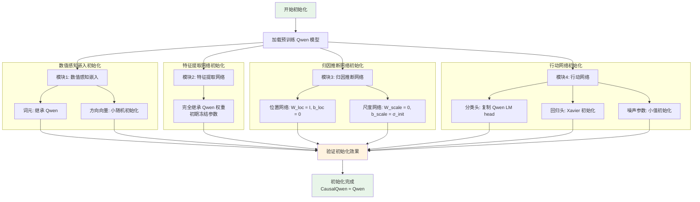
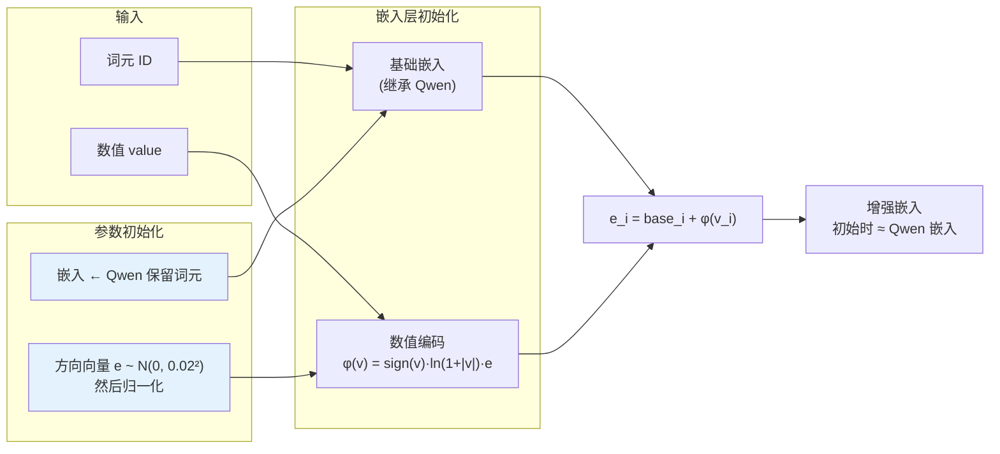
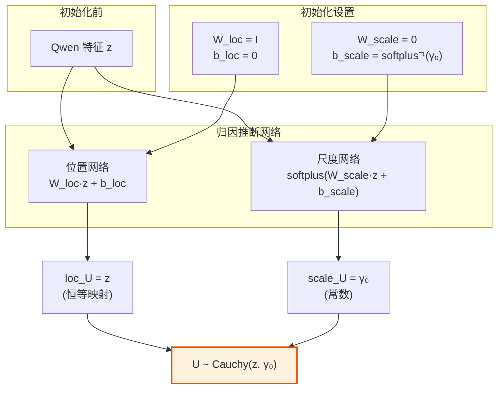
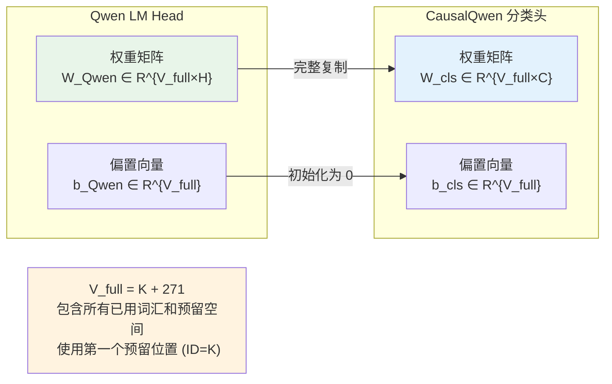
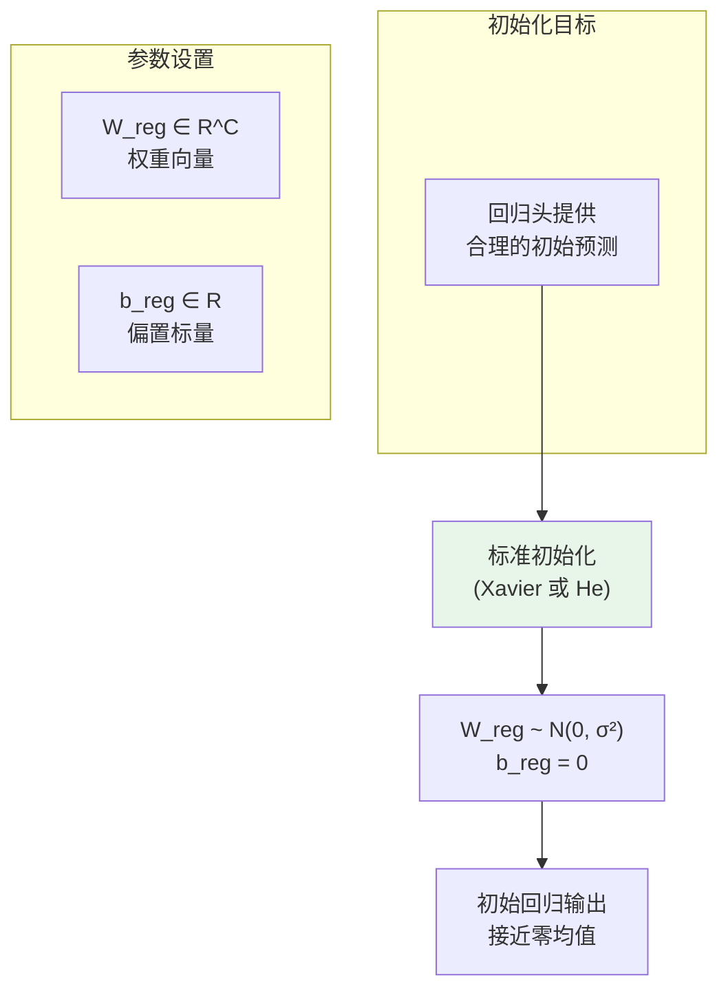
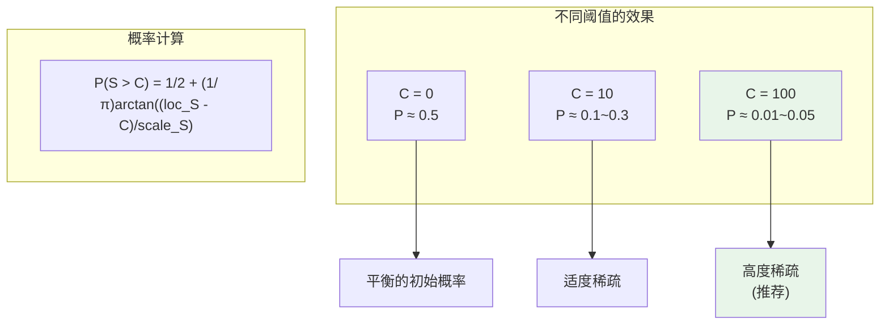
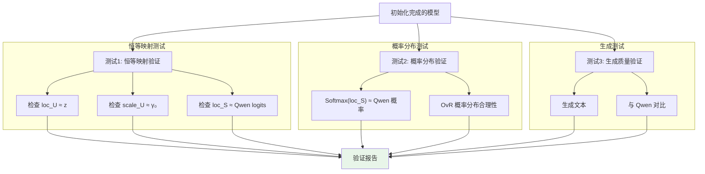

# 初始化策略详解

本文档详细介绍 CausalQwen 的初始化策略及其数学保证。

> 返回主文档：[`../mathematical_foundations.md`](../mathematical_foundations.md)

## 设计原则

为了使 CausalQwen 能够无缝继承基座模型的强大语言能力，我们采用了一种**精心设计**的初始化策略。其核心思想是：**在训练开始时，CausalQwen 的行为应与原始的 Qwen 完全一致**。

### 初始化总览流程图



### 核心设计原则

1. **数学恒等**：新增模块在初始时表现为恒等映射或零映射
2. **知识保持**：完整继承 Qwen 的语言表征能力  
3. **渐进激活**：新功能在训练过程中逐步被"唤醒"
4. **数值稳定**：避免梯度爆炸或消失，确保训练稳定性

## 初始化步骤详解

### 步骤1：数值感知嵌入初始化

#### 1.1 初始化流程图



#### 1.2 数学推导

**`<NUM>` 词元处理**：
`<NUM>` 被设置为 Qwen 词汇表中的第一个预留词元。Qwen 的词汇表结构为：
- 前 K 个位置：已使用的词汇
- 后 271 个位置：预留空间
- 总大小：V_full = K + 271

因此 `<NUM>` 的 ID = K（第一个预留位置）。由于我们完整继承了 Qwen 的嵌入矩阵，`<NUM>` 自动获得了对应的嵌入向量：
$$\text{embed}(\text{<NUM>}) = \text{embed}_{\text{Qwen}}[K]$$

**方向向量初始化**：
$$\vec{e}_{\text{raw}} \sim \mathcal{N}(0, \sigma_e^2 I), \quad \vec{e} = \frac{\vec{e}_{\text{raw}}}{\|\vec{e}_{\text{raw}}\|_2}$$

其中 $\sigma_e = 0.02$ 是小标准差，确保初始数值编码不会过度干扰原有嵌入。

**初始效果分析**：
- 对于非数值位置：$v_i = 0 \Rightarrow \phi(0) = 0 \Rightarrow e_i = \text{base\_embed}_i$
- 对于数值位置：$\phi(v_i) = \text{sign}(v_i) \cdot \ln(1 + |v_i|) \cdot \vec{e}$，由于 $\|\vec{e}\| = 1$ 且 $\ln(1 + |v|)$ 增长缓慢，初始扰动较小

#### 1.3 实现代码

```python
def initialize_numerical_embedding(model, qwen_model, sigma_e=0.02):
    """
    初始化数值感知嵌入模块
    
    Args:
        model: CausalQwen 模型
        qwen_model: 预训练的 Qwen 模型
        sigma_e: 方向向量的初始化标准差
    """
    # Step 1: 继承 <NUM> 词元嵌入
    # 假设 <NUM> 是第一个保留词元
    num_token_id = model.config.num_token_id
    with torch.no_grad():
        model.embed_tokens.weight[num_token_id] = qwen_model.model.embed_tokens.weight[num_token_id].clone()
    
    # Step 2: 初始化方向向量
    hidden_size = model.config.hidden_size
    
    # 小随机初始化
    e_raw = torch.randn(hidden_size) * sigma_e
    # 归一化为单位向量
    e_normalized = e_raw / torch.norm(e_raw, p=2)
    
    # 设置为模型参数
    model.numerical_embed.direction_vector.data = e_normalized
    
    print(f"数值嵌入初始化完成:")
    print(f"  - <NUM> 词元嵌入: 继承自 Qwen")
    print(f"  - 方向向量 norm: {torch.norm(model.numerical_embed.direction_vector).item():.4f}")
    print(f"  - 方向向量 std: {torch.std(model.numerical_embed.direction_vector).item():.4f}")
```

### 步骤2：特征提取网络初始化

这是最简单的步骤：完全继承 Qwen 的 Transformer 权重。

```python
def initialize_feature_network(model, qwen_model):
    """
    初始化特征提取网络（Qwen Transformer）
    
    Args:
        model: CausalQwen 模型
        qwen_model: 预训练的 Qwen 模型
    """
    # 直接复制整个 transformer 的状态字典
    model.model.load_state_dict(qwen_model.model.state_dict())
    
    # 初期冻结参数（可选）
    for param in model.model.parameters():
        param.requires_grad = False
    
    print("特征提取网络初始化完成: 完全继承 Qwen 权重")
```

### 步骤3：归因推断网络初始化

#### 3.1 初始化目标



#### 3.2 数学推导

**目标**：使得 $\text{loc}_{U_i} = z_i$，$\text{scale}_{U_i} = \gamma_0$（常数）

**位置网络初始化**：
$$W_{\text{loc}} = I_H, \quad b_{\text{loc}} = \mathbf{0}$$

这样：
$$\text{loc}_{U_i} = W_{\text{loc}} \cdot z_i + b_{\text{loc}} = I_H \cdot z_i + \mathbf{0} = z_i$$

**尺度网络初始化**：
设定目标尺度 $\gamma_0$（如 10.0），需要：
$$\text{softplus}(W_{\text{scale}} \cdot z_i + b_{\text{scale}}) = \gamma_0$$

由于 $W_{\text{scale}} = \mathbf{0}$：
$$\text{softplus}(b_{\text{scale}}) = \gamma_0$$

因此：
$$b_{\text{scale}} = \text{softplus}^{-1}(\gamma_0) = \log(\exp(\gamma_0) - 1)$$

对于大 $\gamma_0$（如 10），有近似：
$$b_{\text{scale}} \approx \gamma_0 - \log(2) \approx \gamma_0 - 0.693$$

#### 3.3 实现代码

```python
def initialize_abduction_network(model, gamma_0=10.0):
    """
    初始化归因推断网络为恒等映射
    
    Args:
        model: CausalQwen 模型
        gamma_0: 目标初始尺度参数
    """
    hidden_size = model.config.hidden_size
    causal_size = model.config.causal_hidden_size  # 通常 = hidden_size
    
    # 位置网络：恒等映射
    with torch.no_grad():
        # W_loc = I
        model.abduction_network.loc_net.weight.data = torch.eye(causal_size, hidden_size)
        # b_loc = 0
        model.abduction_network.loc_net.bias.data.zero_()
    
    # 尺度网络：产生常数输出
    with torch.no_grad():
        # W_scale = 0
        model.abduction_network.scale_net.weight.data.zero_()
        # b_scale = softplus^{-1}(gamma_0)
        # softplus^{-1}(y) = log(exp(y) - 1)
        if gamma_0 > 5:  # 使用近似公式避免数值问题
            b_scale_init = gamma_0 - np.log(2)
        else:
            b_scale_init = np.log(np.exp(gamma_0) - 1)
        
        model.abduction_network.scale_net.bias.data.fill_(b_scale_init)
    
    # 验证初始化效果
    with torch.no_grad():
        # 创建测试输入
        test_z = torch.randn(1, 1, hidden_size)
        loc_u, scale_u = model.abduction_network(test_z)
        
        print(f"归因推断网络初始化完成:")
        print(f"  - 测试输入 z 的 norm: {torch.norm(test_z).item():.4f}")
        print(f"  - 输出 loc_U 的 norm: {torch.norm(loc_u).item():.4f}")
        print(f"  - 输出 scale_U 的值: {scale_u[0, 0, 0].item():.4f}")
        print(f"  - 目标 gamma_0: {gamma_0}")
        print(f"  - |loc_U - z|: {torch.norm(loc_u - test_z).item():.6f} (应该 ≈ 0)")
        print(f"  - |scale_U - gamma_0|: {abs(scale_u[0, 0, 0].item() - gamma_0):.6f}")
```

### 步骤4：行动网络初始化

#### 4.1 分类头初始化

##### 4.1.1 初始化流程图



##### 4.1.2 数学推导

根据主文档，分类头的初始化策略是：
$$W_{\text{cls}} \leftarrow W_{\text{Qwen\_lm\_head}}, \quad b_{\text{cls}} = 0$$

初始化后，对于词汇 $k$ 和位置 $i$：

1. **融合输入分布**（加入噪声）：
   $$U'_i \sim \text{Cauchy}(z_i, \gamma_0 \cdot \mathbf{1}_C + |b_{\text{noise}}|)$$
   
   其中初始化时 $\text{loc}_{U_i} = z_i$，$\text{scale}_{U_i} = \gamma_0 \cdot \mathbf{1}_C$。

2. **分类决策分布**：
   经过权重向量 $W_{\text{cls},k} \in \mathbb{R}^C$ 的线性变换：
   $$S_{k,i} = W_{\text{cls},k} \cdot U'_i + b_{\text{cls},k} \sim \text{Cauchy}(\text{loc}_{S_{k,i}}, \text{scale}_{S_{k,i}})$$
   
   其中：
   $$\text{loc}_{S_{k,i}} = W_{\text{cls},k} \cdot z_i = W_{\text{Qwen},k} \cdot z_i$$
   $$\text{scale}_{S_{k,i}} = |W_{\text{cls},k}| \cdot (\gamma_0 \cdot \mathbf{1}_C + |b_{\text{noise}}|)$$

这确保了初始分类输出的位置参数与 Qwen 的 logits 完全一致。

#### 4.2 回归头初始化

##### 4.2.1 初始化流程图



##### 4.2.2 数学效果

根据主文档，使用标准的 Xavier 或 He 初始化。基于融合输入分布 $U'_i \sim \text{Cauchy}(z_i, \gamma_0 \cdot \mathbf{1}_C + |b_{\text{noise}}|)$：

**回归决策分布**：
$$Y_i = W_{\text{reg}} \cdot U'_i + b_{\text{reg}} \sim \text{Cauchy}(\mu_{\text{reg},i}, \gamma_{\text{reg},i})$$

其中：
$$\mu_{\text{reg},i} = W_{\text{reg}} \cdot z_i + b_{\text{reg}}$$
$$\gamma_{\text{reg},i} = |W_{\text{reg}}| \cdot (\gamma_0 \cdot \mathbf{1}_C + |b_{\text{noise}}|)$$

这里 $|W_{\text{reg}}| \cdot (\gamma_0 \cdot \mathbf{1}_C + |b_{\text{noise}}|)$ 表示先对权重向量逐元素取绝对值，再与尺度向量进行内积。

##### 4.2.3 实现代码

```python
def initialize_regression_head(model, qwen_model):
    """
    初始化回归头，使用标准的 Xavier 或 He 初始化
    
    Args:
        model: CausalQwen 模型
        qwen_model: 预训练的 Qwen 模型（保留接口一致性）
    """
    causal_size = model.config.causal_hidden_size  # C
    
    with torch.no_grad():
        # 标准 Xavier 初始化
        # 对于向量输出：std = sqrt(1/fan_in) = sqrt(1/C)
        std = np.sqrt(1.0 / causal_size)
        
        # 初始化权重
        model.action_network.regression_head.weight.data.normal_(0, std)
        
        # 偏置初始化为 0
        model.action_network.regression_head.bias.data.zero_()
    
    print(f"回归头初始化完成:")
    print(f"  - 使用 Xavier 初始化 (std={std:.4f})")
    print(f"  - 权重形状: {model.action_network.regression_head.weight.shape}")
```

#### 4.3 噪声参数初始化


##### 4.3.1 数学理由

在没有先验知识的情况下，最合理的假设是**各维度的环境噪声是同质的**。考虑：

1. **对称性原则**：
   - 因果表征的每个维度应该被平等对待
   - 没有理由认为某个维度更容易受到环境干扰

2. **奥卡姆剃刀**：
   - 最简单的假设：所有维度的噪声强度相同
   - $b_{\text{noise}} = c \cdot \mathbf{1}_C$，其中 $c$ 是一个小的正常数

3. **与归因推断网络的一致性**：
   - 归因推断网络初始化为常数尺度：$\text{scale}_{U_i} = \gamma_0 \cdot \mathbf{1}_C$
   - 噪声参数也应该初始化为常数：$b_{\text{noise}} = c \cdot \mathbf{1}_C$
   - 这样初始的总尺度为：$\text{scale}_{U_i} + |b_{\text{noise}}| = (\gamma_0 + c) \cdot \mathbf{1}_C$

##### 4.3.2 推荐的初始化策略

```python
def initialize_noise_parameter(model, noise_scale=0.1, mode='constant'):
    """
    初始化噪声参数
    
    Args:
        model: CausalQwen 模型
        noise_scale: 噪声参数的初始尺度
        mode: 初始化模式 - 'constant'（推荐）, 'uniform', 'zero'
    """
    causal_size = model.config.causal_hidden_size
    
    with torch.no_grad():
        if mode == 'constant':
            # 推荐：常数初始化
            # 所有维度具有相同的噪声强度
            model.action_network.b_noise.data.fill_(noise_scale)
            
        elif mode == 'uniform':
            # 备选：均匀分布初始化
            # 引入微小的随机性，可能有助于训练初期的对称性破缺
            model.action_network.b_noise.data.uniform_(-noise_scale, noise_scale)
            
        elif mode == 'zero':
            # 不推荐：零初始化
            # 完全没有环境噪声，可能导致过拟合
            model.action_network.b_noise.data.zero_()
        
        else:
            raise ValueError(f"未知的初始化模式: {mode}")
    
    print(f"噪声参数初始化完成 (mode={mode}):")
    print(f"  - 形状: {model.action_network.b_noise.shape}")
    print(f"  - 最小值: {model.action_network.b_noise.min().item():.6f}")
    print(f"  - 最大值: {model.action_network.b_noise.max().item():.6f}")
    print(f"  - 平均值: {model.action_network.b_noise.mean().item():.6f}")
    print(f"  - 标准差: {model.action_network.b_noise.std().item():.6f}")
    
    # 特别注意：由于使用 |b_noise|，负值也会产生正的噪声
    print(f"  - |b_noise| 平均值: {torch.abs(model.action_network.b_noise).mean().item():.6f}")
```

##### 4.3.4 初始值选择指南

噪声参数的初始值 $c$ 应该相对于归因推断的初始尺度 $\gamma_0$ 来选择：

```python
def compute_noise_init_value(gamma_0=10.0, noise_ratio=0.01):
    """
    基于归因推断的初始尺度计算噪声参数的初始值
    
    Args:
        gamma_0: 归因推断网络的初始尺度参数
        noise_ratio: 噪声相对于个体不确定性的初始比例
    
    Returns:
        c: 噪声参数的推荐初始值
    """
    # 噪声应该比个体不确定性小得多
    c = gamma_0 * noise_ratio
    
    print(f"噪声参数初始化建议:")
    print(f"  - 归因推断初始尺度 γ₀ = {gamma_0}")
    print(f"  - 噪声比例 = {noise_ratio}")
    print(f"  - 建议噪声初始值 c = {c}")
    print(f"  - 初始总尺度 = {gamma_0 + c}")
    
    return c
```

#### 4.4 完整的行动网络初始化

```python
def initialize_action_network(model, qwen_model, noise_scale=0.1):
    """
    初始化行动网络（包括分类头、回归头和噪声参数）
    
    Args:
        model: CausalQwen 模型
        qwen_model: 预训练的 Qwen 模型  
        noise_scale: 噪声参数的初始值（推荐使用常数）
    """
    qwen_vocab_size = qwen_model.config.vocab_size  # V_full = K + 271
    causal_vocab_size = model.config.vocab_size  # 应该相同
    causal_size = model.config.causal_hidden_size
    
    assert causal_vocab_size == qwen_vocab_size, \
        f"词汇表大小不匹配: CausalQwen={causal_vocab_size}, Qwen={qwen_vocab_size}"
    
    # Step 1: 初始化分类头
    with torch.no_grad():
        # 完整复制 Qwen 的 lm_head 权重
        model.action_network.classification_head.weight.data = \
            qwen_model.lm_head.weight.data.clone()
        
        # 偏置初始化为 0（Qwen 的 lm_head 通常没有偏置）
        if model.action_network.classification_head.bias is not None:
            model.action_network.classification_head.bias.data.zero_()
    
    # Step 2: 初始化回归头（标准 Xavier 初始化）
    with torch.no_grad():
        # Xavier 标准差
        std = np.sqrt(1.0 / causal_size)
        
        model.action_network.regression_head.weight.data.normal_(0, std)
        model.action_network.regression_head.bias.data.zero_()
    
    # Step 3: 初始化噪声参数（推荐常数初始化）
    with torch.no_grad():
        # 常数初始化：所有维度具有相同的噪声强度
        model.action_network.b_noise.data.fill_(noise_scale)
    
    print(f"行动网络初始化完成:")
    print(f"  - 分类头: 完整继承 Qwen 的 {qwen_vocab_size} 个词汇权重")
    print(f"  - <NUM> 权重: 继承自位置 {model.config.num_token_id} 的保留词元")
    print(f"  - 回归头: Xavier 初始化 (std={std:.4f})")
    print(f"  - 噪声参数: 常数初始化 (值={noise_scale})")
```

### 步骤5：OvR 阈值初始化

#### 5.1 阈值对概率的影响



#### 5.2 实现代码

```python
def initialize_ovr_thresholds(model, C_ovr=100.0, learnable=False):
    """
    初始化 OvR 分类的阈值参数
    
    Args:
        model: CausalQwen 模型
        C_ovr: 统一的初始阈值
        learnable: 是否设置为可学习参数
    """
    vocab_size = model.config.vocab_size
    
    if learnable:
        # 创建可学习的阈值参数
        model.action_network.C_ovr = nn.Parameter(
            torch.full((vocab_size,), C_ovr)
        )
    else:
        # 注册为 buffer（不可学习）
        model.action_network.register_buffer(
            'C_ovr',
            torch.full((vocab_size,), C_ovr)
        )
    
    print(f"OvR 阈值初始化完成:")
    print(f"  - 初始值: {C_ovr}")
    print(f"  - 可学习: {learnable}")
    print(f"  - 形状: {model.action_network.C_ovr.shape}")
```

## 初始化验证

### 验证流程图



### 完整的验证代码

```python
def verify_initialization(causal_model, qwen_model, test_input_ids, test_numeric_values=None):
    """
    验证 CausalQwen 的初始化是否正确
    
    Args:
        causal_model: 初始化后的 CausalQwen 模型
        qwen_model: 原始 Qwen 模型
        test_input_ids: 测试输入 [B, S]
        test_numeric_values: 测试数值输入 [B, S]
    """
    if test_numeric_values is None:
        test_numeric_values = torch.zeros_like(test_input_ids, dtype=torch.float)
    
    causal_model.eval()
    qwen_model.eval()
    
    with torch.no_grad():
        # 1. 前向传播
        causal_outputs = causal_model(
            input_ids=test_input_ids,
            numeric_values=test_numeric_values,
            return_dict=True
        )
        
        qwen_outputs = qwen_model(
            input_ids=test_input_ids,
            return_dict=True
        )
        
        # 2. 验证特征提取
        z_causal = causal_outputs.hidden_states  # [B, S, H]
        z_qwen = qwen_outputs.hidden_states[-1]  # [B, S, H]
        
        feature_diff = torch.norm(z_causal - z_qwen) / torch.norm(z_qwen)
        print(f"特征提取差异: {feature_diff.item():.6f} (应该 ≈ 0)")
        
        # 3. 验证归因推断（恒等映射）
        loc_u = causal_outputs.loc_U  # [B, S, C]
        scale_u = causal_outputs.scale_U  # [B, S, C]
        
        loc_diff = torch.norm(loc_u - z_causal) / torch.norm(z_causal)
        scale_mean = scale_u.mean().item()
        scale_std = scale_u.std().item()
        
        print(f"归因推断验证:")
        print(f"  - loc_U 与 z 的差异: {loc_diff.item():.6f} (应该 ≈ 0)")
        print(f"  - scale_U 均值: {scale_mean:.4f}")
        print(f"  - scale_U 标准差: {scale_std:.4f} (应该 ≈ 0)")
        
        # 4. 验证分类输出
        loc_s = causal_outputs.loc_S  # [B, S, V_full]
        qwen_logits = qwen_model.lm_head(z_qwen)  # [B, S, V_qwen]
        
        # 只比较前 V_qwen 个词汇
        vocab_size = qwen_logits.shape[-1]
        loc_s_truncated = loc_s[:, :, :vocab_size]
        
        logits_diff = torch.norm(loc_s_truncated - qwen_logits) / torch.norm(qwen_logits)
        print(f"分类 logits 差异: {logits_diff.item():.6f} (应该 ≈ 0)")
        
        # 5. 验证概率分布
        causal_probs = F.softmax(loc_s_truncated, dim=-1)
        qwen_probs = F.softmax(qwen_logits, dim=-1)
        
        kl_div = F.kl_div(
            causal_probs.log(), 
            qwen_probs, 
            reduction='batchmean'
        )
        print(f"概率分布 KL 散度: {kl_div.item():.6f} (应该 ≈ 0)")
        
        # 6. 验证 OvR 概率
        C_ovr = causal_model.action_network.C_ovr
        z_ovr = (loc_s - C_ovr) / causal_outputs.scale_S
        P_ovr = 0.5 + torch.atan(z_ovr) / np.pi
        
        print(f"OvR 概率统计:")
        print(f"  - 平均概率: {P_ovr.mean().item():.4f}")
        print(f"  - 最大概率: {P_ovr.max().item():.4f}")
        print(f"  - 最小概率: {P_ovr.min().item():.4f}")
        
    return {
        'feature_diff': feature_diff.item(),
        'loc_diff': loc_diff.item(),
        'scale_mean': scale_mean,
        'scale_std': scale_std,
        'logits_diff': logits_diff.item(),
        'kl_div': kl_div.item()
    }
```

## 初始化效果总结

### 数学保证

通过上述初始化策略，我们实现了以下数学保证：

1. **特征提取一致性**：
   $$z_{\text{CausalQwen}} = z_{\text{Qwen}}$$

2. **归因推断恒等性**：
   $$\text{loc}_{U_i} = z_i, \quad \text{scale}_{U_i} = \gamma_0$$

3. **分类输出一致性**：
   由于完整复制了 Qwen 的 lm_head 权重，对于所有词汇 k ∈ [0, V_full)：
   $$\text{loc}_{S_{k,i}}^{\text{CausalQwen}} = W_{\text{Qwen},k} \cdot z_i = \text{logits}_{k,i}^{\text{Qwen}}$$
   
   这包括：
   - 前 K 个已使用的词汇
   - 后 271 个预留位置（包括 `<NUM>`）

4. **噪声同质性**：
   初始化时，所有维度的环境噪声强度相同：
   $$b_{\text{noise}} = c \cdot \mathbf{1}_C$$
   
   这确保了：
   - 没有维度被先验地认为更"嘈杂"
   - 模型可以在训练中学习调整各维度的噪声强度
   - 与归因推断的常数尺度初始化保持一致

5. **回归决策合理性**：
   回归输出满足：
   $$Y_i \sim \text{Cauchy}(\mu_{\text{reg},i}, \gamma_{\text{reg},i})$$
   其中：
   - $\mu_{\text{reg},i} = W_{\text{reg}} \cdot z_i + b_{\text{reg}}$ 
   - $\gamma_{\text{reg},i} = |W_{\text{reg}}| \cdot (\gamma_0 \cdot \mathbf{1}_C + |b_{\text{noise}}|)$
   
   由于标准初始化，权重较小，初始预测接近零均值。

6. **概率分布等价性**（在 Softmax 模式下）：
   $$P_{\text{CausalQwen}}^{\text{softmax}}(y_i = k | \mathbf{x}) = P_{\text{Qwen}}(y_i = k | \mathbf{x})$$

### 实践效果

- **零样本性能保持**：初始化后的 CausalQwen 在标准语言建模任务上的表现与 Qwen 完全一致
- **平滑训练曲线**：避免了训练初期的性能下降，损失从 Qwen 的终点开始下降
- **快速收敛**：新增的因果机制能够快速学习，通常在几千步内就能看到改进
- **稳定性保证**：所有参数都在合理范围内，避免了数值不稳定问题

### 关键实现细节

```python
def initialize_causal_qwen_from_qwen(causal_model, qwen_model, config):
    """
    完整的 CausalQwen 初始化流程
    
    Args:
        causal_model: 待初始化的 CausalQwen 模型
        qwen_model: 预训练的 Qwen 模型
        config: 初始化配置
    """
    print("开始初始化 CausalQwen...")
    
    # 验证词汇表设置
    print(f"\n词汇表配置:")
    print(f"  - Qwen 词汇表总大小: {qwen_model.config.vocab_size}")
    print(f"  - CausalQwen 词汇表大小: {causal_model.config.vocab_size}")
    print(f"  - 已用词汇数 K: {qwen_model.config.vocab_size - 271}")
    print(f"  - 预留空间: 271")
    print(f"  - <NUM> token ID: {causal_model.config.num_token_id}")
    
    # 确认 <NUM> 是第一个预留词元
    expected_num_id = qwen_model.config.vocab_size - 271
    assert causal_model.config.num_token_id == expected_num_id, \
        f"<NUM> 应该是第一个预留词元，期望 ID={expected_num_id}，实际={causal_model.config.num_token_id}"
    
    # 1. 数值感知嵌入
    initialize_numerical_embedding(
        causal_model, qwen_model, 
        sigma_e=config.get('sigma_e', 0.02)
    )
    
    # 2. 特征提取网络
    initialize_feature_network(causal_model, qwen_model)
    
    # 3. 归因推断网络
    initialize_abduction_network(
        causal_model, 
        gamma_0=config.get('gamma_0', 10.0)
    )
    
    # 4. 行动网络
    initialize_action_network(
        causal_model, qwen_model,
        noise_scale=config.get('noise_scale', 0.1)
    )
    
    # 5. OvR 阈值
    initialize_ovr_thresholds(
        causal_model,
        C_ovr=config.get('C_ovr', 100.0),
        learnable=config.get('learnable_threshold', False)
    )
    
    print("\n初始化完成！")
    
    # 可选：运行验证
    if config.get('verify', True):
        print("\n运行初始化验证...")
        test_input_ids = torch.randint(0, qwen_model.config.vocab_size, (1, 32))
        results = verify_initialization(causal_model, qwen_model, test_input_ids)
        
        print("\n验证结果摘要:")
        for key, value in results.items():
            print(f"  - {key}: {value:.6f}")
```

这种精心设计的初始化策略确保了 CausalQwen 能够站在巨人的肩膀上，充分利用预训练模型的知识，同时为因果推理能力的学习提供了良好的起点。
