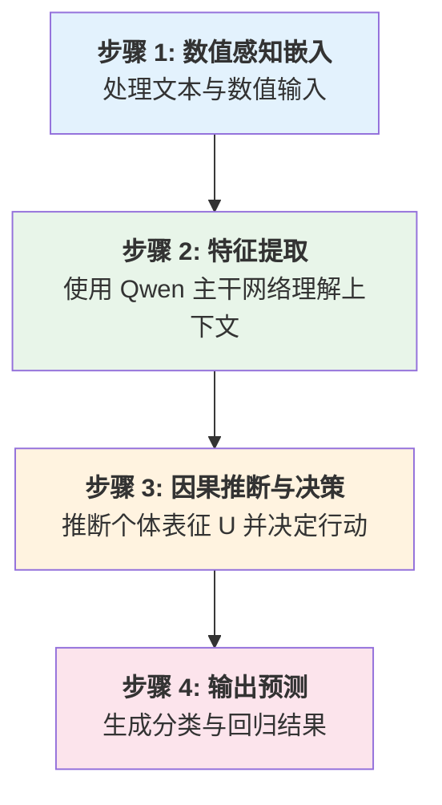
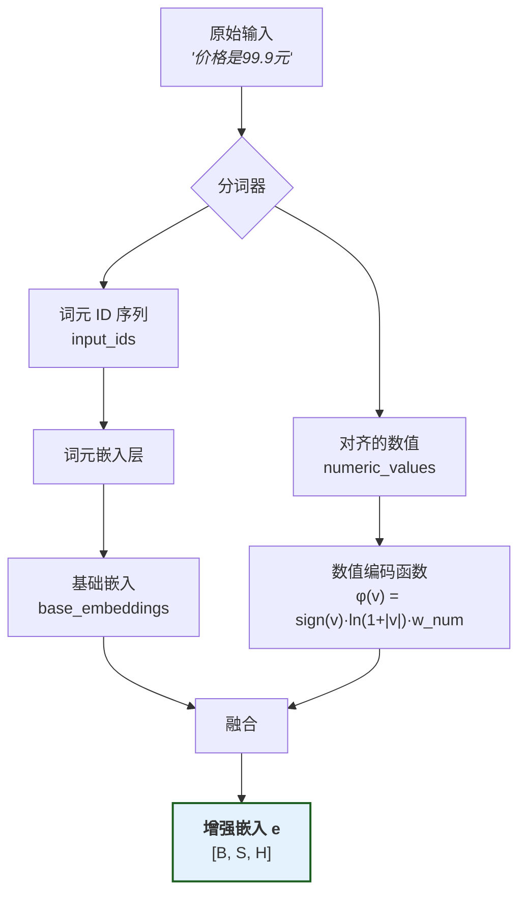
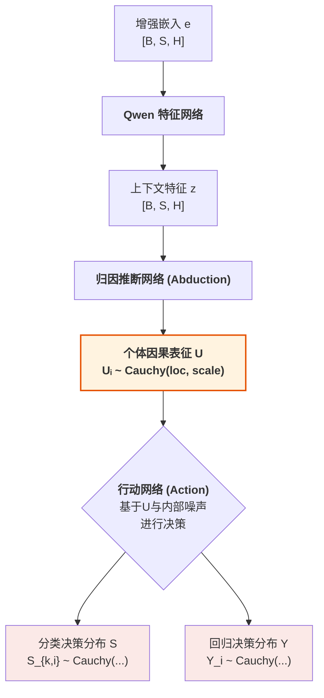
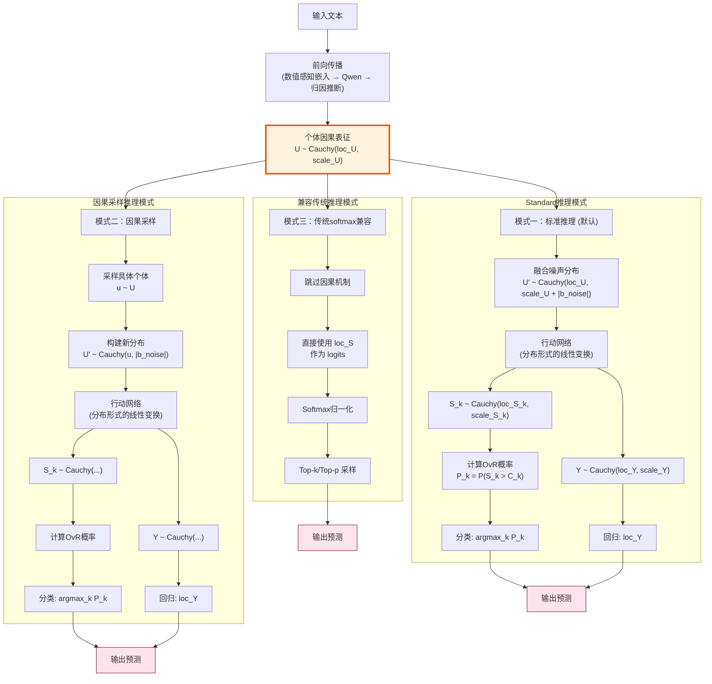
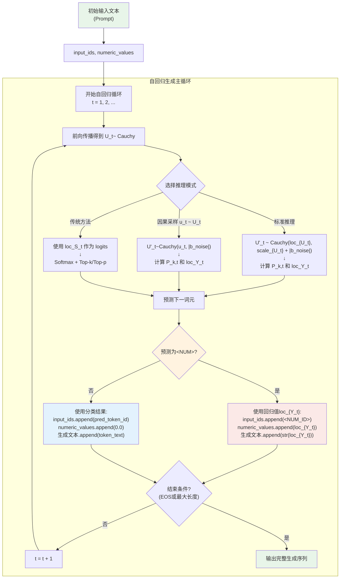
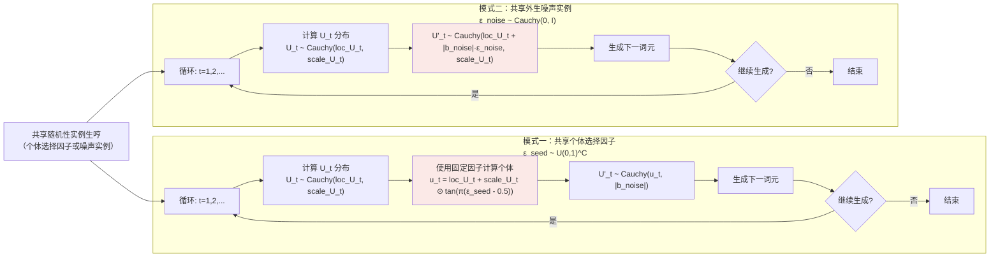
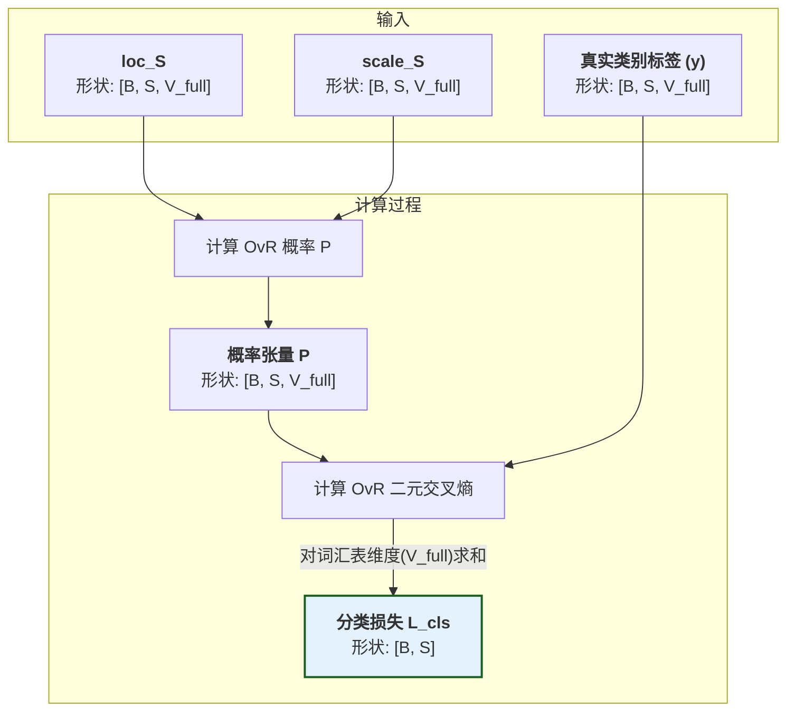
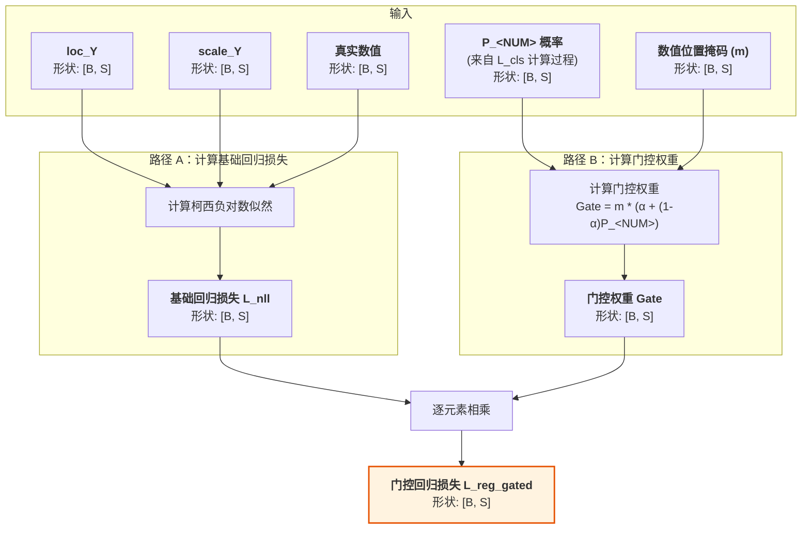
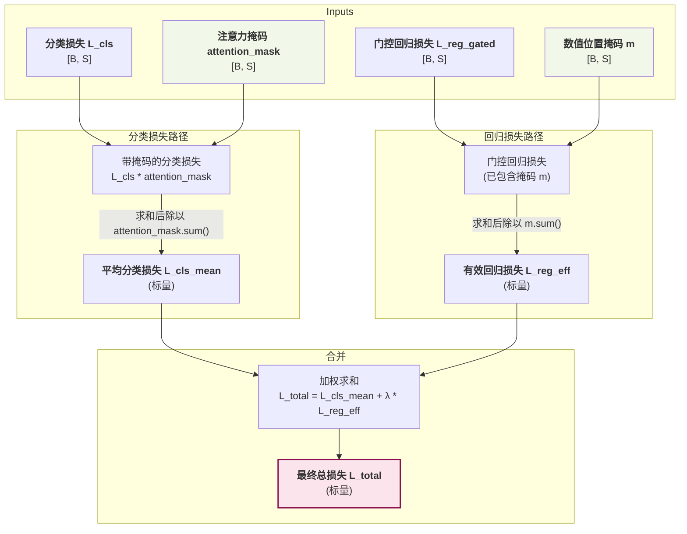

# 因果语言模型数学概览

本文档旨在为读者提供 CausalQwen 模型核心数学思想的直观概览。

## 1.核心创新：引入个体选择变量 U

为了真正实现因果推理，我们需要一个能够对个体的内在基因进行建模的框架。本项目的理论基石 ([arXiv:2401.15911](https://arxiv.org/abs/2401.15911)) 从数学上证明，为了构建一个能够灵活表达反事实的因果模型，引入一个外生的 **"个体选择变量" $U$** 是必要的。 $U$ 是理解本模型所有魔法的关键。它有两个核心身份：

1.  **个体选择变量 (Individual Selection Variable)**：一次具体的赋值 $U=u$ 代表着从所有可能的个体中"选中"了某一个特定个体 `u`。
2.  **个体因果表征 (Individual Causal Representation)**：被选中的向量 $u$ 本身，就包含了该个体所有内在的、驱动其行为的潜在属性。

**核心思想**：普适的因果律 ($Y=f(t;u, \text{noise})$) 应用于不同的个体 ($u$) 与外生噪声 ($\text{noise}$)，从而产生了不同的反事实结果 ($Y(t)$)。$U$ 是所有个体性系统性差异的最终来源，而 $\text{noise}$ 则代表了不可控的、非系统性的随机扰动。

> 深度解读请参见: [`design-docs/U_deep_dive.md`](design-docs/U_deep_dive.md)

## 2.训练阶段：前向传播 (Forward Pass)

模型训练的核心是执行一个完整的前向传播，计算预测值与真实标签之间的损失，然后通过反向传播更新模型参数。整个前向传播过程可以分解为五个核心模块。

> 我们用 B 代表批次大小, S 代表序列长度, H 代表模型隐藏维度, C 代表因果表征维度, K 代表基座模型 Qwen 的已用词汇表大小, V_full 代表扩展后的总词汇表大小（V_full = K + 271，其中 271 是 Qwen 的预留词汇空间）, CausalQwen 使用其中的 K+1 个词汇（包含新增的 `<NUM>` 词元）

> **设计决策**: 在当前实现中，我们设定因果表征维度 `C` 与模型隐藏层维度 `H` 相等，即 **`C = H`**。这简化了归因推断网络的初始化。

### 2.1 模块一：数值感知嵌入 (Numerical-aware Embedding)
这一模块的目标是将混合了文本和数值的原始输入，转化为一个统一的、数值感知的特征向量序列。这个过程包含三个关键步骤, *输入示例**: 原始字符串文本 `"价格是99.9元"`:

#### 1.分词与数值识别
分词器处理原始文本，识别并替换数值：

1.  **数值识别**: 分词器扫描文本，识别数值模式（如 `99.9`）
2.  **词元替换**: 将识别出的数值替换为特殊词元 `<NUM>`
3.  **数值保存**: 将原始数值单独保存，与词元序列保持位置对齐

-   **输出**: 
    - `input_ids` $[x_1, ..., x_S]$: `['价格', '是', '<NUM>', '元']` → `[12345, 67890, <NUM_ID>, 11111]` (形状: `[B, S]`)
    - `numeric_values` $[v_1, ..., v_S]$: `[0.0, 0.0, 99.9, 0.0]` (形状: `[B, S]`)

#### 2.词元嵌入
将词元ID序列转换为基础嵌入向量：

-   **输入**: `input_ids` (形状: `[B, S]`)
-   **处理**: 通过嵌入层查找每个词元的向量表示
    $$\text{base\_embed}_i = \text{EmbeddingLayer}(\text{input\_ids}_i)$$
-   **输出**: `base_embeddings` (形状: `[B, S, H]`)

#### 3.数值编码与融合
结合词元的基础嵌入和数值的对数编码，计算出最终的增强嵌入：

-   **输入**: 
    - `base_embeddings` (形状: `[B, S, H]`)
    - `numeric_values` (形状: `[B, S]`)
-   **处理**: 对每个位置 $i$，计算增强嵌入：
    $$e_i = \text{base\_embed}_i + \phi(v_i)$$
    数值编码函数：
    $$\phi(v) = \text{sign}(v) \cdot \ln(1 + |v|) \cdot \vec{w}_{\text{num}}$$
    其中 $v_i$ 是位置 $i$ 的数值（非数值位置为 0），$\vec{w}_{\text{num}} \in \mathbb{R}^H$ 是数值感知嵌入模块的可学习参数向量。
-   **输出**: 
    - `e`: 增强嵌入张量 (形状: `[B, S, H]`)

**关键洞察**：
1. **自然退化**: 对于非数值位置，$v_i = 0$ 导致 $\phi(0) = 0$，因此 $e_i = \text{base\_embed}_i$，自然退化为标准词元嵌入
2. **统一处理**: 所有位置使用相同的计算公式，无需条件分支
3. **位置对齐**: 数值信息与词元序列严格对齐，确保语义的连贯性

**完整示例**:
```
原始文本: "价格是99.9元"
     ↓ (分词器)
input_ids: [12345, 67890, <NUM_ID>, 11111]
numeric_values: [0.0, 0.0, 99.9, 0.0]
     ↓ (嵌入层)
base_embeddings: [[e1], [e2], [e3], [e4]]  # 每个ei是H维向量
     ↓ (数值编码)
φ(numeric_values): [[φ(0)], [φ(0)], [φ(99.9)], [φ(0)]]  # φ(99.9) = ln(100.9) * ê
     ↓ (融合)
enhanced_embeddings: [[e1], [e2], [e3 + φ(99.9)], [e4]]
```

> **设计动机**: 选择对数编码 $\phi(v)$ 是因为它具有三大优势：1) **数值稳定性**，将大范围数值压缩到合理区间；2) **相对误差保持**，对数空间中的等距对应原空间的等比；3) **自然退化**，由于$\phi(0)=0$，非数值位置自然退化为标准词元嵌入，无需特殊处理。

### 2.2 模块二：特征提取网络 (Feature Extraction Network)
该模块使用一个标准的 Transformer 网络（如Qwen）作为主干，来深度理解序列的上下文信息。

-   **输入**: `e`: 增强嵌入张量 (形状: `[B, S, H]`)
-   **处理**: 通过 $L$ 层 Transformer 进行特征提取：
    $$z = \text{QwenTransformer}(e)$$
    
    由于完全继承 Qwen 权重，当 $e \approx e_{\text{Qwen}}$ 时，$z \approx z_{\text{Qwen}}$。
-   **输出**: `z`: 上下文特征张量 (形状: `[B, S, H]`)

> **训练策略**: 在训练的初期阶段，QwenTransformer 的参数保持冻结，仅在后续阶段考虑使用 LoRA 等技术进行微调。这既保证了快速收敛，又维持了与基座模型的可比性。

### 2.3 模块三：归因推断网络 (Abduction Network)
该模块从上下文特征中推断出每个位置的个体因果表征分布。

-   **输入**: 上下文特征 `z` (形状: `[B, S, H]`)
-   **处理**: 通过线性层计算因果表征的分布参数：
    $$\text{loc}_{U_i} = W_{\text{loc}} \cdot z_i + b_{\text{loc}}$$
    $$\text{scale}_{U_i} = \text{softplus}(W_{\text{scale}} \cdot z_i + b_{\text{scale}})$$
    
    其中 $\text{softplus}(x) = \log(1 + \exp(x))$，保证尺度参数严格为正。
    
-   **输出**: 
    - `loc_U`: 因果表征分布的位置参数 (形状: `[B, S, C]`)
    - `scale_U`: 因果表征分布的尺度参数 (形状: `[B, S, C]`)

> **灵活性设计**: 归因推断网络是最灵活的组件，可以针对不同领域采用不同的网络结构。但需要满足约束：$D_{KL}(P(U|X) || P_{\text{base}}(U|X)) \leq \epsilon$，以防止灾难性遗忘。

### 2.4 模块四：行动网络 (Action Network)

该模块是模型的核心决策单元。其内部包含一个可学习的噪声参数 $b_{\text{noise}} \in \mathbb{R}^C$，工作流程分为两步：

1.  **噪声注入 (Noise Infusion)**：网络将上游推断出的个体表征分布 $U_i \sim \text{Cauchy}(\text{loc}_{U_i}, \text{scale}_{U_i})$ 与代表不可控随机性的外生噪声分布 $\epsilon \sim \text{Cauchy}(0, |b_{\text{noise}}|)$ 进行逐元素的独立叠加，形成融合输入分布：
    $$U'_{i} \sim \text{Cauchy}(\text{loc}_{U_i}, \text{scale}_{U_i} + |b_{\text{noise}}|)$$
    
    这里 $|b_{\text{noise}}|$ 表示对 $b_{\text{noise}} \in \mathbb{R}^C$ 逐元素取绝对值。

2.  **并行决策 (Parallel Decision Making)**：基于包含两种不确定性的融合输入分布，进行分类和回归决策。

-   **输入**: `loc_U` (形状: `[B, S, C]`), `scale_U` (形状: `[B, S, C]`)
-   **处理**: 
    - **分类**：每个词汇 $k$ 有独立的线性变换：
      $$\text{loc}_{S_{k,i}} = W_{\text{cls},k} \cdot \text{loc}_{U_i} + b_{\text{cls},k}$$
      $$\text{scale}_{S_{k,i}} = |W_{\text{cls},k}| \cdot (\text{scale}_{U_i} + |b_{\text{noise}}|)$$
      
      其中 $W_{\text{cls},k} \in \mathbb{R}^C$ 是词汇 $k$ 对应的权重向量，$\cdot$ 表示内积运算，$|W_{\text{cls},k}|$ 表示对权重向量逐元素取绝对值。
      
    - **回归**：单一的线性变换：
      $$\text{loc}_{Y_i} = W_{\text{reg}} \cdot \text{loc}_{U_i} + b_{\text{reg}}$$
      $$\text{scale}_{Y_i} = |W_{\text{reg}}| \cdot (\text{scale}_{U_i} + |b_{\text{noise}}|)$$
      
      其中 $W_{\text{reg}} \in \mathbb{R}^C$ 是回归权重向量，$|W_{\text{reg}}|$ 表示对权重向量逐元素取绝对值。
      
-   **输出**:
    - 分类决策分布参数: `loc_S` (形状: `[B, S, V_full]`), `scale_S` (形状: `[B, S, V_full]`)
    - 回归决策分布参数: `loc_Y` (形状: `[B, S]`), `scale_Y` (形状: `[B, S]`)

从数学上看，噪声注入和决策变换都是线性操作，整个网络等价于对增广输入 $[U_i, \epsilon]$ 的线性变换，保证了柯西分布的解析计算。

> **核心引擎：柯西分布的线性稳定性**
> 如果 $X_1, X_2, ..., X_n$ 是独立的柯西随机变量，$X_j \sim \text{Cauchy}(\mu_j, \gamma_j)$，那么对于权重 $w_j$：
> $$\sum_{j=1}^n w_j X_j \sim \text{Cauchy}\left(\sum_{j=1}^n w_j \mu_j, \sum_{j=1}^n |w_j| \gamma_j\right)$$
> 当权重都为正时，尺度参数简化为 $\sum_{j=1}^n w_j \gamma_j$。

### 2.5 模块五：损失计算 (Loss Calculation)

#### 1. OvR 分类损失
对每个类别计算独立的二元分类概率：
$$P_{k,i} = P(S_{k,i} > C_k) = \frac{1}{2} + \frac{1}{\pi} \arctan\left(\frac{\text{loc}_{S_{k,i}} - C_k}{\text{scale}_{S_{k,i}}}\right)$$

其中 $C_k$ 是类别 $k$ 的可学习阈值参数。

然后计算所有类别的二元交叉熵之和：
$$L_{\text{cls}, i} = -\sum_{k=0}^{V_{\text{full}}-1} [y_{k,i} \log P_{k,i} + (1-y_{k,i}) \log (1 - P_{k,i})]$$

其中 $y_{k,i}$ 是 one-hot 编码的真实标签。

#### 2. 门控回归损失
柯西分布的负对数似然及其门控损失：
$$\mathcal{L}_{\text{nll},i} = \log(\pi \cdot \text{scale}_{Y_i}) + \log\left(1 + \left(\frac{y_{\text{true},i} - \text{loc}_{Y_i}}{\text{scale}_{Y_i}}\right)^2\right) \\
\mathcal{L}_{\text{reg\_gated},i} = \text{num\_mask}_i \cdot \left(\alpha + (1-\alpha) P_{\text{<NUM>},i} \right) \cdot \mathcal{L}_{\text{nll},i}$$

门控权重（$\alpha=0$ 和 $\alpha=1$ 时）：
$$
\mathcal{L}_{\text{reg\_gated},i} = \text{num\_mask}_i \cdot P_{\text{<NUM>},i} \cdot \mathcal{L}_{\text{nll},i} \\
\mathcal{L}_{\text{reg\_gated},i} = \text{num\_mask}_i \cdot \mathcal{L}_{\text{nll},i}
$$

其中 `num_mask` 指示位置 $i$ 的真实标签是否为 `<NUM>`。

#### 3. 总损失
引入两种掩码：
- `cls_mask = attention_mask`：用于分类损失计算
- `num_mask = (labels == NUM_TOKEN_ID) & attention_mask`：用于回归损失计算

总损失为：
$$\mathcal{L}_{\text{total}} = \underbrace{\frac{\sum_i L_{\text{cls}, i} \cdot \text{cls\_mask}_i}{\sum_i \text{cls\_mask}_i}}_{\text{平均分类损失}} + \lambda \cdot \underbrace{\frac{\sum_i \mathcal{L}_{\text{reg\_gated},i}}{\sum_i \text{num\_mask}_i}}_{\text{有效回归损失}}$$

## 3.推理阶段：生成预测 (Inference)

在模型训练完成后，我们使用它来生成预测。CausalQwen 提供了一个层次化的推理方法体系，从最高效的标准预测，到能体现因果性的生成式采样，再到用于深度反事实分析的高级模式。

### 3.1 标准推理 (Standard Inference)
这是默认的、最高效的推理模式。它完全基于解析计算，不涉及任何随机采样。目标是给出综合考虑所有不确定性后的期望预测。
- **分类预测**: 选择OvR概率最高的类别：
    $$\hat{y}_{\text{cls},i} = \arg\max_k P_{k,i}$$
- **回归预测**: 使用位置参数（柯西分布的中位数/众数）：
    $$\hat{y}_{\text{reg},i} = \text{loc}_{Y_i}$$

### 3.2 因果采样 (Causal Sampling)
这是一种混合了随机性与确定性的高级推理模式，深刻体现了模型的因果哲学。过程分为三步：

1.  **采样个体**: 从后验分布 $U_i \sim \text{Cauchy}(\text{loc}_{U_i}, \text{scale}_{U_i})$ 中采样具体的个体表征 $u_i$。

2.  **构建决策输入分布**: 将确定的个体 $u_i$ 与噪声分布结合：
    $$ U'_{\text{input}, i} \sim \text{Cauchy}(u_i, |b_{\text{noise}}|) $$

3.  **计算确定性决策**: 将决策输入分布传入行动网络的线性变换，解析计算最终预测。

**核心思想**: 只在"个体选择"步骤引入随机性，而将"环境噪声"保持为分布形式，实现对不同个体的探索同时保持决策的稳健性。

### 3.3 兼容传统采样 (Compatibility with Traditional Sampling)
除了独有的因果采样，CausalQwen 在设计上完全兼容传统语言模型（如Qwen）的 `top-k`/`top-p` 采样方法。

行动网络输出的决策位置参数 `loc_S` (形状: `[B, S, V_full]`) 可以被直接视作标准语言模型输出的 logits。通过对 `loc_S` 应用 `Softmax` 函数，我们可以得到一个归一化的词汇表概率分布：
$$
P_{\text{softmax}}(y_i=k|x) = \frac{\exp(\text{loc}_{S_{k,i}})}{\sum_{j=1}^{V_{\text{full}}} \exp(\text{loc}_{S_{j,i}})}
$$
随后，便可在这组概率上执行标准的 `top-k`/`top-p` 采样, 这保证了 CausalQwen 可以作为 Qwen 的一个直接替代和功能超集来使用。

另一种可选的归一化方法是直接对所有类别的 OvR 概率进行求和，并以此为分母进行归一化，这为评估模型提供了不同的视角

### 3.4 高级（序列）因果采样：分解并固定随机性来源

CausalQwen 的设计允许我们对生成过程中的“随机性”进行前所未有的精细控制。传统的采样（如 top-k）在每一步都从一个临时的概率分布中抽取结果，导致随机性是无记忆、逐词元独立的。

高级（序列）因果采样模式则基于一个核心思想：**在一次完整的生成任务中，将模型两大不确定性来源（个体 `U` 或噪声 `noise`）之一的随机实例固定下来，并观察其在整个生成过程中如何持续地与另一不确定性来源相互作用。** 这使得我们能进行两种深刻的反事实探究。


#### 3.4.1 模式一：共享"个体选择因子" (Fixing the Individual, Observing its Interaction with Noise)

* **研究目标**：此模式旨在回答：“如果我们预先选定**一个确切的个体**，然后观察这个个体在面对一系列**不可预测的、逐-词元-独立的随机噪声**时，其行为会如何展开？”
* **实现机制**:

  1. **采样个体**: 在生成任务开始时，采样一个固定的“个体选择因子” $\vec{\epsilon}_{\text{seed}} \sim U(0, 1)^C$。在第 $i$ 步，我们用它计算出该上下文中的**具体个体表征** $u_i$：
     $$
     u_i = \text{loc}_{U_i} + \text{scale}_{U_i} \odot \tan\left(\pi \left(\vec{\epsilon}_{\text{seed}} - 0.5\right)\right)
     $$
  2. **构建决策输入分布**: 这个确定的个体 $u_i$ 随即进入一个充满不确定性的“决策情境”。其有效的输入心智状态不再是一个确定的向量，而是一个**包含了外生随机噪声的分布**：
     $$
     U'_{\text{input}, i} \sim \text{Cauchy}(u_i, |b_{noise}|)
     $$
  3. **解析决策**: 我们将这个**输入分布** $U'_{\text{input}, i}$ 传入行动网络。由于柯西分布的线性稳定性，我们可以**解析地**计算出最终的分类和回归决策分布，并取其位置参数（中位数）作为该步骤的最终预测。

* 随机性的来源被分解：代表“个体选择”的随机性（来自 $U$）在任务开始时被一次性固定。而代表“不可控扰动”的随机性（来自 `noise`）则在**每一步的决策中都保持其分布形态**，代表了每一token 生成决策时都会遇到的、全新的、不可预测的微小扰动。


#### 3.4.2 模式二：共享"系统性噪声实例" (Fixing the Noise, Observing the Uncertain Individual)

* **研究目标**：此模式旨在回答：“如果一个系统存在一种**持续不变的、系统性的随机影响**，那么一个本身具有内在不确定性的**个体（一个分布，而非一个实体）** 在这种影响下，其行为会如何展开？”
* **实现机制**:

  1. **采样噪声**: 在生成任务开始时，采样一个固定的“系统性噪声实例” $\vec{\epsilon}_{\text{noise}} \sim \text{Cauchy}(0, I)$。
  2. **构建受扰动的心智分布**: 在第 $i$ 步，我们不选定具体个体，而是取其完整的**个体因果表征分布** $U_i \sim \text{Cauchy}(\text{loc}_{U_i}, \text{scale}_{U_i})$。然后，我们将固定的噪声实例作用于这个分布的定位上。根据柯西分布的加法稳定性，我们得到一个新的、被系统性偏移的输入分布：
     $$
     U'_{\text{input}, i} \sim \text{Cauchy}(\text{loc}_{U_i} + |b_{\text{noise}}| \cdot \vec{\epsilon}_{\text{noise}}, \text{scale}_{U_i})
     $$
  3. **解析决策**: 同样，我们将这个新的**输入分布** $U'_{\text{input}, i}$ 传入行动网络，解析地计算出最终决策分布，并取其位置参数作为预测。

* 随机性的来源被再次分解：代表“不可控扰动”的随机性被一次性采样并固定下来，成为一种贯穿始终的“风格”或“偏差”。而代表“个体选择”的随机性则在**每一步都保持其完整的分布形态**（由变化的 `loc_U` 和 `scale_U` 定义），代表了个体在不同上下文归因推断的不确定性。


## 4.初始化策略：知识迁移

为了使 CausalQwen 能够无缝继承基座模型的强大语言能力，我们采用了一种**精简而有效**的初始化策略。核心思想是：**在训练开始时，CausalQwen 的行为应与原始的 Qwen 尽可能一致**。

#### 步骤1：数值感知嵌入 → 标准初始化

- **`<NUM>` 词元嵌入**：直接继承 Qwen 的第一个保留词元嵌入：
  $$\text{embed}(\text{<NUM>}) \leftarrow \text{embed}_{\text{Qwen}}(\text{<NUM>})$$

- **数值编码向量**：使用标准的向量初始化：
  $$\vec{w}_{\text{num}} \sim \mathcal{N}(0, 1/\sqrt{H})$$
  
  这是标准的 Xavier 初始化，确保前向传播时方差稳定。

#### 步骤2：归因推断网络 → 恒等映射初始化

为了确保知识迁移，归因推断网络应该初始化为近似恒等映射，使得初始的因果表征分布直接反映 Qwen 的特征：

- **位置网络**：设置为恒等映射
  $$W_{\text{loc}} \leftarrow I_H, \quad b_{\text{loc}} \leftarrow 0$$
  这样 $\text{loc}_{U_i} = z_i$，即因果表征的位置参数直接等于 Qwen 的输出特征。

- **尺度网络**：设置为产生常数尺度
  $$W_{\text{scale}} \leftarrow 0, \quad b_{\text{scale}} \leftarrow \sigma_{\text{init}}$$
  其中 $\sigma_{\text{init}} = 1.0$ 或类似的正数。这样 $\gamma_i = \text{softplus}(\sigma_{\text{init}})$ 是一个与输入无关的常数，提供了宽泛的先验分布。

> **关键洞察**: 这种初始化策略确保了：
> 1. 因果表征的位置参数完全继承了 Qwen 的知识表示
> 2. 尺度参数初始为常数，表示对所有位置的不确定性有相同的先验认识
> 3. 模型将在训练过程中学习到哪些位置需要更高或更低的不确定性

**数学推导**：在初始化状态下，对于位置 $i$：
- 归因推断网络输出：
  $$\text{loc}_{U_i} = W_{\text{loc}} \cdot z_i + b_{\text{loc}} = I_H \cdot z_i + 0 = z_i$$
  $$\text{scale}_{U_i} = \text{softplus}(W_{\text{scale}} \cdot z_i + b_{\text{scale}}) = \text{softplus}(0 \cdot z_i + \sigma_{\text{init}}) = \text{softplus}(\sigma_{\text{init}}) \cdot \mathbf{1}_C = \gamma_0 \cdot \mathbf{1}_C$$
  
- 因此，初始的因果表征分布为：
  $$U_i \sim \text{Cauchy}(z_i, \gamma_0 \cdot \mathbf{1}_C)$$

#### 步骤3：行动网络(分类) → 复制 Qwen 权重

$$W_{\text{cls}} \leftarrow W_{\text{Qwen\_lm\_head}}, \quad b_{\text{cls}} = 0$$

这确保了初始分类输出与 Qwen 一致。初始状态下，由于 $U_i \sim \text{Cauchy}(z_i, \gamma_0)$，行动网络的分类输出为：

**分类决策分布推导**：
- 融合输入分布（加入噪声）：
  $$U'_i \sim \text{Cauchy}(z_i, \gamma_0 \cdot \mathbf{1}_C + |b_{\text{noise}}|)$$
  
  其中 $\gamma_0 \cdot \mathbf{1}_C + |b_{\text{noise}}|$ 表示逐元素相加。
  
- 对于词汇 $k$，经过权重向量 $W_{\text{cls},k} \in \mathbb{R}^C$ 的线性变换（内积）后：
  $$S_{k,i} = W_{\text{cls},k} \cdot U'_i + b_{\text{cls},k} \sim \text{Cauchy}\left(W_{\text{cls},k} \cdot z_i, |W_{\text{cls},k}| \cdot (\gamma_0 \cdot \mathbf{1}_C + |b_{\text{noise}}|)\right)$$
  
- 因此：
  $$\text{loc}_{S_{k,i}} = W_{\text{cls},k} \cdot z_i = W_{\text{Qwen},k} \cdot z_i$$
  $$\text{scale}_{S_{k,i}} = |W_{\text{cls},k}| \cdot (\gamma_0 \cdot \mathbf{1}_C + |b_{\text{noise}}|)$$

这表明位置参数与原始 Qwen 的 logits 完全相同。

#### 步骤4：行动网络(回归) → 标准初始化

使用标准的 Xavier 或 He 初始化。模型将在训练中学习合适的回归映射。

**回归决策分布推导**：
- 基于融合输入分布 $U'_i \sim \text{Cauchy}(z_i, \gamma_0 \cdot \mathbf{1}_C + |b_{\text{noise}}|)$
- 经过回归权重向量 $W_{\text{reg}} \in \mathbb{R}^C$ 的线性变换：
  $$Y_i = W_{\text{reg}} \cdot U'_i + b_{\text{reg}} \sim \text{Cauchy}(\mu_{\text{reg},i}, \gamma_{\text{reg},i})$$
  
其中：
$$\mu_{\text{reg},i} = W_{\text{reg}} \cdot z_i + b_{\text{reg}}$$
$$\gamma_{\text{reg},i} = |W_{\text{reg}}| \cdot (\gamma_0 \cdot \mathbf{1}_C + |b_{\text{noise}}|)$$

这里 $|W_{\text{reg}}| \cdot (\gamma_0 \cdot \mathbf{1}_C + |b_{\text{noise}}|)$ 表示先对权重向量逐元素取绝对值，再与尺度向量进行内积。

通过上述初始化步骤，CausalQwen 在训练开始时具有以下性质：

-   **因果表征**: 对于每个位置 $i$，因果表征 $U_i$ 服从分布 $U_i \sim \text{Cauchy}(z_i, \gamma_0 \cdot \mathbf{1}_C)$，其中 $z_i \in \mathbb{R}^C$ 是 Qwen 的输出特征，$\gamma_0 = \text{softplus}(\sigma_{\text{init}})$ 是初始的常数尺度。
-   **分类决策**: 由于归因推断网络的恒等映射初始化和行动网络继承 Qwen 权重，分类输出的位置参数与 Qwen 完全一致：$\text{loc}_{S_{k,i}} = W_{\text{Qwen},k} \cdot z_i$。
-   **回归决策**: 位置参数 $\mu_{\text{reg},i} = W_{\text{reg}} \cdot z_i + b_{\text{reg}}$ 接近零均值，尺度参数由权重向量与尺度向量的内积决定。
-   **知识保持**: 当使用兼容性采样（基于 `loc_S` 的 softmax）时，模型的输出分布与原始 Qwen 完全相同，确保了知识的完美迁移。


## 5. 训练监控指标 (Training Monitoring Metrics)

为了有效评估和调试 CausalQwen 模型的训练过程，我们利用 Weights & Biases (wandb) 平台进行实时监控。本章提炼了 [`wandb_monitoring_metrics.md`](./experiments/wandb_monitoring_metrics.md) 中的核心指标，所有指标的计算都严格遵循本文档定义的数学原理。

### 5.1. 前提：基于确定性推理的评估

所有性能评估指标 (以 `eval/` 为前缀) **均基于确定性推理 (Deterministic Inference) 模式计算**。这保证了评估结果的**可复现性**和**稳定性**，为不同实验提供了可靠的基准。

### 5.2. 核心损失指标 (`train/*`)
-   **`train/accuracy`**: 在所有真实词元（应用 `attention_mask`）上计算分类准确率，衡量基础语言能力。
-   **`train/total_loss`**: 由平均分类损失 (`cls_loss_mean`) 和有效回归损失 (`reg_loss_effective`) 加权构成，是最终的优化目标。
-   **`train/cls_loss_mean`**: 在所有真实词元（应用 `attention_mask`）上计算的 OvR 分类损失的平均值，衡量基础语言能力。
-   **`train/reg_loss_effective`**: 仅在真实数值词元（应用数值掩码 `m`）上计算的门控回归损失的平均值，确保回归信号不被稀释。

### 5.3. 模型性能指标 (`eval/*`)

-   **词元预测准确率(`eval/accuracy`)** 
    - Perplexity 也可以考虑计算，但是 OvR 非归一化多分类概率，所以需要特殊处理才能使用。
-   **数值词元预测 (`eval/num_*`):
    -   **`num_precision`, `num_recall`, `num_f1`**: 全面评估模型在有效位置上辨别 `<NUM>` 词元的能力，是**门控机制性能的关键**。

-   **回归性能 (`eval/reg_*`)**:
    -   **`reg_mae` (平均绝对误差)**: 传统的误差度量，对异常值敏感。
    -   **`reg_mdae` (中位绝对误差)**: 对异常值稳健的误差度量。当 `mae` 远大于 `mdae` 时，表明存在少数极端错误的预测。

### 5.4. 内部状态分布指标 (`dist/*`)

这些指标的统计数据（`mean`, `median`, `std`, `iqr`）均在**有效词元位置（应用 `attention_mask`）** 上计算。

-   **因果表征 `U` (`dist/U_*`)**:
    -   通过对比 `U_loc` 和 `U_scale` 的 `mean`/`std` 与 `median`/`iqr`，我们可以深入分析其分布的**偏斜度**和**尾部重量**，从而诊断模型是否对特定词元学习到了特化表征，或是否明智地在困难样本上表达了更高的不确定性。

-   **OvR 校准 (`dist/ovr_prob_sum_*`)**:
    -   **标准推理模式**：`dist/ovr_prob_sum_median_standard` - 监控标准推理下的概率和
    -   **因果采样模式**：`dist/ovr_prob_sum_median_causal` - 监控固定个体下的概率和
    
    对于同一个确定的个体，其下一个词元只能有一个真值，因此因果采样模式下的概率和应该**更接近 1**，这是模型校准性的重要指标。

## 6. 使用流程图理解


### 图 1：CausalQwen 总体架构概览

这张图展示了模型最高层级的四大核心步骤，从输入到输出的完整流程。



---

### 图 2：详解步骤 1 - 数值感知嵌入

这张图详细描绘了第一个模块如何将混合了文本和数值的原始输入，转化为统一的向量表示 `e`。



---

### 图 3：详解步骤 2 & 3 - 因果核心流程

这张图展示了模型的核心机制：如何从上下文特征 `z` 推断出代表个体的因果分布 `U`，并基于 `U` 和内部噪声 `noise` 产生决策分布 `S` 和 `Y`。



---

### 图 4：详解步骤 4 


#### 4.1 CausalQwen 三种推理模式

这张图展示了CausalQwen的三种推理模式，从输入文本到最终预测的完整流程。



---

#### 4.2 CausalQwen 自回归序列生成流程

这张图展示了CausalQwen如何进行自回归序列生成，包括文本和数值的统一处理。



**关键特点**：
1. **统一处理**：每个位置都同时具有分类和回归能力
2. **数值感知**：当预测为`<NUM>`时，使用回归通道的输出值
3. **灵活推理**：支持三种推理模式的无缝切换
4. **序列一致性**：`input_ids`和`numeric_values`始终保持对齐

---

#### 4.3 高级序列因果采样详解

为了更好地理解3.4节中描述的高级因果采样模式，这里用流程图展示两种模式的具体实现：



**深层含义**：
- **模式一**：探索同一个体在不同环境扰动下的行为变化
- **模式二**：探索不同个体在相同系统性偏差下的反应差异

这两种模式为反事实分析和因果推理提供了强大的工具。


### 图 5：损失流程图


#### 图 5.1：分类损失 (`L_cls`) 的计算

这张图展示了如何从模型对全部词汇的预测分布，计算出每个位置的分类总损失。


* **解读**：模型输出的 `loc_S` 和 `scale_S` 首先被用来计算词汇表中每个词的 OvR 概率，得到一个形状为 `[B, S, V_full]` 的概率张量 `P`。然后，这个概率张量与同样形状的真实标签 `y` 一起计算交叉熵损失。最后，将每个位置上所有词汇的损失相加（在 `V_full` 维度上求和），最终得到一个形状为 `[B, S]` 的张量 `L_cls`，代表了批次中每个序列在每个位置的分类损失。

---

#### 图 5.2：门控回归损失 (`L_reg_gated`) 的计算

这张图是整个损失计算中最精巧的部分，详细解释了门控机制的数据流。


* **解读**：此流程有两个并行的路径。**路径 A** 使用回归分布参数和真实数值计算出一个基础的回归损失张量 `L_nll`。**路径 B** 利用分类任务中得到的 `<NUM>` 词元概率，结合一个指示真实标签是否为数值的掩码 `m`，计算出一个同样形状的 `Gate` 张量。最后，将 `L_nll` 和 `Gate` **逐元素相乘**，得到最终的门控回归损失 `L_reg_gated`。这种设计（默认 $\alpha=0$）确保了只有在真实标签是数值 `(m=1)` 且模型有一定把握认为是数值 `(P_<NUM> > 0)` 的位置，回归损失才会被有效计算。

---

#### 图 5.3：总损失 (`L_total`) 的合并

这张最终的图展示了如何将前两步计算出的损失张量合并，并得到最终用于反向传播的标量损失值。


* **关键修正与解读**：我们**不能**简单地将 `L_cls` 和 `L_reg_gated` 逐元素相加再求平均。由于数值 (`<NUM>`) 词元在文本中是**稀疏**的，`L_reg_gated` 张量中绝大部分元素为零。如果直接求平均，回归损失的信号会被严重"稀释"，无法有效指导模型优化。
* **正确流程**：正确的做法是分别对两个损失进行归约，然后再合并：
   1.  **分类损失**：对 `L_cls` 张量应用 `attention_mask` 来排除填充词元，然后求平均，得到一个标量 `L_cls_mean`。
   2.  **回归损失**：对 `L_reg_gated` 张量应用掩码 `m`，只对真实数值词元求和再求平均，得到一个标量 `L_reg_eff`。
   3.  **总损失**：将 `L_cls_mean` 和 `L_reg_eff` 进行加权求和，得到最终的标量损失 `L_total`。

## 7. 核心洞察与总结

CausalQwen 的数学框架三个特色：

1.  **因果表征**：通过 $U$ 建模个体因果性差异
2.  **分布计算**：利用柯西分布的线性性质，实现无采样训练
3.  **统一架构**：设计为 Qwen 的子类，通过扩展而非重构增加数值处理能力

### 7.1 ⚖️ CausalQwen vs. 标准 Qwen 对比清单

为了清晰地展示 CausalQwen 的创新之处，我们将其与标准的 Qwen 模型在几个核心维度上进行直接比较。

| 对比维度 (Dimension) | 标准 Qwen (Standard Qwen) | CausalQwen |
| :--- | :--- | :--- |
| **核心假设** | **关联性**：学习输入 $X$ 和输出 $Y$ 之间的条件概率分布 $P(Y\|X)$。 | **因果性**：学习一个普适的因果函数 $Y = f(t; u, \text{noise})$，其中 $u$ 是个体属性，$\text{noise}$ 是外生噪声。 |
| **数值处理** 🔢<br>Numerical Handling | **视为纯文本 (As Plain Text)**<br>将数字（如 "99.9"）当作普通词元处理，缺乏内在的数值概念。 | **双通道处理 (Dual-Channel)**<br>文本部分走词元嵌入，数值部分走独立的**回归通道**，真正理解数值大小。 |
| **输出架构** 🏛️<br>Output Architecture | **单一 Logits 输出 (Single Logits Output)**<br>输出一个维度为词汇表大小的 logits 向量，用于 Softmax。 | **双重分布输出 (Dual Distribution Output)**<br>输出独立的**分类 OvR 分布**和**回归柯西分布**，分别处理文本与数值。 |
| **损失函数** 🧮<br>Loss Function | **Softmax 交叉熵 (Softmax Cross-Entropy)**<br>在整个词汇表上进行归一化，计算单一正确答案的损失。 | **OvR + 门控回归损失 (Gated Reg Loss)**<br>分类上进行独立二元判断，回归上由分类结果**智能门控**，实现多任务学习。 |
| **采样范式** 🎲<br>Sampling Paradigm | **对"结果"采样 (Sampling the "Effect")**<br>在最终的 logits 分布上使用 `top-k`/`top-p` 进行随机采样。 | **对"原因"采样 (Sampling the "Cause")**<br>引入**因果采样**，直接对"个体" $U$ 进行采样，得到更多样且风格一致的生成结果。 |
| **核心创新** ✨<br>Key Innovation | 强大的语言建模与上下文理解能力。 | 引入外生**个体选择变量 $U$**，显式建模**外生噪声 $\text{noise}$**，并利用柯西分布的数学特性，构建了一个可高效训练的因果生成框架。 |


