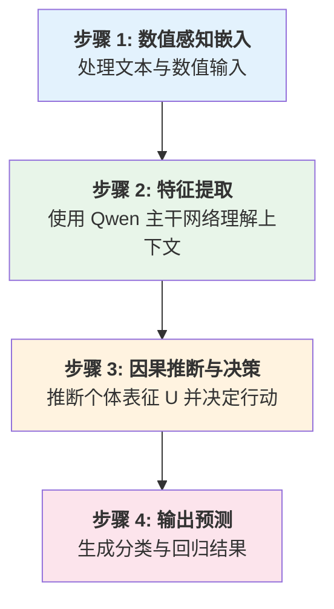
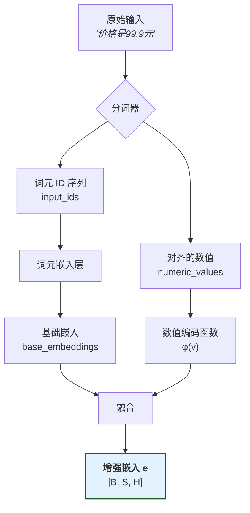
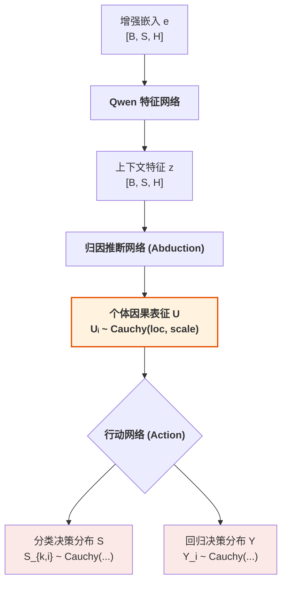
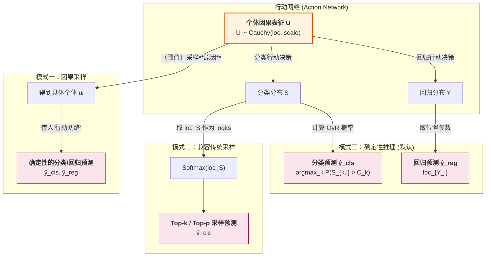
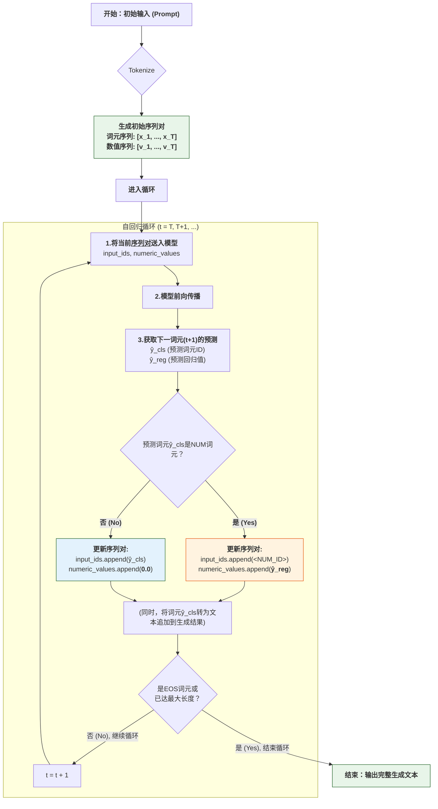
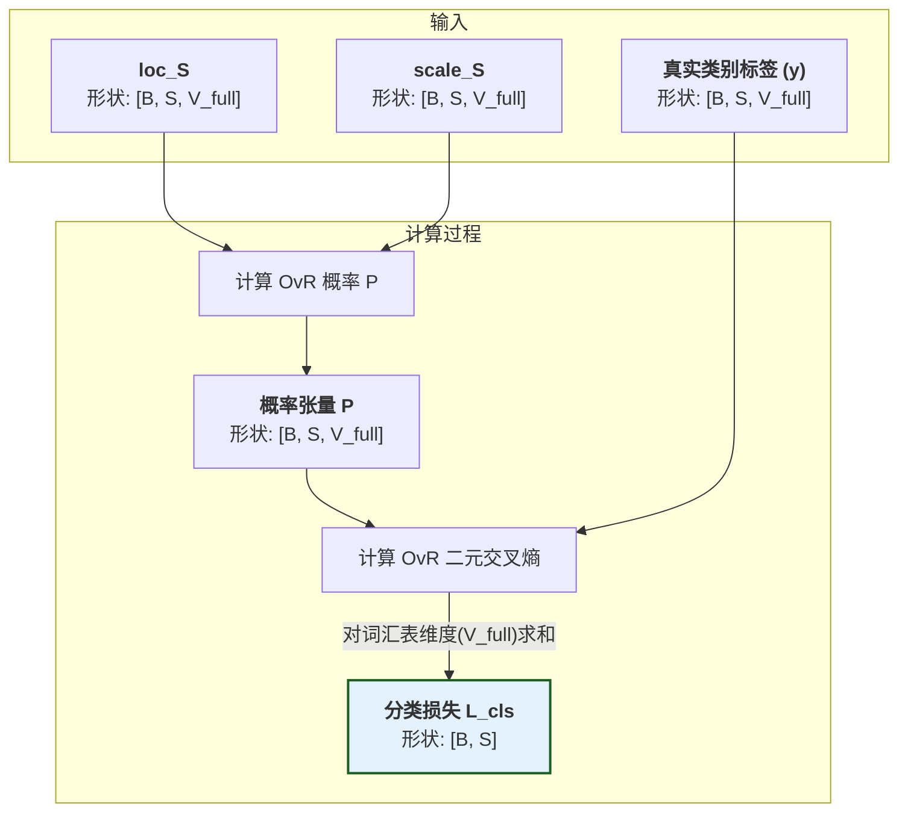
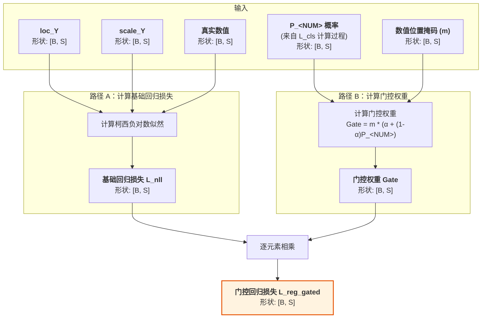
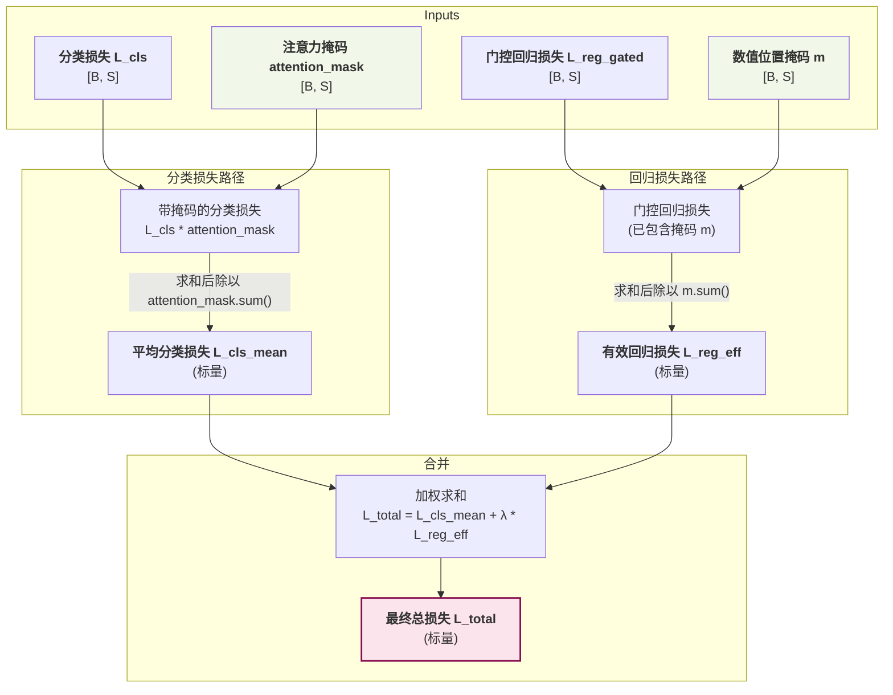

# 因果语言模型数学概览

本文档旨在为读者提供 CausalQwen 模型核心数学思想的直观概览。

## 1.核心创新：引入个体选择变量 U

为了真正实现因果推理，我们需要一个能够对个体的内在基因进行建模的框架。本项目的理论基石 ([arXiv:2401.15911](https://arxiv.org/abs/2401.15911)) 从数学上证明，为了构建一个能够灵活表达反事实的因果模型，引入一个外生的 **"个体选择变量" $U$** 是必要的。 $U$ 是理解本模型所有魔法的关键。它有两个核心身份：

1.  **个体选择变量 (Individual Selection Variable)**：一次具体的赋值 $U=u$ 代表着从所有可能的个体中"选中"了某一个特定个体 `u`。
2.  **个体因果表征 (Individual Causal Representation)**：被选中的向量 $u$ 本身，就包含了该个体所有内在的、驱动其行为的潜在属性。

**核心思想**：普适的因果律 ($Y=f(t;u)$) 应用于不同的个体 ($u$)，从而产生了不同的反事实结果 ($Y(t)$)。$U$ 是所有个体性差异的最终来源。

> 深度解读请参见: [`design-docs/U_deep_dive.md`](design-docs/U_deep_dive.md)

## 2.训练阶段：前向传播 (Forward Pass)

模型训练的核心是执行一个完整的前向传播，计算预测值与真实标签之间的损失，然后通过反向传播更新模型参数。整个前向传播过程可以分解为五个核心模块。

> 我们用 B 代表批次大小, S 代表序列长度, H 代表模型核心维度 (即词嵌入和隐藏层维度), C 代表因果表征维度, K 代表基座模型 Qwen 的已用词汇表大小, V_full代表总词汇表大小, CausalQwen 的已用词汇表大小为 K+1 (K+1 包含基座模型 Qwen 的已用词汇表大小 K 和 CausalQwen 的额外词汇 `<NUM>`) 

> **设计决策**: 在当前实现中，我们设定因果表征维度 `C` 与模型隐藏层维度 `H` 相等，即 **`C = H`**。这方便了我们进行归因推断网络的初始化。

### 2.1 模块一：数值感知嵌入 (Numerical-aware Embedding)
这一模块的目标是将混合了文本和数值的原始输入，转化为一个统一的、数值感知的特征向量序列。这个过程包含三个关键步骤, *输入示例**: 原始字符串文本 `"价格是99.9元"`:

#### 1.分词与数值识别
分词器处理原始文本，识别并替换数值：

1.  **数值识别**: 分词器扫描文本，识别数值模式（如 `99.9`）
2.  **词元替换**: 将识别出的数值替换为特殊词元 `<NUM>`
3.  **数值保存**: 将原始数值单独保存，与词元序列保持位置对齐

-   **输出**: 
    - `input_ids` $[x_1, ..., x_S]$: `['价格', '是', '<NUM>', '元']` → `[12345, 67890, <NUM_ID>, 11111]` (形状: `[B, S]`)
    - `numeric_values` $[v_1, ..., v_S]$: `[0.0, 0.0, 99.9, 0.0]` (形状: `[B, S]`)

#### 2.词元嵌入
将词元ID序列转换为基础嵌入向量：

-   **输入**: `input_ids` (形状: `[B, S]`)
-   **处理**: 通过嵌入层查找每个词元的向量表示
    $$\text{base\_embed}_i = \text{EmbeddingLayer}(\text{input\_ids}_i)$$
-   **输出**: `base_embeddings` (形状: `[B, S, H]`)

#### 3.数值编码与融合
结合词元的基础嵌入和数值的对数编码，计算出最终的增强嵌入：

-   **输入**: 
    - `base_embeddings` (形状: `[B, S, H]`)
    - `numeric_values` (形状: `[B, S]`)
-   **处理**: 对每个位置 $i$，计算增强嵌入：
    $$e_i = \text{base\_embed}_i + \phi(v_i)$$
    数值编码函数：
    $$\phi(v) = \text{sign}(v) \cdot \ln(1 + |v|) \cdot \vec{e}$$
    其中 $v_i$ 是位置 $i$ 的数值（非数值位置为 0），$\vec{e}$ 是归一化的方向向量，$\|\vec{e}\| = 1$。
-   **输出**: 
    - `e`: 增强嵌入张量 (形状: `[B, S, H]`)

**关键洞察**：
1. **自然退化**: 对于非数值位置，$v_i = 0$ 导致 $\phi(0) = 0$，因此 $e_i = \text{base\_embed}_i$，自然退化为标准词元嵌入
2. **统一处理**: 所有位置使用相同的计算公式，无需条件分支
3. **位置对齐**: 数值信息与词元序列严格对齐，确保语义的连贯性

**完整示例**:
```
原始文本: "价格是99.9元"
     ↓ (分词器)
input_ids: [12345, 67890, <NUM_ID>, 11111]
numeric_values: [0.0, 0.0, 99.9, 0.0]
     ↓ (嵌入层)
base_embeddings: [[e1], [e2], [e3], [e4]]  # 每个ei是H维向量
     ↓ (数值编码)
φ(numeric_values): [[φ(0)], [φ(0)], [φ(99.9)], [φ(0)]]  # φ(99.9) = ln(100.9) * ê
     ↓ (融合)
enhanced_embeddings: [[e1], [e2], [e3 + φ(99.9)], [e4]]
```

> **设计动机**: 选择对数编码 $\phi(v)$ 是因为它具有三大优势：1) **数值稳定性**，将大范围数值压缩到合理区间；2) **相对误差保持**，对数空间中的等距对应原空间的等比；3) **自然退化**，由于$\phi(0)=0$，非数值位置自然退化为标准词元嵌入，无需特殊处理。

### 2.2 模块二：特征提取网络 (Feature Extraction Network)
该模块使用一个标准的 Transformer 网络（如Qwen）作为主干，来深度理解序列的上下文信息。

-   **输入**: `e`: 增强嵌入张量 (形状: `[B, S, H]`)
-   **处理**: 通过 $L$ 层 Transformer 进行特征提取：
    $$z = \text{QwenTransformer}(e)$$
    
    由于完全继承 Qwen 权重，当 $e \approx e_{\text{Qwen}}$ 时，$z \approx z_{\text{Qwen}}$。
-   **输出**: `z`: 上下文特征张量 (形状: `[B, S, H]`)

### 2.3 模块三：归因推断网络 (Abduction Network)
该模块从上下文特征中推断出每个位置的个体因果表征分布。

-   **输入**: 上下文特征 `z` (形状: `[B, S, H]`)
-   **处理**: 通过线性层计算因果表征的分布参数：
    $$\text{loc}_{U_i} = W_{\text{loc}} \cdot z_i + b_{\text{loc}}$$
    $$\text{scale}_{U_i} = \exp(W_{\text{scale}} \cdot z_i + b_{\text{scale}})$$
    
    **初始化后**：$\text{loc}_{U_i} = z_i$，$\text{scale}_{U_i} = \gamma$
-   **输出**: 
    - `loc_U`: 因果表征分布的位置参数 (形状: `[B, S, C]`)
    - `scale_U`: 因果表征分布的尺度参数 (形状: `[B, S, C]`)

### 2.4 模块四：行动决策网络 (Action Network)
该模块基于推断出的因果表征分布，进行并行的分类和回归决策。

-   **输入**: `loc_U` 和 `scale_U`
-   **处理**: 
    - **分类**：每个词汇 $k$ 有独立的线性变换
      $$\text{loc}_{S_{k,i}} = W_{\text{cls},k} \cdot \text{loc}_{U_i} + b_{\text{cls},k}$$
      $$\text{scale}_{S_{k,i}} = |W_{\text{cls},k}| \cdot \text{scale}_{U_i}$$
      
      **初始化后**：$\text{loc}_{S_{k,i}} = W_{\text{Qwen},k} \cdot z_i$（与 Qwen 相同的 logits）
      
    - **回归**：单一的线性变换
      $$\text{loc}_{Y_i} = W_{\text{reg}} \cdot \text{loc}_{U_i} + b_{\text{reg}}$$
      $$\text{scale}_{Y_i} = \|W_{\text{reg}}\|_1 \cdot \text{scale}_{U_i}$$
      
      **初始化后**：$Y_i \sim \text{Cauchy}(0, \epsilon\gamma)$（近似无偏先验）
      
-   **输出**:
    - 分类决策分布参数: `loc_S` (形状: `[B, S, V_full]`), `scale_S` (形状: `[B, S, V_full]`)
    - 回归决策分布参数: `loc_Y` (形状: `[B, S]`), `scale_Y` (形状: `[B, S]`)

> **核心引擎：柯西分布的线性稳定性**
> 如果 $U \sim \text{Cauchy}(\mu, \gamma)$，那么 $aU + b \sim \text{Cauchy}(a\mu + b, |a|\gamma)$。这让我们无需采样就能计算变换后的分布。

### 2.5 模块五：损失计算 (Loss Calculation)

#### 1. OvR 分类损失
对每个类别计算独立的二元分类概率：
$$P_{k,i} = P(S_{k,i} > C_k) = \frac{1}{2} + \frac{1}{\pi} \arctan\left(\frac{\text{loc}_{S_{k,i}} - C_k}{\text{scale}_{S_{k,i}}}\right)$$

然后计算所有类别的二元交叉熵之和：
$$L_{\text{cls}, i} = -\sum_{k=0}^{V_{\text{full}}-1} [y_{k,i} \log P_{k,i} + (1-y_{k,i}) \log (1 - P_{k,i})]$$

其中 $y_{k,i}$ 是 one-hot 编码的真实标签。

#### 2. 门控回归损失
柯西分布的负对数似然：
$$\mathcal{L}_{\text{nll},i} = \log(\pi \cdot \text{scale}_{Y_i}) + \log\left(1 + \left(\frac{y_{\text{true},i} - \text{loc}_{Y_i}}{\text{scale}_{Y_i}}\right)^2\right)$$

门控权重（$\alpha=0$ 时）：
$$\mathcal{L}_{\text{reg\_gated},i} = m_i \cdot P_{\text{<NUM>},i} \cdot \mathcal{L}_{\text{nll},i}$$

其中 $m_i$ 指示位置 $i$ 的真实标签是否为 `<NUM>`。

#### 3. 总损失
$$\mathcal{L}_{\text{total}} = \underbrace{\frac{\sum_i L_{\text{cls}, i} \cdot \text{mask}_i}{\sum_i \text{mask}_i}}_{\text{平均分类损失}} + \lambda \cdot \underbrace{\frac{\sum_i \mathcal{L}_{\text{reg\_gated},i}}{\sum_i m_i}}_{\text{有效回归损失}}$$

## 3.推理阶段：生成预测 (Inference)

在模型训练完成后，我们使用它来生成预测。CausalQwen 提供两种推理模式。

### 3.1 确定性推理 (Deterministic Inference)
这是默认的、最高效的推理模式。它完全基于解析计算，不涉及任何随机采样。
- **分类预测**: 直接使用前向传播计算出的各类 OvR 概率，并选择概率最高的类别。
    $$
    \hat{y}_{\text{cls},i} = \arg\max_k P_{k,i}
    $$
- **回归预测**: 直接使用回归值分布的位置参数（中位数），这是对柯西分布最稳健的点估计。
    $$
    \hat{y}_{\text{reg},i} = \text{loc}_{Y_i}
    $$

### 3.2 因果采样 (Causal Sampling)
这是一种新颖的随机推理范式，它不直接对不确定的"结果"进行采样，而是对不确定的"原因"（即个体因果表征 U）进行采样。这是一种比`top-k`/`top-p`更符合因果直觉的采样方法。

1.  **采样"原因"**: 根据上下文推断出的因果表征分布 `Cauchy(loc_U, scale_U)`，从中采样一个**具体的**表征向量 $u_i$。
2.  **观察"结果"**: 将这个确定的 $u_i$ 传入**行动网络**，得到**确定性的**分类分数和回归值，并据此做出最终预测。

传统大模型需要 Top-P 和 Top-K 采样，是因为它们提供了一种在保真度（fidelity）和多样性（diversity）之间进行权衡的有效手段。我们类似可以使用似然截断来来实现对应的功能， 也就是说概率密度 $p_{U_i}(u_i)$ 需要大于某个数值或者等于$\frac{1}{\pi \text{scale}_{U_i}}$(Cauchy密度最大值)的 $u_i$ 才被保留。

### 3.3 兼容传统采样 (Compatibility with Traditional Sampling)
除了独有的因果采样，CausalQwen 在设计上完全兼容传统语言模型（如Qwen）的 `top-k`/`top-p` 采样方法。

行动网络输出的决策位置参数 `loc_S` (形状: `[B, S, V_full]`) 可以被直接视作标准语言模型输出的 logits。通过对 `loc_S` 应用 `Softmax` 函数，我们可以得到一个归一化的词汇表概率分布：
$$
P_{\text{softmax}}(y_i=k|x) = \frac{\exp(\text{loc}_{S_{k,i}})}{\sum_{j=1}^{V_{\text{full}}} \exp(\text{loc}_{S_{j,i}})}
$$
随后，便可在这组概率上执行标准的 `top-k`/`top-p` 采样。另一种可选的归一化方法是直接对所有类别的 OvR 概率进行求和，并以此为分母进行归一化，这为评估模型提供了不同的视角。这保证了 CausalQwen 可以作为 Qwen 的一个直接替代和功能超集来使用。

### 3.4 (可选)共享随机性：因果采样的高级模式

因果采样的一个核心优势，在于通过**重参数化技巧 (Reparameterization Trick)**，实现了对生成过程随机性的精细控制。

为了从推断出的因果表征分布 $\text{Cauchy}(\text{loc}_{U_i}, \text{scale}_{U_i})$ 中采样，我们不直接进行随机抽取，而是执行一个确定性变换：
1.  首先，从标准均匀分布中采样一个**固定的**随机向量 $\vec{\epsilon} \sim U(0, 1)^C$。
2.  然后，使用此 $\vec{\epsilon}$ 为序列中的**每一个**位置 $i$ 计算其因果表征 $u_i$：
    $$
    u_i = \text{loc}_{U_i} + \text{scale}_{U_i} \odot \tan\left(\pi \left(\vec{\epsilon} - 0.5\right)\right)
    $$
    其中 $\odot$ 表示逐元素相乘。

**深刻的含义：分离与共享**

这个技巧的巧妙之处在于它将模型的内在逻辑（由上下文决定的 $\text{loc}_{U_i}$ 和 $\text{scale}_{U_i}$）与外在的随机性（由 $\vec{\epsilon}$ 代表）完全分离。更重要的是，它允许我们在一次完整的生成任务（如生成一段回复）中，**只采样一次 $\vec{\epsilon}$ 并持续使用它**。这意味着：
- **随机性来源是统一的**：整个序列的所有词元共享同一个"随机种子"或"灵感来源" $\vec{\epsilon}$。
- **上下文驱动多样性**：词元间的差异完全由模型根据上下文动态计算出的 $\text{loc}_{U_i}$ 和 $\text{scale}_{U_i}$ 决定。

这与传统 `top-k`/`top-p` 采样在每一步都独立进行随机抽样的方式形成了鲜明对比。CausalQwen 的方法更贴近人类的表达方式：一旦确定了某种"谈话风格"或"核心意图"（由 $\vec{\epsilon}$ 固化），整个句子都会围绕它连贯地展开，而不是每个词都随机地偏离主题。这为生成更具一致性和个性化风格的文本提供了坚实的数学基础。

## 4.初始化策略：知识迁移

为了使 CausalQwen 能够无缝继承基座模型的强大语言能力，我们采用了一种**简单而精确**的初始化策略。其核心思想是：**在训练开始时，CausalQwen 的行为应与原始的 Qwen 完全一致**。设计原则如下：

1. **数学恒等**：新增模块在初始时表现为恒等映射或零映射
2. **知识保持**：完整继承 Qwen 的语言表征能力  
3. **渐进激活**：新功能在训练过程中逐步被"唤醒"

总共四步初始化：

#### 步骤1：数值感知嵌入 → 保守初始化 (数值感知嵌入层)

数值感知嵌入层的初始化需要确保数值编码不会对原有的词元嵌入造成过大干扰。

- **`<NUM>` 词元嵌入处理**：因为我们将 `<NUM>` 设置成在 Qwen 词汇表中的第一个保留词元(Qwen2.5-0.5B有271个保留词元)，直接继承 Qwen 的 `<NUM>` 嵌入,无需额外初始化：$$\text{embed}(\text{<NUM>}) \leftarrow \text{embed}_{\text{Qwen}}(\text{<NUM>})$$

- **方向向量初始化**(后续可以考虑让他是可学习参数)：
$$\vec{e} \sim \mathcal{N}(0, \sigma_e^2 I), \quad \text{然后归一化: } \vec{e} \leftarrow \frac{\vec{e}}{\|\vec{e}\|}$$

其中 $\sigma_e$ 是小的标准差（如 $\sigma_e = 0.02$）。最终，位置 $i$ 的数值感知嵌入层的计算公式为：
$$e_i = \text{embed}(x_i) + \phi(v_i), \quad \text{where }  \phi(v) = \text{sign}(v) \cdot \ln(1 + |v|) \cdot \vec{e}$$

使用它作为输出，经过 Qwen 主干网络，得到高维的特征表征 $z_i$(形状: [B, S, H]), 作为后续归因推断网络的输入。


#### 步骤2：归因推断网络 → 恒等映射

设定权重使得：
$$\text{loc}_{U_i} = z_i, \quad \text{scale}_{U_i} = \gamma$$

**实现**：
- 位置网络：$W_{\text{loc}} = I$（单位矩阵），$b_{\text{loc}} = 0$
- 尺度网络：$W_{\text{scale}} = 0$，$b_{\text{scale}} = \log(\gamma)$

其中 $\gamma$ 是大常数（如 10），提供宽泛的初始分布。

#### 步骤3：行动网络(分类) → 复制 Qwen 权重

$$W_{\text{cls}} \leftarrow W_{\text{Qwen\_lm\_head}}, \quad b_{\text{cls}} = 0$$

由于 $\text{loc}_{U_i} = z_i$，所以：
$$\text{loc}_{S_{k,i}} = W_{\text{cls},k} \cdot z_i = W_{\text{Qwen},k} \cdot z_i$$

这确保了初始分类输出与 Qwen 完全一致。

#### 步骤4：行动网络(回归) → 常规初始化

将回归行动网络使用标准的小权重初始化，如 Xavier 或 Kaiming 初始化。

**数学效果**：由于 $\|W_{\text{reg}}\|$ 很小，结合大尺度的因果表征分布 $U_i \sim \text{Cauchy}(z_i, \gamma_i)$，位置 $i$ 的回归预测分布为：
$$Y_i \sim \text{Cauchy}(\mu_{\text{reg},i}, \gamma_{\text{reg},i}),  \\
\mu_{\text{reg},i} = W_{\text{reg}} \cdot z_i + b_{\text{reg}},  \gamma_{\text{reg},i} = |W_{\text{reg}}| \cdot \gamma_i$$

其中 $|W_{\text{reg}}|$ 是该向量每个元素都取绝对值，回归输出近似为以 $0$ 为中心的宽泛分布，提供了**无偏的回归先验** ($\mu_{\text{reg}}$ 和 $\gamma_{\text{reg}}$ 的张量形状都是 [B, S]) 。

#### 步骤5：OvR 阈值 → 统一设置

在 OvR 分类中，阈值 $C_k$ 决定了柯西分布决策分数超过阈值的概率计算：

$$P_{k,i} = P(S_{k,i} > C_k) = \frac{1}{2} + \frac{1}{\pi} \arctan\left(\frac{\text{loc}_{S_{k,i}} - C_k}{\text{scale}_{S_{k,i}}}\right)$$

得一个形状是 [B, S, V_full] 的概率张量 $\mathbf{P}$。

**阈值初始化**：
- **标量形式**：所有类别使用相同的常数阈值
  $$C_k = C_{\text{OvR}}, \quad \forall k \in \{0, 1, \ldots, V_{\text{full}}-1\}$$
  
- **向量形式**：为将来的可学习参数预留接口
  $$\mathbf{C} = [C_0, C_1, ..., C_{V_{\text{full}}-1}]$$
  
  初始化时可设为：$C_k = C_{\text{OvR}} + \epsilon_k$，其中 $\epsilon_k$ 是小的随机扰动

其中 $C_{\text{OvR}}$ 是预设常数（如 100.0）。

**数学效果**：
- $C_{\text{OvR}} = 0$: 初始概率接近 0.5，无明显偏好
- $C_{\text{OvR}} = 10$: 初始概率普遍较低，创造稀疏激活
- $C_{\text{OvR}} \geq 100$: 极度稀疏的初始概率分布

**推荐设置**：$C_{\text{OvR}} = 100.0$，这提供了良好的起点。

> **未来扩展**：当 $\mathbf{C}$ 成为可学习参数后，模型可以自动调整每个词汇的"激活阈值"，为频繁词汇学习较低阈值，为罕见词汇保持较高阈值。

通过上述初始化步骤，CausalQwen 在训练开始时具有以下性质：

-   **因果表征**: 对于每个位置 $i$，因果表征 $U_i$ 服从宽泛的柯西分布 $U_i \sim \text{Cauchy}(z_i, \gamma_i)$，其中 $\gamma_i$ 是大数。
-   **分类决策**: 分类行动网络的输出与 Qwen 的原始输出完全一致，即 $\text{loc}_{S_{k,i}} = \mathbf{W}_{\text{Qwen}}[k, :] \cdot z_i$。
-   **回归决策**: 由于回归网络的标准初始化，回归预测的分布为 $Y_i \sim \text{Cauchy}(W_{\text{reg}} \cdot z_i + b_{\text{reg}},  |W_{\text{reg}}| \cdot \gamma_i)$，当 $\gamma_i$ 很大时，近似为以 0 为中心的宽泛分布。
-   **阈值设置**: 所有类别共享相同的初始阈值 $C_k = C_{\text{OvR}}$，这提供了一个适度稀疏且数值稳定的初始概率分布。


## 5. 训练监控指标 (Training Monitoring Metrics)

为了有效评估和调试 CausalQwen 模型的训练过程，我们利用 Weights & Biases (wandb) 平台进行实时监控。本章提炼了 [`wandb_monitoring_metrics.md`](./experiments/wandb_monitoring_metrics.md) 中的核心指标，所有指标的计算都严格遵循本文档定义的数学原理。

### 5.1. 前提：基于确定性推理的评估

所有性能评估指标 (以 `eval/` 为前缀) **均基于确定性推理 (Deterministic Inference) 模式计算**。这保证了评估结果的**可复现性**和**稳定性**，为不同实验提供了可靠的基准。

### 5.2. 核心损失指标 (`train/*`)

-   **`train/total_loss`**: 由平均分类损失 (`cls_loss_mean`) 和有效回归损失 (`reg_loss_effective`) 加权构成，是最终的优化目标。
-   **`train/cls_loss_mean`**: 在所有真实词元（应用 `attention_mask`）上计算的 OvR 分类损失的平均值，衡量基础语言能力。
-   **`train/reg_loss_effective`**: 仅在真实数值词元（应用数值掩码 `m`）上计算的门控回归损失的平均值，确保回归信号不被稀释。

### 5.3. 模型性能指标 (`eval/*`)

-   **词元预测准确率(`eval/accuracy`)** 
    - Perplexity 也可以考虑计算，但是 OvR 非归一化多分类概率，所以需要特殊处理才能使用。
-   **数值词元预测 (`eval/num_*`)**:
    -   **`num_precision`, `num_recall`, `num_f1`**: 全面评估模型在有效位置上辨别 `<NUM>` 词元的能力，是**门控机制性能的关键**。

-   **回归性能 (`eval/reg_*`)**:
    -   **`reg_mae` (平均绝对误差)**: 传统的误差度量，对异常值敏感。
    -   **`reg_mdae` (中位绝对误差)**: 对异常值稳健的误差度量。当 `mae` 远大于 `mdae` 时，表明存在少数极端错误的预测。

### 5.4. 内部状态分布指标 (`dist/*`)

这些指标的统计数据（`mean`, `median`, `std`, `iqr`）均在**有效词元位置（应用 `attention_mask`）** 上计算。

-   **因果表征 `U` (`dist/U_*`)**:
    -   通过对比 `U_loc` 和 `U_scale` 的 `mean`/`std` 与 `median`/`iqr`，我们可以深入分析其分布的**偏斜度**和**尾部重量**，从而诊断模型是否对特定词元学习到了特化表征，或是否明智地在困难样本上表达了更高的不确定性。

-   **OvR 校准 (`dist/ovr_prob_sum_median`)**:
    -   监控所有词元的 OvR 概率之和的中位数。一个充分校准的模型，其概率和应**收敛于 1**，这反映了模型学习到了词元预测任务的内在互斥性。

---
*本章是对详细监控文档的概括。关于每个指标更深入的数学公式、解读和诊断指南，请参阅 [`docs/experiments/wandb_monitoring_metrics.md`](./experiments/wandb_monitoring_metrics.md)。*


## 6. 使用流程图理解


### 图 1：CausalQwen 总体架构概览

这张图展示了模型最高层级的四大核心步骤，从输入到输出的完整流程。



---

### 图 2：详解步骤 1 - 数值感知嵌入

这张图详细描绘了第一个模块如何将混合了文本和数值的原始输入，转化为统一的向量表示 `e`。



---

### 图 3：详解步骤 2 & 3 - 因果核心流程

这张图展示了模型的核心机制：如何从上下文特征 `z` 推断出代表个体的因果分布 `U`，并基于 `U` 产生决策分布 `S` 和 `Y`。



---

### 图 4：详解步骤 4 


#### 4.1 CausalQwen 三种推理模式

这张图从决策分布 `S` 和 `Y` 出发，清晰地展示了三种不同的预测生成方式。


#### 4.2 CausalQwen 自回归生成流程图




### 图 5：损失流程图


#### 图 5.1：分类损失 (`L_cls`) 的计算

这张图展示了如何从模型对全部词汇的预测分布，计算出每个位置的分类总损失。


* **解读**：模型输出的 `loc_S` 和 `scale_S` 首先被用来计算词汇表中每个词的 OvR 概率，得到一个形状为 `[B, S, V_full]` 的概率张量 `P`。然后，这个概率张量与同样形状的真实标签 `y` 一起计算交叉熵损失。最后，将每个位置上所有词汇的损失相加（在 `V_full` 维度上求和），最终得到一个形状为 `[B, S]` 的张量 `L_cls`，代表了批次中每个序列在每个位置的分类损失。

---

#### 图 5.2：门控回归损失 (`L_reg_gated`) 的计算

这张图是整个损失计算中最精巧的部分，详细解释了门控机制的数据流。


* **解读**：此流程有两个并行的路径。**路径 A** 使用回归分布参数和真实数值计算出一个基础的回归损失张量 `L_nll`。**路径 B** 利用分类任务中得到的 `<NUM>` 词元概率，结合一个指示真实标签是否为数值的掩码 `m`，计算出一个同样形状的 `Gate` 张量。最后，将 `L_nll` 和 `Gate` **逐元素相乘**，得到最终的门控回归损失 `L_reg_gated`。这种设计（默认 $\alpha=0$）确保了只有在真实标签是数值 `(m=1)` 且模型有一定把握认为是数值 `(P_<NUM> > 0)` 的位置，回归损失才会被有效计算。

---

#### 图 5.3：总损失 (`L_total`) 的合并

这张最终的图展示了如何将前两步计算出的损失张量合并，并得到最终用于反向传播的标量损失值。


* **关键修正与解读**：我们**不能**简单地将 `L_cls` 和 `L_reg_gated` 逐元素相加再求平均。由于数值 (`<NUM>`) 词元在文本中是**稀疏**的，`L_reg_gated` 张量中绝大部分元素为零。如果直接求平均，回归损失的信号会被严重"稀释"，无法有效指导模型优化。
* **正确流程**：正确的做法是分别对两个损失进行归约，然后再合并：
   1.  **分类损失**：对 `L_cls` 张量应用 `attention_mask` 来排除填充词元，然后求平均，得到一个标量 `L_cls_mean`。
   2.  **回归损失**：对 `L_reg_gated` 张量应用掩码 `m`，只对真实数值词元求和再求平均，得到一个标量 `L_reg_eff`。
   3.  **总损失**：将 `L_cls_mean` 和 `L_reg_eff` 进行加权求和，得到最终的标量损失 `L_total`。

## 7. 核心洞察与总结

CausalQwen 的数学框架三个特色：

1.  **因果表征**：通过 $U$ 建模个体因果性差异
2.  **分布计算**：利用柯西分布的线性性质，实现无采样训练
3.  **统一架构**：设计为 Qwen 的子类，通过扩展而非重构增加数值处理能力

### 7.1 ⚖️ CausalQwen vs. 标准 Qwen 对比清单

为了清晰地展示 CausalQwen 的创新之处，我们将其与标准的 Qwen 模型在几个核心维度上进行直接比较。

| 对比维度 (Dimension) | 标准 Qwen (Standard Qwen) | CausalQwen |
| :--- | :--- | :--- |
| **核心假设** | **关联性**：学习输入 $X$ 和输出 $Y$ 之间的条件概率分布 $P(Y\|X)$。 | **因果性**：学习一个普适的因果函数 $Y = f(t; u)$，其中 $u$ 是代表个体内在属性的变量。 |
| **数值处理** 🔢<br>Numerical Handling | **视为纯文本 (As Plain Text)**<br>将数字（如 "99.9"）当作普通词元处理，缺乏内在的数值概念。 | **双通道处理 (Dual-Channel)**<br>文本部分走词元嵌入，数值部分走独立的**回归通道**，真正理解数值大小。 |
| **输出架构** 🏛️<br>Output Architecture | **单一 Logits 输出 (Single Logits Output)**<br>输出一个维度为词汇表大小的 logits 向量，用于 Softmax。 | **双重分布输出 (Dual Distribution Output)**<br>输出独立的**分类 OvR 分布**和**回归柯西分布**，分别处理文本与数值。 |
| **损失函数** 🧮<br>Loss Function | **Softmax 交叉熵 (Softmax Cross-Entropy)**<br>在整个词汇表上进行归一化，计算单一正确答案的损失。 | **OvR + 门控回归损失 (Gated Reg Loss)**<br>分类上进行独立二元判断，回归上由分类结果**智能门控**，实现多任务学习。 |
| **采样范式** 🎲<br>Sampling Paradigm | **对"结果"采样 (Sampling the "Effect")**<br>在最终的 logits 分布上使用 `top-k`/`top-p` 进行随机采样。 | **对"原因"采样 (Sampling the "Cause")**<br>引入**因果采样**，直接对"个体" $U$ 进行采样，得到更多样且风格一致的生成结果。 |
| **核心创新** ✨<br>Key Innovation | 强大的语言建模与上下文理解能力。 | 引入外生**个体选择变量 $U$**，并利用柯西分布的数学特性，构建了一个可高效训练的因果生成框架。 |

