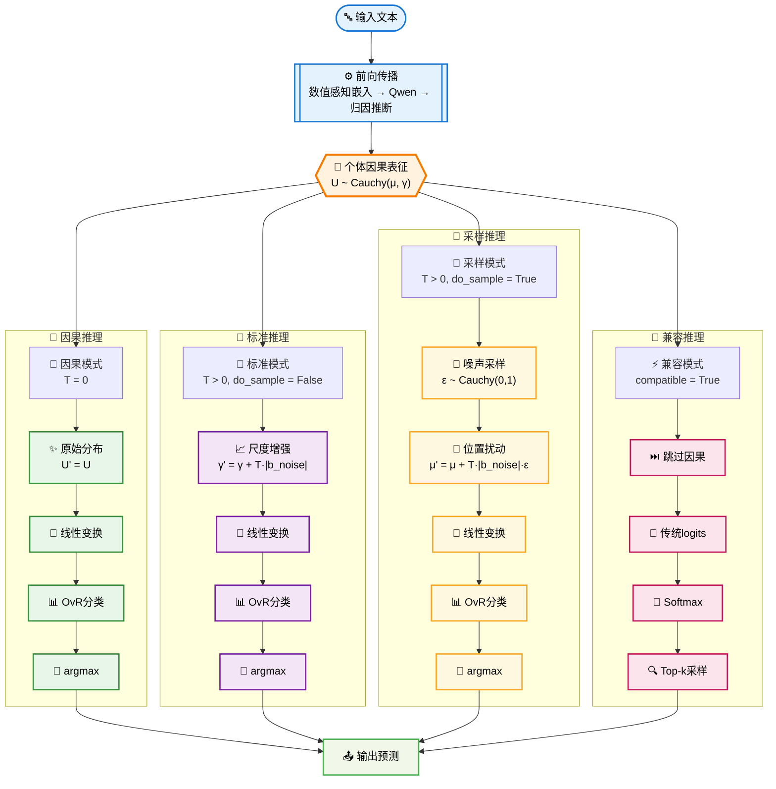
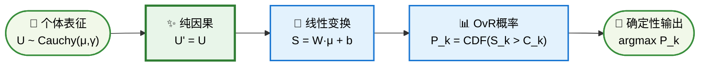
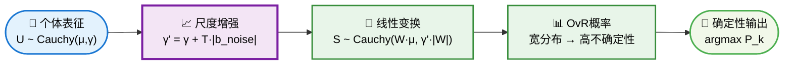

# CausalQwen 的模型推理 

> **📋 文档用途**: 深入阐述CausalQwen模型推理理论的演进和数学原理的根本性变化  
> **🎯 目标读者**: 理论研究者，需要深入理解因果推理数学原理的开发者  
> **📖 内容定位**: 系统性对比V1与V2的推理方法，重点关注数学公式的严谨性

---

## CausalQwen推理的数学基础

### 1.1 核心数学框架

CausalQwen基于因果结构方程建模文本生成：$Y = f(U, \epsilon)$，其中 $U$：个体因果表征变量，$\epsilon$：外生随机噪声，$f$：普适因果机制（线性变换）。

### 1.2 柯西分布的线性稳定性

柯西分布 $\text{Cauchy}(\mu, \gamma)$ 的特征函数：$\phi_X(t) = e^{i\mu t - \gamma |t|}$

**关键性质**：
- **加法稳定性**：$X_1 + X_2 \sim \text{Cauchy}(\mu_1 + \mu_2, \gamma_1 + \gamma_2)$
- **线性变换稳定性**：$aX + b \sim \text{Cauchy}(a\mu + b, |a|\gamma)$

**推导**：利用特征函数的乘积性质和线性变换性质，可直接得出上述结果。这些性质使得柯西分布在线性操作下保持形式不变，是CausalQwen解析计算的数学基础。

---

## V1推理方法的数学表述

### V1数学推导流程

**核心流程**：$U \xrightarrow{\text{采样}} u_i \xrightarrow{\text{噪声}} U'_i \xrightarrow{\text{线性}} S_{k,i} \xrightarrow{\text{OvR}} P_{k,i}$

1. **个体采样**：$u_i \sim \text{Cauchy}(\text{loc}_{U_i}, T \times \text{scale}_{U_i})$
2. **噪声注入**：$U'_i = u_i + \epsilon_i$ 其中 $\epsilon_i \sim \text{Cauchy}(0, |b_{\text{noise}}|)$
   - 由加法稳定性：$U'_i \sim \text{Cauchy}(u_i, |b_{\text{noise}}|)$
3. **线性变换**：$S_{k,i} = W_{\text{cls},k} \cdot U'_i + b_{\text{cls},k}$
   - 由线性变换稳定性：$S_{k,i} \sim \text{Cauchy}(W_{\text{cls},k} \cdot u_i + b_{\text{cls},k}, |W_{\text{cls},k}| \cdot |b_{\text{noise}}|)$
4. **OvR概率**：$P_{k,i} = \frac{1}{2} + \frac{1}{\pi} \arctan\left(\frac{\text{loc}_{S_{k,i}} - C_k}{\text{scale}_{S_{k,i}}}\right)$

**特点**：双重随机性，需要高维采样，计算复杂度高。


## V2架构设计的数学表述

### V2核心特点：温度统一的噪声控制

V2的关键特点在于**温度参数统一控制噪声强度，`do_sample` 控制噪声作用方式**这一核心设计原则：

- **温度 = 0**: 无论 `do_sample` 取值如何，都表示**纯因果生成**，完全没有外生噪声影响
- **温度 > 0**: 根据 `do_sample` 的值选择噪声的作用方式：
  - **非采样模式** (`do_sample=False`): 噪声增加**尺度参数**，扩大决策不确定性
  - **采样模式** (`do_sample=True`): 噪声扰动**位置参数**，改变个体身份

### V2四种推理模式详解

CausalQwen V2 提供四种核心推理模式，通过 `do_sample` 和 `temperature` 参数的组合实现：

**四种推理模式全貌流程图**：



| 模式名称 | `do_sample` | `temperature` | 数学原理 | 哲学含义 |
| :--- | :--- | :--- | :--- | :--- |
| **因果模式 (Causal)** | `any` | `0` | `U' ~ Cauchy(μ, γ)` | 纯因果生成，无外生噪声，个体的必然表达 |
| **标准模式 (Standard)** | `False` | `> 0` | `U' ~ Cauchy(μ, γ+T·\|b_noise\|)` | 噪声增加决策不确定性，保持个体身份稳定 |
| **采样模式 (Sampling)** | `True` | `> 0` | `U'~Cauchy(μ+T·\|b_noise\|·ε,γ)` | 噪声扰动个体身份，探索决策空间多样性 |
| **兼容模式 (Compatible)** | `N/A` | `any` | 标准 Softmax 概率计算 | 用于与传统LM进行基准比较 |

#### 模式1：因果模式 (Causal Mode) - temperature = 0

这是对因果理论最纯粹的表达。当温度为零时，完全没有外生噪声，生成过程基于个体自身的因果表征：

**数学表述**: $U' = U \sim \text{Cauchy}(\mu, \gamma)$

**实现**: 
```python
# 无论 do_sample 如何，temperature=0 时都使用原始分布
loc_U_final = loc_U
scale_U_final = scale_U
```

**应用场景**: 需要高度一致性和可解释性的场景

**因果模式流程图**：



#### 模式2：标准模式 (Standard Mode) - do_sample=False, temperature > 0

这是模型的默认确定性推理模式。外生噪声融合到尺度参数中。

**数学推导**：
1. **尺度增强**：$U' \sim \text{Cauchy}(\mu, \gamma + T \cdot |b_{noise}|)$
2. **线性变换**：由稳定性得 $S_k \sim \text{Cauchy}(W_k \cdot \mu + b_k, |W_k| \cdot (\gamma + T \cdot |b_{noise}|))$

**实现**:
```python
loc_U_final = loc_U
scale_U_final = scale_U + temperature * torch.abs(self.b_noise)
```

**哲学含义**: 环境噪声使个体判断更加模糊（分布更宽），但核心身份（位置参数）保持不变

**标准模式流程图**：



#### 模式3：采样模式 (Sampling Mode) - do_sample=True, temperature > 0

外生噪声扰动位置参数，改变个体身份表征。

**数学推导**：
1. **噪声采样**：$\epsilon \sim \text{Cauchy}(0, 1)$ 通过 $\epsilon = \tan(\pi(U - 0.5))$ 实现
2. **位置扰动**：$U' = U + T \cdot |b_{noise}| \cdot \epsilon$ 
3. **线性变换**：由稳定性得 $S_k \sim \text{Cauchy}(W_k \cdot (\mu + T \cdot |b_{noise}| \cdot \epsilon) + b_k, |W_k| \cdot \gamma)$

**实现**:
```python
epsilon = torch.tan(torch.pi * (torch.rand_like(loc_U) - 0.5))
loc_U_final = loc_U + temperature * torch.abs(self.b_noise) * epsilon
scale_U_final = scale_U
```

**哲学含义**: 探索个体在随机扰动下的非典型行为，温度控制扰动强度

**采样模式流程图**：

```mermaid
flowchart LR
    Input(["🧬 个体表征<br/>U ~ Cauchy(μ,γ)"]) 
    Sample["🎰 噪声采样<br/>ε ~ Cauchy(0,1)"]
    Inject["🔀 位置扰动<br/>μ' = μ + T·|b_noise|·ε"]
    Action["🔄 线性变换<br/>S ~ Cauchy(W·μ', γ·|W|)"]
    OvR["📊 OvR概率<br/>随机个体身份"]
    Output(["🎲 随机输出<br/>argmax P_k"])
    
    Input --> Sample --> Inject --> Action --> OvR --> Output
    
    classDef input fill:#e3f2fd,stroke:#1976d2,stroke-width:2px,color:#000
    classDef random fill:#fff8e1,stroke:#f57c00,stroke-width:3px,color:#000
    classDef shift fill:#fbe9e7,stroke:#d84315,stroke-width:3px,color:#000
    classDef process fill:#e8f5e9,stroke:#388e3c,stroke-width:2px,color:#000
    classDef result fill:#fff3e0,stroke:#f9a825,stroke-width:2px,color:#000
    
    class Input input
    class Sample random
    class Inject shift
    class Action,OvR process
    class Output result
```



#### 模式4：兼容模式 (Compatible Mode)

忽略所有因果模块，仅使用位置参数作为传统 logits：

**数学表述**: 标准 Softmax 概率计算

**实现**: 
```python
logits = loc_S  # 忽略 scale_S
probs = torch.softmax(logits / temperature, dim=-1)
```

**应用场景**: 与传统语言模型进行基准比较

**兼容模式流程图**：


### V2核心代码实现：ActionNetwork.forward

```python
def forward(self, loc_U, scale_U=None, do_sample=False, temperature=1.0):
    """前向传播：温度统一控制噪声强度，do_sample控制噪声作用方式
    
    核心设计原则：
    - temperature=0时两种模式都自动退化为纯因果模式
    - temperature>0时根据do_sample选择噪声作用方式
    
    Args:
        loc_U: 个体表征分布的位置参数 [B, S, C]
        scale_U: 个体表征分布的尺度参数 [B, S, C]
        do_sample: 控制噪声作用方式（位置vs尺度）
        temperature: 统一控制噪声强度
    Returns:
        loc_S: 决策分布的位置参数 [B, S, V]
        scale_S: 决策分布的尺度参数 [B, S, V]
    """
    if scale_U is None:
        scale_U = torch.zeros_like(loc_U)  # 默认为确定性分布
    
    if do_sample:
        # 🎲 采样模式：噪声影响位置参数
        
        # Step 1: 采样标准柯西噪声 ε ~ Cauchy(0, I)
        uniform_sample = torch.rand_like(loc_U)
        epsilon = torch.tan(torch.pi * (uniform_sample - 0.5))
        
        # Step 2: 温度调节的噪声注入到位置参数
        # 数学：loc_U_final = μ + T·|b_noise|·ε
        loc_U_final = loc_U + temperature * torch.abs(self.b_noise) * epsilon
        scale_U_final = scale_U

    else:
        # 🔧 标准模式：噪声影响尺度参数
        
        # Step 1: 温度调节的外生噪声融合到尺度参数
        # 数学：scale_U_final = γ + T·|b_noise|
        loc_U_final = loc_U
        scale_U_final = scale_U + temperature * torch.abs(self.b_noise)
    
    # 线性因果律应用（两种模式统一）
    loc_S = self.lm_head(loc_U_final)
    scale_S = scale_U_final @ torch.abs(self.lm_head.weight).T
    
    return loc_S, scale_S
```

---

## 核心对比

### V2四种推理模式完整对比

| **方面** | **因果模式** | **标准模式** | **采样模式** | **兼容模式** |
|----------|-------------|-------------|-------------|-------------|
| **参数设置** | `T=0` | `T>0, do_sample=False` | `T>0, do_sample=True` | `compatible=True` |
| **随机性来源** | 无外生噪声 | 环境噪声→尺度参数 | 环境噪声→位置参数 | 传统Softmax采样 |
| **温度参数作用** | 无作用（T=0） | 控制尺度扩展强度 | 控制位置扰动强度 | 传统温度作用 |
| **数学原理** | $U' = U$ | $U' \sim \text{Cauchy}(\mu, \gamma+T \cdot |b_{noise}|)$ | $U' \sim \text{Cauchy}(\mu+T \cdot |b_{noise}| \cdot \epsilon, \gamma)$ | Softmax概率 |
| **计算复杂度** | 纯解析计算 | 纯解析计算 | 标准噪声采样 | 传统计算 |
| **哲学含义** | 个体必然表达 | 增加决策不确定性 | 扰动个体身份 | 传统语言模型 |
| **应用场景** | 高一致性需求 | 默认推理模式 | 多样性生成 | 基准比较 |

### V1与V2架构对比

| **方面** | **V1因果采样** | **V2统一架构** |
|----------|----------------|----------------|
| **核心特点** | 双重随机性（个体+环境） | 温度统一控制+四种模式 |
| **温度作用** | 仅控制个体采样方差 | 统一控制噪声强度 |
| **推理灵活性** | 单一采样模式 | 四种推理模式可选 |
| **计算效率** | 需要高维个体采样 | 大部分为解析计算 |
| **理论完备性** | 部分场景 | 覆盖完整推理光谱 |

---

## 总结

### V2架构的核心特点

CausalQwen V2 的关键设计体现在**温度统一控制噪声强度，do_sample控制噪声作用方式**这一核心设计原则：

1. **统一的温度控制**：温度参数在所有模式下都控制噪声强度，实现了对称且直观的设计
2. **四种推理模式覆盖**：从纯因果生成到传统LM兼容，满足不同应用需求
3. **精确的噪声分化**：
   - 采样模式：噪声扰动位置参数（改变个体身份）
   - 标准模式：噪声增加尺度参数（扩大决策不确定性）
   - 因果模式：无噪声影响（纯因果表达）
   - 兼容模式：传统Softmax（基准比较）

4. **数学严谨性**：基于柯西分布线性稳定性，实现高效的解析计算
5. **理论完备性**：从确定性因果推理到随机性探索的完整光谱

### 实际应用价值

- **因果模式**：适用于需要高度一致性和可解释性的场景
- **标准模式**：作为默认的确定性推理模式
- **采样模式**：用于多样性生成和探索性任务
- **兼容模式**：确保与传统语言模型的可比性

这一设计保持了因果推理的理论严谨性，同时提供了实际应用所需的灵活性和效率。 