# Sklearn-Style CausalEngine 设计文档

> *"在反事实世界里，一切皆有可能。"*  
> *"In the counterfactual world, everything is possible."*

## 核心数学框架

MLPCausalRegressor & MLPCausalClassifier

### 前向传播

CausalEngine基于因果结构方程 $Y = f(U, E)$ 构建预测模型，其中 $U$ 为个体因果表征，$E \sim \text{Cauchy}(0, I)$ 为外生噪声。核心数学框架利用柯西分布的线性稳定性：若 $X \sim \text{Cauchy}(\mu, \gamma)$，则 $aX + b \sim \text{Cauchy}(a\mu + b, |a|\gamma)$。

五种模式遵循统一公式 $U' = U + b_{noise} \cdot E$，但在ActionNetwork中产生不同的 $U'$ 分布：

$$\begin{aligned}
\text{Deterministic:} \quad U' &= \mu_U \\
\text{Exogenous:} \quad U' &\sim \text{Cauchy}(\mu_U, |b_{noise}|) \\
\text{Endogenous:} \quad U' &\sim \text{Cauchy}(\mu_U, \gamma_U) \\
\text{Standard:} \quad U' &\sim \text{Cauchy}(\mu_U, \gamma_U + |b_{noise}|) \\
\text{Sampling:} \quad U' &\sim \text{Cauchy}(\mu_U + b_{noise} \cdot e, \gamma_U)
\end{aligned}$$

```mermaid
flowchart LR
    Input["输入 X"]
    MLP["特征提取<br/>H = MLP(X)"]
    Abduction["个体推断<br/>μ_U = W_loc*H + b_loc<br/>γ_U = softplus(W_scale*H + b_scale) + 1e-8"]
    Action["噪声调制 & 线性因果律<br/>ActionNetwork<br/>(模式差异核心)"]
    Output["输出生成<br/>回归: Y = μ_S<br/>分类: P(Y=k) via 柯西CDF"]

    Input --> MLP --> Abduction --> Action --> Output

    classDef inputStyle fill:#e3f2fd,stroke:#1976d2,stroke-width:2px
    classDef coreStyle fill:#fff3e0,stroke:#f57c00,stroke-width:3px
    classDef actionStyle fill:#f3e5f5,stroke:#7b1fa2,stroke-width:3px
    classDef outputStyle fill:#e8f5e9,stroke:#2e7d32,stroke-width:2px
    
    class Input inputStyle
    class MLP,Abduction coreStyle
    class Action actionStyle
    class Output outputStyle
```



前向传播流程为 $X \xrightarrow{MLP} H \xrightarrow{Abduction} (\mu_U, \gamma_U) \xrightarrow{Action} (\mu_S, \gamma_S) \xrightarrow{Output} Y$，其中关键步骤：

个体推断：$\mu_U = W_{loc} \cdot H + b_{loc}$，$\gamma_U = \text{softplus}(W_{scale} \cdot H + b_{scale}) + \epsilon_{stable}$

其中 $\epsilon_{stable} = 1e\text{-}8$ 确保数值稳定性

线性因果律：$\mu_S = W_A \cdot \mu_{U'} + b_A$，$\gamma_S = |W_A| \cdot \gamma_{U'}$


输出生成：回归任务 $Y = \mu_S$，分类任务 $$P(Y=k) = \frac{1}{2} + \frac{1}{\pi}\arctan\left(\frac{\mu_{S_k}}{\gamma_{S_k}}\right)$$

### 参数初始化策略

CausalEngine的数学正确性很大程度上依赖于合理的参数初始化，特别是γ_U的初始化对模型收敛和性能至关重要。

#### AbductionNetwork初始化

**位置网络 (loc_net) 初始化**：
```python
if input_size == causal_size and mlp_layers == 1:
    # 恒等映射初始化: W_loc = I, b_loc = 0
    self.loc_net.weight.copy_(torch.eye(causal_size))
    self.loc_net.bias.zero_()
else:
    # Xavier均匀初始化
    nn.init.xavier_uniform_(self.loc_net.weight)
    nn.init.zeros_(self.loc_net.bias)
```

**尺度网络 (scale_net) 初始化**：
```python
# 最后一层特殊初始化
last_layer = scale_net_last_linear_layer
nn.init.uniform_(last_layer.weight, -0.01, 0.01)  # 小随机权重
# 关键：bias设为常数gamma_init
nn.init.constant_(last_layer.bias, gamma_init)  # 默认gamma_init=10.0

# 中间层标准Xavier初始化
for middle_layer in scale_net_middle_layers:
    nn.init.xavier_uniform_(middle_layer.weight)
    nn.init.zeros_(middle_layer.bias)
```

#### γ_U初始化的数学设计

**核心数学公式**：
$$\gamma_U = \text{softplus}(\text{scale\_net}(H))$$

**具体初始化流程**：
1. **bias初始化**: `nn.init.constant_(bias, gamma_init)`
   - 默认`gamma_init=10.0`，所有维度设为相同常数
   - 例如causal_size=4时: `[10.0, 10.0, 10.0, 10.0]`

2. **权重初始化**: `nn.init.uniform_(weight, -0.01, 0.01)`
   - 小随机权重，使输出主要由bias决定

3. **softplus变换**: γ_U ≈ softplus(gamma_init) ≈ gamma_init (当gamma_init较大时)
   - softplus(10.0) ≈ 10.0000
   - **结果**: γ_U ≈ 10.0 (所有维度)

**初始化范围特性**：
```python
# 统一常数初始化 (实际值)
causal_size = 1:   γ_U ≈ [10.0]
causal_size = 2:   γ_U ≈ [10.0, 10.0] 
causal_size = 4:   γ_U ≈ [10.0, 10.0, 10.0, 10.0]
causal_size = 32:  γ_U ≈ [10.0, 10.0, ..., 10.0]  # 所有维度相同
```

#### ActionNetwork初始化

**线性因果律初始化**：
```python
# 标准Xavier初始化
nn.init.xavier_uniform_(self.linear_law.weight)
nn.init.zeros_(self.linear_law.bias)

# 外生噪声参数
nn.init.constant_(self.b_noise, b_noise_init)  # 默认0.1
```

#### 初始化策略的数学意义

**γ_U初始化原理**：
1. **正值保证**: softplus确保γ_U > 0，满足Cauchy分布要求
2. **适中范围**: 10.0大小适中，避免了过小(数值不稳定)和过大(过度分散)
3. **统一初始化**: 所有维度使用相同初始值，简化收敛行为
4. **收敛友好**: γ_U=10.0是经验上的良好起始点，训练过程中会自适应调整

**与传统初始化的对比**：
```python
# ❌ 传统随机初始化可能导致的问题
γ_U_random = abs(torch.randn(causal_size))  # 可能接近0或过大
# 问题: 接近0时数值不稳定，过大时梯度消失

# ✅ CausalEngine精心设计的初始化
γ_U_designed = F.softplus(torch.full((causal_size,), 10.0))
# 优势: 稳定的初始值，良好的梯度性质，简化超参数调节
```

**恒等映射优化**：
当`input_size == causal_size`且`mlp_layers == 1`时，loc_net采用恒等映射初始化：
$$\mu_U = \text{loc\_net}(H) = I \cdot H + 0 = H$$

这个优化在deterministic模式下特别重要，因为它确保了与传统MLP的完美数学等价性。

#### 初始化逻辑代码位置

| 组件 | 文件位置 | 函数/方法 | 具体逻辑 |
|------|----------|-----------|----------|
| **AbductionNetwork初始化** | `causal_engine/networks.py` | `AbductionNetwork._init_weights()` | lines 165-204 |
| **scale_net bias常数初始化** | `causal_engine/networks.py` | `_init_weights()` line 199 | `nn.init.constant_(bias, gamma_init)` |
| **loc_net恒等映射初始化** | `causal_engine/networks.py` | `_init_weights()` line 171 | `torch.eye(causal_size)` |
| **ActionNetwork初始化** | `causal_engine/networks.py` | `ActionNetwork._init_weights()` | lines 292-296 |
| **b_noise初始化** | `causal_engine/networks.py` | `_init_weights()` line 296 | `nn.init.constant_(b_noise, 0.1)` |
| **MLP隐藏层初始化** | `causal_engine/sklearn/base.py` | `_init_weights_glorot()` | Xavier均匀初始化 |

#### 初始化参数汇总

```python
# 默认初始化参数表
CAUSAL_ENGINE_INIT_PARAMS = {
    # AbductionNetwork
    'gamma_init': 10.0,  # γ_U初始化常数
    'scale_bias_init': 'constant',  # 常数初始化策略
    'scale_weight_range': (-0.01, 0.01),  # 均匀分布范围
    'loc_identity_enabled': True,  # H=C时自动恒等映射
    
    # ActionNetwork  
    'b_noise_init': 0.1,  # 外生噪声初始值
    'linear_init': 'xavier_uniform',  # 线性层初始化
    
    # 预期输出范围
    'gamma_U_range': '~10.0',  # γ_U的期望初始值
    'mu_U_range': 'depends_on_input',  # μ_U取决于输入H
}
```

**关键数学不变量**：
- ✅ γ_U始终 > 0 (Cauchy分布数学要求)
- ✅ γ_U初始值稳定统一 (~10.0)
- ✅ deterministic模式下μ_U = H (等价性保证)
- ✅ 所有参数初始化数值稳定

损失函数计算：

**Deterministic模式** 使用传统损失函数：

回归：$$L_{MSE} = \frac{1}{N}\sum_i \sum_j (y_{j,i} - \mu_{S_j,i})^2$$

分类：$$L_{CE} = -\frac{1}{N}\sum_i \sum_k y_{k,i} \log \text{softmax}(\mu_{S_k,i})_k$$

**因果模式** 统一使用柯西分布损失：

一维回归柯西负对数似然：$$L_{Cauchy} = -\sum_i \log \frac{1}{\pi\gamma_{S,i}[1 + ((y_i-\mu_{S,i})/\gamma_{S,i})^2]}$$

高维回归（独立假设）：$$L_{Cauchy} = -\sum_i \sum_j \log \frac{1}{\pi\gamma_{S_j,i}[1 + ((y_{j,i}-\mu_{S_j,i})/\gamma_{S_j,i})^2]}$$

分类OvR二元交叉熵：$$P_{k,i} = \frac{1}{2} + \frac{1}{\pi}\arctan\left(\frac{\mu_{S_k,i}}{\gamma_{S_k,i}}\right)$$

$$L_{OvR} = -\frac{1}{N}\sum_i \sum_k [y_{k,i} \log P_{k,i} + (1-y_{k,i}) \log (1-P_{k,i})]$$

### 损失函数计算的统一实现

**核心设计原则**：所有损失函数都接收ActionNetwork的输出 `(loc_S, scale_S)`，保持输入签名的统一性：

```python
class CausalLossFunction:
    def compute_loss(self, loc_S, scale_S, y_true, mode='standard'):
        """统一的损失函数接口
        
        Args:
            loc_S: ActionNetwork输出的位置参数 [batch_size, output_dim]
            scale_S: ActionNetwork输出的尺度参数 [batch_size, output_dim] 
            y_true: 真实标签 [batch_size, output_dim]
            mode: 模式选择，决定损失函数类型
            
        Returns:
            loss: 标量损失值
        """
        if mode == 'deterministic':
            return self._compute_traditional_loss(loc_S, scale_S, y_true)
        else:
            return self._compute_causal_loss(loc_S, scale_S, y_true)
    
    def _compute_traditional_loss(self, loc_S, scale_S, y_true):
        """Deterministic模式：使用传统损失，忽略scale_S"""
        # 回归：MSE损失，只使用loc_S
        # 分类：CrossEntropy损失，只使用loc_S
        pass
        
    def _compute_causal_loss(self, loc_S, scale_S, y_true):
        """因果模式：使用Cauchy分布损失，同时使用loc_S和scale_S"""
        # 回归：Cauchy NLL，使用完整分布参数
        # 分类：OvR BCE，基于Cauchy CDF计算概率
        pass
```

**回归损失实现**：
```python
def compute_regression_loss(self, loc_S, scale_S, y_true, mode):
    if mode == 'deterministic':
        # 传统MSE：只使用位置参数，忽略尺度参数
        return F.mse_loss(loc_S, y_true)
    else:
        # Cauchy NLL：使用完整分布参数
        # 数值稳定的Cauchy对数概率密度函数
        # log p(y|μ,γ) = -log(π) - log(γ) - log(1 + ((y-μ)/γ)²)
        z = (y_true - loc_S) / (scale_S + 1e-8)  # 标准化
        log_prob = -torch.log(torch.pi) - torch.log(scale_S + 1e-8) - torch.log(1 + z*z)
        return -torch.sum(log_prob)
```

**分类损失实现**：
```python
def compute_classification_loss(self, loc_S, scale_S, y_true, mode):
    if mode == 'deterministic':
        # 传统CrossEntropy：只使用位置参数
        return F.cross_entropy(loc_S, y_true)
    else:
        # OvR BCE：通过Cauchy CDF计算概率
        # 数值稳定性：防止除零和梯度爆炸
        probs = 0.5 + (1/torch.pi) * torch.atan(loc_S / (scale_S + 1e-8))
        # 概率剪切：防止log(0)和log(1)的数值问题
        probs = torch.clamp(probs, min=1e-7, max=1-1e-7)
        return F.binary_cross_entropy(probs, y_true)
```

**统一接口的优势**：
- ✅ **接口一致性**：所有损失函数都接收相同的输入签名
- ✅ **模式透明性**：损失函数内部根据mode自动选择计算方式
- ✅ **参数复用性**：Deterministic模式可以忽略scale_S，但保持接口统一
- ✅ **扩展性**：新增损失函数只需遵循相同的接口约定

五模式系统本质是ActionNetwork的五种不同计算方式，覆盖参数空间 $(\gamma_U, b_{noise})$ 的主要有意义组合，实现从确定性建模到随机性探索的完整因果推理光谱。

## 统一API设计

### MLPCausalRegressor与MLPCausalClassifier核心接口

```python
from causal_engine.sklearn import MLPCausalRegressor, MLPCausalClassifier

# 回归任务 - sklearn风格接口
reg = MLPCausalRegressor(
    hidden_layer_sizes=(64, 32),  # 网络结构
    mode='standard',              # 五种模式选择
    max_iter=1000,               # 训练轮数
    random_state=42              # 随机种子
)
reg.fit(X_train, y_train)
predictions = reg.predict(X_test)        # 数值输出
distributions = reg.predict(X_test, mode='standard')  # 分布信息（一维时完整，高维时边际）

# 分类任务 - 相同的设计模式
clf = MLPCausalClassifier(
    hidden_layer_sizes=(64, 32),
    mode='standard',
    max_iter=1000,
    random_state=42
)
clf.fit(X_train, y_train)
labels = clf.predict(X_test)             # 类别标签
probabilities = clf.predict_proba(X_test)  # 激活概率
```

### 核心设计原则：仅替换输出层

**架构对比**：
```python
# 传统MLPRegressor/MLPClassifier架构
输入层 → 隐藏层们 → 线性输出层 → 确定性预测值
  X    →   MLPs   →  y = W·h + b  →    ŷ

# MLPCausalRegressor/MLPCausalClassifier架构
输入层 → 隐藏层们 → CausalEngine → 分布输出 → 概率预测
  X    →   MLPs   → (归因+行动+激活) → S~Cauchy → P(Y)
```

**关键优势**：
- 🚀 **训练效率**：大部分网络结构完全相同
- 🚀 **参数规模**：仅CausalEngine部分增加少量参数  
- 🚀 **收益巨大**：从确定性预测升级到分布建模和因果推理

### 统一predict()接口设计

两个类都提供相同的模式控制接口：

```python
def predict(self, X, mode=None):
    """统一预测接口
    
    Parameters:
    -----------
    mode : str, optional
        预测模式 (可与训练模式不同):
        - 'deterministic': 确定性因果 (等价sklearn)
        - 'exogenous': 外生噪声因果
        - 'endogenous': 内生因果推理 
        - 'standard': 标准因果推理 (默认)
        - 'sampling': 探索性因果推理
        
    Returns:
    --------
    predictions : array-like or dict
        - MLPCausalRegressor: 数值数组 (一维输出时包含完整分布信息)
        - MLPCausalClassifier: 类别标签数组
        若mode != 'deterministic', 还包含分布信息
    """
    return predictions
```

### 分类任务的OvR策略

**数学原理**：各类别独立激活判断
$$P_{k,i} = \frac{1}{2} + \frac{1}{\pi}\arctan\left(\frac{\mu_{S_k,i}}{\gamma_{S_k,i}}\right)$$

**优势对比**：
- **传统Softmax**：$P_k = \frac{\exp(z_k)}{\sum_j \exp(z_j)}$ (强制归一化约束)
- **CausalEngine OvR**：$P_k$ 独立计算 (类别间无竞争约束)

### 概率预测的启发式方法

**核心思想**：提供类似概率的不确定性量化，但承认其启发式本质

#### 分类任务的predict_dist

**数学定义**：
$$P_{k,i} = \frac{1}{2} + \frac{1}{\pi}\arctan\left(\frac{\mu_{S_k,i}}{\gamma_{S_k,i}}\right)$$

**输出形状**：`[n_samples, n_classes]` - 激活概率分布

```python
clf = MLPCausalClassifier()
labels = clf.predict(X_test)           # 类别预测 [n_samples]
probs = clf.predict_dist(X_test)       # 激活概率分布 [n_samples, n_classes]
```

#### 回归任务的predict_dist

**数学定义**：
$$\text{predict\_dist}(X)_{i,j} = [\mu_{S_j,i}, \gamma_{S_j,i}]$$

**输出形状**：`[n_samples, output_dim, 2]` - 完整分布参数

```python
reg = MLPCausalRegressor()
predictions = reg.predict(X_test)      # 预测值 [n_samples, output_dim]
dist_params = reg.predict_dist(X_test)  # 分布参数 [n_samples, output_dim, 2]

# 访问分布参数
loc = dist_params[:, :, 0]    # 位置参数 μ_S
scale = dist_params[:, :, 1]  # 尺度参数 γ_S
```

#### 集中度计算示例

用户可以基于 `predict_dist()` 的输出自行计算集中度：

```python
# 分类：预测类别的激活概率
clf_probs = clf.predict_dist(X_test)        # [n_samples, n_classes]
clf_predictions = clf.predict(X_test)       # [n_samples]
clf_concentration = clf_probs[range(len(clf_predictions)), clf_predictions]

# 回归：相对于标准Cauchy的集中度
reg_dist_params = reg.predict_dist(X_test)  # [n_samples, output_dim, 2]
reg_scale = reg_dist_params[:, :, 1]        # [n_samples, output_dim]
reg_concentration = 1.0 / reg_scale         # [n_samples, output_dim]
```

## 五模式参数控制

### mode参数的统一控制设计

**核心原则**：mode参数贯穿整个建模流程，控制训练、推理、损失计算：

```python
class MLPCausalRegressor:
    def __init__(self, mode='standard', **kwargs):
        """五模式统一接口
        
        Parameters:
        -----------
        mode : str, default='standard'
            建模模式选择：
            - 'deterministic': γ_U=0, b_noise=0 (等价sklearn)
            - 'exogenous': γ_U=0, b_noise≠0 (外生噪声)
            - 'endogenous': γ_U≠0, b_noise=0 (内生因果)
            - 'standard': γ_U≠0, b_noise≠0 (噪声→尺度)
            - 'sampling': γ_U≠0, b_noise≠0 (噪声→位置)
        """
        self.mode = mode
        self._configure_mode_parameters()
    
    def _configure_mode_parameters(self):
        """根据模式配置内部参数"""
        if self.mode == 'deterministic':
            self.gamma_U_enabled = False
            self.b_noise_enabled = False
            self.loss_type = 'traditional'  # MSE/CrossEntropy
        elif self.mode == 'exogenous':
            self.gamma_U_enabled = False
            self.b_noise_enabled = True
            self.loss_type = 'causal'  # Cauchy NLL
        elif self.mode == 'endogenous':
            self.gamma_U_enabled = True
            self.b_noise_enabled = False
            self.loss_type = 'causal'  # Cauchy NLL
        elif self.mode in ['standard', 'sampling']:
            self.gamma_U_enabled = True
            self.b_noise_enabled = True
            self.loss_type = 'causal'  # Cauchy NLL
```

### 五模式ActionNetwork实现

**核心认知**：五模式的差异就是ActionNetwork如何计算 $U'$ 分布：

```python
class ActionNetwork(nn.Module):
    def forward(self, loc_U, scale_U, mode='standard'):
        """五模式差异的核心实现"""
        
        if mode == 'deterministic':
            # U' = μ_U (确定性)
            loc_U_final = loc_U
            scale_U_final = torch.zeros_like(scale_U)
        
        elif mode == 'exogenous':
            # U' ~ Cauchy(μ_U, |b_noise|)
            loc_U_final = loc_U
            scale_U_final = torch.full_like(scale_U, abs(self.b_noise))
        
        elif mode == 'endogenous':
            # U' ~ Cauchy(μ_U, γ_U)
            loc_U_final = loc_U
            scale_U_final = scale_U
        
        elif mode == 'standard':
            # U' ~ Cauchy(μ_U, γ_U + |b_noise|) - 解析融合
            loc_U_final = loc_U
            scale_U_final = scale_U + abs(self.b_noise)
        
        elif mode == 'sampling':
            # U' ~ Cauchy(μ_U + b_noise*ε, γ_U) - 位置扰动
            # 标准Cauchy分布采样：ε ~ Cauchy(0,1)
            # 使用反变换采样：ε = tan(π(u - 0.5)), u ~ Uniform(0,1)
            u_uniform = torch.rand_like(loc_U)  # [batch_size, latent_dim]
            epsilon = torch.tan(torch.pi * (u_uniform - 0.5))  # [batch_size, latent_dim]
            loc_U_final = loc_U + self.b_noise * epsilon
            scale_U_final = scale_U
        
        # 线性因果律 (所有模式统一)
        # 位置参数变换：μ_S = W_A · μ_U' + b_A
        loc_S = self.lm_head(loc_U_final)  # [batch_size, output_dim]
        
        # 尺度参数变换：γ_S = |W_A| · γ_U' (矩阵乘法)
        # 维度: [batch_size, latent_dim] @ [latent_dim, output_dim] → [batch_size, output_dim]
        scale_S = scale_U_final @ torch.abs(self.lm_head.weight).T
        
        return loc_S, scale_S
```

### 参数空间完备性

五模式覆盖 $(\gamma_U, b_{noise})$ 参数空间的所有有意义组合：

| 模式 | 参数配置 | 数学表述 | 应用场景 |
|------|----------|----------|----------|
| **Deterministic** | $\gamma_U=0, b_{noise}=0$ | $U' = \mu_U$ | 基线验证、调试开发 |
| **Exogenous** | $\gamma_U=0, b_{noise} \neq 0$ | $U' \sim \text{Cauchy}(\mu_U, \|b_{noise}\|)$ | 外部冲击建模 |
| **Endogenous** | $\gamma_U \neq 0, b_{noise}=0$ | $U' \sim \text{Cauchy}(\mu_U, \gamma_U)$ | 高可解释性需求 |
| **Standard** | $\gamma_U \neq 0, b_{noise} \neq 0$ (尺度) | $U' \sim \text{Cauchy}(\mu_U, \gamma_U + \|b_{noise}\|)$ | 生产环境部署 |
| **Sampling** | $\gamma_U \neq 0, b_{noise} \neq 0$ (位置) | $U' \sim \text{Cauchy}(\mu_U + b_{noise}e, \gamma_U)$ | 探索性研究 |

### 训练与推理的模式灵活性

```python
# 训练时使用一种模式
reg = MLPCausalRegressor(mode='standard')
reg.fit(X_train, y_train)

# 推理时可以切换模式
deterministic_pred = reg.predict(X_test, mode='deterministic')  # sklearn兼容
standard_pred = reg.predict(X_test, mode='standard')            # 标准因果
causal_pred = reg.predict(X_test, mode='endogenous')           # 纯因果
sampling_pred = reg.predict(X_test, mode='sampling')           # 探索性
```

## sklearn兼容性设计

### 完美的sklearn生态集成

```python
# 与sklearn生态无缝集成
from sklearn.model_selection import cross_val_score, GridSearchCV
from sklearn.pipeline import Pipeline
from sklearn.preprocessing import StandardScaler

# 交叉验证
scores = cross_val_score(MLPCausalRegressor(), X, y, cv=5)

# 网格搜索
param_grid = {
    'hidden_layer_sizes': [(32,), (64,), (64, 32)],
    'mode': ['deterministic', 'standard', 'endogenous']
}
grid_search = GridSearchCV(MLPCausalRegressor(), param_grid, cv=3)

# 管道集成
pipeline = Pipeline([
    ('scaler', StandardScaler()),
    ('causal', MLPCausalRegressor())
])
```

### 智能默认配置策略

**自动网络结构推荐**：
```python
def _auto_hidden_layer_sizes(n_features, n_samples):
    """根据特征数和样本数智能推荐网络结构"""
    if n_features <= 10:
        return (32,)
    elif n_features <= 50:
        return (64, 32)
    elif n_features <= 100:
        return (128, 64)
    else:
        return (256, 128, 64)

# 智能默认配置
AUTO_CONFIG = {
    'early_stopping': True,
    'patience': 20,
    'min_delta': 1e-4,
    'learning_rate_schedule': 'adaptive'
}
```

### 数学等价性验证

**Deterministic模式的sklearn等价性**：
```python
def test_sklearn_equivalence():
    """验证Deterministic模式与sklearn的数学等价性"""
    # sklearn基线
    sklearn_reg = MLPRegressor(hidden_layer_sizes=(64, 32), alpha=0.0)
    sklearn_reg.fit(X_train, y_train)
    sklearn_pred = sklearn_reg.predict(X_test)
    
    # CausalEngine等价实现
    causal_reg = MLPCausalRegressor(mode='deterministic', 
                                   hidden_layer_sizes=(64, 32))
    causal_reg.fit(X_train, y_train)
    causal_pred = causal_reg.predict(X_test)
    
    # 等价性验证
    r2_diff = abs(r2_score(y_test, sklearn_pred) - r2_score(y_test, causal_pred))
    pred_mse = mean_squared_error(sklearn_pred, causal_pred)
    
    assert r2_diff < 0.001, "等价性验证失败"
    assert pred_mse < 0.001, "预测差异过大"
```
Deterministic模式等价性数学原理**核心机制**：AbductionNetwork设为恒等映射 $W_{loc} = I, b_{loc} = 0$ 并冻结参数

**数学等价**：
- sklearn: $\hat{y} = W_{final} \cdot h + b_{final}$  
- CausalEngine: $\hat{y} = W_A \cdot h + b_A$ (因为 $\mu_U = h$)
- 等价条件: $W_A = W_{final}, b_A = b_{final}$

Deterministic模式在计算损失的时候只用到了 loc_S 的信息。


### sklearn标准接口实现

```python
class MLPCausalRegressor(BaseEstimator, RegressorMixin):
    """完整的sklearn标准接口"""
    
    def fit(self, X, y, sample_weight=None):
        """训练模型 - sklearn标准签名"""
        # 自动数据验证和预处理
        X, y = check_X_y(X, y)
        
        # 自动构建网络架构
        if self.hidden_layer_sizes == 'auto':
            self.hidden_layer_sizes_ = self._auto_hidden_layer_sizes(X.shape[1], X.shape[0])
        
        # 训练循环 (含early stopping)
        return self._fit_with_mode(X, y)
    
    def predict(self, X):
        """预测 - sklearn标准签名"""
        check_is_fitted(self)
        X = check_array(X)
        return self._predict_with_mode(X, self.mode)
    
    def score(self, X, y, sample_weight=None):
        """评分 - sklearn标准签名"""
        return r2_score(y, self.predict(X), sample_weight=sample_weight)
    
    # sklearn标准属性
    @property
    def feature_importances_(self):
        """特征重要性"""
        return self._compute_feature_importance()
    
    @property 
    def loss_curve_(self):
        """训练损失曲线"""
        return self.training_loss_history_
```

### 渐进式能力访问

**分层能力设计**：
```python
# 第1层：sklearn完全兼容
reg = MLPCausalRegressor()
predictions = reg.predict(X_test)  # 返回数值，如sklearn

# 第2层：分布信息访问
distributions = reg.predict(X_test, mode='standard')  # 返回分布对象（一维时完整联合分布，高维时边际分布）

# 第3层：因果推理模式
causal_dists = reg.predict(X_test, mode='endogenous')    # 纯因果
sampling_dists = reg.predict(X_test, mode='sampling')   # 探索性

# 数学一致性保证
assert np.allclose(predictions, distributions.mean(), atol=1e-6)
```

## 实践指南

### 模式选择决策树

**按应用需求选择模式**：

```mermaid
graph TD
    Start([开始选择模式]) --> Question1{需要sklearn兼容？}
    
    Question1 -->|是| Deterministic[🎯 Deterministic Mode<br/>等价sklearn基线验证]
    Question1 -->|否| Question2{个体表征确定？}
    
    Question2 -->|完全确定| Question3{存在外生噪声？}
    Question2 -->|有不确定性| Question4{存在外生噪声？}
    
    Question3 -->|是| Exogenous[🌍 Exogenous Mode<br/>确定个体+外生噪声]
    Question3 -->|否| Deterministic
    
    Question4 -->|否| Endogenous[🧠 Endogenous Mode<br/>纯内生因果推理]
    Question4 -->|是| Question5{应用场景？}
    
    Question5 -->|生产环境| Standard[⚡ Standard Mode<br/>噪声增强不确定性]
    Question5 -->|探索研究| Sampling[🎲 Sampling Mode<br/>噪声扰动身份]
    
    classDef questionStyle fill:#f9f9f9,stroke:#666,stroke-width:2px
    classDef deterministicStyle fill:#fff3e0,stroke:#f57c00,stroke-width:3px
    classDef exogenousStyle fill:#e3f2fd,stroke:#1976d2,stroke-width:3px
    classDef endogenousStyle fill:#e8f5e9,stroke:#2e7d32,stroke-width:3px
    classDef standardStyle fill:#f3e5f5,stroke:#7b1fa2,stroke-width:3px
    classDef samplingStyle fill:#fff8e1,stroke:#f9a825,stroke-width:3px
    
    class Start,Question1,Question2,Question3,Question4,Question5 questionStyle
    class Deterministic deterministicStyle
    class Exogenous exogenousStyle
    class Endogenous endogenousStyle
    class Standard standardStyle
    class Sampling samplingStyle
```



### 应用场景指导

| 数据特性 | 推荐模式 | 典型应用 | 数学原理 |
|----------|----------|----------|----------|
| **完全确定性数据** | Deterministic | 基线验证、调试开发 | $U' = \mu_U$ |
| **传感器数据** | Exogenous | IoT设备、测量系统 | $U' \sim \text{Cauchy}(\mu_U, \|b_{noise}\|)$ |
| **医疗诊断** | Endogenous | 个体差异建模 | $U' \sim \text{Cauchy}(\mu_U, \gamma_U)$ |
| **金融风控** | Standard | 生产环境部署 | $U' \sim \text{Cauchy}(\mu_U, \gamma_U + \|b_{noise}\|)$ |
| **推荐系统** | Sampling | 多样性生成 | $U' \sim \text{Cauchy}(\mu_U + b_{noise}e, \gamma_U)$ |

### 渐进式开发流程

**阶段化实施策略**：

```python
# 阶段1: 基线验证 (Deterministic Mode)
reg = MLPCausalRegressor(mode='deterministic')
reg.fit(X_train, y_train)
baseline_score = reg.score(X_test, y_test)
print(f"基线R²: {baseline_score:.4f}")

# 阶段2: 因果建模 (Endogenous Mode) 
reg_causal = MLPCausalRegressor(mode='endogenous')
reg_causal.fit(X_train, y_train)
causal_score = reg_causal.score(X_test, y_test)
print(f"因果R²: {causal_score:.4f}")

# 阶段3: 生产优化 (Standard Mode)
reg_standard = MLPCausalRegressor(mode='standard')
reg_standard.fit(X_train, y_train)
standard_score = reg_standard.score(X_test, y_test)
distributions = reg_standard.predict(X_test, mode='standard')
uncertainty = distributions.scale.mean()
print(f"标准R²: {standard_score:.4f}, 平均不确定性: {uncertainty:.4f}")

# 阶段4: 探索分析 (Sampling Mode)
reg_sampling = MLPCausalRegressor(mode='sampling')
diverse_predictions = []
for _ in range(10):  # 多次采样获得预测多样性
    pred = reg_sampling.predict(X_test, mode='sampling')
    diverse_predictions.append(pred)

diversity = np.std(diverse_predictions, axis=0).mean()
print(f"预测多样性: {diversity:.4f}")
```

### 关键实践原则

1. **始终从Deterministic开始**：确保算法正确性后再添加复杂性
2. **数学等价性验证**：与sklearn基线对比验证实现正确性  
3. **损失函数统一**：模式2-5必须使用相同的Cauchy NLL损失
4. **渐进式复杂化**：逐步引入不确定性和噪声机制
5. **充分测试验证**：每个模式都需要独立验证数学正确性

### 性能调优指南

**模式特定的超参数建议**：

```python
# Deterministic Mode: 等价sklearn，使用传统调优
deterministic_params = {
    'hidden_layer_sizes': [(64, 32), (128, 64)],
    'learning_rate_init': [0.001, 0.01],
    'alpha': [0.0001, 0.001]  # L2正则化
}

# Standard Mode: 平衡性能与稳定性
standard_params = {
    'hidden_layer_sizes': [(64, 32), (128, 64)],
    'b_noise_init': [0.1, 0.2, 0.5],     # 噪声强度
    'gamma_init': [0.5, 1.0, 2.0]        # 初始尺度
}

# Sampling Mode: 探索性较强，需要更大网络
sampling_params = {
    'hidden_layer_sizes': [(128, 64), (256, 128)],
    'b_noise_init': [0.2, 0.5, 1.0],     # 更大噪声
    'max_iter': [1500, 2000]             # 更多训练轮数
}
```

## 核心竞争优势：标签噪声鲁棒性

### 理论基础：为什么CausalEngine天然抗噪声

**数学原理**：CausalEngine学习个体内在因果表征，而非表面统计关联

$$U \sim \text{Cauchy}(\mu_U, \gamma_U) \quad \text{(学习个体因果本质)}$$
$$Y = f(U, \varepsilon) \quad \text{(应用普适因果机制)}$$

**与传统方法的根本差异**：
```python
# 传统MLPRegressor/MLPClassifier：学习表面关联
# X → h → ŷ = Wh + b  (容易被噪声标签误导)

# MLPCausalRegressor/MLPClassifier：学习因果本质  
# X → h → U → S → Y  (学习深层因果结构，抗噪声)
```

### 分类任务的OvR策略优势

**CausalEngine OvR的独立性**：
$$P_{k,i} = \frac{1}{2} + \frac{1}{\pi} \arctan\left(\frac{\mu_{S_k,i}}{\gamma_{S_k,i}}\right) \quad \text{(每个类别独立判断)}$$

**传统Softmax的竞争性**：
$$P_k^{\text{softmax}} = \frac{\exp(z_k)}{\sum_{j=1}^K \exp(z_j)} \quad \text{(强制归一化约束)}$$

**关键差异的实用影响**：
```python
# 噪声场景示例：真实标签[Cat]被错误标记为[Dog]

# ❌ 传统Softmax：噪声传播到所有类别
# 错误训练样本影响整个概率分布的归一化
softmax_probs = [0.1, 0.7, 0.2]  # [Cat, Dog, Bird] - Dog概率被错误提升

# ✅ CausalEngine OvR：噪声局限在单个类别  
# 错误标签只影响对应类别，其他类别保持独立
ovr_probs = [0.8, 0.3, 0.2]  # [Cat, Dog, Bird] - Cat概率保持准确
```

### 开箱即用的噪声处理

**工作流简化对比**：

```python
# ❌ 传统方法：需要复杂的数据清洗流程
from sklearn.neural_network import MLPClassifier

# 第1步：人工识别和处理噪声（耗时且容易出错）
X_clean, y_clean = manual_outlier_detection(X_raw, y_raw)
y_scaled = RobustScaler().fit_transform(y_clean.reshape(-1, 1))

# 第2步：训练传统模型
traditional_clf = MLPClassifier().fit(X_clean, y_scaled.ravel())

# ✅ CausalEngine：直接使用原始数据
causal_clf = MLPCausalClassifier()
causal_clf.fit(X_raw, y_raw)  # 无需预处理！

# 性能对比：在干净测试集上评估
print(f"传统方法精度: {accuracy_score(y_test_clean, traditional_clf.predict(X_test)):.3f}")
print(f"CausalEngine精度: {accuracy_score(y_test_clean, causal_clf.predict(X_test)):.3f}")
```

### 现实噪声场景的优势

**高价值应用场景**：
1. **医疗数据**：诊断标签存在主观性和错误
2. **金融数据**：数据源不一致，标签质量参差不齐  
3. **众包标注**：人工标注存在主观差异和错误
4. **传感器数据**：环境干扰导致的测量误差

**预期性能优势**：
- **数量级错误**：CausalEngine在10x/100x错误下仍保持80%+性能
- **标签翻转**：50%标签噪声下仍保持80%+原始性能
- **系统偏差**：通过因果表征学习可以部分抵消偏差  
- **异常值**：Cauchy分布的重尾特性天然适合处理异常值

### 竞争优势总结

**技术差异化**：
- **数学创新**：基于Cauchy分布的因果推理框架，在一维回归中提供完整的不确定性量化
- **解析优势**：无采样的分布计算，极高的计算效率
- **独特架构**：OvR策略带来的灵活性和表达能力

**用户体验优势**：
- **零学习成本**：完美的sklearn兼容性
- **渐进式能力**：从简单预测到复杂分布分析
- **工作流简化**：从20+行预处理代码简化为1行训练代码
- **丰富信息**：不仅有预测值，还有不确定性信息（一维回归时数学完备，高维时基于独立假设）