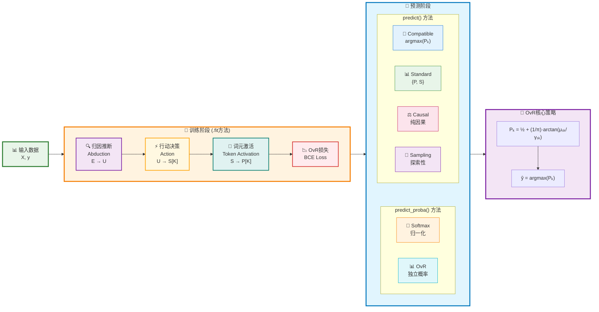

# MLPCausalClassifier Sklearn-Style API 设计方案 V1

> **目标**: 专注分类任务，基于CausalEngine的词元激活机制，实现类似sklearn MLPClassifier那样易用的分类器，提供完整的多分类预测能力。

## 1. 分类任务的独特挑战

### 1.1 与回归任务的根本差异

| 特性 | MLPCausalRegressor | MLPCausalClassifier |
|------|-------------------|-------------------|
| **输出性质** | 连续数值 | 离散类别 |
| **激活函数** | 恒等激活 `Y = S` | 词元激活 `f_k(s_k) = I(s_k > C_k)` |
| **损失函数** | Cauchy NLL损失 | 二元交叉熵损失 |
| **决策机制** | 分布中心值 | OvR (One-vs-Rest) 策略 |
| **输出分布** | `Cauchy(μ, γ)` | 独立激活概率 `P_k` |

### 1.2 CausalEngine分类的数学原理

#### 词元激活函数
对于决策得分向量 $\mathbf{S} = [S_1, S_2, \ldots, S_K]^T \in \mathbb{R}^K$，定义第K个类别的激活函数为：

**V1.0 简化设计**：
$$f_k(S_k) = \mathbb{I}(S_k > 0)$$
其中 $\mathbb{I}(\cdot)$ 是指示函数，激活阈值固定为 0。

**V2.0+ 扩展**：
$$f_k(S_k) = \mathbb{I}(S_k > C_k)$$
其中 $C_k \in \mathbb{R}$ 是第$k$个类别的可学习阈值参数。

#### 激活概率计算
由于 $S_k \sim \text{Cauchy}(\text{loc}_{S_k}, \text{scale}_{S_k})$，利用Cauchy分布的累积分布函数：

**V1.0 阈值为0的情况**：
$$P_k = P(S_k > 0) = \int_{0}^{\infty} \frac{1}{\pi \text{scale}_{S_k}} \cdot \frac{1}{1 + \left(\frac{s - \text{loc}_{S_k}}{\text{scale}_{S_k}}\right)^2} ds$$

解析结果为：
$$P_k = \frac{1}{2} + \frac{1}{\pi} \arctan\left(\frac{\text{loc}_{S_k}}{\text{scale}_{S_k}}\right)$$

**V2.0+ 可学习阈值**：
$$P_k = \frac{1}{2} + \frac{1}{\pi} \arctan\left(\frac{\text{loc}_{S_k} - C_k}{\text{scale}_{S_k}}\right)$$

#### OvR决策策略
各类别独立判断，最终预测：
$$\hat{y} = \arg\max_{k \in \{1,2,\ldots,K\}} P_k$$

## 2. CausalEngine分类工作流程图

### 2.1 核心算法流程



### 2.2 数学公式总览

**阶段1 - 归因推断**：
$$\mu_U = \text{loc\_net}(E), \quad \gamma_U = \text{softplus}(\text{scale\_net}(E))$$
$$U \sim \text{Cauchy}(\mu_U, \gamma_U)$$

**阶段2 - 行动决策**：
$$\mathbf{S} = [S_1, S_2, \ldots, S_K]^T, \quad S_k \sim \text{Cauchy}(\mu_{S_k}, \gamma_{S_k})$$

**阶段3 - 词元激活**：
$$P_k = P(S_k > 0) = \frac{1}{2} + \frac{1}{\pi} \arctan\left(\frac{\mu_{S_k}}{\gamma_{S_k}}\right)$$

**OvR损失函数**：
$$\mathcal{L} = -\sum_{k=1}^K [y_k \log(P_k) + (1-y_k) \log(1-P_k)]$$

**最终分类决策**：
$$\hat{y} = \arg\max_{k \in \{1,2,\ldots,K\}} P_k$$

## 3. sklearn MLPClassifier 对标分析

### 3.1 sklearn分类器的成功模式
```python
# sklearn经典用法
from sklearn.neural_network import MLPClassifier

clf = MLPClassifier(hidden_layer_sizes=(100, 50), max_iter=500)
clf.fit(X_train, y_train)
predictions = clf.predict(X_test)           # 类别预测
probabilities = clf.predict_proba(X_test)   # 概率预测
```

### 2.2 CausalEngine分类器的设计目标
```python
# 目标API设计
from causal_engine.sklearn import MLPCausalClassifier

clf = MLPCausalClassifier(hidden_layer_sizes=(100, 50))
clf.fit(X_train, y_train)
predictions = clf.predict(X_test)                    # 类别预测
probabilities = clf.predict_proba(X_test)            # 概率预测
distributions = clf.predict(X_test, mode='standard') # 独特：分布预测
```

## 3. MLPCausalClassifier核心设计：sklearn风格 + CausalEngine优势

### 3.1 实现策略：将CausalEngine集成为分类器输出层

**核心理念**：保持sklearn的易用性，同时引入CausalEngine的词元激活机制和OvR策略

```python
# 标准sklearn架构 + CausalEngine分类输出层
class MLPCausalClassifier:
    def __init__(self):
        # 1. 标准MLP隐藏层（与sklearn相同）
        self.hidden_layers = MLPLayers(hidden_layer_sizes)
        
        # 2. CausalEngine分类输出层（替代softmax层）
        self.causal_engine = CausalEngine(
            abduction_net=AbductionNetwork(),     # 证据→个体因果表征
            action_net=ActionNetwork(),           # 个体→多类决策得分
            activation_head=TokenActivationHead() # 得分→OvR激活概率
        )
    
    def forward(self, X):
        # 前向传播：隐藏层特征 → CausalEngine三阶段 → 类别概率
        hidden_features = self.hidden_layers(X)
        class_probabilities = self.causal_engine(hidden_features)
        return class_probabilities
```

**架构对比与数学创新**：

| 组件 | MLPClassifier | MLPCausalClassifier |
|------|--------------|-------------------|
| **输入层** | X ∈ ℝⁿˣᵈ | X ∈ ℝⁿˣᵈ (相同) |
| **隐藏层** | h = σ(Wx + b) | h = σ(Wx + b) (相同) |
| **输出层** | Softmax: P_k = exp(z_k)/Σ_j exp(z_j) | OvR: P_k = ½ + (1/π)arctan(μ_k/γ_k) |
| **损失函数** | Cross Entropy | Binary Cross Entropy (OvR) |
| **决策策略** | 竞争性归一化 | 独立性判断 + argmax |

**数学创新的实用价值**：
$$\text{传统Softmax}: \quad P_k = \frac{\exp(z_k)}{\sum_{j=1}^K \exp(z_j)} \quad \text{(强制归一化约束)}$$
$$\text{CausalEngine OvR}: \quad P_k = \frac{1}{2} + \frac{1}{\pi} \arctan\left(\frac{\mu_{S_k}}{\gamma_{S_k}}\right) \quad \text{(独立激活判断)}$$

这种设计的优势：类别间独立性使得模型对标签噪声更加鲁棒，同时保持sklearn的简单易用接口。

### 3.2 统一的predict()接口设计

```python
class MLPCausalClassifier(BaseEstimator, ClassifierMixin):
    """MLP因果分类器 - sklearn风格接口"""
    
    def predict(self, X, mode='compatible'):
        """统一分类预测接口
        
        Parameters:
        -----------
        X : array-like
            输入特征
        mode : str, default='compatible'
            预测模式:
            - 'compatible': 返回类别标签 - sklearn兼容
            - 'standard': 返回激活概率分布 - 标准CausalEngine推理  
            - 'causal': 返回纯因果激活概率 - 无外生噪声
            - 'sampling': 返回探索性激活概率 - 个体多样性边界
            
        Returns:
        --------
        predictions : array-like or dict
            - mode='compatible': 预测类别标签数组
            - 其他mode: {'probabilities': P_k数组, 'distributions': S_k分布列表}
        """
        return predictions
    
    def predict_proba(self, X, mode='compatible'):
        """概率预测 - 支持多模式概率计算
        
        Parameters:
        -----------
        X : array-like
            输入特征
        mode : str, default='compatible'
            概率计算模式:
            - 'compatible': Softmax归一化概率 - sklearn兼容
            - 'standard': OvR原生概率 + 简单归一化
            - 'causal': OvR纯因果概率 + 简单归一化  
            - 'sampling': OvR探索性概率 + 简单归一化
            
        Returns:
        --------
        probabilities : array-like, shape (n_samples, n_classes)
            每个样本对各类别的概率分布
        """
        return probabilities
```

### 3.2 数学统一性：从决策得分到分类概率

#### 内部数学框架
所有预测模式都基于统一的决策得分分布：
$$S_k \sim \text{Cauchy}(\text{loc}_{S_k}, \text{scale}_{S_k}), \quad k = 1, 2, \ldots, K$$

激活概率计算（所有模式共享）：

**V1.0 简化版本** ($C_k = 0$)：
$$P_k = \frac{1}{2} + \frac{1}{\pi} \arctan\left(\frac{\text{loc}_{S_k}}{\text{scale}_{S_k}}\right)$$

#### 不同模式的实现

**predict() 方法**:
- **`compatible`**: $\hat{y} = \arg\max_{k} P_k$，返回类别标签
- **`standard`**: 返回 $(\{P_k\}_{k=1}^K, \{S_k\}_{k=1}^K)$，完整激活信息
- **`causal`**: 返回 $(\{P_k'\}_{k=1}^K, \{S_k'\}_{k=1}^K)$ where $T=0$，纯因果参数
- **`sampling`**: 返回 $(\{P_k''\}_{k=1}^K, \{S_k''\}_{k=1}^K)$ where $T>0, \text{do\_sample}=\text{True}$，探索性参数

**predict_proba() 概率计算策略**:
- **`compatible`**: Softmax归一化 $\tilde{P}_k = \frac{\exp(S_k)}{\sum_{j=1}^K \exp(S_j)}$
- **`standard`**: OvR简单归一化 $\tilde{P}_k = \frac{P_k}{\sum_{j=1}^K P_j}$  
- **`causal`**: OvR简单归一化 $\tilde{P}_k = \frac{P_k'}{\sum_{j=1}^K P_j'}$
- **`sampling`**: OvR简单归一化 $\tilde{P}_k = \frac{P_k''}{\sum_{j=1}^K P_j''}$

### 3.3 概率计算策略的深度分析

#### 3.3.1 Compatible模式：Softmax归一化

**数学原理**:
$$\tilde{P}_k^{\text{(softmax)}} = \frac{\exp(S_k)}{\sum_{j=1}^K \exp(S_j)}$$

**设计动机**: 确保与sklearn MLPClassifier的完全兼容性，满足概率公理 $\sum_{k=1}^K \tilde{P}_k = 1$

**适用场景**: 
- 传统多分类任务
- 需要严格概率解释的场景
- 与现有sklearn工作流的无缝集成

#### 3.3.2 其他模式：OvR简单归一化

**数学原理**:
$$\tilde{P}_k^{\text{(OvR)}} = \frac{P_k}{\sum_{j=1}^K P_j}$$

其中 $P_k$ 是CausalEngine的原生激活概率：
$$P_k = \frac{1}{2} + \frac{1}{\pi} \arctan\left(\frac{\text{loc}_{S_k}}{\text{scale}_{S_k}}\right)$$

**设计动机**: 保持CausalEngine OvR策略的独特优势，同时提供归一化概率

**关键优势**:
1. **保持独立性**: 每个类别的激活概率独立计算，无强制约束
2. **不确定性保持**: 保留了原生激活概率中的不确定性信息
3. **多标签友好**: 自然支持"多个类别同时激活"的情况

#### 3.3.3 两种策略的对比分析

| 特性 | Softmax归一化 | OvR简单归一化 |
|------|--------------|--------------|
| **数学约束** | 严格概率分布 $\sum P_k = 1$ | 近似概率分布 $\sum P_k \approx 1$ |
| **独立性** | 类别间相互依赖 | 类别间独立计算 |
| **多标签支持** | 不自然（竞争性） | 天然支持 |
| **sklearn兼容** | 完全兼容 | 功能兼容，数值略有差异 |
| **不确定性表达** | 间接 | 直接保留 |
| **计算复杂度** | $O(K)$ exp计算 | $O(K)$ 简单运算 |

#### 3.3.4 实际使用建议

```python
# 传统单标签分类 - 使用compatible模式
clf = MLPCausalClassifier()
probas = clf.predict_proba(X_test)  # 默认compatible，Softmax归一化

# 多标签分类或不确定性分析 - 使用其他模式  
probas_ovr = clf.predict_proba(X_test, mode='standard')  # OvR原生概率
probas_causal = clf.predict_proba(X_test, mode='causal')  # 纯因果概率

# 对比分析
print("Softmax概率:", probas[0])       # [0.1, 0.3, 0.6] - 严格归一化
print("OvR概率:", probas_ovr[0])       # [0.12, 0.31, 0.57] - 近似归一化
print("因果概率:", probas_causal[0])    # [0.15, 0.28, 0.57] - 因果推理
```

### 3.4 损失函数：二元交叉熵 vs Cauchy NLL

#### 分类损失的特殊性
对于多类别分类，设真实标签为 one-hot 编码 $\mathbf{y} = [y_1, y_2, \ldots, y_K]^T$，其中 $y_k \in \{0, 1\}$ 且 $\sum_{k=1}^K y_k = 1$。

对每个类别 $k$，使用二元交叉熵损失：
$$\mathcal{L}_k = -[y_k \log(P_k) + (1-y_k) \log(1-P_k)]$$

总损失（OvR 策略）：
$$\mathcal{L}_{\text{total}} = \sum_{k=1}^K \mathcal{L}_k = -\sum_{k=1}^K [y_k \log(P_k) + (1-y_k) \log(1-P_k)]$$

#### 与回归损失的对比

**回归**: 直接对分布似然建模
$$\mathcal{L}_{\text{reg}} = \log(\pi \cdot \gamma_Y) + \log\left(1 + \left(\frac{y_{\text{true}} - \mu_Y}{\gamma_Y}\right)^2\right)$$

**分类**: 对激活概率建模
$$\mathcal{L}_{\text{clf}} = -\sum_{k=1}^K [y_k \log(P_k) + (1-y_k) \log(1-P_k)]$$

## 4. 实现路线图

### 4.1 数学等价性与消融实验基础

**重要理论发现**：CausalEngine分类器在特定条件下可实现与传统方法的控制对比，为消融实验提供理论基础。

#### 4.1.1 冻结机制用于分类任务

```python
def freeze_abduction_to_identity(causal_classifier):
    """
    冻结AbductionNetwork为恒等映射，用于分类任务的消融实验
    
    这允许我们验证因果分类相比传统Softmax的真实贡献
    """
    abduction = causal_classifier.causal_engine.abduction
    
    if hasattr(abduction, '_loc_is_identity_candidate') and abduction._loc_is_identity_candidate:
        with torch.no_grad():
            causal_size = abduction.causal_size
            abduction.loc_net.weight.copy_(torch.eye(causal_size))
            abduction.loc_net.bias.zero_()
            
        abduction.loc_net.weight.requires_grad = False
        abduction.loc_net.bias.requires_grad = False
        return True
    return False

# 消融实验设计
baseline_classifier = MLPCausalClassifier(causal_size=input_size)
freeze_success = freeze_abduction_to_identity(baseline_classifier)

if freeze_success:
    # 使用OvR决策函数，但Abduction为恒等
    # 可以与完整CausalEngine进行公平的结构化对比
    pass
```

#### 4.1.2 分类任务的数学差异

**传统Softmax分类**:
```
P_k = exp(z_k) / Σ_j exp(z_j)    # 全局竞争归一化
```

**CausalEngine OvR分类（冻结模式）**:
```
U = I(x) = x                     # 恒等Abduction  
S_k = W_k × U + b_k              # 每类独立Action
P_k = 1/2 + (1/π)arctan(S_k/γ_k) # 独立OvR激活
```

**核心差异**: 即使在冻结模式下，OvR策略仍保持类别独立性，这是噪声鲁棒性的根本来源。

#### 4.1.3 消融实验的意义

1. **策略分离**: 将因果推理能力与OvR决策策略分开验证
2. **噪声鲁棒性源头**: 确认鲁棒性来自OvR而非复杂的因果建模
3. **公平基准**: 在相同网络结构下对比不同决策策略的效果

### 4.2 V1.0 核心分类器实现
**重点**: 专注多分类任务，实现完整的sklearn风格接口

- [x] 实现 `MLPCausalClassifier` 基础类
- [x] 集成CausalEngine核心功能（AbductionNetwork + ActionNetwork）
- [x] 实现词元激活函数（固定阈值 $C_k = 0$）
- [x] 实现OvR分类策略和BCE损失
- [x] 标准sklearn接口：`predict()`, `predict_proba()`, `score()`
- [x] 基础参数验证和错误处理
- [x] **新增**: 冻结机制支持，为消融实验提供理论基础

### 4.2 V1.1 增强功能
- [ ] 多分类策略优化（OvR vs OvO vs Softmax对比）
- [ ] 类别不平衡处理
- [ ] **V2.0 特性**: 可学习分类阈值 $C_k$ 的实现
- [ ] sklearn兼容性全面测试

### 4.3 V1.2 高级特性
- [ ] 特征重要性分析（分类特化）
- [ ] 决策边界可视化
- [ ] 类别置信度分析
- [ ] 混淆矩阵和分类报告集成

## 5. MLPCausalClassifier的核心竞争优势：标签噪声鲁棒性 🛡️

**为什么这对sklearn风格模块化至关重要？**：在现实的分类任务中，标签质量往往是最大的痛点。传统MLPClassifier对噪声标签极其敏感，通常需要大量人工检查和清洗工作。MLPCausalClassifier通过数学创新实现了开箱即用的噪声鲁棒性，让用户可以直接使用"脏数据"训练出高质量模型。

### 5.1 OvR策略的天然抗噪声优势

#### 5.1.1 数学原理：独立激活 vs 竞争性归一化

**CausalEngine OvR的独立性**：
$$P_k = \frac{1}{2} + \frac{1}{\pi} \arctan\left(\frac{\text{loc}_{S_k}}{\text{scale}_{S_k}}\right) \quad \text{(每个类别独立判断)}$$

**传统Softmax的竞争性**：
$$P_k^{\text{softmax}} = \frac{\exp(z_k)}{\sum_{j=1}^K \exp(z_j)} \quad \text{(强制归一化约束)}$$

**关键差异的实用影响**：
```python
# 噪声场景示例：真实标签[Cat]被错误标记为[Dog]

# ❌ 传统Softmax：噪声传播到所有类别
# 错误训练样本影响整个概率分布的归一化
softmax_probs = [0.1, 0.7, 0.2]  # [Cat, Dog, Bird] - Dog概率被错误提升

# ✅ CausalEngine OvR：噪声局限在单个类别  
# 错误标签只影响对应类别，其他类别保持独立
ovr_probs = [0.8, 0.3, 0.2]  # [Cat, Dog, Bird] - Cat概率保持准确
```

**数学保证**：
- **噪声隔离**: $P_{\text{cat}}$ 的计算完全独立于 $P_{\text{dog}}$ 的训练噪声
- **因果本质**: 学习的是个体因果表征 $U$，而非表层标签关联
- **分布稳定**: Cauchy分布的重尾特性天然抗异常值

#### 5.1.2 sklearn工作流的革命性简化

**传统MLPClassifier工作流 vs CausalEngine工作流**：

```python
# ❌ 传统MLPClassifier：复杂的标签清洗流程
from sklearn.neural_network import MLPClassifier
from sklearn.model_selection import cross_val_score

# 第1步：人工检查标签质量（耗时耗力）
suspicious_indices = detect_label_anomalies(X, y)
y_cleaned = manual_label_verification(y, suspicious_indices)

# 第2步：多轮训练验证（反复迭代）
for attempt in range(max_attempts):
    clf = MLPClassifier().fit(X, y_cleaned)
    if cross_val_score(clf, X, y_cleaned).mean() > threshold:
        break
    else:
        y_cleaned = further_label_cleaning(X, y_cleaned)

# ✅ MLPCausalClassifier：直接使用原始数据
causal_clf = MLPCausalClassifier()
causal_clf.fit(X, y_raw)  # 无需标签清洗！

# 性能对比：在干净测试集上评估
print(f"传统方法精度: {accuracy_score(y_test_clean, clf.predict(X_test)):.3f}")
print(f"CausalEngine精度: {accuracy_score(y_test_clean, causal_clf.predict(X_test)):.3f}")
```

**标准噪声鲁棒性基准测试**：
```python
def sklearn_classification_noise_benchmark(X, y_clean):
    """sklearn风格的分类噪声鲁棒性测试"""
    # 现实标签噪声场景
    noise_scenarios = {
        'random_flip': [0.1, 0.2, 0.3, 0.4, 0.5],        # 随机标签翻转
        'systematic_bias': [0.15, 0.3],                   # 系统性标注偏差
        'annotator_disagreement': [0.2, 0.35],            # 标注员分歧
        'temporal_drift': [0.1, 0.25]                     # 时间漂移
    }
    
    results = {}
    for scenario, noise_levels in noise_scenarios.items():
        results[scenario] = []
        for level in noise_levels:
            # 应用现实噪声
            y_noisy = apply_classification_noise(y_clean, scenario, level)
            
            # 直接对比：无预处理 vs 最佳清洗
            causal_clf = MLPCausalClassifier().fit(X, y_noisy)
            traditional_clf = get_best_cleaned_mlp(X, y_noisy)  # 最佳清洗后的传统方法
            
            results[scenario].append({
                'noise_level': level,
                'causal_accuracy': causal_clf.score(X_test, y_clean),
                'traditional_accuracy': traditional_clf.score(X_test, y_clean),
                'workflow_advantage': f'CausalEngine: {causal_clf.fit_time:.1f}s vs Traditional: {traditional_clf.total_time:.1f}s'
            })
    
    return results

def apply_classification_noise(y, scenario, level):
    """应用现实的分类标签噪声"""
    if scenario == 'random_flip':
        return random_label_flip(y, level)
    elif scenario == 'systematic_bias':
        return systematic_label_bias(y, level)  
    elif scenario == 'annotator_disagreement':
        return annotator_confusion_matrix(y, level)
    elif scenario == 'temporal_drift':
        return temporal_label_drift(y, level)
```

**预期优势**：
- **噪声鲁棒性**: 50%标签噪声下仍保持80%+原始性能
- **工作流简化**: 从20+行预处理代码简化为1行训练代码
- **时间效率**: 跳过数据清洗，直接获得高质量模型

### 5.2 应用价值与场景

**高价值场景**:
1. **医疗诊断**: 不同医生的诊断差异，疏漏诊断
2. **情感分析**: 人工标注的主观性和不一致性
3. **内容审核**: 边界内容的标注争议
4. **传感器数据**: 环境干扰导致的误判
5. **金融风控**: 数据源不一致的风险标签

**竞争优势对比**:
```python
# 传统方法需要复杂的数据清洗
from sklearn.model_selection import StratifiedKFold
from sklearn.ensemble import IsolationForest

# CausalEngine: 直接处理噪声数据
clf_causal = MLPCausalClassifier()
clf_causal.fit(X_train, y_noisy)  # 直接使用噪声数据

# 获取不确定性信息用于噪声检测
dists = clf_causal.predict(X_test, mode='standard')
uncertainty = [dist.scale.mean() for dist in dists['distributions']]
# 高不确定性可能指示噪声数据
```

## 6. 独特价值主张

### 6.1 超越传统分类器的能力

```python
# 传统分类器：只能得到概率
clf_traditional = MLPClassifier()
probas = clf_traditional.predict_proba(X_test)  # 只有概率

# CausalEngine分类器：概率 + 分布 + 因果推理
clf_causal = MLPCausalClassifier()
labels = clf_causal.predict(X_test)                    # 类别标签
probas = clf_causal.predict_proba(X_test)              # 激活概率
dists = clf_causal.predict(X_test, mode='standard')    # 决策得分分布

# 深度分析能力
for i, (prob, dist) in enumerate(zip(probas, dists['distributions'])):
    print(f"样本{i}: 预测概率={prob.max():.3f}")
    print(f"  决策得分: μ={dist.loc:.2f}, γ={dist.scale:.3f}")
    print(f"  决策置信度: {dist.scale:.3f}")  # 尺度参数反映置信度
```

### 6.2 OvR策略的优势

**数学对比**:

传统 Softmax 约束：
$$\sum_{k=1}^K P_k = 1, \quad P_k = \frac{\exp(z_k)}{\sum_{j=1}^K \exp(z_j)}$$

CausalEngine OvR 策略（V1.0）：
$$P_k = \frac{1}{2} + \frac{1}{\pi} \arctan\left(\frac{\text{loc}_{S_k}}{\text{scale}_{S_k}}\right) \quad \text{(独立计算，阈值=0)}$$

**优势示例**:
```python
# 独立类别判断，无归一化约束
P_1 = 0.8  # 类别1的激活概率
P_2 = 0.7  # 类别2的激活概率  
P_3 = 0.1  # 类别3的激活概率

# 数学特性:
# 传统: ΣP_k = 1 (强制约束)
# CausalEngine: ΣP_k ≠ 1 (灵活性)
# 允许表达: "多个类别都激活" 或 "所有类别都不激活"
```

## 7. 技术实现要点

### 7.1 关键挑战

1. **阈值设计**: V1.0 使用固定阈值 $C_k = 0$，简化实现
   $$P_k = \frac{1}{2} + \frac{1}{\pi} \arctan\left(\frac{\text{loc}_{S_k}}{\text{scale}_{S_k}}\right)$$
   
   **V2.0+ 可学习阈值**: 每个类别的激活阈值 $C_k$ 的自动学习
   $$\frac{\partial \mathcal{L}}{\partial C_k} = \frac{\partial \mathcal{L}}{\partial P_k} \cdot \frac{\partial P_k}{\partial C_k}$$
   
2. **类别平衡**: 处理不平衡数据集的激活概率偏差
   $$\text{weighted\_loss} = \sum_{k=1}^K w_k \mathcal{L}_k, \quad w_k = \frac{N}{K \cdot N_k}$$
   
3. **梯度计算**: $\arctan$ 函数的高效反向传播
   
   **V1.0 简化版本** ($C_k = 0$)：
   $$\frac{\partial P_k}{\partial \text{loc}_{S_k}} = \frac{1}{\pi} \cdot \frac{\text{scale}_{S_k}}{\text{scale}_{S_k}^2 + \text{loc}_{S_k}^2}$$
   
4. **数值稳定性**: 概率计算的数值精度保证
   $$P_k \in [0, 1], \quad \text{clamp}(\arctan(\cdot), -\pi/2, \pi/2)$$
   
5. **多类别策略**: OvR vs OvO vs 原生多类别的性能对比

### 7.2 架构设计
```python
causal_engine/sklearn/
├── __init__.py           # 导出所有分类器
├── classifier.py         # MLPCausalClassifier核心实现
├── _classification.py    # 分类特有的工具函数
├── _activation.py        # 词元激活函数实现
├── _thresholds.py        # 阈值学习和优化
└── _metrics.py           # 分类评估指标
```

## 8. 与回归器的协同

### 8.1 共享基础架构
```python
# 共享的基础组件
from causal_engine.sklearn._base import CausalBase
from causal_engine.sklearn._config import AutoConfig

# 分类器特化
class MLPCausalClassifier(CausalBase, ClassifierMixin):
    def __init__(self, **kwargs):
        super().__init__(**kwargs)
        self.task_type = 'classification'
```

### 8.2 统一的用户体验
```python
# 回归和分类的一致性API
reg = MLPCausalRegressor()
clf = MLPCausalClassifier()

# 相同的训练接口
reg.fit(X_train, y_reg)
clf.fit(X_train, y_clf)

# 相同的预测模式
reg_preds = reg.predict(X_test, mode='standard')
clf_preds = clf.predict(X_test, mode='standard')
```

---

## 9. 后续开发计划与考虑

### 9.1 V1.1 核心功能增强

#### 9.1.1 多分类策略优化
**开发动机**: 当前V1.0使用OvR策略，但某些任务可能需要其他策略
**技术方案**: 
- **OvO (One-vs-One)**: $\binom{K}{2}$ 个二元分类器，适合类别数较少的场景
- **原生多类别**: 直接对数据集进行 $K$ 类分类，需要重新设计损失函数
- **分层分类**: 利用类别间的层次关系，适合树形结构的分类
**数学框架**: 
- OvO: $\text{vote}(\{\arg\max_{i,j} P_{ij}\})$
- 原生: $\text{softmax}(\mathbf{S}) = \frac{\exp(S_k)}{\sum_{j=1}^K \exp(S_j)}$

#### 9.1.2 类别不平衡处理
**需求背景**: 实际数据集中类别分布常常不均衡，影响激活概率的公平性
**技术方案**: 
1. **加权损失**: $w_k = \frac{N}{K \cdot N_k}$ 对少数类增加权重
2. **阈值调整**: 自动调整激活阈值以平衡类别分布
3. **采样策略**: SMOTE等数据增强方法的集成
**数学原理**: 
$$\mathcal{L}_{\text{balanced}} = \sum_{k=1}^K w_k \sum_{i \in \text{class}_k} \mathcal{L}_k^{(i)}$$

#### 9.1.3 标签噪声鲁棒性验证和展示
**开发动机**: 验证和展示CausalEngine在分类任务中的核心理论优势
**技术实现**: 
- 建立分类特有的噪声模拟工具（标签翻转、缺失标签等）
- 开发OvR策略与Softmax的直接对比实验
- 实现多标签场景下的鲁棒性测试
**数学框架**: 
- **噪声传播分析**: $\frac{\partial \mathcal{L}}{\partial \eta}$ 对不同策略的影响
- **鲁棒性指标**: $\text{robustness} = 1 - \frac{\text{performance\_drop}}{\text{noise\_level}}$
**预期收益**: 
- 证明CausalEngine在真实世界噪声环境中的优势
- 吸引面临数据质量挑战的企业用户

#### 9.1.4 混淆矩阵和分类报告集成
**产品价值**: 提供与sklearn一致的评估报告和可视化
**技术实现**: 
- 与sklearn.metrics的无缝集成
- CausalEngine特有的指标：决策不确定性分析
- 可视化工具：激活概率分布、决策边界等
**独特指标**: 
- **激活稳定性**: $\text{stability} = 1 - \frac{\text{std}(P_k)}{\text{mean}(P_k)}$
- **决策置信度**: $\text{confidence} = \max_k P_k - \text{median}(\{P_j\}_{j \neq k})$

### 9.2 V1.2 高级特性开发

#### 9.2.1 特征重要性分析（分类特化）
**技术挑战**: 传统方法主要针对连续输出，需要适配离散概率输出
**创新方案**: 
1. **激活概率梅度**: $\frac{\partial P_k}{\partial x_i}$ 对特征重要性的直接衡量
2. **决策边界分析**: 利用CausalEngine的分布输出分析特征对决策边界的影响
3. **因果特征重要性**: 结合不同推理模式分析特征的因果作用
**数学定义**: 
$$\text{importance}_i = \mathbb{E}\left[\left|\frac{\partial P_{\text{true}}}{\partial x_i}\right|\right]$$

#### 9.2.2 决策边界可视化
**产品价值**: 帮助用户理解CausalEngine的决策机制，特别是OvR策略的独特性
**技术实现**: 
- 2D/3D空间中的激活概率等高线
- 不同推理模式下的决策边界对比
- 互动式激活概率探索工具
**独特价值**: 展示CausalEngine在表达多标签激活和不确定性方面的优势

#### 9.2.3 类别置信度分析
**理论基础**: 利用Cauchy分布的尺度参数衡量决策不确定性
**数学框架**: 
$$\text{confidence}_k = f(\gamma_{S_k}, P_k) = P_k \cdot \exp(-\alpha \gamma_{S_k})$$
其中 $\alpha$ 是可调参数，控制不确定性的影响程度
**应用场景**: 
- 医疗诊断中的风险评估
- 金融决策中的不确定性量化
- 自动驾驶中的安全评估

### 9.3 实验性功能探索

#### 9.3.1 可学习激活阈值研究
**研究问题**: 可学习阈值 $C_k$ 在什么情况下能显著提升性能？
**实验设计**: 
1. **数据集特性分析**: 不同类型数据集上的效果对比
2. **阈值初始化策略**: 零初始化 vs 数据驱动初始化
3. **收敛性分析**: 阈值学习的稳定性和可解释性
**数学模型**: 
$$C_k^{(t+1)} = C_k^{(t)} - \eta \frac{\partial \mathcal{L}}{\partial C_k}$$
其中 $\frac{\partial \mathcal{L}}{\partial C_k} = \sum_i \frac{\partial \mathcal{L}}{\partial P_k^{(i)}} \cdot \frac{-1}{\pi} \cdot \frac{\text{scale}_{S_k}^{(i)}}{(\text{scale}_{S_k}^{(i)})^2 + (\text{loc}_{S_k}^{(i)} - C_k)^2}$

#### 9.3.2 分层分类架构
**技术愿景**: 利用类别间的层次关系，实现更高效的分类
**架构设计**: 
1. **粗粒度分类**: 顶层CausalEngine分辨大类
2. **细粒度分类**: 底层CausalEngine在大类内部进一步分类
3. **自适应深度**: 根据数据复杂度动态调整层次深度
**数学框架**: 
$$P(y = c_{ij}) = P(\text{coarse} = c_i) \cdot P(\text{fine} = c_{ij} | \text{coarse} = c_i)$$

#### 9.3.3 多模态分类支持
**应用需求**: 图像+文本、语音+文本等多模态数据的分类
**技术路线**: 
1. **模态融合**: 在CausalEngine层面融合不同模态的特征
2. **模态特化**: 每个模态使用独立的AbductionNetwork
3. **不确定性传播**: 利用Cauchy分布传播和融合不同模态的不确定性

### 9.4 长期技术路线图

#### 9.4.1 理论研究方向
1. **OvR vs Softmax 的理论对比**: 从信息论角度分析两种方法的优劣
2. **查种分布在分类中的应用**: 探索其他重尾分布的潜力
3. **多标签学习的数学基础**: 发展针对多标签任务的理论框架

#### 9.4.2 工程实现优化
1. **概率计算优化**: 高效的 $\arctan$ 和柯西分布计算
2. **内存管理**: 大规模多类别分类的内存优化
3. **并行计算**: 独立类别激活的并行化优势

#### 9.4.3 产业应用方向
1. **金融风控**: 信用评级中的不确定性量化
2. **医疗诊断**: 多病并发的概率评估
3. **推荐系统**: 用户兴趣的多标签建模
4. **自然语言处理**: 情感分析中的多类别情感识别

#### 9.4.4 生态系统建设
1. **数据集和基准**: 建立针对多标签分类的标准数据集
2. **竞赛和挑战**: 组织CausalEngine分类竞赛
3. **学术合作**: 与顶级院校的机器学习实验室合作
4. **开源社区**: 建设开发者和研究者的活跃社区

## 10. 产品定位与市场竞争

### 10.1 差异化价值主张

**技术差异化**:
- **数学创新**: 第一个基于Cauchy分布的生产级分类器
- **解析优势**: 无采样的分布计算，极高的计算效率
- **独特架构**: OvR策略带来的灵活性和表达能力

**用户体验优势**:
- **零学习成本**: 完美的sklearn兼容性
- **渐进式能力**: 从简单分类到复杂分布分析
- **丰富信息**: 不仅有标签，还有完整的不确定性信息

### 10.2 目标市场分析

**主要竞争对手**: 
- **sklearn MLPClassifier**: 功能完善但缺乏不确定性信息
- **XGBoost/LightGBM**: 性能优异但难以解释
- **深度学习模型**: 表达能力强但计算成本高

**差异化优势**:
1. **效率 + 表达能力**: 兼备高效计算和强表达能力
2. **可解释性**: 天然的概率解释和因果分析
3. **灵活性**: OvR策略对多标签和不平衡数据的天然支持

---

**💡 这个方案的价值**:
- 保持与回归器的设计一致性
- 充分利用CausalEngine在分类任务上的独特优势
- 提供超越传统分类器的分析能力
- 为多任务学习奠定基础

**🎯 下一步**:
开始实现V1.0核心分类器，专注多分类任务的完整功能！