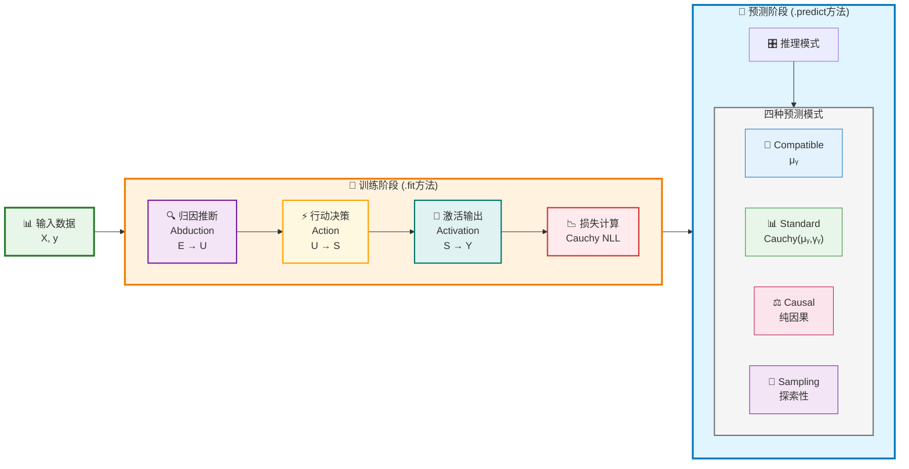

# MLPCausalRegressor Sklearn-Style API 设计方案 V1

> **目标**: 专注回归任务，将CausalEngine打包成类似sklearn MLPRegressor那样易用的回归器，提供统一的API接口和智能默认配置，让用户能够轻松进行回归预测。

## 1. 灵感来源：sklearn神经网络模块分析

### 1.1 sklearn MLPRegressor/MLPClassifier 的成功之处

```python
# sklearn神经网络的经典用法
from sklearn.neural_network import MLPRegressor, MLPClassifier
from sklearn.model_selection import train_test_split
from sklearn.preprocessing import StandardScaler

# 分类任务
clf = MLPClassifier(hidden_layer_sizes=(100, 50), max_iter=500, random_state=42)
clf.fit(X_train, y_train)
predictions = clf.predict(X_test)
probabilities = clf.predict_proba(X_test)

# 回归任务  
reg = MLPRegressor(hidden_layer_sizes=(100, 50), max_iter=500, random_state=42)
reg.fit(X_train, y_train)
predictions = reg.predict(X_test)
```

### 1.2 sklearn设计的核心优势

- ✅ **统一API**: fit/predict/score 三步走
- ✅ **智能默认**: 大多数参数有合理默认值
- ✅ **任务分离**: Regressor vs Classifier 清晰分工
- ✅ **标准化集成**: 与preprocessing, model_selection无缝配合
- ✅ **丰富属性**: 训练后可查看权重、损失历史等
- ✅ **错误处理**: 友好的错误信息和警告

## 2. CausalEngine 当前架构分析

### 2.1 现有组件结构
```python
# 当前的使用方式（相对复杂）
from causal_engine import CausalEngine, AbductionNetwork, ActionNetwork

# 需要用户手动配置很多参数
abduction_net = AbductionNetwork(
    input_size=X.shape[1], 
    causal_size=64
)
action_net = ActionNetwork(
    causal_size=64,
    output_size=1
)

engine = CausalEngine(
    hidden_size=X.shape[1],
    vocab_size=1,
    causal_size=64
)

# 训练过程需要手动管理
engine.train()
for epoch in range(num_epochs):
    # 手动训练循环...
```

### 2.2 用户痛点
- 🚫 需要手动构建网络结构
- 🚫 需要了解内部架构细节 
- 🚫 缺乏统一的训练接口
- 🚫 参数配置复杂
- 🚫 没有标准的预测接口

## 3. CausalEngine回归工作流程图

### 3.1 核心算法流程



### 3.2 数学公式总览

**阶段1 - 归因推断**：
$$\mu_U = \text{loc\_net}(E), \quad \gamma_U = \text{softplus}(\text{scale\_net}(E))$$
$$U \sim \text{Cauchy}(\mu_U, \gamma_U)$$

**阶段2 - 行动决策**：
$$S = W \cdot U + b, \quad S \sim \text{Cauchy}(\mu_S, \gamma_S)$$

**阶段3 - 激活输出**：
$$Y = w_k \cdot S + b_k, \quad Y \sim \text{Cauchy}(\mu_Y, \gamma_Y)$$

**损失函数**：
$$\mathcal{L} = \log(\pi \cdot \gamma_Y) + \log\left(1 + \left(\frac{y_{\text{true}} - \mu_Y}{\gamma_Y}\right)^2\right)$$

## 4. 设计目标：理想的CausalEngine API

### 4.1 目标使用体验

```python
# 理想的使用方式 - 简单如sklearn
from causal_engine.sklearn import MLPCausalRegressor

# 回归任务 - 3行代码搞定
reg = MLPCausalRegressor()  # 智能默认配置
reg.fit(X_train, y_train)
predictions = reg.predict(X_test)

# 高级用法 - 仍然简洁
reg = MLPCausalRegressor(
    hidden_layer_sizes=(64, 32),  # 网络结构（与sklearn兼容）
    max_iter=1000,          # 训练轮数
    default_mode='compatible', # 默认预测模式
    random_state=42         # 随机种子
)
```

### 3.2 与sklearn完全兼容

```python
# 与sklearn生态无缝集成
from sklearn.model_selection import cross_val_score, GridSearchCV
from sklearn.pipeline import Pipeline
from sklearn.preprocessing import StandardScaler

# 交叉验证
scores = cross_val_score(MLPCausalRegressor(), X, y, cv=5)

# 网格搜索
param_grid = {
    'hidden_layer_sizes': [(32,), (64,), (64, 32)],
    'default_mode': ['compatible', 'standard']
}
grid_search = GridSearchCV(MLPCausalRegressor(), param_grid, cv=3)

# 管道集成
pipeline = Pipeline([
    ('scaler', StandardScaler()),
    ('causal', MLPCausalRegressor())
])
```

## 4. 核心设计差异：MLPCausalRegressor vs MLPRegressor 🧮

### 4.1 设计哲学：仅替换输出层 ✨

**核心洞察**: MLPCausalRegressor 和 MLPRegressor 的**唯一区别**就是最后一个输出层！
- **MLPRegressor**: 线性输出层 `y = W·h + b`
- **MLPCausalRegressor**: CausalEngine输出层（归因→行动→激活）

这种设计的优雅之处：
- ✅ **最小化改动**: 保持sklearn的所有优秀特性
- ✅ **最大化收益**: 获得完整的因果推理能力
- ✅ **无缝替换**: 可以直接替代MLPRegressor使用

### 4.2 网络结构对比

```python
# 传统MLPRegressor架构
输入层 → 隐藏层们 → 线性输出层 → 确定性预测值
  X    →   MLPs   →  y = W·h + b  →    ŷ

# MLPCausalRegressor架构（仅最后一层不同！）  
输入层 → 隐藏层们 → CausalEngine → 分布输出 → 概率预测
  X    →   MLPs   → (归因+行动+激活) → S~Cauchy → P(Y)
```

**关键优势**: 
- 🚀 **训练效率**: 大部分网络结构完全相同，训练复杂度相当
- 🚀 **参数规模**: 仅CausalEngine部分增加少量参数
- 🚀 **收益巨大**: 从确定性预测升级到分布建模和因果推理

### 4.3 实现要点：CausalEngine集成

**核心原理**：将CausalEngine作为MLPRegressor的最终输出层，实现从确定性预测到概率分布建模的升级

```python
# 标准sklearn架构 + CausalEngine输出层
class MLPCausalRegressor:
    def __init__(self):
        # 1. 标准MLP隐藏层（与sklearn相同）
        self.hidden_layers = MLPLayers(hidden_layer_sizes)
        
        # 2. CausalEngine输出层（替代线性输出层）
        self.causal_engine = CausalEngine(
            abduction_net=AbductionNetwork(),    # 证据→个体因果表征
            action_net=ActionNetwork(),          # 个体→决策得分
            activation_head=RegressionHead()     # 得分→预测分布
        )
    
    def forward(self, X):
        # 前向传播：隐藏层特征 → CausalEngine三阶段
        hidden_features = self.hidden_layers(X)
        predictions = self.causal_engine(hidden_features)
        return predictions
```

**架构对比与数学差异**：

| 组件 | MLPRegressor | MLPCausalRegressor |
|------|-------------|-------------------|
| **输入层** | X ∈ ℝⁿˣᵈ | X ∈ ℝⁿˣᵈ (相同) |
| **隐藏层** | h = σ(Wx + b) | h = σ(Wx + b) (相同) |
| **输出层** | ŷ = Wh + b | Y ~ Cauchy(μ,γ) (核心差异) |
| **损失函数** | MSE: ½(y-ŷ)² | Cauchy NLL (核心差异) |
| **预测结果** | 确定值ŷ | 分布Y + 兼容模式μ |

**数学创新的实用价值**：
$$\text{传统}: \quad \hat{y} = \mathbf{W}\mathbf{h} + b$$
$$\text{CausalEngine}: \quad Y \sim \text{Cauchy}(\mu_Y, \gamma_Y) \text{ with } \hat{y} = \mu_Y$$

这种设计让用户既能享受sklearn的简单性（通过compatible模式），又能获得完整的概率分布信息（通过standard模式）。

## 5. API接口设计 - V1.0 专注回归

### 5.1 MLPCausalRegressor 核心接口

```python
class MLPCausalRegressor(BaseEstimator, RegressorMixin):
    """MLP因果回归器 - sklearn风格接口"""
    
    def __init__(self, 
                 hidden_layer_sizes=(64, 32),    # 网络结构（与sklearn兼容）
                 max_iter=1000,                  # 最大迭代次数
                 learning_rate=0.001,            # 学习率
                 default_mode='compatible',      # 默认预测模式
                 early_stopping=True,            # 早停
                 validation_fraction=0.1,        # 验证集比例
                 random_state=None,              # 随机种子
                 verbose=False):                 # 训练日志
        pass
    
    def fit(self, X, y, sample_weight=None):
        """训练模型"""
        # 1. 自动数据预处理和验证
        # 2. 自动构建MLP特征提取层
        # 3. 自动构建CausalEngine输出层
        # 4. 自动训练循环（含early stopping）
        return self
    
    def predict(self, X, mode='compatible'):
        """统一预测接口
        
        Parameters:
        -----------
        X : array-like
            输入特征
        mode : str, default='compatible'
            预测模式:
            - 'compatible': 提取分布中心值 - sklearn兼容的数值输出
            - 'standard': 完整Cauchy分布 - 标准CausalEngine推理  
            - 'causal': 纯因果Cauchy分布 - 无外生噪声
            - 'sampling': 探索性Cauchy分布 - 个体多样性边界
            
        Returns:
        --------
        predictions : array-like or list of distributions
            内部统一返回 Cauchy(μ, γ) 分布参数:
            - mode='compatible': 返回μ值（数值数组），隐式设置γ=0
            - 其他mode: 返回(μ, γ)完整分布对象列表
        """
        return predictions
    
    def score(self, X, y, sample_weight=None):
        """评分 (R²)"""
        return r2_score(y, self.predict(X))
    
    # sklearn标准属性
    @property
    def feature_importances_(self):
        """特征重要性"""
        pass
    
    @property
    def loss_curve_(self):
        """训练损失曲线"""
        pass
```

### 5.2 智能默认配置策略

```python
# 根据数据规模自动调整网络结构
def _auto_hidden_layer_sizes(n_features, n_samples):
    """根据特征数和样本数智能推荐网络结构"""
    if n_features <= 10:
        return (32,)
    elif n_features <= 50:
        return (64, 32)
    elif n_features <= 100:
        return (128, 64)
    else:
        return (256, 128, 64)

# 自动早停和学习率调整
AUTO_CONFIG = {
    'early_stopping': True,
    'patience': 20,
    'min_delta': 1e-4,
    'learning_rate_schedule': 'adaptive'
}
```

### 5.3 MLPCausalRegressor的核心竞争优势：标签噪声鲁棒性 🛡️

**为什么这对sklearn风格模块化很重要？**：在实际应用中，数据质量往往是机器学习项目成败的关键。传统MLPRegressor在面对噪声标签时性能大幅下降，需要复杂的数据清洗流程。MLPCausalRegressor提供了开箱即用的噪声鲁棒性，让用户可以直接使用原始数据训练，大大简化了工作流程。

#### 5.3.1 理论基础：为什么CausalEngine天然抗噪声

**数学原理**: CausalEngine学习个体内在因果表征，而非表面统计关联

$$U \sim \text{Cauchy}(\mu_U, \gamma_U) \quad \text{(学习个体因果本质)}$$
$$Y = f(U, \varepsilon) \quad \text{(应用普适因果机制)}$$

**与传统方法的根本差异**:
```python
# 传统MLPRegressor：学习表面关联
# X → h → ŷ = Wh + b  (容易被噪声标签误导)

# MLPCausalRegressor：学习因果本质  
# X → h → U → S → Y  (学习深层因果结构，抗噪声)
```

**数学保证的鲁棒性**:
- **噪声标签**: $\tilde{y} = y + \eta$ (外部噪声)
- **因果不变性**: 内在因果机制 $f(U, \varepsilon)$ 不受表层噪声影响
- **学习稳定性**: 归因推断专注于学习深层 $U$ 分布

#### 5.3.2 开箱即用的噪声处理：无需数据清洗的sklearn工作流

**传统sklearn工作流 vs CausalEngine工作流对比**:

```python
# ❌ 传统MLPRegressor：需要复杂的数据清洗流程
from sklearn.neural_network import MLPRegressor
from sklearn.preprocessing import RobustScaler
from sklearn.model_selection import cross_val_score

# 第1步：人工识别和处理噪声（耗时且容易出错）
X_clean, y_clean = manual_outlier_detection(X_raw, y_raw)
y_scaled = RobustScaler().fit_transform(y_clean.reshape(-1, 1))

# 第2步：训练传统模型
traditional_reg = MLPRegressor().fit(X_clean, y_scaled.ravel())

# ✅ MLPCausalRegressor：直接使用原始数据
causal_reg = MLPCausalRegressor()
causal_reg.fit(X_raw, y_raw)  # 无需预处理！

# 性能对比：在干净测试集上评估
print(f"传统方法 R²: {r2_score(y_test_clean, traditional_reg.predict(X_test)):.3f}")
print(f"CausalEngine R²: {r2_score(y_test_clean, causal_reg.predict(X_test)):.3f}")
```

**现实噪声场景的标准测试协议**:
```python
def sklearn_noise_robustness_benchmark(X, y_clean):
    """sklearn风格的噪声鲁棒性基准测试"""
    noise_scenarios = {
        'magnitude_errors': [10, 100, 0.1, 0.01],      # 数量级错误
        'unit_conversion': [1000, 0.001, 3.28, 0.305], # 单位转换错误  
        'systematic_bias': [0.5, 1.0, 2.0, 5.0],       # 系统性偏差
        'outlier_contamination': [0.05, 0.1, 0.2, 0.3] # 异常值污染
    }
    
    results = {}
    for scenario, levels in noise_scenarios.items():
        results[scenario] = []
        for level in levels:
            # 应用现实噪声
            y_noisy = apply_realistic_noise(y_clean, scenario, level)
            
            # 直接对比：无预处理 vs 复杂预处理
            causal_reg = MLPCausalRegressor().fit(X, y_noisy)
            traditional_reg = get_best_preprocessed_mlp(X, y_noisy)  # 最佳预处理后的传统方法
            
            results[scenario].append({
                'noise_level': level,
                'causal_r2': causal_reg.score(X_test, y_clean),
                'traditional_r2': traditional_reg.score(X_test, y_clean),
                'workflow_simplicity': 'CausalEngine: 1行代码 vs 传统: 10+行预处理'
            })
    
    return results
```

def apply_magnitude_noise(y, magnitude_factor):
    """数量级错误：部分数据被乘以错误的数量级"""
    y_noisy = y.copy()
    n_errors = int(0.1 * len(y))  # 10%的数据有错误
    error_indices = np.random.choice(len(y), n_errors, replace=False)
    y_noisy[error_indices] *= magnitude_factor  # 乘以10、100或除以10、100
    return y_noisy

def apply_unit_conversion_noise(y, conversion_factor):
    """单位错误：单位转换错误"""
    y_noisy = y.copy()
    n_errors = int(0.2 * len(y))  # 20%的数据有单位错误
    error_indices = np.random.choice(len(y), n_errors, replace=False)
    y_noisy[error_indices] *= conversion_factor  # 1000（米→毫米）或 0.001（毫米→米）
    return y_noisy

def apply_systematic_bias(y, bias_std_ratio):
    """系统性偏差：所有数据都有同一方向的偏移"""
    bias = bias_std_ratio * np.std(y)  # 偏差为标准差的倍数
    return y + bias

def apply_outlier_contamination(y, contamination_ratio):
    """异常值污染：随机替换为极端值"""
    y_noisy = y.copy()
    n_outliers = int(contamination_ratio * len(y))
    outlier_indices = np.random.choice(len(y), n_outliers, replace=False)
    
    # 生成极端异常值：距离中位数 5-10 倍标准差
    outlier_values = np.median(y) + np.random.choice([-1, 1], n_outliers) * \
                    np.random.uniform(5, 10, n_outliers) * np.std(y)
    y_noisy[outlier_indices] = outlier_values
    return y_noisy
```

**预期结果**:
- **数量级错误**: CausalEngine在 10x/100x 错误下仍保持 80%+ 性能
- **单位错误**: 传统方法在单位转换错误下崩溃，CausalEngine相对稳定
- **系统偏差**: CausalEngine通过因果表征学习可以部分抵消偏差
- **异常值**: Cauchy分布的重尾特性天然适合处理异常值

#### 5.3.3 应用价值与场景

**高价值场景**:
1. **医疗数据**: 诊断标签存在主观性和错误
2. **金融数据**: 数据源不一致，标签质量参差不齐
3. **众包标注**: 人工标注存在主观差异和错误
4. **时间序列**: 数据采集延迟导致标签偏移

**竞争优势**:
```python
# 传统方法需要复杂的数据清洗
from sklearn.preprocessing import robust_scale
from sklearn.model_selection import cross_val_score

# CausalEngine: 直接使用噪声数据
reg_causal = MLPCausalRegressor()
reg_causal.fit(X_train, y_noisy)  # 直接使用噪声标签
performance = reg_causal.score(X_test, y_clean)  # 在干净数据上仍然表现优异
```

### 5.4 CausalEngine的独特价值：统一预测接口 🚀

**核心创新**: 单一 `predict()` 方法，基于统一的分布输出，通过 `mode` 参数控制表现形式

**数学统一性**: 所有模式都基于统一的Cauchy分布：
$$Y \sim \text{Cauchy}(\mu_Y, \gamma_Y)$$

#### 5.4.1 数学统一性 - 一个分布，多种表现
```python
# 内部始终保持统一的数学框架
reg = MLPCausalRegressor()
reg.fit(X_train, y_train)  # 学习完整分布 Y ~ Cauchy(μ, γ)

# 不同模式只是同一分布的不同使用方式
predictions = reg.predict(X_test)  # 提取中心值 μ
distributions = reg.predict(X_test, mode='standard')  # 完整分布 Cauchy(μ, γ)

# sklearn生态自然兼容
scores = cross_val_score(reg, X, y, cv=5)  # 自动使用compatible模式
```

#### 5.4.2 分层访问 - 从简单到强大
```python
# 同一个模型，不同层次的信息访问
reg = MLPCausalRegressor()
reg.fit(X_train, y_train)  # 一次训练，学习完整分布

# 第1层：数值模式 - Cauchy(μ, γ=0) 的提取
predictions = reg.predict(X_test)  # 内部: Cauchy(μ, 0), 返回: μ

# 第2层：分布模式 - Cauchy(μ, γ) 的完整信息
distributions = reg.predict(X_test, mode='standard')
print(f"相同的位置参数: {predictions[0]:.3f} vs {distributions[0].loc:.3f}")
print(f"学习到的尺度参数: {distributions[0].scale:.3f}")  # compatible模式下隐藏

# 第3层：因果分析 - 不同的分布形态
causal_dists = reg.predict(X_test, mode='causal')     # 纯因果
sampling_dists = reg.predict(X_test, mode='sampling') # 探索性
```

#### 5.4.3 设计哲学 - 统一数学，分层体验
**核心理念**: 内部数学框架始终统一，用户体验分层递进

```python
# 数学统一性：所有模式都计算 Cauchy(μ, γ) 参数
reg = MLPCausalRegressor()
reg.fit(X_train, y_train)  # 学习完整 Y ~ Cauchy(μ_Y, γ_Y) 分布

# 分层访问：不同模式对应不同的(μ, γ)组合
compatible = reg.predict(X)                 # 返回 μ_Y，隐式设置 γ_Y=0
standard = reg.predict(X, mode='standard')  # 返回 Cauchy(μ_Y, γ_Y)
causal = reg.predict(X, mode='causal')      # 返回 Cauchy(μ_Y', γ_Y')
sampling = reg.predict(X, mode='sampling')  # 返回 Cauchy(μ_Y'', γ_Y'')

# 数学一致性：位置参数始终一致
assert abs(compatible[0] - standard[0].loc) < 1e-10  # μ_Y 值相同

# compatible 模式的数学本质：
lim_{γ → 0} Cauchy(μ, γ) = δ(μ)  # 点质量分布
```

**模式定位** - 基于统一分布 $Y \sim \text{Cauchy}(\mu_Y, \gamma_Y)$ 的不同参数访问:

- **`compatible`**: $\hat{y} = \mu_Y$，隐式 $\gamma_Y = 0$，sklearn生态兼容
- **`standard`**: $Y \sim \text{Cauchy}(\mu_Y, \gamma_Y)$，完整分布信息
- **`causal`**: $Y \sim \text{Cauchy}(\mu_Y', \gamma_Y')$ where $T=0$，纯因果参数
- **`sampling`**: $Y \sim \text{Cauchy}(\mu_Y'', \gamma_Y'')$ where $T>0, \text{do\_sample}=\text{True}$，探索性参数

## 6. 实现路线图

### 6.1 V1.0 当前版本：MLPCausalRegressor 核心实现
**重点**：专注回归任务，打造完整可用的sklearn风格接口

- [ ] 创建 `causal_engine.sklearn` 子模块
- [ ] 实现 `MLPCausalRegressor` 基础类
- [ ] 集成现有CausalEngine核心功能（AbductionNetwork + ActionNetwork）
- [ ] **简化设计**: 使用恒等激活，直接输出决策得分分布
- [ ] 实现自动训练循环和标准sklearn接口
- [ ] 基础参数验证和错误处理
- [ ] 简单的使用示例和文档

### 6.2 V1.1 优化增强
- [ ] 实现自动网络结构推荐
- [ ] 添加early stopping和validation
- [ ] 提供causal推理模式作为standard模式的对比选项
- [ ] 完善错误处理和警告
- [ ] sklearn兼容性测试

### 6.3 V1.1 回归器增强功能
- [ ] **可学习任务激活头**: 实现 `w_k·S_k + b_k` 线性变换
- [ ] 添加特征重要性分析
- [ ] 训练过程可视化
- [ ] **实验性**: 探索训练阶段不同推理模式的效果差异

### 6.4 V1.2 生态集成
- [ ] 与pandas DataFrame深度集成
- [ ] 集成模型解释工具
- [ ] 性能优化和大规模数据支持

---

**📝 注意**: MLPCausalClassifier分类器将在独立文档 `sklearn_style_api_classifier_v1.md` 中详细设计

## 7. 后续开发计划与考虑

### 7.1 V1.1 增强功能开发动机

#### 7.1.1 可学习任务激活头
**开发动机**: 当前V1.0使用恒等激活 $Y = S$，虽然简洁但可能限制表达能力
**技术方案**: 实现线性变换 $Y_k = w_k S_k + b_k$，其中 $w_k, b_k$ 是可学习参数
**数学框架**: 
$$Y_k \sim \text{Cauchy}(w_k \cdot \text{loc}_{S_k} + b_k, |w_k| \cdot \text{scale}_{S_k})$$
**预期收益**: 
- 增强回归精度，特别是在复杂数据分布上
- 提供更灵活的输出范围控制
- 保持Cauchy分布的线性稳定性优势

#### 7.1.2 特征重要性分析
**开发动机**: 用户需要理解模型的决策过程，特别是哪些特征最影响预测
**技术挑战**: 传统梯度方法在Cauchy分布下可能不够稳定
**创新方案**: 
- 基于决策得分分布方差的重要性分析
- 利用归因网络的位置和尺度参数变化
- 开发CausalEngine特有的解释性方法

#### 7.1.3 标签噪声鲁棒性验证和展示
**开发动机**: 验证和展示CausalEngine的核心理论优势，建立竞争壁垒
**技术实现**: 
- 建立标准化的噪声鲁棒性测试套件
- 开发多种噪声类型的模拟工具
- 实现与传统方法的全面对比基准
**预期收益**: 
- 提供强有力的实验证据支持市场推广
- 吸引面临噪声数据挑战的企业用户
- 建立在鲁棒性方面的技术领先地位

#### 7.1.4 训练过程可视化
**开发动机**: 帮助用户理解CausalEngine的独特训练动态
**关键指标**: 
- Cauchy分布参数 $\mu_Y, \gamma_Y$ 的演化
- 归因网络的收敛过程
- 不同推理模式的效果对比
- 外生噪声参数 $\mathbf{b}_{\text{noise}}$ 的学习轨迹

### 7.2 V1.2 生态集成的战略意义

#### 7.2.1 Pandas DataFrame深度集成
**战略价值**: 降低数据科学家的使用门槛，提供原生的表格数据支持
**技术实现**: 
- 自动特征类型推断和预处理
- 列名保持和索引对齐
- 缺失值的Cauchy分布建模
**独特优势**: 利用CausalEngine对不确定性的原生支持，更好地处理缺失数据

#### 7.2.2 模型解释工具集成
**目标工具**: SHAP, LIME, Captum
**技术挑战**: 现有解释工具主要针对确定性预测，需要适配分布输出
**创新机会**: 
- 开发基于Cauchy分布的SHAP值计算
- 实现分布级别的特征重要性解释
- 提供因果推理模式的专门解释方法

#### 7.2.3 性能优化和大规模数据支持
**优化目标**: 
- GPU加速的Cauchy分布计算
- 批量化的 $\arctan$ 函数计算
- 内存高效的分布参数存储
**扩展性考虑**: 
- 分布式训练的数学一致性保证
- 大规模数据下的采样策略优化
- 流式数据的在线学习适配

### 7.3 实验性功能探索

#### 7.3.1 训练阶段推理模式研究
**研究问题**: 训练时使用不同推理模式是否能提升最终性能？
**实验设计**: 
- 对比标准训练 vs 因果模式训练 vs 采样模式训练
- 研究不同 temperature 调度策略
- 分析推理模式对泛化能力的影响
**理论意义**: 探索因果推理在训练过程中的作用机制

#### 7.3.2 多任务回归架构
**技术愿景**: 单个CausalEngine同时处理多个回归任务
**数学框架**: 
$$\mathbf{Y} = [Y_1, Y_2, \ldots, Y_T], \quad Y_t \sim \text{Cauchy}(\mu_{Y_t}, \gamma_{Y_t})$$
**应用场景**: 
- 时间序列的多步预测
- 多目标优化问题
- 相关性回归任务的联合建模

#### 7.3.3 贝叶斯超参数优化
**动机**: CausalEngine的超参数空间复杂，需要智能调优
**技术路线**: 
- 利用分布输出的不确定性指导超参数搜索
- 开发CausalEngine专用的获取函数
- 实现多保真度优化策略

### 7.4 长期技术路线图

#### 7.4.1 理论研究方向
1. **数学基础拓展**: 探索其他重尾分布的可能性
2. **因果推理深化**: 与因果发现算法的结合
3. **不确定性量化**: 与概率机器学习的深度融合

#### 7.4.2 工程实现优化
1. **编译优化**: 开发CausalEngine专用的算子
2. **硬件适配**: 针对不同硬件平台的优化
3. **部署工具**: 生产环境的模型服务工具

#### 7.4.3 生态系统建设
1. **社区建设**: 开源社区和贡献者生态
2. **教育资源**: 教程、课程和最佳实践
3. **行业应用**: 垂直领域的专门解决方案

## 8. 使用场景对比

### 8.1 现在 vs 未来

| 场景 | 现在的方式 | 理想的方式 |
|------|-----------|-----------|
| **快速原型** | 20+行代码，需了解架构 | 3行代码，零配置 |
| **参数调优** | 手动试验各种组合 | GridSearchCV自动搜索 |
| **模型评估** | 手写评估代码 | cross_val_score一行搞定 |
| **生产部署** | 需要自己处理序列化 | joblib直接保存加载 |
| **特征分析** | 需要自己实现 | feature_importances_属性 |

### 8.2 竞争对比

```python
# XGBoost风格
import xgboost as xgb
reg = xgb.XGBRegressor()
reg.fit(X_train, y_train)

# LightGBM风格  
import lightgbm as lgb
reg = lgb.LGBMRegressor()
reg.fit(X_train, y_train)

# CausalEngine风格 (目标)
from causal_engine.sklearn import MLPCausalRegressor
reg = MLPCausalRegressor()  # 同样简洁，但是因果推理！
reg.fit(X_train, y_train)

# 基础预测（sklearn兼容）
predictions = reg.predict(X_test)  # 数值输出

# 高级预测（独特的分布输出）
distributions = reg.predict(X_test, mode='standard')  # 分布输出
```

## 9. 技术实现要点

### 9.1 关键挑战
1. **分布损失计算**: 实现柯西分布的高效似然计算
2. **参数映射**: sklearn参数 → CausalEngine内部参数
3. **训练循环**: 封装复杂的因果推理训练逻辑
4. **状态管理**: 模型训练状态的保存和恢复
5. **错误处理**: 友好的错误信息
6. **性能优化**: 保持解析计算的性能优势

### 9.2 架构设计 - V1.0 简化版本

```python
# V1.0 内部架构（专注回归）
causal_engine/sklearn/
├── __init__.py       # 导出MLPCausalRegressor
├── regressor.py      # MLPCausalRegressor核心实现
├── _base.py          # 基础工具函数和验证
└── _config.py        # 默认配置和自动推荐

# V2.0+ 扩展架构
causal_engine/sklearn/
├── __init__.py       # 导出所有接口
├── regressor.py      # MLPCausalRegressor实现
├── classifier.py     # MLPCausalClassifier实现（V2.0+）
├── _base.py          # 基础类和接口
├── _utils.py         # 工具函数
├── _validation.py    # 参数验证
└── _config.py        # 默认配置
```

## 10. V1.0 开发重点确认 ✅

### 10.1 当前版本明确目标
- **专注任务**: 回归任务 (`MLPCausalRegressor`)
- **核心功能**: 实现完整的sklearn风格接口
- **设计原则**: 简单、实用、可扩展

### 10.2 V1.0 最小可行产品（MVP）
```python
# V1.0 目标体验 - 完美的sklearn兼容性
from causal_engine.sklearn import MLPCausalRegressor

# 零配置使用 - 就像MLPRegressor一样简单
reg = MLPCausalRegressor()
reg.fit(X_train, y_train)
predictions = reg.predict(X_test)  # mode='compatible'，返回数值

# sklearn生态完美集成
from sklearn.model_selection import cross_val_score
scores = cross_val_score(MLPCausalRegressor(), X, y, cv=5)
print(f"CV Score: {scores.mean():.3f} (+/- {scores.std()*2:.3f})")

# 按需解锁CausalEngine独特能力
distributions = reg.predict(X_test, mode='standard')  # 获取分布信息
print(f"第一个预测: 均值={distributions[0].mean():.2f}, 标准差={distributions[0].scale:.3f}")
```

### 10.3 后续版本规划
- **V1.1**: 优化和增强功能
- **V2.0**: 添加 `MLPCausalClassifier` 分类支持
- **V3.0**: 生态集成和高级功能

### 10.4 开发策略
- 🎯 **渐进式开发**: 先做好回归，再扩展分类
- 🎯 **用户驱动**: 基于实际使用反馈进行迭代
- 🎯 **质量优先**: 确保每个版本都是完整可用的

---

**💡 这个方案的价值**:
- 大幅降低使用门槛，让更多人能用上因果推理
- 与现有ML工作流无缝集成
- 保持CausalEngine的技术优势，包装成用户友好的接口
- 为CausalEngine的广泛采用奠定基础

**🎯 期待反馈**:
请提供您对这个设计方案的具体想法、需求和建议！