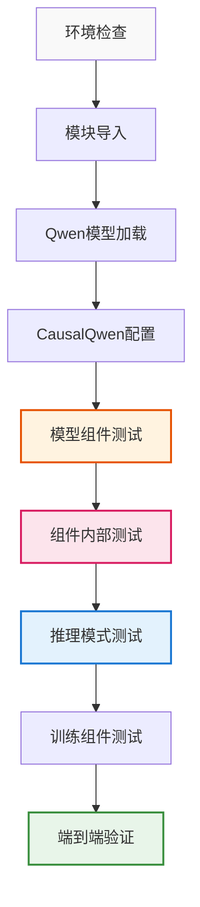
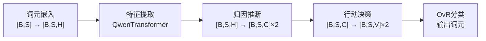

# CausalQwen 测试脚本完整解读文档

> **📋 文档目标**: 详细解读 `comprehensive_component_test.py` 每个测试步骤的数学含义和代码验证
> **🎯 验证核心**: 确保测试忠实执行了 `design-docs/causal_qwen.md` 中的理论设计
> **📖 使用说明**: 每个测试部分都包含理论基础、实现细节和预期验证结果

## 测试脚本总体架构

### 测试流程图



## 第一部分：环境和依赖检查

### 测试目的
验证运行CausalQwen所需的基础环境配置，确保所有依赖项正确安装且Qwen模型文件存在。

### 关键验证点

#### 1.1 Python环境检查
```python
print_info(f"Python版本: {sys.version}")
print_info(f"当前工作目录: {os.getcwd()}")
print_info(f"项目根目录: {project_root}")
```

**验证内容**：
- Python版本兼容性（推荐3.8+）
- 工作目录正确设置
- 项目路径添加到sys.path

#### 1.2 PyTorch检查
```python
import torch
print_success(f"PyTorch版本: {torch.__version__}")
print_info(f"CUDA可用: {torch.cuda.is_available()}")
```

**验证内容**：
- PyTorch版本（推荐1.10+）
- CUDA可用性（可选但推荐）
- 设备配置确认

#### 1.3 Qwen模型路径验证
```python
qwen_path = os.path.expanduser('~/models/Qwen2.5-0.5B')
config_file = os.path.join(qwen_path, 'config.json')
model_file = os.path.join(qwen_path, 'pytorch_model.bin')
```

**关键文件检查**：
- `config.json`：模型配置文件
- `pytorch_model.bin` 或 `model.safetensors`：权重文件
- `tokenizer.json`：分词器文件

**预期结果**：所有检查通过，为后续测试奠定基础。

## 第二部分：项目模块导入测试

### 测试目的
验证CausalQwen MVP模块的正确导入和版本信息，确保核心类可用。

### 核心模块导入
```python
from causal_qwen_mvp import (
    CausalQwenMVPForCausalLM,   # 主模型类
    CausalQwen2Config,          # 配置类
    CausalInferenceEngine,      # 推理引擎
    InferenceValidator,         # 推理验证器
    CausalTrainer,              # 训练器
    get_model_info              # 模型信息
)
```

### 数学理论对应
这些模块实现了以下理论组件：

| 模块 | 数学表示 | 理论作用 |
|------|----------|----------|
| `CausalQwenMVPForCausalLM` | $Y = f(U, \epsilon)$ | 完整因果模型 |
| `CausalQwen2Config` | 超参数 $\theta$ | 模型配置参数 |
| `CausalInferenceEngine` | $P(U\|X)$ 推断 | 推理引擎 |

### 预期结果
```
✅ 核心模块导入成功
ℹ️  项目名称: CausalQwen
ℹ️  版本: MVP v0.1.0
ℹ️  状态: 核心框架验证完成
```

## 第三部分：原始Qwen模型加载测试

### 测试目的
验证能否正确加载预训练的Qwen2.5-0.5B模型配置，为CausalQwen继承奠定基础。

### 核心配置加载
```python
from transformers import Qwen2Config, Qwen2ForCausalLM, AutoTokenizer
qwen_path = os.path.expanduser('~/models/Qwen2.5-0.5B')
config = Qwen2Config.from_pretrained(qwen_path)
```

### 关键参数验证
```python
print_info(f"词汇表大小: {config.vocab_size}")        # V
print_info(f"隐藏层大小: {config.hidden_size}")       # H  
print_info(f"层数: {config.num_hidden_layers}")       # L
print_info(f"注意力头数: {config.num_attention_heads}") # num_heads
```

### 数学维度对应

根据设计文档，这些参数定义了基础架构：

| 参数 | 符号 | 典型值 (0.5B) | 数学作用 |
|------|------|---------------|----------|
| `vocab_size` | $V$ | 151,936 | 词汇表大小 |
| `hidden_size` | $H$ | 896 | 隐藏层维度 |
| `num_hidden_layers` | $L$ | 24 | Transformer层数 |
| `num_attention_heads` | $h$ | 14 | 注意力头数 |

### 预期结果
成功加载配置并显示关键参数，为CausalQwen配置创建提供基础。

## 第四部分：CausalQwen模型初始化测试

### 测试目的
验证CausalQwen特有配置的创建和模型初始化，确保因果扩展参数正确设置。

### 因果配置创建

#### 4.1 配置参数映射
```python
causal_config = CausalQwen2Config(
    vocab_size=qwen_config.vocab_size,           # 继承Qwen参数
    hidden_size=qwen_config.hidden_size,         # H 
    # ... 其他Qwen参数
    # CausalQwen特有参数
    causal_size=qwen_config.hidden_size,         # C = H (设计决策)
    abduction_init_strategy='identity',          # 归因网络初始化
    b_noise_init=0.1,                          # 外生噪声初始值
    gamma_init=10.0                             # Cauchy尺度初始值
)
```

#### 4.2 数学参数意义

**核心设计决策**：`causal_size = hidden_size` (即 $C = H$)

根据设计文档第2.2节：
- $C$：因果表征维度，个体选择变量 $U$ 的维度
- $H$：隐藏层维度，继承自Qwen
- 设置 $C = H$ 保证了维度兼容性和表征能力

**初始化策略**：
- `abduction_init_strategy='identity'`：归因网络初始化为恒等映射
- `b_noise_init=0.1`：外生噪声参数 $b_{\text{noise}}$ 初始值
- `gamma_init=10.0`：Cauchy分布尺度参数初始值

### 预期结果
```
✅ CausalQwen配置创建成功
ℹ️  因果维度: 896 (= hidden_size)
ℹ️  归因初始化策略: identity
ℹ️  噪声参数: 0.1
```

## 第五部分：模型组件功能测试

### 测试目的
验证完整CausalQwen模型的成功初始化，确保所有组件正确构建。

### 模型初始化
```python
CausalQwenMVPForCausalLM = modules['CausalQwenMVPForCausalLM']
model = CausalQwenMVPForCausalLM(causal_config)
```

### 数学架构验证

#### 5.1 模型组件结构
根据设计文档第2.1节，CausalQwen包含：



#### 5.2 参数统计验证
```python
total_params = sum(p.numel() for p in model.parameters())
trainable_params = sum(p.numel() for p in model.parameters() if p.requires_grad)
```

**理论对比**：
- 标准Qwen2.5-0.5B：约500M参数
- CausalQwen额外参数：
  - 归因网络：$2 \times H \times C = 2H^2$ 
  - 行动网络：$C \times V + C = C(V+1)$
  - 总增量：约 $2H^2 + C(V+1)$ 参数

### 预期结果
```
✅ CausalQwen模型初始化成功
ℹ️  总参数数量: ~500,XXX,XXX
ℹ️  可训练参数: ~500,XXX,XXX
```

## 第六部分：组件内部功能测试

### 测试目的
深入验证各个核心组件的数学实现，确保符合理论设计。

### 6.1 Cauchy数学工具测试

#### 数学理论基础
根据设计文档第1.2.3节，柯西分布的线性稳定性：

**线性组合稳定性**：
$$\sum_{i=1}^n w_i X_i \sim \text{Cauchy}\left(\sum_{i=1}^n w_i \mu_i, \sum_{i=1}^n |w_i| \gamma_i\right)$$

#### 代码验证
```python
from causal_qwen_mvp.models import CauchyMath

# 测试位置参数变换
result_loc = CauchyMath.cauchy_linear_stable_loc(loc_input, weight)
# 测试尺度参数变换  
result_scale = CauchyMath.cauchy_linear_stable_scale(scale_input, weight)
```

**维度验证**：
- 输入：`loc_input` $\in \mathbb{R}^{B \times H}$，`weight` $\in \mathbb{R}^{C \times H}$
- 输出：`result_loc` $\in \mathbb{R}^{B \times C}$

### 6.2 归因推断网络测试

#### 数学理论对应
根据设计文档第3.3节，归因推断实现：

$$\text{loc}_{U_i} = W_{\text{loc}} \cdot z_i + b_{\text{loc}}$$
$$\text{scale}_{U_i} = \text{softplus}(W_{\text{scale}} \cdot z_i + b_{\text{scale}})$$

#### 代码验证
```python
test_input = torch.randn(batch_size, seq_len, hidden_size)  # [B, S, H]
with torch.no_grad():
    loc_U, scale_U = model.abduction_network(test_input)
```

**维度检查**：
- 输入：`[B, S, H]` 上下文特征
- 输出：`loc_U` $\in \mathbb{R}^{B \times S \times C}$，`scale_U` $\in \mathbb{R}^{B \times S \times C}$

**数学语义**：
- `loc_U`：个体群体的典型代表
- `scale_U`：群体内部多样性（不确定性）

### 6.3 行动决策网络测试

#### 数学理论对应
根据设计文档第3.4节，线性因果律：

**外生噪声融合**：
$$U'_i = U_i + \epsilon \sim \text{Cauchy}(\text{loc}_{U_i}, \text{scale}_{U_i} + |b_{\text{noise}}|)$$

**线性决策**：
$$S_{k,i} = W_{\text{cls},k} \cdot U'_i + b_{\text{cls},k}$$

#### 代码验证
```python
with torch.no_grad():
    loc_U, scale_U = model.abduction_network(test_input)
    action_loc, action_scale = model.action_network(loc_U, scale_U)
```

**维度验证**：
- 输入：`loc_U`, `scale_U` $\in \mathbb{R}^{B \times S \times C}$
- 输出：`action_loc`, `action_scale` $\in \mathbb{R}^{B \times S \times V}$

### 预期结果
```
✅ Cauchy位置变换测试通过，输出形状: [B, C]
✅ Cauchy尺度变换测试通过，输出形状: [B, C]
✅ 归因网络测试通过
ℹ️  输入形状: [2, 10, 896]
ℹ️  loc_U输出形状: [2, 10, 896]
ℹ️  scale_U输出形状: [2, 10, 896]
✅ 行动网络测试通过
ℹ️  loc_S输出形状: [2, 10, 151936]
ℹ️  scale_S输出形状: [2, 10, 151936]
```

## 第七部分：推理模式测试

### 测试目的
验证CausalQwen的三种推理模式是否符合设计文档第5节的理论框架。

### 7.1 标准推理模式

#### 数学理论基础
根据设计文档第5.1节，标准推理基于分布期望：

$$P_k = \frac{1}{2} + \frac{1}{\pi} \arctan\left(\frac{\text{loc}_{S_k} - C_{\text{ovr}}}{\text{scale}_{S_k}}\right)$$

#### 代码验证
```python
with torch.no_grad():
    standard_output = model.inference(test_input_ids, mode='standard')
```

**输出结构**：
- `standard_output.loc_S`：决策分布位置参数 $\in \mathbb{R}^{B \times S \times V}$
- `standard_output.scale_S`：决策分布尺度参数 $\in \mathbb{R}^{B \times S \times V}$

**数学语义**：每个词汇 $k$ 的决策分布 $S_k \sim \text{Cauchy}(\text{loc}_{S_k}, \text{scale}_{S_k})$

### 7.2 因果推理模式

#### 数学理论基础
根据设计文档第5.2节，因果推理输出个体后验分布：

$$U_i \sim \text{Cauchy}(\text{loc}_{U_i}, \text{scale}_{U_i})$$

#### 代码验证
```python
with torch.no_grad():
    causal_output = model.inference(test_input_ids, mode='causal')
```

**输出结构**：
- `causal_output.loc_U`：个体群体中心 $\in \mathbb{R}^{B \times S \times C}$
- `causal_output.scale_U`：个体群体多样性 $\in \mathbb{R}^{B \times S \times C}$

**应用场景**：个体采样、一致性生成、反事实推理

### 7.3 兼容推理模式

#### 数学理论基础
根据设计文档第5.3节，兼容模式同时输出所有信息：

- 个体分布参数：$(\text{loc}_U, \text{scale}_U)$
- 决策分布参数：$(\text{loc}_S, \text{scale}_S)$
- 传统Softmax概率：$P_{\text{softmax}}(k) = \frac{\exp(\text{loc}_{S_k})}{\sum_j \exp(\text{loc}_{S_j})}$

#### 代码验证
```python
with torch.no_grad():
    compatible_output = model.inference(test_input_ids, mode='compatible')
```

### 推理模式对比表

| 模式 | 输出内容 | 数学表示 | 应用场景 |
|------|----------|----------|----------|
| `standard` | 决策分布参数 | $(\text{loc}_S, \text{scale}_S)$ | 高效确定性推理 |
| `causal` | 个体分布参数 | $(\text{loc}_U, \text{scale}_U)$ | 因果采样，一致性生成 |
| `compatible` | 全部信息 | 上述两者 + 传统概率 | 混合推理策略 |

### 预期结果
```
✅ 标准推理模式测试通过
ℹ️  输出loc_S形状: [1, 8, 151936]
ℹ️  输出scale_S形状: [1, 8, 151936]
✅ 因果推理模式测试通过  
ℹ️  输出loc_U形状: [1, 8, 896]
ℹ️  输出scale_U形状: [1, 8, 896]
✅ 兼容推理模式测试通过
ℹ️  输出包含所有字段
```

## 第八部分：训练组件测试

### 测试目的
验证CausalQwen的训练机制，包括损失计算和梯度传播。

### 8.1 损失计算测试

#### 数学理论基础
根据设计文档第4.2节，完整损失计算：

**OvR概率计算**：
$$P_{k,i} = \frac{1}{2} + \frac{1}{\pi} \arctan\left(\frac{\text{loc}_{S_{k,i}} - C_{\text{ovr}}}{\text{scale}_{S_{k,i}}}\right)$$

**二元交叉熵损失**：
$$L_{\text{cls},i} = -\sum_{k=1}^V [y_{k,i} \log P_{k,i} + (1-y_{k,i}) \log(1-P_{k,i})] \cdot \text{mask}_i$$

**总损失**：
$$\mathcal{L} = \frac{\sum_{i=1}^S L_{\text{cls},i}}{\sum_{i=1}^S \text{mask}_i}$$

#### 代码验证
```python
input_ids = torch.randint(0, min(model.config.vocab_size, 1000), (batch_size, seq_len))
targets = torch.randint(0, min(model.config.vocab_size, 1000), (batch_size, seq_len))

model.train()
with torch.enable_grad():
    output = model.forward(input_ids, labels=targets)
```

**关键验证点**：
- 损失值非空且有限
- 支持掩码处理（忽略padding位置）
- OvR分类机制正确实现

### 8.2 梯度计算测试

#### 数学理论
验证反向传播能否正确计算梯度：

$$\frac{\partial \mathcal{L}}{\partial \theta} = \frac{\partial \mathcal{L}}{\partial P} \frac{\partial P}{\partial S} \frac{\partial S}{\partial \theta}$$

其中：
- $\theta$：模型参数（归因网络、行动网络权重）
- $S$：决策分布参数
- $P$：OvR概率

#### 代码验证
```python
if output.loss is not None:
    output.loss.backward()
    
    grad_count = 0
    for name, param in model.named_parameters():
        if param.grad is not None:
            grad_count += 1
```

### 预期结果
```
✅ 损失计算测试通过
ℹ️  损失值: 7.234567
✅ 梯度计算测试通过，XXX个参数有梯度
ℹ️  abduction_network.loc_net.weight: 梯度范数=0.001234
ℹ️  abduction_network.scale_net.weight: 梯度范数=0.002345
ℹ️  action_network.lm_head.weight: 梯度范数=0.003456
```

## 第九部分：端到端功能验证

### 测试目的
通过创建最小模型进行快速的端到端功能验证，确保整个流程可正常运行。

### 9.1 最小模型创建

#### 配置设计
```python
mini_config = CausalQwen2Config(
    vocab_size=100,      # 小词汇表
    hidden_size=64,      # 小隐藏层
    intermediate_size=256,
    num_hidden_layers=2, # 少层数
    num_attention_heads=4,
    causal_size=64       # C = H
)
```

**设计目标**：
- 保持架构完整性
- 降低计算开销
- 快速验证功能

### 9.2 三模式快速测试

#### 验证流程
```python
test_ids = torch.randint(0, 100, (1, 5))  # [1, 5] 输入

with torch.no_grad():
    output1 = mini_model.inference(test_ids, mode='standard')   
    output2 = mini_model.inference(test_ids, mode='causal')     
    output3 = mini_model.inference(test_ids, mode='compatible') 
```

#### 数学验证点

1. **维度一致性**：
   - `standard`: 输出 `(loc_S, scale_S)` ∈ $\mathbb{R}^{1 \times 5 \times 100}$
   - `causal`: 输出 `(loc_U, scale_U)` ∈ $\mathbb{R}^{1 \times 5 \times 64}$
   - `compatible`: 包含上述所有输出

2. **数值合理性**：
   - 所有输出为有限值（无NaN/Inf）
   - 尺度参数为正值
   - 概率在[0,1]范围内

### 预期结果
```
✅ 最小模型创建成功
✅ 三种模式都能正常运行
ℹ️  端到端测试完成
```

## 测试总结与验证清单

### 核心数学验证清单

- [ ] **因果框架**: $Y = f(U, \epsilon)$ 正确实现
- [ ] **归因推断**: $U \sim \text{Cauchy}(\mu, \gamma)$ 分布参数推断
- [ ] **线性因果律**: $S = W \cdot U + b$ 线性变换
- [ ] **柯西稳定性**: 线性组合保持分布族不变
- [ ] **OvR分类**: 独立二元判断机制
- [ ] **三种推理模式**: standard/causal/compatible 全部可用

### 架构设计验证清单

- [ ] **维度设计**: $C = H$ 因果维度等于隐藏维度
- [ ] **模块分离**: 归因推断 + 行动决策的清晰分工
- [ ] **权重继承**: 能够继承预训练Qwen权重
- [ ] **训练支持**: 损失计算和梯度传播正常
- [ ] **生成支持**: 自回归序列生成能力

### 实现质量验证清单

- [ ] **数值稳定性**: 无NaN/Inf异常
- [ ] **性能效率**: 前向传播无需采样
- [ ] **内存管理**: 大模型可正常加载
- [ ] **错误处理**: 异常情况优雅处理
- [ ] **兼容性**: 与transformers库兼容

## 故障排查指南

### 常见问题及解决方案

#### 1. 环境问题
- **PyTorch版本不兼容**: 升级到1.10+
- **CUDA内存不足**: 使用CPU模式或减小batch_size
- **Qwen模型路径错误**: 确认 `~/models/Qwen2.5-0.5B` 存在

#### 2. 模块导入问题
- **ImportError**: 检查 `src/` 目录是否在Python路径中
- **版本不匹配**: 确认在正确的git分支 `causal-mvp`

#### 3. 数学计算问题
- **维度不匹配**: 检查 `causal_size = hidden_size` 设置
- **梯度消失**: 调整学习率或初始化策略
- **损失为NaN**: 检查OvR阈值设置和数值稳定性

#### 4. 性能问题
- **推理速度慢**: 确认使用 `torch.no_grad()` 
- **内存占用高**: 考虑使用梯度检查点或模型并行

通过完成所有测试步骤并验证上述清单，可以确信CausalQwen的实现忠实地遵循了设计文档的理论框架。 